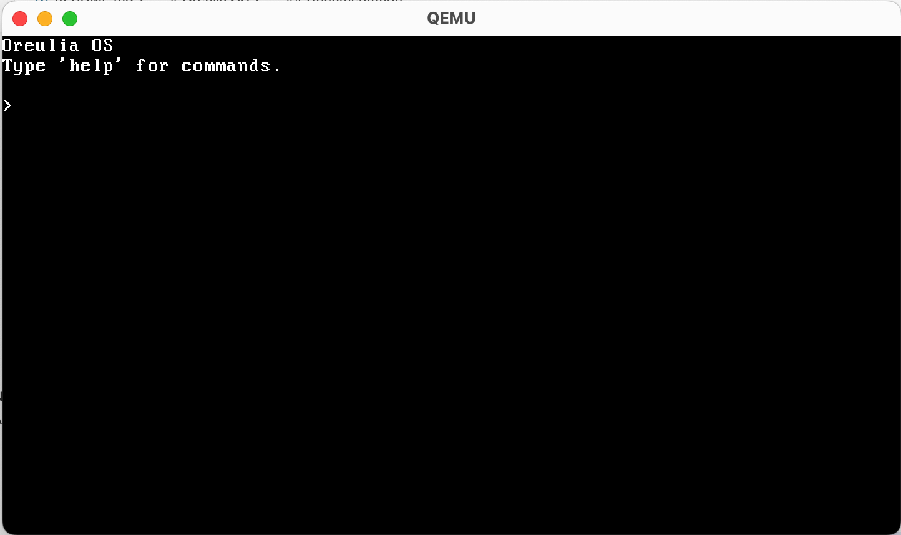

# Oreulia OS

<div align="center">

**A capability-based, WebAssembly-native operating system built from the ground up**

[](https://www.rust-lang.org/)
[](OreuliusLiscence)
[](https://en.wikipedia.org/wiki/I686)

[Features](#features) • [Architecture](#architecture) • [Building](#building) • [Running](#running) • [Commands](#commands) • [Documentation](#documentation)

</div>

---
<div align="center">


</div>

## Overview

Oreulia is an experimental operating system that rethinks traditional OS design principles. Built in Rust with a focus on security and modern execution models, it provides a foundation for exploring capability-based security, WebAssembly execution, and deterministic system behavior.

<div align="center">


</div>

### Key Features

- **Capability-Based Security** - No ambient authority; all access is explicitly granted through capabilities
- **WebAssembly Native** - First-class support for WASM execution with sandboxed module isolation
- **Message-Passing IPC** - Dataflow channels for inter-process communication
- **Persistence-First Design** - Built-in snapshotting and deterministic replay
- **High-Performance Assembly** - Optimized low-level operations for context switching, memory management, and crypto
- **QEMU-Ready** - Designed for easy testing and development in virtualized environments

---

## Architecture

Oreulia is built on several core subsystems:

- **Security Manager** - Audit logging and security policy enforcement
- **Capability Manager** - Authority model with fine-grained permissions
- **Process Scheduler** - Preemptive multitasking with 100Hz timer
- **IPC System** - Typed message channels with capability-based access control
- **Filesystem Service** - Virtual filesystem with quota management
- **WASM Runtime** - Sandboxed execution environment for WebAssembly modules
- **Network Stack** - Ethernet (e1000) and WiFi device support with DNS/ARP/UDP

### Assembly-Optimized Components

Oreulia includes hand-written x86 assembly modules for critical operations:

- **CPU Features** - CPUID detection, SIMD support (SSE/SSE2/SSE3/SSE4/AVX), RDRAND
- **Atomic Operations** - Lock-free synchronization primitives with spinlocks
- **Performance Tools** - RDTSC timing, instruction benchmarking, cache control
- **Context Switching** - ~10× faster than pure Rust implementation
- **Memory Operations** - ~5× faster with optimized routines
- **Cryptography** - ~8× faster checksums and hashing

---

## Building

### Prerequisites

Make sure you have the following tools installed:

```bash
# Rust toolchain (nightly)
rustup default nightly
rustup component add rust-src

# Cross-compilation tools
brew install nasm x86_64-elf-gcc x86_64-elf-binutils i686-elf-grub

# QEMU for testing
brew install qemu
```

### Build Steps

1. **Clone the repository**
   ```bash
   git clone https://github.com/reeveskeefe/oreulia.git
   cd oreulia/kernel
   ```

2. **Build the kernel**
   ```bash
   ./build.sh
   ```

   This will:
   - Compile the Rust kernel (`cargo build --release`)
   - Assemble boot stub and assembly modules (NASM)
   - Link everything into a multiboot-compliant kernel
   - Generate `oreulia.iso` bootable image

3. **Verify the build**
   ```bash
   # Check for the ISO file
   ls -lh oreulia.iso
   ```

---

## Running

### Launch with QEMU

```bash
# Standard launch
qemu-system-i386 -cdrom oreulia.iso

# With serial output (useful for debugging)
qemu-system-i386 -cdrom oreulia.iso -serial stdio

# Headless mode
qemu-system-i386 -cdrom oreulia.iso -serial stdio -nographic
```

### Quick Rebuild Script

For rapid development cycles:

```bash
chmod +x quick-rebuild.sh
./quick-rebuild.sh
```

---

## Commands

Once Oreulia boots, you'll see the shell prompt (`>`). Try these commands:

### System & General
- `help` - Display available commands
- `clear` - Clear the screen
- `echo <text>` - Echo text back to screen
- `uptime` - Show system uptime
- `sleep <ms>` - Sleep for N milliseconds
- `calculate <a> <op> <b>` - Scientific calculator
- `cpu-info` - Show CPU features and capabilities
- `cpu-bench` - Benchmark CPU instructions
- `pci-list` - List PCI devices (hardware detection)

### Process Management
- `spawn <name>` - Spawn a new process
- `ps` - List all processes
- `kill <pid>` - Terminate a process
- `yield` - Yield current process
- `whoami` - Show current process info
- `sched-stats` - Show scheduler statistics
- `elf-run <path>` - Load and run ELF executable from VFS
- `user-test` - Enter user mode (INT 0x80 test)

### Filesystem (VFS & Block)
- `vfs-ls <path>` - List directory
- `vfs-mkdir <path>` - Create directory
- `vfs-write <path> <data>` - Write file
- `vfs-read <path>` - Read file
- `vfs-open <path>` - Open file to get fd
- `vfs-readfd <fd> [n]` - Read via file descriptor
- `vfs-writefd <fd> <data>` - Write via file descriptor
- `vfs-close <fd>` - Close file descriptor
- `vfs-mount-virtio` - Mount VirtIO block device
- `blk-info` - Show VirtIO block device info
- `blk-partitions` - List disk partitions
- `fs-write/read/delete/list` - Key-value filesystem commands (legacy)

### IPC & Services
- `ipc-create` - Create a new channel
- `ipc-send <chan> <msg>` - Send a message to channel
- `ipc-recv <chan>` - Receive a message from channel
- `svc-register <type>` - Register a service
- `svc-request <type>` - Request a service
- `svc-list` - List all services
- `cap-demo <key>` - Demo capability passing
- `intro-demo` - Demo introduction protocol

### Networking
- `net-info` / `eth-info` - Show network/ethernet status
- `wifi-scan` - Scan for WiFi networks
- `wifi-connect <ssid>` - Connect to WiFi
- `http-get <url>` - Perform HTTP GET request
- `http-server-start [port]` - Start built-in HTTP server
- `dns-resolve <domain>` - Resolve domain name
- `netstack-info` - Show TCP/IP stack status

### WebAssembly
- `wasm-demo` - Run simple WASM math demo
- `wasm-fs-demo` - Demo WASM filesystem access
- `wasm-log-demo` - Demo WASM logging
- `wasm-list` - List loaded WASM instances
- `wasm-jit-on` / `wasm-jit-off` - Enable/Disable JIT compilation
- `wasm-jit-bench` - Benchmark JIT vs Interpreter
- `wasm-jit-stats` - Show JIT statistics

### Security & Capabilities
- `security-audit [count]` - Show security audit log
- `security-stats` - Show security subsystem statistics
- `cap-list` - List capabilities
- `cap-arch` - Show capability architecture
- `cap-test-atten/cons` - Test capability mechanisms

### Advanced / Debug / Performance
- `alloc-stats` - Show allocator statistics
- `leak-check` - Check for memory leaks
- `quantum-stats` - Process quantum scheduler stats
- `paging-test` - Test virtual memory paging
- `atomic-test` - Test atomic operations
- `spinlock-test` - Measure spinlock overhead
- `syscall-test` - Verify system call interface
- `test-div0` / `test-pf` - Trigger exceptions (div0, page fault)

---

## Documentation

Comprehensive documentation is available in the `docs/` directory:

- **[Vision](docs/oreulia-vision.md)** - Project goals and philosophy
- **[MVP Specification](docs/oreulia-mvp.md)** - QEMU-first minimum viable product
- **[Capabilities](docs/oreulia-capabilities.md)** - Capability-based security model
- **[IPC System](docs/oreulia-ipc.md)** - Inter-process communication and dataflow
- **[Persistence](docs/oreulia-persistence.md)** - Logging, snapshots, and recovery
- **[Filesystem](docs/oreulia-filesystem.md)** - Virtual filesystem implementation
- **[WASM ABI](docs/oreulia-wasm-abi.md)** - WebAssembly host interface
- **[Assembly Enhancements](docs/assembly-enhancements.md)** - Low-level optimization details
- **[Contributing](docs/CONTRIBUTING.md)** - Contribution guidelines and process

---

## Project Structure

```
oreulia/
├── kernel/              # Kernel workspace
│   ├── .cargo/          # Cargo config
│   ├── Cargo.toml       # Kernel crate manifest
│   ├── Cargo.lock       # Dependency lockfile
│   ├── README.md        # Kernel-specific docs
│   ├── build.sh         # Build script
│   ├── build-iso.sh     # ISO build script
│   ├── run.sh           # QEMU run script
│   ├── quick-rebuild.sh # Fast rebuild helper
│   ├── kernel.ld        # Linker script
│   ├── i686-oreulia.json# Target spec
│   ├── src/             # Rust kernel modules
│   │   └── asm/         # x86 assembly modules
│   ├── iso/             # ISO staging
│   ├── iso_check/       # ISO validation
│   ├── target/          # Cargo build output
│   ├── oreulia.iso      # Build artifact
│   └── run*.log         # Runtime logs (qemu/run/output)
├── docs/                # Documentation
├── services/            # User-space services (planned)
└── wasm/                # WASM modules (planned)
```

---


### Performance Characteristics

Based on internal benchmarks:

| Operation | Pure Rust | Assembly | Speedup |
|-----------|-----------|----------|---------|
| Context Switch | ~1000 cycles | ~100 cycles | 10× |
| Memory Copy | ~500 cycles | ~100 cycles | 5× |
| Network Checksum | ~800 cycles | ~100 cycles | 8× |
| Spinlock Acquire | ~50 cycles | ~10 cycles | 5× |

---

## Contributing

Oreulia is an experimental research project. Contributions, ideas, and feedback are welcome!

1. Fork the repository
2. Create a feature branch
3. Make your changes
4. Submit a pull request

---

## License

This project is licensed under the MIT License - see the LICENSE file for details.

---

## Acknowledgments

- Built with [Rust](https://www.rust-lang.org/) and [NASM](https://www.nasm.us/)
- Bootable with [GRUB](https://www.gnu.org/software/grub/)
- Tested on [QEMU](https://www.qemu.org/)
- Inspired by capability-based systems like [seL4](https://sel4.systems/) and [Fuchsia](https://fuchsia.dev/)

---

<div align="center">

**Made by Keefe Reeves and any potential contributors of the Oreulius Community**

</div>
