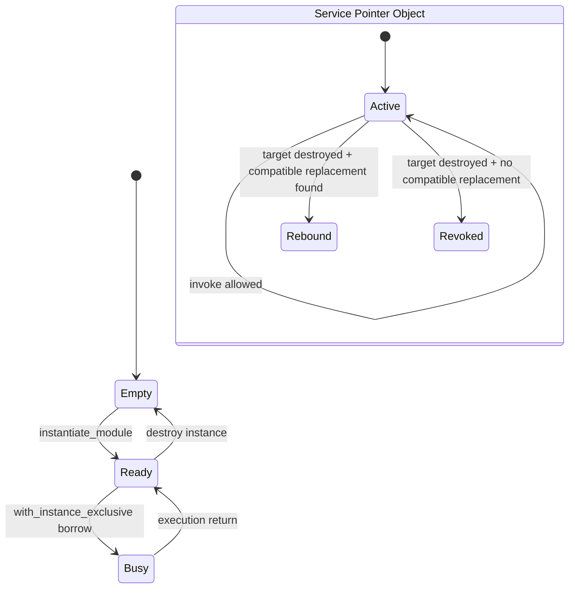
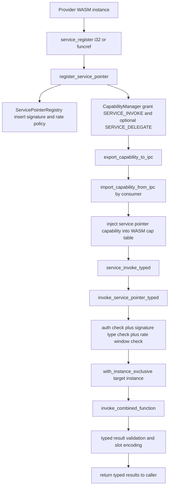

# Oreulia Function/Service Pointer Capabilities

## Directly Callable Capability Model for WASM Services

**Status:** Implemented (runtime + ABI + shell demos)  
**Kernel Domain:** `kernel/src/wasm.rs`, `kernel/src/capability.rs`, `kernel/src/commands.rs`

---

## 1. Abstract

Oreulia implements **Function/Service Pointer Capabilities** as first-class authority objects that bind to live WASM functions and can be invoked directly through capability mediation. This moves service invocation from an identifier/lookup model toward a capability-as-call-target model while preserving confinement, typed dispatch, and transfer attenuation.

The implementation provides:

- direct service-pointer registration from either `i32` function index or `funcref` (`ref.func`) selector
- capability-mediated invocation in both legacy (`u32` vector) and typed (`i64/f32/f64/funcref/...`) forms
- IPC transfer with delegate-right enforcement
- runtime lock hardening for nested/recursive host-call patterns
- hot-swap continuity through rebind-on-destroy semantics when compatible replacements exist

---

## 2. Motivation and Innovation

Traditional kernels typically expose callable services through:

1. syscall numbers
2. object IDs + RPC dispatch
3. handles requiring out-of-band protocol interpretation

Oreulia’s service-pointer capability model instead treats a callable authority as:

\[
\mathcal{S} = \langle \text{object\_id}, \text{owner\_pid}, \text{instance\_id}, \text{func\_idx}, \sigma, \rho \rangle
\]

where:

- \(\sigma\) is the full WASM signature (param/result types + arity)
- \(\rho\) is the rate policy state

This means invocation is no longer “lookup then call by convention”; it is “prove authority, prove type compatibility, then call target directly”.

---

## 3. Formal Model

### 3.1 Domains

- \(P\): process identifiers
- \(I\): wasm instance identifiers
- \(O\): service-pointer object identifiers
- \(C\): capabilities held by processes
- \(V\): WASM runtime values (`i32`, `i64`, `f32`, `f64`, `funcref`, `externref`)
- \(\Sigma\): function signatures

### 3.2 Signature

For function \(f\), define:

\[
\sigma(f) = \langle (\tau_0,\ldots,\tau_{n-1}), (\upsilon_0,\ldots,\upsilon_{m-1}) \rangle
\]

with parameter types \(\tau_i \in T\), result types \(\upsilon_j \in T\), and \(T = \{i32, i64, f32, f64, funcref, externref\}\).

### 3.3 Authorization Predicate

Invocation of object \(o\) by process \(p\) is permitted iff:

\[
\operatorname{AuthInvoke}(p,o) \equiv \exists c \in C_p :
\left(
  c.\text{type} = \text{ServicePointer}
  \land c.\text{object\_id}=o
  \land \text{SERVICE\_INVOKE} \in c.\text{rights}
\right)
\]

### 3.4 Typed Invocation Safety Predicate

Given argument vector \(a=(a_0,\ldots,a_{n-1})\):

\[
\operatorname{TypeSafe}(a,\sigma) \equiv
\left(|a|=n\right) \land \bigwedge_{i=0}^{n-1}\operatorname{match}(a_i,\tau_i)
\]

Only if `AuthInvoke` and `TypeSafe` are true does execution proceed.

### 3.5 Transfer Predicate

For IPC export of service-pointer capability \(c\):

\[
\operatorname{TransferAllowed}(c) \equiv \text{SERVICE\_DELEGATE} \in c.\text{rights}
\]

---

## 4. Implementation Mapping

| Component | Role | Kernel Mapping |
|---|---|---|
| Service pointer registry | Global object-to-target mapping with rate policy | `ServicePointerRegistry` in `kernel/src/wasm.rs` |
| Authority check | Runtime invocation rights check | `check_capability(... SERVICE_INVOKE ...)` |
| Delegate gate | IPC export restriction | `export_capability_to_ipc` in `kernel/src/capability.rs` |
| Typed invoke path | Full typed ABI for args/results | `host_service_invoke_typed` + `invoke_service_pointer_typed` |
| Legacy invoke path | Compatibility bridge over typed core | `invoke_service_pointer` |
| Lock hardening | Prevent global runtime mutex re-entry deadlock | `WasmRuntime::with_instance_exclusive` |
| Hot-swap continuity | Rebind pointers to compatible replacement instances | `revoke_service_pointers_for_instance` + `find_service_pointer_rebind_target` |
| Shell verification | End-to-end demos | `svcptr-demo`, `svcptr-demo-crosspid`, `svcptr-typed-demo` |

### 4.1 Architecture Diagrams

State machine (runtime slot + service-pointer lifecycle):

Call flow (registration, transfer, and typed invoke):

---

## 5. Registration Semantics

Registration call:

\[
\operatorname{Register}(p, i, s, d) \rightarrow \langle o, cap\_id \rangle
\]

Inputs:

- \(p\): owner process
- \(i\): target instance
- \(s\): selector (`i32` index or `funcref`)
- \(d\): delegate flag

Runtime steps:

1. resolve selector to combined WASM function index
2. require target to be defined function (not host import)
3. capture immutable signature snapshot \(\sigma\)
4. allocate object \(o\)
5. install registry entry with default rate policy
6. grant owner capability with rights:
   - always: `SERVICE_INVOKE | SERVICE_INTROSPECT`
   - optional: `SERVICE_DELEGATE` iff \(d \neq 0\)

Default policy values in current implementation:

| Field | Value |
|---|---|
| `max_calls_per_window` | 128 |
| `window_ticks` | PIT frequency (`hz`) |
| `window_start_tick` | current tick |
| `calls_in_window` | 0 |

---

## 6. Invocation Semantics

### 6.1 Legacy Path

Legacy call shape:

\[
\operatorname{InvokeLegacy}(p,o,[u32]^k) \rightarrow u32
\]

This path converts each `u32` to `Value::I32` and delegates to typed invocation. It is intentionally compatibility-only and enforces i32-compatible return semantics.

### 6.2 Typed Path

Typed call shape:

\[
\operatorname{InvokeTyped}(p,o,[V]^n) \rightarrow [V]^m
\]

Enforcement:

1. `AuthInvoke(p,o)`
2. registry object active
3. `TypeSafe(args, sigma_entry)`
4. rate window acceptance
5. runtime signature consistency against live function
6. typed result validation against declared result types

---

## 7. Typed ABI Encoding

Typed host ABI (`service_invoke_typed`) uses fixed-size slots:

\[
\text{slot\_size} = 9\ \text{bytes}
\]

Layout:

| Offset | Size | Meaning |
|---|---|---|
| 0 | 1 byte | kind tag |
| 1..8 | 8 bytes | little-endian payload |

Tag mapping:

| Tag | Type | Payload |
|---|---|---|
| 0 | `i32` | zero-extended 32-bit integer |
| 1 | `i64` | 64-bit integer bits |
| 2 | `f32` | IEEE-754 bits in low 32 bits |
| 3 | `f64` | IEEE-754 64-bit bits |
| 4 | `funcref` | function index or `u64::MAX` for null |
| 5 | `externref` | ref-id or `u64::MAX` for null |

Encode function:

\[
\operatorname{Enc}: V \rightarrow \{0,1\}^{72}
\]

Decode function:

\[
\operatorname{Dec}: \{0,1\}^{72} \rightarrow V \cup \{\bot\}
\]

with \(\operatorname{Dec}(\operatorname{Enc}(v)) = v\) for all supported runtime values in the profile.

---

## 8. IPC Transfer Semantics

Service-pointer capability transfer is mediated by authenticated IPC capability attachments.

Export rule:

\[
\neg\operatorname{TransferAllowed}(c) \Rightarrow \operatorname{Export}(c) = \text{deny}
\]

Import rule:

\[
\operatorname{Import}(cap) =
\begin{cases}
\text{grant}, & \text{token verifies} \land \text{object exists} \\
\text{deny}, & \text{otherwise}
\end{cases}
\]

The object-existence check for service-pointer imports ensures dead object IDs are not materialized as live authority in receivers.

---

## 9. Concurrency and Runtime Safety

### 9.1 Runtime Slot State Machine

WASM runtime slot states:

| State | Meaning |
|---|---|
| `Empty` | no instance |
| `Ready(instance)` | instance available |
| `Busy(pid)` | instance exclusively borrowed for execution |

State transition for exclusive execution:

\[
\text{Ready}(x) \xrightarrow{\text{borrow}} \text{Busy}(pid_x) \xrightarrow{\text{return}} \text{Ready}(x)
\]

This allows host-call re-entry patterns without holding the global runtime mutex during actual execution.

### 9.2 Deadlock-avoidance Rationale

Previously, invocation under a global lock could create composability risk when a host path recursively touched runtime state. Exclusive extraction now detaches instance execution from global lock lifetime.

---

## 10. Hot-Swap Continuity

On instance destroy, service pointers are processed by:

\[
\operatorname{RebindTarget}(e) =
\arg\min_{i' \in I}
\left[
i' \neq i_{retire}
\land \operatorname{owner}(i')=\operatorname{owner}(e)
\land \operatorname{resolve}(i', f_e)=\text{defined}
\land \sigma_{i'}(f_e)=\sigma_e
\right]
\]

If a compatible target exists, pointer entry is rebound. Otherwise, associated capabilities are revoked.

This preserves continuity for stable function identity/signature across replacement instances while remaining fail-closed when no safe target exists.

---

## 11. Lemmas and Corollaries

### Lemma 1 (Authority Soundness)
If invocation returns success, then caller held a service-pointer capability granting `SERVICE_INVOKE` for the invoked object at time of check.

**Sketch:** invocation path rejects before execution unless capability check passes over object/type/rights triple.

### Corollary 1.1
Object ID knowledge alone is insufficient for invocation.

---

### Lemma 2 (Transfer Attenuation Gate)
A service-pointer capability lacking `SERVICE_DELEGATE` cannot be exported via IPC attachment.

**Sketch:** export path performs an explicit type+right guard and returns error on missing delegate right.

### Corollary 2.1
Invocation authority and delegation authority are orthogonal and independently enforceable.

---

### Lemma 3 (Typed Dispatch Safety)
For typed invocation, if `TypeSafe(args, sigma)` fails, function body execution is not entered.

**Sketch:** type mismatch is detected in registry/dispatch checks before `invoke_combined_function` is called.

### Corollary 3.1
ABI-level type confusion (e.g., `f64` where `i64` required) is fail-closed.

---

### Lemma 4 (Global Lock Non-Reentry)
Under `with_instance_exclusive`, instance execution does not occur while the runtime global instance table lock is held.

**Sketch:** instance is moved out of table to `Busy` sentinel before callback execution and reinserted after callback completes.

### Corollary 4.1
Nested host paths can query runtime metadata without self-deadlocking on the same global mutex.

---

### Lemma 5 (Rebind Safety)
Destroy-time rebinding only targets instances with same owner, resolvable function index, and exact signature match.

### Corollary 5.1
Hot-swap continuity cannot silently alter callable type contract.

---

## 12. Complexity Notes

Let \(N = \text{MAX\_SERVICE\_POINTERS}\), \(S = \text{active runtime slots}\).

| Operation | Complexity |
|---|---|
| register pointer | \(O(1)\) average registry insertion (bounded scan worst-case \(O(N)\)) |
| invoke resolve | \(O(N)\) worst-case object lookup in fixed array |
| destroy rebind pass | \(O(N \cdot S)\) bounded by small fixed constants in profile |
| typed encode/decode | \(O(k)\) for \(k\) args/results |

Given fixed kernel bounds (`N=64`, runtime slots `=8`), all paths are deterministic and bounded in practice.

---

## 13. Verification and Demos

Current verification surfaces:

- `formal_service_pointer_self_check()` validates registration/delegation/revocation core invariants
- `service_pointer_typed_hostpath_self_check()` validates mixed-type typed invoke host path (`i64`, `f32`, `f64`, `funcref`)
- shell demos:
  - `svcptr-demo`
  - `svcptr-demo-crosspid`
  - `svcptr-typed-demo`

---

## 14. Security and Production Notes

What this feature now guarantees:

- authority-gated callable capabilities with explicit rights
- typed invocation enforcement over WASM value domains
- transfer attenuation for delegated authority
- lock-safe runtime composition under nested call structures
- continuity-aware pointer rebinding during instance lifecycle changes

Remaining profile boundaries are inherited from the broader WASM/runtime profile (opcode coverage, feature proposals, and non-service-pointer subsystems), not from the service-pointer capability mechanism itself.

---

## 15. Summary

Oreulia’s Function/Service Pointer Capability system operationalizes “capabilities as callable authority” rather than “capabilities as passive handles.” The implementation is not a conceptual stub: it is integrated across ABI, capability transfer, typed dispatch, runtime safety, and lifecycle continuity, with explicit shell-level and programmatic verification paths.
