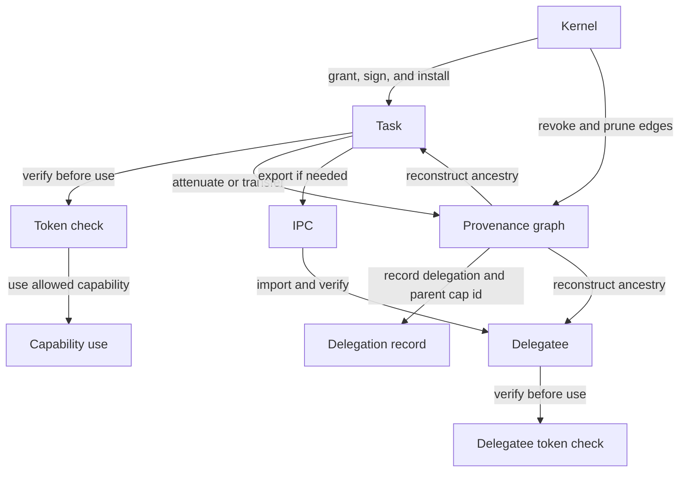

# The Oreulius Capability Security Subsystem

The oreulius capability security subsystem is the kernels authority system, designed for tasks like defining the rights as bitflags, storing capabiltiie sin per task tables, signing the capabilties with a kernel MAC so they cannot be forged by tasks.

Or other important duties in the systems run time, such as verifying a capability is valid before use, attenuating capabilties so rights can be reduced rather than increased, tracking delegation and provenance chains. Recording capaility creation, use transger, and revocations in the audit trail.

It supports the remote capaility leases through the capnet, applies quota time and transfer constraints and checks for right escalation and delegation cycles.


## What It Does
Compared to other capability based systems, capabolities are not just permissions, they are actual kernel owned objects, with dienity, rights, provenance, and cyrptographic verification. These rights can be narrowed, but not widened, and the subsystem trerats delefation as a graph problem not just a token lookup.

Other things that differntiate it from other capability based kernels and operating systems, it integrates with the IPC, the filesystem, security logging, the termporal restore, and remote lease handling all in the core.

## Why It Exists

So capailities can be signed by the kernel, so the verification checks both integruty and the type/right match. so invalid capability use is logged as a security event. So that remote leases expire, can be revoked, can be bounded by use counts and time. So the graph code can reject escalation and cycle patersn and that the validation helpers fail closed on noce mismatch, rights escalation or invalid coditios, and that the overall operating system has a next level and forward thinking capability system that is enforced across the whole kernel.

It exists so the kernel can be told who is allowed to do what, so that things can be issued kernel issued tokens, so that the kernel prevents privilged widening, and  so that the kernel can keep a record of where authority came froma and where it went


## 1. Module Inventory
This is the list of capability subsystem pieces and what each one is responsible for.

It is broken down into these effective parts:

1. the main capaility manager that holds and validates capabilities.
2. the capability graph which tracks delegation and checks for cycles or escalation
3. the security validation helpers that check nonce, rights and transfer constraints
4. the security subsystem that records audit, events, and enforecement results.
5. the IPC layer that can export and import capability related states
6. The temporal layer can restore capaility related snapshots
7. The CapNet path that handles remote leases.

these act together as a wole to keep authority handling seperated from the normal kernel work, and to make the code easier to verify.

It also limits how much of the system any one capability path can actually impact, and let the kernel audit, revoke, and restore the capability state in a controlled way.

### Token definitions
Token definitions are the capability record and the signed payload that proves the capability is valid. In essence, the token is the kernel’s signed seal on that record. Without the token, the record is just data. With the token, the kernel can trust that the capability was issued by the kernel and has not been tampered with.

A good way to think about that record is as a signed authroty card, that says who issued it, what it is allowed to do, what object it applies to, and when it was granted. Also it says wether it came from another capability.

The rercord is the capability object, the current capability objects are as follows:
| Record field | What it means | Why the token signs it |
|---|---|---|
| cap_id | Local capability slot ID | Prevents the capability from being moved or relabeled without detection |
| object_id | The kernel object the capability refers to | Binds the authority to one specific target |
| cap_type | What kind of capability it is | Prevents a channel, filesystem, or task capability from being misrepresented as another type |
| rights | What actions it allows | Stops rights from being widened silently |
| origin | Which process the capability came from | Preserves provenance and auditability |
| granted_at | When the capability was issued | Binds the capability to the grant event |
| label_hash | Optional debug or audit label | Keeps the label tied to the signed record |
| parent_cap_id | Which capability it was derived from | Preserves delegation and attenuation lineage |

The tokens then prove the records fields, the token distribution in the code works like this:
| Token check | What it proves |
|---|---|
| token | The capability was issued by the kernel and carries a valid signed proof |
| verify_token() | The stored token still matches the capability record |
| sign() | The kernel created or refreshed the proof for that record |
| token_payload() | The exact record fields that were signed together |

The flow between the records impacting the tokens work like this, the record holds the various data such as the capability ID, the object ID, the capability type, the rights, the origin, where it was granted at, the hash label, and the parent capability ID,

Thus, the data gets serialized by the token_payload() function into a fixed byte array, and then signed into the feed as a payload to the kernel MAC and stored as a token. this is thus verified through the function verify_token() and chekcd whether the stored token still matches the capability record.

To understand that better, you need to understand that the capability record exists as fields in the memory, the token_payload() function serializes those fields into bytes, the kernel signs those bytes, the stored token is checked later against freshly rebuilt payloads to ensure it matches and is consistant with the original intent.


So when any of the records changes, the kernel rejects the capability as invalid so that the security is never compromised and nothing can ever be forged.

### So, what if someone tampered with the memory and thus, the orginal record itself.
Well, if someone does tamper with the memory, the capability system is designed just for cases like this, so that tampering can be detected and rejected.

The capability records live in kernel owned tables, each capabilits signed capaility goes through the lookup() function to check the stored token before trusting a capability. the verify token recomputes the payload from the current record fields and compares, so that any important "field changes" (What would happen if the memory gets tampered with) would be detected against the token. The kernel treats that capaility as invalid, and invalid use is logged as a seucirty event.

It goes through owership, authentication, verification, suset rules, graph checks and audit.

Metaphorically, not mathematically literally, the kernel owned tables can be viewed as a inverse matrix that makes the source of the security issue a part of the protection, so its gated on either side (The memory and the token creation)

The signed proof is the core of what makes either incompromosible.

### So the question left is can you compromise the signed proof?
In the current state, it is incredibly difficult to put signed proof into a state that would allow the signed proof to be compromised.

This would require a complete and total systemic compromise and take over the system. The code at the current state makes it hard to forge or silently tamper with, but it is still a software system  and it dpends on the kernel staying trusted.

What prevents compromise currently is capabilities living in the kernel per-task capability tables, not user controlled memory. Lookups going through the table, not through raw caller input.

Through the signed capability tokems, such as each capability having a necessated and signed token field, that is verified on each time it is enacted upon by the kernel.

via the payload binding where the signed payload needs to include important identify fields, such as cap_id, object_id, cap_type, rights, origin, granted_at, label_hash, parent_cap_id, and if any of those fields get tampered with or forged the token check fails.

It is protected on another angle from the fail-closed validation system where the lookup() further rejects entries if the token does not verify so the token cant be falsified as an entirely new token via replacing the old token mathcing the machine opcodes or other various "counterfeiting checks".

Everythign is then rights attenuated onlu, which means only a subset of each rights is then sliced out for each capability per action, think of it as a determinsitc but advancely determisnist and complex intelligence the kernel has.

After that, there are further delegation checls where the rights if escalated or just excessive in the capability rejects the capability.

Capabilitys can be removed from the table should they be implemented not follwing the kernels strict structure, and remote leases are then revokes and there is quentine support for isolating capabilitys.

The audit trail can then give you clarity if anytihng goes wrong, because that is another security measure that should never be left out, no matter how secure a system claims to be, thinks it is, OR even actually is as claimed.

Remote leases have constains, so capnet leases use budgets and owner scoping that keep the remote capability use bounded in time and strict to the scope.

it is hard to break because you cannot do these things.
1. a task cannot just be invented as a valid token
2. a task cannot make a forged record pass verification if the payload changes.
3. delegation is checked for cycles and escalation
4. invalid capability states are rejected before each use.

But. in terms of is there a current possbility to compromise that critical point in the secutity?

Well, in the current state, the tampering is not imposible if the kernel itself is compromised physically, perhaps within the organzation using the kernel when someone who you trust to access it uses it wrong. It is not memory corruption bug proofed, bugs get discovered all the time, and we try to validate that and fix bugs as soon as reported within a short and prompt timeframe. They become a priority over all other project maintenance when reported.

>Please read: SECURITY.md in the root and email bugs privately to `reeveskeefe@gmail.com` for bug reporting!

It does not replace the need for proper kenrel memory safety and correct implementations in the code.

It may not be totally impenetrable when looking at it from a proper security philosphy that all tech should follow, but it does make a layer fail-closed and kernel authenticated explicit verifiable and narrow, limited compromise surface. Infact it is extrememly, almost excessivly small attack surface. Which makes it not the best general purpose OS when looked at its potential when made as a desktop OS. But that does not discount its ability to be a desktop OS. Even if that isn't the goal of oreulius in the current term, medium term and near long-term future.

#### what we are going to do to harden the software even further
While you cannot make any software totally bullet proof, you CAN infact always introduce further measures and review security for improvements in a agile way.

Upon review here are the things we have planned for future dev cycles to increase security:

**Phase one:**
| Measure | Why it helps |
|---|---|
| Remove the hardcoded fallback key in SecurityManager::new() | Prevents a predictable key from existing before init() runs |
| Fail closed until SecurityManager::init() succeeds | Stops capability issuance before real key material is ready |
| Rotate the capability signing key per boot | Makes old proofs useless after reboot or rekey |
| Derive per-subsystem or per-table subkeys from a master key | Reduces the blast radius if one context leaks |
| Add a random per-capability nonce or serial to the payload | Prevents replay or copied-record attacks from staying valid |
| Add a boot-session ID or key epoch to the payload | Binds proofs to the current kernel session |
| Keep key material in zeroizable, non-swappable kernel memory | Makes key extraction harder |
| Zeroize old keys on rotation | Reduces memory-residue exposure |
| Use a dedicated MAC format with versioning and algorithm agility | Makes future upgrades and stronger authentication easier |
| Make token comparison constant-time | Avoids side-channel leakage during verification |
| Extend the formal checks to cover sign/verify round trips | Catches serialization and verification regressions early |
| Seal remote lease keys behind attestation or a hardware root of trust when available | Strengthens cross-device and remote capability trust |
| Keep capability tables writable only through the manager path | Prevents accidental or concurrent tampering of live records |

**Phase two**
There is a hardcoded default token key in SecurityManager::new() function, which is fine as a bootstrap conviencinec but we need to remove that before we pass the alpha and replace it with a capability issuance until we have a dynamic and capability tied boot-time key. So we will need to create a module that allows this to materialize into a algorithim

What this would give Oreulius:
1. no fixed default key
2. per-boot rekeying
3. per-table/per-subsystem derived keys
4. nonce or sequence binding in the payload
5. constant-time verification
6. zeroized key memory
7. hardware-sealed keys if the platform supports it


### Deep dive into the parent capability
The parent capability is important enough to get its own little subsection because its waht makes capability lineage deeply visbile and verifable.

It does these things for the proof;

1. It records where a capability came from,and when it was attenuated or transferded.
2. it lets the build_chain() funciton in the rust code reconstruct the full provenance chain
3. it helps the kernel audit the deleagation instead of treating every capability as unrelated.
4. it is included in the signed payhload so the lineadfe changes invalidate the token.
5. it links directly into the graph and the IPC import/export paths.

It's not important becasue it grants authority, but because it explains each asepct of authority to the chain of events.

The parent capability is represented as parent_cap_id

If rights says what the capability can do, and if tokens prove the capability is real, then the parent capability says where the capability even came from. This makes it incredibally difficult to forge the proof even further, even in the current pre-hardeded context that will later be bolstered in future dev hardening cycles.

Its important to note it is seperate from origin, the two work together at making the proof on a next level difficulty of forging without first hand access to the kernel.

### the Origin field
The origin isnt a function in the capability code, it is infact a field on the record.

To see how it adds a layer of authenticity checks to the parent capability it is best represented under a table:
| Field | What it means | How it works with the other one |
|---|---|---|
| origin | The process that introduced the capability into the system | Stays attached to the capability as process-level attribution |
| parent_cap_id | The capability this one was derived from | Tracks capability-level ancestry and delegation |

so when Oreulius creates a new capability, it sets a origin as a field when the capability gets first created. then it attenuates the same origin but sets a parent capaility to it, so that when it transers, it ensures it matches the origin on any any delegated copy.

Any chains built based off the capability must mathch the orgigin and the capability on any delegated copy. After that the delegation graphs the ancestral walk so that any payloads must include the origin or it breaks the token verification. it is essentially two deep checks in the multi-tude of checks on top of them.

Anything rebuilt must restore the origilnal origin and capaility when things go through the IPC.

origin answers who originally introduce the capability, and the parent capability ID answers which capability did this come from. The origin is the process-level source, and the paret capability ID is the lineage level source. BUT, both act as hidden stamps of anti-counterfitting measures of authenticity in the fibres of the being of the capability. The origin is apart of the signed payload, and the parent_cap_id is tracked seperately and used by the graph/IPC paths.


## 2. Foundational Principles

There are 9 foundational principles implemented in the capability module in the kernels SRC folder.

### 2a Explicit authority
As in nothing is allowed by default, because any task needs a capability to do anything meaningful with a protected object.

### 2b Kernel-Issued, kernel-verified authority
As in capabilities are created by the kernel, they must carry a signed token, and the kernel checks that token before trusting the capability.

### 2c Least Privilage
Aas in, rights can be reduced and never widened, the attenuate() function thus can allow allow a subset of pre-existing rights. Thus the validation of those subset of rights and invariant checks always must reject any form of escalation EVEN if they are benign.

### 2d Provenance
As in the origin records which process introduces the capability, the parent capability id records which capability it came from and together they let the kenrel reconstruct the authority so it loosens rigidity while retaining the same level of authority

### 2e Object Binding
As in, the capability is tied to a specific object id, so it cannot be a generic permission binding blob. Guarded by a token that binds to the object too.

### 2f fail-closed
As in, if verification fails the capability must be rejected. Even if it creates a pain in the behind. As in, if the delegation contraints fail, it is rejected. As in, if the graph check finds escalation or a cycle, it is rejected.

### 2g Auditable authority
As in, if the capability is granted, transfered revoked, or in an invalid state, it is all logged. That the authority changes are visibile and never silent.

### 2h bounded transport.
As in, if the capabilities can move through the IPC, they must still ALWAYS be revalidated when important, and that remote or transferred authority is not trusted just because it arrived over a channel

The foundational principles are built on explicit, kernel issued verification. in all cases through those 9 forms of enforcement, and they must all align, must all pass and must all be available. This includes the users responsbility and giving them the tools to do so if they see fit.


## 3. Architectural Flow
Authority moves as a directed provenance graph of signed capability records. For one capability, that becomes a provenance chain.

### 3.1 Kernel → Task → Delegatee

These are the source componenets of flow events. They produce these events

- Kernel: grant, sign, install, verify, revoke
- Task: hold the capability, use it, attenuate it, or transfer it
- Delegatee: receive the narrowed or transferred capability and use it under the new authority

The kernel creates the capability and signs it.
The task receives it in its capability table.
The task uses it only after verification.
If allowed, the task either attenuates or transgers it.


The delegatee receives the new capability, then
the kernel records the provenance with parent_cap_id and the delegation graph.

If the capability moves through IPC, it becomes exported then re-imported verified.

If policy allows it, the kernel can revoke or quarantine it. Then, the kernel can later reconstruct the chain with build_chain().

Therefore authority flows from the kernel to a task, and from that task to a delegatee only through signed, verified, and provenance-tracked capability records.

Heres a chart that shows how things work from kernel, to task to delegatee in a more detailed arraged manner



### 3.2 Decision Tree
The decision tree is a fail-closed gate. It does these things.

1. if the pid is 0, the kernel allows it to go through immediately
2. if there are any quarentined capabilities where the cooldown has expired, then the kerenl tries to restore those capabilities.
3. If the security manager sees a process trying to access a capability, it records an intent probe for that request.
4. If a current process is restricted, the kernel revokes the mathcing capabilities, logs the denial and stop here, this part of the decision tree is called the predictive restriction check.
5. the security manager applies its own validation and rate limit checks under the capability validation gate, and if they fail, the request is denied immediately.
6. The kernel scans the process's capability table, and each candidate is checked with verify_capability_access() function for a valid token, the correct capability type, and the required rights.
7. When a local capability matches, the kernel checks whether that the capability is actually even mapped to a remote lease. The remote lease should say allow, and if so, the access is granted. This is the remote lease evaluation phase of each decision phase process.
8. If the local capability doesnt say allow, or no local capability suceeds, the kernel checks the capnet remote leases then moves onto phase 9.
9. this is the final denial phase. if nothing matches, the request is denied and logged.

The decision tree asks these questions,
is the kernel trusted? is the quarentine clear? is it restricted? is it rate-limited? is it even a valid local capability to begin with? will the remote lease allow it? and should if not, to otherwise deny it.

#### Intent probe deep dive
The intent probe is not a authorization check, but rather a signal record where the security manager watches what the process is trying to do.


It records the process ID, the capability type, the rights mask, and the object hint.

It can be used for building behavioral history, detecting suspicious access patterns, feeding the predicitve restriction syste, and generating audit and anomaly telemetry.

On its own, it does not grant access, deny access, or replace the necessity of the capability table look up.

Its just simply there to decipher what process is attempting to get what type of capability access, and decides whether it is normal, suspicious, or needs restriction.

When looking at it's placement and action within the decision tree, it happens before the kernel checks the predictive restriction,before the capability lookup, and before any remote lease fallback.

#### How the capability validation gate works in the decision tree
This is a complex part of the decision tree and earns its own little subsection to help explain how it works.

Its basically a policy checkpoint that the kernel must follow before searching the capability table.

It first asks the rate limiter whether this process is still allowed to make this request, if the limiter says no, the request fails immediately. it checks the requested access, and passes only if actual rights contain required rights. if it fails, its like another access point it must cross. like a border, where if it fails, it gets blocked, denied access, and logged.

Its not a token verification step, not a table look up step, nor is it an object type match step. Those steps happen later in the decision tree. it helps keep resource efficiency in check, keeps the potential to develop hacks deeper in the major places where you can counterfeit and fraud on a even deeper level, and creates one more obstacle for people with first hand access to the kernel within orgs.

### 3.3 CapNet Remote Lease Lifecycle
The remote lease lifecycle refers to how the kernel accepts, installs enforces, and revokes the remote capabilities it recieves over the CapNet. Its how a remote machine can offer a siged capability token over the CapNet. If a token is valid, the local kernel turns it into a temporary local lease of authority. this lease can allow access to a kernel object, but only within the tokens limits.

The tokens limits on each lease can include these things:
1. right bits
2. object ID
3. time window
4. Use budget
5. Peer identity
6. session key
7. revocation status

In the remote capability lease, it stores various important bits of data that is rigidly used to enforce whether something is authentic in the capability system from each oreulius machine

| Data Stored in the lease over the capnet | What it means or is for |
|---|---|
|token_id| Identity of the remote token|
|mapped_cap_id| this is the local capability id if thelease is mapped into a process table|
|owner_pid and owner_any| these assess wheter the lease is bound to one process or is usable by any local process|
|issuer_device_id| the id of the remote device that issues the lease|
|measurement_hash and session_id| used for remote and trust session bindings|
|object_id, cap_type and rights| determines what object is being passed over, what type the capability is, and what actions it should grant,|
|not_before and expires_at| the time window that gets enforced over each token and capability being passed over the CapNet|
|uses_remaning| this is an optional bounded-use counter that can be set to limit the amount of times something can be used|
|revoked and active| these determine the lifecycle state assigned by the kernel|

#### On that lifecycle in the last column of the table...
The lifecycle can be understand under this flow
1. remote peer sends a TokenOffer Frame where the capnet decodes the control frame
2. the frame itself becomes authenticated, and the kernel checks the target device id, the peer session key epoch (each iteration of the key being passed down)
3. the embedded capability token is validated, then the TokenOffer function chekcs the token length, the canonical token id, the token encoding, the temporal validity, the measurement binding, the session MAC address, and the nonce replay
4. delegation rules are check, and if the token is derived from another token, the function verify_delegation_chain() makes sure it does not widen authority.
5. the token becomes a local remote release, and the function install_remote_lease_from_capnet_token() then converts the CapNet token fields into local capability-manager fields. then install_remote_lease() istalls or updates the lease manager.
6. if the capability sent over the network is process-bound, it gets local mapping. For example, if the token context does not equal 0, the lease is bound to that PID and gets a real local mapped ID under mapped_cap_id, if the context is 0, than anyone owns it, and the function owner_any can be used to check if it has an unmapped lease fall-back.
7. on use, the lease is always rechecked, the normal capability hot path first tries local capabilities, then, it falls back to active remote leases. the remote checks enforce these things:
a) active/ not revoked
b) type
c) object id
d) time window
e) rights
f) use budgets
8. when it comes time to remove the local mappings, the functiong TokenRevoke calls the function apply_token_revocation(), adds tombstones and cascades through delegated children, and persists the revocation infor and calls the revoke_remote_lease_by_token() to remove local mappings.

The point of the cap net remote lease lifecycle is so that all remote authority issues from one oreulius device to another is not blindly trusted, it is only accepted after the capnet session verifies the token mac, anti-replay checks, delegation checks, temporal checks, and then can only be installed as a bounded local lease that espires, runs out of uses or be revoked.

#### What commands in the remote lease lifecycel should and shouldnt do
Currently the rmeote lease lifecycle has various commands already implemented.

|capnet remote lease command | what it does |
|---|---|
| capnet-lend <ip> <port> <peer_id> <cap_type> <object_id> <rights> <ttl_ticks> [context_pid] [max_uses] [max_bytes] [measurement] [session_id] | Creates and sends a remote lease offer to another CapNet peer. It says: this peer may use this object, with these rights, for this amount of time, optionally limited to a process, number of uses, byte budget, measurement, or session. |
| capnet-accept <ip> <port> <peer_id> <token_id> [ack] | Sends an acceptance message for a lease token. It tells the peer that a specific offered token was accepted or acknowledged. |
| capnet-revoke <ip> <port> <peer_id> <token_id> | Sends a revocation message for a lease token. It tells the peer to tear down that remote lease, revoke matching delegated children, and remove any local mapping created from it. |
| capnet-lease-list | Shows the active remote leases currently installed in the local kernel. It is used to inspect which tokens are active, who owns them, what object/type they apply to, and when they expire. |

for exmaple using the capnet-lend command would look something like this out in the field:

Example:

capnet-lend 192.168.1.50 48123 0x123456789abcdef0 filesystem 0x1000 0x00000001 5000 42 10 0 0 7

This means:

Send a remote lease offer to peer 0x123456789abcdef0 at 192.168.1.50:48123. The lease is for a filesystem capability on object 0x1000, with rights 0x00000001, valid for 5000 ticks. It is bound to process 42, can be used at most 10 times, has no byte quota, has no measurement binding, and is bound to session id 7.

The missing or weak area is peer/session setup and lifecycle management around them

These are the commands that will need to be made in future dev cycles so that you can set up the capnet, those commands will be as follows.

| needed command | what it would do |
|---|---|
| capnet-session-key <peer_id> <epoch> <k0_hex> <k1_hex> | Install a CapNet session key for a peer from the main native shell. This already exists in commands_shared.rs, but does not appear wired into the main commands.rs dispatcher. |
| capnet-session-show <peer_id> | Show whether a peer has an active session key, key epoch, replay state, and last-seen tick. |
| capnet-session-clear <peer_id> | Remove a peer’s session key and force future lease commands to fail until a new session is installed. |
| capnet-peer-remove <peer_id> | Remove a peer from the CapNet peer table. Currently there is peer add/show/list, but no obvious removal command. |
| capnet-lease-revoke-local <token_id> | Revoke a locally installed remote lease without sending a network revoke frame. Useful if the local kernel wants to drop trust immediately. |
| capnet-lease-clear-expired | Sweep expired or exhausted leases and remove stale local mappings on demand. Some cleanup happens during install/use, but a direct operator command would make it explicit. |
| capnet-lease-show <token_id> | Show one lease in detail, including issuer, owner, object, rights, expiry, use budget, mapped cap id, measurement, and session id. |
| capnet-handshake <ip> <port> <peer_id> | Higher-level setup command that registers/checks a peer, exchanges hello/attest/heartbeat, and establishes or verifies a session before lend/revoke commands are used. |
| capnet-lifecycle-check <peer_id> | Preflight command that says whether lend/accept/revoke can work for this peer: peer exists, trust policy ok, measurement ok, key epoch installed, network reachable, and local identity initialized. |

The most important immediate one is wiring capnet-session-key into the main shell dispatcher, because without a peer session key, TokenOffer/TokenAccept/TokenRevoke frames cannot be signed and verified properly for real peer-to-peer use.


The next issue is with the current state of the exisitng capnet-lend command, it is really complex to use, and is highly manual at the current state.

Right now the operator has to know the peer IP, port, peer id, capability type, object id, raw rights mask, TTL ticks, optional PID, budgets, measurement hash, and session id. That is fine for testing, but not ergonomic.

A better design would be to add helper commands that discover or fill those fields automatically before calling the same underlying TokenOffer path.

| easier command | what it would do |
|---|---|
| capnet-lend-to <peer_alias> <cap_type> <object_id> <rights_name> [ttl] | Uses a saved peer alias to find peer id, IP, port, measurement, and session id automatically. |
| capnet-lend-peer <peer_id> <cap_type> <object_id> <rights_name> [ttl] | Looks up the peer in the peer table and uses its known network/session info instead of requiring IP and port every time. |
| capnet-lend-channel <peer_alias> <channel_id> <send\|recv\|full> [ttl] | Specialized command for lending channel capabilities without raw type and rights numbers. |
| capnet-lend-fs <peer_alias> <object_id> <read\|write\|rw> [ttl] | Specialized filesystem lease command using named rights instead of hex masks. |
| capnet-lend-template <template_name> <peer_alias> <object_id> | Uses a saved lease profile, such as short-read, bounded-debug, or one-shot-transfer. |
| capnet-peer-discover | Finds reachable CapNet peers and records their IP, port, peer id, and advertised trust/measurement info. |
| capnet-peer-alias <alias> <peer_id> <ip> <port> | Saves a friendly name for a peer so later commands do not need full network details. |
| capnet-rights-list <cap_type> | Shows valid named rights for a capability type so users do not need to remember bitmasks. |
| capnet-lend-dry-run ... | Builds and validates the token locally, prints what would be sent, but does not transmit it. |

The most useful immediate improvement would be a wrapper like:

capnet-lend-to storage-node filesystem 0x1000 read 5000

That would internally expand to something like:

capnet-lend 192.168.1.50 48123 0x123456789abcdef0 filesystem 0x1000 0x00000001 5000 0 0 0 <peer_measurement> <session_id>

The bigger idea is that `capnet-lend` should stay as the low-level explicit command, while friendlier commands sit on top of it. The low-level command is useful for testing and exact control. The automated commands are better for normal operation because they can fetch peer info, choose the right port, reuse session metadata, translate named rights into masks, apply safe defaults, and reduce operator mistakes.

there are still some issues, the file system as numbers such as 0x1000 is quite difficult to rememeber, so it would be good to be able to alias the file system. The filesystem, which is functions as objects in the current state would require that you use object idenitfiers, which is why its named 0x1000 etc,..

But if you could alias the file system names then it would be easier, and quite simple to set up in future dev cycles, so lets say you call the filesystem you want to lend over the capnet "logs". Right now capnet-lend wants an object_id, which is just a number. That works for the kernel, but it is annoying for a person. So instead of typing something like:

capnet-lend 192.168.1.50 48123 0x1234 filesystem 0x00001000 0x1 5000

It would be easier to have the command be typed as something freindlier like so,

capnet-lend-fs storage-node logs read 5000

Then the kernel just looks up logs, finds that it means 0x00001000, turns read into the right permission bits, and calls the existing lease logic.

So the alias layer would be pretty simple:

| alias | object id | meaning |
|---|---:|---|
| rootfs | 0x00000001 | root filesystem |
| logs | 0x00001000 | log storage |
| config | 0x00002000 | config storage |
| tmp | 0x00003000 | temp storage |

The important thing is that the lease token should still store the number, not the name. Names are just to make things easier. The kernel should resolve the name before it builds the token.

This does not need to be super complex, the user could alias filesystems like so,

| future command | what it does |
|---|---|
| fs-alias-list | shows known filesystem aliases |
| fs-alias-add logs 0x1000 | adds an alias |
| fs-alias-remove logs | removes an alias |
| capnet-lend-fs storage-node logs read 5000 | lends filesystem access using names instead of raw ids |

Eventually on deeper dev-cycles, this could become fancier with path lookup or peer-advertised resources. But for the first dev cycle over the capabiliy componenets, all we would need is a simple local alias table.

Heres how it would flow

| action | command |
|---|---|
| Name a filesystem object | fs-alias-add logs 0x00001000 |
| Name another filesystem object | fs-alias-add config 0x00002000 |
| List current aliases | fs-alias-list |
| Remove an alias | fs-alias-remove logs |
| Re-add the alias | fs-alias-add logs 0x00001000 |
| Lend read access by alias | capnet-lend-fs storage-node logs read 5000 |
| Lend read/write access by alias | capnet-lend-fs storage-node config rw 5000 |
| Lend access with a use limit | capnet-lend-fs storage-node logs read 5000 --max-uses 10 |
| Lend access to one PID only | capnet-lend-fs storage-node logs read 5000 --pid 42 |

##### A full example could look like this:
```
# aliasing the filesystem object. 0x00001000
fs-alias-add logs 0x00001000

# aliasing the fileobject 0x00002000 and naming it config
fs-alias-add config 0x00002000

# listing off the aliases made
fs-alias-list

# sending over the aliased filesystem object
capnet-lend-fs storage-node logs read 5000
```

Its important to note that the filesystem object is not a filesystem in the virtual file system (VFS), but a capability-system authority target that represents what filesystem-related rights can be granted, checked, leased, or revoked against.

##### is there a command that allows you to create filesystem objects?
The next important commands to create would be to create filesystem objects. currently there is no bare filesystem object create command. the closest thing in the internal code is the function under capability_manager().create_object(). But there is no command in the kernel that calls upon this code.

a good command to create for future dev cycles would be a command such as this to call upon that and make use of it

```
fs-object-create
```
A clean command shape to use that would look like this:

```text
fs-object-create <name> [rights] [owner_pid]
```

For example, if we were to create an authoriy object named logs, ad give it read-oriented defaiult policy, it is going to look something like this

```
fs-object-create config rw 42
```
Where rw means read/write rights, and 42 is the process id given to it.

if you do not want to grant it a process you could just write it like

```
fs-object-create config rw
```

that command would create the object with a readable default rights label but not give it to process 42 across the CapNet

So the table to the fs object create would look like this for a further detailed breakdown to make things clearer:

| argument | required | what it means |
|---|---:|---|
| name | yes | Human-friendly alias for the new filesystem authority object, such as logs, config, or tmp-workspace. |
| rights | no | Optional default rights policy for the object, such as read, write, rw, or all. |
| owner_pid | no | Optional process that should receive an initial local filesystem capability for this object. If omitted, it only creates the object and records the alias. |

### so what is the difference between file system objects, and the virtual file system (vfs vs fs)

The virtial file system, or VFS, is where the actual filesystem name spaces live, the part of the kernel that works with paths like /logs, /config/ or /tmp/data.txt. If for example, you create a storage directory for your files, a folder, or rname something or delete something you are using the VFS.

When however, you are creating an authority object in the kernel, in the capability system. such as a protected target the kernel can attach permissions to and capability instructions for the capability system to use as what is allowed to read, write, lend, revoke, or lease filesystem-related aythority, then you are using the fs system. A file system object is not a file or folder by itself, it is simply a authority object.

So, the vfs answers what file or directory exists, and the filesystem capability object answers, who is allowed to use what?

### what are ticks in the file system objects?
A tick is the current x86 timer code, on tick is 10 milliseconds.

when looking at the command such as this

```
capnet-lend-fs storage-node logs read 5000

```

there are 5000 ticks, that means simply that the lease will last for about 50 seoconds. When the ticks run out, the remote lease expires and any permissions sent throught the CapNet expires.

Its important to note that the alength of time in ticks in aarch64 may vary differently than the amount of ticks in x86 platforms and may vary further once other timer backends such as HPET and APIC are implemented in future dev cycles.


### Summary of the architectural flow
To summarize we just described in section 3, how authority moves through the oreulius capability system.

To recap how it flows through the system

1. local capabilities begin as kernel issues signed records
2. they move through the task ownership, verification, delegation IPC transfer, revocation and quarentine.
3. Every access request passes through the decision tree
4. The kernel checks trust, quarentine state, predictive restrictions, rate limits, local capability validity, mapped remote leases, ad remote lease fallback
5. then it systemically denies or allows access.

The capnet remote leases extend all of this, across machines, and connects them together. a remote token must be authenticated, checked for replay, sees if its bounded by rights, time, object, owner, session and its use bufget.

It is then prompty installed as a temporary authroity that can expire or be revoked.

Section 3 shows that authority in oreulius is never assumed, it is strictly issued, checked narrowed, audited, and removed through explicity kernel-controlled paths.


---

## 4. Capability Type Taxonomy
this part of the capability systm is the kernels list of what each capability controls, and what kind of authority they actually are allowed to be authoritive over.

Importantly, a capability is ot just permission is given in a yes or no way. The "type" makes it distinctive. The type tells the kernel what subsystem in the kernel the capability belongs to, and what kind of authority objects the rights are supposed to apply to. Rights are categorized into explicit camps.

Heres a table to make it simple to know what each capability types in the kernel, what numeric values the kernel has for each one, and what it controls.

The current capability types in the kernel are:

| capability type | numeric value | what it controls |
|---|---:|---|
| Channel | 0 | IPC channel authority, such as sending or receiving messages. |
| Task | 1 | Authority over a task/process object. |
| Spawner | 2 | Authority to create or spawn new tasks. |
| Console | 10 | Authority to read from or write to console objects. |
| Clock | 11 | Authority to access time/clock-related operations. |
| Store | 12 | Authority over persistent store or storage-service operations. |
| Filesystem | 13 | Authority over filesystem-related operations or filesystem authority objects. |
| ServicePointer | 14 | Authority to register, invoke, delegate, or revoke service pointer entries. |
| CrossLanguage | 15 | Authority for cross-language/polyglot service links. |
| Reserved | 255 | Placeholder/reserved value, not a normal usable capability type. |

So, when a CapNet Token says cap_type = 13, oreulius understands that as Filesystem capaility.

But another OS, another kernel, or another capability system will not automaitcally know that 13 measn the filesystem. These numbers are strictly part of the oreulius capability ABI and protocol. They become only standard for oreulius components. So it is essential that it is standard across all oreulius systems.

### Taxonomy groups of the capability types.
further down in the system organization, the taxonomy is split into two groups of types.

There are kernel level, and system service level capailities. They exist to prevent one kind of authority to be reused as another, a file system capability should not be accepted as a channel capability, and a console capability should notever be accepted as a task spawning capability. This is essentially to prevent yet another possible attack surface in the kernel.

Heres a table to explain the difference in these two type of capabilities given either locally or globally across systems.

| group | types | meaning |
|---|---|---|
| Kernel-level capabilities | Channel, Task, Spawner | These protect core kernel/task/IPC operations. |
| System service capabilities | Console, Clock, Store, Filesystem, ServicePointer, CrossLanguage | These protect kernel services exposed to tasks or WASM/service layers. |

### principles we will need to follow when developing new capabilities in the system
Currently we dont plan to make new capabilities in the next dev cycle of the capability componenets.

But there are some important principles we should follow, because each type is a authroity boundary and needs to follow strong principles. Each type should therefore have aclear protected objects, only have small meaningful rights, be completely and utterly totally capable of fail-closed checks. A stable numeric value once exposed through the IPC, audit logs, and the CapNet.

New capabilities should only support attenuation instead of escalation, be auditable across creation, use, transfer and revocation.

They should define whether they are local-only, IPC-transferrable, remotely leasale through the capnet, or restricted to kernel internal use.


Heres a table of solidified and bonified principles:
| principle | what it means |
|---|---|
| Create a new type only for a real authority boundary | Add a capability type when the kernel needs to protect a distinct class of object or operation. Do not add a new type just because a feature exists. |
| Keep the type narrow | A capability type should be specific enough that its rights are meaningful. Avoid huge “god” capability types that control unrelated subsystems. |
| Pair the type with clear rights | Define what actions are allowed for that type, such as read, write, send, receive, invoke, revoke, or delegate. |
| Bind it to an object_id | The capability should point at a specific protected object when possible, not vague global authority. |
| Fail closed on type mismatch | If an operation expects a Console capability, a Filesystem or Channel capability must not work, even if the rights bits look similar. |
| Allow attenuation, not escalation | Delegated or transferred capabilities should only reduce rights, scope, time, or budget. They should never widen authority. |
| Make it auditable | Creation, use, transfer, denial, and revocation should be logged with enough context to understand what happened. |
| Make it serializable only when safe | If the capability can cross IPC or CapNet, define exactly how its type, object id, rights, and metadata are encoded and verified. |
| Preserve compatibility | Once a numeric type value is used in tokens, IPC, logs, or CapNet, treat it as stable. Do not reuse old numbers for new meanings. |
| Avoid overlapping meanings | If two capability types protect the same thing, the model gets confusing. Either merge them or clearly separate their authority boundaries. |
| Decide local vs remote behavior | For every new type, decide whether it can be leased over CapNet, transferred over IPC, both, or neither. |
| Define lifecycle behavior | Say how the capability is created, checked, delegated, revoked, quarantined, restored, and cleaned up. |


---

## 5. Rights Bitflags
The rights bitflags have already been touched on in a few places already. Section 5 is going to cover the generic kernel capability rights bitflags, and not filesystem rights.

Rghts bitflags are action bits inside a capability, the capability type asks, "What kind of things will this capability control?"

The rights bitflags answer "heres what is allowed and for exactly what"

So if the capability of channel is being analyzed by the kernel, and it is programmed to send across channels, then it will check if it has the right bitflag channel_send. if ot it is not allowed to do that, because the type is wrong.

Here are all the rights bitflags for conviencience represented as tables, I myself find them quite easy to digest.

| right | bit | capability type | what it allows |
|---|---:|---|---|
| CHANNEL_SEND | 1 << 0 | Channel | Send messages on a channel. |
| CHANNEL_RECEIVE | 1 << 1 | Channel | Receive messages from a channel. |
| CHANNEL_CLONE_SENDER | 1 << 2 | Channel | Clone or delegate a sender endpoint. |
| CHANNEL_CREATE | 1 << 3 | Channel | Create a new channel. |
| TASK_SIGNAL | 1 << 4 | Task | Signal another task. |
| TASK_JOIN | 1 << 5 | Task | Join or wait on a task. |
| SPAWNER_SPAWN | 1 << 6 | Spawner | Spawn a new task. |
| CONSOLE_WRITE | 1 << 7 | Console | Write to a console. |
| CONSOLE_READ | 1 << 8 | Console | Read from a console. |
| CLOCK_READ_MONOTONIC | 1 << 9 | Clock | Read monotonic time. |
| STORE_APPEND_LOG | 1 << 10 | Store | Append to a persistence log. |
| STORE_READ_LOG | 1 << 11 | Store | Read from a persistence log. |
| STORE_WRITE_SNAPSHOT | 1 << 12 | Store | Write a persistence snapshot. |
| STORE_READ_SNAPSHOT | 1 << 13 | Store | Read a persistence snapshot. |
| FS_READ | 1 << 14 | Filesystem | Read filesystem data or authority target. |
| FS_WRITE | 1 << 15 | Filesystem | Write filesystem data or authority target. |
| FS_DELETE | 1 << 16 | Filesystem | Delete filesystem data or authority target. |
| FS_LIST | 1 << 17 | Filesystem | List filesystem data or namespace entries. |
| SERVICE_INVOKE | 1 << 18 | ServicePointer | Invoke a service pointer. |
| SERVICE_DELEGATE | 1 << 19 | ServicePointer | Delegate a service pointer capability. |
| SERVICE_INTROSPECT | 1 << 20 | ServicePointer | Inspect service pointer metadata. |
| NONE | 0 | Any | No rights. |
| ALL | 0xFFFFFFFF | Any | All bits set; powerful and should be avoided outside trusted/internal paths. |

Rights bits are not enough by themselves. The type must also match. A raw rights mask only becomes meaningful when paired with the correct capability type.

### Why right bitflags cannot be counterfeited
This is the most interesting parts about the rights bitflags. They cannot be safely counterfeited because the kernel does not trsut the raw number by itself. The rights bits are part of the actual signed capability record, which is chained and stamped for authenticity like money, and unlike people analyzing it, its machine verified instantly for where it came from, and if it was actually minted by the kernel federation.


On top of the delegation chain, and the stamps of parent objects, and temporal detection of priori, there are also other various protections in place:

| protection | what it prevents |
|---|---|
| Kernel-owned tables | Tasks cannot hand the kernel arbitrary memory and call it a capability. |
| Token verification | Modified rights break the signed proof. |
| Type checks | Rights bits only work with the correct capability type. |
| Subset checks | Delegation can reduce rights, but cannot add new rights. |
| Audit logging | Invalid or suspicious capability use is recorded. |
| Fail-closed behavior | If verification fails, access is denied. |


---

## 6. A deep dive into the oreulius capability structure.
In section 6 we are going to look into how the kernels main records for a single capability are structured.

### Invariants
The invarients in the capability structure are things that must stay true so a capability can be trusted, if even ONE of these things are off, the kernel must reject the capability.

Heres a table to represent ALL the invarients that must rmemain true and what each invariant means

| invariant | what it means |
|---|---|
| Capability ID must match its table slot | The capability ID inside the capability must match the slot the kernel looked up. If it does not match, the capability is invalid. |
| Capability ID 0 is invalid | Capability ID 0 is reserved and should not be used as a real local capability. |
| Object ID must match the requested object | If an operation asks for object A, a capability for object B should not work. |
| Capability type must match the operation | A filesystem capability cannot authorize a channel operation, even if the rights bits look useful. |
| Rights must contain the required right | The capability must include the specific right needed for the operation. |
| Rights may be reduced, not expanded | Attenuation can only create a subset of the original rights. It cannot add new authority. |
| Token must verify | The signed token must match the capability fields. If the record was changed, verification fails. |
| Owner is part of the signed proof | A capability signed for one task table should not be valid as if it belonged to another owner. |
| Provenance should be preserved | If a capability is derived from another one, the parent capability ID should point back to the parent. |
| Invalid states fail closed | If lookup, token verification, type check, object check, or rights check fails, access is denied. |


### Field layout recap and unified explanation, in the capability structure
We have covered most of the field layout in broken up bits across this readme, but for easier to understand purposes, here is precisely how each capability is laid out and what fields are required in each capability.

| field | what it does |
|---|---|
| cap_id | Local capability ID inside a task’s capability table. It identifies the capability slot for that task. |
| object_id | The protected kernel object this capability applies to. |
| cap_type | The kind of authority this capability represents, such as Channel, Filesystem, Console, or ServicePointer. |
| rights | The bitflag permissions granted by this capability. |
| origin | The process that originally introduced or received the capability. Used for audit and provenance. |
| granted_at | The kernel tick when the capability was granted or installed. |
| label_hash | Optional label/debug/audit value attached to the capability. |
| token | Signed proof that the capability fields have not been forged or changed. |
| parent_cap_id | Optional parent capability ID if this capability was derived or attenuated from another capability. |

### signed payloads
This has also been explained in pieces across the readme. But for furhter clarificaiton this part of section 6 will tell you exactly which fields are included in the token proof, and why changing them invalidates the capaility.

The signed payloads include the table owner, the capability ID, the object ID, the capability type, the rights, the origin, grant time, and label hash.

These fields in the signed payloads describe who owns the capability, which slot it lives in and what object it controls, aswell as determining what kind of authority it is, what actions it allwos and where it came from, when it was granted, and if any, labels attached to it.

If any of these are changed however after signing, the kernel rebuilds the payload during verificaiton, and the token no longer mathces. The capability becomes invalid.

These fields in the signed payloads are another anti-counterfeiting measure used in the kernel. They prevent silent changing a read only capability into a read/write one.

Heres a table for your reading convienience.

| signed payload field | why it is included |
|---|---|
| owner | Binds the capability to the task table that owns it. |
| cap_id | Binds the proof to the local capability slot. |
| object_id | Prevents the capability from being retargeted to another object. |
| cap_type | Prevents one capability type from being reused as another type. |
| rights | Prevents rights from being silently added or changed. |
| origin | Preserves who originally introduced or received the capability. |
| granted_at | Binds the proof to the grant/install event time. |
| label_hash | Keeps optional label or audit metadata tied to the proof. |

### Creation path
Creation paths are the ways a capability record becomes a real, usable capability in a task table. In this kernel, a capability usually starts as an "OreuliusCapability" record with an object ID, type, rights, and origin. It is not fully trusted until it is installed into a capability table, assigned a real capability ID, timestamped, signed, and audited.

The main creation paths are:

| creation path | what it does |
|---|---|
| Direct new record | Builds a basic capability record with object ID, capability type, rights, origin, grant time, no token yet, and no parent. |
| Table install | Assigns the capability a real local capability ID, refreshes the grant time, signs the token, stores it in the task table, and logs creation. |
| Grant capability | Main manager path for giving a process a new capability. It creates the record, installs it into the process table, records temporal state, and notifies observers. |
| Channel capability creation | Specialized helper that creates a Channel capability using the channel ID as the object ID. |
| Attenuation creation | Creates a derived capability with fewer rights than the original and records the parent capability ID. |
| IPC import creation | Recreates a capability from a verified IPC transfer and grants it into the receiving process table. |
| Remote lease mapping | Creates a local mapped capability from a verified CapNet remote lease when the lease is bound to a specific process. |
| Cross-language capability creation | Creates a CrossLanguage capability for polyglot/service-link authority and signs it with language metadata. |

A capability is created in two stages. First, the kernel builds an OreuliusCapability record with the target object, capability type, rights, origin, and grant time. At this point it is only a candidate record. Then the record is installed into a task’s capability table, where the kernel assigns the real local cap_id, refreshes the grant timestamp, signs the token, stores the entry, and logs the creation. Most higher-level creation paths, such as granting a capability, importing one from IPC, mapping a CapNet remote lease, or creating a channel capability, eventually pass through this same install-and-sign step.

The creation path is not automatically trusted because a struct exists in memory. The kernel seperates between building a capability-shaped record, and installing a valid capability.

For example, the new record starts with the requested object, type rights and origin, but the important thing to remember is that it is only usable after the capability table assigns it to a real slot, regreshes its grant time, signs it, stores it and then logs the creation.

The secure part of all this, is that final authority is created in the kernel owned table, not by the caller. The token is only signed after the kernel assings it a real cap_id, and owner context, someone  cannot safely create a task to forge a capability by copying fields or inventing rights.

In such a scenario, lets say, someone changes the object, the type, the rights, the owner , the grant time, or label after the creation.. then the signed proof no longer mathces and verification fails.

The path also at the same time has another important layer of security where rights cannot ever be escalated, only narrowed.


Creation, is not just simply the allocation of  a task, it is also table ownership, signing, provenance, and auditing all at once, all the time. In all the cases.


### Verification path
The next important path is the verification path, this path, is the route a capability must always pass throught before the kernel trusts the creation. the kernel will never accept any capability just because it exists in a table.

The kernel will check that every capability ID, will match the table slot, and that each singed token stll matches these follwoing things

1. the capability fields
2. the capability type to the requested operation
3. the object id to the target object
4. the right mask to the required rights

they all must pass, even if 1, 3, and 4 pass, if 2 fails for example, they all fail.

### Attenuation path
this the the path that the kernel uses to create a weaker capability from a stronger one. A task can delegate and derive authority, but can never add new rights DURING the process. The new rights care only ever allowed to be subsets from the original rights.

It exists so that authority can be delefated without giving away everything. For example, if a process has a powerful capability, it likely is going to need to hand some of that to another process in the kernel so it can execute the full capability.

When something gets handed to another part of the kernel as a piece of the capabiliy, it naturally creates an attack surface. If we give that part of the kernel that needs the capability the full capability, with the full authoruty, it leaves it open to be hijacked, manipulated, or opens acess in. So it is necessary for the mechanism to have a weaker copy attneuated to be handed off to give to that process with just the rights it needs.


Here are security properties that get attenuated throughout the entire process of a capability creation that runs a task.
| security property | what attenuation provides |
|---|---|
| Least privilege | A delegate gets only the rights it needs. |
| No rights escalation | A child capability cannot gain rights the parent did not have. |
| Safer delegation | Processes can share limited authority instead of full authority. |
| Provenance tracking | The new capability records which parent it came from. |
| Better containment | If the delegate is compromised, the damage is limited to the attenuated rights. |
| Audit clarity | The kernel can see that the weaker capability came from a stronger parent. |

Each attenuation of the security property follows the kernel value of rights being only ever able to become smaller, narrower, and less powerful

### Origin and parent capability ID
In the capability in terms of where it comes from, the origin and the parent_cap_id both describe this but answer different questions.

Orgigin is the process level source, and the parent capaility id is the capability level source.

The origin recordds which process introduced, revieved or caused the capability to be created, while the parent cap Id records which earlier capability this one was derived from. Its important for delegation and attenuation because it answers where did this capability come from.

This was covered earlier, but its important to have these details all consolodated and organized in one chapter of this readme for review sakes, and digestibility


### Failure behavior
Finally, failure behavior descries what the kernel does when a capaility does ot pass validation.

Oreulias alwaus remains failclosed when a capability is missing, malformed, tampered with, expired, revoked, has the wrong type, points at the wrong object, or lacks the required rights.

The kernel never guesses, or half passes things, or accepts things as they are unless they are what exactly was intended and intentional from the caller across the system


---

## How tampering in the kernels capabilities are detected
Tampering in the kernel is detected by checking the signed capability token against the original record.

The record is tamper evident beause the kernel can tell when important fields have been changed without being resigned.

It is thus, difficult to sign, or resign any record change, because the singing is not something a nromal task can do bu itself, it belongs to the kernels security manager, and the signing path is reached only through controlled kernel code.

If for example someone changes a record directly in memrroy, they have changed the data, they have not created the amthcing token.

They thus cannot simply create a matching token because the token is a MAC, not a checksum. It requires a secret key, so if the attacker guessed or inventd a token or even built a solid one, it will not match.

They need a 128-bit siphash key, stored as two 64 bit values that match the decryption.

Heres a neat way to understand why this is secure, rute forcing is not the realistic threat. Even at a billion guesses per second, 2^64 tag guessing is still hundreds of years on average for one matching tag, and 2^128 key search is astronomically beyond that. The realistic risk is not “cracking SipHash”; it is stealing the key, corrupting kernel memory, or finding a logic bug in the signing/creation path.

The average timeframe of a capability windows is 50 seconds. Even if its indefinite, obtaining a sip key even with todays most advanced computers and possibly even future quantum computers is astronimcally longer, because the attacker is not trying to solve a short password or decode a readable value. They would need to produce a valid MAC for the exact changed capability payload without knowing the kernel’s secret signing key. That search space is far larger than the useful lifetime of a normal remote lease. So in practice, the security question is not “can they brute force the token before the lease expires?” The practical question is whether they can compromise the kernel, steal the signing key, or abuse a trusted signing path while the capability is still live. That is why short lease windows, revocation, use budgets, kernel-owned tables, and fail-closed verification all matter together.

The kernel key is the primary attack surface in htis case, and its hard to obtain, it is not exposed as an object, file, syscall result, or user-space value, it lives inside the kernels security manager and is only used by controlled kernel code when signing or verifying payloads, a normal task can hold a caopability but will never recieve the kernel key or singing key that created it.

To steal it, the attacker would need somehting more serious than a bad capability. They will need kernel memory disclosure, arbitrary kernel read, arbitrary kernel write, control-flow hijack, or a bug that lets them abuse the signing path. In other words, they would already need to break through core kernel isolation.

If an attacker can do that, the problem is no longer just a capability forgery problem; it is a kernel compromise problem. So the capability on this audit has been assessed as as fail closed and secure.


## 7. Cryptographic Token MAC
Now that we have talked about the kernel MAC process and its Key, this is a great cummulative opportunity to dicuss the kernels cryptographic aspects of the Token Mac, another layer of what makes it difficult to achieve and steal the kernels signing key.

It is the result stored on the capability, from the signing of the key to be more distinctive. It is just the signed output that is produced from the capability payload using the key.

If, for example the signing key is the anti-counterfeitting stamp, then the token mac is the stamp mark on the capability.

Its best to keep this simple more like a short differentiator, and glossery like explanation than a full in depth technical jargon section for your reading sake.

## 8. Per-Task Capability Table
This is where capabilities live and thrive after the kernel creates them.

A record, on its own is never enough, it must be stored in a kernel owned table for a specific task. The table is the tasks authority inventory, it tells the kernel which capabilitys the process holds, what object ecah one applies to, what type it is and what rights it grants.

For clarification and to make this simplified and a good informative organzied way to read across the table operations on the table, here is a table to explain what each operation does, so you can map it for analysis sake.

### Table Operations

| operation | what it does |
|---|---|
| Table ownership | Gives each task its own capability table, so a capability signed for one owner is not treated as valid for another owner. |
| Slot IDs | Addresses capabilities by local capability ID, with capability ID 0 reserved as invalid. |
| Install | Assigns a slot, signs the capability, stores it in the table, and logs creation. |
| Lookup | Checks that the slot exists, the capability ID matches, and the token verifies. |
| Remove | Removes a capability during revocation, transfer, or cleanup. |
| Attenuate | Creates a weaker derived capability and installs it as a new table entry. |
| Audit | Records creation, invalid lookup, use, transfer, and removal events where appropriate. |
| Forgery resistance | Prevents user code from inventing table entries because the kernel owns and verifies the table. |

This next table can help you move knowledge around in your mind, and bounce back and fourth to how it works for research puposes, I find putting two tables side by side is a great way to cross reference.

Cross referencing is how I learn so well when I do learn well, at all, if any:

| operation | how it works |
|---|---|
| Table ownership | The capability table is created for one process owner. When capabilities are installed, the token is signed with that owner context, so the same record cannot simply be moved to another task table and still verify. |
| Slot IDs | The table assigns a local capability ID when a capability is installed. ID 0 is reserved as invalid, so real capabilities start at nonzero slots. |
| Install | The table finds a free slot, writes the capability ID into the record, refreshes the grant tick, signs the payload, stores the entry, and logs capability creation. |
| Lookup | The kernel uses the requested capability ID to find the table slot. It then checks that the stored record has the same ID and that the signed token still verifies. |
| Remove | The table verifies the capability before removing it, clears the slot, makes the slot reusable, and logs the revocation/removal. |
| Attenuate | The table looks up the original capability, checks that the requested new rights are a subset, creates a derived copy with the weaker rights and parent ID, then installs it as a new signed entry. |
| Audit | The capability system emits security events when capabilities are created, used, revoked, or found invalid. |
| Forgery resistance | User code never gets to create trusted table entries directly. The kernel assigns slots, signs records, and verifies tokens before use. |

---

## 9. The global capability manager
Understood as the kernel wide authority manager. It owns the per-task capability tables, creates new protecrted object IDs, grants capanbiliy tasks, revokes capabilities, handles attenuation, and transfers remote CapNetLeases, manages quarentined capabilities, and most importantly, provides the main check path used when the kernel needs to decide whether a process is allowed to do soemthing.

Heres a table to showcase what its responsibilities, and what each responsibility does


| responsibility | what it does |
|---|---|
| Task tables | Creates, stores, and tears down capability tables for processes. |
| Object IDs | Allocates new protected object IDs. |
| Grants | Gives a process a capability for an object, type, and rights. |
| Checks | Verifies whether a process has the required capability for an operation. |
| Revocation | Removes capabilities by ID, type, object, rights, or owner. |
| Attenuation | Creates weaker derived capabilities from stronger ones. |
| Transfer | Moves or imports capabilities through IPC. |
| Remote leases | Installs, checks, and revokes CapNet remote leases. |
| Quarantine | Temporarily isolates capabilities that should not be active. |
| Audit integration | Logs capability creation, use, denial, invalid state, and revocation. |


## Conclusion

The Oreulius capability subsystem is the kernel’s authority layer. It defines what a process is allowed to do, stores that authority in kernel-owned per-task tables, signs capability records so they cannot be silently forged, and verifies them before use. Rights can be narrowed through attenuation, but not widened, and every meaningful authority change can be audited.

The important idea is that authority is never assumed. A capability must have the correct type, object, rights, owner context, and valid token before the kernel trusts it. Local capabilities, IPC transfers, and CapNet remote leases all follow that same model: explicit authority, bounded scope, fail-closed verification, provenance tracking, and revocation when trust no longer applies.
