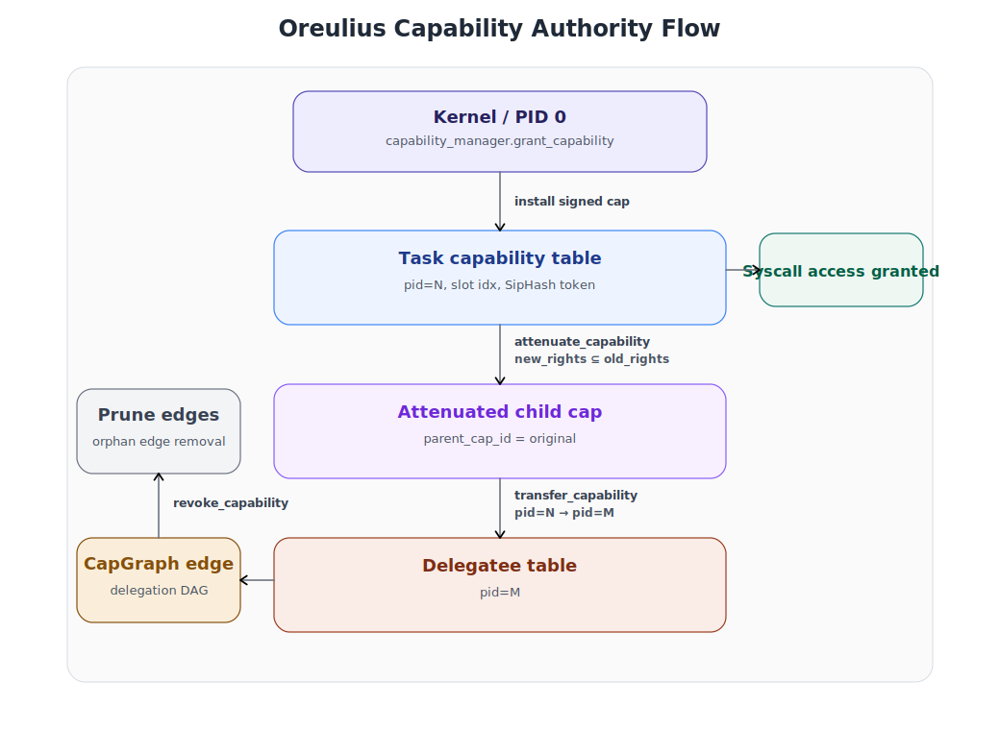
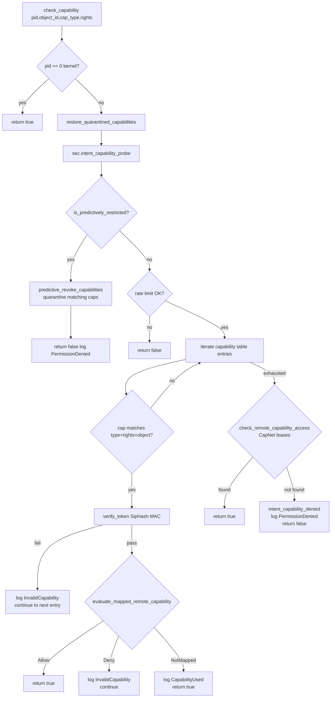
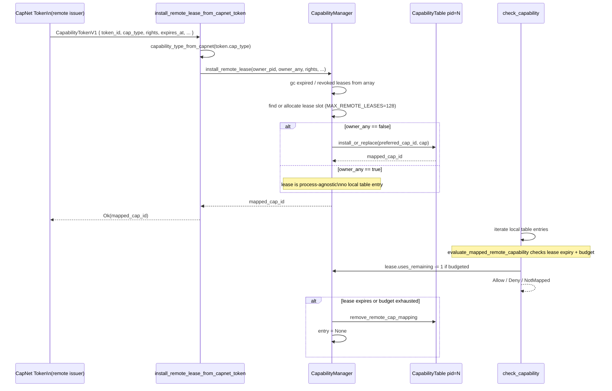

# `kernel/src/capability` — Oreulia Capability Security Subsystem

The central authority model of the Oreulia kernel.  Every operation that crosses
a process boundary — IPC send, filesystem access, task spawn, console write,
service invocation — is gated by an unforgeable, attenuatable, auditable
capability token.  POSIX-style ambient authority (UID, process groups, setuid,
global namespaces) does not exist at any layer of the kernel.

This module implements the full authority lifecycle: creation, attenuation,
transfer, revocation, remote lease installation from CapNet tokens, predictive
revocation driven by the security manager, and runtime delegation graph
verification.

---

## Table of Contents

1. [Module Inventory](#1-module-inventory)
2. [Foundational Principles](#2-foundational-principles)
3. [Architectural Diagrams](#3-architectural-diagrams)
4. [Capability Type Taxonomy](#4-capability-type-taxonomy)
5. [Rights Bitflags](#5-rights-bitflags)
6. [`OreuliaCapability` Structure](#6-oreulia-capability-structure)
7. [Cryptographic Token MAC](#7-cryptographic-token-mac)
8. [Per-Task Capability Table](#8-per-task-capability-table)
9. [Global `CapabilityManager`](#9-global-capabilitymanager)
10. [Lifecycle Operations](#10-lifecycle-operations)
11. [Attenuation and the Subset Law](#11-attenuation-and-the-subset-law)
12. [Transfer and Delegation](#12-transfer-and-delegation)
13. [Predictive and Quota-Based Revocation](#13-predictive-and-quota-based-revocation)
14. [Capability Quarantine](#14-capability-quarantine)
15. [Remote Capability Leases (CapNet)](#15-remote-capability-leases-capnet)
16. [`cap_graph` — Delegation Graph Verification](#16-cap_graph--delegation-graph-verification)
17. [Provenance Chains (Def A.28)](#17-provenance-chains-def-a28)
18. [Capability Check Hot Path](#18-capability-check-hot-path)
19. [IPC Capability Export / Import](#19-ipc-capability-export--import)
20. [Temporal Integration](#20-temporal-integration)
21. [Formal Self-Check](#21-formal-self-check)
22. [Static Capacity Limits](#22-static-capacity-limits)
23. [Security Event Audit Trail](#23-security-event-audit-trail)
24. [Integration Points](#24-integration-points)

---

## 1. Module Inventory

Two source files, 2,713 lines of `no_std` Rust (with `alloc` for
`Box<CapabilityTable>`):

| File | Lines | Role |
|---|---|---|
| `mod.rs` | 2,235 | Core subsystem: types, tables, manager, check hot path, IPC bridge |
| `cap_graph.rs` | 478 | Live delegation DAG, invariant checking, provenance chains |
| **Total** | **2,713** | |

---

## 2. Foundational Principles

These are not aspirational goals — they are enforced by the implementation at
every call site:

| Principle | Implementation |
|---|---|
| **No ambient authority** | PID 0 (kernel) is the only entity that bypasses capability checks; all other PIDs must present a valid capability |
| **Unforgeable references** | Every `OreuliaCapability` carries a SipHash-2-4 MAC over its identity fields; `verify_token()` is called on every `lookup()` and every access check |
| **Transferable** | `CapabilityManager::transfer_capability()` moves a cap from one task's table to another; the source entry is removed atomically |
| **Attenuatable** | `attenuate(new_rights)` returns an error if `new_rights` is not a strict subset of the current rights; escalation is impossible |
| **Auditable** | Every grant, use, transfer, revocation, and policy denial emits a `SecurityEvent` to the kernel `SecurityManager` audit log |

---

## 3. Architectural Diagrams

### 3.1 — Authority Flow: Kernel → Task → Delegatee


### 3.2 — `check_capability()` Decision Tree



### 3.3 — CapNet Remote Lease Lifecycle



---

## 4. Capability Type Taxonomy

`CapabilityType` controls which rights bits are meaningful and which syscalls
accept a capability:

| Variant | Raw | Grants authority over |
|---|---|---|
| `Channel` | 0 | IPC channels (send, receive, clone, create) |
| `Task` | 1 | Another task (signal, join) |
| `Spawner` | 2 | Spawning new tasks |
| `Console` | 10 | Serial/console I/O (write, read) |
| `Clock` | 11 | Monotonic clock reads |
| `Store` | 12 | Log store (append, read, write/read snapshots) |
| `Filesystem` | 13 | VFS operations (read, write, delete, list) |
| `ServicePointer` | 14 | Named kernel services (invoke, delegate, introspect) |
| `CrossLanguage` | 15 | Polyglot service links; carries `lang_tag` in `label_hash` |
| `Reserved` | 255 | Placeholder / invalid |

`CapabilityType::from_raw(u8)` is used wherever a `u8` arrives from an IPC
message or a WASM host-function argument to safely decode a type discriminant
without panicking on unknown values.

---

## 5. Rights Bitflags

`Rights` is a `u32` bitset with 21 defined bits.  `Rights::ALL = 0xFFFFFFFF`
and `Rights::NONE = 0` are provided for completeness.

| Bit | Constant | Applies to |
|---|---|---|
| 0 | `CHANNEL_SEND` | Channel |
| 1 | `CHANNEL_RECEIVE` | Channel |
| 2 | `CHANNEL_CLONE_SENDER` | Channel |
| 3 | `CHANNEL_CREATE` | Channel |
| 4 | `TASK_SIGNAL` | Task |
| 5 | `TASK_JOIN` | Task |
| 6 | `SPAWNER_SPAWN` | Spawner |
| 7 | `CONSOLE_WRITE` | Console |
| 8 | `CONSOLE_READ` | Console |
| 9 | `CLOCK_READ_MONOTONIC` | Clock |
| 10 | `STORE_APPEND_LOG` | Store |
| 11 | `STORE_READ_LOG` | Store |
| 12 | `STORE_WRITE_SNAPSHOT` | Store |
| 13 | `STORE_READ_SNAPSHOT` | Store |
| 14 | `FS_READ` | Filesystem |
| 15 | `FS_WRITE` | Filesystem |
| 16 | `FS_DELETE` | Filesystem |
| 17 | `FS_LIST` | Filesystem |
| 18 | `SERVICE_INVOKE` | ServicePointer, CrossLanguage |
| 19 | `SERVICE_DELEGATE` | ServicePointer |
| 20 | `SERVICE_INTROSPECT` | ServicePointer |

**Key operations on `Rights`:**

```rust
rights.contains(bit)          // single-bit membership test
rights.is_subset_of(&other)   // (self.bits & !other.bits) == 0
rights.attenuate(mask)        // self.bits & mask — always reduces or preserves
```

`is_subset_of` is the core invariant check used by both `attenuate()` and
`cap_graph::check_invariants()`.

---

## 6. `OreuliaCapability` Structure

```
OreuliaCapability {
    cap_id:        u32             // local index in the owning CapabilityTable
    object_id:     u64             // kernel object this cap authorises access to
    cap_type:      CapabilityType  // what kind of object
    rights:        Rights          // bitmask of permitted operations
    origin:        ProcessId       // PID that originally held this capability
    granted_at:    u64             // PIT tick counter at installation time
    label_hash:    u32             // optional debug label / CrossLanguage tag
    token:         u64             // SipHash-2-4 MAC over identity fields
    parent_cap_id: Option<u32>     // provenance: None = root, Some = derived from
}
```

### Invariants

- `cap_id` is in the range `[0, MAX_CAPABILITIES)` and matches the slot in the
  owning `CapabilityTable`.
- `token` must verify under `verify_token(owner_pid)` before any operation is
  permitted on the capability.  Tampering with any field breaks the MAC.
- `parent_cap_id` is `None` for capabilities created directly by the kernel via
  `grant_capability()`.  It is `Some(original_id)` for attenuated or transferred
  copies, establishing the provenance chain used by `build_chain()`.

### `new_polyglot_link(origin, object_id, lang_tag)`

Synthesises a `CrossLanguage` capability for a polyglot service invocation
(WASM host syscall 105 `polyglot_link`).  Stores `lang_tag as u32` in
`label_hash` so the audit reader can identify the destination language without
deserialising the full capability record.

---

## 7. Cryptographic Token MAC

The SipHash-2-4 MAC prevents a process from forging or modifying a capability it
holds.

**Token payload layout (48 bytes, little-endian):**

| Bytes | Field |
|---|---|
| 0–3 | Context discriminant `0x4B43_4150` ("KCAP") |
| 4–7 | Owner PID |
| 8–11 | `cap_id` |
| 12–19 | `object_id` (8 bytes) |
| 20–23 | `cap_type as u32` |
| 24–27 | `rights.bits` |
| 28–31 | `origin.0` |
| 32–39 | `granted_at` (8 bytes) |
| 40–43 | `label_hash` |
| 44–47 | Padding (zero) |

`cap.sign(owner_pid)` computes the MAC and writes it to `cap.token`.
`cap.verify_token(owner_pid)` re-derives the payload and invokes
`security().cap_token_verify()`.  Any field modification causes MAC mismatch.

**Practical attack prevention:** Even if a WASM guest reads a `cap_id` integer from
a message it is not supposed to receive, it cannot construct a valid `token` for
that cap in a different `object_id`, `cap_type`, or `rights` context, because it
does not have access to the SipHash key held in the `SecurityManager`.

---

## 8. Per-Task Capability Table

`CapabilityTable` stores up to **256** (`MAX_CAPABILITIES`) capabilities for a
single task.  It is heap-allocated per-task (`Box<CapabilityTable>`) so that the
`CapabilityManager`'s global `tables` array does not bloat the static kernel BSS.

```
CapabilityTable {
    entries:      [Option<OreuliaCapability>; 256]
    next_cap_id:  u32                               // monotonic counter (unused in slot-based alloc)
    owner:        ProcessId
}
```

Slot allocation is first-fit scan from index 0.  The returned `cap_id` is the
slot index — O(1) lookup for most operations.  `lookup(cap_id)` linearly scans
`entries` to find the entry whose `cap.cap_id == cap_id`, verifying the MAC on
every found entry.

### Table Operations

| Method | Description |
|---|---|
| `install(cap)` | Find first `None` slot; re-sign with owner; record `CapabilityCreated` audit event |
| `install_or_replace(preferred_id, cap)` | Install at fixed slot if valid; used for lease remapping |
| `lookup(cap_id)` | Find by ID; verify SipHash token; emit `InvalidCapability` event on MAC failure |
| `remove(cap_id)` | Extract and return; verify token first; emit `CapabilityRevoked` |
| `attenuate(cap_id, new_rights)` | Lookup + `attenuate()` + `install()` returning new ID |
| `revoke_matching(cap_type, rights_mask)` | Bulk remove by type and rights filter |
| `revoke_all()` | Remove every entry; returns count of revoked caps |
| `count_by_type(cap_type)` | Counting helper for audit statistics |
| `list_all()` | Iterator over live entries; used for snapshotting and audit |
| `create_channel_capability(channel_id, rights, origin)` | Convenience: wraps `install()` with Channel type |

---

## 9. Global `CapabilityManager`

```
CapabilityManager {                                         // repr(align(64))
    tables:               Mutex<[Option<Box<CapabilityTable>>; 64]>
    next_object_id:       Mutex<u64>
    remote_leases:        Mutex<[Option<RemoteCapabilityLease>; 128]>
    quarantined_caps:     Mutex<[Option<QuarantinedCapability>; 256]>
    next_remote_cap_id:   Mutex<u32>
}
```

The global singleton is:

```rust
static CAPABILITY_MANAGER: CapabilityManager = CapabilityManager::new();
pub fn capability_manager() -> &'static CapabilityManager { &CAPABILITY_MANAGER }
```

`align(64)` places the struct on a cache line boundary to avoid false sharing
between the multiple `Mutex` fields.  All five fields have independent locks;
no single operation holds more than two simultaneously (and when it does, it takes
them in a fixed order: `tables` before `leases` before `quarantined_caps`).

### Task Lifecycle in the Manager

| Event | Manager method | Effect |
|---|---|---|
| Task created | `init_task(pid)` | Allocate and install `Box<CapabilityTable::new(pid)>` at `tables[pid]` |
| Task forked/cloned | `clone_task_capabilities(parent, child)` | Copy all parent cap entries; re-sign each with `child_pid`; preserve slot layout |
| Task destroyed | `deinit_task(pid)` | `revoke_all()` on table; drop quarantined caps owned by pid; revoke owner-bound remote leases |

---

## 10. Lifecycle Operations

### Create / Grant

```rust
capability_manager().grant_capability(pid, object_id, cap_type, rights, origin)
```

1. Lock `tables`.
2. Find `tables[pid]`, call `table.install(cap)`.
3. If temporal replay is not active, record event to the temporal log
   (`TEMPORAL_CAPABILITY_EVENT_GRANT`).
4. Notify WASM observer via `observer_notify(CAPABILITY_OP, &payload)` (x86 only).
5. Return `cap_id`.

`create_object()` generates a fresh monotonic `object_id` that is used as the
unforgeable kernel-side identity of a new resource.

### Verify / Check

See [§18 — Capability Check Hot Path](#18-capability-check-hot-path).

### Revoke (single)

```rust
capability_manager().revoke_capability(pid, cap_id)
```

1. Lock `tables[pid]`; `lookup` + `remove`.
2. Record temporal `TEMPORAL_CAPABILITY_EVENT_REVOKE`.
3. `cap_graph::prune_edges_for(pid, cap_id)` — remove delegation edges.
4. Notify WASM observer.

### Revoke (bulk)

| Method | Scope |
|---|---|
| `revoke_all_capabilities(pid)` | All caps for one PID |
| `revoke_object_capabilities(cap_type, object_id)` | All caps across all tasks pointing to a specific object |
| `revoke_matching_for_pid(pid, cap_type, object_id)` | Targeted object/type within one task |

---

## 11. Attenuation and the Subset Law

Attenuation is the mechanism by which a capability holder can produce a
**weaker** copy of a capability to pass to a less-trusted party.

```
cap.attenuate(new_rights) -> Result<OreuliaCapability, CapabilityError>
```

The subset law is enforced unconditionally:

```
if !new_rights.is_subset_of(&self.rights) {
    return Err(CapabilityError::InvalidAttenuation);
}
```

The attenuated capability:
- Gets a fresh `cap_id` when installed in the table.
- Has `parent_cap_id = Some(original.cap_id)` for provenance tracking.
- Is signed with the owning task's PID token.

**Why attenuation matters:** A WASM module that has full `FS_READ | FS_WRITE |
FS_DELETE` on a store object can create an attenuated `FS_READ`-only capability
and pass it to an untrusted helper.  The helper cannot escalate back to
`FS_WRITE` because the MAC covers the rights field and the cap graph rejects
escalation.

### `CapabilityTable::attenuate(cap_id, new_rights)`

Convenience method: looks up `cap_id`, calls `attenuate()`, installs the result,
and returns the new slot index — all under the same table lock in the manager.

---

## 12. Transfer and Delegation

`transfer_capability(from_pid, to_pid, cap_id)` is a **move**: the capability is
removed from the source table and installed in the destination.

```
1. tables[from_pid].remove(cap_id)                  // atomic remove (source destroyed)
2. cap_graph::check_invariants(from, cap, to, rights, rights)
   → rights escalation check (same rights, so always passes for exact transfer)
   → delegation cycle check (DFS from to_pid → must not reach from_pid)
3. delegated_cap.parent_cap_id = Some(cap_id)       // stamp provenance
4. tables[to_pid].install(delegated_cap)            // install in destination
5. cap_graph::record_delegation(from, cap, to, new_cap, rights)
6. audit: SecurityEvent::CapabilityTransferred
```

If the graph invariant check fails (would create a cycle), the entire transfer
is rejected with `CapabilityError::SecurityViolation` and the source table is
left with the cap removed.  In practice the source table entry was already
consumed, so the cap is effectively revoked — fail-closed.

---

## 13. Predictive and Quota-Based Revocation

The `SecurityManager` (`crate::security`) monitors process intent signals
(capability access patterns) and can mark a process as "predictively restricted"
before a violation actually occurs.  When `is_predictively_restricted()` returns
true for a `(pid, cap_type, rights)` tuple, `check_capability()` calls:

```rust
let revoked = CAPABILITY_MANAGER.predictive_revoke_capabilities(
    pid, cap_type, required_rights.bits, restore_at_tick
);
```

This **quarantines** the matching capabilities rather than permanently deleting
them.  After the security restriction expires (`restore_at_tick`), the caps are
automatically restored on the next `check_capability()` call via
`restore_quarantined_capabilities()`.

### `predictive_revoke_capabilities(pid, cap_type, rights_mask, restore_at_tick)`

1. Enumerate all matching local table entries.
2. `table.remove(cap_id)` → `quarantine_insert(pid, cap, restore_at_tick)`.
3. Revoke matching remote leases (both process-specific and process-agnostic).
4. Return count of revoked items.

The minimum `restore_at_tick` is clamped to `now + pit_frequency` (≥ 1 second
at standard PIT rates) to prevent immediate restore loops.

---

## 14. Capability Quarantine

`QuarantinedCapability { owner_pid, cap, restore_at_tick }` is stored in a
256-slot fixed array (`MAX_QUARANTINED_CAPS`).  Quarantine provides a
time-limited suspension window:

- The cap is **removed from the active table** so all checks fail during suspension.
- The original `cap` record is preserved verbatim — including `cap_id`, `object_id`,
  and rights — so it can be restored to the exact same slot.
- `restore_quarantined_inner()` skips restore if the destination slot is currently
  occupied (to avoid clobbering newer authority installed since revocation).
- `force_restore_quarantined_capabilities(pid)` bypasses the timer, used by
  kernel subsystems that need manual override.

---

## 15. Remote Capability Leases (CapNet)

`RemoteCapabilityLease` represents an authority grant that originates outside
the local kernel instance — from a remote device's CapNet token issued over a
mesh network link.

### Lease Fields

| Field | Type | Purpose |
|---|---|---|
| `token_id` | `u64` | Unique identifier from the issuer |
| `mapped_cap_id` | `u32` | Local `cap_id` installed in owner's table (0 if `owner_any`) |
| `owner_pid` | `ProcessId` | Bound process (ignored if `owner_any`) |
| `owner_any` | `bool` | `true` for ambient leases valid for any local process |
| `issuer_device_id` | `u64` | Identity of the remote device that issued the token |
| `measurement_hash` | `u64` | TPM / WASM attestation measurement expected at use time |
| `session_id` | `u32` | CapNet session this lease belongs to |
| `object_id` | `u64` | Kernel object the lease grants access to |
| `cap_type` | `CapabilityType` | Resource class |
| `rights` | `Rights` | Granted rights |
| `not_before` | `u64` | PIT tick before which the lease is invalid |
| `expires_at` | `u64` | PIT tick after which the lease auto-expires (0 = no expiry) |
| `revoked` | `bool` | Explicit revocation flag |
| `enforce_use_budget` | `bool` | True if `uses_remaining` is a hard limit |
| `uses_remaining` | `u16` | Remaining authorised uses (decremented on each check) |

### Installation via `install_remote_lease_from_capnet_token(token)`

1. Map `token.cap_type: u8` → `CapabilityType` (rejects unknown types).
2. Determine `owner_any = (token.context == 0)`.
3. Garbage-collect expired / revoked / budget-exhausted leases.
4. If the same `token_id` exists, update in-place preserving `mapped_cap_id`.
5. If `!owner_any`: call `install_or_replace()` to put a local table entry into
   the process cap table — so the check hot path can find it without touching the
   lease table.
6. Record `SecurityEvent::CapabilityCreated`.

### Check Paths

Two separate code paths handle remote lease checks:

- **`evaluate_mapped_remote_capability(pid, mapped_cap_id, ...)`** — called from
  the hot path after a local table entry matches.  Finds the lease by
  `mapped_cap_id`, validates expiry and budget, decrements `uses_remaining` if
  budgeted.  Returns `Allow / Deny / NotMapped`.

- **`check_remote_capability_access(pid, object_id, cap_type, rights)`** — fallback
  for ambient (`owner_any`) leases that have no local table entry.  Linear scan of
  the lease table; validates type, object, expiry, and budget.

---

## 16. `cap_graph` — Delegation Graph Verification

`cap_graph.rs` maintains a live directed acyclic graph (DAG) of capability
delegation edges.  It enforces three invariants that the rest of the kernel
cannot enforce through type checking alone.

### Edge Structure

```
CapDelegationEdge {
    active:     bool
    from_pid:   u32
    from_cap:   u32
    to_pid:     u32
    to_cap:     u32
    rights_bits: u32
}
```

Up to **256** (`MAX_GRAPH_EDGES`) live edges are stored in a fixed array in the
global `CAP_GRAPH: Mutex<CapGraph>`.

### Invariant 1 — No Rights Escalation

```rust
if proposed_rights & !delegator_rights != 0 {
    violations += 1;
    return Err("cap_graph: rights escalation");
}
```

A delegatee can never receive a rights bit that the delegator does not currently
hold.  This is checked redundantly alongside `Rights::is_subset_of()` in the
attenuation path.

### Invariant 2 — No Delegation Cycles

```
would_create_cycle(from_pid, from_cap, to_pid):
    iterative DFS from to_pid
    if to_pid can reach from_pid through existing edges → cycle detected
    stack depth capped at MAX_CHAIN_DEPTH=32
    stack overflow → conservatively returns true (fail-closed)
```

A cycle `A→B→C→A` would allow a revoked authority chain to remain valid through
a re-grant, enabling privilege re-escalation over time.

### Invariant 3 — No Orphan Edges

- `prune_edges_for(pid, cap_id)` — removes all edges where `from == (pid, cap_id)`
  or `to == (pid, cap_id)`.  Called on every `revoke_capability()`.
- `prune_edges_for_pid(pid)` — removes all edges involving any cap owned by `pid`.
  Called on task destruction.

### Violation Counter

`CAP_GRAPH.violations: u64` is a monotonic, never-resetting counter of invariant
breaches.  Readable via WASM host function 131 (`cap_graph_violations()`).

---

## 17. Provenance Chains (Def A.28)

`ProvenanceChain` implements the lineage model from the formal specification
§Def A.28.  It traces a capability back to its kernel-issued root through the
`parent_cap_id` links embedded in each `OreuliaCapability`.

```
ProvenanceChain {
    links:     [ProvenanceLink; 32]   // links[0] = leaf, links[depth-1] = root
    depth:     usize
    truncated: bool                   // true if chain exceeded PROVENANCE_MAX_DEPTH=32
}

ProvenanceLink {
    cap_id:      u32
    holder_pid:  u32
    rights_bits: u32
}
```

### `build_chain(pid, cap_id)`

```
1. Resolve (pid, cap_id) in CapabilityManager → (rights, parent_cap_id)
2. Append ProvenanceLink to chain
3. If parent_cap_id is Some:
     a. Check CapGraph for an incoming cross-process edge (to_pid==current_pid, to_cap==current_cap)
        → if found, hop to (from_pid, from_cap)
     b. Otherwise, intra-process attenuation: current_cap = parent_cap
4. Repeat until parent_cap_id is None (root) or depth == PROVENANCE_MAX_DEPTH
```

### Serialisation

`ProvenanceChain::serialize(out: &mut [u8])` produces a compact binary format:

```
[0]      depth as u8
[1]      truncated as u8
[2..N]   per link: cap_id (4B LE) | holder_pid (4B LE) | rights (4B LE)
```

12 bytes per link, max 32 links = max 386 bytes.  Used by `AuditEntry::context`
embedding and temporal log records.

---

## 18. Capability Check Hot Path

`check_capability(pid, object_id, cap_type, required_rights) -> bool` is called
on every kernel syscall that accesses a guarded resource.  It must be fast but
complete.

**Full decision sequence:**

```
1. pid == 0 → true (kernel bypass)

2. restore_quarantined_capabilities(pid)
   (opportunistic: restores caps whose cooldown expired, O(256) scan)

3. sec.intent_capability_probe(pid, cap_type, rights, object_id)
   (SecurityManager intent signal)

4. sec.is_predictively_restricted(pid, cap_type, rights) ?
   → yes: predictive_revoke → quarantine matching caps → return false

5. sec.validate_capability(pid, rights, rights) → rate limit check
   → fail: return false

6. Lock capability tables
   for each entry in tables[pid].entries:
       verify_capability_access(owner, cap, {object_id, cap_type, required_right})
         → type check, object_id match (0 == wildcard), rights subset check, token MAC
       if ok:
           evaluate_mapped_remote_capability(pid, cap.cap_id, ...)
             → Allow: return true
             → Deny: log InvalidCapability, continue
             → NotMapped: log CapabilityUsed, return true

7. check_remote_capability_access(pid, object_id, cap_type, required_rights)
   (ambient CapNet leases)
   → found: return true

8. intent_capability_denied + log PermissionDenied → return false
```

**Object ID wildcard:** `verify_capability_access` treats `object_id == 0` on
either side as "don't check object"; this allows a capability created with
`object_id = channel.id` to match a check against object_id `0` (type-only
check) and vice versa.

---

## 19. IPC Capability Export / Import

Capabilities can cross IPC channel boundaries as `crate::ipc::Capability`
attachments.  Two functions handle the codec:

### `export_capability_to_ipc(owner, cap_id)`

Reads the local `OreuliaCapability` from `owner`'s table.  Enforces: if
`cap_type == ServicePointer`, the cap must have `SERVICE_DELEGATE` right.
Packs into `ipc::Capability`:

```
out.cap_id  = cap.cap_id
out.object  = cap.object_id as u32
out.rights  = cap.rights.bits
out.extra[0] = (cap.object_id >> 32) as u32   // high 32 bits of object_id
out.extra[1] = cap.origin.0
out.extra[2] = cap.granted_at as u32
out.extra[3] = cap.cap_type as u32
out.sign()                                     // HMAC the IPC wrapper
```

### `import_capability_from_ipc(owner, cap, source)`

1. `cap.verify()` — verify the IPC-level HMAC.
2. Decode `cap_type_from_ipc(cap.cap_type, cap.extra)`.
3. For `ServicePointer`: verify `service_pointer_exists(object_id)` (x86 only).
4. `capability_manager().grant_capability(owner, object_id, cap_type, rights, source)`.

This path is used by the IPC layer when a message is received that includes a
capability attachment, allowing a sender to delegate authority to a receiver
atomically with the message delivery.

### `resolve_channel_capability(pid, channel_id, access)`

Bridges the IPC channel object model to the capability table.  Finds the first
local table entry that:
- Has type `Channel`
- Has `object_id` matching `channel_id.0` (or wildcard `0`)
- Passes MAC verification
- Has the required right (`SEND`, `RECEIVE`, or both for `CLOSE`)

Falls back to remote lease check.  If pid == 0 (kernel), returns a full-rights
capability unconditionally.

---

## 20. Temporal Integration

The temporal subsystem (`crate::temporal`) enables deterministic replay of
capability events for fault recovery and audit verification.

**On grant:** If `!is_replay_active()`:
```rust
temporal::record_capability_event(
    pid.0, cap_type as u8, object_id, rights.bits(), origin.0,
    TEMPORAL_CAPABILITY_EVENT_GRANT, cap_id
);
```

**On revoke:** If `!is_replay_active()`:
```rust
temporal::record_capability_event(
    pid.0, cap.cap_type as u8, cap.object_id, cap.rights.bits(), cap.origin.0,
    TEMPORAL_CAPABILITY_EVENT_REVOKE, cap_id
);
```

**Replay application:** `temporal_apply_capability_event()` is called by the
temporal engine to re-execute capability operations from the log:

```
TEMPORAL_CAPABILITY_EVENT_GRANT  → grant_capability(...)
TEMPORAL_CAPABILITY_EVENT_REVOKE → revoke_capability(cap_id_hint)
                                   + revoke_matching_for_pid(pid, type, object)
```

This allows a crashed kernel instance to reconstruct the exact capability state
of all live processes from the temporal log — a prerequisite for the
fault-tolerant edge deployment model described in `docs/project/oreulia-vision.md`.

---

## 21. Formal Self-Check

`formal_capability_self_check()` is called at boot to verify five proof
obligations:

| Obligation | Checks |
|---|---|
| 1 | Valid token + matching type/rights/object passes `verify_capability_access` |
| 2 | Wrong right is rejected |
| 3 | Wrong type is rejected |
| 4 | Token tamper (`token ^= 1`) is detected |
| 5 | Valid attenuation succeeds; non-subset attenuation returns `Err` |

If any check fails, the return value is an `Err(&'static str)` that the boot
sequence can treat as a fatal precondition violation.  This is the runtime
equivalent of a type-checker asserting the core security properties before
user code runs.

---

## 22. Static Capacity Limits

| Constant | Value | Location | Description |
|---|---|---|---|
| `MAX_CAPABILITIES` | 256 | `mod.rs` | Per-task capability table size |
| `MAX_TASKS` | 64 | `mod.rs` | Max concurrent tasks with capability tables |
| `MAX_REMOTE_LEASES` | 128 | `mod.rs` | Live CapNet lease entries |
| `MAX_QUARANTINED_CAPS` | 256 | `mod.rs` | Caps in predictive revocation quarantine |
| `MAX_GRAPH_EDGES` | 256 | `cap_graph.rs` | Live delegation DAG edges |
| `MAX_CHAIN_DEPTH` | 32 | `cap_graph.rs` | Max DFS depth for cycle detection |
| `PROVENANCE_MAX_DEPTH` | 32 | `cap_graph.rs` | Max provenance chain length |

**Static memory footprint (upper bound, excluding heap-allocated tables):**

| Allocation | Calculation | Size |
|---|---|---|
| `CapGraph.edges` | `256 × CapDelegationEdge (~24 B)` | ~6 KB |
| `remote_leases` | `128 × RemoteCapabilityLease (~72 B)` | ~9 KB |
| `quarantined_caps` | `256 × QuarantinedCapability (~84 B)` | ~21 KB |
| Heap (per task) | `64 × Box<CapabilityTable>` max = `64 × 256 × sizeof(Option<OreuliaCapability>)` | ~768 KB max |
| **Total static** | | **~36 KB** |
| **Total heap (all 64 tasks)** | | **~768 KB max** |

The heap allocation arises from `Box<CapabilityTable>` per task.  With a
`sizeof(OreuliaCapability) ≈ 48 B` and 256 slots per table, one fully-loaded
task table consumes ~12 KB of heap.  At 64 tasks maximum that is 768 KB —
acceptable for a kernel targeting embedded/edge nodes with 64–256 MB of RAM.

---

## 23. Security Event Audit Trail

Every operation emits at least one `SecurityEvent` via
`security::security().log_event(AuditEntry)`:

| Event | Emitted when |
|---|---|
| `CapabilityCreated` | `install()` succeeds; remote lease installed |
| `CapabilityUsed` | `verify_and_get_object()` returns Ok; hot path find succeeds |
| `CapabilityRevoked` | `remove()` in revoke path; deinit_task cascade; lease expiry |
| `CapabilityTransferred` | `transfer_capability()` completes |
| `InvalidCapability` | MAC verification fails on any lookup; forged cap presented |
| `PermissionDenied` | `check_capability()` returns false; predictive revocation fires |

`AuditEntry::context` is a `u64` that carries additional detail: object_id on
creation/use, target PID on transfer, revoke count on deinit, token_id on remote
lease events.

---

## 24. Integration Points

### Syscall Layer (`kernel/src/syscall.rs`)
Every capability-guarded syscall calls `check_capability(pid, object_id, type,
rights)` before accessing the underlying resource.  The `resolve_channel_capability()`
function gates all IPC operations.

### WASM Host Functions (`kernel/src/wasm.rs`)
- Host functions 129–131 expose the `cap_graph` query API to WASM modules:
  - 129: `cap_graph_edge_count(pid, cap_id)` → delegation depth
  - 130: `cap_graph_query_edges(pid, cap_id, out_ptr, max_edges)` → raw edges
  - 131: `cap_graph_violations()` → lifetime violation counter
- Host syscall 105 `polyglot_link` calls `OreuliaCapability::new_polyglot_link()`
  to issue a `CrossLanguage` capability.
- `observer_notify(CAPABILITY_OP, &payload)` is called on every grant and revoke,
  allowing WASM observer modules to react to authority changes in real time.

### IPC Subsystem (`kernel/src/ipc.rs`)
`export_capability_to_ipc` / `import_capability_from_ipc` are called by the IPC
message routing layer when a message carries a `Capability` attachment.
`resolve_channel_capability()` is called on every `ipc_send` / `ipc_receive`.

### Security Manager (`kernel/src/security.rs`)
`check_capability()` consults the Security Manager for:
- Intent probes (`intent_capability_probe`)
- Predictive restriction flags (`is_predictively_restricted`)
- Rate limiting (`validate_capability`)
- Denied-access notifications (`intent_capability_denied`)

The Security Manager has no direct capability table access — it signals
intent and restriction decisions; this module executes the actual revocation.

### Temporal Engine (`kernel/src/temporal.rs`)
Capability grant and revoke events are logged to the temporal record when not
in replay mode.  During replay, `temporal_apply_capability_event()` reconstructs
the exact capability state, which is required for deterministic process
restoration after a crash.

### CapNet Mesh Layer (`kernel/src/capnet.rs`)
`install_remote_lease_from_capnet_token(&CapabilityTokenV1)` is called whenever a
verified CapNet token arrives from the mesh.  The CapNet layer is responsible for
cryptographically verifying the token; this module installs the resulting lease and
manages its lifecycle.

### Capability Documentation (`docs/capability/`)
The formal specification this module implements is at:
- [oreulia-capabilities.md](../../../../docs/capability/oreulia-capabilities.md) — capability model overview
- [capnet.md](../../../../docs/capability/capnet.md) — CapNet distributed capability network
- [oreulia-cap-graph-verification.md](../../../../docs/capability/oreulia-cap-graph-verification.md) — formal graph invariants
- [oreulia-capability-entanglement.md](../../../../docs/capability/oreulia-capability-entanglement.md) — capability entanglement model
- [oreulia-intent-graph-predictive-revocation.md](../../../../docs/capability/oreulia-intent-graph-predictive-revocation.md) — predictive revocation algorithm

---

## Summary

`kernel/src/capability` is the kernel's access control backbone.  It replaces the
POSIX ambient authority model entirely: there are no UIDs, no setuid, no filesystem
permission bits, no global port namespaces.  Every cross-boundary operation requires
an unforgeable, MAC-protected capability token that can be attenuated to weaker
rights but never escalated.  The delegation graph provides real-time invariant
enforcement — a rights escalation or cyclic delegation chain are detected and
recorded before completion.  Remote lease integration with CapNet extends this model
across the distributed mesh with time-bounded, use-budgeted, and device-attested
authority grants.  The complete system is designed to be formally verified against
the specifications in `docs/capability/`.
