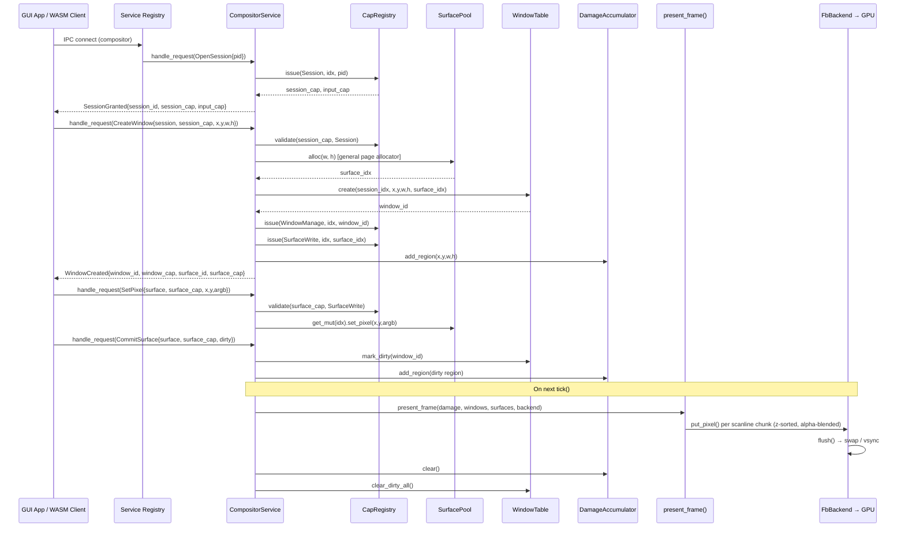
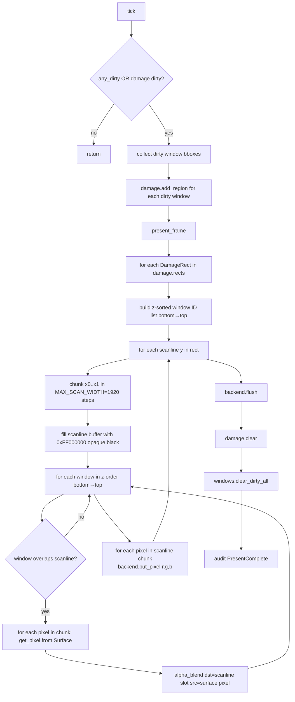
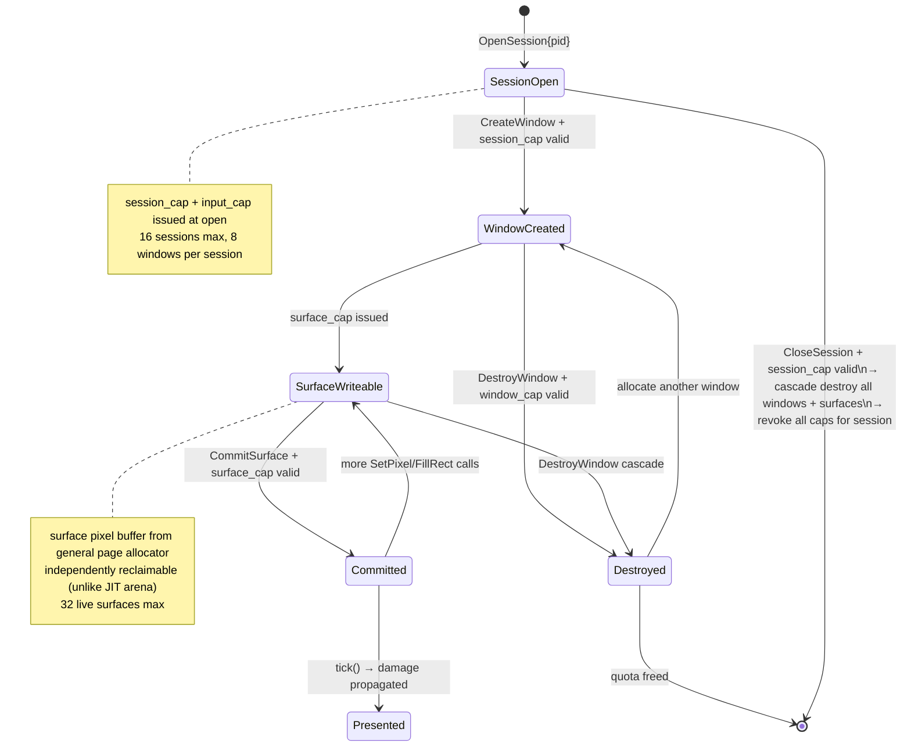

# `kernel/src/compositor` — Oreulius Compositor Subsystem

A first-class, capability-native windowing compositor living entirely inside the
Oreulius kernel.  Its mandate is narrow and precise: accept pixel-draw commands
from capability-holding GUI processes, composite their surfaces in z-order, and
push the result to the display framebuffer — all without trusting client IDs,
without heap allocation, and without a single WASM process ever touching another
process's pixels.

---

## Table of Contents

1. [Module Inventory](#1-module-inventory)
2. [Position in the Kernel Stack](#2-position-in-the-kernel-stack)
3. [Architectural Diagrams](#3-architectural-diagrams)
4. [Boot Lifecycle](#4-boot-lifecycle)
5. [IPC Protocol Reference](#5-ipc-protocol-reference)
6. [Capability Security Model](#6-capability-security-model)
7. [Session and Quota Model](#7-session-and-quota-model)
8. [Window Management](#8-window-management)
9. [Surface Allocator](#9-surface-allocator)
10. [Pixel Format and Alpha Compositing](#10-pixel-format-and-alpha-compositing)
11. [Damage Tracking](#11-damage-tracking)
12. [Present Pipeline](#12-present-pipeline)
13. [Display Backend Abstraction](#13-display-backend-abstraction)
14. [Input Routing and Focus](#14-input-routing-and-focus)
15. [Policy Enforcement](#15-policy-enforcement)
16. [Audit Log](#16-audit-log)
17. [Platform Gating](#17-platform-gating)
18. [Legacy Compatibility Shim](#18-legacy-compatibility-shim)
19. [Static Capacity Limits](#19-static-capacity-limits)
20. [Integration Points](#20-integration-points)

---

## 1. Module Inventory

The compositor is split across 14 source files comprising 3,660 lines of
`no_std` Rust.  Every type is allocated statically; no call to a global
allocator exists anywhere in this subtree.

| File | Lines | Role |
|---|---|---|
| `mod.rs` | 117 | Module root: re-exports, `init()`, `tick()`, AArch64 stubs, legacy shim |
| `service.rs` | 1,019 | `CompositorService` singleton; full IPC dispatch table |
| `protocol.rs` | 268 | Wire types: `CompositorRequest`, `CompositorResponse`, `CompositorError`, handle types |
| `input.rs` | 371 | `FocusState`, `CursorState`, `route_input` with key + mouse routing |
| `window.rs` | 317 | `WindowTable`, `WindowMeta`, z-order, hit-testing |
| `surface.rs` | 316 | `SurfacePool`, `Surface`, 8×8 bitmap font, `ARGB8888` pixel ops |
| `damage.rs` | 244 | `DamageAccumulator`, `DamageRect`, overflow to full-screen bbox |
| `present.rs` | 179 | `present_frame`, scanline compositor, Porter-Duff `src-over` |
| `session.rs` | 169 | `SessionTable`, `CompositorSession`, per-process quotas |
| `capability.rs` | 131 | `CompositorCapRegistry`, `CapKind`, issue / validate / revoke |
| `audit.rs` | 124 | `AuditLog` ring buffer, 13 `AuditKind` variants |
| `fb_backend.rs` | 118 | `FbBackend`: `DisplayBackend` impl delegating to `gpu_support` |
| `backend.rs` | 78 | `DisplayBackend` trait, `NoopBackend` for headless environments |
| `policy.rs` | 78 | `CompositorPolicy`: quota and dimension enforcement |

---

## 2. Position in the Kernel Stack

```
┌──────────────────────────────────────────────────────────────────┐
│  WASM application (user space)                                   │
│  calls host functions 28–37 via wasm runtime ABI                │
└────────────────────────┬─────────────────────────────────────────┘
                         │  legacy path (host fns 28–37)
                         ▼
┌──────────────────────────────────────────────────────────────────┐
│  drivers/compositor.rs  (PixelBufPool / JIT arena, layer model)  │
│  crate::compositor::compositor() shim → this module re-exports   │
└────────────────────────┬─────────────────────────────────────────┘
                         │  new IPC path
                         ▼
┌──────────────────────────────────────────────────────────────────┐
│  kernel/src/compositor  (this module)                            │
│  COMPOSITOR_SERVICE: Mutex<CompositorService>                    │
│  → session / window / surface / damage / present / input        │
└────────────────────────┬─────────────────────────────────────────┘
                         │  DisplayBackend::put_pixel / flush()
                         ▼
┌──────────────────────────────────────────────────────────────────┐
│  FbBackend → gpu_support::with_active_scanout()                  │
│            → drivers/framebuffer.rs physical scanout             │
└──────────────────────────────────────────────────────────────────┘
```

The module lives at `crate::compositor` and is the **second-generation**
compositor.  The first-generation (`drivers/compositor.rs`) remains live to
support the WASM host function ABI (IDs 28–37) without modification.  New
kernel-internal GUI code should use `COMPOSITOR_SERVICE` and the
`CompositorRequest` IPC enum instead.

---

## 3. Architectural Diagrams

### 3.1 — Full Runtime Request Flow



### 3.2 — Present Pipeline (Scanline Alpha Compositor)



### 3.3 — Capability and Session Lifecycle



---

## 4. Boot Lifecycle

### 4.1 `init(width, height)`

Called once from the platform boot path after `gpu_support::init()` has probed
and configured the display hardware.  Actions taken:

```
compositor::init(width, height)
  → service::init(width, height)
  → COMPOSITOR_SERVICE.lock()
  → svc.backend.set_size(width, height)
  → svc.damage.set_screen_size(width, height)
  → svc.initialised = true
  → if backend.is_available():
        backend.fill_rect(0, 0, width, height, 0, 0, 0)   // clear to black
        backend.flush()
  → audit.record_simple(PresentComplete)
```

On AArch64, `init()` is compiled as a no-op stub.  The platform-dispatch is
`#[cfg(not(target_arch = "aarch64"))]` throughout all live code paths.

### 4.2 `tick()`

Called every kernel timer interrupt (or from the scheduler idle loop).  If the
compositor is not yet initialised the function returns immediately.  Each tick:

1. **Input pump** — drains `crate::drivers::input::read()` until the ring is
   empty.  Every raw `InputEvent` is passed to `route_input()` which classifies
   it as Key or Mouse and returns an optional `RoutedEvent` (session index +
   `CompositorInputEvent`).  Routing is recorded in the audit log.
2. **Dirty check** — if `windows.any_dirty() || damage.is_dirty()`, collect each
   dirty window's bounding box, add those rectangles to the damage accumulator,
   call `present_frame()`, flush the backend, clear damage, and clear dirty flags.

The full tick sequence guards a single `Mutex<CompositorService>` lock for its
entire duration, ensuring consistent compositor state across input and present.

---

## 5. IPC Protocol Reference

All communication with the compositor is via `CompositorRequest` / `CompositorResponse`
enums passed to `compositor::service::handle_request()`.

### 5.1 Requests (client → compositor)

| Variant | Required Capability | Description |
|---|---|---|
| `OpenSession { pid }` | None | Allocate a session for `pid`; returns `SessionGranted` |
| `CloseSession { session, cap }` | `Session` cap | Destroy session and all owned windows/surfaces |
| `CreateWindow { session, cap, x, y, width, height }` | `Session` cap | Alloc surface + window; returns `WindowCreated` |
| `DestroyWindow { window, cap }` | `WindowManage` cap | Free window and surface; revoke associated caps |
| `MoveWindow { window, cap, x, y }` | `WindowManage` cap | Reposition; damages old and new regions |
| `ResizeWindow { window, cap, new_width, new_height }` | `WindowManage` cap | Realloc surface; old surface invalidated |
| `SetZOrder { window, cap, z }` | `WindowManage` cap | Change window paint order |
| `SetPixel { surface, cap, x, y, argb }` | `SurfaceWrite` cap | Write one ARGB pixel |
| `FillRect { surface, cap, x, y, width, height, argb }` | `SurfaceWrite` cap | Fill rectangle |
| `DrawText { surface, cap, x, y, text[128], text_len, fg_argb }` | `SurfaceWrite` cap | Render text with 8×8 bitmap font |
| `CommitSurface { surface, cap, dirty: (x,y,w,h) }` | `SurfaceWrite` cap | Mark dirty region; schedule present |
| `SubscribeInput { session, cap }` | `InputSubscribe` cap | Enable input event delivery for session |
| `UnsubscribeInput { session, cap }` | `InputSubscribe` cap | Disable input event delivery |

`dirty = (0, 0, 0, 0)` in `CommitSurface` marks the entire surface dirty.

### 5.2 Responses (compositor → client)

| Variant | Payload | Issued on |
|---|---|---|
| `SessionGranted` | `session: SessionId`, `session_cap`, `input_cap` | Successful `OpenSession` |
| `WindowCreated` | `window: WindowId`, `window_cap`, `surface: SurfaceId`, `surface_cap` | Successful `CreateWindow` |
| `WindowResized` | `window: WindowId`, `new_surface: SurfaceId`, `new_surface_cap` | Successful `ResizeWindow` |
| `PresentScheduled` | — | Present pass queued |
| `Ok` | — | Generic success |
| `Error(CompositorError)` | Error code | Any failure |

### 5.3 Error Codes

| Code | Meaning |
|---|---|
| `InvalidCapability` | Token absent, revoked, or wrong kind |
| `InvalidSession` | Session ID not found |
| `InvalidWindow` | Window ID not found |
| `InvalidSurface` | Surface ID not found |
| `QuotaExceeded` | Per-session window/surface quota saturated |
| `DimensionsTooLarge` | `w > 1920` or `h > 1080` |
| `InvalidSize` | Zero dimension or out-of-range |
| `OutOfMemory` | Page allocator exhausted for surface buffer |
| `PermissionDenied` | Policy hook rejected operation |
| `InternalError` | Compositor not initialised or invariant broken |

---

## 6. Capability Security Model

The `CompositorCapRegistry` (`capability.rs`) is the central authority for
access control.  It stores up to **256** live capability entries in a fixed-size
array — no hash map, no heap.

### 6.1 Capability Kinds

```
CapKind::Session        — authorises IPC commands for one compositor session
CapKind::WindowManage   — authorises create/destroy/move/resize for one window
CapKind::SurfaceWrite   — authorises pixel writes and CommitSurface for one surface
CapKind::InputSubscribe — authorises SubscribeInput / reading input events
```

### 6.2 Token Structure

Capability tokens are `CompositorCap(u64)`.  The internal counter starts at
`0x0000_0001_0000_0001` and advances monotonically, encoding both a session
discriminant and a monotonic sequence.  Token `0` is always invalid.

### 6.3 Issue

```
CompositorCapRegistry::issue(kind, session_idx, resource_id) → CompositorCap
```

Finds the first free slot index; generates the next token value; writes
`CapEntry { token, kind, session_idx, resource_id, alive: true }`.  If the
table of 256 entries is full (should never occur in practice with the session and
window quotas enforced), returns `CompositorCap(0)`.

The token is bound to both its `CapKind` **and** the `resource_id` (raw window ID
or surface index).  A `WindowManage` token for window 3 cannot be used to manage
window 4 — the resource ID check in `do_destroy_window` / `do_move_window` etc.
enforces this at the dispatch level.

### 6.4 Validate

```
CompositorCapRegistry::validate(cap, kind) → Option<(session_idx, resource_id)>
```

Linear scan over live entries.  Validates `alive && token == cap && kind == kind`.
Returns `(session_idx, resource_id)` so the caller can cross-check the owning
session against the window metadata.

### 6.5 Revoke

Three revocation paths:
- `revoke(cap)` — precise single-token revocation on `DestroyWindow`
- `revoke_resource(kind, session_idx, resource_id)` — revoke by resource match
- `revoke_session(session_idx)` — cascade revoke all caps owned by a session on
  `CloseSession`; ensures no stale tokens remain after session teardown

### 6.6 Why This Matters

A WASM guest process guessing a `WindowId` or `SurfaceId` integer cannot do
anything useful — every mutating IPC call requires the matching opaque capability
token that was only ever vended to the owning session.  Even listing other
sessions' windows is not possible at the API level.

---

## 7. Session and Quota Model

### 7.1 `CompositorSession` (`session.rs`)

Each GUI process opens exactly one session.  A session record contains:

| Field | Type | Purpose |
|---|---|---|
| `pid` | `ProcessId` | Owning process identifier |
| `id` | `SessionId` | Opaque handle issued to the client |
| `cap` | `CompositorCap` | Token required for session-level operations |
| `input_cap` | `CompositorCap` | Token required for input subscription |
| `windows` | `[Option<WindowId>; 8]` | Windows owned by this session |
| `window_count` | `usize` | Live window count for quota checks |
| `input_subscribed` | `bool` | Whether input events should be routed here |
| `alive` | `bool` | Slot occupancy |

### 7.2 `SessionTable`

Stores 16 sessions in a fixed array (`MAX_SESSIONS = 16`).  `SessionId` encodes
the slot index as `(slot + 1)` so ID `0` is always invalid.  Finding a session
by `SessionId` is O(1): derive slot index from ID, bounds-check, verify `alive`
and `id` match.

### 7.3 Quotas

| Limit | Value | Where enforced |
|---|---|---|
| Max sessions | 16 | `SessionTable::open()` |
| Max windows per session | 8 | `CompositorPolicy::check_create_window()` |
| Max surfaces per session | 8 | `CompositorPolicy::check_surface_size()` |
| Max windows total | 64 | `WindowTable` slot array size |
| Max surfaces total | 32 | `SurfacePool` slot array size (slot 0 reserved) |
| Max window width | 1,920 px | `CompositorPolicy::check_window_size()` |
| Max window height | 1,080 px | `CompositorPolicy::check_window_size()` |
| Min window dimension | 1 px | `CompositorPolicy::check_window_size()` |

Session close is a transactional cascade: all windows owned by the session are
collected into a local buffer, each is destroyed with `destroy_window_internal()`,
then `caps.revoke_session()` sweeps the cap table.  The session slot is then
zeroed.

---

## 8. Window Management

### 8.1 `WindowMeta` (`window.rs`)

Each window is a lightweight metadata record — it does not own its pixel data
directly.  Instead it holds an index into `SurfacePool`.

```
WindowMeta {
    id:          WindowId       // monotonic u32, never reuses 0
    session_idx: usize          // owning session slot
    x, y:        i32            // top-left in screen coords (may be negative)
    width, height: u32          // pixel dimensions
    z_order:     i32            // signed; higher = drawn on top
    surface_idx: usize          // index into SurfacePool
    dirty:       bool           // has uncommitted damage since last present
    alive:       bool           // slot occupancy
}
```

### 8.2 `WindowTable`

Stores 64 windows (`MAX_WINDOWS = 64`) in `[Option<WindowMeta>; 64]`.  A
parallel `surface_owners: [Option<WindowId>; MAX_SURFACES]` bidirectional index
allows O(1) lookup of which window owns a surface slot — critical for resize where
the old surface must be unlinked before the new one is installed.

**Z-Order Operations:**

| Method | Behaviour |
|---|---|
| `set_z_order(id, z)` | Assign arbitrary signed z value |
| `raise(id)` | Set `z_order = max_z_in_table + 1` |
| `lower(id)` | Set `z_order = min_z_in_table - 1` |
| `sorted_ids(out)` | Insertion-sort by `z_order` ascending (back-to-front) |

**Hit-Testing:**

`hit_test(px, py)` iterates all live windows and returns the one with the highest
`z_order` whose axis-aligned bounding box (AABB) contains the point.  The AABB
test is:

```
px >= x && py >= y && px < x + width && py < y + height
```

Partial overlap is intentional: a window positioned with `x = -10` is still
correctly hit-tested.

---

## 9. Surface Allocator

### 9.1 Design Philosophy

Surfaces use the **general kernel page allocator** (`memory::allocate_pages` /
`memory::deallocate_pages`), not the JIT arena used by the legacy compositor.
This is a deliberate architectural choice:

- **Independent reclaimability** — each surface can be individually freed when its
  window is destroyed.  The JIT arena uses a bump allocator with no provision for
  returning individual pages.
- **Long-lived resources** — a surface persists for the full lifetime of a window,
  potentially seconds to minutes, whereas JIT buffers are ephemeral.
- **Security scrub** — `Surface::free()` zeroes the entire buffer before returning
  pages to the allocator, preventing a subsequent allocation from reading a prior
  window's pixel contents.

### 9.2 `Surface` (`surface.rs`)

```
Surface {
    ptr:    *mut u32    // page-aligned, from memory::allocate_pages
    width:  u32         // in pixels
    height: u32         // in pixels
    pages:  usize       // number of 4 KiB pages allocated
    alive:  bool        // slot occupancy
}
```

`ptr` is `*mut u32` (one `u32` per ARGB pixel).  The stride is `width` — there is
no padding between rows.  All pixel access goes through `get_pixel` / `set_pixel`
which bounds-check before dereferencing.

**`Surface::alloc(width, height)`:**
1. Confirm neither dimension is zero.
2. Compute `pixels = width × height`, `bytes = pixels × 4`, round up to page
   boundary.
3. Call `memory::allocate_pages(pages)`.
4. `write_bytes(ptr, 0, pages × PAGE_SIZE)` — buffer starts transparent/black.
5. Return `Some(Surface { ... })`.

**Page size** is `crate::paging::PAGE_SIZE` on x86 (4,096 bytes), and 4,096
hardcoded on AArch64 (where the compositor is stubbed anyway).

### 9.3 `SurfacePool`

Fixed array of 32 slots.  Slot 0 is permanently reserved so that `surface_idx = 0`
always means "no surface".  `alloc()` scans from index 1 upward; `free()` guards
against freeing slot 0.

### 9.4 Embedded 8×8 Bitmap Font

`surface.rs` contains a self-contained 95-glyph 8×8 pixel font covering the
printable ASCII range (codepoints `0x20`–`0x7E`).  `Surface::draw_text()` renders
each character by iterating its 8-row bitmask and calling `set_pixel()` for
each set bit.  This makes the surface layer the single authority for text
rendering — no dependency on the driver-layer font in `drivers/compositor.rs`.

---

## 10. Pixel Format and Alpha Compositing

### 10.1 ARGB8888 Format

Every pixel is a packed 32-bit value:

```
bits 31–24 : Alpha  (0 = fully transparent, 255 = fully opaque)
bits 23–16 : Red
bits  15–8 : Green
bits   7–0 : Blue
```

This is the same format used by the legacy `drivers/compositor.rs` layer,
ensuring zero-cost interoperability.  All surfaces and the scanline scratch buffer
use this format throughout.

### 10.2 Porter-Duff `src-over` Blend (`present.rs`)

The `alpha_blend(dst, src)` function implements the standard
[Porter-Duff "over" operator](https://doi.org/10.1145/800031.808606):

$$
\alpha_{out} = \alpha_s + \alpha_d \cdot \left(1 - \frac{\alpha_s}{255}\right)
$$

$$
C_{out} = \frac{C_s \cdot \alpha_s + C_d \cdot \alpha_d' \cdot \left(1 - \frac{\alpha_s}{255}\right)}{\alpha_{out}}
$$

Where per-channel blending (without premultiplication, using integer arithmetic
with rounding correction `+127`) is:

$$
C_{out} = \frac{C_s \cdot \alpha_s + C_d \cdot (255 - \alpha_s) + 127}{255}
$$

**Fast paths** in the implementation:
- `α_s = 0xFF` (fully opaque source) → return `src` immediately
- `α_s = 0x00` (fully transparent source) → return `dst` immediately

These fast paths eliminate the multiply-divide chain for the common case of
opaque windows, which is the dominant scenario for most GUI elements.

### 10.3 Scanline Compositing Order

The scanline scratch buffer is pre-filled with `0xFF000000` (fully opaque black)
before any window contributes.  Windows are blended onto the scanline in
ascending z-order (back-to-front).  Because the initial value is opaque and
`src-over` is used, a fully transparent window pixel leaves the accumulator
unchanged; a fully opaque pixel overwrites it completely.  This eliminates any
need for a separate background-clear step.

---

## 11. Damage Tracking

`DamageAccumulator` (`damage.rs`) tracks which screen regions need to be
recomposited.  Every operation that could change visible pixels adds a damage
rectangle:

| Trigger | Region added |
|---|---|
| `CreateWindow` | Entire new window bounding box |
| `DestroyWindow` | Vacated bounding box |
| `MoveWindow` | **Both** old bounding box and new bounding box |
| `ResizeWindow` | Old position (size still from old) |
| `CommitSurface` | Client-specified dirty sub-region (or full surface if zero) |
| `set_screen_size` | Overflow flag set → full screen redraw |

### 11.1 Rectangle Storage

Up to `MAX_DAMAGE_RECTS = 32` individual `DamageRect` entries are tracked.  Each
is an axis-aligned `(x: u32, y: u32, w: u32, h: u32)` tuple clipped to screen
bounds during `add_region()`.

Before appending a new rect, the accumulator performs a **containment check**:
if the incoming rect is fully inside any existing entry, it is discarded — avoiding
redundant recomposition of already-dirty regions.

If the array fills (more than 32 distinct damage rects have been added since the
last present), the accumulator sets `overflowed = true` and from that point
reports a single full-screen bounding box.  This is a safe degradation strategy:
it never _misses_ any damage, it just composites more than strictly necessary.

### 11.2 Bounding Box vs. Individual Rects

`damage.rects()` returns a `DamageIter` that yields either the individual stored
rects (`DamageIter::Rects`) or a single full-screen rect (`DamageIter::FullScreen`).
`present_frame()` iterates this and calls `present_rect()` once per entry.

`damage.bounding_box()` computes the union of all stored rects in one pass; it is
used externally when a single consolidated region is needed.

### 11.3 Negative-Origin Handling

`add_region(x: i32, y: i32, w: u32, h: u32)` accepts signed coordinates.
Off-screen-left / off-screen-top windows (where `x < 0` or `y < 0`) are clipped
before reaching the rect storage: the negative offset is subtracted from the
width/height, and if the remainder is non-positive the region is silently dropped.

---

## 12. Present Pipeline

`present_frame()` is the display-refresh heart of the compositor.  It is
**always called under the `COMPOSITOR_SERVICE` mutex** from `tick()`.

### 12.1 Step-by-Step

```
1. damage.is_dirty()?                           — early-out if nothing changed
2. backend.is_available()?                      — skip on headless
3. windows.sorted_ids(&mut sorted_ids)          — insertion-sort, O(n²), n ≤ 64
4. for rect in damage.rects():                  — 1 to 32 rects, or 1 full-screen
     present_rect(rect, sorted_ids, ...)
5. backend.flush()                              — signal VSYNC / swap
6. damage.clear()
7. windows.clear_dirty_all()
8. audit.record_simple(PresentComplete)
```

### 12.2 Scanline Rendering in `present_rect()`

```
for chunk_x0 in rect.x0 .. rect.x1, step MAX_SCAN_WIDTH (1920):
    chunk_x1 = min(chunk_x0 + 1920, rect.x1)
    scan_len = chunk_x1 - chunk_x0

    for sy in rect.y0 .. rect.y1:
        scanline[0..scan_len] = 0xFF000000   // opaque black base
        for wid in sorted_ids (bottom to top):
            win = windows.find(wid)
            surf = surfaces.get(win.surface_idx)
            win_y = sy - win.y
            if win_y out of bounds: continue
            for sx_screen in chunk_x0 .. chunk_x1:
                sx = sx_screen - win.x
                if sx out of bounds: continue
                argb = surf.get_pixel(sx, win_y)
                scanline[sx - chunk_x0] = alpha_blend(scanline[slot], argb)
        for i in 0..scan_len:
            backend.put_pixel(chunk_x0 + i, sy, r, g, b)  // unpack ARGB → RGB
```

The chunk width of 1,920 equals `MAX_WINDOW_WIDTH`.  Since a window cannot be
wider than 1,920 pixels, no window ever spans more than two horizontal chunks,
bounding the inner loop.  The scanline buffer is stack-allocated (`[u32; 1920]`)
so the total additional stack cost per present pass is 7,680 bytes.

---

## 13. Display Backend Abstraction

### 13.1 `DisplayBackend` Trait (`backend.rs`)

```rust
pub trait DisplayBackend {
    fn put_pixel(&self, x: u32, y: u32, r: u8, g: u8, b: u8);
    fn fill_rect(&self, x: u32, y: u32, w: u32, h: u32, r: u8, g: u8, b: u8);
    fn flush(&self);
    fn width(&self) -> u32;
    fn height(&self) -> u32;
    fn is_available(&self) -> bool;
}
```

The trait takes `&self` (not `&mut self`) because the framebuffer is a globally
shared memory-mapped resource accessed through an interior-mutability model inside
`gpu_support`.

`NoopBackend` is a zero-cost stub that returns `is_available() → false` and
no-ops all drawing calls.  It is used when `width = 0` or `height = 0` at init
time, which is always the case on AArch64.

### 13.2 `FbBackend` (`fb_backend.rs`)

`FbBackend` holds `(width, height, available: bool)` — three words.  On
x86/x86_64 it delegates to:

```rust
gpu_support::with_active_scanout(|scanout| scanout.put_pixel(x, y, r, g, b));
```

`gpu_support::with_active_scanout` takes a closure to avoid requiring a global
lock at the backend level (the compositor's own mutex is sufficient).

**Shadow statistics** (accumulated without locking, via `AtomicUsize`):
- `SHADOW_PUT_PIXEL_CALLS` — total `put_pixel` invocations
- `SHADOW_FILL_RECT_CALLS` — total `fill_rect` invocations
- `SHADOW_FLUSH_CALLS` — total `flush` invocations
- `SHADOW_LAST_PIXEL` / `SHADOW_LAST_RECT` — packed coordinates of most recent call

These counters are used by the test infrastructure to verify that present passes
actually reach the backend without needing a real framebuffer.  CI runs on
headless QEMU use this path exclusively.

---

## 14. Input Routing and Focus

### 14.1 `CursorState`

Tracks the absolute pointer position derived by accumulating relative mouse deltas:

```
CursorState::apply_delta(dx, dy, buttons, screen_w, screen_h)
    x = clamp(x + dx, 0, screen_w - 1)
    y = clamp(y + dy, 0, screen_h - 1)
    buttons = new_buttons
```

There is no hardware cursor plane in the current implementation.  Cursor
rendering would be done by the compositor as a surface at the top of the z-order.

### 14.2 `FocusState`

Maintains two distinct focus concepts:

| Concept | Field | Description |
|---|---|---|
| Keyboard focus | `focused: Option<WindowId>` | Window receiving key events |
| Pointer capture | `captured: Option<WindowId>` | Window receiving all mouse events regardless of position |

`set_focus()` returns `(old, new)` so the caller can synthesise `FocusLost` /
`FocusGained` events.  `begin_capture(wid)` / `end_capture()` manage the mouse
button hold state.

### 14.3 `route_input()`

Called from `tick()` once per raw `InputEvent` drained from the kernel input
ring.  The routing algorithm differs by event kind:

**Key events (`InputEventKind::Key`):**
```
focused window?  → yes
session subscribed to input?  → yes
build CompositorInputEvent::Key { window, codepoint, scancode, pressed, modifiers }
return Some(RoutedEvent { session_idx, event })
```

**Mouse events (`InputEventKind::Mouse`):**
```
apply delta to CursorState → new absolute position (px, py)
target = captured window ?? hit_test(px, py) ?? return None
if button newly pressed:
    begin_capture(target)
    set_focus(target)           // keyboard focus follows click
if all buttons released:
    end_capture()
session subscribed?  → yes
build CompositorInputEvent::Pointer {
    window: target,
    x: px - window.x,          // window-local coordinates
    y: py - window.y,
    dx/dy: relative delta,
    buttons
}
return Some(RoutedEvent { session_idx, event })
```

Pointer events are delivered in **window-local coordinates** — the client never
needs to know its window's absolute screen position.

### 14.4 Pointer Capture Semantics

Once a mouse button is pressed over a window, that window **captures** all
subsequent pointer events until all buttons are released.  This is the standard
OS implicit-capture model.  It prevents the following bug scenario: user clicks
a button widget, drags the pointer off the window while held, the compositor
performs a hit-test on every intermediate position and routes events to different
windows.  With capture, all drag motion belongs to the originating window.

---

## 15. Policy Enforcement

`CompositorPolicy` (`policy.rs`) centralises all quota and dimension guards so
that the `service.rs` dispatch loop stays readable.  Every check returns
`Ok(())` or a typed `CompositorError`.

```
check_create_window(current_count, w, h)
    → QuotaExceeded if count >= 8
    → check_window_size(w, h)

check_window_size(w, h)
    → InvalidSize if w < 1 or h < 1
    → InvalidSize if w > 1920 or h > 1080

check_surface_size(current_count, w, h)
    → QuotaExceeded if count >= 8
    → InvalidSize if w == 0 or h == 0

clamp_position(x, y, w, h, screen_w, screen_h)
    → returns (cx, cy) ensuring at least 1 pixel of the window is on-screen
```

Policy is deliberately a zero-field struct — `CompositorPolicy::new()` has no
allocation and the methods carry no mutable state.  Future policy evolution (e.g.
per-capability-level quotas, per-UID rate limits) can add fields here without
disturbing the service dispatch table.

---

## 16. Audit Log

`AuditLog` (`audit.rs`) is a 128-entry ring buffer.  Once full, the oldest entry
is silently overwritten.  Every write is O(1) with no allocation.

### 16.1 Event Kinds

| `AuditKind` | Value | When recorded |
|---|---|---|
| `SessionOpened` | 0 | After `do_open_session` succeeds |
| `SessionClosed` | 1 | After `do_close_session` cascade completes |
| `WindowCreated` | 2 | After window slot + surface allocated |
| `WindowDestroyed` | 3 | Inside `destroy_window_internal` |
| `SurfaceAllocated` | 4 | (reserved for future direct surface ops) |
| `SurfaceFreed` | 5 | (reserved) |
| `SurfaceCommit` | 6 | (reserved for explicit commit tracing) |
| `InputRouted` | 7 | For each event routed through `route_input` |
| `FocusChanged` | 8 | (reserved for explicit focus-change tracing) |
| `PolicyViolation` | 9 | When `CompositorPolicy` blocks an operation |
| `PresentComplete` | 10 | After every successful present pass |
| `CapIssued` | 11 | (reserved for fine-grained cap tracing) |
| `CapRevoked` | 12 | (reserved) |

### 16.2 Entry Format

```
AuditEntry {
    kind:        AuditKind   // 1 byte
    session_idx: i32         // -1 = not session-specific
    detail:      u64         // window_id, surface_idx, etc.
    timestamp:   u64         // monotonic event counter (future: ns clock)
}
```

`AuditLog::drain_recent(out: &mut [AuditEntry])` copies the `out.len()` most
recent entries newest-first.  This is the interface used by a hypothetical kernel
debugger or telemetry service to inspect compositor activity without locking the
service mutex for extended periods.

---

## 17. Platform Gating

The full compositor implementation is compiled only on non-AArch64 targets:

```rust
#[cfg(not(target_arch = "aarch64"))]
pub mod input;
#[cfg(not(target_arch = "aarch64"))]
pub mod service;

#[cfg(not(target_arch = "aarch64"))]
pub use service::{CompositorService, COMPOSITOR_SERVICE};

#[cfg(not(target_arch = "aarch64"))]
pub fn init(width: u32, height: u32) { service::init(width, height); }
#[cfg(target_arch = "aarch64")]
pub fn init(_width: u32, _height: u32) {}

#[cfg(not(target_arch = "aarch64"))]
pub fn tick() { service::tick(); }
#[cfg(target_arch = "aarch64")]
pub fn tick() {}
```

The `backend`, `surface`, `window`, `damage`, `protocol`, `session`,
`capability`, `audit`, `policy`, `present`, and `fb_backend` modules compile on
all architectures; only `service` and `input` are gated.  This keeps the data
type definitions available for cross-architecture unit tests and documentation
builds without pulling in the x86-specific framebuffer and input drivers.

---

## 18. Legacy Compatibility Shim

`mod.rs` re-exports a `compositor()` function that returns
`spin::MutexGuard<'static, crate::drivers::compositor::Compositor>`:

```rust
#[cfg(not(target_arch = "aarch64"))]
pub fn compositor() -> spin::MutexGuard<'static, crate::drivers::compositor::Compositor> {
    crate::drivers::compositor::compositor()
}
```

This shim exists solely to preserve the call sites in `execution/wasm.rs` that
implement WASM host functions 28–37.  Those host functions call
`crate::compositor::compositor()` and invoke methods like `create_window()`,
`set_pixel()`, `draw_text()`, and `flush()` — which are methods on
`drivers::compositor::Compositor`, not on `CompositorService`.

The legacy and new compositors currently operate in parallel on the same
framebuffer.  The expected migration path is:
1. Extend the WASM SDK to use the new `CompositorRequest` IPC path.
2. Update host function dispatch in `execution/wasm.rs` to call `handle_request`
   instead of the old `compositor()` draw methods.
3. Remove the legacy shim once no code refers to `crate::compositor::compositor()`.

---

## 19. Static Capacity Limits

All capacity limits are compile-time constants.  No dynamic resizing occurs.

| Constant | Value | Location | Description |
|---|---|---|---|
| `MAX_SESSIONS` | 16 | `session.rs` | Concurrent GUI clients |
| `MAX_WINDOWS_PER_SESSION` | 8 | `session.rs`, `policy.rs` | Windows per client |
| `MAX_WINDOWS` | 64 | `window.rs` | Total live windows |
| `MAX_SURFACES` | 32 | `surface.rs` | Total live surfaces (slot 0 reserved) |
| `MAX_CAPS` | 256 | `capability.rs` | Capability table entries |
| `MAX_DAMAGE_RECTS` | 32 | `damage.rs` | Per-frame damage rects before overflow |
| `MAX_SCAN_WIDTH` | 1,920 | `present.rs` (`= MAX_WINDOW_WIDTH`) | Scanline scratch buffer |
| `AUDIT_LOG_SIZE` | 128 | `audit.rs` | Ring-buffer entries |
| `MAX_WINDOW_WIDTH` | 1,920 px | `policy.rs` | Max window/surface width |
| `MAX_WINDOW_HEIGHT` | 1,080 px | `policy.rs` | Max window/surface height |
| `MAX_WINDOWS_PER_SESSION` (policy) | 8 | `policy.rs` | Quota per session |
| `MAX_SURFACES_PER_SESSION` | 8 | `policy.rs` | Quota per session |

**Memory footprint (static, upper bound):**

| Allocation | Calculation | Bytes |
|---|---|---|
| `SessionTable` | `16 × CompositorSession` | ~2 KB |
| `WindowTable` | `64 × Option<WindowMeta>` + `[Option<WindowId>; 32]` | ~4 KB |
| `SurfacePool` | `32 × Surface` metadata only | ~1 KB |
| `CompositorCapRegistry` | `256 × CapEntry` | ~10 KB |
| `DamageAccumulator` | `32 × DamageRect` | ~1 KB |
| `AuditLog` | `128 × AuditEntry` | ~3 KB |
| Scanline scratch (stack) | `[u32; 1920]` | 7.5 KB |
| **Total static** | | **~29 KB** |

Surface pixel buffers are _not_ included above; they are dynamically allocated
from the kernel page pool at window-create time and freed on destroy.  Maximum
theoretical pixel memory for 32 surfaces at 1920×1080×4 bytes each would be
~253 MB, but per-session quotas limit each client to 8 surfaces, and the display
resolution is typically much lower in the embedded use case.

---

## 20. Integration Points

### WASM Runtime (`execution/wasm.rs` / `kernel/src/wasm.rs`)
Host functions **28–37** continue to call `crate::compositor::compositor()` which
delegates to `drivers/compositor.rs`.  The new `CompositorService` is intended to
eventually replace this path.

| Host Fn | Name | Signature |
|---|---|---|
| 28 | `compositor_create_window` | `(x,y,w,h) → window_id: i32` |
| 29 | `compositor_destroy_window` | `(wid)` |
| 30 | `compositor_set_pixel` | `(wid, x, y, argb)` |
| 31 | `compositor_fill_rect` | `(wid, x, y, w, h, argb)` |
| 32 | `compositor_flush` | `(wid)` |
| 33 | `compositor_move_window` | `(wid, x, y)` |
| 34 | `compositor_set_z_order` | `(wid, z)` |
| 35 | `compositor_get_width` | `(wid) → i32` |
| 36 | `compositor_get_height` | `(wid) → i32` |
| 37 | `compositor_draw_text` | `(wid, x, y, ptr, len, argb) → i32` |

### GPU / Framebuffer Driver (`gpu_support`, `drivers/framebuffer.rs`)
`FbBackend` calls `gpu_support::with_active_scanout(|s| s.put_pixel(...))`.
The active scanout is configured by the driver setup in `gpu_support::init()`.
The compositor does not touch framebuffer memory directly.

### Kernel Input Driver (`drivers/input.rs`)
`tick()` calls `crate::drivers::input::read()` to drain the kernel input ring.
The compositor does not register interrupt handlers — input is polled, not pushed.

### Memory Subsystem (`memory.rs`, `paging.rs`)
`Surface::alloc()` and `Surface::free()` call `memory::allocate_pages()` and
`memory::deallocate_pages()` directly.  The compositor imposes no additional
memory-management layer between the surface allocator and the physical page pool.

### Capability System (`kernel/src/capability/`)
The compositor has its own internal capability registry (`CompositorCapRegistry`)
that is distinct from the kernel-wide capability graph.  Compositor capabilities
are scoped tokens with no kernel-level meaning outside this module.  They are
not entries in the global `CapNet` graph.

### Scheduler / Timer
`compositor::tick()` is called from the kernel timer tick handler or scheduler
idle loop.  There is no dedicated compositor thread or VSYNC interrupt.  Present
cadence is therefore bounded by the timer frequency (typically 1 ms on x86 APIC
configurations), not by the display refresh rate.

### Service Registry (`kernel/src/services/`)
`handle_request()` is the intended entry point from service-registry-mediated IPC.
Clients locate the compositor service by name via the registry, obtain a channel,
and send `CompositorRequest` values.  The current dispatch is synchronous
(blocking on the compositor mutex); an asynchronous queue is on the roadmap.

---

## Summary

The `compositor/` module is a self-contained, statically allocated, capability-
gated windowing system.  It enforces strict process isolation — no process can
read, write, or enumerate another process's windows or surfaces.  All quota limits
are compile-time constants, eliminating entire classes of denial-of-service via
resource exhaustion.  The present pipeline is damage-driven: only changed regions
are recomposited, keeping CPU cost proportional to activity rather than screen
resolution.  The backend abstraction cleanly separates pixel logic from hardware,
enabling the full test suite to run headless with zero changes to the compositor code.
