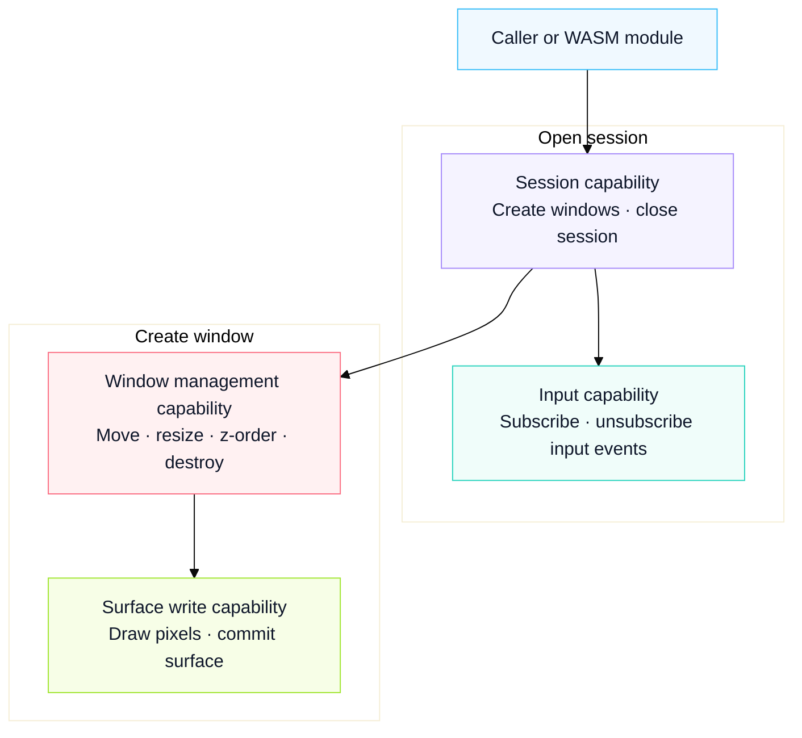
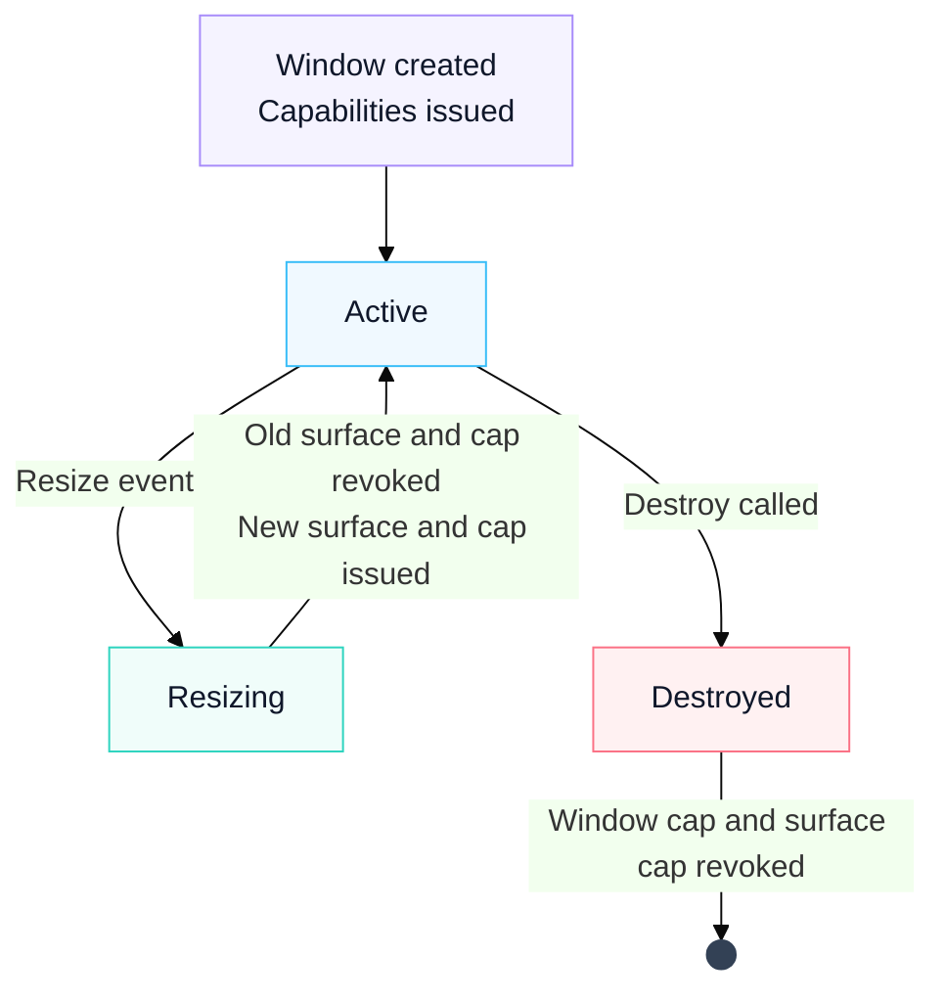
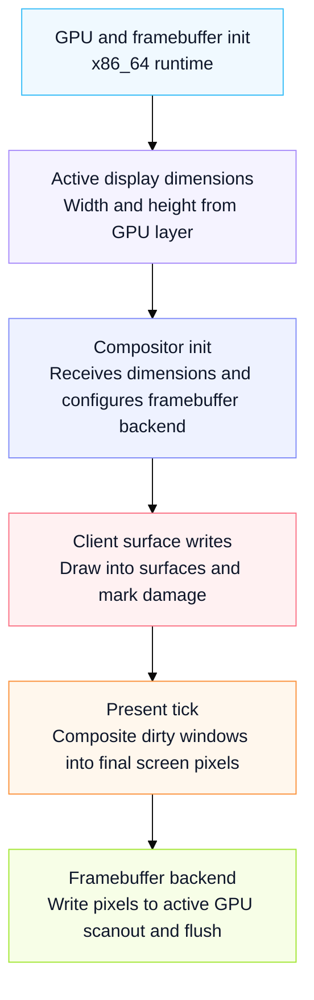

# Oreulius Compositor 
The kernel in the current developmental state uses the compositor as a local graphical output and windowing experiment. This is designed to come in handy for WASM GUI demos and kernel-controlled drawing. Kernel-controlled drawing means the kernel owns the path between a caller asking to draw pixels and those pixels actually being written to the framebuffer.

To elaborate, the client should not get raw framebuffer access. Instead, the client asks the kernel compositor to create a new window or surface, then draws through controlled operations like set pixel, fill rectangle, draw text, commit surface, and present.

Then the kernel checks ownership, capabilities, size limits, surface bounds, and z-order before anything reaches the screen.

## Paths in the current compositor scaffold

The compositor scaffold has two paths right now:

**Path**

**Legacy compositor path:** What it is: The older drawing API backed by drivers/compositor.rs; Current purpose: Keeps current WASM host functions working: create window, set pixel, fill rect, flush, move window, set z-order, draw text.

**New compositor service path:** What it is: The newer capability-based service under kernel/src/compositor; Current purpose: Future proper compositor model: sessions, capabilities, windows, surfaces, input routing, damage tracking, presentation, policy, and audit.

The legacy path is what existing WASM drawing uses today.

The new service path is the architectural direction. It is meant to become the protected compositor boundary where clients do not draw directly, but instead send compositor requests that are checked against session ownership and capability tokens.

In terms of the current parts of the kernel, including the new service path and the legacy service path, here are the parts and their current role:

**Part**

**New compositor service:** The future capability-based compositor API: sessions, windows, surfaces, input routing, damage tracking, presentation, audit, and policy.

**Legacy driver compositor:** The path actually used by current WASM host functions for creating windows, drawing pixels, filling rectangles, flushing, moving windows, and drawing text.

**Framebuffer backend:** Sends composed pixels to the active GPU/framebuffer backend when available, otherwise becomes a no-op/shadow backend.

**Timer tick path:** Pumps compositor input and presents dirty windows every kernel timer tick.

**AArch64 path:** Mostly no-op right now. The real compositor service is gated away on AArch64.

The compositor's primary goal is to be used as a graphical output and windowing experiment. This gives the kernel a windowing element for WASM GUI demos and kernel-controlled drawing. This does not mean it cannot or will not have equally important secondary goals in the future.

The practical path that is fully active right now is the legacy path. It is still the old compatibility layer exposed through the WASM host functions. This deliberately redirects to the legacy x86 compositor, so existing WASM drawing keeps working.

The newer compositor service is the future direction. It already has the shape of the mature compositor model, with sessions, resource-bound capabilities, surfaces, windows, input routing, damage tracking, presentation, policy, and audit. However, in the current state, it should be understood as the protected compositor scaffold rather than the fully active drawing path used by existing WASM GUI calls.

## Should we edit this before or after the execution folder
The compositor should be treated as one of the final development cycles because it is heavily dependent on operations and code from the Execution folder. The active compositor path is exposed through WASM host functions, so the execution layer decides how WASM code reaches drawing calls, how host function permissions are shaped, how service pointers/capabilities are represented, and how sandboxed code is allowed to call kernel services.

Before the compositor can be fully developed, several execution-layer decisions must be made. First, WASM host-call authority determines whether drawing calls stay direct host functions or move behind service/capability calls. Second, capability grants for WASM modules decide how a module receives window, surface, input, and present rights. Third, the service pointer model determines how the compositor service is exposed to sandboxed code. Fourth, policy contracts determine what GUI permissions are declared before execution. Fifth, the temporal/replay model determines whether compositor calls need replay/audit/event logging. Finally, host ABI cleanup determines whether legacy compositor host IDs should remain, wrap the new service, or be deprecated.

The reason we can't develop the compositor before the execution functionality in the kernel is because if we harden the compositor first, there will be risk in designing incorrect API boundaries. So we need to finish the execution folder review and intended upgrades. Then define how WASM modules receive and exercise service authority. After that, it is risk-free to decide whether compositor access becomes capability-only through the new service path. The compositor should be built around that final execution boundary.

**Execution decision**

**WASM host-call authority:** Determines whether drawing calls stay direct host functions or move behind service/capability calls.

**Capability grants for WASM modules:** Determines how a module receives window, surface, input, and present rights.

**Service pointer model:** Determines how the compositor service is exposed to sandboxed code.

**Policy contracts:** Determines what GUI permissions are declared before execution.

**Temporal/replay model:** Determines whether compositor calls need replay/audit/event logging.

**Host ABI cleanup:** Determines whether legacy compositor host IDs should remain, wrap the new service, or be deprecated.

## Future Direction

The compositor is not meant to stay only as a WASM demo drawing layer. In the long term, it can become the foundation for an official Oreulius GUI. That would mean moving from simple windows, pixels, rectangles, and text into a full graphical environment with trusted surfaces, input focus, window lifecycle management, compositor-owned presentation, and capability-scoped GUI authority.

The important part is that the official GUI should build on the new compositor service path, not the legacy path. The legacy path exists so current WASM drawing keeps working, but the mature GUI needs sessions, surface capabilities, window capabilities, input subscription rights, audit records, and policy checks. That gives the GUI a security model instead of just a drawing API.

A future Oreulius GUI could use the compositor as the trusted display server. Applications would not own the framebuffer directly. They would receive controlled rights to create windows, draw into surfaces, subscribe to input, request presentation, and close their own resources. The compositor would decide what reaches the screen, which window has focus, which process owns which surface, and what actions are allowed.

The long-term direction is to connect this with the execution and capability systems. WASM modules or future user processes would declare GUI needs through policy, receive compositor capabilities during launch, and then interact with the compositor through the service path. That makes GUI access part of the broader Oreulius authority model instead of a special escape hatch.

That makes the compositor part of Oreulius's broader authority model. The execution layer decides whether a program may ask for GUI access. The compositor decides whether a specific request is valid for a specific session, window, surface, or input subscription. The framebuffer remains behind the kernel boundary, and applications only interact with it through scoped compositor rights.

A concise roadmap table:

**Stage**

**Current stage:** Local graphical output, WASM GUI demos, kernel-controlled drawing.

**Near-term stage:** Route WASM compositor calls through the new compositor service instead of the legacy driver path.

**Capability stage:** Make window, surface, input, present, resize, and destroy operations capability-scoped.

**Policy stage:** Let execution policy decide which modules receive GUI authority.

**GUI stage:** Build an official Oreulius GUI on top of trusted compositor sessions and surfaces.

**Mature stage:** Treat the compositor as the kernel’s trusted display server.

### What needs to be done in immediate dev cycles to prepare for the future direction

The immediate work is not to build the full GUI yet. The first job is to make the compositor service path real enough that future GUI work has the right foundation. The legacy path can stay for compatibility, but new work needs to move toward sessions, capabilities, request handling, and policy-checked drawing.

**1. Route new compositor users through the service path**  Existing WASM drawing still relies on the legacy compositor. The next development pass should start steering new drawing work toward the CompositorRequest and the CompositorResponse interface. That way the kernel can verify session ownership, window capabilities, surface rights, and input permissions before any pixel is touched.  

**2. Decide how execution grants GUI authority**  The execution layer must determine how a WASM module—or any future user process—receives display rights. A module shouldn’t automatically get access to the screen just because it can run. It needs an explicit grant for creating windows, writing surfaces, subscribing to input, presenting frames, and closing resources.  

**3. Replace raw drawing authority with capability‑scoped rights**  
The mature compositor will expose distinct rights for different operations. Window management, surface writing, input subscription, presentation, resize, destroy, and audit should each be separate permissions. A process that can draw into a surface must not automatically inherit the ability to move windows, capture input, or destroy other resources.  

**4. Make the legacy path a compatibility layer only**  
Eventually the legacy path should become a thin wrapper around the new service, or be retained only for backward‑compatible demos. It must not remain the primary authority boundary; instead, it should continue to function for existing code while the service path assumes the real enforcement role.  

**5. Harden resource ownership**  
Windows and surfaces already have an ownership shape, but the immediate work is to make that ownership indisputable. Every operation must prove that the caller holds the appropriate session or capability token for the resource it touches. Destroy, resize, commit, input, and z‑order changes all need to stay strictly resource‑bound.  

**6. Make input delivery real**  
The compositor already maintains focus and routing structures, but the event‑delivery path is still immature. Future work must connect routed input events to proper client queues so that focused windows receive input through controlled compositor channels rather than ad‑hoc polling or logging.  

**7. Expand compositor policy**  
Policy currently covers basic size limits and quotas. It should evolve to decide which processes may create visible windows, which may receive input, which may go fullscreen, which may overlap trusted UI, and which may request high‑frequency presentation.  

**8. Improve presentation and damage behavior**  
The compositor already tracks damage and presents dirty windows, but the next step is to make this more reliable and efficient. Damage regions must be validated rigorously, presentation scheduling should follow clear rules, and frame output should avoid unnecessary full‑screen redraws when smaller dirty regions suffice.  

**9. Add compositor audit records that matter**  
Audit logging should capture security‑relevant compositor events: session creation, capability grants and revocations, window creation, input subscription, focus changes, denied operations, and presentation events. These records will make it easier to diagnose authority problems later.  

**10. Keep AArch64 expectations honest**  
The AArch64 path is effectively a no‑op today. Documentation and code should reflect that reality. When the platform is ready, framebuffer output and service behavior can be brought up, but until then the compositor must not be presented as equally functional across architectures.  

**11. Build tests around the service path**  
Existing tests cover basic resource‑bound capabilities and revocation. The next round of testing should focus on session quotas, invalid capability handling, stale surface caps after resize, destroyed‑window behavior, input‑subscription checks, damage clipping, z‑order presentation, and policy‑failure scenarios.  

**12. Define the official GUI boundary**  
Before a full Oreulius GUI can be built, the kernel must establish a clear boundary for what the GUI is allowed to trust. The compositor should become the trusted display server, while applications receive only scoped rights. This boundary must be solidified before menus, shells, panels, trusted prompts, or richer UI frameworks are introduced.

---
## How the compositor uses capability-based authority

The compositor is one of the clearest places where capability-based authority matters, because drawing is not just a visual operation. Drawing decides what a user can see, what a process can cover, what input a process can receive, and whether one application can interfere with another application's screen space.

In the mature Oreulius model, callers don’t receive blanket display permissions—they’re granted specific compositor capabilities tied to individual resources. A session capability governs access to the compositor session itself, an input capability enables subscription to input events, a window capability controls management of a single window, and a surface capability restricts drawing to a specific surface. These aren’t abstract labels; they’re actionable permissions enforced by the service. For example, opening a session grants the caller a session capability and an input capability, while creating a window issues a window management capability and a surface write capability. The compositor service rigorously checks these capabilities before allowing actions like moving a window, resizing it, destroying it, writing to a surface, committing changes, or subscribing to input. This granular, resource-bound approach ensures that no caller can exceed their granted authority, making the compositor a true gatekeeper for display operations

```mermaid
---
config:
  theme: base
  themeVariables:
    primaryColor: '#eef2ff'
    primaryBorderColor: '#818cf8'
---
flowchart TB
    Caller["Caller or WASM module"]:::sky

    subgraph OpenSession["Open session"]
        direction TB
        SessionCap["Session capability<br/>Create windows · close session"]:::violet
        InputCap["Input capability<br/>Subscribe · unsubscribe input events"]:::teal
    end

    subgraph CreateWindow["Create window"]
        direction TB
        WindowCap["Window management capability<br/>Move · resize · z-order · destroy"]:::rose
        SurfaceCap["Surface write capability<br/>Draw pixels · commit surface"]:::lime
    end

    Caller --> SessionCap
    SessionCap --> WindowCap
    WindowCap --> SurfaceCap
    SessionCap --> InputCap

    classDef sky stroke:#38bdf8,fill:#f0f9ff,color:#0f172a
    classDef violet stroke:#a78bfa,fill:#f5f3ff,color:#0f172a
    classDef teal stroke:#2dd4bf,fill:#f0fdfa,color:#0f172a
    classDef rose stroke:#fb7185,fill:#fff1f2,color:#0f172a
    classDef lime stroke:#a3e635,fill:#f7fee7,color:#0f172a
```

The key design principle is that capabilities are bound to specific resources. A window capability is tied to one window. A surface capability is tied to one surface. If a process guesses another window id or surface id, that is not enough. It also needs the matching capability token for that resource. This is what turns the compositor from a drawing API into a protected display service.

The service also revokes authority when resources change. When a window is destroyed, both the window management capability and the surface write capability attached to it are revoked. When a window is resized, the old surface and its capability are revoked, then a new surface and capability are issued in their place. Stale drawing authority should not survive after the underlying surface is gone.

```mermaid
---
config:
  theme: base
  themeVariables:
    primaryColor: '#eef2ff'
    primaryBorderColor: '#818cf8'
---
flowchart TB
    Created["Window created<br/>Capabilities issued"]:::violet
    Active["Active"]:::sky
    Resizing["Resizing"]:::teal
    Destroyed["Destroyed"]:::rose
    Finished((" ")):::finish

    Created --> Active
    Active -->|Resize event| Resizing
    Resizing -->|Old surface and cap revoked<br/>New surface and cap issued| Active
    Active -->|Destroy called| Destroyed
    Destroyed -->|Window cap and surface cap revoked| Finished

    classDef sky stroke:#38bdf8,fill:#f0f9ff,color:#0f172a
    classDef violet stroke:#a78bfa,fill:#f5f3ff,color:#0f172a
    classDef teal stroke:#2dd4bf,fill:#f0fdfa,color:#0f172a
    classDef rose stroke:#fb7185,fill:#fff1f2,color:#0f172a
    classDef finish fill:#334155,stroke:#334155,color:#f8fafc
```

The legacy path does not fully participate in this model yet. Existing WASM host functions still call the old driver compositor directly. That is useful for compatibility, but it is not the mature authority path. The future direction is for those calls to either wrap the new compositor service or be replaced by service requests that require compositor capabilities.

In the long-term model, compositor authority should be granted by the execution layer when a WASM module or future user process is launched. A module should not automatically receive GUI power just because it can run. It should receive only the rights its policy allows: create window, write surface, present frame, subscribe input, resize window, destroy window, or inspect audit records.

---

## What the compositor is responsible for

The compositor is the kernel's controlled display layer. It is how Oreulius manages windows, surfaces, pixels, input, and presentation before anything reaches the screen. Its purpose is not only to draw. Its purpose is to make drawing happen through a controlled authority boundary.

The compositor has five broad responsibilities.

**Responsibility**

**Local graphical output:** Gives the kernel a way to draw graphical content to the framebuffer or GPU-backed display.

**Windowing experiments:** Provides windows, surfaces, z-ordering, movement, resizing, and destruction for early GUI work.

**Kernel-controlled drawing:** Prevents clients from owning raw framebuffer access and routes drawing through kernel-checked operations.

**WASM GUI demo support:** Keeps current WASM graphical demos working through the legacy compositor path.

**Future trusted display server role:** Provides the foundation for a real Oreulius GUI where display authority is capability-scoped.

It is responsible for owning the path from client drawing requests to pixels on the framebuffer. Today, it supports WASM GUI demos through the legacy drawing path. The newer service path is the foundation for a more mature model that manages sessions, windows, surfaces, drawing operations, input routing, damage tracking, presentation, policy, audit, and capability-scoped display authority.

---

### Local graphical output

The local graphical output path turns compositor-managed window and surface state into pixels on the machine's own display.

On the x86_64 boot path, the kernel initializes GPU support first, asks the GPU layer for the active framebuffer dimensions, then initializes the compositor with that width and height. The compositor does not discover display hardware by itself. It sits above the GPU and framebuffer layer and uses the active scanout that the driver exposes.

```mermaid
---
config:
  theme: base
  themeVariables:
    primaryColor: '#eef2ff'
    primaryBorderColor: '#818cf8'
---
flowchart TB
    GPUInit["GPU and framebuffer init<br/>x86_64 runtime"]:::sky
    Dims["Active display dimensions<br/>Width and height from GPU layer"]:::violet
    CompInit["Compositor init<br/>Receives dimensions and configures framebuffer backend"]:::indigo
    ClientDraw["Client surface writes<br/>Draw into surfaces and mark damage"]:::rose
    PresentTick["Present tick<br/>Composite dirty windows into final screen pixels"]:::orange
    FBBackend["Framebuffer backend<br/>Write pixels to active GPU scanout and flush"]:::lime

    GPUInit --> Dims
    Dims --> CompInit
    CompInit --> ClientDraw
    ClientDraw --> PresentTick
    PresentTick --> FBBackend

    classDef sky stroke:#38bdf8,fill:#f0f9ff,color:#0f172a
    classDef violet stroke:#a78bfa,fill:#f5f3ff,color:#0f172a
    classDef indigo stroke:#818cf8,fill:#eef2ff,color:#0f172a
    classDef rose stroke:#fb7185,fill:#fff1f2,color:#0f172a
    classDef orange stroke:#fb923c,fill:#fff7ed,color:#0f172a
    classDef lime stroke:#a3e635,fill:#f7fee7,color:#0f172a
```

The framebuffer backend is intentionally thin. It implements the display backend interface and delegates to the active GPU scanout. If no display is available, the backend becomes unavailable and records shadow calls instead of writing real pixels. This lets the compositor initialize in a headless or no-framebuffer situation without crashing, while making it clear that no visible output is being produced.

Callers never get to pick the framebuffer address, scanout backend, or flush behavior directly. They receive scoped compositor operations, and the compositor uses the driver layer to make those checked pixels visible.

### Windowing experiments

The windowing part of the compositor is where Oreulius starts to move from raw drawing into a real graphical environment. It is experimental right now, but it is not a throwaway experiment. The code already has the core pieces of a windowing model: sessions, windows, surfaces, z-order, movement, resizing, destruction, damage tracking, and presentation. What is still immature is which path is considered official, how much authority policy is enforced before a window can exist, and how much of the old WASM-facing window API still bypasses the newer service model.

There are two windowing models in the tree right now. The legacy model is the one current WASM host functions use. It creates layers in the older driver compositor, lets WASM set pixels and rectangles, and flushes a window to the framebuffer. The newer model lives under kernel/src/compositor and is built around a service dispatcher. That newer path treats a window as a resource owned by a session, backed by a surface, and controlled through capability tokens.

**Windowing path**

**Legacy window path:** What it does today: Lets current WASM demos create windows, draw pixels, fill rectangles, draw text, move windows, set z-order, and flush.; What it means for maturity: Useful compatibility path, but not the long-term authority boundary.

**New compositor service path:** What it does today: Creates sessions, windows, surfaces, window capabilities, and surface capabilities.; What it means for maturity: Correct architectural direction for controlled windowing.

**Surface model:** What it does today: Stores ARGB8888 pixel buffers separately from window metadata.; What it means for maturity: Gives the compositor a cleaner split between window placement and drawable memory.

**Damage model:** What it does today: Marks old and new window regions dirty when windows move, resize, or commit surfaces.; What it means for maturity: Starts the path toward efficient presentation instead of redrawing everything blindly.

**Presentation model:** What it does today: Sorts live windows by z-order and composites surfaces into the backend.; What it means for maturity: Gives Oreulius the basic shape of a real window stack.

The new service path is the more important one to understand. A client does not simply ask for pixels on the screen. It first opens a compositor session. That session represents the caller's relationship with the compositor. When the caller creates a window, the compositor checks the session capability, checks the window size policy, clamps the requested position, allocates a backing surface, creates the window metadata, records the window under the session, issues a window-management capability, and issues a surface-write capability.

The basic new-service flow is:

1. Open a compositor session for the process.
2. Receive a session capability and input capability.
3. Use the session capability to request a window.
4. The compositor checks size limits, quota, and screen position.
5. The compositor allocates a surface for the window's pixels.
6. The compositor creates window metadata that stores position, size, z-order, owner session, and backing surface.
7. The compositor returns a window id, window capability, surface id, and surface capability.
8. The caller draws into the surface through checked operations.
9. The caller commits surface damage.
10. The compositor presents dirty windows during the present path.

That is why this section is called windowing experiments instead of just drawing. The window is not only a rectangle. It is a managed object. It has an owner, a backing surface, a position, a size, a z-order, dirty state, and capabilities that decide who can change it. That is the foundation for future GUI work because it gives the kernel a place to enforce ownership before pixels reach the screen.

| Window field | What it represents |
|---|---|
| Window id | The handle used to identify one compositor window. |
| Session index | The owning compositor session, which ties the window back to a process. |
| Position | The x and y screen coordinates for the window's top-left corner. |
| Width and height | The visible size of the window in pixels. |
| Z-order | The paint order, where higher windows are drawn above lower windows. |
| Surface index | The backing pixel buffer attached to the window. |
| Dirty flag | Whether the window needs to be presented again. |
| Alive flag | Whether the window slot is currently in use. |

Movement is handled as a compositor operation rather than a raw framebuffer operation. When a window moves, the compositor damages the old position, clamps the new position so the window cannot disappear completely off-screen, updates the window coordinates, and damages the new position. That matters because a move is not only changing two numbers. The compositor needs to repaint both the space the window left behind and the space the window now occupies.

Resizing is more security-sensitive than movement. In the new service path, resizing a window replaces the backing surface. The compositor checks the new size, damages the old area, allocates a new surface, revokes the old surface-write capability, frees the old surface, updates the window metadata, issues a new surface capability, and damages the new area. This is the right shape because old drawing authority should not survive when the old surface is gone.

Destruction follows the same pattern. Destroying a window damages the vacated area, records the destroy event, revokes the window-management capability, revokes the surface-write capability, frees the surface, removes the window from the session, and clears the window table slot. That gives the system a clean lifecycle: created windows produce capabilities, resized windows replace surface authority, and destroyed windows revoke their authority.

**Operation**

**Create window:** Checks session cap, enforces quota and size policy, allocates surface, creates metadata, issues capabilities.

**Move window:** Checks window cap, damages old area, clamps new position, updates coordinates, damages new area.

**Resize window:** Checks window cap, validates size, allocates replacement surface, revokes old surface cap, issues new surface cap.

**Set z-order:** Checks window cap, updates paint order, damages the window area.

**Destroy window:** Checks window cap, revokes related caps, frees surface, removes metadata, damages old area.

**Commit surface:** Checks surface cap, maps the surface back to its window, marks the window dirty, adds damage.

The older legacy path is different. It is layer-based and is still connected to the current WASM host functions. WASM can call create window, set pixel, fill rectangle, draw text, move window, set z-order, get width, get height, and flush. This path is useful because it keeps demos working, but it is not the final windowing model. It is closer to a compatibility API than a protected display service.

The difference between the current legacy path and the future service path is:

**Concern**

**Client identity:** Legacy path today: Mostly implied by the caller using the host function.; Mature service path: Explicit session owned by a process or sandbox identity.

**Window ownership:** Legacy path today: Window id is enough for many operations.; Mature service path: Window id plus matching capability is required.

**Surface ownership:** Legacy path today: Pixel buffer belongs to a layer in the legacy compositor.; Mature service path: Surface is a separate resource with its own capability.

**Flush model:** Legacy path today: WASM can flush a specific window through the old path.; Mature service path: Present should be compositor-managed through committed damage.

**Policy:** Legacy path today: Basic size checks and layer limits.; Mature service path: Session quotas, size policy, position policy, trusted UI rules, and future launch-time authority.

**Audit:** Legacy path today: Limited compared with the new service model.; Mature service path: Security-relevant window actions need audit records.

The current state is useful for research and bring-up because it proves the kernel can host basic windows and draw into them. It also proves the service model can represent windows as controlled resources. The future plan is to make the new service path the normal path and shrink the legacy path down to a compatibility wrapper, debug-only surface, or retired implementation.

The maturity direction is:

1. Move WASM GUI calls away from the legacy compositor and into the new compositor service.
2. Treat windows as session-owned resources, not just integer ids.
3. Make the surface capability the only normal way to write pixels.
4. Make CommitSurface the normal way to request presentation.
5. Keep move, resize, destroy, and z-order behind window-management authority.
6. Add stronger policy around topmost windows, fullscreen, overlays, focus stealing, and trusted prompts.
7. Add audit records for move, resize, z-order, denied operations, policy failures, and suspicious stale-capability use.
8. Add deeper tests for overlapping windows, z-order rendering, hit testing, resize revocation, destroyed windows, stale surfaces, damage correctness, and legacy-to-service migration.

In short, the compositor already has the skeleton of a real windowing system. The experimental part is not whether windows can exist. They can. The experimental part is making the newer service path become the one true windowing boundary, so future GUI code is built on ownership, capability checks, damage tracking, and compositor-managed presentation instead of direct legacy drawing.

### Kernel-controlled drawing

Kernel-controlled drawing means the kernel owns the route between a client asking to draw and pixels becoming visible on the display. The client does not receive raw framebuffer access as its normal drawing power. Instead, the client is meant to talk to the compositor, and the compositor decides whether the requested drawing operation belongs to the right session, the right surface, and the right window before anything reaches the screen.

> The practical idea is simple: applications can ask to draw, but the compositor decides where those pixels are allowed to land.

Today, this idea exists in two forms. The older legacy path is still what current WASM demos use. It lets a WASM module create a window, draw pixels, fill rectangles, draw text, and flush that window through the older compositor. That is useful because it keeps visible demos working. The newer service path is the future model. It is designed so drawing happens through sessions, surfaces, capabilities, damage tracking, and compositor-managed presentation.

| Layer | Current role |
|---|---|
| Client or WASM module | Requests drawing work, such as creating a window or writing pixels. |
| Compositor service | Checks session ownership, capabilities, surface identity, and window state. |
| Surface | Holds the client-visible pixel data in compositor-owned memory. |
| Damage tracker | Remembers which parts of the screen need to be repainted. |
| Present path | Blends windows by z-order and turns surfaces into final screen pixels. |
| Framebuffer backend | Sends final checked pixels to the active scanout device. |
| GPU or framebuffer driver | Performs the low-level hardware output work. |

The important boundary is between the surface and the framebuffer. A client can write into a surface only if it has the matching surface authority. The surface is not the physical display. It is controlled memory owned by the compositor. When the client commits the surface, the compositor decides what part of that surface needs to be presented. Only after that does the present path blend windows together and send final pixels to the backend.

The current service path already has a good drawing sequence:

1. A client opens a compositor session.
2. The compositor grants a session capability.
3. The client asks to create a window.
4. The compositor creates a surface for that window.
5. The compositor gives the client a surface capability.
6. The client writes pixels, rectangles, or text into that surface.
7. The client commits the surface damage.
8. The compositor presents the changed area during the display tick.
9. The framebuffer backend writes the final pixels to the active scanout.

This is what makes the newer compositor service different from direct drawing. The client does not decide the final screen. The client only updates its own surface. The compositor owns the step where separate surfaces become one final display image.

**Drawing action**

**Set one pixel:** The compositor checks the surface capability, then writes one ARGB pixel into the surface.

**Fill rectangle:** The compositor checks the surface capability, clips the rectangle to the surface, and fills that region.

**Draw text:** The compositor checks the surface capability, decodes the text as best it can, and draws with the built-in bitmap font.

**Commit surface:** The compositor checks the same surface authority, maps the surface back to a window, marks damage, and schedules presentation.

**Present frame:** The compositor sorts windows by z-order, blends their surfaces, and writes final RGB pixels through the backend.

The current scaffold is already pointing toward a safer display model. The service does not let a caller draw just because it knows a window id or surface id. It also needs the matching capability. Resize revokes old surface authority. Destroy revokes both window and surface authority. That is the beginning of a display system where drawing power is treated like authority, not just like a graphics helper.

There is still a practical split today. The legacy WASM path can still draw through the older compositor. That means the kernel-controlled drawing model is not fully enforced yet for all active GUI output. The newer path is the intended authority model, while the older path is compatibility and demo support.

**Current state**

**WASM demos still use the legacy compositor path.:** WASM GUI calls become service requests.

**Legacy drawing can flush a window through the old route.:** Presentation becomes compositor-managed through committed damage.

**Surface write and commit currently share the same surface authority.:** Write authority and present authority may become separate rights.

**Drawing audit is still light.:** Draw, commit, denied draw, stale capability, and present behavior become auditable.

**Backend output is a thin scanout bridge.:** Backend output reports health, failure, and present status.

The future goal is not only to draw windows. The future goal is to make the compositor the normal place where local display authority is checked. This matters for security because a screen is a shared resource. One process should not be able to scribble over another process, cover trusted prompts, fake system UI, or write directly into the final display path. Kernel-controlled drawing gives Oreulius a place to stop that before it becomes visible.

In the mature version, the kernel-controlled drawing rule will be straightforward:

1. Normal clients draw only into compositor-owned surfaces.
2. Surface writes require surface authority.
3. Presentation requires commit or present authority.
4. Final display output is performed by the compositor backend, not by the client.
5. Raw framebuffer access stays limited to drivers, boot output, panic output, debug paths, or compositor internals.

So the current code is best understood as a bridge between demo graphics and a real protected GUI stack. It already has the pieces that matter: session-owned windows, surface memory, capability checks, damage tracking, z-order composition, and a backend handoff to the driver. The work ahead is to make that service path the only normal drawing route, then tie it into execution policy so GUI power is granted deliberately instead of assumed.

### WASM GUI Demo Support Notes

WASM GUI demos do work today, but they rely on the old compositor implementation, not the newer capability‑based compositor service. 

The WASM runtime registers a set of host functions (IDs 28‑37) that let a module:
a) create and destroy a window,
b) set individual pixels, fill rectangles, draw text,
c) move a window and change its z‑order,
d) query window dimensions, 
e) flush the drawing so it appears on screen.

These calls go straight to the legacy compositor layer, allocating buffers from the JIT arena and writing directly to the framebuffer. Because they bypass the new service’s session, capability, and audit mechanisms, the demos are functional but use a simpler, less‑protected path. The newer compositor service still needs to become the primary route for GUI work.

The important thing is that this path is compatibility-first. It is not yet the mature capability-based compositor path. The active WASM functions call into the legacy compositor, which stores windows as layers and manages pixel buffers through the older compositor implementation. This keeps early demos working, but it does not yet use the newer session, window capability, surface capability, damage commit, input subscription, and audit model.

**Part**

**WASM runtime:** Registers the compositor host functions exposed to WASM modules.

**WASM module:** Calls the host functions to create a window and draw into it.

**Host functions:** Pop arguments from the WASM stack and forward the call into the legacy compositor.

**Legacy compositor:** Stores layer-backed windows and pixel buffers.

**GPU framebuffer:** Receives the legacy compositor output path during flush.

**New compositor service:** Exists as the future path, but is not the active WASM GUI route yet.

The demoworks in a straightforward way. When a WASM module wants to draw, it first invokes the **create‑window** host function. The runtime extracts the x, y, width and height values from the module’s stack and verifies that the width and height are non‑zero. It then forwards those dimensions to the legacy compositor, which:

1. Allocates a pixel buffer for the new surface,  2. Registers a layer in the compositor’s layer table, and  
3. Returns a unique window identifier.

After the window is created, the module can issue the other drawing‑related host calls—**set‑pixel**, **fill‑rect**, **draw‑text**, **move‑window**, **set‑z‑order**, and **flush**—using that window id. Each of those calls manipulates the layer’s state (e.g., updating its position, changing its paint order, writing pixels into its buffer, or marking it dirty) and, for flush, copies the updated region into the framebuffer so it becomes visible on screen. This path stays simple and works today, but it bypasses the newer capability‑based compositor service that will eventually become the controlled entry point for all GUI activity.

The current flow looks like this:

1. WASM module loads into the runtime.
2. The runtime exposes compositor host calls.
3. The WASM code calls create window.
4. The host function forwards the request to the legacy compositor.
5. The legacy compositor creates a layer and pixel buffer.
6. The WASM module draws into that layer through host calls.
7. The WASM module calls flush.
8. The legacy compositor writes the window region into the framebuffer path.

The biggest maturity point is that the current demo path uses raw window ids instead of service-owned sessions and capabilities. In the mature model, a WASM module will not simply get compositor power because the host functions exist. The execution layer will grant GUI authority at launch time, the module will receive or open a compositor session, and drawing will happen through the new service request path.

**Current WASM demo path**

**Raw host functions exposed to module:** GUI authority granted by execution policy

**Raw window id returned to module:** Session-owned window id plus capability

**Legacy layer pixel buffer:** Compositor-owned surface

**Direct set pixel and fill calls:** Surface write requests checked by capability

**Flush window through legacy path:** Commit surface and compositor-managed present

**Limited audit:** Audited create, draw, commit, deny, and present behavior

One important issue I noticed in the code review is that the name flush is slightly misleading in the legacy path. My WASM flush host call writes a window region into the framebuffer path, but the actual low-level framebuffer flush or buffer swap is not clearly guaranteed from that call. In a double-buffered framebuffer model, this matters because writing pixels into the shadow buffer is not the same thing as making them visible.

I also found that the SDK side appears incomplete for GUI support. While the raw runtime has compositor host functions, the WASM SDK doesn't provide a clean high-level GUI wrapper yet. This means I'll need to build a small SDK layer that hides the raw host calls and maps the mature service model into a clean WASM API for future demos.

The plan is to keep the legacy path alive for demos and backward compatibility, while evolving WASM GUI support into a properly governed service model. In the mature design, a WASM module would only receive compositor permissions if its execution policy explicitly allows GUI access. Once authorized, all drawing would flow through the new service boundary: the module would open a compositor session, receive capability tokens for its windows and surfaces, submit pixel changes via checked commit requests, and let the compositor decide when and how those surfaces are actually presented to the screen. The kernel would retain full control over the framebuffer, and no module could draw anything visible without holding the right capabilities and going through the service-managed presentation path.

### Future trusted display server role

The future trusted display server role is the long-term reason the compositor matters beyond simple drawing demos. In that model, the compositor becomes the kernel-owned boundary between applications and the visible screen. Applications do not own the framebuffer, do not decide final z-order on their own, and do not get to present pixels directly. They ask the compositor for a session, receive scoped authority for windows and surfaces, draw into those surfaces, commit changes, and then the compositor decides what becomes visible.

The code already has a meaningful amount of this shape in place. The newer compositor service owns sessions, windows, surfaces, capability tokens, damage tracking, focus state, cursor state, framebuffer output, policy checks, and audit records. That is the right foundation for a trusted display server because it moves display ownership away from clients and into a kernel service that can check authority before every important action.

| Trusted display server piece | Current state |
|---|---|
| Session ownership | The new service can create one compositor session per process. |
| Window ownership | Windows are attached to compositor sessions. |
| Surface ownership | Windows receive compositor-owned surfaces backed by the general page allocator. |
| Capability checks | The new service checks session, window, surface, and input tokens. |
| Damage and present | Surface commits mark damage and the tick path presents dirty windows. |
| Input routing | Focus and pointer routing exist, but event delivery still needs to be completed. |
| Audit records | The service records important events, but audit is still a local ring buffer. |
| Trusted UI protection | Not finished yet. Trusted prompts and protected z-order bands still need design. |

The important distinction is that this is the direction, not the fully active production boundary yet. WASM GUI demos still use the older compositor path. That legacy path is useful because it keeps demos working, but it is not the trusted display server path. The mature design is the service path, where the compositor receives checked requests, validates capabilities, owns the pixel buffers, controls presentation, and records the important decisions.

In the mature version, the display server role will have a simple rule: normal applications can draw only into resources the compositor gave them, and only the compositor can turn those resources into final screen pixels. That protects the screen as a shared kernel resource. It prevents one application from scribbling over another application, faking trusted UI, covering permission prompts, or bypassing focus and input ownership.

The trusted display server role also matters for official GUI work later. A real Oreulius shell, system panel, permission prompt, login surface, lock screen, panic UI, or security dialog will need a display path that ordinary applications cannot imitate or override. That means the compositor will need a separate trusted-surface model, reserved z-order ranges, stronger policy checks, and clear rules for what ordinary clients can and cannot place above system UI.

The current scaffold points in the right direction, but the missing maturity work is still important. Opening a compositor session needs to be tied to execution policy instead of only taking a process id. The local compositor tokens need to connect to the broader kernel capability system. Surface writing and surface presentation may need separate rights. Input events need to be delivered through a real event queue. Trusted surfaces need their own authority class. Audit records need to explain denied draws, revoked authority, invalid handles, focus changes, and protected UI decisions.

The future flow should look like this:

1. A process asks for GUI authority during launch or service registration.
2. The execution or capability layer decides whether GUI authority is allowed.
3. The compositor opens a session only for an approved process.
4. The process receives scoped rights for the exact GUI actions it is allowed to perform.
5. The process creates windows and surfaces through the compositor service.
6. The process writes pixels only into its own surfaces.
7. The process commits surface damage instead of flushing the framebuffer directly.
8. The compositor combines windows by policy, z-order, focus, and trusted-surface rules.
9. The backend presents only the compositor’s final output to the active display.
10. Audit records explain important lifecycle events, denied operations, and trusted UI decisions.

The compositor’s evolution into Oreulius’s trusted display server is not just a technical upgrade, it’s a foundational shift in how the kernel enforces security, control, and transparency over visual output. By centralizing authority over what pixels are rendered, which processes may draw, and which UI elements are trusted, the compositor becomes the ultimate gatekeeper of the user’s visual experience. This role is critical: it prevents unauthorized rendering, ensures only vetted interfaces can claim focus or overlay sensitive content, and mandates audit trails for every display action. In a world where graphical interfaces are both powerful and vulnerable, the compositor’s authority isn’t just desirable, it’s essential. Without this centralized oversight, the kernel would lack the tools to defend against graphical exploits, spoofed UI, or unauthorized access to display resources. By embracing the compositor as the kernel’s display authority, Oreulius establishes a robust, policy-driven boundary that safeguards both system integrity and user trust.

## Current compositor architecture

The current compositor architecture is split between a working legacy path and a newer service path. The legacy path is the one that existing WASM GUI demos use today. It creates simple layer-backed windows, stores pixels in legacy buffers, and can push those pixels toward the framebuffer. This keeps graphical demos possible while the rest of the compositor model is still being shaped.

The newer compositor service is the architecture Oreulius is moving toward. It has sessions, windows, surfaces, capability tokens, damage tracking, input routing, presentation logic, policy checks, and audit records. That service is built like the future trusted display boundary, where clients ask the kernel for controlled drawing rights instead of touching the framebuffer directly.

The current setup is a transitional phase. The kernel already includes the necessary infrastructure for a capability-checked compositor, but the legacy path remains active to provide stability for existing WASM demos. The long-term objective is to shift standard drawing operations to the new service-based path, reserving the legacy route exclusively for temporary compatibility, debugging, or eventual deprecation.

### Legacy compositor path

The legacy compositor path is the older drawing mechanism that still supports current WASM GUI demos. It resides in the driver-level compositor code and provides a straightforward layer-based model: create a window, draw pixels into it, fill rectangles, render text, move the window, adjust z-order, check its dimensions, and flush the output toward the framebuffer.

This approach is intentionally kept simple. Each window is represented as a layer with basic properties: a unique ID, position coordinates, width and height, z-order value, a dirty flag, and a pixel buffer. These buffers use ARGB8888 format, storing alpha, red, green, and blue data for each pixel. When drawing occurs, the compositor writes directly into that layer's buffer and marks it as needing an update.

The primary reason this path remains active is for compatibility. The WASM runtime already exposes compositor host functions, and these currently connect directly to the legacy compositor. This allows early GUI demos to create windows and draw content without requiring the newer service model to be fully integrated through execution policy, IPC, capability grants, and SDK wrappers.

The legacy flow is direct:

1. A WASM module calls a compositor host function.
2. The runtime pops the arguments from the WASM stack.
3. The host function calls the global legacy compositor.
4. The compositor finds the layer by window id.
5. Drawing updates the layer’s pixel buffer.
6. The layer is marked dirty.
7. Flush copies the window region toward the framebuffer path.

**Legacy concept**

**Window id:** A raw numeric handle returned by the legacy compositor.

**Layer:** The internal record that represents a visible window.

**Pixel buffer:** The memory region where a window’s ARGB8888 pixels are stored.

**Dirty flag:** A marker indicating that the window has changed since the last draw or flush.

**Z-order:** The paint priority used when multiple windows overlap.

**Flush:** The legacy operation that copies a dirty window region toward the framebuffer.

The legacy compositor path remains valuable in the current Oreulius kernel primarily due to its simplicity, understandability, and existing integration with WASM GUI demos. It provides a functional graphical output mechanism while the newer capability-based compositor service continues to mature. This simplicity also makes the legacy path advantageous for debugging scenarios, as it involves fewer interconnected components compared to the full service model.

However, the legacy path does not constitute the kernel's intended future security boundary for graphical operations. It fails to bind windows to compositor sessions, does not utilize service-owned surface capabilities, lacks separation between write authority and present authority, produces an incomplete audit trail, and does not integrate with launch-time GUI policy enforcement. Furthermore, its reliance on raw window identifiers for operations means ownership verification is weaker than what the service path will enforce.

Consequently, the legacy path should be understood strictly as a compatibility bridge. Its purpose is to demonstrate that the kernel can successfully manage windowed graphical output and run basic GUI demos, validating core drawing functionality. It is not designed to become the official authority model for GUI access. The mature, secure path forward is the newer compositor service, where clients draw into capability-protected surfaces, submit damage commitments through checked operations, and rely on the compositor to determine what becomes visible on the display—thereby establishing a proper controlled boundary between user code and the framebuffer.

### New compositor service path

The new compositor service path is the future authority path for Oreulius graphics. Unlike the legacy path, it is not built around raw global drawing calls. It is built around a service model: a client opens a compositor session, receives scoped capabilities, creates windows and surfaces through checked requests, writes into its own surface memory, commits damage, and lets the compositor decide when those pixels are presented.

This path lives under the kernel compositor module rather than the old driver-side compositor. It is structured like a real kernel service. The service owns the session table, window table, surface pool, capability registry, damage accumulator, focus state, cursor state, framebuffer backend, policy checks, and audit log. That means the compositor is not only a drawing helper. It is becoming the local display authority for the kernel.

| Service piece | Current role |
|---|---|
| Protocol model | Defines the requests and responses clients use to talk to the compositor. |
| Session table | Tracks one compositor session per GUI client process. |
| Capability registry | Issues local tokens for session, window, surface, and input authority. |
| Window table | Tracks window ownership, position, size, z-order, dirty state, and backing surface. |
| Surface pool | Allocates ARGB8888 pixel buffers from the general page allocator. |
| Damage accumulator | Tracks which parts of the screen need to be redrawn. |
| Present path | Composites dirty windows by z-order and writes final pixels to the backend. |
| Input routing | Tracks cursor position, focus, pointer capture, and routes input toward sessions. |
| Policy model | Enforces size, quota, and position rules. |
| Audit log | Records important service events for later inspection. |
| Framebuffer backend | Bridges final compositor output into the active GPU or framebuffer scanout path. |

The request model is the main difference from the legacy compositor. A client does not directly call into the framebuffer. Instead, it sends structured requests such as open session, create window, set pixel, fill rectangle, draw text, commit surface, subscribe input, move window, resize window, destroy window, and close session. Each request returns a structured response, either success data or a specific compositor error.

The normal service flow looks like this:

1. A client asks to open a compositor session.
2. The service creates a session for the process and returns session authority.
3. The client creates a window through that session.
4. The service creates a window record and a backing surface.
5. The service returns a window handle, a window capability, a surface handle, and a surface capability.
6. The client writes pixels, rectangles, or text into the surface.
7. The client commits the surface with a dirty region.
8. The compositor records damage and schedules presentation.
9. The timer tick presents dirty regions through the framebuffer backend.
10. Input events are routed to focused or captured windows that subscribed to input.

That gives the new service a much stronger ownership model than the legacy route. A window belongs to a session. A surface belongs to a window. A capability is bound to a kind of resource. A window-management capability can move, resize, destroy, or change z-order for a specific window. A surface capability can write to and commit a specific surface. An input capability can subscribe a session to input. This is the foundation for preventing one client from mutating another client’s display objects by guessing an id.

| Operation | Authority used today |
|---|---|
| Open session | Session slot availability, with broader execution policy still future work. |
| Close session | Matching session capability. |
| Create window | Matching session capability and policy size checks. |
| Move window | Matching window-management capability. |
| Resize window | Matching window-management capability, then a new surface capability is issued. |
| Destroy window | Matching window-management capability. |
| Set pixel | Matching surface capability. |
| Fill rectangle | Matching surface capability. |
| Draw text | Matching surface capability. |
| Commit surface | Matching surface capability. |
| Subscribe input | Matching input capability or session capability. |

The surface model is also a major improvement. The new service stores surface memory through the general page allocator instead of using the legacy JIT arena. Surfaces are independent objects with a clear allocation and free path. When a window is resized, the old surface capability is revoked, the old surface is freed, and a new surface plus new capability are issued. That is much closer to the lifecycle expected from a production GUI boundary.

The present path is damage-driven. Instead of repainting everything every time, the service records damage regions when windows move, resize, or commit surface changes. During the compositor tick, it collects dirty windows, adds their regions to the damage accumulator, composites only the dirty regions, and then flushes the backend. The present logic sorts windows by z-order, alpha-blends ARGB pixels, and writes the final RGB result to the display backend.

The input model is partially scaffolded. The compositor tracks cursor state, keyboard focus, pointer capture, and input subscription. Mouse events are hit-tested against the topmost window, button press can transfer focus, and pointer capture keeps events flowing to the captured window while buttons are held. Keyboard events route to the focused window if that session subscribed to input. The gap is that the current tick path records routed input rather than delivering it through a full event queue, so input routing exists but final event delivery is not mature yet.

The policy model is intentionally small right now. It enforces session window quotas, basic width and height limits, zero-size rejection, and position clamping so windows cannot be placed entirely off screen. That is the right place for future display policy to grow. Later, this is where trusted z-order, shell-only surfaces, forbidden overlays, focus policy, and stronger GUI authority checks can live.

The audit model is also present but still early. The service records session open and close, window create and destroy, surface commit, input routing, present completion, and related event categories. That is enough to show where audit belongs, but not enough yet for a fully trusted display server. A mature model will need richer records for denied operations, policy decisions, trusted UI presentation, stale capabilities, backend failure, focus changes, and process cleanup.

The backend handoff is deliberately narrow. The compositor service does not ask clients to touch display hardware. It composites into a display backend, and that backend is responsible for sending pixels to the active framebuffer or GPU scanout path. If no real backend is available, the backend can behave like shadow or no-op output. That makes the service useful in bring-up and test environments, but the mature path still needs better present success and failure reporting.

So the new compositor service path is the real future of the compositor. It already has the main pieces of a trusted display server: sessions, resource ownership, scoped capabilities, surface memory, damage tracking, presentation, input routing, policy hooks, audit hooks, and backend output. The work ahead is to make it the only normal GUI path, connect it to execution policy and the global capability system, complete input delivery, strengthen trusted UI rules, and retire or wrap the legacy path.

### Why both paths exist right now

Both compositor paths exist because the kernel is in a transition stage. The legacy path is the practical path that already works for existing WASM GUI demos. The new service path is the architecture that Oreulius needs for a real trusted display boundary. Removing the legacy path too early would break useful demos, but relying on it forever would freeze the wrong authority model into the GUI stack.

The legacy path answers the short-term question: can a WASM module create a window, draw pixels, draw text, move the window, and get something on screen? For early bring-up, that matters. It gives the project immediate graphical feedback and a simple way to test whether framebuffer output, window buffers, and host functions are wired together.

The new service path answers the long-term question: who is allowed to draw, which resource do they own, which pixels can become visible, which process owns focus, and what actions need to be auditable? That is the path that has sessions, capabilities, owned surfaces, damage commits, policy hooks, input routing, and audit records.

**Path**

**Legacy compositor path:** Keeps current WASM GUI demos working and provides a simple debug-friendly drawing route.

**New compositor service path:** Builds the future capability-checked display boundary and trusted GUI foundation.

The overlap is intentional, but it should not become permanent. The legacy path is a bridge from early demos to the service model. The service path is where mature GUI behavior belongs. Over time, old WASM drawing calls can be translated into service requests, then the legacy route can be restricted, frozen, or retired.

So the reason both paths exist is not confusion. It is staged development. The kernel needs one path that works today and one path that represents where display authority is going. The important maturity step is making sure the working path migrates into the authority path instead of becoming a parallel bypass.

### Which path is active today

The active GUI demo path today is the legacy compositor path. The clearest example is WASM GUI support: the runtime exposes compositor host functions, and those host functions call the legacy compositor route. When a WASM module creates a window, draws pixels, fills rectangles, draws text, moves a window, changes z-order, or flushes, it is using the older layer-backed compositor.

The new compositor service path also exists in the tree, and it has the better architecture. It can model sessions, windows, surfaces, capabilities, commits, damage, input, policy, audit, and backend presentation. But current WASM GUI demos do not primarily use that path yet. That makes the new service path real scaffolding, not the main live route for demos.

**Use case today**

**Current WASM GUI host functions:** Legacy compositor path

**Simple create-window and draw-pixel demos:** Legacy compositor path

**Layer-backed flush behavior:** Legacy compositor path

**Future service requests and capability model:** New compositor service path

**Mature surface commit and damage model:** New compositor service path, but not the main demo route yet

**Trusted display-server direction:** New compositor service path

So the practical answer is: the legacy path is active for current GUI demos, and the new service path is active as the architectural scaffold. The service path is where development is headed, but the demos still depend on the compatibility route until the WASM host functions and SDK are migrated.

This matters because “active” and “intended” are different right now. The active path proves the kernel can draw. The intended path is where the kernel will enforce display authority. The next major milestone is to make those the same path.

### Which path is the future direction

The future direction is the new compositor service path. The legacy path is the working compatibility route, but the service path is the one that matches where Oreulius is going architecturally. It treats the compositor as a kernel service, not just a helper that writes pixels. That matters because a real GUI needs ownership, authority, input routing, presentation control, audit records, and policy enforcement.

The service path is also the one that fits the broader kernel direction. It uses sessions instead of anonymous drawing, capabilities instead of raw window ids, surfaces instead of direct framebuffer writes, commits instead of immediate flushes, and damage tracking instead of repainting everything blindly. That is the shape needed for WASM GUI demos, an eventual official GUI, and a trusted display server role.

| Question | Future answer |
|---|---|
| Who owns a GUI connection? | A compositor session owned by a process or workload. |
| Who owns a window? | The session that created it. |
| Who owns pixels? | A compositor-owned surface attached to a window. |
| Who can draw? | Callers with the right surface authority. |
| Who can present? | The compositor, after a checked commit. |
| Who routes input? | The compositor, based on focus, capture, and subscription. |
| Who writes final pixels to display hardware? | The compositor backend, not the application. |

The development direction is therefore clear: keep the legacy path alive only long enough to preserve demos, then translate those demos into service requests. Once that is done, normal GUI work should always enter through the service path. Direct framebuffer drawing should be reserved for driver internals, boot output, panic output, debug output, or tightly controlled compatibility cases.

This future path is not only about better structure. It is about making the compositor the place where display authority is decided. In the mature version, the compositor will decide which process can draw, what resource it owns, what can become visible, which window gets input, which UI is trusted, and which display actions need to be recorded for review.

## Module map

The compositor module is split into small files because the mature compositor has several different jobs. Drawing pixels is only one part of it. The service also needs a protocol, a session model, a capability model, a window model, a surface allocator, damage tracking, presentation, input routing, policy, audit, and backend output.

| Module | Responsibility |
|---|---|
| mod.rs | Public module boundary, exports, initialization, ticking, and the legacy compatibility shim. |
| protocol.rs | Request, response, handle, capability-token, error, and input-event types. |
| service.rs | Global compositor service, request dispatcher, boot initialization, timer tick, and operation handlers. |
| session.rs | Per-process compositor sessions, session capabilities, input capabilities, and owned window lists. |
| capability.rs | Local compositor capability registry for window, surface, session-like, and input authority. |
| window.rs | Window metadata, z-order, hit testing, dirty flags, and surface ownership mapping. |
| surface.rs | ARGB8888 surface allocation, pixel writes, rectangle fills, text drawing, and cleanup. |
| damage.rs | Dirty rectangle tracking, clipping, overflow handling, and full-screen redraw fallback. |
| present.rs | Z-ordered composition, alpha blending, scanline rendering, and backend pixel output. |
| input.rs | Cursor tracking, focus state, pointer capture, hit testing, and routed input events. |
| policy.rs | Quotas, size limits, position clamping, and future policy enforcement hooks. |
| audit.rs | Fixed-size event log for compositor lifecycle and security-relevant events. |
| backend.rs | Display backend trait used by the compositor present path. |
| fb_backend.rs | Framebuffer or GPU-backed implementation of the display backend. |

This split is a good sign for the current scaffold. The compositor is already shaped like a real subsystem, not just a single drawing file. The main maturity work is not inventing the structure from scratch. It is wiring this structure into the rest of the kernel and making the service path the normal route for GUI clients.

### mod.rs

The mod.rs file is the top-level boundary for the compositor subsystem. It declares the compositor modules, exposes the main service type on supported architectures, wires initialization and ticking into the service path, and keeps a legacy compatibility shim for old callers.

The important part is that mod.rs currently does two jobs. First, it exports the new service architecture. Second, it preserves the older global compositor function so existing WASM host functions can keep working. That compatibility shim delegates to the legacy driver-side compositor. This is useful right now, but it also explains why both paths still coexist.

**Responsibility in mod.rs**

**Module declarations:** Makes audit, backend, capability, damage, framebuffer backend, policy, present, protocol, session, surface, and window available.

**Service exports:** Exposes the compositor service on non-AArch64 builds.

**Legacy shim:** Provides the old compositor accessor used by current WASM host functions.

**Initialization:** Starts the service with framebuffer dimensions on supported architectures.

**Tick function:** Lets the kernel timer or scheduler drive input pumping and presentation.

**AArch64 behavior:** Initialization and tick are currently no-ops there.

The code review finding here is that mod.rs clearly shows the transition state. New code is supposed to use the service and protocol path, while old code still calls the legacy shim. That is fine during migration, but production maturity requires the shim to become compatibility-only or disappear from normal GUI use.

The file also makes the architecture-specific gap visible. On AArch64, service and input modules are gated away, and init and tick are no-ops. That is acceptable for early platform bring-up, but it means the compositor service path is not yet a uniform cross-architecture subsystem.

### protocol.rs

The protocol.rs file defines the language clients use to talk to the compositor service. It contains the request types, response types, handle types, compositor capability token type, error codes, and input event types. This file is important because it is the boundary between a GUI client and the kernel compositor service.

The protocol already has the right broad shape. It can open and close sessions, create, destroy, move, resize, and reorder windows, write pixels into surfaces, fill rectangles, draw text, commit surface damage, and subscribe or unsubscribe from input. Responses return either resource handles and capability tokens or a specific error.

| Protocol area | What it defines |
|---|---|
| SessionId | Identifies a compositor session. |
| WindowId | Identifies a window owned by a session. |
| SurfaceId | Identifies a surface attached to a window. |
| CompositorCap | Carries resource authority for checked operations. |
| CompositorRequest | Describes client-to-compositor operations. |
| CompositorResponse | Describes compositor-to-client results. |
| CompositorError | Gives typed failure reasons. |
| CompositorInputEvent | Describes key, pointer, focus gained, and focus lost events. |

The strongest part of the current protocol is that it does not expose direct framebuffer writes. Clients describe what they want to do to compositor-owned resources. That is the right authority shape.

The maturity gaps are mostly about trust and precision. OpenSession still carries a process id inside the request, which eventually needs to be bound to authenticated IPC caller identity rather than trusted as data. CommitSurface uses the same capability as surface writes, which may need to split into write authority and present authority. DrawText uses a fixed byte buffer and needs stricter malformed-text behavior. The protocol also needs to grow clearer trusted-display concepts later, such as trusted surfaces, shell-only actions, protected z-order, and denial behavior.

### service.rs

The service.rs file is the heart of the new compositor path. It owns the global compositor service singleton and coordinates every major subsystem: sessions, windows, surfaces, capabilities, damage, focus, cursor state, backend output, policy, and audit.

At boot, the service initializes the framebuffer backend with the display dimensions, prepares the damage accumulator, marks itself initialized, and clears the display if output is available. During each tick, it drains raw input events, routes input through the focus and hit-test model, records routed input for now, and presents dirty windows if there is pending damage.

The service dispatcher handles every compositor request. It validates the relevant session, window, or surface authority, performs the operation, updates the tables, records damage, revokes capabilities when resources are destroyed or resized, and returns a typed response.

| Service operation | Current behavior |
|---|---|
| OpenSession | Creates a session and returns session and input capabilities. |
| CloseSession | Validates the session cap, destroys owned windows, revokes caps, and closes the session. |
| CreateWindow | Validates session authority, checks policy, allocates a surface, creates a window, and issues window and surface capabilities. |
| DestroyWindow | Validates window authority, frees the surface, revokes resource caps, removes the window, and records damage. |
| MoveWindow | Validates window authority, damages old and new regions, and clamps position through policy. |
| ResizeWindow | Validates window authority, allocates a new surface, revokes the old surface cap, frees the old surface, and returns a new surface cap. |
| SetZOrder | Validates window authority and updates paint order. |
| SetPixel | Validates surface authority and writes one pixel. |
| FillRect | Validates surface authority and fills a rectangle. |
| DrawText | Validates surface authority and draws text into the surface. |
| CommitSurface | Validates surface authority, marks damage, and schedules presentation. |
| SubscribeInput | Validates input or session authority and enables input subscription. |

The service already shows the important security direction. Resource authority is checked before mutation. Windows are session-owned. Surfaces are attached to windows. Old surface capabilities are revoked on resize. Destroying a window revokes the window and surface capabilities. That is exactly the kind of behavior the legacy compositor does not have.

The code review also shows the remaining maturity work. Opening a session still needs authenticated caller identity and execution-policy approval. Input routing is not yet delivered through a real queue. CommitSurface needs stricter orphan-surface and dirty-region handling. Presentation needs success and failure status so damage is not cleared after a failed output path. Audit records need more detail for denied operations and policy decisions. And AArch64 still needs a real service story instead of no-op behavior.

So service.rs is already the correct center of the future compositor. It is not finished, but it is pointed in the right direction: controlled requests, checked authority, owned resources, explicit lifecycle, damage-based present, and a place for policy and audit to become real.

### session.rs

The session file is the part of the new compositor service that turns a GUI client into a tracked compositor participant. A session belongs to one process id, has its own session id, carries a session capability, carries a separate input capability, and keeps a small fixed list of windows owned by that session.

This matters because the mature compositor cannot treat window ids as free-floating numbers. A window needs to belong to a session, and a session needs to belong to a process. That gives the service a place to ask simple questions before doing anything visible: does this process still have a session, does this session own the window, is the window quota already full, and is this input subscription allowed.

**Session part**

**Process id:** Records which process owns the compositor session.

**Session id:** Gives the client a stable handle for later compositor requests.

**Session capability:** Protects session-level operations such as closing the session or creating windows.

**Input capability:** Separates input subscription authority from ordinary drawing authority.

**Window list:** Tracks the windows owned by the session, up to the fixed per-session limit.

**Alive flag:** Marks whether the fixed table slot is currently in use.

The current design is intentionally simple. There can be up to sixteen compositor sessions, and each session can own up to eight windows. This gives the service bounded memory behavior, which is good for kernel code. The session table also has helpers to open sessions, close sessions, find sessions by id, and find the session that owns a process id.

The main maturity issue is that session creation still needs to be tied to authenticated caller identity. The request currently carries the process id, but the final model needs the compositor service to learn the caller identity from the IPC or execution layer, not trust the client to describe itself correctly. Session cleanup also needs to be tied into process teardown, so dead clients cannot leave stale windows, stale surfaces, or stale capability entries behind.

### capability.rs

The capability file is the local authority registry for the new compositor service. It issues opaque compositor capability tokens and records what each token is allowed to touch. The registry is fixed-size, does not allocate from the heap, and can revoke one token, all tokens for a session, or all tokens for a specific resource.

This is the point where the compositor starts becoming capability-shaped instead of just handle-shaped. A window id says which window is being talked about, but the capability says whether the caller is allowed to manage that window. A surface id says where pixels live, but the capability says whether the caller is allowed to write those pixels or commit that surface.

**Capability kind**

**Session:** Intended to authorize compositor session operations.

**WindowManage:** Authorizes operations such as destroy, move, resize, and z-order changes for one window.

**SurfaceWrite:** Authorizes pixel writes, rectangle fills, text drawing, and surface commits for one surface.

**InputSubscribe:** Authorizes input subscription and future input event reads.

The code review finding here is that the shape is right, but it is still a local scaffold. Tokens are generated by a deterministic counter and per-kind salt. That is fine for an internal alpha scaffold, but it is not the final kernel-wide capability authority. The mature version needs this registry to either integrate with the global capability manager or be backed by the same protected authority rules as the rest of the kernel.

The other important detail is failure behavior. If the capability table is full, issuing a capability returns an invalid token. Production code needs to treat that as a hard resource failure and avoid returning partially-created windows or surfaces. The registry also defines session and input capability kinds, while the current session table separately creates session and input caps. That split needs to be cleaned up so compositor authority has one consistent source of truth.

### window.rs

The window file is the metadata layer for the new compositor. It does not own the pixel memory directly. Instead, it tracks where each window is, how large it is, which session owns it, what surface backs it, whether it is dirty, and where it sits in z-order.

That division is important. The window is the visible object in screen space. The surface is the pixel buffer. The session is the owner. The service ties those together when a request arrives.

| Window state | Why it matters |
|---|---|
| Window id | Gives clients a handle for a visible object. |
| Session index | Binds the window back to the owning compositor session. |
| Position and size | Defines where the window appears on screen. |
| Z-order | Defines which windows appear above or below other windows. |
| Surface index | Connects the window to its backing pixel buffer. |
| Dirty flag | Marks whether the window needs to be presented again. |
| Surface owner map | Lets the service find which window owns a surface. |

The window table supports creation, destruction, movement, resizing, z-order changes, hit testing, dirty marking, and sorted iteration for the present path. Hit testing walks the live windows and returns the top-most window at a screen position. Sorted iteration orders windows from bottom to top so the present path can compose them correctly.

The maturity work is mostly about making window identity harder to misuse. Window ids can eventually wrap, so the production model needs generation-aware handles or capability-only lookup so stale ids cannot accidentally refer to a new resource. Z-order also needs stronger policy. Right now it is just an integer order, but a trusted display server eventually needs protected layers for trusted UI, overlays, prompts, lock screens, and other shell-controlled surfaces. The window geometry math also needs hardened overflow tests around extreme positions and sizes.

### surface.rs

The surface file owns the pixel memory for the new compositor service. Each live surface is an ARGB8888 pixel buffer allocated from the general page allocator, not from the old JIT arena. That is a major improvement over the legacy path because surfaces are long-lived graphical resources and need to be reclaimable independently.

Surfaces provide the basic drawing operations used by the service: read one pixel, write one pixel, fill a rectangle, draw a row of pixels, and draw simple text with the built-in bitmap font. The pool keeps a fixed number of surface slots, with slot zero reserved as the no-surface value.

| Surface behavior | Current state |
|---|---|
| Allocation | Uses kernel pages and zeroes the buffer before use. |
| Freeing | Scrubs the memory and returns pages to the allocator when possible. |
| Pixel reads | Return zero for out-of-bounds or missing surface access. |
| Pixel writes | Ignore out-of-bounds writes instead of corrupting memory. |
| Rectangle fill | Clips through the surface dimensions. |
| Text drawing | Uses a built-in 8 by 8 font and stops at the right edge. |
| Pooling | Keeps at most thirty-one live surfaces because slot zero is reserved. |

The current surface model is memory-safe in the ordinary drawing cases because bounds checks happen before pointer access. It also fits the future architecture better than the legacy compositor because the service can revoke the surface capability, free the surface, and create a replacement surface on resize.

The maturity gaps are about strictness and policy centralization. Surface allocation still depends on higher layers to enforce sane dimensions, so the final allocator needs hard internal limits too. Out-of-bounds writes being ignored is safe, but production diagnostics may need explicit errors so bad clients can be detected instead of silently clipped forever. Surface ids also need stale-handle protection, and raw pointer access needs to stay internal to the present path rather than becoming a public drawing escape hatch.

### damage.rs

The damage file tracks which screen regions need to be redrawn. Instead of repainting the whole display after every small change, the compositor can collect dirty rectangles and present only the affected parts. This is the bridge between client drawing and efficient output.

The accumulator keeps up to thirty-two damage rectangles. New regions are clipped to the screen, negative origins are trimmed to visible bounds, and zero-area regions are ignored. If too many rectangles accumulate, the service falls back to a full-screen redraw. That fallback is important because it preserves correctness even when the fine-grained damage list overflows.

**Damage behavior**

**Add region:** Clips a changed area into the visible screen.

**Covered-region check:** Avoids adding a rectangle that is already fully covered.

**Bounding box:** Can collapse pending damage into one larger redraw region.

**Overflow fallback:** Switches to full-screen damage instead of losing updates.

**Resize handling:** Marks the whole screen dirty after a mode-size change.

**Clear:** Resets damage after a present pass.

The code review finding is that damage tracking has the right safety posture. When it cannot represent damage precisely, it redraws more, not less. That is the correct failure direction for a compositor.

The maturity work is making that behavior more tightly connected to presentation success. Damage should only be cleared once the backend really accepted the present operation. Direct rectangle arithmetic also needs adversarial tests for huge values, overflow edges, negative clipping, screen resize behavior, and rectangle-list overflow. In the mature service, damage also needs to stay tied to committed surfaces, not arbitrary client claims, so a client can only mark regions that belong to its own owned surface and window.

### present.rs

The present file is the part of the new compositor service that turns window surfaces into final screen pixels. It takes the accumulated damage regions, walks the live windows in z-order from bottom to top, blends overlapping surface pixels, and writes the final RGB output into the display backend.

This is where the compositor becomes more than a drawing API. Client drawing updates a surface, but the present pass decides what is actually visible. It respects z-order, skips missing surfaces, handles transparent pixels through alpha blending, and processes only the dirty parts of the screen instead of repainting everything every time.

**Present piece**

**Alpha blending:** Combines ARGB source pixels over the current destination pixel.

**Damage iteration:** Limits rendering to regions that changed.

**Z-sorted windows:** Ensures lower windows are drawn before higher windows.

**Scanline buffer:** Builds one row of final pixels before writing to the backend.

**Chunked rendering:** Handles damage wider than the scanline buffer by splitting it into chunks.

**Backend writes:** Sends final pixels through the display backend interface.

The code review finding is that present.rs already has the core shape of a real compositor. It is not just copying a single window to the framebuffer. It is composing all visible windows into a final image through a backend abstraction.

The maturity work is mostly about status, performance, and edge behavior. The present function currently returns no success or failure result, so the caller cannot know whether output was actually accepted by the backend. The final model needs present status so damage and dirty flags are only cleared after a real successful output pass. The alpha blending path also needs more tests around transparent, opaque, and partially transparent pixels, and the present path needs stress tests for many windows, huge damage, overlapping windows, and unavailable backends.

### input.rs

The input file is the current focus and routing layer for the new compositor service. It keeps track of cursor position, keyboard focus, pointer capture, and the conversion from raw kernel input events into compositor input events for the session that owns the target window.

The current model is simple but useful. Mouse movement updates an absolute cursor position. Hit testing finds the top-most window under the cursor. A button press begins pointer capture and transfers keyboard focus to that window. Key events go to the currently focused window, if that window belongs to a session that subscribed to input.

**Input part**

**CursorState:** Accumulates mouse deltas into a clamped screen position.

**FocusState:** Tracks the focused window and the captured pointer window.

**route_input:** Converts raw key and mouse events into compositor events.

**route_key:** Sends key events to the focused subscribed session.

**route_mouse:** Hit tests pointer position, updates focus and capture, and sends pointer events.

**Focus helpers:** Build focus gained and focus lost events when needed.

This file shows the intended future shape clearly: the compositor owns focus and input routing. GUI clients do not read raw input directly and decide for themselves who receives it. They receive routed input after the compositor has applied focus, capture, and ownership rules.

The maturity gap is delivery. The code can produce a routed event, but the service does not yet have a real per-session event queue or IPC delivery path. Focus change events are also helper-built, but the full focus transition lifecycle still needs to be wired into client-visible delivery. Production maturity also needs policy for input subscription, pointer capture, trusted input, focus stealing, lock-screen behavior, and queue overflow.

### policy.rs

The policy file is the central place where the new compositor service checks quotas and bounds. Right now it covers practical limits: maximum windows per session, maximum surfaces per session, maximum window dimensions, minimum window size, position clamping, and input subscription checks.

This is important because policy needs to stay out of random operation handlers as much as possible. If every request path invents its own size rule or authority rule, the compositor becomes hard to reason about. Keeping limits in policy.rs gives the future trusted display server a single place to grow stricter decisions.

**Policy check**

**Window creation:** Enforces per-session window quota and size limits.

**Window size:** Rejects zero-sized and oversized windows.

**Surface size:** Enforces surface quota and surface dimensions.

**Position clamp:** Keeps at least a one-pixel strip visible on screen.

**Input subscription:** Currently allows input subscription, leaving a hook for future sandbox policy.

The current policy is mostly resource policy, not full security policy. It keeps windows and surfaces bounded, which is necessary, but it does not yet decide which process is allowed to open a GUI session, which client can be topmost, which windows are trusted, which clients can receive input, or which surfaces are allowed to present in the background.

The maturity work is to make this file the real compositor authority layer. It needs to consume execution policy, capability state, trusted UI status, shell identity, and possibly focus policy. It also needs to return clear denial reasons so the service can audit and report decisions consistently.

### audit.rs

The audit file is the compositor service's small fixed-size event log. It records significant compositor events such as session open and close, window creation and destruction, surface allocation and commit, input routing, focus changes, policy violations, present completion, and capability issue or revoke.

The design is intentionally bounded. The log is a ring buffer with one hundred twenty-eight entries. Recording an event is constant time and does not allocate memory. When the log fills, new events overwrite the oldest entries. That makes it suitable for early kernel use where allocation and unbounded growth are not acceptable.

**Audit field**

**Kind:** Classifies the event.

**Session index:** Records which compositor session the event belongs to when known.

**Detail:** Stores a compact resource detail such as a window id or surface index.

**Timestamp:** Currently uses the monotonic event counter as the timestamp source.

**Ring position:** Tracks where the next record will be written.

The current audit layer is useful for debugging and early security review, but it is not yet a production evidence trail. The detail field is compact, but too small and generic for many important denial cases. A future audit event needs to explain what operation was denied, which caller requested it, which resource was involved, which policy rule rejected it, and whether the backend or display state was relevant.

The maturity work is to connect this audit layer to the broader kernel audit or evidence system. It also needs authority-gated readout, stable event formats, richer denial records, and tests proving that important success and failure paths actually produce records.

### backend.rs

The backend file defines the display output interface used by the new compositor service. The compositor present path does not need to know whether the pixels go to a simple framebuffer, a GPU-backed scanout path, or a headless fallback. It calls a backend interface that can write pixels, fill rectangles, flush output, report dimensions, and report whether real hardware is available.

This abstraction is important because it keeps the compositor above the driver layer. The compositor owns policy and composition. The backend owns final output. That separation is what keeps ordinary GUI clients from treating the driver as the authority boundary.

**Backend operation**

**put pixel:** Write one final output pixel.

**fill rectangle:** Fill an output rectangle with one RGB color.

**flush:** Signal that a frame is complete.

**width and height:** Report the visible output dimensions.

**is available:** Tell the compositor whether real display hardware exists.

**No-op backend:** Provides a safe headless fallback for early boot or tests.

The code review finding is that the abstraction is right, but it is still too quiet about failure. The backend methods return no status, so the compositor cannot distinguish success, skipped output, missing hardware, failed flush, or partial output. That is fine for a scaffold, but production readiness needs richer backend results so damage, audit, and diagnostics remain honest.

The backend layer also needs clearer mode-change behavior later. If the screen size changes, the compositor needs to resize damage state, validate window positions, redraw correctly, and report the change to clients or policy.

### fb_backend.rs

The framebuffer backend is the concrete bridge from the new compositor service to the active display scanout. On non-AArch64 builds, it delegates pixel writes, rectangle fills, and flushes to the active GPU scanout path. If no real output is available, it records shadow counters instead of crashing or pretending the hardware path exists.

That gives the compositor a safe output target in several states: real framebuffer output, early boot with no output, test environments, and architectures where the full scanout path is not wired yet.

**Framebuffer backend part**

**Width and height:** Store the output size reported to the compositor.

**Available flag:** Marks whether the backend claims a real output target exists.

**Active scanout call:** Sends output to the GPU support scanout path on supported builds.

**Shadow pixel counter:** Records put pixel calls when real output is unavailable.

**Shadow rect counter:** Records fill rectangle calls when real output is unavailable.

**Shadow flush counter:** Records flush calls when real output is unavailable.

The useful part is that fb_backend.rs makes fallback behavior explicit. The compositor can run without display hardware, and tests can still observe that drawing calls happened through the shadow counters.

The maturity gaps are around truthfulness and status. A backend with width and height greater than zero is treated as available, but the actual scanout call can still fail or be absent underneath. Flush does not report whether pixels became visible. The shadow counters are helpful for testing, but they are not a real diagnostic interface yet. Production maturity needs output health, failure reporting, mode-change handling, and architecture parity, especially for AArch64.

## Boot and runtime flow

The boot flow is simple in the current scaffold. On x86_64, the runtime brings up GPU support first, reads the resolved framebuffer width and height, then calls the compositor init path with that size. The compositor service stores the screen dimensions, configures the framebuffer backend, resets the damage tracker to the same size, marks itself initialized, and clears the output to black if a real backend is available. After boot, the kernel tick path calls the compositor tick function. That tick drains raw input events, routes them through the focus and hit-test model, collects dirty window regions, runs the present pass for accumulated damage, flushes the backend, clears damage, and records a present-complete audit event. On AArch64, the public init and tick entry points currently exist, but they are no-ops, so the mature runtime flow is only real on the non-AArch64 path right now.

### x86_64 compositor initialization

On x86_64, compositor initialization happens after the GPU support path has already run. The runtime calls the GPU subsystem with the Multiboot pointer, lets it probe the supported scanout backends, activates the best available backend, and only then asks the GPU layer for the active display dimensions. Those dimensions are passed into the compositor init function.

That order matters. The compositor does not independently discover display hardware. It depends on the GPU support layer to decide which scanout path is active, then it initializes itself around the width and height that scanout reports.

**Step**

**GPU init:** The x86_64 runtime calls GPU support initialization with the bootloader data pointer.

**Backend activation:** GPU support probes and activates the best available scanout backend.

**Dimension read:** The runtime reads the active width and height from GPU support.

**Compositor init:** The runtime calls the compositor init function with those dimensions.

**Ready log:** The runtime logs that the compositor is ready after init returns.

The code review finding is that the x86_64 path has the right ordering. The display backend is chosen before the compositor service starts. The maturity work is making this initialization report richer failure state. Right now, a missing framebuffer becomes a zero by zero compositor backend instead of a strongly classified display-unavailable state. That is safe, but it needs better diagnostics when this becomes a production display server.

### Framebuffer discovery

Framebuffer discovery is not owned directly by the compositor. It is owned by the GPU support subsystem. The GPU layer probes possible backends, registers probe reports, picks the best supported scanout path, activates it, and stores the active backend in its registry. The compositor then reads the active present target through the GPU support abstraction.

The current backend priority prefers richer scanout backends before falling back to simpler ones. The scanout abstraction can represent Virtio GPU, QXL, Bochs, simple framebuffer, or no backend. Once the active backend is chosen, the compositor sees only the active dimensions and later writes through the framebuffer backend into the active scanout.

**GPU discovery part**

**Probe reports:** Describe which GPU or framebuffer options are available.

**Active backend:** Selects the scanout path the compositor will eventually write into.

**Present target:** Provides width, height, and backend identity.

**Active scanout:** Receives final pixels from the framebuffer backend.

**None backend:** Lets the compositor exist without visible display output.

The important design point is that the compositor is a consumer of scanout, not the hardware probe owner. This keeps hardware discovery in the GPU layer and keeps compositor policy above the driver layer. The maturity gap is that the compositor currently gets dimensions, but not a full health report. It needs to know whether the backend is truly visible, shadow-only, failed, headless, or in a temporary mode-change state.

### Compositor service startup

Compositor service startup happens inside the service init path. The service locks the global compositor singleton, sets the framebuffer backend size, updates the damage accumulator to the same screen size, records the screen width and height, marks the service initialized, and records an initial audit event. If the backend reports that output is available, it clears the screen to black and flushes once.

That startup gives the compositor a clean baseline. The backend has dimensions, damage knows the visible screen size, and the first present path starts from a known initialized state instead of an unconfigured zero-sized service.

**Startup field**

**Backend size:** The framebuffer backend receives the active width and height.

**Damage size:** The damage accumulator is reset to the same screen dimensions.

**Screen width and height:** The service stores dimensions for input clamping and present behavior.

**Initialized flag:** Request handling and ticks can proceed after this is set.

**Audit event:** Startup records an event in the compositor audit ring.

**Initial clear:** If output exists, the backend is filled black and flushed.

The code review caveat is that the startup event currently records PresentComplete, which is not a precise description of initialization. A mature audit model should use a real compositor-started or backend-initialized event. Startup also needs to classify no-display startup explicitly rather than only representing it through zero dimensions or a no-op backend.

### Timer tick integration

The compositor tick is the runtime pump for the service. The architecture-neutral timer hook calls the scheduler tick and then calls the compositor tick function. On supported builds, that calls into the compositor service tick. The service tick drains pending raw input events, routes them through compositor focus state, and then presents dirty windows if anything changed.

There is an important code review caveat here. The repository also has x86 interrupt code paths that directly call PIT, WASM timer handling, and scheduler ticks. The intended compositor tick path exists, but the mature kernel needs to prove that every real timer path reaches the compositor tick exactly when expected, and that it does not accidentally get skipped or called twice depending on which interrupt path is active.

**Tick source piece**

**Kernel timer hook:** Calls scheduler timing and compositor tick.

**Compositor tick:** Locks the service and exits early if not initialized.

**Input pump:** Reads raw input events and routes them through focus and hit testing.

**Dirty check:** Checks dirty windows and accumulated damage.

**Present pass:** Composes dirty regions and flushes the backend.

The maturity work is to make timer integration explicit and testable. The compositor should have one documented tick entry point, clear timing expectations, and diagnostics for skipped ticks, long ticks, and duplicate tick wiring.

### Present tick behavior

During a present tick, the service first checks whether any window is dirty or whether the damage accumulator already has pending damage. If nothing is dirty, it returns without doing output work. If work is needed, it collects dirty window rectangles, adds those regions into the damage accumulator, calls the present pass, flushes the backend, clears damage, clears dirty flags, and records a present-complete audit event.

This means the current runtime model is damage-driven. Client drawing does not immediately become visible just because a pixel was written into a surface. The surface must be committed or marked dirty, the tick must collect that dirty area, and the present pass must turn it into backend pixels.

**Present tick stage**

**Dirty detection:** Checks window dirty flags and accumulated damage.

**Region collection:** Converts dirty windows into screen-space damage regions.

**Composition:** Runs the present pass over the damage rectangles.

**Backend flush:** Calls the framebuffer backend flush after composition.

**Cleanup:** Clears damage and dirty flags.

**Audit:** Records a present-complete event.

The code review finding is that the current flow is clear and compact, but it is too optimistic about output success. present_frame and backend flush do not return status, yet the tick clears damage and dirty flags immediately afterward. The mature path needs present and flush results so failed output keeps its damage and can be retried.

### AArch64 no-op behavior

The AArch64 compositor path currently exposes the same public init and tick function names, but both are no-ops. Several service-facing modules are gated away from AArch64 as well, especially the service and input modules. That means the new compositor service is not yet a real runtime feature on AArch64.

This is a safe bring-up choice. It lets shared kernel code call compositor init and tick without needing every architecture to have display output ready. On AArch64, those calls simply return instead of touching unimplemented scanout or input paths.

**AArch64 behavior**

**init:** Accepts width and height arguments but ignores them.

**tick:** Returns immediately.

**service module:** Not compiled for AArch64 right now.

**input module:** Not compiled for AArch64 right now.

**framebuffer backend:** Falls back to shadow behavior where relevant.

The maturity gap is architecture parity. If the compositor is going to become the official trusted display server, AArch64 needs a real framebuffer or GPU output path, real input integration, and a working service loop. Until then, the README should treat AArch64 compositor support as scaffolded at the API boundary but not functionally implemented.

## Legacy compositor path
The legacy compositor path is basically the older global window manager that lives in drivers/compositor.rs. It keeps things simple with a small stack of window layers, each storing ARGB8888 pixel buffers allocated from the JIT arena. When it's time to draw, it sorts these layers by z-order and alpha-blends them into the framebuffer. The API is straightforward too—create a window, set individual pixels, fill rectangles, draw text, move windows around, adjust z-order, and flush the result. Right now, its main purpose is keeping existing stuff working. The current WASM host functions still route through this legacy path via a compatibility shim, so your old graphical demos can keep running while the newer service path catches up. It gets the job done and is genuinely useful, but it's not the final trusted display boundary since it lacks sessions, service-owned surface capabilities, policy-enforced present authority, and comprehensive audit records.

### Why the legacy path exists

The legacy pathwas the first practical way for the kernel to get local windows on the screen. It gives the system a small global compositor, a layer table that tracks each window, ARGB8888 buffers for the window pixels, and a simple z‑order sort that lets the compositor blend the layers with alpha blending before sending the result straight to the framebuffer. Because it didn’t need sessions, service‑owned surface capabilities, damage tracking, input routing, policy checks, or audit records, it was a lightweight solution that could be put in place quickly and keep existing demos running while the newer compositor service was still being built.

The legacy path sticks around mainly because today’s WASM GUI demos still rely on it. The newer compositor module includes a compatibility shim that simply hands back the old global compositor guard, and the WASM runtime calls through that shim. In practice, that means existing demos keep working even as we flesh out the proper service‑based compositor.

**Reason it still exists**

**Compatibility:** Current WASM host functions already target this API.

**Simplicity:** It has fewer moving parts than the new service model.

**Debug usefulness:** It gives a direct way to test window drawing and framebuffer output.

**Migration bridge:** It keeps GUI demos alive while the capability-based path matures.

**Historical scaffold:** It proved the kernel could create windows, draw pixels, and composite layers.

The keytakeaway is that the legacy path isn’t automatically “bad” just because it’s old—it actually works and does what it was built for. The catch, though, is that it was crafted to solve a more limited set of problems than the mature compositor needs to tackle. In other words, it’s a functional stop‑gap that got the system up and running, but the full‑featured compositor is being designed to handle a broader, more complex set of requirements.

### How WASM host functions use it

The WASM runtime exposes ten compositor host functions, numbered 28 through 37. When a WASM module imports and calls one of those functions, the runtime simply pops the arguments off the module’s stack and forwards the request straight to the legacy compositor via the compatibility shim.

In practice that means a WASM demo is still talking to the old drawing code. It never opens a compositor session, never gets a service‑owned surface capability, never commits damage through the new service protocol, and never receives the audit logs that the modern compositor would generate. Instead, it calls the older drawing routines directly through the host‑function bridge.

| Host function range | Current behavior |
|---|---|
| 28 | Create a legacy window and return a window id. |
| 29 | Destroy a legacy window by id. |
| 30 | Set one pixel in a legacy window buffer. |
| 31 | Fill a rectangle in a legacy window buffer. |
| 32 | Flush a legacy window region toward the framebuffer path. |
| 33 | Move a legacy window. |
| 34 | Set legacy window z-order. |
| 35 | Return legacy window width. |
| 36 | Return legacy window height. |
| 37 | Draw text into a legacy window buffer. |

The flow is direct. A module creates a window, receives a numeric id, draws into that id, then asks for a flush. This is good for demos because it is easy to understand, but it is weak as an authority model because importing the host functions is effectively the main gate.

### What drawing operations it supports

The legacy compositor supports the basic drawing operations needed for simple demos. It can create and destroy windows, write individual pixels, fill rectangles, draw built-in bitmap text, move windows, set z-order, query size, hit test, and composite layers into the framebuffer. Window contents are stored as ARGB8888 pixels, and alpha blending is applied when layers overlap.

The supported model is a layer stack. Each live window is one layer. Each layer has a position, size, z-order, dirty flag, and pixel buffer index. The compositor sorts layers from bottom to top and blends them into the framebuffer when doing a full composite. The flush-window path is a faster compatibility path that writes one dirty window region toward the framebuffer.

| Operation family | What it currently supports |
|---|---|
| Window lifecycle | Create and destroy simple window layers. |
| Pixel drawing | Set pixels and fill clipped rectangles. |
| Text drawing | Draw printable text with a built-in 8 by 8 bitmap font. |
| Window management | Move windows, raise or lower them, and set z-order. |
| Size queries | Return width and height for a known window id. |
| Compositing | Alpha-blend layers by z-order into framebuffer output. |
| Hit testing | Find the topmost window under a screen coordinate. |

The code has reasonable safety checks for ordinary drawing. Invalid window ids generally do nothing, out-of-bounds drawing is clipped or ignored, and invalid text returns an error to the WASM side. But the model is still raw compared to the new service path.

### Why it is not the mature authority path

The legacy compositor is not the mature authority path because it is built around a global object and raw numeric window ids. It does not bind windows to compositor sessions, does not issue per-window or per-surface capabilities, does not distinguish write authority from present authority, and does not record the full security history of drawing decisions.

The WASM side makes that difference clear. A module that can import the compositor host functions can call the legacy drawing operations. The runtime validates stack arguments and memory reads, but the compositor operation itself is not checked against a GUI launch policy, a service session, a capability grant, or a resource generation.

| Mature requirement | Legacy path status |
|---|---|
| Session ownership | Not modeled directly. |
| Window capabilities | Not enforced. |
| Surface capabilities | Not enforced. |
| Commit protocol | Not present as a service-owned workflow. |
| Damage tracking | Simpler dirty flags and flush behavior, not the new damage accumulator model. |
| Input authority | Not part of the legacy drawing path. |
| Audit trail | No full service audit trail for each decision. |
| Policy denial | No central policy denial model. |

That is why it should be treated as a compatibility path. It can keep drawing demos alive, but it should not become the place where Oreulius defines trusted display behavior.

### How it should eventually be wrapped or retired

The clean migration path is to move normal GUI clients and WASM GUI demos onto the new compositor service. Instead of exposing raw legacy drawing calls, WASM should eventually get an SDK wrapper that opens a compositor session, creates a service-owned window, receives surface authority, draws through checked operations, commits surface damage, and lets the service present it.

During the transition, the legacy path can remain as a debug or compatibility bridge. That bridge should become explicit. It should be documented as temporary, guarded by development policy where possible, and kept out of the normal trusted display route.

#### Compositor Migration Phases

##### Phase 1: Compatibility (Current)
Maintain existing functionality while establishing clear boundaries

##### Phase 2: Transition (Next)
Build new infrastructure and begin routing traffic through it

##### Phase 3: Restriction (Future)
Limit legacy access to special cases only

##### Phase 4: Authority (Target)
Service path becomes the sole display authority mechanism

The retirement goal is not to delete working code too early. The goal is to stop treating the legacy path as a security boundary. Once the service path has stable WASM wrappers, lifecycle cleanup, capability checks, present status, input delivery, policy, and audit, the old global compositor can become a fallback tool rather than the official GUI route.

## New compositor service path

The new compositor service path is the future official display boundary for Oreulius. Instead of exposing a global drawing object, it collects the compositor state into one service: sessions, windows, surfaces, capabilities, damage tracking, focus state, cursor state, framebuffer backend, policy, and audit. Clients are meant to send compositor requests into this service, receive scoped handles and capabilities back, draw into compositor-owned surfaces, commit damage, and let the service decide when those pixels become visible. This path is still maturing, but it is the one that has the right security shape because it turns drawing into checked service operations instead of raw framebuffer access or guessed window ids.

### Request and response model

The request and response model is the service-facing language for the new compositor. A client sends a compositor request, and the service returns a compositor response. The important shift is that the request is not a direct drawing function. It is a message that goes through the service dispatcher, where session ids, window ids, surface ids, capabilities, policy checks, resource ownership, damage tracking, and audit hooks can all be applied.

The protocol already covers the main lifecycle operations. It can open and close sessions, create and destroy windows, move and resize windows, change z-order, write pixels, fill rectangles, draw text, commit surface damage, and subscribe or unsubscribe from input. Successful responses return handles and capabilities. Failed responses return typed compositor errors such as invalid capability, invalid session, invalid window, invalid surface, quota exceeded, invalid size, out of memory, permission denied, or internal error.

| Request family | Current role |
|---|---|
| Session requests | Open or close a compositor session. |
| Window requests | Create, destroy, move, resize, and reorder windows. |
| Surface requests | Write pixels, fill rectangles, draw text, and commit surface damage. |
| Input requests | Subscribe or unsubscribe the session from input routing. |
| Response handles | Return session, window, and surface identifiers. |
| Response capabilities | Return session, input, window management, and surface write authority. |
| Error responses | Report invalid handles, invalid authority, quota failure, size failure, memory failure, or policy denial. |

The code review finding is that this is the right interface shape for a future service boundary. The service has a place to return precise errors instead of silently doing nothing, and it can hand out scoped authority with each created resource. The maturity gap is that the protocol is not yet wired to an authenticated IPC caller identity, so OpenSession still carries a process id as request data. The protocol also needs a compatibility story once SDKs depend on it, because request shapes and error semantics become part of the GUI contract.

The audit side is still light. The service records some lifecycle events, but denied requests, malformed requests, stale capabilities, and policy failures need richer audit records. A mature request model needs to make success and failure equally visible.

### Session lifecycle

The session lifecycle starts when a client opens a compositor session. The service allocates a session table slot, creates a session id, creates a session capability, creates an input capability, records the owning process id, and returns those values to the caller. After that, the session becomes the owner container for windows and input subscription state.

Closing a session validates the session id and session capability, walks the live windows, destroys every window owned by that session, frees the attached surfaces, revokes compositor capabilities for the session, clears the session table slot, and records a session-closed audit event.

**Session stage**

**Open:** Allocates a session slot and returns session and input capabilities.

**Use:** The session capability authorizes session-level operations.

**Window ownership:** Created windows are attached to the session.

**Input state:** The session stores whether it is subscribed to input.

**Close:** Destroys owned windows and surfaces, revokes caps, and closes the slot.

**Audit:** Records session opened and session closed events.

The current lifecycle is strong enough to show the intended ownership model: windows do not float freely, they belong to sessions. The main maturity gap is caller identity. Opening a session needs to be bound to the real caller supplied by IPC or execution policy, not only to a process id inside the request. Session cleanup also needs to happen automatically when a process exits, crashes, is killed, or loses GUI authority. Otherwise a dead client can leave graphical resources behind until something explicitly closes the session.

The other code review detail is that session window bookkeeping still assumes earlier checks succeeded. CreateWindow calls the session add-window path after the window record is created, but the result is not handled. Policy should prevent quota failure, but production-quality lifecycle code should still treat bookkeeping as part of the transaction.

### Window lifecycle

The window lifecycle starts with CreateWindow. The service validates the session id and session capability, checks policy for per-session window count and size, clamps the position so the window does not fully disappear off-screen, allocates a backing surface, creates window metadata, records the window under the session, issues a window management capability, issues a surface write capability, marks the new region as damaged, and records a window-created audit event.

After creation, the window can be moved, resized, reordered, or destroyed through the window management capability. MoveWindow validates the capability, damages the old position, clamps the new position, moves the window, and damages the new position. ResizeWindow validates the capability, checks the new size, damages the old area, allocates a new surface, revokes the old surface authority, frees the old surface, updates the window metadata, issues a new surface capability, and damages the new area. DestroyWindow validates the window capability, damages the old area, revokes window and surface capabilities, frees the surface, removes the session bookkeeping, and removes the window.

**Window operation**

**Create:** Validates session authority, checks policy, allocates surface, creates metadata, issues caps, and marks damage.

**Move:** Validates window authority, damages old and new positions, and clamps the new position.

**Resize:** Validates window authority, replaces the surface, revokes old surface authority, and returns a new surface cap.

**Z-order:** Validates window authority, changes paint order, and marks the window region damaged.

**Destroy:** Validates window authority, frees the surface, revokes caps, removes ownership, and marks the old region damaged.

The lifecycle has the right shape because authority follows the resource. A caller cannot move or destroy a window just because it knows a window id. It needs the window management capability. Resize is especially important because it revokes the old surface capability and returns a new one.

The maturity gaps are transactional behavior and policy depth. CreateWindow needs all-or-nothing rollback if session bookkeeping or capability issuance fails. Z-order is still a simple number and needs trusted-layer policy before this can be a real display server. Resize semantics also need to be defined: preserve contents, clear contents, clip contents, or intentionally discard contents. The current code chooses replacement, but the README needs to treat the exact user-visible behavior as unfinished.

Audit coverage is partial. Creation and destruction are recorded, but move, resize, z-order changes, denied attempts, stale capabilities, and policy failures need explicit audit events.

### Surface lifecycle

The surface lifecycle is tied to a window. Creating a window allocates a surface from the service surface pool and returns a surface id plus a surface write capability. The caller can then write pixels, fill rectangles, and draw text into that surface through checked service requests. The surface is not the display. It is compositor-owned pixel memory that becomes visible only after the service maps it back to its owning window and presents it.

Resize replaces the surface. The service allocates a new surface, revokes the old surface write capability, frees the old surface, updates the window metadata, and returns the new surface id and new surface capability. Destroy frees the surface and revokes surface authority with the window.

**Surface operation**

**Allocate:** This happens as part of window creation or resize.

**Write pixel:** Requires the surface write capability and writes into surface memory.

**Fill rectangle:** Requires the surface write capability and clips through the surface implementation.

**Draw text:** Requires the surface write capability and draws best-effort text with the built-in font.

**Commit:** Requires the same surface capability and schedules damage for presentation.  

**Revoke:** Happens on resize, destroy, and session cleanup.

The surface authority is tightly bound to its resource. The capability registry checks that a surface capability matches the correct surface slot, and any stale capabilities are automatically revoked when the surface is resized. Moreover, the surface allocator now uses the general page allocator instead of the legacy JIT arena, providing cleaner memory management.

The surface model still has some rough edges around lifecycle and error handling. Right now, write and commit authority are bundled into one capability, meaning anyone who can draw can also force a presentation. DrawText just silently drops malformed UTF-8 instead of raising a proper error. SetPixel and FillRect depend on the surface to quietly clip bad writes, which keeps things memory-safe but doesn’t always help with debugging. And once surface slots start getting reused, we’ll need generation tracking to prevent stale handles from accidentally reviving old surfaces.

Audit should distinguish surface writes, surface commits, stale surface attempts, malformed text, and denied commits. Currently SurfaceCommit is recorded, but ordinary writes and denied paths are not richly represented.

### Commit and present flow

CommitSurface is the bridge between drawing into a surface and asking for those pixels to become visible. The service validates the surface write capability, checks that the surface exists, finds the window that owns the surface, marks that window dirty, adds either the requested dirty region or the whole window to the damage accumulator, records a surface commit audit event, and returns PresentScheduled.

Presentation happens later during the compositor tick. The tick collects dirty window regions, adds them into the damage accumulator, calls the present pass over accumulated damage, flushes the backend, clears damage, clears window dirty flags, and records a present-complete audit event.

**Flow step**

**Draw:** Client writes into a compositor-owned surface.

**Commit:** Client sends dirty region with the surface capability.

**Damage mapping:** Service maps surface-local damage into screen-space window damage.

**Present tick:** Service composites dirty regions through present.rs.

**Backend flush:** Framebuffer backend forwards output to the active scanout path.

**Cleanup:** Damage and dirty flags are cleared after the tick present path runs.

This flow has the correct architecture because writing pixels and showing pixels are separate phases. The service controls when surface contents are transformed into visible output.

The maturity gaps are important. CommitSurface does not currently reject an existing surface that has no owning window. If no window is found, the service still records a surface commit and returns PresentScheduled. Dirty rectangles also need stronger clipping against the surface bounds before they become screen-space damage. Present and flush do not return success status, but the tick clears damage and dirty flags anyway. That means the current implementation can treat a failed or unavailable output path as if presentation completed.

The audit model also needs more precision. SurfaceCommit is recorded without enough detail, and PresentComplete is recorded even though output success is not proven. A mature flow needs PresentAttempted, PresentComplete, PresentSkipped, and PresentFailed, with backend status and damage details.

### Input subscription flow

Input subscription is the current way a session asks to receive routed compositor input. SubscribeInput validates the session id, accepts either the input capability or the session capability, checks input policy, and marks the session as subscribed. UnsubscribeInput validates the same authority pattern and clears the subscription flag.

The input routing path then uses this flag. Raw key and mouse events are read during the compositor tick. The input router updates cursor state, performs hit testing for pointer events, updates focus and pointer capture, and returns a routed compositor event for the owning session if that session is subscribed.

**Input Stage**

* Subscribe
  * Validates input capability or session capability, then sets    input_subscribed.
* Unsubscribe
  * Validates input capability or session capability, then clears input_subscribed.
* Raw input read
  * Tick drains raw x86 input events.
* Routing
  * Focus, hit testing, and capture determine the target window.
* Delivery
  * Routed events are currently recorded in audit logs instead of being delivered to a client queue.

The current flow proves the compositor owns input routing rather than letting clients read raw input directly. That is the correct direction for a trusted display server.

The maturity gaps are delivery and authority. There is not yet a per-session event queue or IPC channel for routed input events. SubscribeInput is permissive because policy currently allows it. Accepting the session capability as a convenience path may be fine for early testing, but the mature model may want input authority to stay separate from general session authority. Focus gained and focus lost event helpers exist, but complete focus transition delivery still needs to be wired into the client-visible path.

Audit currently records InputRouted, but subscription, unsubscription, denied subscription, focus changes, pointer capture, and queue overflow need stronger records.

### Service dispatcher behavior

The service dispatcher is the central switchboard for the new compositor path. handle_request locks the global service, rejects requests before initialization, and then dispatches each request variant to a dedicated handler. Each handler validates the relevant id and capability, applies policy where the current scaffold has policy, mutates the relevant table, updates damage or state, records available audit events, and returns a typed response.

This structure is useful because the service has one place where display authority can be enforced. It is not a loose set of global drawing functions. It is a request dispatcher with resource tables, capability checks, and a typed response path.

Heres each dispatcher area, and its current behaviour

**Initialization gate**

Rejects requests before the service is initialized.

**Session handlers**

Open and close compositor sessions.

**Window handlers**

Create, destroy, move, resize, and reorder windows.

**Surface handlers**

Write pixels, fill rectangles, draw text, and commit.

**Input handlers**

Subscribe and unsubscribe sessions from routed input.

**Policy calls**

Enforce basic size, quota, position, and input subscription checks.

**Audit calls**

Record some session, window, commit, input, and present events.

The code review finding is that the dispatcher has the right shape, but the trust boundary is not complete. Requests are not yet arriving through a fully authenticated IPC service path that supplies caller identity. Capability issuance failure can return an invalid token, and handlers do not always roll back every earlier step if a later step fails. Some operations return success even when the meaningful result is weak, such as commit on a surface that does not map to a live window or present scheduled without proven backend output.

The dispatcher also needs a broader denial audit model. Invalid capabilities, stale handles, policy failures, malformed text, orphan commits, backend failure, and no-output presentation should all become visible records. Once this path becomes the official compositor boundary, every important success and failure should be explainable after the fact.

## Surface and window model

The new compositor service separates what a client can draw into from what the screen can show. A surface is the pixel buffer: it owns ARGB8888 memory, receives pixel writes, rectangle fills, and text drawing, and can be replaced when a window is resized. A window is the visible object: it records position, size, z-order, dirty state, owning session, and the surface currently backing it.

That split is the important architectural move. Clients should not own the final screen, and they should not treat a pixel buffer as automatically visible. They draw into a compositor-owned surface, then the service maps that surface back to its owning window, marks damage, and later presents the window through the z-ordered compositor pass. The current code already has this shape, but it still needs stronger stale-handle protection, transaction rollback, richer audit records, and stricter commit validation before the surface and window model can be treated as production-ready.

### Surface allocation

Surface allocation in the new compositor service happens through the surface pool, not through the legacy JIT arena. This is an important maturity step because graphical surfaces are long-lived resources and need to be reclaimable independently. The surface pool keeps a fixed table of thirty-two slots, with slot zero reserved as the no-surface value. When a window is created or resized, the service asks the pool for a live surface slot, and the surface itself allocates page-backed memory from the general kernel page allocator.

**Allocation detail**

**Memory source:** General kernel page allocator.

**Surface table:** Fixed thirty-two-slot pool, with slot zero reserved.

**Surface size:** Width and height are checked by policy before allocation.

**Initial contents:** Newly allocated surface memory is zeroed.

**Failure behavior:** Allocation failure returns out of memory to the service caller.

**Cleanup:** Free scrubs the pages and calls the page deallocator.

The model is much cleaner than the legacy compositor because surfaces can be freed on resize, destroy, and session cleanup. The maturity gaps are mostly around hard internal limits and transaction behavior. Surface allocation still relies heavily on policy to reject oversized dimensions, while the allocator itself uses saturating math. Production maturity should add allocator-side byte limits, explicit overflow detection, stronger failure diagnostics, and fault-injection tests proving that partial window creation rolls back every surface allocation correctly.

### ARGB8888 pixel format

Every new compositor surface stores pixels as ARGB8888. That means one pixel is thirty-two bits: alpha in the high byte, then red, green, and blue. This matches the older compositor convention and lets the present path alpha-blend windows without converting every surface into a different internal format first.

**Pixel component**

**Alpha:** Controls how strongly the source pixel appears over what is already behind it.

**Red:** Red color channel.

**Green:** Green color channel.

**Blue:** Blue color channel.

The current implementation treats the surface as raw pixel memory and lets the present path interpret alpha during composition. That is the right simple model for a first compositor service. The future direction is to make the format contract explicit everywhere a client touches pixels. The service should define whether clients may submit only ARGB8888 forever, whether future formats will be negotiated, and whether trusted UI or GPU-backed surfaces need separate format metadata. Tests should prove transparent, opaque, and partially transparent pixels blend correctly and that the legacy path and new service path agree on the channel layout.

### Window metadata

Window metadata lives separately from surface memory. A window record stores the window id, owning session table index, screen position, width, height, z-order, backing surface slot, dirty flag, and alive state. The window table also keeps a surface-owner map so the service can find which window owns a surface during commit.

| Window field | Why it matters |
|---|---|
| Window id | Gives clients a stable handle for a visible object. |
| Session index | Binds the window to the session that owns it. |
| Position | Defines the window's top-left screen coordinate. |
| Size | Defines the visible bounds used for damage, hit testing, and presentation. |
| Z-order | Defines paint order and hit-test priority. |
| Surface slot | Connects the visible window to its current pixel buffer. |
| Dirty flag | Marks that the window needs presentation. |
| Surface-owner map | Lets commit requests map a surface back to a live window. |

This is the right separation of concerns. The window is the screen-space object, the surface is the memory object, and the session is the authority owner. The maturity gaps are stale-handle protection and stronger lifecycle states. Window ids are generated from a wrapping counter, so the final model needs generation-aware handles or capability-only lookup to prevent old ids from accidentally referring to new resources after table reuse. The window lifecycle also needs explicit states so draw, commit, resize, move, and destroy requests can be rejected cleanly when the resource is no longer valid.

### Z-order management

Z-order management is present but still simple. The window table stores an integer z-order for each live window, and the present path asks for window ids sorted from bottom to top. Hit testing uses the highest z-order window at a point, which lets the input path route pointer events to the top-most visible target.

**Z-order behavior**

**Set z-order:** The service validates the window management capability and stores a new value.

**Raise and lower helpers:** Window table helpers can move a window above or below the current range.

**Present order:** Windows are sorted from lower z-order to higher z-order.

**Hit testing:** The highest z-order window under the cursor wins.

**Damage:** Changing z-order marks the window region damaged.

The maturity gap is that z-order is not yet a trusted display policy. A real trusted display server cannot let every ordinary window compete only by number. System overlays, lock screens, trusted prompts, permission dialogs, fullscreen apps, and future shell surfaces need protected layers. The future direction is to split ordinary z-order from trusted layer authority, define which clients can create topmost surfaces, and audit z-order changes that could hide or spoof sensitive UI.

### Window movement

Window movement is handled by validating the window management capability, damaging the old position, clamping the requested position through policy, updating the window coordinates, and damaging the new position. The clamp rule keeps at least a one-pixel strip on screen, which prevents a window from being moved entirely out of reach.

**Movement step**

**Authority check:** Requires the window management capability for that window.

**Old damage:** Marks the previous window area dirty.

**Position clamp:** Keeps at least part of the window visible on the current screen.

**Metadata update:** Updates the window's x and y coordinates.

**New damage:** Marks the new window area dirty.

The implementation has the right basic flow, but movement policy is still minimal. It does not know about reserved screen regions, trusted overlays, future panels, multi-display bounds, or whether an untrusted window may cover sensitive UI. The future direction is to keep the simple clamp as the baseline, then add policy rules for protected regions, shell-owned areas, trusted prompts, fullscreen transitions, and audit records for movement attempts that are denied or adjusted.

### Window resizing

Window resizing is one of the most important places where the surface and window model shows its shape. A resize request validates the window management capability, checks the new dimensions, damages the old window area, allocates a new surface, revokes the old surface write capability, frees the old surface, updates the window metadata to point at the new surface, issues a new surface write capability, damages the new area, and returns the new surface handle and capability.

| Resize step | Current behavior |
|---|---|
| Authority check | Requires the window management capability. |
| Size policy | Rejects zero-sized and oversized windows. |
| Old damage | Marks the old screen area for redraw. |
| New surface | Allocates a fresh backing surface. |
| Old surface authority | Revokes the old surface write capability. |
| Old surface memory | Frees and scrubs the old surface. |
| Window metadata | Updates width, height, and surface slot. |
| New authority | Issues a new surface write capability. |

This is a good authority pattern because resizing does not leave the old surface write capability valid. The main maturity gap is transaction handling. If capability issuance fails after the new surface is installed, the service needs a clean rollback or a clear internal failure state. The user-visible semantics also need to be finalized. The current behavior effectively replaces the surface, but future documentation should say whether resize preserves contents, clears contents, clips old contents, or intentionally discards them. Tests should cover stale old surface caps, allocation failure, capability-table exhaustion, resize damage, and content behavior.

### Window destruction

Window destruction validates the window management capability, checks that the capability belongs to the same window and session, damages the vacated area, records a destroy event, revokes window and surface capabilities for the resource, frees the backing surface, removes the window from the owning session, and removes the window record from the table.

**Destruction step**

**Authority check:** Requires the matching window management capability.

**Damage:** Marks the old window area dirty so the screen can be redrawn without it.

**Capability cleanup:** Revokes window and surface capabilities for that resource.

**Surface cleanup:** Frees and scrubs the backing surface.

**Session cleanup:** Removes the window from the session's window list.

**Window table cleanup:** Clears the window slot and surface-owner mapping.

The destruction path has the right cleanup shape, but the production model needs stronger lifecycle integration. Destroying a window should also clear focus or pointer capture if they point at that window, reject later operations with stale handles, and create richer audit records for both successful and denied destroy attempts. Tests should cover double destroy, destroy while focused, destroy while captured, draw after destroy, commit after destroy, resize after destroy, and session cleanup destroying multiple windows.

### Surface revocation after resize or destroy

Surface revocation is already part of the new service direction. On resize, the old surface write capability is revoked before the old surface is freed and replaced. On destroy, the service revokes both the window management capability and the surface write capability tied to the backing surface. On session close, all owned windows are destroyed and all session-scoped capabilities are revoked.

**Revocation moment**

**Resize:** Revokes the old surface write capability and returns a new one.

**Destroy:** Revokes surface and window capabilities for the destroyed resource.

**Session close:** Destroys owned windows and revokes session capabilities.

**Surface free:** Scrubs memory and marks the surface slot dead.

This is one of the strongest pieces of the current model because authority follows the live resource instead of the raw numeric id. The maturity gap is that revocation still depends on local table state and local capability records. Production maturity should add generation-aware surface ids, typed revocation reasons, process-exit cleanup, policy-driven revocation, and tests proving that old surface capabilities cannot write, commit, or present after resize, destroy, or session close. Commit validation also needs to reject an existing surface that no longer maps to a live owning window, instead of treating that as a scheduled present.

## Presentation model

The presentation model is the part of the compositor that turns window state into final screen pixels. Clients do not draw straight to the framebuffer in the new service path. They draw into surfaces, commit the changed area, and then the compositor decides when those changed regions get repainted. On each tick, the service gathers dirty windows, feeds their damaged regions into the present pass, blends the windows from bottom to top, and sends the final pixels through the framebuffer backend.

At the macro level, this is the right shape for a trusted display server. Drawing, committing, composing, and hardware output are separate steps, so the kernel has places to enforce policy and audit what happened. The current code already has damage tracking, z-ordered composition, alpha blending, backend abstraction, and no-output fallback behavior. The maturity gap is that presentation is still too optimistic: present and flush do not report success or failure, damage is cleared immediately afterward, and the audit record says complete even when the backend may have been unavailable or shadow-only.

### Damage tracking

Damage tracking is handled by a fixed-size accumulator of screen-space rectangles. When a surface is committed, a window moves, a window resizes, or a window is destroyed, the service adds the affected screen area into the damage accumulator. The present pass then redraws only those regions instead of repainting the whole display every tick.

**Damage part**

**Rectangle storage:** Keeps up to thirty-two individual damage rectangles.

**Empty regions:** Ignores zero-width or zero-height regions.

**Covered regions:** Avoids adding a rectangle that is already fully covered.

**Overflow behavior:** Falls back to full-screen damage instead of losing updates.

**Screen resize:** Marks the full screen dirty after size changes.

The code has the right safety posture. If it cannot represent damage precisely, it redraws more, not less. The maturity gaps are around validation and success tracking. Rectangle arithmetic needs more adversarial tests for overflow edges, and damage should only be cleared after the backend actually accepts the frame. The future direction is to keep damage conservative, but make present success explicit so failed output keeps its dirty regions for retry.

### Dirty window detection

Dirty window detection is the bridge between client updates and presentation. Window records carry a dirty flag. The service checks those flags during the compositor tick, collects the dirty windows in z-order, and adds each dirty window's full screen-space bounds into the damage accumulator before calling the present pass.

**Dirty source**

**New window:** Created windows start dirty.

**Surface commit:** Marks the owning window dirty when a live owner is found.

**Move:** Marks old and new positions dirty through damage regions.

**Resize:** Marks old and new areas dirty.

**Destroy:** Marks the vacated area dirty.

**Present cleanup:** Clears all dirty flags after present runs.

This gives the service a simple and understandable presentation trigger. The current weakness is that dirty flags are cleared even though present and flush do not return status. Production maturity needs dirty cleanup to depend on a successful present result. It also needs tests proving that dirty windows are detected after every lifecycle operation and that stale or orphan surfaces cannot schedule fake presents.

### Damage clipping

Damage clipping keeps redraw work inside the visible screen. The accumulator accepts signed window positions and unsigned sizes, trims negative origins to zero, drops regions that are fully outside the visible bounds, and clips the final rectangle against the current screen width and height.

**Clipping case**

**Negative x or y:** Trims the hidden part and starts at zero.

**Fully off-screen negative region:** Drops the region.

**Region beyond right or bottom edge:** Clips width or height to screen bounds.

**Zero-area region:** Ignores it.

**Screen size change:** Resets damage to full-screen fallback.

The clipping model is correct for the current single-screen compositor. The maturity work is proving it under hostile geometry. The code needs tests for huge coordinates, near-overflow values, partially visible windows, fully hidden windows, and mode changes. Dirty rectangles from surface commits also need to be clipped against the surface first, then translated into screen space, instead of trusting client-provided commit regions too much.

### Z-ordered composition

Z-ordered composition is where the compositor turns multiple windows into one final image. The present path asks the window table for live window ids sorted from bottom to top. For each damaged scanline, it starts with an opaque black background, walks the windows in that order, samples any surface pixel that overlaps the current screen position, blends it into the scanline, and then writes the finished RGB pixels to the backend.

**Composition part**

**Window order:** Sorted by z-order from bottom to top.

**Missing window:** Skipped during present.

**Missing surface:** Skipped during present.

**Off-window pixel:** Ignored for that window.

**Output:** Final scanline is written to the display backend.

The model is simple and appropriate for the current service. It makes the compositor the final owner of visible pixels instead of letting clients draw directly to scanout. The maturity gaps are around trusted display policy and test depth. Z-order needs protected layers for trusted UI, and composition needs tests for overlapping windows, equal z-order behavior, transparent windows, missing surfaces, destroyed windows, and many-window stress cases.

### Alpha blending

Alpha blending uses a source-over model with ARGB pixels. Fully opaque pixels replace the destination quickly, fully transparent pixels leave the destination unchanged, and partially transparent pixels are mixed with the current scanline color. The present pass then drops the alpha channel when writing final RGB values to the framebuffer backend.

**Alpha case**

**Alpha 255:** Source pixel replaces destination.

**Alpha 0:** Destination pixel remains unchanged.

**Partial alpha:** Source and destination channels are blended.

**Final output:** Backend receives RGB, not ARGB.

This is enough to support ordinary overlapping windows and translucent surfaces. Production maturity needs a stronger correctness suite. The blend math should be tested against known source-over cases, including stacked transparent windows, text pixels with alpha, rectangle fills with alpha, and legacy compositor compatibility. The future direction should also decide whether the display backend should ever receive alpha or whether the compositor always resolves alpha before output.

### Framebuffer flush behavior

Framebuffer flush behavior is currently abstracted behind the display backend. The present pass writes final pixels through backend pixel calls, then the service tick calls flush. On real x86 scanout, the framebuffer backend delegates to the active GPU scanout path. If no active output is available, the backend records shadow counters instead of crashing.

**Flush part**

**Present pass:** Writes composed pixels through backend calls.

**Flush call:** Runs after present_frame during the tick.

**Real backend:** Delegates to active scanout on supported builds.

**Shadow backend:** Records that a flush was attempted.

**Return status:** No success or failure result is returned.

The main maturity issue is truthfulness. The service records PresentComplete and clears damage after flush, but the backend does not report whether pixels became visible, whether scanout accepted the frame, or whether the system is running in shadow-only mode. The mature model needs present and flush result types, retry behavior, backend health reporting, and audit records that distinguish attempted, completed, skipped, shadowed, and failed presents.

### No-op backend behavior

The no-op backend behavior lets the compositor exist when real display hardware is not available. The generic no-op backend simply reports unavailable and ignores output calls. The framebuffer backend has a related shadow path: when dimensions are unavailable, or on paths without real scanout, it records put-pixel, fill-rectangle, and flush counters instead of sending pixels to hardware.

**No-output behavior**

**NoopBackend:** Safe headless backend that performs no output.

**FbBackend unavailable mode:** Records shadow output calls.

**AArch64 path:** Falls back toward shadow behavior where scanout is not wired.

**Present frame:** Returns early if the backend reports unavailable.

**Diagnostics:** Shadow counters exist, but are not a full health interface.

This is a useful bring-up and testing pattern because the compositor can run without a screen. The maturity gap is that no-output behavior should be explicit in policy and audit. A production trusted display server should know the difference between headless operation, backend missing, backend failed, shadow testing, and real visible output. It should not report a successful visible present when no screen was updated.

## Input and focus model

The input and focus model is where the compositor starts acting like a display server instead of only a drawing engine. Raw keyboard and pointer events should not be handed directly to GUI clients. They need to pass through compositor state first, so the kernel can decide where the cursor is, which window is under the pointer, which window has keyboard focus, which window owns pointer capture, and whether the owning session is subscribed to input.

The current implementation has the shape of that model, but it is not complete client delivery yet. The service drains raw x86 input events during the compositor tick, routes them through the input module, and records that routing happened in the audit log. The routed event is not yet pushed into a per-session queue or IPC channel. That means the policy and routing logic exist as a scaffold, while the mature event-delivery path still needs to be built.

### Raw input source

Raw input currently comes from the x86 input ring during the compositor tick. The service calls the input read path in a loop, takes each raw event, and passes it into the compositor input router. The router then classifies the event as keyboard, mouse, or ignored input.

**Raw input part**

**Source:** x86 input driver event ring.

**Pump point:** Compositor service tick.

**Event classes:** Key and mouse events are routed.

**Unsupported events:** Other event kinds are ignored by the router.

**Delivery today:** Routed events are audited, not delivered to a client queue yet.

This is enough to prove the compositor should be the middle layer between hardware input and GUI clients. The maturity gap is architecture and delivery. AArch64 input is not equivalent yet, raw events are not normalized across architectures, and the service does not yet expose a stable event channel to the owning session. Future work should make input source handling architecture-neutral, policy-aware, and testable with synthetic input streams.

### Cursor state

Cursor state is stored as an absolute compositor cursor position plus the current button mask. Mouse events arrive as relative deltas. The cursor state applies those deltas and clamps the final position inside the current screen bounds.

**Cursor field**

**x:** Absolute cursor x position in screen coordinates.

**y:** Absolute cursor y position in screen coordinates.

**buttons:** Current mouse button mask.

**dx and dy:** Relative movement from the raw mouse event.

**Screen clamp:** Keeps cursor coordinates inside the visible display.

The current behavior is simple and useful for a single-screen compositor. The maturity work is mostly about edge cases and future display models. Cursor clamping needs tests for zero-sized screens, mode changes, high deltas, negative deltas, and multi-display layouts. The future model also needs to decide where cursor rendering lives, whether cursor state is audited, and how trusted UI or lock-screen state can constrain pointer movement.

### Hit testing

Hit testing decides which window is under a screen coordinate. The window table walks live windows, checks whether the pointer is inside each window's bounds, and picks the one with the highest z-order. The input router uses this result when there is no active pointer capture.

**Hit-test part**

**Input coordinate:** Uses cursor position in screen space.

**Window bounds:** Checks each live window rectangle.

**Priority:** Highest z-order window wins.

**No hit:** Pointer event is dropped when no window is under the cursor.

**Captured pointer:** Capture overrides normal hit testing.

This is the right first model because it ties input routing to compositor-owned window state. The maturity gap is trusted display policy. Hit testing needs deterministic tie behavior for equal z-order, protected regions for trusted UI, and focus rules that prevent ordinary windows from stealing input from system-owned surfaces. It also needs tests for overlapping windows, destroyed windows, off-screen windows, equal z-order windows, and pointer capture overriding the hit test.

### Focus ownership

Focus ownership tracks which window receives keyboard input. In the current code, keyboard events route to the focused window if that window exists, belongs to a live session, and that session is subscribed to input. Focus changes when the pointer clicks a target window. The focus state can produce old and new focus values, and helper functions exist for building focus gained and focus lost events.

**Focus part**

**Focused window:** Stored as an optional window id.

**Keyboard routing:** Goes to the focused window's session.

**Focus transfer:** Happens on mouse button press over a target window.

**Focus event helpers:** Can build focus gained and focus lost events.

**Delivery today:** Focus transition events are not yet delivered through a client queue.

The model is directionally correct, but the lifecycle is not complete. Focus should be cleared when a focused window is destroyed, resized into an invalid state, loses its session, or is blocked by trusted UI. Focus gained and focus lost should become real delivered events, not only helper-built values. The mature policy also needs focus-stealing rules, trusted-prompt focus rules, lock-screen behavior, and audit records for focus transitions.

### Pointer capture

Pointer capture lets a window keep receiving pointer events while a mouse button is held, even if the cursor moves outside that window. The current code begins capture when a new button is pressed and releases capture when all buttons are released. While capture is active, the captured window receives pointer events instead of the current hit-test target.

**Capture part**

**Begin capture:** Starts when a new mouse button is pressed.

**Capture target:** The target window at press time.

**During capture:** Pointer events route to the captured window.

**End capture:** Releases when all mouse buttons are up.

**Missing lifecycle cleanup:** Destroy and session close do not yet fully clear capture in the service path.

This is the right basic interaction behavior for dragging and similar GUI flows. The maturity work is around cleanup and security. Pointer capture must be cleared when the captured window is destroyed, when its session closes, when policy revokes GUI authority, or when trusted UI takes over. Capture also needs denial rules so untrusted windows cannot hold pointer control across protected UI transitions. Tests should cover drag behavior, capture release, destroy during capture, and trusted UI interruption.

### Input subscription

Input subscription is the session-level switch that decides whether routed events are allowed to leave the compositor for that session. The service validates the session id and accepts either the input capability or, for convenience, the session capability. If policy allows the subscription, it sets the session's input_subscribed flag. Key and pointer routing both check that flag before returning a routed event.

**Subscription part**

**Subscribe request:** Sets input_subscribed after capability and policy checks.

**Unsubscribe request:** Clears input_subscribed after capability checks.

**Accepted authority:** Input capability or session capability.

**Policy hook:** Current policy allows subscription.

**Event delivery:** Routed events are audited but not queued for clients yet.

The main maturity issue is that subscription is not yet a full input authority model. Production code should decide whether the session capability should be enough, or whether input should require a separate right. It also needs different rights for keyboard, pointer, focus, capture, raw input, background input, and trusted input if those become separate concepts. The future direction is to connect input subscription to execution policy, deliver events through per-session queues, handle queue overflow, and audit subscription, denial, revocation, and routed delivery.

### Current event delivery limitation

The current input path can decide where an event should go, but it does not yet deliver that event to the client. The input router returns a routed event with the target session index and compositor input event. The service tick receives that routed event, records an InputRouted audit entry, and stops there. The comment in the service already marks the intended next step: push the event onto the session's event channel.

**Delivery piece**

**Event target:** The router identifies the target session.

**Event payload:** Key, pointer, focus gained, and focus lost event types exist in the protocol.

**Subscription gate:** Key and pointer routing check whether the session is subscribed.

**Actual delivery:** No per-session event queue or IPC event channel is wired yet.

**Current evidence:** The service records InputRouted in the audit log.

This means input routing is currently a proof of architecture, not a complete client-facing input system. A GUI client cannot yet block on its compositor event queue, drain pending events, observe focus transitions, or receive pointer events through a stable service API. The mature model needs per-session queues, queue capacity rules, overflow behavior, wakeups, unsubscribe behavior, focus event delivery, and clear cleanup when a session closes or loses input authority.

The future direction is to make input delivery behave like a real compositor service stream. Raw input should be normalized, routed through focus and capture state, checked against subscription authority, placed into the owning session's queue, and then consumed through IPC or another service-facing event read path. Audit should record enough metadata to explain routing, denial, dropping, and overflow without logging sensitive key contents.

## Policy model

The policy model is the part of the compositor that decides what is allowed before the service mutates display state. Right now it is intentionally small. It enforces window size limits, per-session quotas, surface size limits, position clamping, and input subscription through one central policy object. That keeps the dispatcher readable and gives the future trusted display server a single place to grow stricter rules.

The important code review finding is that current policy is mostly resource policy, not full GUI security policy. It prevents obviously invalid or oversized resources, but it does not yet decide which process can open a GUI session, which window can be trusted, which surface can be topmost, which process can receive input, or which UI is allowed to overlap protected prompts.

### Window size limits

Window size limits are enforced through the compositor policy before a window is created or resized. Width and height must be at least one pixel and no larger than the current maximum window dimensions. Today those maximums are set to 1920 by 1080, which gives the compositor a clear bounded allocation envelope.

**Policy item**

**Minimum width:** One pixel.

**Minimum height:** One pixel.

**Maximum width:** 1920 pixels.

**Maximum height:** 1080 pixels.

**Failure result:** Invalid size.

This is a good early safety boundary because it prevents zero-area windows and obvious runaway allocations. The maturity work is making the limits adaptive to the active display, multi-display layouts, memory pressure, and future fullscreen policy. The surface allocator should also enforce its own hard limits so window policy is not the only guardrail.

### Session quotas

Session quotas currently limit how many windows a compositor session can own. The window creation policy checks the number of existing windows owned by the session and rejects creation when the per-session maximum is reached. This keeps the compositor bounded and prevents one client from consuming the whole fixed window table.

**Quota item**

**Maximum sessions:** Sixteen compositor sessions.

**Maximum windows per session:** Eight windows.

**Maximum global windows:** Sixty-four window table slots.

**Failure result:** Quota exceeded.

The current shape is good for kernel code because it avoids unbounded allocation. The maturity gap is ownership policy. Session creation still needs authenticated caller identity, process-exit cleanup, launch-time GUI grants, and tests proving one client cannot exhaust resources intended for other clients.

### Surface quotas

Surface quota support exists as part of policy, but it is not yet as fully exercised as the window quota path. The surface pool has thirty-two fixed slots, with slot zero reserved, and policy contains a per-session surface quota hook. In the current window model, each window owns one backing surface, so surface pressure mostly follows window creation and resize.

**Surface quota part**

**Global surface slots:** Thirty-two slots, with slot zero reserved.

**Surface allocation:** Happens during window creation or resize.

**Per-session hook:** Exists in policy for future use.

**Current enforcement path:** Mostly through window count and size checks.

The future direction is to make surface accounting first-class. If the compositor later supports multiple buffers per window, off-screen surfaces, shared surfaces, screenshots, or GPU-backed surfaces, the policy needs real per-session surface accounting, byte accounting, and pressure behavior.

### Position clamping

Position clamping keeps a window from being moved completely off-screen. The policy clamps the requested x and y position so at least a one-pixel strip remains visible. That protects simple demos and avoids losing a window in the current single-display model.

**Clamp input**

**Requested x and y:** Accepted from the window move or create request.

**Window width and height:** Used to calculate the minimum visible position.

**Screen width and height:** Used to calculate the maximum visible position.

**Result:** Adjusted position with at least one visible pixel strip.

The maturity gap is that clamping is not the same thing as display policy. A trusted compositor eventually needs reserved regions, trusted overlays, shell panels, lock screens, multi-display behavior, and rules about whether ordinary windows can cover security-sensitive UI.

### Future trusted UI rules

Trusted UI rules are not implemented yet, but the need is visible throughout the compositor design. A future trusted prompt, lock screen, permission dialog, or system overlay cannot be treated like an ordinary app window with a higher z-order number. It needs privileged creation, protected styling, protected input routing, and audit.

The compositor will need a separate trusted UI authority class. That authority should decide who can create trusted surfaces, who can present them, where they appear, whether ordinary windows can overlap them, and how input is captured while they are active. This should connect to execution policy, not only to local compositor state.

### Future fullscreen and overlay rules

Fullscreen and overlay rules are also future policy work. Right now the compositor can move windows, resize windows, and set z-order, but it does not define what fullscreen means, who may request it, whether fullscreen can obscure trusted UI, or how overlays are ordered.

The mature model should separate ordinary fullscreen, shell overlays, trusted overlays, and diagnostic overlays. Each class needs authority checks, focus behavior, input behavior, audit records, and tests. Without that, topmost and fullscreen behavior can become a spoofing or denial-of-service surface.

## Audit model

The audit model is a fixed-size in-memory ring buffer of compositor events. It records a compact event kind, session index, detail value, and monotonic timestamp counter. This is useful for early debugging and for proving that the compositor is starting to record lifecycle events.

The code review finding is that the audit shape is useful but still too compact for production evidence. It records some session, window, commit, input, present, and capability event categories, but many denied operations, policy failures, malformed requests, backend failures, focus transitions, and queue outcomes are not fully represented.

### Current audit events

Current audit event kinds include session open and close, window create and destroy, surface allocation and free, surface commit, input routed, focus changed, policy violation, present complete, capability issued, and capability revoked. The log stores one detail field, so most records can only carry one compact resource value.

**Audit property**

**Storage:** Fixed ring buffer.

**Capacity:** One hundred twenty-eight records.

**Timestamp:** Monotonic event counter.

**Detail:** One compact numeric detail field.

**Overflow behavior:** Oldest entries are overwritten.

This is appropriate for an alpha scaffold, but not a production evidence model. The future audit format needs stable event schemas, richer denial details, caller identity, policy rule identity, backend status, and authority-gated readout.

### Session events

Session events currently record session opened and session closed. Opening records the session table index and process id in the detail field. Closing records the session table index and a zero detail value.

The maturity gap is that session events need verified caller identity and lifecycle reason. A mature compositor should distinguish normal close, process exit, crash cleanup, policy revocation, sandbox teardown, and administrative revoke. Session audit should also report how many windows, surfaces, input subscriptions, and capabilities were cleaned up.

### Window events

Window events currently include creation and destruction. Creation records the session index and window id. Destruction records the session index and window id after marking the old region damaged and revoking resource capabilities.

Move, resize, z-order changes, denied window operations, stale window attempts, and focus effects are not yet recorded with full detail. Production audit should explain who requested the change, what resource changed, what old and new geometry were involved, whether policy adjusted or denied the request, and what capabilities were used.

### Surface events

The audit enum includes surface allocation, surface free, and surface commit. In current service behavior, surface commit is recorded as a simple event, while allocation and free are not consistently recorded along every service path with enough detail.

The mature surface audit needs to include surface id, owning window, owning session, allocation size, revocation reason, commit region, malformed write attempts, stale surface attempts, and whether the commit scheduled a real present. It should not log pixel contents.

### Input routing events

Input routing currently records InputRouted with the target session index. That proves the route happened, but it does not explain event class, target window, focus state, capture state, subscription state, queue outcome, or denial reason.

The future input audit needs to be careful. It should explain routing outcomes without becoming a keylogger. The compositor should audit safe metadata such as key event class, pointer event class, target session, target window, dropped event, overflow, denied subscription, and focus transition, while avoiding raw sensitive key contents.

### Present events

Present events currently use PresentComplete, including during service startup. The tick records PresentComplete after present and flush are called, even though the backend does not return whether output succeeded.

The mature model needs separate present attempted, complete, skipped, failed, and shadowed events. It should include damage region information, backend identity, backend availability, flush result, and whether dirty state was cleared or retained.

### Missing audit coverage

The largest audit gap is failure visibility. Invalid capabilities, stale handles, malformed text, denied policy checks, orphan commits, unsupported input events, queue overflow, backend failure, and no-output presentation should all be visible. Right now many of those paths either return an error without audit or silently produce a weak success.

The future direction is to make audit records part of the trust boundary. Every important success and failure should be explainable later without logging private pixels, private text, or sensitive key contents.

## Compositor and execution folder dependency

The compositor depends on the execution folder because current GUI callers are mostly WASM modules. Today those modules reach graphics through legacy host functions. The new compositor service has a better request, session, and capability model, but execution needs to decide how a WASM module receives GUI authority and how those requests are carried into the service.

This is why compositor maturity should happen alongside execution maturity. The compositor can define window and surface authority, but execution decides which code is allowed to ask for that authority in the first place.

### WASM host function boundary

The active WASM GUI boundary still uses host functions that call the legacy compositor path. Those functions cover window creation, destruction, pixel writes, rectangle fills, flush, movement, z-order, size queries, and text drawing. They are useful compatibility hooks for demos, but they bypass the new service's session and capability model.

The future boundary should wrap or replace those raw host functions with service requests. A WASM module should open a compositor session, receive scoped capabilities, draw into a surface, commit damage, and receive input through an event channel.

### GUI authority grants

GUI authority grants are not finalized yet. Right now the legacy WASM path is mostly import-based: if the module can call the host function, it can reach the legacy compositor. The new service creates capability tokens, but execution still needs to decide when a module is allowed to receive those tokens.

The mature model should make GUI authority a launch-time policy decision. A module may be granted no GUI rights, basic window rights, input rights, present rights, trusted UI rights, or shell rights. Those grants should flow into compositor session creation and capability issuance.

### Service pointer model

The new compositor service has a global singleton guarded by a mutex. That is straightforward for early kernel work. The legacy compatibility shim still exposes an older compositor accessor for WASM host functions, which means there are two practical access paths.

The future pointer model should make the service path the normal path. Direct global drawing access should be restricted to internal compositor code, boot/debug paths, or legacy compatibility. External clients should use request and response messages rather than direct mutable access to compositor internals.

### Policy contracts

Policy contracts sit between execution and compositor. Execution needs to say who the caller is, what sandbox or process owns the request, and which GUI grants exist. The compositor needs to enforce those grants against sessions, windows, surfaces, input, present, and trusted UI operations.

Today that contract is not complete. OpenSession still accepts a process id in the request instead of receiving authenticated caller identity from IPC or execution. The mature design needs execution-supplied identity, policy labels, and authority context on every compositor request.

### Why execution should be reviewed first

Execution should be reviewed before the compositor is finalized because GUI authority starts where code is launched. If the execution layer does not define which WASM modules or native tasks can open windows, receive input, or present surfaces, the compositor can only enforce local tokens after the fact.

Reviewing execution first clarifies the trust boundary: who loads the code, who grants GUI rights, how host functions are exposed, how capabilities are delivered, how process teardown works, and how policy revocation reaches the compositor.

## Future official GUI direction

The future GUI direction is to make the new compositor service the trusted local display server for Oreulius. That does not mean it needs to become a large desktop environment immediately. It means the compositor should be the kernel-owned boundary where visible pixels, focus, input, trusted prompts, shell surfaces, and display audit are controlled.

The code already points in that direction through sessions, surfaces, windows, capabilities, damage tracking, presentation, input routing, policy hooks, and audit hooks. The work left is making those hooks authoritative and making the legacy path a compatibility wrapper instead of the real GUI path.

### Compositor as trusted display server

As a trusted display server, the compositor decides which clients may draw, which surfaces may become visible, which windows can receive input, and which UI is trusted. The driver should only be the output device. Ordinary clients should never own framebuffer access directly.

This role requires stronger policy than the current scaffold has. The compositor needs caller identity, launch-time grants, trusted UI layers, focus policy, present status, failure audit, and lifecycle cleanup.

### Application windows

Application windows are the ordinary client-facing part of the future GUI. They should be session-owned, backed by compositor surfaces, limited by quotas, and controlled through window and surface capabilities.

Application windows should not be able to impersonate trusted UI, own topmost layers by default, receive input without subscription authority, or bypass the present path. The current new service gets the basic structure right, but execution integration and policy still need to mature.

### Trusted system UI

Trusted system UI includes prompts, lock screens, permission dialogs, security notices, and system-owned overlays. These surfaces need different rules than ordinary app windows.

Trusted UI should require a special authority class. It should have protected z-order, protected input routing, spoofing resistance, distinctive audit records, and rules that prevent ordinary apps from covering or mimicking it.

### Shell and panel surfaces

Shell and panel surfaces are the future GUI elements that organize application windows. They may include panels, launchers, task switchers, status indicators, or window-management controls.

Those surfaces need shell authority, not ordinary app authority. The compositor should know which surfaces belong to the shell, which regions are reserved, how app windows interact with those regions, and how shell focus and input behavior works.

### Permission prompts

Permission prompts are one of the most important trusted UI cases. If the kernel asks a user to approve a capability grant, device access, network permission, or filesystem decision, the prompt cannot be spoofable by an ordinary application window.

The mature compositor needs a prompt path that is trusted by construction: privileged creation, protected layer, focus capture, input capture, clear audit, and denial of ordinary overlays while the prompt is active.

### GUI policy integration

GUI policy integration is where the compositor connects to execution, security policy, and future intent rules. A process should not receive GUI powers just because it knows request formats. It should receive them because policy granted a specific right.

The final model should let policy grant ordinary windows, input subscription, present authority, fullscreen authority, shell authority, trusted UI authority, or no GUI authority at all. The compositor should enforce those rights locally and record every important decision.

## Current maturity level

The compositor is past a pure placeholder stage. It has a working legacy path, a real new service scaffold, bounded tables, capability-shaped APIs, surface memory management, damage tracking, presentation code, input routing, and audit hooks. That makes it structurally meaningful.

It is not production-ready yet. The active WASM path still uses the legacy compositor, the new service is not the main caller-facing GUI API, input delivery is not complete, policy is basic, and audit is too compact for production evidence.

### What is already structurally strong

The strongest parts are the architectural separation of sessions, windows, surfaces, capabilities, damage, presentation, input, policy, and audit. Surface memory uses the general page allocator instead of the legacy JIT arena. Presentation is damage-driven. Windows are session-owned. Surface writes require surface authority. Window management requires window authority.

These are the right building blocks for a trusted display server.

### What is scaffolded but incomplete

The scaffolded pieces are the new service boundary, compositor capabilities, input routing, policy hooks, audit hooks, backend abstraction, and present pipeline. They exist, but they do not yet have all the production behavior around caller identity, transactionality, delivery queues, backend status, trusted UI, and denial audit.

This is the area where the next major development pass should focus once execution policy is reviewed.

### What is legacy compatibility

Legacy compatibility is the old driver compositor path used by current WASM host functions. It supports drawing demos today: create a window, draw pixels, fill rectangles, draw text, move windows, set z-order, and flush. It is useful and should not be removed abruptly.

But it should not become the mature authority path. Its job is to keep demos working while new clients migrate to the service model.

### What is not production ready yet

The not-production-ready parts are the ones that cross trust boundaries. GUI authority is not tied to execution policy. Session identity is not authenticated through IPC. Event delivery is not wired. Present success is not proven before cleanup. Trusted UI and fullscreen policy do not exist. Audit does not fully explain failure paths. The legacy WASM path can still bypass the new service model.

Those are not small polish items. They are the core maturity work needed before the compositor can be treated as the official Oreulius GUI boundary.

## Todos/Known Limitations:

### Known issues/TODOS in Window Size Limits.

Issue: Window size policy currently uses fixed maximum dimensions. That is safe for the scaffold, but production policy needs to account for active display size, memory pressure, fullscreen rules, and future multi-display layouts.

Required fixes:
- Make size policy aware of active backend dimensions and memory pressure.
- Keep allocator-side hard limits independent from policy checks.
- Add tests for minimum size, maximum size, oversized requests, display resize, and fullscreen-sized windows.

### Known issues/TODOS in Session Quotas.

Issue: Session quotas bound the number of windows per session, but session creation and cleanup are not yet tied to authenticated caller identity and process lifecycle.

Required fixes:
- Bind sessions to verified caller identity from IPC or execution.
- Enforce per-process and per-sandbox GUI quotas.
- Close sessions automatically on process exit, crash, policy revoke, and sandbox teardown.
- Add tests for quota exhaustion, cleanup, duplicate sessions, and cross-process attempts.

### Known issues/TODOS in Surface Quotas.

Issue: Surface quota support exists, but the current flow mostly treats surfaces as one backing buffer per window. Future off-screen surfaces, multiple buffers, screenshots, or GPU surfaces will need real surface accounting.

Required fixes:
- Track per-session surface count and surface bytes.
- Distinguish surface quota failure from allocator exhaustion.
- Add tests for global surface exhaustion, per-session surface exhaustion, resize pressure, and multi-buffer scenarios.

### Known issues/TODOS in Position Clamping.

Issue: Position clamping only keeps one strip of the window visible. It does not yet handle reserved regions, trusted overlays, shell panels, multi-display bounds, or security-sensitive UI.

Required fixes:
- Add reserved region and trusted region awareness.
- Define behavior for off-screen, multi-display, and virtual display positions.
- Audit adjusted and denied movement.
- Add tests for protected-region denial, clamped movement, and display resize.

### Known issues/TODOS in Future Trusted UI Rules.

Issue: Trusted UI is not implemented as a separate authority class. Ordinary windows and future trusted prompts are not yet separated by policy, styling, input, z-order, or audit rules.

Required fixes:
- Define trusted UI capability and policy classes.
- Protect trusted prompts, lock screens, and security overlays from ordinary windows.
- Add trusted focus and input capture behavior.
- Add spoofing-resistance tests and trusted-layer audit records.

### Known issues/TODOS in Future Fullscreen and Overlay Rules.

Issue: Fullscreen and overlays are not yet formal compositor policy. Numeric z-order is not enough to control topmost windows, overlays, lock-screen surfaces, and system panels.

Required fixes:
- Define fullscreen, ordinary overlay, shell overlay, and trusted overlay classes.
- Gate fullscreen and topmost behavior through policy.
- Prevent ordinary clients from covering protected UI.
- Add tests for fullscreen transitions, overlay priority, denial, and audit.

### Known issues/TODOS in Current Audit Events.

Issue: The audit log is a useful fixed ring buffer, but event records are compact and do not carry enough structured evidence for production review.

Required fixes:
- Define stable audit schemas for compositor events.
- Add caller identity, resource kind, resource id, capability kind, policy rule, and result fields where needed.
- Gate audit readout behind authority.
- Add tests proving records are stable and ordered.

### Known issues/TODOS in Session Events.

Issue: Session open and close events exist, but they do not fully explain caller identity, close reason, cleanup result, or resource counts.

Required fixes:
- Record verified caller identity, open reason, close reason, and cleanup summary.
- Distinguish normal close, process exit, crash cleanup, policy revoke, and admin revoke.
- Add tests for each session lifecycle audit path.

### Known issues/TODOS in Window Events.

Issue: Window creation and destruction are recorded, but move, resize, z-order, denied operations, stale handles, and policy-adjusted geometry are not fully audited.

Required fixes:
- Audit move, resize, z-order, denied window operations, and stale-window attempts.
- Record old and new geometry where safe.
- Add tests proving window audit matches state changes.

### Known issues/TODOS in Surface Events.

Issue: Surface commit is recorded, but allocation, free, malformed writes, stale writes, revocation reason, and commit region are not fully captured.

Required fixes:
- Audit surface allocation, free, commit, revoke, stale use, and malformed write attempts.
- Record safe metadata such as surface id, window id, size, commit region, and result.
- Avoid logging pixel contents.
- Add tests for each surface audit event.

### Known issues/TODOS in Input Routing Events.

Issue: InputRouted only proves that routing occurred. It does not explain event class, target window, focus state, capture state, queue result, or denial reason.

Required fixes:
- Audit safe input metadata without logging sensitive key contents.
- Record dropped, denied, overflowed, and delivered routing outcomes.
- Add tests for key routing, pointer routing, focus transition, capture, denied input, and queue overflow audit.

### Known issues/TODOS in Present Events.

Issue: PresentComplete is recorded even when present and flush do not report success. Startup also records PresentComplete, which is not precise.

Required fixes:
- Add PresentAttempted, PresentComplete, PresentSkipped, PresentFailed, and backend initialization events.
- Include backend state, flush result, damage summary, and cleanup decision.
- Add tests for real output, no-output, shadow output, and failed output audit.

### Known issues/TODOS in Missing Audit Coverage.

Issue: Many failure paths return errors or weak success without audit. Invalid capabilities, stale handles, policy denials, malformed text, orphan commits, and backend failures need visible records.

Required fixes:
- Audit security-relevant success and denial paths consistently.
- Add policy violation and malformed request detail.
- Add tests proving every important denial path produces an audit record.

### Known issues/TODOS in WASM Host Function Boundary.

Issue: Current WASM GUI calls still target the legacy compositor host functions. That bypasses the new service request model, session capabilities, service policy, and service audit.

Required fixes:
- Wrap or replace legacy WASM host functions with compositor service requests.
- Map WASM GUI APIs to OpenSession, CreateWindow, SurfaceWrite, CommitSurface, and input subscription.
- Keep legacy calls explicitly marked as compatibility-only.
- Add tests proving WASM cannot bypass service authority after migration.

### Known issues/TODOS in GUI Authority Grants.

Issue: GUI authority is not yet a launch-time execution policy grant. A module can reach legacy GUI host functions by import, while the new service has no complete execution-supplied authority context.

Required fixes:
- Define GUI rights in execution policy.
- Grant ordinary window, surface write, present, input, fullscreen, shell, and trusted UI rights explicitly.
- Pass verified authority context into compositor session creation.
- Add tests for allowed GUI modules, denied GUI modules, revoked GUI rights, and trusted UI grants.

### Known issues/TODOS in Service Pointer Model.

Issue: The new service is a global singleton, while the legacy shim still exposes direct mutable access to the old compositor. The mature model needs one official path for external callers.

Required fixes:
- Make the request and response service path the normal external API.
- Restrict direct compositor access to internal, boot, debug, or legacy-compatibility paths.
- Audit remaining direct framebuffer or compositor access paths.
- Add tests or static checks for unauthorized direct access.

### Known issues/TODOS in Policy Contracts.

Issue: The policy contract between execution and compositor is not complete. OpenSession still accepts a process id in the request rather than receiving verified caller identity and GUI grants from IPC or execution.

Required fixes:
- Pass authenticated caller identity into the compositor dispatcher.
- Pass GUI grants and sandbox policy into session creation.
- Reject requests that do not match caller identity or granted rights.
- Add tests for forged process ids, missing grants, revoked grants, and delegated authority.

### Known issues/TODOS in Why Execution Should Be Reviewed First.

Issue: The compositor cannot be finalized as a trust boundary until execution defines who can load code, who receives GUI host functions, and how GUI capabilities are granted or revoked.

Required fixes:
- Review execution policy before locking the compositor authority model.
- Define how WASM and native callers receive compositor sessions and capabilities.
- Wire process teardown and policy revocation into compositor cleanup.
- Add end-to-end tests from execution launch to compositor request denial or success.

### Known issues/TODOS in Compositor as Trusted Display Server.

Issue: The trusted display server role is architectural direction, not fully implemented authority. The service has the right pieces, but caller identity, trusted layers, present status, event delivery, and failure audit are incomplete.

Required fixes:
- Make the new service the official display authority.
- Add trusted UI policy, authenticated caller identity, event delivery, backend status, and denial audit.
- Retire or wrap legacy compositor access.
- Add end-to-end trusted display tests.

### Known issues/TODOS in Application Windows.

Issue: Application windows are session-owned in the new service, but the active WASM path still uses legacy layers and raw window ids.

Required fixes:
- Move application windows to the service path.
- Require session, window, and surface capabilities for all app drawing.
- Prevent app windows from spoofing trusted UI or owning protected layers.
- Add tests for app window lifecycle, stale handles, and denied authority.

### Known issues/TODOS in Trusted System UI.

Issue: Trusted system UI is not yet separated from ordinary windows. Permission prompts, lock screens, and security overlays need protected creation, presentation, input, and styling behavior.

Required fixes:
- Add trusted UI capability and trusted layer policy.
- Protect trusted UI from ordinary overlap and input interception.
- Add prompt ownership, focus capture, and audit rules.
- Add spoofing and overlay-denial tests.

### Known issues/TODOS in Shell and Panel Surfaces.

Issue: Shell and panel surfaces are future direction only. There is no formal shell authority, reserved region policy, panel z-order, or shell input behavior yet.

Required fixes:
- Define shell surface authority separately from ordinary apps.
- Add reserved screen regions and panel layer policy.
- Define how app windows interact with panels and shell surfaces.
- Add tests for shell region reservation, panel focus, and app overlap denial.

### Known issues/TODOS in Permission Prompts.

Issue: Permission prompts are not yet a trusted compositor primitive. Without a protected prompt path, ordinary windows could eventually spoof sensitive decisions.

Required fixes:
- Create a trusted prompt surface class.
- Require privileged policy authority to show permission prompts.
- Capture focus and input safely while prompts are active.
- Audit prompt creation, decision, denial, and dismissal.
- Add spoofing-resistance tests.

### Known issues/TODOS in GUI Policy Integration.

Issue: GUI policy is not integrated across execution, compositor, security policy, audit, and future shell behavior.

Required fixes:
- Define GUI rights as policy-granted capabilities.
- Enforce those rights in compositor request handlers.
- Audit every important GUI policy decision.
- Add end-to-end tests from launch policy to GUI action.

### Known issues/TODOS in What Is Already Structurally Strong.

Issue: The strong structure needs tests that prove the intended separation actually holds across sessions, capabilities, windows, surfaces, input, and presentation.

Required fixes:
- Add integration tests for session-owned windows, resource-bound caps, dirty presentation, and input routing.
- Add tests proving one session cannot mutate another session's resources.
- Keep the README clear about which strong pieces are architecture, not production guarantees yet.

### Known issues/TODOS in What Is Scaffolded But Incomplete.

Issue: The scaffolded pieces are numerous and easy to overstate. The service exists, but it needs caller identity, event queues, present status, trusted UI, richer audit, and transaction rollback.

Required fixes:
- Track scaffolded features as implementation milestones.
- Avoid marking service pieces production-ready until end-to-end tests exist.
- Add tests and docs for each scaffold-to-production transition.

### Known issues/TODOS in What Is Legacy Compatibility.

Issue: The legacy compositor remains necessary for current WASM demos, but it must not quietly become the official authority model.

Required fixes:
- Label legacy calls as compatibility-only.
- Route new GUI work through the service path.
- Add migration wrappers for WASM demos.
- Add tests proving legacy and service resources cannot accidentally share authority.

### Known issues/TODOS in What Is Not Production Ready Yet.

Issue: The non-production-ready parts are the trust-boundary parts: GUI grants, IPC identity, event delivery, present status, trusted UI, fullscreen policy, and audit completeness.

Required fixes:
- Treat the compositor as alpha architecture until these trust-boundary gaps are closed.
- Prioritize execution integration, service authority, input delivery, present truthfulness, trusted UI, and denial audit.
- Add end-to-end tests before claiming production GUI readiness.

1. **ISSUE/TODO: The legacy compositor path is still the active WASM drawing path**

Issue: Existing WASM GUI calls still go through the legacy driver compositor instead of the new compositor service path. This means the active drawing path does not yet fully use the newer session, capability, policy, damage, and audit model described in kernel/src/compositor.

Required fixes:
- Route new WASM compositor calls through CompositorRequest and CompositorResponse.
- Keep the legacy path only as a compatibility wrapper or old demo path.
- Decide during the execution-folder upgrade how WASM modules receive compositor service authority.
- Add tests proving legacy calls cannot bypass the mature service capability model once the transition begins.

2. **ISSUE/TODO: The new compositor service is scaffolded but not yet the main authority path**

Issue: The new service has the right architecture, with sessions, windows, surfaces, capabilities, policy, presentation, input routing, and audit, but it is not yet the primary path used by current GUI callers. It should be treated as the protected compositor scaffold, not as the fully active compositor surface.

Required fixes:
- Make the service path the default path for new compositor clients.
- Add an execution-facing API for opening compositor sessions and receiving compositor capabilities.
- Verify every request through session ownership and resource-bound capabilities.
- Document which callers are allowed to use the service path and which are still on legacy compatibility.

3. **ISSUE/TODO: GUI authority is not yet tied into the execution policy model**

Issue: The execution layer currently decides how WASM reaches compositor host calls. Until execution policy defines GUI authority, the compositor cannot fully enforce which modules are allowed to create windows, draw surfaces, receive input, or present frames.

Required fixes:
- Add GUI authority to the execution policy model.
- Require explicit GUI grants before a WASM module can open compositor sessions.
- Split grants by operation, such as window create, surface write, present, input subscribe, resize, destroy, and audit.
- Reject compositor access for modules that were not launched with GUI authority.

4. **ISSUE/TODO: Compositor rights need to become more granular**

Issue: The new compositor already separates session, window management, surface writing, and input subscription capabilities. The mature model still needs a clearer right set for future GUI use, especially around present authority, resize authority, destroy authority, fullscreen or trusted UI authority, and audit access.

Required fixes:
- Define the mature compositor right set.
- Separate surface writing from presenting.
- Separate resize, destroy, z-order, input subscription, and audit inspection where needed.
- Add tests proving one right cannot be used as another right.

5. **ISSUE/TODO: Input routing exists, but real event delivery is incomplete**

Issue: The compositor can route keyboard and pointer events to a focused session, but the current service tick records routing in audit instead of delivering the event through a complete client event queue. This makes input routing structurally present but not fully usable as a mature GUI input system.

Required fixes:
- Add real per-session compositor event queues.
- Deliver routed input events to the owning session.
- Emit focus gained and focus lost events through the same channel.
- Add tests for subscribed sessions, unsubscribed sessions, pointer capture, focus transfer, and destroyed-window input behavior.

6. **ISSUE/TODO: Policy is still basic**

Issue: Current compositor policy mostly enforces size limits, quotas, and position clamping. A mature GUI boundary needs policy decisions for visibility, input access, trusted UI, fullscreen behavior, high-frequency presentation, and whether a process can overlap or obscure sensitive surfaces.

Required fixes:
- Extend policy beyond size and quota checks.
- Add rules for input authority, trusted UI, fullscreen, topmost windows, and sensitive overlays.
- Connect compositor policy to execution policy.
- Add policy-denial audit records and tests for every denied operation.

7. **ISSUE/TODO: Presentation and damage tracking need stronger maturity work**

Issue: The compositor tracks damage and presents dirty windows, but this still needs more validation before it can be treated as a mature presentation engine. Damage clipping, dirty region merging, z-order redraw behavior, and backend flush behavior need deeper tests.

Required fixes:
- Add tests for damage clipping, overflow behavior, move damage, resize damage, and destroyed-window damage.
- Add tests for z-order composition and alpha blending across overlapping windows.
- Verify present scheduling does not redraw unnecessary regions when smaller damage is enough.
- Verify backend flush happens only after a complete present pass.

8. **ISSUE/TODO: Audit exists, but security-relevant coverage is incomplete**

Issue: The audit log records some compositor events, but mature compositor audit needs to explain authority decisions, denied operations, capability issuance and revocation, input subscriptions, focus changes, presentation events, and policy violations.

Required fixes:
- Record capability issue and revoke events consistently.
- Record invalid capability attempts and policy violations.
- Record input subscription, focus change, and routed input events with useful detail.
- Add tests proving important success and failure paths emit audit records.

9. **ISSUE/TODO: AArch64 compositor support is mostly no-op**

Issue: On AArch64, compositor init and tick are no-ops, and the main service path is gated away. This is acceptable for the current state, but the README and future planning need to stay honest about architecture support.

Required fixes:
- Keep AArch64 compositor status clearly documented as not feature-equivalent.
- Add an AArch64 framebuffer or display backend path before claiming GUI support there.
- Decide whether the service path should compile on AArch64 even without a real backend.
- Add architecture-specific tests or build checks for compositor availability.

10. **ISSUE/TODO: The framebuffer backend is still a simple scanout bridge**

Issue: The framebuffer backend pushes pixels to the active GPU scanout when available and otherwise records shadow calls. This is enough for current output experiments, but it is not yet a full display backend with mode management, synchronization, failure reporting, or robust frame lifecycle handling.

Required fixes:
- Define backend availability and failure behavior more explicitly.
- Add mode-change handling if the active framebuffer changes size.
- Add present synchronization rules where possible.
- Add tests for no-backend mode, shadow behavior, and backend size changes.

11. **ISSUE/TODO: Surface memory ownership is improved but still needs stress testing**

Issue: The new surface allocator uses the general page allocator instead of the JIT arena, which is the right direction. It still needs deeper tests around allocation failure, deallocation, resizing, stale surface caps, out-of-bounds drawing, and large surface pressure.

Required fixes:
- Add allocation and deallocation stress tests.
- Verify resize revokes the old surface capability.
- Verify stale surface IDs and stale surface capabilities fail after resize or destroy.
- Add tests for zero-size, oversized, out-of-bounds, and partial drawing behavior.

12. **ISSUE/TODO: The official GUI boundary is not defined yet**

Issue: The compositor can become the trusted display server for an official Oreulius GUI, but that boundary is not finalized. Before building panels, shells, trusted prompts, or richer GUI surfaces, the kernel needs to define what display authority means.

Required fixes:
- Define the compositor as the trusted display server boundary.
- Decide how official GUI components receive trusted UI authority.
- Decide how untrusted app windows are prevented from spoofing trusted prompts.
- Connect GUI authority to execution policy, compositor capabilities, audit, and future app lifecycle rules.

13. **ISSUE/TODO: Compositor capabilities are local tokens, not yet global authority objects**

Issue: The new compositor service issues resource-bound tokens for sessions, windows, surfaces, and input subscription, but those tokens still live inside the compositor's own registry. They are not yet integrated with the broader kernel capability manager or execution policy system.

Required fixes:
- Decide whether compositor capabilities become first-class global capability objects.
- Bind compositor capabilities to process identity, execution policy, and launch-time GUI grants.
- Add capability metadata for resource kind, resource id, owner process, rights, lifetime, and audit label.
- Add tests proving compositor tokens cannot be forged, reused across processes, or used after revocation.

14. **ISSUE/TODO: Surface write authority currently also covers commit authority**

Issue: The current service uses the surface write capability for SetPixel, FillRect, DrawText, and CommitSurface. That is reasonable for the scaffold, but the mature model may need separate write and present rights so a caller can update a buffer without automatically controlling when that buffer reaches the screen.

Required fixes:
- Decide whether COMPOSITOR_SURFACE_WRITE and COMPOSITOR_PRESENT should be separate rights.
- Gate CommitSurface behind present authority if the rights are split.
- Add tests proving write-only authority cannot present and present-only authority cannot modify pixels.
- Audit present requests separately from pixel writes.

15. **ISSUE/TODO: Capability lifetime is tied to resource changes, but not yet to broader session policy**

Issue: The service revokes window and surface capabilities when windows are destroyed or resized, which is the right local behavior. The mature model also needs lifecycle rules for session close, process exit, policy revocation, timeout, and execution sandbox teardown.

Required fixes:
- Revoke all compositor capabilities when the owning process exits or the execution sandbox is torn down.
- Add policy-driven revocation for GUI rights.
- Add optional lifetime or generation fields to compositor capability metadata.
- Add tests for process-exit cleanup, session-close cleanup, policy revocation, resize revocation, and destroy revocation.

16. **ISSUE/TODO: Capability delegation rules are not defined**

Issue: The current model issues capabilities to the session that creates the resource. It does not yet define whether one process can delegate a window, surface, input, or present capability to another process. For a future GUI, delegation needs to be explicit because shared surfaces, embedding, remote display, or toolkits may need controlled transfer.

Required fixes:
- Decide which compositor rights are delegable and which are never delegable.
- Add delegation metadata such as parent capability, delegated rights, target process, and expiry.
- Prevent delegated capabilities from gaining rights the parent did not have.
- Add tests for valid delegation, over-delegation rejection, delegated revocation, and cross-session denial.

17. **ISSUE/TODO: Trusted UI authority is not separated from ordinary window authority**

Issue: The capability model currently covers normal windows and surfaces, but it does not yet separate ordinary application windows from trusted system UI. A mature GUI needs a way to prevent untrusted windows from spoofing prompts, security dialogs, login surfaces, permission dialogs, or kernel-owned overlays.

Required fixes:
- Define a trusted UI capability class.
- Restrict trusted overlays, permission prompts, and system panels to privileged GUI components.
- Prevent ordinary windows from claiming trusted styling, trusted z-order, or protected screen regions.
- Add tests for spoofing attempts, topmost-window restrictions, trusted prompt ownership, and denied trusted UI creation.

18. **ISSUE/TODO: The compositor responsibility boundary needs to be made explicit**

Issue: The compositor is responsible for local graphical output, windowing experiments, kernel-controlled drawing, WASM GUI demo support, and the future trusted display server role. The code has pieces of that boundary, but the kernel still needs a formal definition of what the compositor owns versus what the GPU driver, execution layer, service registry, and future GUI shell own.

Required fixes:
- Define the compositor as the owner of window state, surface state, presentation decisions, input focus, and display authority.
- Define the GPU/framebuffer driver as a backend provider rather than the owner of GUI policy.
- Define the execution layer as the source of launch-time GUI grants.
- Add documentation and tests proving clients cannot bypass the compositor boundary for normal GUI drawing.

19. **ISSUE/TODO: Final screen ownership is not fully enforced yet**

Issue: The compositor is supposed to own the path from drawing request to final screen pixels. In the current state, legacy drawing and low-level framebuffer paths still make this boundary less strict. A mature compositor needs to be the only normal path for application-visible graphical output.

Required fixes:
- Identify every code path that can write to the framebuffer or active scanout.
- Keep low-level framebuffer access restricted to drivers, boot code, panic/debug output, or compositor internals.
- Route ordinary application and WASM drawing through compositor-managed windows and surfaces.
- Add tests or audits for framebuffer write paths that bypass compositor policy.

20. **ISSUE/TODO: Window and surface lifecycle need a formal state model**

Issue: The service can create, resize, destroy, and commit windows and surfaces, but the lifecycle is still mostly represented by tables, alive flags, and capability revocation. A mature compositor needs a clearer state model so future GUI code can reason about valid transitions.

Required fixes:
- Define explicit lifecycle states for sessions, windows, and surfaces.
- Document valid transitions such as created, drawable, committed, resized, destroyed, and revoked.
- Reject operations that do not match the current lifecycle state.
- Add tests for stale windows, stale surfaces, double destroy, resize-after-destroy, commit-after-destroy, and draw-after-revoke behavior.

21. **ISSUE/TODO: WASM GUI demo support needs to become a controlled service client model**

Issue: WASM GUI demos are a valid current use case, but they still depend on legacy host functions that directly call the old compositor API. Mature WASM GUI support needs to behave like a service client, with explicit compositor session creation, scoped capabilities, and policy-defined GUI rights.

Required fixes:
- Define a WASM-facing compositor client flow around OpenSession, CreateWindow, SurfaceWrite, CommitSurface, and input subscription.
- Replace or wrap legacy host functions with service-path calls.
- Require execution policy to grant GUI rights before a WASM module can draw.
- Add WASM-level tests for allowed GUI modules, denied GUI modules, stale capabilities, invalid windows, and surface ownership failures.

### Known issues/TODOS in Session Capabilities.

1. **ISSUE/TODO: Session capability authority is not tied to authenticated caller identity yet**

Issue: The new service issues a session capability when a session is opened, but the mature model needs that capability to be bound to the real caller identity supplied by IPC or the execution layer. The client should not be trusted to describe its own process identity inside the compositor request.

Required fixes:
- Bind session capability issuance to authenticated caller identity.
- Reject session operations when the claimed process does not match the caller.
- Connect session capability grants to execution policy and GUI launch rights.
- Revoke session capabilities when the process exits, crashes, or loses GUI authority.
- Add tests for forged process identity, stale session caps, duplicate session creation, and process id reuse.

2. **ISSUE/TODO: Session capabilities are not yet registered as global capability objects**

Issue: Session authority currently lives inside the compositor service's local model. For full kernel integration, session authority needs to line up with the kernel-wide capability system.

Required fixes:
- Decide whether session caps become global capability objects or compositor-local child caps.
- Store owner process, session id, rights, generation, and lifetime metadata.
- Add authority-gated session close, diagnostics, and audit readout.
- Add tests proving session caps cannot be used across processes.
- Document session capability lifecycle from open to revoke.

### Known issues/TODOS in Window Management Capabilities.

1. **ISSUE/TODO: Window management authority is too broad**

Issue: The current window capability authorizes destroy, move, resize, and z-order changes for one window. That is workable for the scaffold, but a mature trusted display server may need to split those rights.

Required fixes:
- Decide whether move, resize, destroy, raise, lower, and trusted z-order need separate rights.
- Add policy checks for operations that can obscure other windows or trusted UI.
- Add tests proving resize-only authority cannot destroy and move-only authority cannot change z-order.
- Audit each window-management operation separately.
- Document which window rights ordinary apps can receive.

2. **ISSUE/TODO: Window capabilities need generation-aware stale-handle protection**

Issue: A window capability is tied to a window resource id, but production maturity needs protection against stale ids and reused resources.

Required fixes:
- Add window generation metadata to handles or capability records.
- Validate generation during window capability checks.
- Revoke old generations during destroy and recreation.
- Add tests for stale window caps, destroyed windows, reused ids, and cross-session window operations.
- Audit stale window capability attempts.

### Known issues/TODOS in Surface Capabilities.

1. **ISSUE/TODO: Surface write and surface commit authority are currently combined**

Issue: The surface capability controls pixel writes and CommitSurface. That means a caller with write authority can also request presentation. The mature model may need to separate drawing into a buffer from making that buffer visible.

Required fixes:
- Decide whether surface write and present or commit authority become separate rights.
- Gate CommitSurface behind explicit present authority if the rights split.
- Add tests proving write-only authority cannot present and present-only authority cannot mutate pixels.
- Audit surface writes and commits as different security events.
- Document the final surface authority model for WASM and native GUI clients.

2. **ISSUE/TODO: Surface capabilities need stricter lifecycle handling**

Issue: Resize and destroy revoke surface authority, but the final model also needs clean behavior around process exit, session close, policy revocation, stale surface ids, and failed allocation.

Required fixes:
- Add generation-aware surface caps or generation-aware surface handles.
- Revoke surface caps on resize, destroy, session close, process exit, and policy revocation.
- Reject commits from orphaned or stale surfaces.
- Add tests for commit after resize, commit after destroy, stale surface cap, and process teardown.
- Audit stale surface writes and denied commits.

### Known issues/TODOS in Input Capabilities.

1. **ISSUE/TODO: Input subscription authority is too permissive**

Issue: The selected capability model gives callers an input capability, but the current input subscription policy is still mostly a hook. A mature compositor needs to decide which clients can receive keyboard, pointer, focus, and future trusted input.

Required fixes:
- Gate input subscription through execution policy and compositor capability state.
- Separate keyboard, pointer, focus, capture, and trusted input rights if needed.
- Reject ordinary clients that try to capture input across protected UI boundaries.
- Add tests for denied input subscription, revoked input caps, focus changes, and pointer capture.
- Audit denied input authority and suspicious focus behavior.

2. **ISSUE/TODO: Input capabilities do not yet connect to real event delivery**

Issue: The service can mark a session as input subscribed and route events internally, but it does not yet deliver events through a complete per-session queue or IPC channel.

Required fixes:
- Add per-session input queues or compositor event channels.
- Bind input event delivery to the current session and input capability.
- Define queue overflow, unsubscribe, focus transfer, and session close behavior.
- Add tests for key events, pointer events, focus gained, focus lost, unsubscribe, and queue overflow.
- Document input capability behavior for GUI clients.

### Known issues/TODOS in Capability Lifecycle And Delegation.

1. **ISSUE/TODO: Capability lifecycle is still mostly resource-local**

Issue: The compositor revokes some capabilities when resources change, but the mature authority model needs a full lifecycle across session close, process death, sandbox teardown, policy revocation, resize, destroy, and trusted UI transitions.

Required fixes:
- Define a complete capability lifecycle for session, window, surface, input, present, and trusted UI rights.
- Revoke all compositor capabilities when the owning process exits or loses GUI authority.
- Add generation and lifetime metadata where needed.
- Add tests for every revocation path.
- Record revocation reason in audit records.

2. **ISSUE/TODO: Delegation is not defined**

Issue: The current model assumes the creating session owns the capability. Future GUI patterns may need controlled delegation for embedding, toolkits, shared surfaces, remote display, or trusted shell composition.

Required fixes:
- Decide which compositor capabilities can be delegated.
- Prevent delegated capabilities from gaining rights the parent does not have.
- Track parent capability, target process, delegated rights, expiry, and revocation chain.
- Add tests for valid delegation, over-delegation, delegated revocation, and cross-session denial.
- Audit delegation and delegated-use attempts.

### Known issues/TODOS in the Request and Response Model.

1. **ISSUE/TODO: Requests are not yet bound to authenticated caller identity**

Issue: The new compositor protocol has the right shape, but OpenSession still carries a process id as request data. A production service boundary should not trust the client to describe its own identity. The compositor needs caller identity from the IPC layer, execution layer, or service registry, then it should bind sessions, capabilities, windows, and surfaces to that verified identity.

Required fixes:
- Remove trust in caller-supplied process identity for session creation.
- Bind OpenSession to authenticated caller metadata supplied by the kernel.
- Reject requests where the caller identity does not match the session owner.
- Return capabilities only to the verified caller that created or received the resource.
- Add tests for forged process ids, cross-process session use, and stolen handle attempts.

2. **ISSUE/TODO: Protocol versioning and compatibility are not defined**

Issue: The request and response shapes will eventually become the GUI contract for SDKs, WASM clients, shell components, and future native services. Right now there is no version field, feature discovery path, or compatibility policy for changing request fields, response fields, or error behavior.

Required fixes:
- Add a protocol version or service capability discovery path.
- Mark experimental request variants separately from stable GUI ABI behavior.
- Define how older clients handle unsupported compositor operations.
- Define migration rules for SDK wrappers when request or response shapes change.
- Add tests for unsupported operations, unknown versions, and compatibility fallback.

3. **ISSUE/TODO: Error responses need more precise production semantics**

Issue: The protocol already has typed errors, but several failure classes still collapse into broad categories or are not surfaced as failures at all. A mature compositor needs to distinguish malformed request data, invalid authority, stale handles, orphan resources, policy denial, unavailable output, backend failure, malformed text, and internal transaction failure.

Required fixes:
- Add or map precise errors for malformed requests, stale resources, orphan surfaces, backend unavailable, backend failed, and malformed text.
- Make every handler return the most specific meaningful error.
- Avoid success responses for weak no-op outcomes such as committing a surface that has no owning window.
- Document which errors are caller bugs, policy denials, resource failures, and backend failures.
- Add tests for each error class.

4. **ISSUE/TODO: Denied and malformed requests are not audited deeply enough**

Issue: The service records some lifecycle events, but a production display authority needs denied requests to be as visible as successful ones. Invalid capabilities, stale handles, malformed text, quota failures, policy denials, and backend failures should leave enough evidence to explain what happened.

Required fixes:
- Audit every denied request with operation kind, caller identity, session, resource id, capability kind, and denial reason where available.
- Record malformed request attempts separately from ordinary policy denials.
- Add stable audit detail fields instead of relying on one compact generic detail value.
- Add tests proving denied and malformed requests create audit records.

### Known issues/TODOS in the Session Lifecycle.

1. **ISSUE/TODO: Session creation is not tied to the real caller yet**

Issue: The session table records a process id and returns session and input capabilities, but the service still needs to learn the caller identity from the kernel rather than from request data. Without that binding, the session lifecycle is architecturally correct but not yet a complete authority boundary.

Required fixes:
- Bind session creation to authenticated process or sandbox identity.
- Store caller identity as session metadata.
- Reject session operations from callers that do not own the session or hold delegated authority.
- Add tests for forged session ownership and cross-process close attempts.

2. **ISSUE/TODO: Session cleanup is not fully tied to process teardown**

Issue: CloseSession performs a useful cleanup path, but production code also needs automatic cleanup when a process exits, crashes, is killed, loses GUI policy, or has its sandbox torn down. Otherwise stale windows, stale surfaces, routed input state, focus state, and capabilities can outlive the client that created them.

Required fixes:
- Add process-exit and sandbox-teardown hooks that close compositor sessions automatically.
- Revoke all session, window, surface, input, present, and trusted UI capabilities for the dead owner.
- Clear focus and pointer capture if they point to a destroyed session or window.
- Free all surfaces and remove all windows owned by the session.
- Add tests for process exit, crash cleanup, policy revocation, and repeated cleanup.

3. **ISSUE/TODO: Session bookkeeping needs transaction guarantees**

Issue: CreateWindow creates resources and then records the window under the session, but session add-window failure is currently treated as impossible because policy should have prevented it. Production lifecycle code should still handle that failure as part of one transaction.

Required fixes:
- Treat session window registration as a fallible step.
- Roll back allocated surfaces, window records, damage, and issued capabilities if session bookkeeping fails.
- Add internal assertions or typed errors for impossible bookkeeping failures.
- Add tests for forced table-full and partial-create failures.

4. **ISSUE/TODO: Multi-session policy is not defined**

Issue: The session table can find an existing session for a process, but the final policy has not decided whether a process may own one compositor session, multiple sessions, separate trusted and untrusted sessions, or temporary sessions for embedded UI.

Required fixes:
- Define whether one process can open multiple compositor sessions.
- Decide how sessions map to WASM instances, native processes, shell services, and trusted UI components.
- Add policy checks for duplicate sessions or explicit multi-session grants.
- Add tests for duplicate open, allowed multi-session, denied multi-session, and session lookup behavior.

### Known issues/TODOS in the Window Lifecycle.

1. **ISSUE/TODO: Window creation is not fully transactional**

Issue: CreateWindow checks policy, allocates a surface, creates window metadata, updates session bookkeeping, issues capabilities, marks damage, and records audit. If any later step fails, the earlier steps need to be rolled back cleanly. The current scaffold does not fully prove that all of those steps succeed or fail as one operation.

Required fixes:
- Treat surface allocation, window creation, session registration, capability issuance, damage marking, and audit as one transaction.
- Roll back partial resources on every failure path.
- Treat invalid capability issuance as a hard creation failure.
- Add tests for allocation failure, window table exhaustion, session table exhaustion, capability table exhaustion, and audit failure policy.

2. **ISSUE/TODO: Window identifiers need stale-handle protection**

Issue: Window ids are small handles backed by table slots and counters. Once resources can be destroyed and slots reused, the mature model needs generation-aware handles or capability-only lookup so an old window id cannot accidentally refer to a new window.

Required fixes:
- Add generation metadata to window handles or require capability lookup as the only authority-bearing path.
- Reject stale window ids after destroy, session close, resize-side effects, or table reuse.
- Include generation or lifetime information in audit records where useful.
- Add tests for stale window ids, stale window capabilities, double destroy, move-after-destroy, and resize-after-destroy.

3. **ISSUE/TODO: Z-order is not yet a trusted display policy**

Issue: The current window model can change z-order with a window management capability, but production display security needs more than an integer. Trusted UI, lock screens, security prompts, overlays, system panels, fullscreen windows, and ordinary application windows need separate policy classes.

Required fixes:
- Define trusted layers and ordinary application layers.
- Prevent ordinary clients from obscuring trusted prompts, lock screens, or shell-owned overlays.
- Add policy checks for topmost, fullscreen, always-on-top, and protected display regions.
- Audit z-order changes and denied z-order attempts.
- Add tests for trusted overlay protection, focus stealing, topmost denial, and spoofing attempts.

4. **ISSUE/TODO: Resize and geometry semantics need to be finalized**

Issue: Resize currently replaces the backing surface and returns a new surface capability. The final user-visible behavior still needs to define whether contents are preserved, cleared, clipped, scaled, or intentionally discarded. Extreme geometry also needs hardened overflow tests.

Required fixes:
- Define resize content behavior as part of the GUI contract.
- Add explicit tests for content clearing or preservation.
- Harden move, resize, clamp, and damage geometry against overflow and extreme coordinate values.
- Audit resize operations and denied resize attempts.
- Add tests for zero size, maximum size, off-screen movement, negative movement, and huge rectangles.

### Known issues/TODOS in the Surface Lifecycle.

1. **ISSUE/TODO: Surface write and commit authority are currently combined**

Issue: The service uses the surface write capability for SetPixel, FillRect, DrawText, and CommitSurface. That is acceptable for the scaffold, but a mature compositor may need to separate the right to modify a buffer from the right to request that it become visible.

Required fixes:
- Decide whether surface write and present or commit rights should be separate.
- Add a dedicated commit or present capability if the rights are split.
- Keep write-only authority from scheduling presentation.
- Keep present-only authority from modifying pixels.
- Add tests for write-only, present-only, full surface authority, and denied commit behavior.

2. **ISSUE/TODO: Surface ids need generation-aware stale-handle protection**

Issue: Surface slots can be freed and reused. Resize already revokes the old surface capability, but the surface id itself also needs stale-handle protection so old ids cannot accidentally refer to a later allocation.

Required fixes:
- Add generation metadata to surface ids or enforce generation through capability validation.
- Reject stale surface ids after resize, destroy, session close, and slot reuse.
- Add tests for draw-after-resize, commit-after-resize, draw-after-destroy, and commit-after-destroy.

3. **ISSUE/TODO: Malformed drawing input is too quiet**

Issue: DrawText currently treats malformed UTF-8 as an empty string. Out-of-bounds pixel and rectangle writes are memory-safe, but they are mostly clipped or ignored rather than reported. That is acceptable for early drawing, but production diagnostics need to distinguish valid clipping from malformed client behavior.

Required fixes:
- Return a typed malformed-text error for invalid text input.
- Decide when out-of-bounds drawing should be clipped, rejected, or audited.
- Record repeated malformed drawing attempts as client behavior signals.
- Add tests for malformed UTF-8, out-of-bounds pixels, oversized rectangles, negative geometry after conversion, and clipped drawing.

4. **ISSUE/TODO: Surface allocation needs stricter internal limits and failure reporting**

Issue: Policy checks surface dimensions before allocation, but the surface allocator should still enforce hard internal limits and report allocation failure clearly. The mature service should never rely only on higher-level policy for memory safety or resource pressure control.

Required fixes:
- Add allocator-side dimension and byte-size limits.
- Detect width times height overflow before allocation.
- Return clear out-of-memory or invalid-size errors.
- Scrub and free surface memory on every failed or revoked path.
- Add stress tests for allocation pressure, oversized surfaces, allocator failure, resize failure, and cleanup.

### Known issues/TODOS in Surface Allocation.

1. **ISSUE/TODO: Surface allocation still needs allocator-side hard limits**

Issue: Surface size is checked by compositor policy before allocation, but the allocator itself should still enforce its own maximum dimensions and maximum byte count. A production compositor should not rely on one caller-side policy check as the only thing preventing an oversized surface from reaching page allocation.

Required fixes:
- Add allocator-side width, height, pixel-count, and byte-count limits.
- Replace saturating allocation math with explicit overflow detection and typed failure.
- Return invalid size for impossible dimensions and out of memory for real allocator exhaustion.
- Add tests for zero size, maximum valid size, too-large size, multiplication overflow, and allocator exhaustion.

2. **ISSUE/TODO: Surface allocation is not fully transactional with window creation**

Issue: CreateWindow allocates a surface before creating the window record, registering the window under the session, and issuing capabilities. Some rollback exists, but production maturity needs every partial-create path to be explicitly handled and tested.

Required fixes:
- Treat surface allocation, window table insertion, session bookkeeping, capability issuance, damage marking, and audit as one creation transaction.
- Free and scrub allocated surface memory if any later step fails.
- Reject invalid capability issuance as a hard creation failure.
- Add fault-injection tests for every failed step after allocation.

3. **ISSUE/TODO: Surface pool capacity and per-session quota are not fully unified**

Issue: The surface pool has a fixed global slot count, while policy has a per-session surface quota hook. The window creation path mostly reasons through window count, not a first-class per-session surface count, because each window currently owns one surface.

Required fixes:
- Decide whether the per-session surface quota is separate from the per-session window quota.
- Track per-session surface count if future clients can own non-window surfaces or multiple buffers.
- Return quota exceeded versus out of memory consistently.
- Add tests for global surface table exhaustion and per-session surface quota exhaustion.

### Known issues/TODOS in the ARGB8888 Pixel Format.

1. **ISSUE/TODO: The pixel format contract needs to be made explicit for clients**

Issue: The implementation uses ARGB8888, with alpha in the high byte, and the present path interprets alpha during blending. That is clear in code, but the public compositor protocol does not yet make the pixel format a stable client-facing contract.

Required fixes:
- Define ARGB8888 as the current stable surface format in the compositor protocol.
- Document byte order, channel meaning, alpha behavior, and expected color value construction.
- Add SDK helpers so clients do not guess channel order.
- Add tests proving client-written colors render through present with the expected channels.

2. **ISSUE/TODO: Future format negotiation is not defined**

Issue: The service currently assumes one format for every surface. That is fine for the current scaffold, but future GPU-backed surfaces, trusted UI, display scaling, screenshots, or remote display may need explicit format metadata or negotiation.

Required fixes:
- Decide whether all compositor surfaces remain ARGB8888 or whether formats become negotiable.
- Add format metadata to surface records if additional formats are introduced.
- Reject unsupported formats explicitly.
- Add tests for format selection, unsupported format rejection, and conversion behavior if conversion exists.

3. **ISSUE/TODO: Alpha blending coverage needs to prove format correctness**

Issue: The format only becomes meaningful when the present path blends windows. Production maturity needs tests that prove transparent, opaque, and partially transparent pixels are interpreted consistently between surface writes and final presentation.

Required fixes:
- Add tests for fully transparent pixels, fully opaque pixels, and partial alpha pixels.
- Add overlapping-window tests that prove source-over behavior matches the ARGB8888 contract.
- Verify legacy compositor and new service color conventions do not disagree.
- Add tests for text drawing and rectangle filling with alpha values.

### Known issues/TODOS in Window Metadata.

1. **ISSUE/TODO: Window ids need generation-aware stale-handle protection**

Issue: Window metadata uses a wrapping id counter and reusable table slots. Without generation-aware handles or capability-only lookup, a stale window id could eventually refer to a newer window after enough reuse.

Required fixes:
- Add generation metadata to window ids or make capability validation the only authority-bearing lookup.
- Reject stale ids after destroy, session close, table reuse, and process cleanup.
- Include generation or lifetime metadata in audit records where useful.
- Add tests for stale id reuse, double destroy, move after destroy, resize after destroy, and commit after destroy.

2. **ISSUE/TODO: Window lifecycle states are still implicit**

Issue: Window records are represented by table slots, dirty flags, surface slots, and capability revocation. The mature compositor needs explicit lifecycle states so invalid transitions are easy to reject and audit.

Required fixes:
- Define lifecycle states such as created, drawable, committed, resized, hidden, destroyed, and revoked.
- Define which requests are valid in each state.
- Return precise errors for invalid lifecycle transitions.
- Add tests for every invalid operation after destroy, resize, revocation, and session close.

3. **ISSUE/TODO: Window metadata needs stronger consistency checks**

Issue: The window table also maintains a surface-owner map. The service depends on that map when committing a surface. Production code should verify that window records, surface-owner records, session window lists, and capability records stay consistent after every mutation.

Required fixes:
- Add internal consistency checks for window-to-surface and surface-to-window mappings.
- Validate session window lists against the window table during debug or test builds.
- Add tests for create, resize, destroy, and session close consistency.
- Reject commits for surfaces that have no live owning window.

### Known issues/TODOS in Z-order Management.

1. **ISSUE/TODO: Z-order is still ordinary integer ordering, not trusted display policy**

Issue: The current service allows z-order changes through the window management capability. That is enough for basic window experiments, but a trusted display server needs protected layers for system UI, lock screens, prompts, panels, fullscreen surfaces, and security overlays.

Required fixes:
- Define ordinary application layers separately from trusted system layers.
- Require privileged compositor authority for topmost, trusted, overlay, lock-screen, and system-panel layers.
- Prevent ordinary windows from obscuring or spoofing trusted UI.
- Add tests for trusted overlay protection, topmost denial, fullscreen transitions, and spoofing attempts.

2. **ISSUE/TODO: Equal z-order and ordering stability need a formal rule**

Issue: The sorted window iteration orders by z-order, but equal z-order behavior is not documented as a client-visible contract. Hit testing and presentation need deterministic behavior when multiple windows share the same z value.

Required fixes:
- Define tie-breaking behavior for equal z-order windows.
- Decide whether creation order, last-focus order, or explicit raise order wins.
- Add tests for equal z-order presentation and equal z-order hit testing.
- Audit z-order changes that affect visible or input priority.

3. **ISSUE/TODO: Z-order changes need richer audit and policy denial records**

Issue: SetZOrder marks damage but does not yet create a detailed audit record. A production display authority should record both successful and denied changes because z-order can affect spoofing, occlusion, focus, and trusted UI visibility.

Required fixes:
- Audit requested z-order, old z-order, new z-order, caller, window, and policy result.
- Record denied z-order attempts separately from successful changes.
- Add policy-denial tests for restricted layers.
- Add tests proving z-order changes damage the correct regions.

### Known issues/TODOS in Window Movement.

1. **ISSUE/TODO: Movement policy only clamps basic screen visibility**

Issue: The current policy keeps at least a one-pixel strip of the window visible. That is useful, but a production compositor needs policy for reserved screen regions, trusted prompts, shell panels, lock screens, multi-display bounds, and whether ordinary windows may cover sensitive surfaces.

Required fixes:
- Define reserved and protected display regions.
- Add movement denial or adjustment rules for trusted UI and shell-owned areas.
- Extend movement policy for multi-display or virtual display layouts when those exist.
- Add tests for protected-region denial, off-screen movement, negative coordinates, and adjusted movement.

2. **ISSUE/TODO: Movement geometry needs adversarial overflow tests**

Issue: Window movement combines signed positions with unsigned dimensions for containment, damage, clamping, and present behavior. The current code is reasonable for normal dimensions, but production readiness needs tests around extreme coordinates and sizes.

Required fixes:
- Add overflow-safe geometry helpers for position plus width and position plus height.
- Test maximum and minimum coordinates, very large windows, negative origins, and screen-size edge cases.
- Ensure hit testing, damage, and clamping agree on visible bounds.
- Add tests for movement near i32 boundaries.

3. **ISSUE/TODO: Movement audit is too thin**

Issue: MoveWindow damages old and new regions, but it does not yet record a detailed movement event. A mature compositor should make movement decisions reviewable, especially if movement is denied or adjusted by policy.

Required fixes:
- Audit old position, requested position, final clamped position, window id, session, and result.
- Record whether movement was accepted, adjusted, or denied.
- Add tests proving movement audit records match actual window metadata.

### Known issues/TODOS in Window Resizing.

1. **ISSUE/TODO: Resize content semantics are not finalized**

Issue: Resize currently replaces the backing surface and returns a new surface id and capability. The final GUI contract needs to say whether resize preserves old contents, clears the new surface, clips old contents, scales contents, or intentionally discards contents.

Required fixes:
- Define resize content behavior for grow, shrink, same-size, and failed resize cases.
- Document that behavior for GUI clients and SDK wrappers.
- Add tests for content clearing or preservation according to the chosen rule.
- Add tests for repeated resize and resize to the same size.

2. **ISSUE/TODO: Resize needs stronger transaction rollback**

Issue: Resize allocates a new surface, revokes the old surface capability, frees the old surface, updates window metadata, and issues a new surface capability. If a later step fails, the service needs explicit recovery behavior.

Required fixes:
- Make resize an all-or-nothing operation where possible.
- Check capability issuance failure and roll back or enter a clear error state.
- Keep the old surface alive if the new surface cannot be fully installed.
- Add fault-injection tests for allocation failure, window update failure, capability issue failure, and damage/audit failure policy.

3. **ISSUE/TODO: Resize geometry and damage need deeper verification**

Issue: Resize damages the old area and the new area, which is the right shape. Production maturity needs tests that prove damage is correct across grow, shrink, move-plus-resize patterns, off-screen windows, and overlapping windows.

Required fixes:
- Add resize damage tests for growth, shrinkage, off-screen positions, and overlap.
- Verify old areas are redrawn when a window shrinks.
- Verify newly exposed areas are redrawn when a window grows or moves.
- Audit resize attempts with old size, requested size, final size, and result.

### Known issues/TODOS in Window Destruction.

1. **ISSUE/TODO: Destroy needs full focus and capture cleanup**

Issue: Window destruction frees surfaces, removes window records, and revokes capabilities. Production maturity also needs to clear keyboard focus, pointer capture, and pending input delivery if they refer to the destroyed window.

Required fixes:
- Clear focus when the focused window is destroyed.
- Clear pointer capture when the captured window is destroyed.
- Emit focus lost or capture lost events where appropriate.
- Add tests for destroy while focused, destroy while captured, and destroy while input is queued.

2. **ISSUE/TODO: Destroy needs stronger stale-operation rejection**

Issue: Destroy removes the window record and revokes local capabilities, but stale ids and reused slots still need generation-aware protection. Every later operation against the destroyed window or surface should fail clearly.

Required fixes:
- Add generation-aware window and surface handles.
- Reject move, resize, z-order, draw, commit, and destroy after destruction.
- Return precise stale or invalid resource errors.
- Add tests for double destroy, move after destroy, resize after destroy, draw after destroy, and commit after destroy.

3. **ISSUE/TODO: Destroy audit should explain the full cleanup result**

Issue: WindowDestroyed is recorded, but the mature audit trail should show what was cleaned up, which capabilities were revoked, which surface was freed, whether focus changed, and whether any cleanup step failed.

Required fixes:
- Record destroyed window id, surface id, session, capability revocation, focus/capture effect, and result.
- Audit denied destroy attempts and stale destroy attempts.
- Add tests proving destroy audit records match resource cleanup.

### Known issues/TODOS in Surface Revocation After Resize or Destroy.

1. **ISSUE/TODO: Revocation needs generation-aware resource identity**

Issue: The service revokes surface capabilities on resize and destroy, but surface ids are still slot-based. Production maturity needs generation-aware surface handles so old ids cannot accidentally refer to new surfaces after slot reuse.

Required fixes:
- Add generation metadata to surface ids or capability resource ids.
- Reject stale surface handles even if the slot number is reused.
- Include generation or lifetime in audit records where useful.
- Add tests for stale surface id reuse after resize, destroy, and session close.

2. **ISSUE/TODO: Revocation reasons are not recorded deeply enough**

Issue: Capabilities can be revoked because of resize, destroy, session close, process exit, policy revocation, or future trusted UI transitions. The current model revokes locally, but it does not preserve rich revocation reason metadata.

Required fixes:
- Add typed revocation reasons for resize, destroy, session close, process exit, policy denial, and administrative revoke.
- Record revocation reason in audit records.
- Expose revocation outcomes to diagnostics without leaking private surface contents.
- Add tests proving each revocation path records the correct reason.

3. **ISSUE/TODO: Commit after revocation must fail even if a surface slot exists**

Issue: CommitSurface validates the surface capability and checks that the surface exists. Production maturity also needs to reject any surface that is not mapped to a live owning window. A surface slot existing is not enough to make the commit valid.

Required fixes:
- Reject commits when the surface has no live owning window.
- Reject commits with stale surface capabilities after resize, destroy, or session close.
- Return a precise invalid surface state or stale capability error.
- Add tests for commit after resize, commit after destroy, commit after session close, and commit after slot reuse.

### Known issues/TODOS in Damage Tracking.

1. **ISSUE/TODO: Damage is cleared before output success is proven**

Issue: The service clears the damage accumulator after calling present and flush, but present and flush do not return status. If the backend is unavailable, shadow-only, or fails internally, the compositor can still drop pending damage as if the frame reached the screen.

Required fixes:
- Make present and flush return explicit success, skipped, unavailable, or failed results.
- Keep damage pending when output is not confirmed.
- Add retry behavior for failed or skipped presents.
- Audit whether damage was cleared, retained, or retried.
- Add tests for backend unavailable, flush failure, shadow-only output, and retry behavior.

2. **ISSUE/TODO: Damage rectangle arithmetic needs adversarial coverage**

Issue: The damage accumulator clips and unions rectangles using mixed signed and unsigned geometry. The current code handles normal cases, but production readiness needs tests around overflow edges, huge coordinates, negative origins, full-screen fallback, and repeated small damage.

Required fixes:
- Add overflow-safe helpers for rectangle end coordinates and union math.
- Test negative origins, huge widths and heights, near-u32 boundaries, and screen-size edges.
- Test damage overflow fallback after more than thirty-two rectangles.
- Test covered-region suppression and bounding-box behavior.

3. **ISSUE/TODO: Damage provenance is not audited**

Issue: Damage can come from commits, movement, resizing, destruction, and screen resizing. The current audit trail does not explain why a region became dirty or which request caused it.

Required fixes:
- Record damage source for commit, move, resize, destroy, and mode-change events.
- Include window id, surface id, session id, and clipped region where useful.
- Add tests proving damage records match the request that produced them.

### Known issues/TODOS in Dirty Window Detection.

1. **ISSUE/TODO: Dirty cleanup is too optimistic**

Issue: Dirty flags are cleared after the present tick runs, regardless of whether the backend accepted the output. That can make the compositor believe a window is clean even when its pixels were never made visible.

Required fixes:
- Clear dirty flags only after confirmed present success.
- Keep dirty windows dirty when present is skipped, unavailable, or failed.
- Add tests for dirty retention after backend failure.
- Add tests for successful present clearing dirty flags.

2. **ISSUE/TODO: Dirty region precision is still broad**

Issue: The tick collects full dirty window rectangles even when a commit supplied a smaller dirty region. That is safe, but it can over-redraw. The mature model should preserve fine-grained damage where useful without risking missed updates.

Required fixes:
- Preserve committed dirty rectangles through the tick when possible.
- Decide when to collapse to full-window damage for simplicity or overflow.
- Add tests for small commits, full-window commits, repeated commits, and overflow fallback.
- Measure redraw cost for many small dirty regions.

3. **ISSUE/TODO: Stale or orphan dirty sources need explicit rejection**

Issue: A live surface without a live owning window can currently still produce a scheduled present path. Dirty detection should only accept changes from resources that are still attached to live windows.

Required fixes:
- Reject dirty scheduling for surfaces without live window ownership.
- Reject stale commits after resize, destroy, or session close.
- Add tests for orphan surface commit, stale surface commit, and commit after window destruction.

### Known issues/TODOS in Damage Clipping.

1. **ISSUE/TODO: Commit dirty rectangles need surface-first clipping**

Issue: Damage clipping currently works in screen space, but commit dirty rectangles should first be validated and clipped against the surface bounds, then translated into window and screen coordinates. Trusting the client-supplied dirty rectangle too much can over-report or misreport damage.

Required fixes:
- Clip commit dirty rectangles to the owning surface bounds.
- Reject malformed, zero-area, and overflowed dirty rectangles.
- Translate clipped surface-local damage into screen-space damage.
- Add tests for out-of-bounds dirty regions, partial dirty regions, and fully invalid dirty regions.

2. **ISSUE/TODO: Clipping needs multi-display and mode-change planning**

Issue: The current clipping model assumes one screen with one width and height. Future display support may include mode changes, scaled outputs, rotated outputs, or multiple display targets.

Required fixes:
- Define damage clipping behavior for mode changes.
- Keep full-screen damage after display resize until a successful present completes.
- Plan for per-output damage if multiple displays are added.
- Add tests for screen resize, zero-size backend, and display dimension changes.

3. **ISSUE/TODO: Clipping diagnostics are minimal**

Issue: The compositor silently clips or drops damage that falls outside the screen. That is safe for rendering, but diagnostics may need to tell the difference between normal clipping and repeated malformed client behavior.

Required fixes:
- Audit suspicious or repeated out-of-bounds commit regions.
- Expose safe diagnostics for clipped damage without logging pixel contents.
- Add tests for normal clipping, suspicious clipping, and fully dropped damage.

### Known issues/TODOS in Z-ordered Composition.

1. **ISSUE/TODO: Composition lacks trusted-layer enforcement**

Issue: The present path composes windows by numeric z-order. A production trusted display server needs policy layers for ordinary windows, shell surfaces, trusted prompts, lock screens, overlays, and future fullscreen modes.

Required fixes:
- Add trusted and ordinary layer classes.
- Enforce layer policy before composition.
- Prevent ordinary windows from painting over trusted UI.
- Add tests for trusted prompt visibility, overlay priority, fullscreen behavior, and spoofing attempts.

2. **ISSUE/TODO: Equal z-order behavior needs deterministic policy**

Issue: The current z-sort has a simple ordering rule, but equal z-order behavior is not defined as a compositor contract. Presentation and hit testing need predictable results when two windows share the same z value.

Required fixes:
- Define tie-breaking by creation order, focus order, or explicit raise order.
- Make presentation order and hit-test order agree.
- Add tests for equal z-order composition and equal z-order input routing.

3. **ISSUE/TODO: Composition needs deeper stress and correctness tests**

Issue: The present path skips missing windows and surfaces and blends overlapping surfaces scanline by scanline. Production readiness needs tests for many windows, missing surfaces, destroyed windows, overlapping damage, and large damaged regions.

Required fixes:
- Add composition tests for overlapping windows, many windows, destroyed windows, and missing surfaces.
- Add tests for damage wider than the scanline buffer and tall dirty regions.
- Verify composition remains correct after move, resize, z-order changes, and destroy.

### Known issues/TODOS in Alpha Blending.

1. **ISSUE/TODO: Alpha blending needs known-answer tests**

Issue: The current source-over blend handles transparent, opaque, and partial alpha pixels, but production maturity needs known-answer tests that prove the exact math against expected values.

Required fixes:
- Add known-answer tests for alpha 0, alpha 255, and representative partial alpha values.
- Test stacked transparent windows, translucent rectangles, and text glyph alpha.
- Verify channel order matches ARGB8888 throughout surface writes and present.

2. **ISSUE/TODO: Alpha output policy needs to be explicit**

Issue: The present pass resolves ARGB pixels into RGB backend writes. That is reasonable for framebuffer output, but the contract should say whether alpha is always resolved before output or whether future backends can receive alpha.

Required fixes:
- Define whether display backends ever receive alpha.
- Define how alpha behaves for trusted UI, screenshots, remote display, and future GPU-backed surfaces.
- Add tests proving final backend output matches the chosen alpha policy.

3. **ISSUE/TODO: Legacy and new compositor blending need compatibility checks**

Issue: The new service uses the same broad ARGB convention as the legacy compositor, but compatibility should be proven before migrating WASM GUI demos.

Required fixes:
- Add comparison tests between legacy and new compositor blending behavior.
- Verify rectangle fill, set pixel, text drawing, and overlapping windows agree where they are intended to.
- Document any intentional differences before migration.

### Known issues/TODOS in Framebuffer Flush Behavior.

1. **ISSUE/TODO: Flush does not report whether pixels became visible**

Issue: The backend flush method returns no status. The compositor cannot tell whether the frame was displayed, skipped, shadowed, rejected, or failed.

Required fixes:
- Add a flush result type with success, unavailable, shadowed, skipped, and failed states.
- Propagate flush results into present cleanup decisions.
- Keep damage pending when flush fails.
- Add tests for all flush result states.

2. **ISSUE/TODO: Backend health is not part of present audit**

Issue: PresentComplete is recorded without proving backend success or visibility. A mature display server needs audit records that distinguish real scanout from shadow output and failed output.

Required fixes:
- Record backend identity, availability, flush result, and present result in audit.
- Add PresentAttempted, PresentComplete, PresentSkipped, and PresentFailed events.
- Add tests proving audit status matches backend behavior.

3. **ISSUE/TODO: Frame lifecycle and synchronization are not defined**

Issue: The current flush call is a simple end-of-frame signal. Production behavior needs clearer rules around swap timing, partial updates, double buffering, synchronization, and whether flush can block or fail.

Required fixes:
- Define frame lifecycle semantics for the framebuffer backend.
- Decide how double buffering and scanout synchronization should work.
- Add diagnostics for long flushes and repeated flush failures.
- Add tests or backend mocks for delayed, failed, and repeated flushes.

### Known issues/TODOS in No-op Backend Behavior.

1. **ISSUE/TODO: No-output states are not classified strongly enough**

Issue: The compositor can run with no real output, but production policy needs to distinguish headless mode, early boot no-display mode, missing backend, failed backend, shadow test mode, and real visible output.

Required fixes:
- Add explicit backend output states.
- Expose those states to policy, diagnostics, and audit.
- Prevent no-output operation from being reported as visible presentation.
- Add tests for headless, missing backend, failed backend, shadow mode, and real backend mode.

2. **ISSUE/TODO: Shadow counters are not a full diagnostic interface**

Issue: The framebuffer backend records shadow put-pixel, fill-rectangle, and flush calls, but those counters are not enough to reconstruct present behavior or explain display availability.

Required fixes:
- Add structured diagnostics for shadow output.
- Record last present result, backend state, dimensions, and flush count.
- Add tests proving shadow diagnostics match attempted output.

3. **ISSUE/TODO: AArch64 no-output behavior needs architecture parity planning**

Issue: AArch64 currently leans on no-op or shadow behavior because the real compositor display path is not wired there. That is safe for bring-up, but not equivalent GUI support.

Required fixes:
- Keep AArch64 compositor support documented as scaffolded until real output exists.
- Add an AArch64 display backend or explicit unsupported-display status.
- Add architecture-specific tests for no-output and future real-output behavior.

### Known issues/TODOS in the Commit and Present Flow.

1. **ISSUE/TODO: Orphan surface commits can still look successful**

Issue: CommitSurface checks that a surface exists, but if no live window owns that surface, the current service can still record a surface commit and return PresentScheduled. A mature compositor should reject that because a surface without an owning window cannot become valid visible output.

Required fixes:
- Reject CommitSurface when the surface has no live owning window.
- Return a precise orphan surface or invalid surface state error.
- Audit orphan commit attempts.
- Add tests for commit after resize, commit after destroy, commit after session close, and commit of an unowned surface.

2. **ISSUE/TODO: Dirty region validation is not strict enough**

Issue: CommitSurface accepts an optional dirty rectangle and maps it into window damage. The final model needs strict clipping and validation against the surface bounds and window bounds before that region becomes screen-space damage.

Required fixes:
- Clip dirty rectangles to surface dimensions before mapping to screen coordinates.
- Reject or normalize zero-area, overflowed, and malformed dirty rectangles.
- Preserve enough fine-grained damage to avoid unnecessary full-window redraws.
- Add tests for partial commits, out-of-bounds dirty regions, zero-area dirty regions, huge dirty regions, and overflow edges.

3. **ISSUE/TODO: Present and flush do not return success status**

Issue: The present tick calls the present pass, flushes the backend, clears damage, clears dirty flags, and records PresentComplete even though present and flush do not prove that output was accepted or made visible.

Required fixes:
- Make present_frame and backend flush return status.
- Keep damage and dirty flags if output fails or is unavailable.
- Distinguish present attempted, present skipped, present complete, and present failed.
- Include backend status and damage details in audit records.
- Add tests for backend unavailable, backend failure, flush failure, retry behavior, and shadow-only output.

4. **ISSUE/TODO: Present audit is too optimistic**

Issue: SurfaceCommit and PresentComplete records exist, but they do not carry enough detail to reconstruct which surface, window, region, backend, and status were involved. Production display audit needs more than a compact success marker.

Required fixes:
- Audit surface id, window id, session id, dirty region, backend identity, and present result.
- Record failed, skipped, and retried presents separately.
- Record whether presentation used real scanout or shadow output.
- Add tests proving commit and present records match actual output behavior.

### Known issues/TODOS in the Input Subscription Flow.

1. **ISSUE/TODO: Routed input is not delivered through a real client queue**

Issue: The input router can produce compositor input events and the service can record InputRouted, but there is no complete per-session event queue or IPC delivery path. A mature display server must deliver input to clients in order, with backpressure and queue overflow behavior.

Required fixes:
- Add per-session input event queues or compositor IPC event channels.
- Define event ordering, queue capacity, overflow behavior, and wakeup behavior.
- Deliver focus gained and focus lost through the same client-visible event path.
- Add tests for key events, pointer events, focus changes, queue overflow, unsubscribe, and session close.

2. **ISSUE/TODO: Input authority is still permissive**

Issue: SubscribeInput accepts either the input capability or the session capability, and policy currently allows subscription. That is convenient for testing, but production input authority should decide which callers can receive keyboard, pointer, trusted input, raw input, or background input.

Required fixes:
- Decide whether the session capability should be enough to subscribe to input.
- Keep input subscription authority separate if least privilege is required.
- Add policy checks for keyboard, pointer, trusted input, background input, and capture.
- Audit subscription, unsubscription, denied subscription, and denied capture.
- Add tests for input-cap-only, session-cap-only, denied input, and revoked input authority.

3. **ISSUE/TODO: Focus and pointer capture lifecycle is incomplete**

Issue: The input code tracks focus and pointer capture, but production behavior needs complete transitions when windows are destroyed, sessions close, subscriptions change, pointer buttons are released, lock-screen state changes, or trusted UI appears.

Required fixes:
- Clear focus and capture when the owning window or session is destroyed.
- Deliver focus lost and focus gained events on every focus transition.
- Define pointer capture release behavior.
- Prevent untrusted windows from stealing focus from trusted UI.
- Add tests for destroyed focused windows, destroyed captured windows, focus stealing, trusted overlays, and unsubscribe while focused.

4. **ISSUE/TODO: Input audit lacks enough detail**

Issue: InputRouted records show that routing happened, but not enough detail for production diagnostics. The audit trail should be able to explain target session, target window, event class, focus transition, capture state, denial reason, and queue behavior without leaking sensitive input content.

Required fixes:
- Audit event class and routing decision without recording sensitive key contents unnecessarily.
- Record focus changes, capture changes, subscription changes, and queue overflow.
- Include denial reasons for input policy failures.
- Add tests proving input audit appears for routed, denied, dropped, and overflowed events.

### Known issues/TODOS in Raw Input Source.

1. **ISSUE/TODO: Raw input is currently x86-centered**

Issue: The compositor tick drains raw input from the x86 input ring. That is enough for the current active path, but the mature compositor needs an architecture-neutral input source so AArch64 and future targets can route input through the same service model.

Required fixes:
- Define an architecture-neutral raw input interface for the compositor service.
- Add an AArch64 input source or explicit unsupported-input status.
- Normalize key and pointer events before they enter compositor routing.
- Add tests for x86 input, unavailable input, and future architecture-specific input behavior.

2. **ISSUE/TODO: Raw input pumping is tied directly to the compositor tick**

Issue: The service drains input inside the same tick that also handles presentation. This is simple, but production behavior needs clearer latency, ordering, and work-budget rules so input storms do not starve presentation and presentation work does not starve input.

Required fixes:
- Define input pump limits per tick.
- Decide whether input routing and present scheduling need separate work queues.
- Add diagnostics for dropped, delayed, or excessive raw input.
- Add stress tests for large input bursts and simultaneous present work.

3. **ISSUE/TODO: Unsupported raw input events are silently ignored**

Issue: The router ignores event kinds outside key and mouse. That is acceptable for a scaffold, but production diagnostics should know whether an event was intentionally ignored, unsupported, malformed, or blocked by policy.

Required fixes:
- Classify ignored, unsupported, malformed, and denied input events separately.
- Audit unsupported or malformed input without recording sensitive contents.
- Add tests for unsupported event kinds and malformed raw input.

### Known issues/TODOS in Cursor State.

1. **ISSUE/TODO: Cursor clamping needs edge-case hardening**

Issue: Cursor state clamps x and y to screen bounds, but edge cases such as zero-sized screens, mode changes, very large deltas, and multi-display layouts are not production-defined.

Required fixes:
- Add safe cursor clamping for zero-width or zero-height output.
- Re-clamp cursor state after display mode changes.
- Add tests for high positive deltas, high negative deltas, zero-sized screens, and screen resize.
- Define cursor behavior for future multi-display layouts.

2. **ISSUE/TODO: Cursor rendering is not part of the model yet**

Issue: Cursor state tracks position and buttons, but the compositor does not yet define how the cursor itself becomes visible, how it is layered, or how it interacts with trusted UI.

Required fixes:
- Decide whether the cursor is compositor-rendered, backend-rendered, or hardware-rendered.
- Define cursor z-order relative to ordinary windows and trusted UI.
- Add damage behavior for cursor movement if the compositor renders the cursor.
- Add tests for cursor movement, cursor visibility, and cursor over trusted UI.

3. **ISSUE/TODO: Cursor state audit and diagnostics are minimal**

Issue: Cursor movement can affect focus, capture, and target selection, but current audit records do not explain cursor state changes.

Required fixes:
- Record safe cursor diagnostics for routing decisions without leaking sensitive input.
- Audit suspicious cursor behavior such as repeated out-of-bounds movement after clamping.
- Add tests proving cursor state changes match routed pointer events.

### Known issues/TODOS in Hit Testing.

1. **ISSUE/TODO: Equal z-order hit testing is not formally defined**

Issue: Hit testing chooses the highest z-order window under the cursor. When windows have equal z-order, the tie behavior is not documented as a stable GUI contract.

Required fixes:
- Define tie-breaking for equal z-order windows.
- Make hit-test tie behavior agree with presentation ordering.
- Add tests for equal z-order overlapping windows and focus transfer.

2. **ISSUE/TODO: Hit testing does not yet know trusted UI regions**

Issue: Hit testing currently looks only at window geometry and z-order. A trusted display server needs protected regions and trusted surfaces that ordinary windows cannot intercept or obscure.

Required fixes:
- Add protected-region and trusted-layer awareness to hit testing.
- Prevent ordinary windows from receiving input through trusted prompts, lock screens, or system overlays.
- Add tests for trusted overlay input, spoofing attempts, and protected-region denial.

3. **ISSUE/TODO: Hit testing needs stale-window and destroyed-window tests**

Issue: The window table skips missing windows, but production maturity needs explicit tests that destroyed, hidden, revoked, or stale windows cannot receive input.

Required fixes:
- Add tests for destroyed windows, stale ids, hidden windows, revoked sessions, and off-screen windows.
- Clear or reject input targets that no longer map to live windows.
- Audit dropped input caused by stale or invalid targets.

### Known issues/TODOS in Focus Ownership.

1. **ISSUE/TODO: Focus transitions are not delivered to clients yet**

Issue: Focus gained and focus lost helpers exist, but the service does not yet deliver those events through a per-session queue or IPC channel. Clients cannot reliably observe focus transitions.

Required fixes:
- Add client-visible focus gained and focus lost delivery.
- Deliver focus events in the correct order around pointer and keyboard events.
- Add tests for focus transfer, focus loss, focus gain, and unsubscribe while focused.

2. **ISSUE/TODO: Focus cleanup on lifecycle changes is incomplete**

Issue: Focus should be cleared or transferred when a focused window is destroyed, its session closes, input authority is revoked, or trusted UI takes over. The current model tracks focus but does not fully wire cleanup into all lifecycle paths.

Required fixes:
- Clear focus when the focused window is destroyed.
- Clear or transfer focus when a session closes or loses GUI authority.
- Define focus behavior for trusted prompts, lock screens, and shell overlays.
- Add tests for destroy while focused, session close while focused, and trusted UI focus takeover.

3. **ISSUE/TODO: Focus stealing policy is not defined**

Issue: Focus currently changes on pointer press. Mature GUI policy needs rules for when focus may change, which clients can request focus, whether background windows can steal focus, and how trusted UI blocks ordinary focus changes.

Required fixes:
- Define focus-stealing rules for ordinary and trusted windows.
- Gate programmatic focus requests if those are added later.
- Audit focus changes and denied focus attempts.
- Add tests for click focus, denied focus stealing, trusted prompt focus, and background focus denial.

### Known issues/TODOS in Pointer Capture.

1. **ISSUE/TODO: Pointer capture cleanup is incomplete**

Issue: Capture starts on button press and ends when all buttons are released. Production maturity also needs capture cleanup when the captured window is destroyed, its session closes, input authority is revoked, or trusted UI interrupts the interaction.

Required fixes:
- Clear pointer capture on window destroy, session close, process exit, and policy revocation.
- Emit capture lost or equivalent focus/input events where appropriate.
- Add tests for destroy during capture, session close during capture, and policy revoke during capture.

2. **ISSUE/TODO: Pointer capture policy is not defined**

Issue: Ordinary windows should not be able to hold pointer capture across protected UI transitions or trusted prompts. The current capture model is interaction-driven, not policy-driven.

Required fixes:
- Define when pointer capture is allowed and when it must be broken.
- Prevent untrusted capture across trusted UI boundaries.
- Add audit records for capture begin, capture end, capture denied, and capture revoked.
- Add tests for drag behavior, trusted UI interruption, and denied capture.

3. **ISSUE/TODO: Captured pointer coordinates need edge-case tests**

Issue: During capture, pointer events route to the captured window even when the cursor moves outside the window. That is normal for dragging, but local coordinates can become negative or beyond the window bounds.

Required fixes:
- Define whether captured pointer coordinates may be outside the window.
- Add tests for captured movement outside left, right, top, and bottom bounds.
- Document local coordinate behavior for GUI clients.

### Known issues/TODOS in Input Subscription.

1. **ISSUE/TODO: Input subscription is not yet a full authority model**

Issue: SubscribeInput accepts either the input capability or the session capability, and policy currently allows subscription. A mature compositor needs explicit input rights for keyboard, pointer, focus, capture, trusted input, and possibly background input.

Required fixes:
- Decide whether session capability should imply input subscription authority.
- Split input rights by event class if least privilege requires it.
- Connect input subscription policy to execution policy and GUI launch grants.
- Add tests for input cap only, session cap only, denied input, revoked input, and trusted input.

2. **ISSUE/TODO: Input delivery queues are missing**

Issue: Routed input events are currently recorded in audit but not queued for the owning session. Subscription is therefore not yet useful as a complete client-facing API.

Required fixes:
- Add per-session input queues or compositor event channels.
- Define ordering, queue capacity, overflow behavior, wakeups, and unsubscribe behavior.
- Add tests for delivery order, queue overflow, unsubscribe, session close, and revoked authority.

3. **ISSUE/TODO: Subscription audit needs success and denial coverage**

Issue: The service does not yet deeply audit subscription, unsubscription, denied subscription, revoked input, or delivery failure.

Required fixes:
- Audit subscribe, unsubscribe, denied subscribe, delivery dropped, and input revoked events.
- Include session id, caller identity, capability kind, policy result, and queue state where available.
- Avoid logging sensitive key contents in audit records.
- Add tests proving subscription audit matches actual input behavior.

### Known issues/TODOS in Current Event Delivery Limitation.

1. **ISSUE/TODO: Routed events are not delivered to clients yet**

Issue: The input router can create routed key, pointer, focus gained, and focus lost events, but the service currently records InputRouted and stops. There is no per-session queue, IPC event stream, or client-facing read path yet.

Required fixes:
- Add per-session compositor event queues or IPC event channels.
- Push routed events into the owning session's queue after subscription and policy checks.
- Add a client-facing event read or wait path.
- Add tests proving routed events are actually delivered to the intended session.

2. **ISSUE/TODO: Queue semantics are undefined**

Issue: A mature compositor needs deterministic event ordering and backpressure behavior. The current scaffold has no queue capacity, overflow rule, wakeup rule, drop policy, or unsubscribe drain behavior because the queue does not exist yet.

Required fixes:
- Define per-session queue capacity.
- Define whether overflow drops newest events, drops oldest events, blocks producers, or disconnects misbehaving clients.
- Define wakeup behavior for clients waiting on input.
- Define what happens to queued events on unsubscribe, session close, process exit, and policy revocation.
- Add tests for ordering, overflow, wakeup, unsubscribe, and cleanup.

3. **ISSUE/TODO: Focus and capture event delivery is incomplete**

Issue: Focus gained and focus lost event helpers exist, and pointer capture state exists, but those transitions are not delivered through a stable client event path.

Required fixes:
- Deliver focus gained and focus lost through the same queue as key and pointer events.
- Add capture begin, capture end, or capture lost events if the GUI contract needs them.
- Preserve event ordering around click, focus transfer, key routing, and capture release.
- Add tests for focus transfer, focus lost on destroy, capture release, and trusted UI interruption.

4. **ISSUE/TODO: Delivery audit must not expose sensitive input contents**

Issue: Event delivery needs enough audit to explain routing, denial, dropping, overflow, and revocation, but it must not become a keylogger or leak private input contents.

Required fixes:
- Audit event class, target session, target window, routing result, queue result, and denial reason.
- Avoid recording raw key contents unless a future policy explicitly allows safe diagnostic sampling.
- Add tests proving delivery audit records routing outcomes without storing sensitive payloads.

### Known issues/TODOS in Service Dispatcher Behavior.

1. **ISSUE/TODO: The dispatcher is not yet connected to authenticated IPC**

Issue: handle_request is the right central switchboard, but the production dispatcher needs requests to arrive through a service boundary that supplies authenticated caller identity, sandbox identity, and policy context. Without that, the dispatcher cannot fully enforce process ownership or launch-time GUI grants.

Required fixes:
- Connect compositor request dispatch to the kernel IPC or service registry path.
- Pass authenticated caller identity into every request handler.
- Check caller identity against session ownership and capability metadata.
- Add tests for forged requests, cross-process requests, missing caller metadata, and delegated authority.

2. **ISSUE/TODO: Handler transactionality is incomplete**

Issue: Several handlers perform multi-step mutations. CreateWindow, ResizeWindow, DestroyWindow, CloseSession, and CommitSurface need all-or-nothing behavior where possible, or clear recovery behavior where full rollback is impossible.

Required fixes:
- Define transaction boundaries for each mutating request.
- Roll back allocations, capability issuance, table entries, damage, focus state, and audit side effects where needed.
- Treat impossible internal failures as explicit typed errors or assertions.
- Add fault-injection tests for each handler step.

3. **ISSUE/TODO: Capability issuance failure is not handled strongly enough**

Issue: The capability registry can fail by returning an invalid token when it is full. Production handlers should treat invalid capability issuance as a hard failure and roll back any resource that was created before the failed issue step.

Required fixes:
- Make capability issuance return a typed result instead of an invalid token sentinel.
- Check every issued capability before returning success.
- Roll back windows, surfaces, and session records if capability issuance fails.
- Add tests for capability table exhaustion in OpenSession, CreateWindow, ResizeWindow, and input subscription paths.

4. **ISSUE/TODO: Dispatcher success can hide weak outcomes**

Issue: Some operations can return success even when the meaningful result is not proven. Examples include PresentScheduled without a live owning window, PresentComplete without proven backend output, and drawing operations that silently ignore malformed or out-of-bounds input.

Required fixes:
- Reject weak no-op success paths where the requested operation did not actually happen.
- Return precise errors for orphan commits, malformed text, failed output, and unavailable backend behavior.
- Add diagnostics for clipped drawing and skipped presentation.
- Add tests for every operation that currently succeeds without a strong result.

5. **ISSUE/TODO: Dispatcher audit needs full success and failure coverage**

Issue: The dispatcher records some success events, but not every important operation and not every denial. Once this becomes the official compositor boundary, every significant request should be explainable after the fact.

Required fixes:
- Audit request entry, request success, request denial, and request failure for security-relevant operations.
- Include caller identity, session, resource, capability kind, policy rule, and result where possible.
- Avoid leaking sensitive input or pixel content in audit records.
- Add tests for audit coverage across session, window, surface, commit, present, input, policy, and backend paths.

6. **ISSUE/TODO: Dispatcher performance and lock behavior are not production-defined**

Issue: The global compositor service lock makes the scaffold easy to reason about, but production behavior needs clear timing and work-budget rules. Long drawing requests, large fills, text drawing, present work, input routing, and audit recording should not create unbounded latency under one global lock.

Required fixes:
- Define per-request work limits and present tick budgets.
- Decide which operations can run under the global lock and which need staged work.
- Add diagnostics for long requests and long present ticks.
- Add stress tests for many clients, many windows, large drawing operations, input storms, and repeated present scheduling.

### Known issues/TODOS in the Windowing Experiments.

1. **ISSUE/TODO: The windowing model is split between legacy layers and new service windows**

Issue: The current working WASM path still creates and manipulates legacy compositor layers, while the newer compositor service creates session-owned windows backed by surfaces and capabilities. That means Oreulius currently has two window models with different ownership rules, memory paths, flush behavior, and maturity levels.

Required fixes:
- Decide that the new compositor service is the official windowing model.
- Wrap or migrate legacy WASM window calls into service requests.
- Document exactly which legacy calls remain compatibility-only.
- Add tests proving new windows and legacy windows cannot accidentally share ids, surfaces, or authority.

2. **ISSUE/TODO: Window lifecycle needs explicit states**

Issue: Windows are currently represented through table slots, alive flags, dirty flags, and capability revocation. That works for a scaffold, but a mature windowing system needs explicit lifecycle states so invalid transitions are easy to reject and easy to audit.

Required fixes:
- Define window states such as created, drawable, committed, resized, hidden, destroyed, and revoked.
- Define which requests are valid in each state.
- Reject move, resize, commit, draw, and z-order operations after destroy or revocation.
- Add tests for double destroy, resize after destroy, commit after destroy, stale window ids, and stale surface ids.

3. **ISSUE/TODO: Window creation is not fully transactional yet**

Issue: CreateWindow allocates a surface, creates window metadata, records the window under the session, and then issues capabilities. If a later step fails, the current scaffold does not yet have a complete transaction model that rolls back every earlier allocation and metadata change.

Required fixes:
- Treat window creation as an all-or-nothing operation.
- Roll back allocated surfaces if window metadata creation or capability issuance fails.
- Roll back window metadata if session bookkeeping fails.
- Add tests for simulated surface allocation failure, window table exhaustion, capability table exhaustion, and session bookkeeping failure.

4. **ISSUE/TODO: Session window bookkeeping assumes success too strongly**

Issue: The service calls add_window after the window record is created, but the result is not handled. Policy normally prevents the quota problem, but production-quality lifecycle code should not rely on a previous check as the only protection against bookkeeping failure.

Required fixes:
- Check the result of session window insertion.
- Roll back the new window and surface if the session cannot record ownership.
- Add assertions or tests that session window count and WindowTable ownership stay consistent.
- Add tests for quota edge cases and table saturation.

5. **ISSUE/TODO: Resize semantics are not fully defined**

Issue: Resize currently replaces the backing surface and revokes the old surface capability, which is the right authority shape. What is not yet defined is whether contents are preserved, cleared, clipped, scaled, or intentionally discarded after resize.

Required fixes:
- Define whether resize preserves old contents or starts with a clean surface.
- Document the expected behavior for growing, shrinking, and same-size resize.
- Damage both old and new regions consistently.
- Add tests for stale old surface caps, new surface caps, resized content behavior, and resize damage correctness.

6. **ISSUE/TODO: Z-order policy is still too simple**

Issue: The service can set a numeric z-order, and presentation sorts windows bottom-to-top. That is enough for an experiment, but not enough for a trusted GUI where topmost windows, overlays, fullscreen surfaces, focus stealing, and trusted prompts need rules.

Required fixes:
- Define ordinary z-order versus trusted/system z-order.
- Restrict topmost, overlay, fullscreen, and trusted prompt layers to privileged compositor rights.
- Add policy checks around z-order changes that can obscure sensitive surfaces.
- Add tests for overlapping windows, equal z-order behavior, topmost denial, trusted overlay creation, and z-order repaint correctness.

7. **ISSUE/TODO: Window movement policy needs more than basic clamping**

Issue: MoveWindow clamps the position so a window cannot disappear completely off-screen. That is useful, but a mature GUI may need stronger policy around reserved areas, system panels, protected regions, multi-display bounds, and whether untrusted windows can cover security-sensitive surfaces.

Required fixes:
- Define reserved display regions for future panels, prompts, and trusted UI.
- Decide whether ordinary windows may cover trusted surfaces.
- Extend movement policy beyond one-screen clamping when multi-display or virtual desktop support appears.
- Add tests for negative coordinates, off-screen movement, reserved-region denial, and movement damage of overlapping windows.

8. **ISSUE/TODO: Window commit and surface write authority are still tied together**

Issue: The current service uses the surface write capability for SetPixel, FillRect, DrawText, and CommitSurface. That is simple, but the mature window model may need to let one component write a surface while another component controls when it becomes visible.

Required fixes:
- Decide whether surface write and surface commit become separate windowing rights.
- Gate CommitSurface behind explicit present or commit authority if those rights split.
- Audit commit separately from pixel writes.
- Add tests proving write-only authority cannot present and present-only authority cannot mutate pixels.

9. **ISSUE/TODO: Window focus and input delivery are not complete**

Issue: The compositor has hit testing, focus state, input subscription, and routing hooks, but routed input is not yet delivered through a complete per-session event queue. A windowing system is not mature until the owner of a focused window can receive events through a controlled channel.

Required fixes:
- Add per-session event queues for routed keyboard and pointer events.
- Deliver focus gained, focus lost, pointer enter, pointer leave, and captured-pointer events where needed.
- Clear or transfer focus when a focused window is destroyed or hidden.
- Add tests for hit testing, focus transfer, destroyed focused windows, unsubscribed sessions, and pointer capture.

10. **ISSUE/TODO: Window audit coverage is incomplete**

Issue: The service records some window events, such as creation and destruction, but mature windowing needs audit records for movement, resize, z-order changes, stale capability attempts, denied policy decisions, suspicious focus changes, and presentation decisions.

Required fixes:
- Record move, resize, z-order, commit, denied operation, and stale-capability events.
- Include window id, session id, owner process, operation, result, and policy reason where possible.
- Separate normal lifecycle events from security-relevant failures.
- Add tests proving window audit records are emitted on success and failure paths.

11. **ISSUE/TODO: Window presentation tests are still too narrow**

Issue: Current tests prove useful capability behavior, but the windowing experiment also needs visual and lifecycle tests that prove windows are composed correctly and invalid states are rejected.

Required fixes:
- Add tests for overlapping windows, equal z-order, alpha blending, and z-order changes.
- Add tests for move damage, resize damage, destroyed-window damage, and full-screen damage fallback.
- Add tests for stale window capabilities, stale surface capabilities, and cross-session attempts.
- Add tests proving the presented pixels match the expected final screen image for common window stacks.

12. **ISSUE/TODO: Legacy WASM window ids are not tied to service sessions**

Issue: The legacy WASM host functions operate on raw window ids in the old compositor path. They do not yet map to service sessions, service windows, or service capabilities. That keeps demos working, but it does not prove a real process-owned windowing authority model.

Required fixes:
- Give each WASM GUI module a compositor service session when GUI authority is granted.
- Map legacy window operations to service window and surface capabilities during migration.
- Deny legacy-style raw window id operations once the service path becomes authoritative.
- Add WASM integration tests for authorized session creation, denied window creation, invalid window id use, and stale window id use.

### Known issues/TODOS in the Local Graphical Output.

1. **ISSUE/TODO: Local output still has a legacy framebuffer bypass**

Issue: Existing WASM compositor host functions still use the legacy compositor path, and compositor_flush can directly reach the active GPU framebuffer through the legacy window flush path. This means the current local graphical output path is not fully owned by the new compositor service, and some visible output can still bypass the session, capability, damage, audit, and present model.

Required fixes:
- Route WASM compositor output through the new compositor service path.
- Replace direct legacy flush behavior with CommitSurface and compositor-managed present.
- Keep direct framebuffer access restricted to drivers, boot output, panic/debug paths, and compositor internals.
- Add tests or audits proving ordinary WASM drawing cannot bypass the new compositor service once the transition starts.

2. **ISSUE/TODO: The new compositor service is initialized but not yet the main app output path**

Issue: The x86_64 runtime initializes the compositor after GPU setup, and the service configures its backend, damage size, screen size, and initial state. However, active application drawing still mostly comes through the legacy compatibility path. This creates a split where the service is structurally ready for local output, but not yet the main path used by clients.

Required fixes:
- Make new compositor clients use OpenSession, CreateWindow, surface writes, and CommitSurface.
- Move current WASM GUI calls toward the service request model.
- Track which paths are service-owned and which paths remain legacy compatibility.
- Add integration tests that create a service window, draw into its surface, commit damage, and present through the framebuffer backend.

3. **ISSUE/TODO: Backend availability is only based on framebuffer dimensions**

Issue: The framebuffer backend currently marks itself available when width and height are nonzero. That proves the compositor received dimensions, but it does not prove the active scanout is healthy, writable, synchronized, or still valid after display changes.

Required fixes:
- Add an explicit backend health state beyond width and height.
- Detect when the active scanout disappears, fails, or changes mode.
- Return or record backend write and flush failures instead of treating output as always successful.
- Add tests for available backend, unavailable backend, lost backend, and backend mode-change behavior.

4. **ISSUE/TODO: Presentation can silently skip output when the backend is unavailable**

Issue: The present path returns early when the backend is unavailable. That is acceptable for bootstrapping and headless behavior, but a mature local output path needs this state to be visible. Otherwise, windows can be dirty and presentation can be skipped without a clear compositor-level failure signal.

Required fixes:
- Record an audit or diagnostic event when present is skipped because no backend is available.
- Preserve enough dirty state to retry presentation if the backend becomes available again.
- Expose compositor output status for diagnostics.
- Add tests proving no-backend present does not crash and records the correct output state.

5. **ISSUE/TODO: Local output depends on timer tick scheduling rather than a mature frame scheduler**

Issue: The compositor tick is called from the kernel timer hook, and dirty windows are presented during that tick. This is simple and useful for the current scaffold, but it is not a mature frame lifecycle. It does not yet model frame pacing, present deadlines, backend synchronization, VSYNC, or skipped-frame accounting.

Required fixes:
- Define compositor frame scheduling rules.
- Separate "needs present" state from timer-tick polling where needed.
- Add backend-aware flush timing and skipped-frame accounting.
- Add tests for repeated dirty commits, no-damage ticks, delayed present, and present-after-backend-recovery behavior.

6. **ISSUE/TODO: Display mode changes are not fully handled**

Issue: The compositor receives the framebuffer dimensions during initialization and uses those values for backend size, damage clipping, and screen bounds. There is no complete mode-change path yet for when the framebuffer changes size after initialization.

Required fixes:
- Add a compositor mode-change or backend-resize entry point.
- Update backend dimensions, screen dimensions, damage state, cursor bounds, and window clipping when the mode changes.
- Decide whether existing windows are preserved, clamped, resized, or re-laid out after a mode change.
- Add tests for growing display size, shrinking display size, zero-size backend, and damage invalidation after mode change.

7. **ISSUE/TODO: Local output needs stronger present-path tests**

Issue: The present path has the right shape: collect damage, sort windows by z-order, alpha-blend surfaces, write pixels to the backend, and flush. The maturity gap is test depth. A local graphical output system needs tests that prove the compositor draws the right final pixels under overlapping windows, partial damage, transparency, clipping, and wide scanline chunks.

Required fixes:
- Add tests for overlapping windows in different z-orders.
- Add tests for alpha blending with transparent, partially transparent, and opaque pixels.
- Add tests for damage clipping at screen edges and off-screen windows.
- Add tests for damage regions wider than the scanline buffer.
- Add tests proving backend flush happens after a complete present pass.

8. **ISSUE/TODO: Local output ownership is not yet tied to execution policy**

Issue: The compositor is supposed to control application-visible output, but the execution layer still decides how WASM reaches drawing calls. Until GUI authority is granted by execution policy, local output is not fully connected to the broader kernel authority model.

Required fixes:
- Add GUI output rights to execution policy.
- Require launch-time authority before WASM modules can create windows or draw locally.
- Bind compositor sessions to the owning process or sandbox identity.
- Add tests for GUI-authorized modules, GUI-denied modules, and modules with partial output rights.

9. **ISSUE/TODO: Headless and shadow-output behavior needs a formal role**

Issue: When no real backend is available, the framebuffer backend records shadow calls and avoids crashing. This is useful for tests and headless bring-up, but the intended meaning of shadow output is not fully defined.

Required fixes:
- Define whether shadow output is for diagnostics, tests, headless mode, or all three.
- Expose shadow-output state in compositor diagnostics.
- Prevent callers from mistaking shadow output for real visible output.
- Add tests for shadow pixel, shadow rect, and shadow flush accounting.

10. **ISSUE/TODO: The compositor backend does not re-check active scanout availability**

Issue: The framebuffer backend treats nonzero width and height as proof that local output is available. The driver scanout layer has its own active backend and availability state, so the compositor can believe output is available while the active scanout has disappeared, changed, failed, or fallen back to the null backend.

Required fixes:
- Check active scanout availability during present, pixel write, rectangle fill, and flush.
- Treat a mismatch between compositor backend availability and active scanout availability as an output fault.
- Record diagnostics when the compositor attempts to present to a missing or unavailable scanout.
- Add tests with a fake scanout that becomes unavailable after compositor initialization.

11. **ISSUE/TODO: Active scanout backend identity is not bound into compositor state**

Issue: The compositor stores display dimensions, but it does not clearly bind itself to the active GPU backend identity or present target that produced those dimensions. If the GPU registry switches active backends, the compositor may keep stale size and health assumptions.

Required fixes:
- Store the active present target or backend id inside the compositor backend state.
- Detect active backend changes and force a full damage redraw or mode-change path.
- Expose active backend id, size, and health through compositor diagnostics.
- Add tests for backend switch, stale dimensions, and redraw after backend replacement.

12. **ISSUE/TODO: Driver-level drawing APIs remain broadly callable**

Issue: The mature compositor boundary depends on ordinary clients drawing through compositor sessions and surfaces. The current tree still has direct driver-level drawing APIs for pixels, rectangles, and flushes. Those APIs are useful for boot, panic, debug, and compatibility paths, but they can become a bypass if normal application output keeps reaching them directly.

Required fixes:
- Classify direct framebuffer and scanout drawing APIs as internal, boot-only, panic-only, debug-only, or legacy compatibility-only.
- Route ordinary GUI and WASM output through the compositor service instead of direct driver calls.
- Audit all non-compositor callers of framebuffer, scanout, and legacy compositor drawing functions.
- Add a static review checklist or tests that fail when new normal application paths call direct framebuffer writers.

13. **ISSUE/TODO: Simple framebuffer fallback can look like real display output**

Issue: The simple framebuffer path can activate from Multiboot2 data, PCI framebuffer data, or a fallback mode. The fallback path is useful for bring-up, but a mature compositor should not treat a hardcoded fallback address as the same kind of evidence as a real discovered display device.

Required fixes:
- Separate detected framebuffer output from fallback or debug framebuffer output.
- Record the provenance of the active display mode, such as Multiboot2, PCI, fallback, or none.
- Require an explicit development policy or build setting before fallback framebuffer mode is treated as usable local output.
- Add tests or diagnostics for Multiboot2 framebuffer, PCI framebuffer, fallback framebuffer, and no-backend cases.

14. **ISSUE/TODO: Flush success is not observable**

Issue: The compositor calls flush after presenting pixels, but the display backend and scanout traits do not return a success or failure result. That means the compositor can know it attempted presentation, but not whether the frame actually reached the active output path.

Required fixes:
- Add a status-returning flush path or a backend telemetry record for flush results.
- Track present attempted, present skipped, present failed, and present completed as separate states.
- Audit failed or unavailable flushes during normal GUI output.
- Add tests for successful flush, failed flush, unavailable backend flush, and retry after recovery.

15. **ISSUE/TODO: Driver and compositor lock ordering needs a formal rule**

Issue: The local output path touches the compositor service mutex, legacy compositor state, the GPU registry, and GPU framebuffer locks. Timer ticks, WASM flush calls, and driver changes can all touch nearby state. Without a documented lock order, this can become fragile as the new service and legacy path overlap.

Required fixes:
- Document lock ordering between compositor service state, legacy compositor state, GPU registry state, and framebuffer state.
- Avoid holding compositor locks across slow driver operations where possible.
- Reduce mixed legacy-service output paths as the new compositor service becomes the main path.
- Add stress tests or targeted review checks for concurrent WASM flush, compositor tick, backend change, and service present behavior.

16. **ISSUE/TODO: Pixel format and alpha behavior need a stricter driver boundary**

Issue: The new compositor surface model uses ARGB8888 pixels, while the lower framebuffer path may use 32-bit, 24-bit, or 16-bit display modes. The present path also needs clear final-screen alpha behavior, because a surface alpha value has to become concrete RGB bytes when written to a scanout.

Required fixes:
- Document the pixel format contract between surfaces, present composition, display backend, scanout, and framebuffer drivers.
- Define how final alpha is handled when writing to an opaque framebuffer.
- Add tests for ARGB8888 composition into 32-bit, 24-bit, and 16-bit framebuffer targets.
- Add tests for transparent, partially transparent, and opaque final pixels at the driver boundary.

### Known issues/TODOS in the New Compositor Service Path.

1. **ISSUE/TODO: The new service path is architecturally ready, but not the default route yet**

Issue: The service has sessions, windows, surfaces, capabilities, damage tracking, present logic, input routing, policy, audit, and backend output. The gap is that normal active GUI work still does not consistently enter through this path. Until it becomes the default route, it remains the intended architecture rather than the actual universal boundary.

Required fixes:
- Route normal GUI clients and WASM GUI demos into the service dispatcher.
- Keep direct service APIs behind IPC or a service boundary rather than ad hoc callers.
- Add compatibility shims that translate old drawing calls into service requests.
- Add tests proving normal drawing enters through OpenSession, CreateWindow, surface writes, and CommitSurface.
- Retire or gate direct legacy drawing once the service path is stable.

2. **ISSUE/TODO: OpenSession accepts a process id without proving caller identity**

Issue: The protocol lets a request provide a process id when opening a session. A mature service boundary needs the compositor to trust the kernel IPC caller identity, not an arbitrary value inside a request.

Required fixes:
- Bind OpenSession to authenticated IPC caller identity.
- Prevent callers from opening sessions for another process.
- Record the verified owner process in the session table.
- Connect session creation to execution policy and service-registry authorization.
- Add tests for forged process ids, mismatched caller identity, stale process ids, and denied GUI authority.

3. **ISSUE/TODO: Session capabilities and resource capabilities use split token models**

Issue: Session and input capabilities are generated inside the session table, while window and surface capabilities are issued through the capability registry. That works for the scaffold, but it means compositor authority is not yet managed through one consistent registry or the wider kernel capability model.

Required fixes:
- Use one consistent capability issuing and validation model for session, input, window, surface, and future present rights.
- Register session and input rights through the same authority path as resource rights.
- Connect compositor capabilities to the kernel-wide capability manager.
- Support revocation by session, process, resource, and policy decision.
- Add tests for session cap revocation, input cap revocation, resource cap revocation, stale caps, and forged caps.

4. **ISSUE/TODO: Surface write and surface commit still share the same capability**

Issue: The service uses the same surface capability for SetPixel, FillRect, DrawText, and CommitSurface. That is simple, but it does not separate editing a private buffer from asking the compositor to make those edits visible.

Required fixes:
- Decide whether commit or present authority becomes separate from surface write authority.
- Add a dedicated commit or present capability if the rights split is adopted.
- Audit commit requests separately from raw surface writes.
- Support write-only surfaces where useful for off-screen rendering.
- Add tests proving write-only authority cannot present and present-only authority cannot modify pixels.

5. **ISSUE/TODO: CommitSurface can succeed without a live window owner**

Issue: CommitSurface validates the surface and capability, but if the service cannot find a live window for that surface, it still records a surface commit and returns PresentScheduled. That can hide stale surface ids, orphaned surfaces, or invalid commit behavior.

Required fixes:
- Require every committed surface to map to a live window.
- Verify the committed surface belongs to the same session as the validated capability.
- Return InvalidSurface or InvalidWindow for orphan commits.
- Audit orphan or stale commit attempts.
- Add tests for commit after destroy, commit after resize, stale surface id, and unattached surface commit.

6. **ISSUE/TODO: Dirty region validation is too loose**

Issue: CommitSurface accepts a caller-provided dirty rectangle and translates it into screen damage. The damage accumulator clips to the screen, but the commit path still needs clearer surface-level validation so oversized or malformed dirty regions cannot become noisy redraw requests.

Required fixes:
- Clip dirty rectangles to the surface before translating them to screen coordinates.
- Reject or audit dirty regions that are outside the surface in suspicious ways.
- Define when zero dirty size means full-surface commit.
- Keep full-surface commits explicit and intentional.
- Add tests for partial dirty regions, full-surface dirty regions, oversized dirty regions, zero dirty regions, and stale dirty regions.

7. **ISSUE/TODO: Failed or unavailable presentation can clear damage too early**

Issue: The tick path presents dirty windows, flushes the backend, then clears damage and dirty flags. If the backend is unavailable or presentation does not actually reach the scanout path, the service can still clear the pending work. A mature compositor needs to preserve damage until output is known to have been attempted successfully.

Required fixes:
- Make present_frame and backend flush return status.
- Keep damage pending when presentation is skipped, unavailable, or failed.
- Track present attempted, present completed, present skipped, and present failed.
- Audit failed presentation during trusted or ordinary GUI output.
- Add tests for unavailable backend, failed flush, skipped present, and retry after backend recovery.

8. **ISSUE/TODO: Input routing exists, but event delivery is unfinished**

Issue: The service can route keyboard and pointer events to a target session, but the tick path currently records the routing instead of delivering events through a session queue or IPC channel. That leaves the input model incomplete.

Required fixes:
- Add per-session input queues or IPC event delivery.
- Deliver key, pointer, focus gained, and focus lost events to subscribed sessions.
- Define input queue overflow behavior.
- Clear routing state when sessions close or windows are destroyed.
- Add tests for key delivery, pointer delivery, focus transfer, pointer capture, unsubscribed sessions, and queue overflow.

9. **ISSUE/TODO: Input subscription is too permissive**

Issue: SubscribeInput accepts either the input capability or the session capability. That is convenient during scaffolding, but it weakens the distinction between owning a compositor session and receiving input.

Required fixes:
- Decide whether session authority is allowed to imply input subscription authority.
- Prefer a dedicated input capability for input subscription and event reading.
- Add policy checks for which sessions may receive input.
- Audit denied input subscription attempts.
- Add tests for input-cap-only subscription, session-cap denial if separated, revoked input caps, and unsubscribed event denial.

10. **ISSUE/TODO: Focus and capture cleanup needs stronger lifecycle handling**

Issue: The service tracks focus and pointer capture, but the cleanup rules need to cover destroyed windows, closed sessions, process death, revoked GUI authority, and resized or replaced surfaces.

Required fixes:
- Clear focus when the focused window is destroyed or its session closes.
- Clear pointer capture when the captured window is destroyed or its session closes.
- Emit focus lost and focus gained events when focus changes.
- Audit focus changes that matter for security.
- Add tests for destroyed focused window, closed focused session, captured pointer during close, and trusted prompt focus.

11. **ISSUE/TODO: DrawText handles malformed UTF-8 too quietly**

Issue: The service draw-text path converts invalid UTF-8 into an empty string and returns success. That keeps the service resilient, but it hides malformed input and makes debugging harder.

Required fixes:
- Return a clear error for malformed UTF-8 or invalid text length.
- Preserve character boundaries when limiting text.
- Decide whether text rendering remains a compositor primitive or moves into a higher GUI layer.
- Audit repeated malformed text requests where appropriate.
- Add tests for valid UTF-8, malformed UTF-8, zero-length text, max-length text, and overlong input.

12. **ISSUE/TODO: Surface drawing no-ops need clearer caller feedback**

Issue: Surface pixel writes, rectangle fills, and text drawing are memory-safe when coordinates are out of bounds, but they can silently no-op or clip. The service needs a clearer contract for what counts as success, clipping, malformed input, or suspicious behavior.

Required fixes:
- Define return behavior for out-of-bounds pixel writes.
- Decide whether clipped rectangles are success or partial success.
- Add explicit errors for malformed dimensions where needed.
- Audit repeated invalid drawing if it looks abusive.
- Add tests for out-of-bounds pixels, clipped rectangles, huge rectangles, zero-size fills, and text outside the surface.

13. **ISSUE/TODO: Policy only covers basic size, quota, and position checks**

Issue: The policy module currently handles simple bounds and quotas. It does not yet enforce trusted z-order, shell-only actions, focus policy, denied overlays, hidden windows, background-present rules, or execution-level GUI rights.

Required fixes:
- Expand policy around z-order, focus, input, trusted UI, and presentation authority.
- Add process-level GUI rights from the execution layer.
- Define shell-only and trusted-surface-only operations.
- Record policy denial reasons in audit records.
- Add tests for denied z-order, denied trusted surface, denied focus, denied input, and denied present.

14. **ISSUE/TODO: Audit records are present but too thin**

Issue: The service records important events, but many security-relevant outcomes are not recorded with enough detail. Denied operations, invalid capabilities, stale handles, malformed requests, policy decisions, backend failures, and focus changes need richer audit records.

Required fixes:
- Add audit records for denied session, denied window operation, denied surface operation, malformed request, stale handle, and backend failure.
- Include process id, session id, window id, surface id, operation, result, and policy reason where possible.
- Separate noisy drawing telemetry from security-relevant events.
- Add an audit read or export path guarded by authority.
- Add tests proving important success and failure paths produce expected audit records.

15. **ISSUE/TODO: Backend availability is based on compositor-side size state**

Issue: The framebuffer backend treats nonzero width and height as availability, while the active scanout layer can have its own state. The service needs stronger binding to the actual active display backend.

Required fixes:
- Store active backend identity or present target information in compositor backend state.
- Re-check active scanout health during present and flush.
- Treat backend mismatch or disappearance as an output fault.
- Trigger full redraw or mode-change handling when backend identity changes.
- Add tests for backend replacement, unavailable scanout, stale dimensions, and fallback output.

16. **ISSUE/TODO: AArch64 service behavior is mostly disabled**

Issue: The compositor module no-ops initialization and ticking on AArch64, and input/service modules are gated away there. That may be acceptable for early bring-up, but it means the new service path is not portable across the kernel’s architecture targets yet.

Required fixes:
- Decide whether AArch64 gets the same compositor service path or a staged subset.
- Provide architecture-safe backend and input abstractions for AArch64.
- Document which compositor features are unavailable on AArch64.
- Add tests or build checks for architecture-specific compositor behavior.
- Avoid letting architecture no-ops look like successful display service startup.

17. **ISSUE/TODO: Service-path test coverage needs to become boundary-focused**

Issue: The service has useful tests for resource-bound capabilities and revoked surfaces, but the mature path needs broader tests around the compositor as a security boundary, not only as a data structure.

Required fixes:
- Add tests for session ownership, caller identity, window ownership, surface ownership, input authority, and process cleanup.
- Add tests for present failure, backend unavailability, damage retention, and mode changes.
- Add tests for denied operations and audit records.
- Add tests for trusted z-order, shell-only operations, and future trusted surfaces.
- Add scenario tests for normal client, denied client, malicious client, shell client, and trusted prompt.

### Known issues/TODOS in Which Compositor Path Is Active Today.

1. **ISSUE/TODO: The active path and the intended path are different**

Issue: The path used by current WASM GUI demos is the legacy compositor path, while the path intended for the mature compositor boundary is the new compositor service path. This split is useful during development, but it is not production-ready because the live path does not yet enforce the authority model described by the future path.

Required fixes:
- Make the new compositor service the active route for normal GUI work.
- Route WASM GUI host functions through service requests.
- Treat the legacy compositor as compatibility-only during migration.
- Document exactly which callers still use the legacy route.
- Add tests proving active GUI calls enter the service path.

2. **ISSUE/TODO: Current demos prove drawing, not authority**

Issue: The current active path proves that a module can create a window and draw pixels, but it does not prove the mature questions: who owns the window, who can commit pixels, who can present, who owns focus, and who can be audited.

Required fixes:
- Add demo flows that use sessions, capabilities, surfaces, commits, and service-managed present.
- Add tests proving a demo cannot draw without GUI authority.
- Add tests proving one demo cannot mutate another demo’s window or surface.
- Add tests proving committed pixels, not arbitrary framebuffer writes, become visible.
- Keep simple drawing demos, but make them exercise the authority path.

3. **ISSUE/TODO: The active path can hide service-path regressions**

Issue: If demos continue to use the legacy path, the kernel can appear to have working GUI output even when the service path is broken, incomplete, or unused. That creates false confidence in the compositor’s maturity.

Required fixes:
- Add service-path demos that fail loudly if the service path regresses.
- Run service-path compositor tests as part of regular verification.
- Separate legacy demo success from service-path success in documentation.
- Add diagnostics showing whether a window came from legacy or service state.
- Add tests that verify both compatibility behavior and service behavior independently.

4. **ISSUE/TODO: The active path does not exercise service lifecycle cleanup**

Issue: Current legacy usage does not fully exercise service-owned session cleanup, surface cleanup, input subscription cleanup, focus cleanup, and capability revocation. Production readiness depends on those lifecycle paths being active, tested, and reliable.

Required fixes:
- Route at least one real GUI demo through service sessions.
- Test close session, destroy window, resize window, and process teardown through the service path.
- Verify old surface capabilities stop working after resize or destroy.
- Verify focus and pointer capture are cleared when service windows disappear.
- Add tests for normal exit, crash exit, denied session, and revoked GUI authority.

5. **ISSUE/TODO: The active path does not validate IPC and service discovery**

Issue: The service path is supposed to be an IPC or service-registry boundary, but the active demo path reaches drawing through host functions and legacy global state. That means production readiness still needs proof that clients can discover the compositor service safely and send authenticated requests through the intended channel.

Required fixes:
- Wire compositor access through the intended service registry or IPC layer.
- Bind IPC caller identity to compositor session ownership.
- Deny forged process ids and stale service handles.
- Define how compositor handles and capabilities are transported to clients.
- Add tests for service discovery, invalid messages, forged ids, and denied sessions.

6. **ISSUE/TODO: Active-path documentation needs to stay explicit during migration**

Issue: Because both paths exist, it is easy for README language to accidentally imply that the mature path is already the active path. That makes future review harder and can cause people to trust properties that only exist in the new service scaffold.

Required fixes:
- Keep documentation explicit about which path is active today.
- Mark service-path statements as current implementation, future direction, or incomplete scaffold where needed.
- Add a migration status table for legacy path, service path, WASM host functions, SDK wrappers, and official GUI work.
- Update the known limitations whenever a caller moves from legacy to service.
- Remove migration wording once the service path is truly the only normal route.

7. **ISSUE/TODO: Production readiness needs one canonical GUI route**

Issue: A production-ready compositor should not have two normal ways for clients to place pixels on screen. Multiple normal routes make authority, audit, cleanup, and testing harder to reason about.

Required fixes:
- Define the service path as the canonical GUI route.
- Keep direct framebuffer and legacy drawing routes reserved for boot, panic, debug, or temporary compatibility.
- Add review checks for new GUI callers that bypass the service path.
- Add tests proving ordinary clients cannot reach direct framebuffer or legacy drawing APIs.
- Retire or heavily gate the old route after all normal callers migrate.

### Known issues/TODOS in Which Path Is the Future Direction.

1. **ISSUE/TODO: The future direction needs a formal migration plan**

Issue: The README now identifies the new compositor service path as the future direction, but production readiness needs a concrete migration plan from legacy drawing to service-managed drawing. Without that plan, the future direction can remain accurate in concept while the active system keeps depending on the old path.

Required fixes:
- Define migration milestones from legacy WASM host calls to service requests.
- Add compatibility shims that translate old calls into OpenSession, CreateWindow, surface writes, and CommitSurface.
- Mark which callers are already migrated, which are pending, and which will be retired.
- Add tests that fail when normal GUI callers bypass the service path.
- Remove the migration section once the service path is the only normal GUI route.

2. **ISSUE/TODO: The future direction needs to be tied to kernel-wide authority**

Issue: The future direction depends on compositor sessions and local compositor capabilities, but full maturity requires those rights to be part of the broader kernel authority model. GUI authority needs to be granted, delegated, revoked, and audited consistently with the rest of the kernel.

Required fixes:
- Add compositor rights to the global capability system.
- Tie compositor session creation to execution policy and process identity.
- Define GUI rights for create window, write surface, commit surface, manage window, subscribe input, trusted UI, and audit.
- Support revocation when a workload loses GUI authority.
- Add tests for global revocation, delegated GUI rights, denied GUI launch, and partial GUI grants.

3. **ISSUE/TODO: The future direction needs a trusted UI model**

Issue: The new service path can become the trusted display server, but it does not yet define trusted surfaces, shell-only surfaces, protected z-order bands, or system prompts. A production compositor needs those rules before it can safely host an official GUI.

Required fixes:
- Define trusted surfaces separately from ordinary application surfaces.
- Reserve z-order or display regions for trusted UI where needed.
- Prevent ordinary clients from covering or imitating trusted prompts.
- Add shell-only rights for panels, permission prompts, lock screens, and security dialogs.
- Add tests for spoofed prompts, overlay abuse, focus stealing, and trusted z-order priority.

4. **ISSUE/TODO: The future direction needs production-grade observability**

Issue: If the compositor becomes the display authority, the kernel needs to explain display decisions. The current direction mentions audit, but production readiness requires consistent records for allowed actions, denied actions, backend failures, focus changes, and trusted UI decisions.

Required fixes:
- Add structured audit records for important compositor decisions.
- Include process, session, window, surface, operation, capability, result, and policy reason where useful.
- Connect compositor audit to the wider kernel audit or evidence model.
- Add diagnostics that show which route created a window and which backend presented it.
- Add tests proving key compositor decisions create expected audit records.

5. **ISSUE/TODO: The future direction needs end-to-end scenario tests**

Issue: Individual service modules have useful tests, but the future direction needs end-to-end proof that the compositor behaves as a security boundary. Production readiness requires scenario tests that act like real GUI clients.

Required fixes:
- Add a normal GUI client scenario.
- Add a denied GUI client scenario.
- Add a malicious overlay or spoofing scenario.
- Add a shell or trusted prompt scenario.
- Add a backend failure and recovery scenario.

### Known issues/TODOS in the Module Map.

1. **ISSUE/TODO: Module ownership boundaries need to be kept strict**

Issue: The module map is clean, but production readiness depends on each module owning a clear part of the compositor. If request handling, policy, audit, presentation, and backend logic start leaking into each other, the service will become harder to secure and review.

Required fixes:
- Keep protocol types in protocol.rs.
- Keep request dispatch and lifecycle orchestration in service.rs.
- Keep policy decisions in policy.rs.
- Keep pixel composition in present.rs.
- Add review rules for where new compositor behavior belongs.

2. **ISSUE/TODO: The module map needs a stable public/private API line**

Issue: The compositor exports many internal modules. For a mature kernel service, callers should not be able to treat internal helpers as public authority paths. The module map needs to distinguish service-facing API from internal implementation pieces.

Required fixes:
- Define which compositor APIs are public to the rest of the kernel.
- Keep raw surface, window, damage, and backend helpers internal where possible.
- Route external GUI clients through protocol requests.
- Gate debug or diagnostic access separately from normal drawing.
- Add review checks for new public exports.

3. **ISSUE/TODO: Cross-module invariants need to be documented and tested**

Issue: The compositor depends on relationships across modules: a session owns windows, a window owns a surface, a surface capability authorizes writes, a commit maps to a live window, damage maps to visible output, and input maps to focused sessions. Those invariants are not all captured in one place yet.

Required fixes:
- Document the compositor’s cross-module invariants.
- Add tests proving windows cannot outlive sessions unexpectedly.
- Add tests proving surfaces cannot be committed after destroy or resize.
- Add tests proving capabilities match the resource they claim to authorize.
- Add tests proving damage and present only use live windows and live surfaces.

4. **ISSUE/TODO: Architecture gating needs to be reflected in the module map**

Issue: Some compositor modules are gated differently on AArch64, and top-level init and tick are no-ops there. The module map needs to make architecture support explicit so no one assumes the service path is equally active everywhere.

Required fixes:
- Document which modules are available on each architecture.
- Document what AArch64 currently no-ops.
- Decide the minimum compositor subset expected on AArch64.
- Add build or documentation checks for architecture-specific compositor behavior.
- Avoid presenting no-op startup as a successful display service.

5. **ISSUE/TODO: Module-level test ownership needs to be assigned**

Issue: The module map describes structure, but full maturity needs each module to own tests for its part of the boundary. Otherwise important behavior can fall between modules.

Required fixes:
- Assign test categories to each module.
- Add protocol ABI tests for protocol.rs.
- Add lifecycle and request-dispatch tests for service.rs.
- Add resource and authority tests for session.rs, capability.rs, window.rs, and surface.rs.
- Add output and backend tests for damage.rs, present.rs, backend.rs, and fb_backend.rs.

### Known issues/TODOS in mod.rs.

1. **ISSUE/TODO: mod.rs still exposes the legacy compatibility shim**

Issue: mod.rs preserves the old compositor accessor so existing WASM host functions continue working. That is useful now, but it keeps the legacy compositor reachable from the top-level compositor module.

Required fixes:
- Mark the legacy accessor as compatibility-only in code and documentation.
- Route new callers away from the legacy accessor.
- Add a feature, policy, or build gate if legacy access remains available.
- Add tests or static checks that normal GUI callers do not use the legacy shim after migration.
- Remove or heavily restrict the shim when service migration is complete.

2. **ISSUE/TODO: mod.rs does not expose a mature service API boundary yet**

Issue: The module exports the service singleton and service type, but the mature path should make the intended caller boundary clear. Production code should use service registration, IPC, or checked request handling rather than reaching into internals casually.

Required fixes:
- Define the official compositor entry points for kernel callers.
- Prefer handle_request or IPC/service-registry access for GUI clients.
- Keep internal modules from becoming accidental public authority paths.
- Document which APIs are stable and which are internal.
- Add review checks for new top-level exports.

3. **ISSUE/TODO: Architecture behavior in mod.rs is too quiet**

Issue: On AArch64, init and tick currently do nothing. That is safe for early bring-up, but production readiness needs this to be explicit and observable.

Required fixes:
- Return or record a status when compositor startup is unavailable on an architecture.
- Document the AArch64 no-op behavior near the public API.
- Add diagnostics that show whether the compositor service is active.
- Define the roadmap for AArch64 compositor support.
- Add architecture-specific tests or build checks.

4. **ISSUE/TODO: Initialization does not report success, failure, or backend identity**

Issue: mod.rs forwards initialization to the service with width and height, but the top-level path does not return a meaningful result. A mature compositor should expose whether service startup succeeded, whether output is real or shadowed, and which backend is active.

Required fixes:
- Make compositor init return or record startup status.
- Include backend availability and active backend identity in diagnostics.
- Distinguish real output, shadow output, no output, and unsupported architecture.
- Audit compositor startup and failure states.
- Add tests for successful init, zero-size init, unavailable backend, and unsupported architecture.

5. **ISSUE/TODO: Tick behavior needs a clearer runtime contract**

Issue: mod.rs exposes tick, but production readiness needs a precise contract for who calls it, how often, what it is allowed to do, and what happens if presentation fails.

Required fixes:
- Document whether tick is timer-driven, scheduler-driven, or both.
- Define lock expectations and maximum work per tick.
- Track skipped, failed, and completed presentation.
- Avoid clearing damage after failed presentation.
- Add tests for idle tick, dirty tick, unavailable backend tick, and repeated tick behavior.

### Known issues/TODOS in protocol.rs.

1. **ISSUE/TODO: OpenSession trusts caller-provided process identity**

Issue: The protocol carries a process id inside OpenSession. A mature service boundary needs the compositor to rely on authenticated IPC caller identity rather than trusting a request field.

Required fixes:
- Bind session creation to verified IPC caller identity.
- Remove or treat request-provided process id as advisory only.
- Deny session creation for mismatched or forged identities.
- Record verified owner identity in the session table.
- Add tests for forged process id, stale process id, and denied GUI authority.

2. **ISSUE/TODO: The protocol does not separate all rights cleanly yet**

Issue: The protocol has useful capability-bearing requests, but surface write and surface commit share the same surface capability, and input subscription can accept broader authority. Production maturity may need finer-grained rights.

Required fixes:
- Decide final compositor rights for session, window, surface write, surface commit, input, trusted UI, audit, and diagnostics.
- Add separate capability fields or request variants where rights need to split.
- Define how rights are delegated and revoked.
- Add tests proving each right cannot perform actions outside its scope.
- Document the final rights table in the README.

3. **ISSUE/TODO: Protocol errors need complete production semantics**

Issue: The protocol has typed error codes, but production readiness needs a clear rule for when each error is returned, what it reveals to callers, what gets audited, and how SDK wrappers interpret it.

Required fixes:
- Define exact conditions for every CompositorError.
- Add errors for unsupported architecture, backend unavailable, malformed text, malformed dirty region, and unauthorized trusted UI if needed.
- Map errors to SDK-level results.
- Avoid leaking sensitive policy details to untrusted callers.
- Add tests for every error variant.

4. **ISSUE/TODO: Text and payload limits need stricter protocol rules**

Issue: DrawText carries a fixed byte array and length. The current shape is simple, but production readiness needs strict behavior for malformed UTF-8, overlong text, zero length, non-ASCII text, and future richer text rendering.

Required fixes:
- Define exact text length and encoding rules.
- Reject malformed UTF-8 with a typed error.
- Preserve character boundaries when truncation or limits are applied.
- Decide whether text drawing remains in the compositor protocol or moves to a higher GUI layer.
- Add tests for malformed text, max-length text, overlong text, and non-ASCII text.

5. **ISSUE/TODO: The protocol lacks explicit trusted-display requests**

Issue: The protocol currently models ordinary windows, surfaces, and input. It does not yet model trusted prompts, shell-only surfaces, protected z-order, or user-visible denial behavior.

Required fixes:
- Add trusted-surface or shell-surface concepts when the GUI shell design is ready.
- Add protected z-order and trusted prompt operations where needed.
- Gate those operations behind dedicated rights.
- Audit trusted UI presentation and denial.
- Add tests for trusted prompt creation, ordinary denial, shell authority, and overlay abuse.

6. **ISSUE/TODO: Protocol compatibility and versioning are not defined**

Issue: Once SDKs and clients depend on this protocol, changes to request variants, response shapes, and error semantics need a compatibility story.

Required fixes:
- Add a protocol version or capability discovery mechanism if needed.
- Document stable and experimental request variants.
- Keep SDK wrappers aligned with protocol changes.
- Add tests for protocol version negotiation or unsupported operation behavior.
- Document migration rules for breaking protocol changes.

### Known issues/TODOS in service.rs.

1. **ISSUE/TODO: The service dispatcher is not connected to authenticated IPC yet**

Issue: service.rs has a request dispatcher, but full production readiness requires requests to arrive through an authenticated service boundary that supplies the caller identity. Without that, OpenSession and later operations cannot fully prove who the caller is.

Required fixes:
- Wire handle_request into the kernel service registry or IPC path.
- Pass authenticated caller identity into request handling.
- Reject requests whose claimed process identity does not match the caller.
- Add tests for valid caller, forged caller, stale session, and denied discovery.
- Audit denied service-boundary requests.

2. **ISSUE/TODO: Session lifecycle cleanup is not tied to process lifecycle**

Issue: CloseSession cleans up owned compositor resources, but the service needs to be notified when a process exits, crashes, or loses authority. Production readiness requires cleanup even when clients do not politely close sessions.

Required fixes:
- Add process-exit hooks that close compositor sessions automatically.
- Destroy owned windows and surfaces on process teardown.
- Revoke all capabilities owned by the session.
- Clear focus and pointer capture for destroyed windows.
- Add tests for normal exit, crash exit, killed process, and process id reuse.

3. **ISSUE/TODO: Presentation failure handling is incomplete**

Issue: The tick path presents dirty regions, flushes the backend, clears damage, clears dirty windows, and records PresentComplete. The backend does not currently report success or failure, so the service can clear damage without knowing whether output reached the display path.

Required fixes:
- Make present and flush return status.
- Preserve damage and dirty state when presentation fails or is skipped.
- Record PresentAttempted, PresentComplete, PresentSkipped, and PresentFailed distinctly.
- Add backend health into service diagnostics.
- Add tests for unavailable backend, failed flush, skipped present, and recovery.

4. **ISSUE/TODO: CommitSurface handling needs stronger resource validation**

Issue: CommitSurface validates the surface and capability, but the commit path needs to prove the surface is attached to a live window owned by the same session and that the dirty region is valid for that surface.

Required fixes:
- Reject commits for surfaces without live window ownership.
- Verify session ownership on commit, not only surface resource id.
- Clip or reject malformed dirty rectangles at the surface boundary.
- Audit stale and orphan commits.
- Add tests for commit after destroy, commit after resize, stale surface cap, and oversized dirty regions.

5. **ISSUE/TODO: Input routing is not delivered to clients yet**

Issue: service.rs routes input and records an audit event, but it does not yet push events to a per-session channel. This leaves input behavior incomplete for real GUI clients.

Required fixes:
- Add per-session input queues or IPC event delivery.
- Deliver key, pointer, focus gained, and focus lost events.
- Define queue capacity and overflow behavior.
- Handle session close and window destruction during routing.
- Add tests for input delivery, focus transfer, pointer capture, unsubscribe, and queue overflow.

6. **ISSUE/TODO: Audit records are too general for a security boundary**

Issue: service.rs records some lifecycle events, but it does not record enough context for denied operations, malformed requests, stale handles, backend failure, trusted UI, or policy decisions.

Required fixes:
- Record denial events with operation, caller, resource, and reason.
- Record successful security-relevant actions with enough context.
- Connect audit records to a broader audit or evidence path.
- Add authority-gated audit readout.
- Add tests proving audit records exist for important success and failure paths.

7. **ISSUE/TODO: Policy hooks need to become real authority decisions**

Issue: service.rs calls policy for basic size and subscription checks, but the mature compositor needs policy for GUI launch rights, trusted UI, z-order, focus, background present, shell-only actions, and denial behavior.

Required fixes:
- Add policy checks to OpenSession, SetZOrder, CommitSurface, SubscribeInput, and trusted future operations.
- Include policy denial reasons in responses and audit.
- Tie policy to execution rights and kernel capability state.
- Add tests for denied session, denied z-order, denied present, denied input, and denied trusted UI.
- Keep policy logic centralized rather than spreading it through operation handlers.

8. **ISSUE/TODO: service.rs needs stronger lock and work-budget rules**

Issue: The global service is protected by a mutex, and tick can perform input draining and presentation work under that lock. This is acceptable for a scaffold, but production readiness needs clearer rules so rendering work does not block unrelated compositor operations too long.

Required fixes:
- Document lock ordering around service, backend, GPU scanout, and input.
- Avoid holding the service lock across slow backend operations where possible.
- Bound work per tick or split long presentation work if needed.
- Add stress tests for repeated requests, dirty windows, input bursts, and backend changes.
- Add diagnostics for long compositor ticks.

9. **ISSUE/TODO: Service tests need more scenario coverage**

Issue: Existing service tests focus on resource-bound capabilities and revocation, which is valuable. Production readiness needs broader scenario coverage over lifecycle, presentation, policy, input, audit, and failure paths.

Required fixes:
- Add scenario tests for normal GUI client lifecycle.
- Add malicious client tests for wrong caps, wrong windows, stale surfaces, and denied commits.
- Add presentation failure and backend unavailable tests.
- Add input delivery and focus cleanup tests.
- Add audit and policy denial tests.

### Known issues/TODOS in session.rs.

1. **ISSUE/TODO: Session creation still trusts caller-supplied process identity**

Issue: session.rs can bind a compositor session to a process id, but the current OpenSession path still depends on the request carrying that identity. A mature compositor needs the process identity to come from the authenticated IPC or execution boundary.

Required fixes:
- Pass authenticated caller identity into compositor session creation.
- Reject OpenSession requests that claim a different process id than the caller.
- Decide whether a process can hold one compositor session or multiple scoped sessions.
- Add tests for valid caller identity, forged caller identity, duplicate sessions, and process id reuse.
- Audit denied session creation attempts.

2. **ISSUE/TODO: Session teardown is not fully tied to process death**

Issue: CloseSession can clean up a session when the client asks for it, but production readiness requires cleanup when a process exits, crashes, is killed, or loses GUI authority.

Required fixes:
- Add a process teardown hook that closes compositor sessions automatically.
- Destroy all windows owned by the session during forced cleanup.
- Free owned surfaces and revoke owned capabilities during forced cleanup.
- Clear focus, pointer capture, and input subscription state for dead sessions.
- Add tests for normal close, crash cleanup, killed process cleanup, and stale session handles.

3. **ISSUE/TODO: Per-session quotas are fixed but not policy-driven**

Issue: session.rs has a fixed maximum of eight windows per session. That is useful for bounded kernel memory, but the mature compositor needs quota decisions to come from compositor policy and possibly execution identity.

Required fixes:
- Move session window limits into policy or make policy the source of override decisions.
- Define different quotas for normal apps, trusted shell, diagnostics, and development clients.
- Return clear quota errors when a session reaches its window limit.
- Add tests for quota exhaustion, policy override, and quota cleanup after window destruction.
- Audit repeated quota failures if they become suspicious behavior.

4. **ISSUE/TODO: Input subscription state is only a boolean**

Issue: The session tracks whether input is subscribed, but it does not yet model per-session input queues, event backpressure, focus-specific delivery state, or subscription scope.

Required fixes:
- Add a real per-session input queue or IPC delivery mechanism.
- Define subscription scopes for keyboard, pointer, focus, and future trusted input.
- Define queue overflow behavior.
- Clear queued input when a session closes or loses authority.
- Add tests for subscribe, unsubscribe, queue overflow, focus changes, and destroyed windows.

### Known issues/TODOS in capability.rs.

1. **ISSUE/TODO: Compositor capability tokens are local scaffold tokens**

Issue: capability.rs issues deterministic local tokens using a counter and per-kind salt. That is acceptable for an internal scaffold, but it is not the final kernel-wide capability authority model.

Required fixes:
- Integrate compositor capabilities with the global capability manager or equivalent protected authority layer.
- Make tokens unforgeable from the client side.
- Bind capabilities to authenticated caller identity, resource kind, resource generation, and revocation state.
- Add tests for forged tokens, replayed tokens, stale tokens, wrong-kind tokens, and wrong-session tokens.
- Document which compositor capabilities are public client grants and which remain service-internal.

2. **ISSUE/TODO: Capability issuance failure can return an invalid token**

Issue: When the fixed capability table is full, issue returns an invalid zero token. Production code needs to treat that as a resource failure and avoid returning partially-created compositor resources.

Required fixes:
- Make capability issuance return a typed error instead of a zero token.
- Roll back window and surface creation if required capability issuance fails.
- Audit capability exhaustion.
- Add tests for capability table exhaustion and rollback after partial allocation.
- Add diagnostics showing current capability table pressure.

3. **ISSUE/TODO: Session and input authority are split across two mechanisms**

Issue: capability.rs defines Session and InputSubscribe capability kinds, while session.rs also creates session and input capability tokens directly. This leaves compositor authority split between a table-backed registry and ad hoc session fields.

Required fixes:
- Choose one source of truth for all compositor capabilities.
- Register session and input capabilities in the same registry as window and surface capabilities.
- Revoke session, input, window, and surface capabilities through one cascade path.
- Add tests proving session close revokes every compositor capability kind.
- Document the capability lifecycle from issue to validate to revoke.

4. **ISSUE/TODO: Capability records do not yet include resource generations**

Issue: Capabilities are bound to a resource id, but not to a generation number. If ids or slots are reused later, stale capabilities need stronger protection against accidentally authorizing a new resource.

Required fixes:
- Add generation counters to windows, surfaces, sessions, or capability records.
- Validate generation as well as resource id and kind.
- Revoke and invalidate old generations on destroy and resize.
- Add tests for stale window caps, stale surface caps, destroyed resources, and reused ids.
- Include generation information in audit records where helpful.

### Known issues/TODOS in window.rs.

1. **ISSUE/TODO: Window ids can eventually wrap and be reused**

Issue: window.rs uses a monotonic window id counter that wraps back to a nonzero value. Capability checks reduce the risk, but production readiness still needs explicit stale-handle protection.

Required fixes:
- Add generation-aware window handles or capability-only lookup.
- Prevent stale window ids from referring to newly-created windows.
- Include generation or lifecycle state in window capability validation.
- Add tests for destroyed windows, id reuse, stale handles, and stale window capabilities.
- Audit stale window operations as denied resource access.

2. **ISSUE/TODO: Z-order is a simple integer without trusted layer policy**

Issue: Current windows can be assigned integer z-order values. A mature trusted display server needs protected z-order ranges for shell UI, prompts, lock screens, overlays, and ordinary client windows.

Required fixes:
- Define compositor-owned trusted layers.
- Restrict ordinary clients from placing windows above trusted UI.
- Add policy checks to raise, lower, and set z-order operations.
- Add tests for denied topmost requests, trusted overlay ordering, and shell-only layers.
- Audit denied z-order changes.

3. **ISSUE/TODO: Window geometry needs adversarial overflow coverage**

Issue: Window containment and region math use position plus width and height. Policy clamps ordinary cases, but production readiness needs tests and hardened math for extreme coordinates and sizes.

Required fixes:
- Use checked or saturating geometry helpers for window bounds.
- Reject or clamp impossible positions and dimensions consistently.
- Add tests for negative positions, huge positions, huge sizes, and edge-of-screen windows.
- Ensure hit testing cannot overflow or misclassify extreme windows.
- Keep geometry normalization centralized in policy or window helpers.

4. **ISSUE/TODO: Surface ownership assumes a simple one-window model**

Issue: window.rs maps one surface slot to one owning window. That fits the current model, but future compositor features may need offscreen surfaces, shared buffers, thumbnails, screenshots, or surface replacement semantics.

Required fixes:
- Decide whether surfaces are always one-window owned or can become separately managed resources.
- Define ownership rules for resize, destroy, commit, screenshot, and future buffer sharing.
- Reject commits for surfaces without a live owning window.
- Add tests for surface replacement, orphan surfaces, resize races, and destroy cleanup.
- Document when a surface can outlive a window, if ever.

### Known issues/TODOS in surface.rs.

1. **ISSUE/TODO: Surface allocation still relies on higher-layer size policy**

Issue: surface.rs rejects zero dimensions, but most size limits come from the service and policy layer. The allocator itself still needs hard internal limits so malformed callers cannot request absurd allocations through any future path.

Required fixes:
- Add allocator-level maximum width, height, pixel count, and byte count checks.
- Use checked arithmetic for pixel, byte, and page calculations.
- Return typed allocation errors for invalid size, overflow, and out-of-memory.
- Add tests for zero size, huge size, overflow size, and allocator exhaustion.
- Keep policy limits and allocator safety limits documented separately.

2. **ISSUE/TODO: Out-of-bounds drawing silently succeeds as a no-op**

Issue: Out-of-bounds pixel writes and reads are memory-safe, but production diagnostics may need to distinguish harmless clipping from malformed client behavior.

Required fixes:
- Decide which drawing operations clip and which return malformed-region errors.
- Return status from service-level drawing calls when clipping or rejection happens.
- Audit repeated malformed drawing requests if needed.
- Add tests for out-of-bounds pixel writes, clipped rectangles, clipped text, and fully invisible draws.
- Document exact clipping semantics for SDK authors.

3. **ISSUE/TODO: Surface ids do not include stale-handle protection**

Issue: Surface slots can be freed and reused. Current capability revocation reduces the risk, but production readiness needs stronger stale surface detection.

Required fixes:
- Add surface generation counters or generation-aware surface handles.
- Include surface generation in SurfaceWrite capability validation.
- Invalidate old surface caps on resize, destroy, and free.
- Add tests for stale surface ids, stale surface caps, resize replacement, and freed slot reuse.
- Audit stale surface writes and commits.

4. **ISSUE/TODO: Raw pixel pointers must remain internal**

Issue: surface.rs contains raw pointer access for the present path. That is reasonable inside the compositor, but it must not become an external drawing or readback API.

Required fixes:
- Keep raw pointer access private to trusted compositor internals.
- Route client drawing through checked service operations only.
- Add code comments and tests around raw pointer assumptions.
- Avoid exposing direct surface memory to WASM or ordinary clients.
- Define a separate capability-gated screenshot or readback path if readback is ever needed.

### Known issues/TODOS in damage.rs.

1. **ISSUE/TODO: Damage clearing depends on present success**

Issue: damage.rs can clear accumulated damage, but the service needs to clear it only after the backend really accepts the present operation. Clearing damage after a failed output path can make dirty pixels appear clean even though they were not displayed.

Required fixes:
- Make present and backend flush return status.
- Clear damage only after successful presentation.
- Preserve dirty state after failed, skipped, or unavailable presentation.
- Add tests for failed backend, skipped flush, no-op backend, and recovery after failure.
- Record present failure and retained damage in audit or diagnostics.

2. **ISSUE/TODO: Damage rectangle arithmetic needs stronger overflow tests**

Issue: DamageRect union and covered-region checks use coordinate plus size arithmetic. Normal regions are clipped, but adversarial direct damage inputs need hardened coverage.

Required fixes:
- Use checked or saturating rectangle math consistently.
- Add tests for maximum coordinates, maximum sizes, overflow unions, and covered-region checks.
- Reject or normalize malformed rectangles before they enter the accumulator.
- Keep screen clipping as the default safety path.
- Document how overflowed damage falls back to full-screen redraw.

3. **ISSUE/TODO: Damage is screen-level, not yet strongly tied to committed ownership**

Issue: The accumulator tracks screen regions, but the mature service needs damage to originate only from committed surfaces owned by the caller.

Required fixes:
- Validate dirty regions against the committed surface dimensions.
- Convert surface-local damage into screen-space damage only through the owning live window.
- Reject damage from orphan surfaces, stale surfaces, and wrong-session callers.
- Add tests for wrong-surface commit, orphan commit, oversized dirty region, and moved-window damage.
- Audit malformed and denied commit damage.

4. **ISSUE/TODO: Overflow fallback is correct but needs diagnostics**

Issue: Falling back to full-screen redraw is safe, but repeated overflow means a workload or compositor bug may be causing inefficient redraw behavior.

Required fixes:
- Count damage overflow events.
- Expose damage overflow in compositor diagnostics.
- Add audit or debug records for repeated overflow if needed.
- Add tests for rectangle-list overflow and full-screen fallback behavior.
- Consider rectangle merging if redraw cost becomes too high.

### Known issues/TODOS in present.rs.

1. **ISSUE/TODO: Present does not return success or failure status**

Issue: present.rs writes composed pixels through the backend, but present_frame returns no status. The caller cannot tell whether a frame was actually accepted by the output path, skipped because no backend was available, or partially failed.

Required fixes:
- Make present_frame return a typed presentation result.
- Distinguish clean no-damage frames, unavailable backend, failed backend, and successful output.
- Clear damage and dirty windows only after successful presentation.
- Record present status in audit and diagnostics.
- Add tests for successful present, unavailable backend, failed backend, and retained damage.

2. **ISSUE/TODO: Alpha blending needs full correctness coverage**

Issue: The current alpha blend path has the right basic src-over shape, but production readiness needs explicit tests for edge cases and expected pixel values.

Required fixes:
- Add tests for fully opaque, fully transparent, and partially transparent source pixels.
- Add tests for overlapping windows with different z-order values.
- Add tests for black background, non-black destination pixels, and repeated blending.
- Compare expected output pixels against hand-computed values.
- Document the exact ARGB8888 interpretation used by compositor surfaces.

3. **ISSUE/TODO: Present work is synchronous and may become expensive**

Issue: present.rs composites each dirty region scanline by scanline while walking all windows. That is simple and correct, but many windows or large damage regions can make a single tick expensive.

Required fixes:
- Add work-budget rules for large presents.
- Consider splitting large damage into bounded present chunks if needed.
- Add stress tests for many windows, full-screen damage, and wide outputs.
- Add diagnostics for long present passes.
- Keep lock-holding behavior reviewed around backend output.

4. **ISSUE/TODO: Present depends on backend dimensions staying stable**

Issue: present_rect clamps damage to backend width and height, but the broader compositor still needs a clean mode-change story when backend dimensions change.

Required fixes:
- Add a mode-change path that updates backend, damage, windows, and policy together.
- Force a full redraw after display size changes.
- Re-clamp existing windows after mode changes.
- Notify or audit display size changes.
- Add tests for resized backend, dirty state after resize, and windows near screen edges.

### Known issues/TODOS in input.rs.

1. **ISSUE/TODO: Routed input is not delivered through a real client queue**

Issue: input.rs can route an event to a target session, but the service does not yet expose a durable per-session event queue or IPC delivery path.

Required fixes:
- Add per-session input queues or compositor event IPC.
- Define queue capacity, ordering, and overflow behavior.
- Deliver key, pointer, focus gained, and focus lost events to subscribed clients.
- Clear queued events when a session closes or loses input authority.
- Add tests for event delivery, queue overflow, unsubscribe, and session teardown.

2. **ISSUE/TODO: Focus changes are not fully emitted as client-visible events**

Issue: input.rs has helpers for focus gained and focus lost events, but the complete focus transition path still needs to reliably deliver those events.

Required fixes:
- Emit FocusLost for the old focused window and FocusGained for the new focused window.
- Handle destroyed focused windows and destroyed captured windows.
- Audit focus changes where security-relevant.
- Add tests for click focus, focus transfer, window destruction, and focus clearing.
- Define behavior when the focused client is not subscribed to input.

3. **ISSUE/TODO: Input policy is still too permissive**

Issue: Any session that passes the current subscription check can receive routed input. The mature compositor needs policy for which clients can subscribe, capture pointer input, receive keyboard input, or interact with trusted UI.

Required fixes:
- Gate input subscription through compositor policy and capability state.
- Add policy for pointer capture, focus stealing, trusted prompts, and lock-screen behavior.
- Prevent ordinary clients from capturing input across protected UI boundaries.
- Add tests for denied subscription, denied capture, trusted UI focus, and focus stealing attempts.
- Audit denied input authority decisions.

4. **ISSUE/TODO: Cursor and screen-boundary behavior needs edge tests**

Issue: CursorState clamps relative mouse movement into screen bounds, but production readiness needs coverage for zero-sized screens, extreme deltas, and architecture-specific input behavior.

Required fixes:
- Guard against invalid screen dimensions before clamping.
- Add tests for large positive deltas, large negative deltas, screen edges, and zero-size display data.
- Define cursor behavior during mode changes.
- Add diagnostics for dropped or malformed raw input events.
- Keep raw input access behind compositor routing.

### Known issues/TODOS in policy.rs.

1. **ISSUE/TODO: Policy is still mostly resource limits, not full authority policy**

Issue: policy.rs currently enforces dimensions, quotas, position clamping, and input subscription as a permissive hook. It does not yet decide which process can open a GUI session, present surfaces, receive input, or use trusted display features.

Required fixes:
- Add OpenSession policy based on execution identity and GUI authority.
- Add CommitSurface and present policy for background or hidden clients.
- Add input subscription policy tied to client identity and capability grants.
- Add trusted UI and shell-only policy checks.
- Add tests for denied session, denied present, denied input, and denied trusted UI access.

2. **ISSUE/TODO: Z-order and trusted-layer policy are not defined**

Issue: The current policy does not restrict topmost behavior, overlays, shell surfaces, lock-screen surfaces, or security prompts.

Required fixes:
- Define normal, shell, overlay, lock-screen, and trusted prompt layers.
- Reject ordinary clients that try to exceed their allowed layer.
- Keep trusted UI above ordinary windows.
- Add tests for topmost denial, shell-owned layers, and trusted prompt ordering.
- Audit denied z-order and layer requests.

3. **ISSUE/TODO: Policy denial reasons are too coarse**

Issue: The service can return typed compositor errors, but the policy model needs clearer denial reasons for audit, diagnostics, and SDK behavior.

Required fixes:
- Add specific policy denial codes where needed.
- Preserve denial reason through service responses and audit records.
- Separate malformed requests, quota failures, missing authority, and security policy denial.
- Add tests proving each denial path returns the expected reason.
- Document denial behavior for compositor clients.

4. **ISSUE/TODO: Policy limits are fixed constants**

Issue: The current maximum window and surface dimensions are fixed constants. The final compositor may need platform-specific limits, trusted-client overrides, display-size-aware limits, or development-mode settings.

Required fixes:
- Decide which limits are hard safety limits and which are configurable policy.
- Tie display-size-aware limits to backend mode information.
- Add policy overrides for trusted shell and diagnostics if needed.
- Add tests for fixed limits, policy overrides, and mode-size changes.
- Document why each limit exists.

### Known issues/TODOS in audit.rs.

1. **ISSUE/TODO: Audit records are too compact for production evidence**

Issue: audit.rs stores kind, session index, one detail field, and a monotonic counter. That is useful for debugging, but not enough to reconstruct many security-relevant compositor decisions.

Required fixes:
- Add richer audit fields for operation, caller, resource, denial reason, and backend state.
- Separate success events from denial and failure events.
- Record policy rule identity where possible.
- Add tests proving denied operations produce useful records.
- Document stable audit event formats.

2. **ISSUE/TODO: Audit timestamps are event counters, not real time**

Issue: The timestamp field currently uses the total event counter when a kernel clock is not wired in. This gives ordering but not real timing evidence.

Required fixes:
- Use the kernel monotonic clock when available.
- Preserve monotonic ordering even if clock data is unavailable.
- Record whether the timestamp is clock-based or counter-based if needed.
- Add tests for ring ordering and timestamp monotonicity.
- Document timestamp semantics.

3. **ISSUE/TODO: Audit readout is not authority-gated yet**

Issue: drain_recent can copy recent audit entries, but production readiness needs a controlled readout path so ordinary clients cannot inspect sensitive compositor events.

Required fixes:
- Add a capability-gated audit read API.
- Restrict audit readout to trusted diagnostics, shell, or kernel authority.
- Redact sensitive fields if audit is exposed to less trusted clients.
- Add tests for allowed and denied audit reads.
- Connect compositor audit to the broader kernel audit or evidence system.

4. **ISSUE/TODO: Ring overwrite behavior needs operational policy**

Issue: The fixed ring buffer overwrites old events once full. That is bounded and safe, but important security evidence can be lost under high event volume.

Required fixes:
- Count overwritten events.
- Expose audit-log pressure in diagnostics.
- Decide whether production policy needs persistence, forwarding, or larger buffers.
- Add tests for ring wraparound and newest-first readout.
- Record overflow or dropped-audit evidence where possible.

### Known issues/TODOS in backend.rs.

1. **ISSUE/TODO: Backend operations do not report status**

Issue: DisplayBackend methods return nothing. The compositor cannot distinguish success, unavailable hardware, failed flush, partial output, or no-op fallback from the trait alone.

Required fixes:
- Make put pixel, fill rectangle, and flush return typed backend results where needed.
- Propagate backend status into present, audit, and diagnostics.
- Preserve dirty state when backend output fails.
- Add tests for success, unavailable output, failed flush, and partial failure behavior.
- Document backend failure semantics.

2. **ISSUE/TODO: Backend mode changes are not represented as first-class events**

Issue: The backend exposes width and height, but there is not yet a clear event path for display resize, mode changes, output loss, or output recovery.

Required fixes:
- Add a mode-change or backend-state update path.
- Force damage reset and full redraw after mode changes.
- Revalidate window positions and policy limits after display size changes.
- Audit output loss and output recovery.
- Add tests for mode change, zero-size output, and output restoration.

3. **ISSUE/TODO: No-op backend behavior needs clearer diagnostics**

Issue: NoopBackend is useful for headless and test environments, but production diagnostics need to clearly distinguish intentional headless mode from unexpected display loss.

Required fixes:
- Record why the no-op backend is active.
- Expose backend kind and health through diagnostics.
- Prevent no-op output from looking like successful visible presentation.
- Add tests for intentional headless mode and unexpected unavailable display.
- Document when no-op backend use is acceptable.

### Known issues/TODOS in fb_backend.rs.

1. **ISSUE/TODO: Availability is inferred from dimensions, not proven scanout health**

Issue: fb_backend.rs marks the backend available when width and height are nonzero. The active scanout call underneath can still be missing, fail, or become unhealthy.

Required fixes:
- Query real scanout availability from the GPU support layer.
- Track backend health separately from width and height.
- Return failure when active scanout calls do not complete.
- Add tests for nonzero dimensions with missing scanout and scanout loss after init.
- Audit backend availability changes.

2. **ISSUE/TODO: Flush does not prove pixels became visible**

Issue: flush delegates to active scanout or records a shadow call, but it does not return whether pixels reached visible output.

Required fixes:
- Make flush return a typed result.
- Distinguish visible presentation, shadow-only output, skipped output, and failed scanout.
- Propagate flush status to present and damage clearing.
- Add tests for visible flush, shadow flush, failed flush, and retained damage.
- Document double-buffered and single-buffered behavior.

3. **ISSUE/TODO: Shadow counters are useful but not a full diagnostic interface**

Issue: The shadow pixel, rectangle, and flush counters help tests confirm calls happened without hardware, but they do not provide enough structured backend diagnostics.

Required fixes:
- Expose backend diagnostics through a controlled compositor debug path.
- Track last backend status, output mode, failure count, and shadow mode.
- Reset or snapshot shadow counters in tests predictably.
- Add tests for shadow output behavior.
- Avoid treating shadow calls as proof of visible display.

4. **ISSUE/TODO: AArch64 backend behavior is still fallback-only**

Issue: On AArch64, framebuffer backend operations record shadow calls instead of using a real scanout path. That keeps the code safe, but it means the new compositor service is not yet a real display path there.

Required fixes:
- Wire AArch64 compositor output to the real platform framebuffer or GPU path.
- Keep fallback behavior explicit while the platform path is incomplete.
- Add architecture-specific backend tests.
- Audit when a platform uses shadow output instead of visible output.
- Document compositor support status per architecture.

### Known issues/TODOS in x86_64 compositor initialization.

1. **ISSUE/TODO: Compositor init receives dimensions but not backend status**

Issue: The x86_64 runtime initializes GPU support, reads active dimensions, and passes only width and height into compositor init. That loses the reason behind the state, such as active backend, activation failure, no framebuffer, or shadow-only fallback.

Required fixes:
- Pass backend identity and availability status into compositor startup.
- Distinguish real scanout, no scanout, activation failure, and headless mode.
- Record backend startup state in compositor audit and diagnostics.
- Add tests for normal backend, missing backend, failed activation, and zero-sized output.
- Document the exact boot contract between GPU support and the compositor.

2. **ISSUE/TODO: Bootloader framebuffer data failure is not classified for the compositor**

Issue: The runtime passes a Multiboot pointer into GPU support, and a missing pointer can lead to fallback behavior. The compositor currently only sees the final dimensions, not whether bootloader display data was missing or malformed.

Required fixes:
- Preserve framebuffer discovery failure reasons from GPU support.
- Expose malformed or missing boot display data to compositor diagnostics.
- Keep no-display startup distinct from display-probe failure.
- Add tests or boot scenarios for missing boot info and unsupported framebuffer data.
- Audit compositor startup when display discovery fails.

3. **ISSUE/TODO: Reinitialization and mode-change behavior are not defined**

Issue: x86_64 startup calls compositor init after GPU setup, but there is no documented behavior for calling init twice, switching backends, changing display modes, or recovering from backend loss.

Required fixes:
- Define whether compositor init is one-shot or reentrant.
- Add a separate backend mode-change path if display dimensions change after boot.
- Preserve or rebuild windows and damage state during mode changes.
- Add tests for repeated init, backend resize, backend loss, and backend recovery.
- Audit mode changes and compositor reconfiguration.

### Known issues/TODOS in Framebuffer discovery.

1. **ISSUE/TODO: Active dimensions hide backend identity and health**

Issue: active_dimensions returns only width and height. The compositor section needs more than dimensions to make production-quality decisions about display health and output trust.

Required fixes:
- Return or query a full present-target record that includes backend identity and availability.
- Distinguish visible output from shadow-only or no-op output.
- Include backend kind in compositor diagnostics.
- Add tests for each scanout backend identity and no-backend fallback.
- Use backend health when deciding whether to clear damage after present.

2. **ISSUE/TODO: GPU activation failure collapses into no-backend behavior**

Issue: If GPU activation fails, GPU support sets the active backend to none. That is safe, but the compositor cannot tell the difference between no supported backend and a backend that was found but failed to activate.

Required fixes:
- Preserve activation failure reason in GPU support.
- Expose activation failure to compositor startup diagnostics.
- Audit activation failure separately from ordinary headless operation.
- Add tests for probe success with activation failure.
- Decide whether production policy treats display activation failure as degraded boot.

3. **ISSUE/TODO: Runtime framebuffer changes are not surfaced**

Issue: The current discovery model is boot-time oriented. If scanout dimensions or backend availability change after boot, the compositor does not yet receive a first-class update.

Required fixes:
- Add a display mode-change or backend-state notification path.
- Resize compositor backend and damage accumulator on display changes.
- Re-clamp windows after display size changes.
- Force full redraw after mode changes.
- Add tests for mode resize, output removal, and output recovery.

### Known issues/TODOS in Compositor service startup.

1. **ISSUE/TODO: Startup audit uses PresentComplete instead of a startup-specific event**

Issue: service init records PresentComplete during startup. That makes the audit trail less precise because initialization is not the same event as a completed present pass.

Required fixes:
- Add audit kinds for CompositorStarted, BackendInitialized, BackendUnavailable, and StartupClear.
- Record startup dimensions, backend identity, and availability.
- Keep PresentComplete reserved for actual completed present passes.
- Add tests proving startup emits startup-specific audit records.
- Document compositor startup audit semantics.

2. **ISSUE/TODO: Startup clear and flush do not report success**

Issue: If the backend reports available, startup fills the output black and flushes, but neither operation returns status. The service cannot prove the initial clear reached visible output.

Required fixes:
- Make backend fill and flush return status where needed.
- Record startup clear success or failure.
- Keep no-display startup separate from failed visible startup.
- Add tests for successful clear, failed clear, unavailable backend, and shadow-only startup.
- Preserve backend error state in diagnostics.

3. **ISSUE/TODO: Startup does not define behavior for existing service state**

Issue: The service init path sets size and initialized state but does not clearly define what happens if it is called after sessions, windows, surfaces, focus, or damage already exist.

Required fixes:
- Define init as one-shot or make reinitialization explicit.
- Reject accidental second init or route it through a mode-change path.
- Decide how sessions, windows, surfaces, and capabilities survive backend restart.
- Add tests for double init and restart-like behavior.
- Audit any compositor reinitialization attempt.

### Known issues/TODOS in Timer tick integration.

1. **ISSUE/TODO: Not every x86 timer path visibly calls compositor tick**

Issue: The architecture-neutral timer hook calls compositor tick, but some x86 interrupt paths directly call PIT, WASM, and scheduler tick logic without visibly calling the compositor tick hook. That creates a risk that compositor input and presentation are skipped on the actual active timer route.

Required fixes:
- Identify the single authoritative timer path for each architecture.
- Ensure the active x86 timer interrupt path calls compositor tick exactly once.
- Avoid duplicate compositor ticks when multiple timer hooks are active.
- Add diagnostics for compositor tick count and last tick time.
- Add tests or runtime assertions for expected tick routing.

2. **ISSUE/TODO: Tick work is not budgeted**

Issue: The compositor tick can drain all pending input and then present dirty windows while holding the service lock. That is acceptable for the scaffold, but mature runtime behavior needs bounded work.

Required fixes:
- Define maximum input events processed per tick.
- Define present work budget or split large presents if needed.
- Add diagnostics for long compositor ticks.
- Avoid starving other kernel work during heavy GUI activity.
- Add stress tests for input bursts and full-screen dirty output.

3. **ISSUE/TODO: Tick ordering with scheduler and WASM runtime is not fully documented**

Issue: The timer paths call scheduler logic, WASM timer handling, and compositor ticking in different places. The ordering matters because WASM drawing, scheduling, and compositor presentation can interact.

Required fixes:
- Document tick ordering across scheduler, WASM, network or other services, and compositor.
- Decide whether compositor tick runs before or after WASM timer work.
- Ensure GUI updates from WASM are visible on a predictable tick.
- Add tests or traces for expected ordering.
- Audit or diagnose skipped present cycles.

### Known issues/TODOS in Present tick behavior.

1. **ISSUE/TODO: Dirty state is cleared before output success is proven**

Issue: The present tick calls present_frame, flushes the backend, clears damage, clears dirty flags, and records PresentComplete without receiving a status from present or flush.

Required fixes:
- Make present_frame and backend flush return typed status.
- Clear damage only after successful visible or accepted output.
- Preserve dirty state after failed, skipped, or unavailable output.
- Record PresentAttempted, PresentComplete, PresentSkipped, and PresentFailed distinctly.
- Add tests for retained damage after failed present.

2. **ISSUE/TODO: PresentComplete audit is too optimistic**

Issue: PresentComplete is recorded after the present path runs, even though the backend does not prove visibility. This makes the audit trail stronger-sounding than the code can currently guarantee.

Required fixes:
- Rename or split audit events to match actual output proof.
- Record backend status and damage count with present events.
- Avoid claiming completion when backend is unavailable or shadow-only.
- Add tests for audit records under no-op backend and failed backend.
- Document present audit semantics.

3. **ISSUE/TODO: Dirty region collection is whole-window oriented**

Issue: The tick path collects full dirty window rectangles and adds them to damage. That is simple, but it does not yet preserve fine-grained committed damage from surface updates.

Required fixes:
- Carry commit-region damage through the service into the present tick.
- Clip committed dirty regions to the owning surface and window.
- Avoid repainting full windows for small updates where possible.
- Add tests for small commits, moved windows, resized windows, and overlapping damage.
- Keep full-window damage as a safe fallback.

### Known issues/TODOS in AArch64 no-op behavior.

1. **ISSUE/TODO: AArch64 compositor API exists but the service is not functional**

Issue: AArch64 exposes compositor init and tick symbols as no-ops, while service and input modules are gated away. That keeps shared code building, but it can make compositor support look more complete than it is.

Required fixes:
- Document AArch64 compositor status as API-scaffolded but not runtime-functional.
- Add build-time or runtime diagnostics for AArch64 compositor no-op mode.
- Avoid advertising GUI support on AArch64 until scanout and input are wired.
- Add tests proving no-op behavior is safe and explicit.
- Track the work needed to enable the service module on AArch64.

2. **ISSUE/TODO: AArch64 needs real display and input integration**

Issue: The trusted compositor cannot become architecture-neutral until AArch64 has a real framebuffer or GPU output path and a real input source feeding the service.

Required fixes:
- Wire AArch64 display output into the compositor backend model.
- Add AArch64 input routing into the compositor input model.
- Enable service.rs and input.rs when platform support exists.
- Add architecture-specific present and input tests.
- Document differences between x86_64 and AArch64 compositor behavior.

3. **ISSUE/TODO: Cross-architecture compositor guarantees are not defined**

Issue: The README describes the future compositor as a trusted display server, but the actual guarantees differ by architecture today.

Required fixes:
- Define which compositor guarantees are required on every supported architecture.
- Mark platform-specific gaps explicitly in documentation and diagnostics.
- Add CI or build checks for architecture-specific compositor support.
- Keep fallback and no-op behavior visible to users and tests.
- Avoid treating shadow output as equivalent to visible display.

### Known issues/TODOS in the Legacy Compositor Path.

1. **ISSUE/TODO: The legacy compositor is still an active GUI route**

Issue: The legacy compositor is useful for compatibility, but it is still reachable through current WASM GUI host functions. That means ordinary demo drawing can still use the older layer stack instead of the newer service path with sessions, capabilities, surface commits, damage tracking, and audit records.

Required fixes:
- Decide whether the legacy compositor becomes compatibility-only, debug-only, or fully retired.
- Route normal GUI and WASM drawing through the new compositor service.
- Keep legacy calls behind an explicit development or compatibility policy while migration is underway.
- Add tests proving normal GUI callers cannot use the legacy path after migration.
- Document any remaining legacy use as intentional, limited, and temporary.

2. **ISSUE/TODO: Legacy windows use raw ids instead of ownership-bound handles**

Issue: The legacy path returns a raw numeric window id and accepts that id for future operations. The id is not tied to a process, WASM instance, compositor session, or capability token. This makes ownership weaker than the new service model.

Required fixes:
- Bind legacy window ids to a caller identity while the path remains active.
- Reject drawing, moving, z-order, flush, and destroy calls from callers that do not own the window.
- Prefer service-owned window handles and capabilities for all new code.
- Add tests for guessed ids, stale ids, destroyed ids, reused ids, and cross-module window access.
- Remove raw window ids from normal GUI authority once the service path is ready.

3. **ISSUE/TODO: The legacy path has no compositor capability checks**

Issue: The legacy compositor does not validate session, window, surface, input, commit, or present capabilities. It trusts that reaching the function is enough. That is acceptable for a simple demo path, but not for a mature display boundary.

Required fixes:
- Wrap legacy calls with temporary authority checks if they must remain callable.
- Deny legacy drawing for workloads without GUI authority.
- Move authority-bearing operations into the new compositor service.
- Add tests for missing GUI authority, revoked authority, wrong window owner, and denied legacy drawing.
- Remove the legacy authority surface once all callers have migrated.

4. **ISSUE/TODO: Pixel buffers are allocated from the JIT arena**

Issue: Legacy window pixel buffers are allocated from the JIT arena. The pool can mark a buffer slot unclaimed and can zero memory before reuse, but it cannot reclaim individual pages with the same clean lifecycle as the newer compositor surface allocator.

Required fixes:
- Move active GUI surface storage to the new service surface allocator.
- Avoid using JIT allocation for long-lived graphical resources.
- Ensure destroyed windows release or recycle surface memory predictably.
- Zero buffers before reuse or teardown.
- Add tests for repeated create and destroy cycles, allocation exhaustion, and buffer reuse.

5. **ISSUE/TODO: The pixel-budget constant is not enforced**

Issue: The legacy compositor defines a maximum pixel budget, but window creation primarily enforces maximum width and height. That creates a mismatch between the documented memory limit and what the path actually allows.

Required fixes:
- Decide the real legacy window memory budget.
- Enforce width, height, and total pixel count together.
- Return a clear failure when a requested window exceeds the budget.
- Keep legacy limits aligned with service surface limits.
- Add tests for maximum width, maximum height, maximum pixel count, and oversized allocation attempts.

6. **ISSUE/TODO: Legacy flush does not guarantee visible presentation**

Issue: The legacy flush operation copies a dirty window region into the framebuffer object, but it does not itself guarantee a backend flush, scanout update, or buffer swap. In double-buffered output, copying pixels into a shadow buffer is not always the same as making those pixels visible.

Required fixes:
- Rename or document legacy flush as a compatibility copy operation if it remains.
- Make visible presentation go through the service present path.
- Ensure any remaining legacy flush calls the proper backend flush or reports that it did not.
- Return a status when no framebuffer or active output exists.
- Add tests for single-buffered output, double-buffered output, missing framebuffer, and failed presentation.

7. **ISSUE/TODO: Legacy z-order is not safe for trusted display use**

Issue: The legacy compositor accepts a simple z-order value, and callers can request topmost behavior without a trusted UI policy. That is fine for demos, but unsafe for official GUI work where system prompts, lock screens, and security dialogs need protection.

Required fixes:
- Prevent ordinary callers from using reserved or trusted z-order ranges.
- Move trusted UI ordering into the new service policy model.
- Define which legacy z-order behavior remains allowed during compatibility.
- Add tests for topmost requests, trusted overlay protection, and ordinary overlay denial.
- Remove legacy z-order authority from normal GUI paths after migration.

8. **ISSUE/TODO: Legacy drawing argument behavior is too ambiguous**

Issue: The WASM host functions cast several signed arguments into unsigned values before calling legacy drawing operations. Negative ids, negative coordinates, oversized dimensions, and strange z-order values can become valid-looking unsigned values that later no-op or clip silently.

Required fixes:
- Validate signed arguments before conversion.
- Preserve negative window positions only where they are intentionally supported.
- Reject negative ids, invalid dimensions, invalid z-order, and malformed draw arguments.
- Return clear errors instead of silent no-ops where possible.
- Add tests for negative ids, negative coordinates, negative sizes, huge values, and wrapped z-order values.

9. **ISSUE/TODO: Legacy errors are mostly silent**

Issue: Many legacy operations return no result or collapse failures into simple values such as zero or negative one. Invalid window ids, missing framebuffers, clipped writes, out-of-bounds pixels, and no-op drawing are hard to distinguish.

Required fixes:
- Define stable result codes for any legacy API that remains exposed.
- Separate invalid handle, permission denied, bad argument, no framebuffer, clipped draw, and success.
- Surface those results through WASM and future SDK wrappers.
- Audit invalid or suspicious drawing attempts where appropriate.
- Add tests for every failure path exposed by the compatibility API.

10. **ISSUE/TODO: Legacy text drawing has demo-grade limits**

Issue: Legacy text drawing uses a built-in bitmap font and the WASM host path copies a fixed amount of text before drawing. Invalid text can fail, while overlong text can be truncated. This is acceptable for demos, but too small and ambiguous for a mature GUI text path.

Required fixes:
- Define whether legacy text drawing remains demo-only.
- Report truncation clearly if the API keeps fixed-size buffers.
- Preserve UTF-8 character boundaries when limiting text.
- Move mature text rendering behind service-owned surfaces or a future GUI layer.
- Add tests for valid text, invalid UTF-8, overlong text, non-ASCII input, and boundary-length strings.

11. **ISSUE/TODO: Legacy compositing is expensive and lock-heavy**

Issue: The full legacy composite path loops across the whole screen and checks every layer for each pixel. It also locks the pixel buffer pool inside the per-pixel loop. That is simple to understand, but it is not a mature performance model.

Required fixes:
- Avoid per-pixel lock acquisition in full compositing.
- Prefer damage-based redraw and service-side present logic.
- Keep legacy full-composite behavior for debug or fallback only.
- Add performance-oriented tests for many windows, large windows, and repeated presents.
- Document that the legacy path is not the target performance model.

12. **ISSUE/TODO: Legacy cleanup is not tied to process lifecycle**

Issue: Legacy windows can be destroyed manually, but the path does not clearly bind window cleanup to WASM instance exit, process death, trap handling, or authority revocation. A mature GUI boundary must clean up automatically.

Required fixes:
- Track which process or WASM instance owns each legacy window while the path remains active.
- Destroy legacy windows automatically when the owner exits or traps.
- Revoke any temporary legacy drawing authority on process teardown.
- Clear dirty state and release pixel buffers during cleanup.
- Add tests for normal exit, trap exit, killed process, leaked windows, and repeated reloads.

13. **ISSUE/TODO: Legacy audit coverage is not enough**

Issue: The legacy compositor does not provide a full audit trail for create, draw, flush, move, z-order, deny, destroy, or cleanup behavior. A compatibility path that can still affect visible output needs enough logging to explain what happened.

Required fixes:
- Add temporary audit records for legacy GUI operations while the path remains callable.
- Include caller identity, window id, operation, result, and reason where possible.
- Record denied or invalid legacy calls as security-relevant events.
- Keep legacy audit distinct from mature service audit.
- Add tests proving important legacy compatibility events are recorded.

14. **ISSUE/TODO: Legacy hit testing is not a mature input model**

Issue: The legacy compositor can hit-test windows, but it is not integrated into the mature focus, input subscription, pointer capture, and session event model. That makes it useful for simple UI experiments, not for trusted input routing.

Required fixes:
- Keep input routing in the new compositor service path.
- Avoid adding more trusted input behavior to the legacy path.
- Tie focus and pointer capture to service-owned windows and sessions.
- Add tests proving legacy windows cannot bypass service input policy.
- Retire or wrap legacy hit testing once the service path owns normal GUI windows.

15. **ISSUE/TODO: The legacy path needs a clear retirement plan**

Issue: The legacy compositor is valuable right now because it keeps graphics demos working, but a permanent second drawing path increases security and maintenance risk. The README and code need a clear point where legacy support is wrapped, frozen, or removed.

Required fixes:
- Define migration milestones from legacy windows to service windows.
- Add compatibility shims that translate old WASM calls into service requests.
- Mark direct legacy APIs as internal or deprecated once the shim exists.
- Remove or gate legacy framebuffer writes after normal callers migrate.
- Add tests proving old demos still work through the shim while direct legacy bypass is denied.

### Known issues/TODOS in the Kernel-Controlled Drawing

1. **ISSUE/TODO: Kernel-controlled drawing is not yet the only active drawing route**

Issue: The new compositor service has the right controlled drawing model, but current WASM GUI host functions still call the legacy compositor directly. That means normal demo drawing can still use the older path instead of always going through service sessions, surface capabilities, damage commits, and compositor-managed presentation.

Required fixes:
- Route WASM drawing calls through the new compositor service.
- Treat the legacy compositor path as compatibility-only, debug-only, or retired once migration is complete.
- Add tests proving ordinary workloads cannot draw through the legacy framebuffer path after the service path becomes authoritative.
- Document exactly which code paths are allowed to write to visible output without going through the compositor service.

2. **ISSUE/TODO: GPU access is not yet capability-gated as a subsystem**

Issue: The compositor has local capability checks for sessions, windows, surfaces, and input, but the GPU subsystem itself is not yet protected by a mature GPU capability model. The GPU support layer exposes active scanout and framebuffer helpers, so it is not accurate yet to say only code with a GPU capability can talk to display hardware.

Required fixes:
- Define whether GPU scanout access needs its own kernel capability class.
- Restrict active scanout and framebuffer helpers to drivers, compositor internals, boot output, panic output, or explicitly trusted debug code.
- Add an audit or review gate for new direct users of GPU framebuffer and scanout APIs.
- Add tests or static checks that normal application-facing paths cannot call GPU output helpers directly.

3. **ISSUE/TODO: Surface write authority and present authority are still combined**

Issue: The current service uses the same surface capability for SetPixel, FillRect, DrawText, and CommitSurface. This is simple for the scaffold, but a mature drawing boundary may need to separate changing a buffer from making that buffer visible.

Required fixes:
- Decide whether surface write and surface present become separate rights.
- Gate CommitSurface behind a commit or present right if the rights split.
- Add tests proving write-only authority cannot present pixels and present-only authority cannot modify pixels.
- Audit commit and present operations separately from pixel writes.

4. **ISSUE/TODO: Orphan surface commits are not rejected strongly enough**

Issue: CommitSurface validates the surface and capability, but if the surface is not mapped to a window, the service still records a commit and returns PresentScheduled. A mature compositor should treat a surface with no owning window as invalid for presentation.

Required fixes:
- Return InvalidSurface or InvalidWindow when a committed surface is not attached to a live window.
- Audit orphan commit attempts as suspicious or invalid drawing behavior.
- Add tests for commit after resize, commit after destroy, stale surface id, and surface without window ownership.
- Ensure successful commits always map to a live window owned by the same session.

5. **ISSUE/TODO: Drawing operations are capability-checked but lightly audited**

Issue: SetPixel, FillRect, and DrawText validate the surface capability, but they do not produce detailed audit records. CommitSurface records a simple event, but not enough context to explain who drew, what was touched, what was denied, or why a draw operation failed.

Required fixes:
- Record useful audit metadata for draw, fill, text, commit, denied draw, stale capability, and invalid surface attempts.
- Include session id, owner process, surface id, window id, operation kind, result, and policy reason where possible.
- Separate noisy pixel-level telemetry from security-relevant drawing decisions.
- Add tests proving audit records exist for successful commits and denied drawing paths.

6. **ISSUE/TODO: Backend output does not report success or failure**

Issue: The framebuffer backend can write pixels, fill rectangles, and flush, but those operations do not return a status. Kernel-controlled drawing needs to know whether checked pixels actually reached the output path or whether the backend skipped, failed, or fell back to shadow behavior.

Required fixes:
- Add a present result or backend status record for pixel output and flush.
- Track present attempted, present completed, present skipped, and present failed as different states.
- Keep damage pending when presentation fails so it can be retried.
- Add tests for successful output, unavailable backend, failed flush, and backend recovery.

7. **ISSUE/TODO: Surface bounds checks are safe, but caller feedback is too quiet**

Issue: Surface pixel writes no-op when coordinates are out of bounds. That is memory safe, but it gives callers little feedback and makes it harder to distinguish harmless clipping from malformed or suspicious drawing requests.

Required fixes:
- Decide which out-of-bounds drawing cases should return success, clipping, or an error.
- Add policy for excessive invalid drawing attempts.
- Audit suspicious repeated out-of-bounds drawing where appropriate.
- Add tests for out-of-bounds pixels, clipped rectangles, oversized text, and malformed dirty regions.

8. **ISSUE/TODO: Dirty region validation needs tighter drawing semantics**

Issue: CommitSurface accepts a dirty rectangle and converts it into screen damage, but the mature model needs stricter semantics for malformed, oversized, stale, or intentionally broad dirty regions. Otherwise callers can request unnecessary redraws or hide invalid commit behavior inside large damage areas.

Required fixes:
- Clip dirty regions to the committed surface before translating them to screen coordinates.
- Reject or audit malformed dirty regions that exceed expected bounds.
- Define when a full-surface commit is allowed.
- Add tests for partial damage, full damage, oversized damage, zero damage, stale damage, and off-surface dirty rectangles.

9. **ISSUE/TODO: Raw framebuffer writers still need a complete inventory**

Issue: Kernel-controlled drawing depends on knowing every path that can write visible pixels. The tree still contains driver framebuffer writers, legacy compositor writers, scanout helpers, and debug or boot output paths. Some of those are valid, but they need to be classified so application-visible drawing cannot bypass the compositor.

Required fixes:
- Inventory all framebuffer, scanout, and direct display writers.
- Classify each path as driver, boot, panic, debug, legacy compatibility, or compositor internals.
- Block normal application and WASM output from using direct writers.
- Add a review checklist before adding any new display writer outside the compositor service.

10. **ISSUE/TODO: Kernel-controlled drawing is not yet fully tied to execution policy**

Issue: The compositor can enforce local surface and window capabilities, but the execution layer still needs to decide which workloads are allowed to request GUI authority in the first place. Without launch-time GUI grants, drawing authority is still too local to the compositor.

Required fixes:
- Add GUI drawing rights to execution policy.
- Grant compositor sessions only to workloads with approved GUI authority.
- Split launch-time rights by create window, write surface, commit surface, subscribe input, resize, destroy, and audit where needed.
- Add execution-level tests for allowed GUI workloads, denied GUI workloads, partial GUI rights, and revoked GUI authority.

11. **ISSUE/TODO: Trusted drawing is not separated from ordinary drawing**

Issue: The compositor currently models ordinary windows and surfaces, but kernel-controlled drawing eventually needs trusted surfaces for system prompts, permission dialogs, overlays, and security-critical UI. Ordinary clients must not be able to imitate or cover those surfaces freely.

Required fixes:
- Define trusted drawing authority separately from ordinary surface drawing authority.
- Reserve protected screen regions or z-order bands for trusted UI where needed.
- Prevent ordinary clients from creating trusted-looking prompts or forced-top overlays.
- Add tests for spoofed prompts, overlay abuse, topmost denial, and trusted surface ownership.

12. **ISSUE/TODO: The current model needs deeper bypass tests**

Issue: The service has useful tests for resource-bound capabilities and revocation, but kernel-controlled drawing needs tests that prove every normal drawing route is forced through the compositor service and cannot reach the framebuffer directly.

Required fixes:
- Add tests for drawing without surface capability, drawing with wrong surface capability, and drawing after surface revocation.
- Add tests for legacy host calls during migration and final denial after migration.
- Add tests for direct framebuffer bypass attempts from normal GUI callers.
- Add tests proving final presented pixels come only from committed compositor surfaces.

### Known issues/TODOS in the WASM GUI Demo Support.

1. **ISSUE/TODO: WASM GUI demos still bypass the new compositor service**

Issue: The current WASM compositor host functions route into the legacy compositor path instead of the newer compositor service. That means the active demo path does not yet use compositor sessions, service-owned windows, service-owned surfaces, commit-surface requests, service-side damage tracking, or compositor audit records.

Required fixes:
- Route WASM compositor calls through the new compositor service.
- Create a compositor session for each WASM GUI workload that is allowed to draw.
- Replace direct legacy window drawing with surface writes followed by an explicit commit step.
- Move damage tracking and presentation into the service path.
- Add migration tests proving WASM drawing reaches the new service and no longer writes through the legacy compositor path.

2. **ISSUE/TODO: WASM GUI authority is based on imported host functions instead of capabilities**

Issue: A WASM module can use GUI drawing when it imports the compositor host functions. The current path does not require a launch-time GUI policy decision, a compositor capability grant, or a per-window authority check before drawing.

Required fixes:
- Require explicit GUI authority before exposing compositor host functions to a WASM module.
- Bind each WASM GUI session to a compositor capability.
- Split GUI authority into create window, write surface, commit surface, move window, set z-order, query geometry, destroy window, and audit rights.
- Deny compositor host calls when the module has no GUI grant or when the grant has been revoked.
- Add tests for allowed GUI modules, denied GUI modules, partial GUI grants, and revoked GUI authority.

3. **ISSUE/TODO: Raw window ids are not ownership-bound**

Issue: The legacy path returns a numeric window id and later accepts that id back from the WASM module. The id is not tied to a session, process, module instance, or capability token, so the model does not yet prove that a caller can only modify its own windows.

Required fixes:
- Replace raw window-id authority with service-owned handles or capability-backed window references.
- Bind every window and surface to the creating WASM instance or compositor session.
- Reject drawing, moving, flushing, z-order, query, and destroy calls for windows not owned by the caller.
- Cleanly separate public ids used for diagnostics from authority-bearing handles.
- Add tests for cross-module window access, stale window ids, reused ids, destroyed windows, and revoked window authority.

4. **ISSUE/TODO: compositor_flush may not reliably make pixels visible**

Issue: The legacy flush path writes window pixels to the framebuffer, but it does not itself perform a final scanout flush or buffer swap. On double-buffered outputs, this can leave the written pixels in a shadow buffer until another path calls the backend flush.

Required fixes:
- Make the WASM flush operation call the proper presentation path for the active backend.
- Separate surface commit from display presentation so the behavior is clear.
- Ensure double-buffered framebuffers call the required swap or flush operation.
- Return a visible failure when no active framebuffer or present target exists.
- Add tests or backend-level checks for single-buffered and double-buffered display behavior.

5. **ISSUE/TODO: The host function count needs to be documented correctly**

Issue: The compositor host functions are registered as ids 28 through 37, which is ten functions. Older wording described this as twenty-eight compositor functions, which makes the ABI harder to reason about and can mislead future SDK work.

Required fixes:
- Document the compositor host ABI as ten functions.
- Keep the README, SDK documentation, host-function table, and demo examples in sync.
- Add a small generated or checked table for compositor host ids.
- Add tests that verify the compositor host function names, ids, argument counts, and return counts.

6. **ISSUE/TODO: Signed drawing arguments are converted into unsigned values too early**

Issue: Some WASM compositor calls accept signed integers and then cast window ids, x positions, y positions, widths, heights, colors, and z values into unsigned values. Negative coordinates or negative ids can become very large unsigned values. This is mostly memory-safe because later bounds checks clip them, but the API behavior is unclear and harder to audit.

Required fixes:
- Validate signed arguments before converting them to unsigned values.
- Preserve signed coordinates where negative positions are intentionally allowed.
- Reject negative ids, widths, heights, and invalid dimensions with explicit errors.
- Keep color values as color data, not authority-bearing ids.
- Add tests for negative ids, negative coordinates, negative sizes, huge sizes, and boundary values.

7. **ISSUE/TODO: Z-order values can wrap into valid priorities**

Issue: The WASM z-order host call masks the signed input into an eight-bit value. A negative value or a very large value can silently become a valid z-order. This is especially important because z-order eventually becomes part of display authority.

Required fixes:
- Validate z-order values before accepting them.
- Reserve trusted z-order ranges for kernel-controlled UI.
- Prevent ordinary WASM modules from creating topmost or trusted-looking windows.
- Return an explicit error for invalid z-order values.
- Add tests for negative z-order, oversized z-order, ordinary topmost denial, and trusted overlay protection.

8. **ISSUE/TODO: Legacy pixel buffers are allocated from the JIT arena**

Issue: The legacy compositor stores window pixel buffers in a pool backed by the JIT arena. That pool can mark regions unused, but it does not have the same clean object lifetime as the newer service surface allocator. This is acceptable for a scaffold, but it is not the right long-term model for GUI surfaces.

Required fixes:
- Move WASM GUI surfaces to the new compositor service surface allocator.
- Give each surface an explicit allocation, ownership, commit, and release lifecycle.
- Free or recycle surface memory when a WASM module exits.
- Zero released surface memory before reuse.
- Add tests for repeated create and destroy cycles, failed allocation, module teardown cleanup, and surface memory reuse.

9. **ISSUE/TODO: WASM GUI windows are not clearly cleaned up on module exit**

Issue: The current host functions can create and destroy windows manually, but the GUI lifecycle is not clearly tied to WASM instance teardown. A module that exits, traps, or is killed should not leave stale windows, pixel buffers, or dirty compositor state behind.

Required fixes:
- Track all compositor resources owned by each WASM instance.
- Destroy or detach those resources automatically when the instance exits.
- Treat traps and forced termination as cleanup paths.
- Record cleanup outcomes for debugging and audit.
- Add tests for normal exit, trap exit, killed module, leaked window ids, and repeated module reloads.

10. **ISSUE/TODO: Error behavior is too silent for a mature GUI ABI**

Issue: Several legacy drawing calls return no status. Invalid window ids, clipped writes, missing framebuffer state, denied operations, and no-op drawing paths can look the same to a caller. That is convenient for a demo, but it makes production behavior difficult to debug and hard to secure.

Required fixes:
- Define stable compositor result codes for the WASM ABI.
- Return clear errors for invalid id, denied authority, bad argument, no framebuffer, allocation failure, and unsupported operation.
- Keep no-op clipping separate from actual failures.
- Surface errors through SDK helpers in a predictable way.
- Add tests for each result code and for every host function failure path.

11. **ISSUE/TODO: Text drawing silently truncates long strings**

Issue: The draw-text host function validates UTF-8, copies at most 511 bytes into a fixed buffer, and draws the truncated text. Invalid UTF-8 returns an error, but truncation is not clearly reported. This makes the API easy to demo with, but too ambiguous for a mature GUI boundary.

Required fixes:
- Decide whether long text is rejected, streamed, chunked, or explicitly truncated.
- Return the real outcome to the caller.
- Preserve UTF-8 character boundaries when limiting text length.
- Move text rendering behind the compositor service path.
- Add tests for valid text, invalid UTF-8, exact-length text, overlong text, and multi-byte boundary truncation.

12. **ISSUE/TODO: The WASM SDK does not provide compositor wrappers**

Issue: The SDK does not currently expose friendly compositor helper functions. Demos have to call raw imports or manually mirror the host ABI. That makes examples more fragile and increases the chance of argument-order mistakes.

Required fixes:
- Add SDK wrappers for create window, destroy window, draw pixel, fill rectangle, draw text, move window, set z-order, query size, and flush or commit.
- Hide raw host ids and stack-level ABI details from normal demo code.
- Return typed result values from SDK helpers.
- Add example WASM GUI demos that only use SDK-level functions.
- Add SDK tests or fixture demos that prove the wrappers match the kernel host ABI.

13. **ISSUE/TODO: The legacy flush and composite paths hold broad locks during drawing**

Issue: The WASM flush path locks the active GPU framebuffer and then calls into the legacy compositor. The legacy compositor also uses global state, and the full composite path locks the pixel pool inside the per-pixel loop. This is workable for simple demos, but it is a poor shape for responsiveness and future concurrency.

Required fixes:
- Move drawing work into smaller critical sections.
- Establish a documented lock order for framebuffer, compositor, pixel pool, and service state.
- Avoid holding global locks during large pixel-copy loops where possible.
- Use service-side damage regions to reduce the amount of work per frame.
- Add stress tests for repeated flushes, concurrent windows, large surfaces, and timer-driven presentation.

14. **ISSUE/TODO: The legacy compositor has a different damage and presentation model from the future service**

Issue: The legacy path lets a WASM module mutate a window buffer and flush it directly. The future path is supposed to write to a surface, commit that surface, mark damage, and let the compositor present the final frame. These two models are not yet unified.

Required fixes:
- Define one mature WASM GUI flow around surface write, commit, damage, present, and backend flush.
- Keep legacy flush only as a compatibility shim during migration.
- Make the timer-driven present path and explicit commit path agree.
- Remove direct framebuffer-style semantics from the WASM-facing API.
- Add tests proving committed surfaces become visible and uncommitted writes do not.

15. **ISSUE/TODO: Window size limits and pixel-budget limits need to be reconciled**

Issue: The legacy compositor defines maximum width and height separately from a maximum pixel budget. The width and height limits allow windows larger than the stated pixel-budget constant, so the intended allocation policy is not fully clear.

Required fixes:
- Decide the real per-window pixel budget.
- Enforce width, height, and total pixel count together.
- Return allocation failures instead of silently collapsing behavior.
- Document the limits in the WASM SDK and compositor README.
- Add tests for boundary-sized windows, oversized dimensions, oversized pixel count, and allocation exhaustion.

16. **ISSUE/TODO: WASM GUI calls have no compositor audit trail**

Issue: Current demo drawing can create, modify, move, and destroy windows without structured compositor audit records. A mature GUI boundary needs to explain which module drew, what authority it used, which window or surface changed, and why an operation failed.

Required fixes:
- Record compositor lifecycle events for WASM GUI sessions.
- Include module identity, session id, window id, surface id, operation, result, and authority decision.
- Separate normal drawing noise from security-relevant events.
- Audit denied GUI calls, revoked authority, invalid handles, and trusted-overlay attempts.
- Add tests proving important GUI events produce expected audit records.

17. **ISSUE/TODO: WASM GUI test coverage is too thin for the boundary it will become**

Issue: The current path needs tests that cover more than whether a demo can draw. The security boundary needs tests for ABI stability, argument validation, capability checks, resource cleanup, presentation, and migration from the legacy compositor to the new service.

Required fixes:
- Add host-function ABI tests for ids 28 through 37.
- Add tests for stack argument order, return values, invalid ids, negative values, huge values, and text handling.
- Add tests for flush visibility on framebuffer backends.
- Add tests for module teardown and automatic window cleanup.
- Add migration tests proving WASM GUI demos can run through the new compositor service.

### Known issues/TODOS in the Future Trusted Display Server Role.

1. **ISSUE/TODO: The trusted display server path is not the only active GUI path yet**

Issue: The newer compositor service has the right trusted-display shape, but the active WASM GUI path still uses the legacy compositor. That means the system currently has two display paths: one compatibility path that works today, and one service path that represents the mature authority boundary.

Required fixes:
- Make the new compositor service the normal route for all GUI clients.
- Keep the legacy compositor path only as a temporary compatibility layer.
- Add a final migration step that denies normal GUI callers access to the legacy path.
- Inventory every remaining path that can place pixels on screen.
- Add tests proving normal applications, WASM modules, and future GUI clients all enter through the compositor service.

2. **ISSUE/TODO: Opening a compositor session is not tied to execution policy**

Issue: The service can open a compositor session for a process id, but it does not yet ask the execution layer whether that process is allowed to own GUI authority. A trusted display server cannot grant display access only because a caller knows how to ask.

Required fixes:
- Require launch-time or service-registry approval before opening a compositor session.
- Add GUI authority to execution policy.
- Deny session creation for workloads without GUI rights.
- Track which policy granted the session.
- Add tests for allowed process, denied process, revoked process, and process re-launch behavior.

3. **ISSUE/TODO: Local compositor tokens are not yet kernel-wide capabilities**

Issue: The compositor has a useful local token registry, but those tokens are not yet connected to the broader kernel capability system. This means compositor authority is still local to the compositor service instead of being part of global delegation, revocation, inspection, and lifecycle policy.

Required fixes:
- Promote compositor rights into the kernel-wide capability model.
- Bind compositor capabilities to process identity, session identity, resource identity, and lifetime.
- Support revocation from outside the compositor when a process loses GUI authority.
- Make compositor capabilities inspectable by security tooling where appropriate.
- Add tests for global revocation, delegated rights, stale tokens, forged tokens, and process teardown.

4. **ISSUE/TODO: Trusted UI is not separated from ordinary UI**

Issue: The service currently models ordinary windows and surfaces. A trusted display server also needs protected UI for permission prompts, lock screens, panic UI, login surfaces, security dialogs, and system overlays. Ordinary clients must not be able to imitate, cover, or override those surfaces.

Required fixes:
- Define trusted surfaces as a separate authority class.
- Reserve protected z-order ranges or display regions for trusted UI.
- Prevent ordinary clients from drawing above trusted surfaces.
- Prevent ordinary clients from using trusted visual styles or prompt channels without authority.
- Add tests for spoofed permission prompts, fake lock screens, overlay abuse, and attempted topmost takeover.

5. **ISSUE/TODO: Z-order is not a mature security boundary yet**

Issue: Z-order is currently a window property that can be changed through window management authority. In a trusted display server, z-order controls what users can see and what can cover what, so it becomes a security-sensitive decision.

Required fixes:
- Split ordinary z-order from trusted z-order.
- Define which clients can raise, lower, or pin windows.
- Prevent clients from covering security-critical UI.
- Add focus-stealing and overlay-abuse policy.
- Add tests for normal z-order changes, denied topmost requests, trusted overlay priority, and focus theft attempts.

6. **ISSUE/TODO: Surface write and surface presentation authority are not separated**

Issue: The current surface capability covers pixel writes and surface commit behavior. For a trusted display server, writing into a private surface and asking the compositor to present that surface may need to be separate rights.

Required fixes:
- Split surface write authority from commit or present authority if the policy requires it.
- Allow off-screen rendering without automatically granting visible presentation.
- Audit commits separately from raw pixel writes.
- Define whether background clients can continue drawing while not allowed to present.
- Add tests for write-only surfaces, commit-denied surfaces, revoked commit authority, and stale commit attempts.

7. **ISSUE/TODO: Input delivery is routed but not completed**

Issue: The compositor can route input and identify a target session, but the code currently records routed input instead of delivering it through a real event channel. A trusted display server needs focus, pointer capture, key delivery, and input subscription to be enforceable and observable.

Required fixes:
- Add per-session input queues or IPC delivery.
- Deliver keyboard, pointer, focus gained, and focus lost events to the correct session.
- Define what happens when a focused client exits or loses authority.
- Audit focus transfer and capture behavior where it matters.
- Add tests for focus changes, pointer capture, unsubscribed sessions, closed sessions, and input queue overflow.

8. **ISSUE/TODO: Focus ownership needs stronger policy**

Issue: The compositor tracks focus and pointer capture, but trusted display behavior needs clear rules for who can receive focus, when focus can move, and which windows can capture pointer input.

Required fixes:
- Define focus policy for ordinary windows, trusted windows, hidden windows, destroyed windows, and minimized or future off-screen windows.
- Prevent clients from stealing focus without user or policy approval.
- Clear focus and capture when windows are destroyed or sessions close.
- Route focus changes into audit and event delivery.
- Add tests for focus theft, destroyed focused window, captured pointer during close, and trusted prompt focus.

9. **ISSUE/TODO: The audit log is not yet a trusted evidence channel**

Issue: The service records compositor events into a local ring buffer, but a trusted display server needs audit records that can explain security decisions, denied operations, trusted UI presentation, focus changes, and capability use. The current audit model is useful for scaffolding, but not yet enough for real security review.

Required fixes:
- Add audit records for denied session open, denied draw, denied commit, denied z-order, denied input subscription, and trusted UI decisions.
- Include process identity, session identity, resource identity, operation, result, and policy reason.
- Decide which records are debugging-only and which are security-relevant.
- Connect compositor audit to the broader kernel audit or evidence path.
- Add tests proving important display-security events are recorded.

10. **ISSUE/TODO: Backend presentation health is not part of trust decisions**

Issue: The compositor backend can flush output, but presentation success, skipped output, backend fallback, and failed scanout are not treated as first-class security or reliability states. A trusted display server needs to know whether its final output actually reached the display path.

Required fixes:
- Return status from backend fill, pixel, present, and flush paths where possible.
- Track present requested, present completed, present skipped, present failed, and backend unavailable.
- Keep damage pending after failed presentation.
- Audit backend failures during trusted UI presentation.
- Add tests for unavailable backend, failed flush, double-buffered output, fallback output, and recovery after backend failure.

11. **ISSUE/TODO: Direct display writers need final classification**

Issue: A trusted display server only works if ordinary clients cannot bypass it. The kernel still needs a complete classification of every path that can write to the framebuffer, scanout target, boot display, debug console, panic output, legacy compositor, or GPU backend.

Required fixes:
- Inventory all visible-output writers in the kernel.
- Classify each writer as boot, panic, debug, driver, legacy compatibility, compositor internals, or forbidden for normal callers.
- Block normal application drawing outside the compositor service.
- Define emergency exceptions for panic and recovery UI.
- Add regression tests or review checks that flag new direct-display writers.

12. **ISSUE/TODO: Service registry and IPC integration are not fully described**

Issue: The trusted display server is described as a service boundary, but the README and code still need to make clear how clients discover the compositor service, how requests move through IPC, and how process identity is authenticated at the service boundary.

Required fixes:
- Document the compositor service registration path.
- Bind IPC caller identity to the process id used for compositor sessions.
- Prevent callers from opening sessions on behalf of another process.
- Define how handles and capabilities are transferred through IPC.
- Add tests for forged process ids, stale service handles, invalid IPC messages, and denied discovery.

13. **ISSUE/TODO: Process lifecycle cleanup is part of display trust**

Issue: A trusted display server must clean up windows, surfaces, input subscriptions, focus state, pointer capture, and capabilities when a process exits, crashes, or loses authority. The service has close-session behavior, but that needs to be tied to process lifecycle instead of relying only on polite clients.

Required fixes:
- Close compositor sessions automatically when the owning process exits.
- Destroy owned windows and surfaces during teardown.
- Revoke all compositor capabilities owned by the process.
- Clear focus and pointer capture if they point at destroyed windows.
- Add tests for normal exit, crash exit, killed process, revoked GUI authority, and repeated process id reuse.

14. **ISSUE/TODO: Official GUI shell boundaries are not defined yet**

Issue: The future trusted display server will likely support an official Oreulius GUI shell, panels, system prompts, menus, and trusted status surfaces. The current compositor does not yet define which parts belong to the compositor, which parts belong to a shell process, and which parts belong to ordinary applications.

Required fixes:
- Define the boundary between compositor, GUI shell, applications, and GPU drivers.
- Decide which shell surfaces are trusted and which are ordinary.
- Add rights for shell-only actions such as global panels, workspace management, trusted prompts, and system overlays.
- Prevent ordinary applications from imitating shell-owned surfaces.
- Add tests for shell authority, ordinary app denial, trusted prompt priority, and shell restart behavior.

15. **ISSUE/TODO: User-visible denial behavior is not designed**

Issue: A trusted display server will deny operations sometimes: bad capability, invalid handle, revoked session, forbidden z-order, denied trusted UI, or missing GUI authority. The kernel needs a consistent policy for what the caller sees and what, if anything, the user sees.

Required fixes:
- Define error results for every denied display operation.
- Decide when denial is silent, returned to the caller, audited, or shown through trusted UI.
- Avoid leaking sensitive policy details to untrusted clients.
- Make debugging useful without weakening the trust boundary.
- Add tests for denied operation responses and audit details.

16. **ISSUE/TODO: Trusted display server testing needs its own suite**

Issue: Current compositor tests cover useful capability and revocation behavior, but a trusted display server needs tests that treat the screen as a security boundary. Those tests need to prove ordinary clients cannot spoof, cover, steal focus, bypass policy, or present without authority.

Required fixes:
- Add tests for session policy, global capability integration, trusted surfaces, z-order protection, focus policy, and input delivery.
- Add tests for direct framebuffer bypass attempts and legacy-path migration denial.
- Add tests for backend failure during trusted UI presentation.
- Add tests for process teardown, revocation, stale handles, forged ids, and audit evidence.
- Add scenario tests for a future shell, ordinary app, trusted prompt, and malicious overlay attempt.
