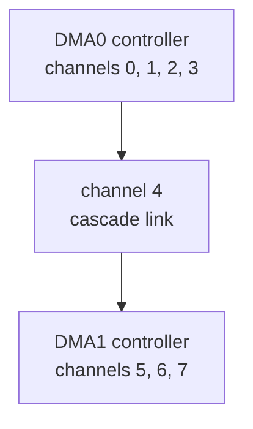
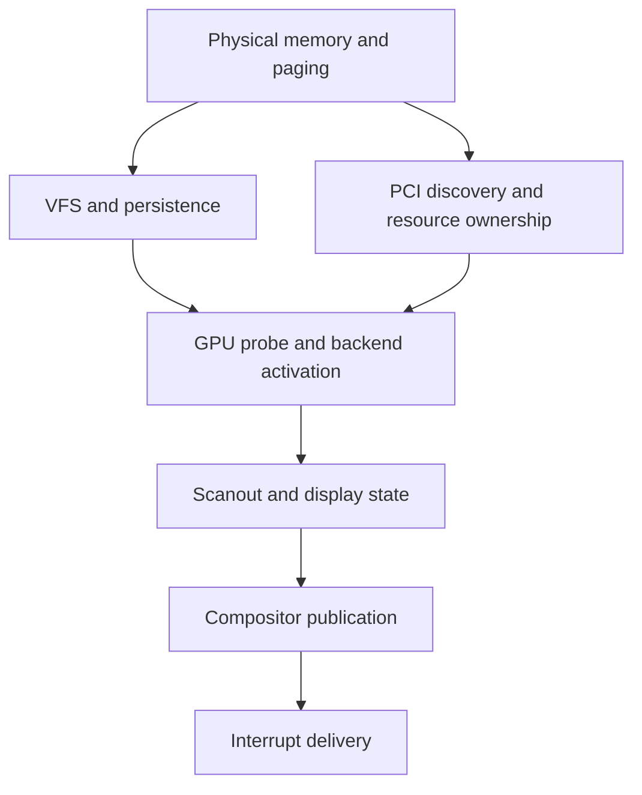

# drivers — How The Hardware Driver Subsystem Works

This module contains the hardware-driver boundary for the Oreulius kernel. It covers raw I/O, interrupt-driven input, display support, and GPU support.

The driver layer matters only where the workload needs real device-backed I/O, input comes from keyboard/mouse drivers through the WASI input path, while network comes from rtl8139 on x86 or virtio-net on AArch64. Display and windowing go through the compositor and framebuffer-backed GPU path, and audio and USB are exposed only through the driver modules that the kernel explicitly binds.

The kernel’s position is not “WASI talks to drivers directly.” It is “WASI talks to capability-gated kernel services, and those services may use drivers underneath.”

The drivers folder exists purely because even an isolated WASI/Rust workload still needs controlled ways to interact with the real machine.

## What It Does

It routes hardware-facing code to the right target-specific driver tree and keeps the device interfaces used by the rest of the kernel in one place.

## Why It Exists

It exists so hardware support can stay organized by target and device family instead of being spread across unrelated kernel code.

## Driver Facade and Compatibility Re-exports

---
## Security Note, and capability based access to the drivers.

In this architecture, the drivers themselves are not open to random access. Only kernel paths that are already wired to a specific service can reach them, and those paths check the workload’s capabilities first. So a WASI program can only touch a driver-backed feature, like input, networking, display, or filesystem access, if the kernel has granted it the matching capability and the host function or service route is designed to honor that check.

If you wanted to see what’s currently granted, the shell command to run inside Oreulius is:

```
cap-list
```

Testing the attenuation behaviour of the capabilities in the kernel is best done with the cap-test-atten command

```
cap-test-atten
```

 you do not simply turn capabilities on and off with a generic OS setting. You do it by granting, attenuating, or revoking capability objects for a specific process.

for example with the Virtual file system, you can grant, attenuate, or revoking capability objects for a specific process with these commands

```
vfs-cap-proc-show <pid>
vfs-cap-proc-set <pid> <cap_spec>
vfs-cap-proc-clear <pid>

vfs-cap-dir-show <path>
vfs-cap-dir-set <path> <cap_spec>
vfs-cap-dir-clear <path>

vfs-cap-effective <pid> <path>
```

these commands will tell you wether a workload has access,

```
cap-list
vfs-cap-proc-show <pid>
vfs-cap-effective <pid> <path>
```
For turning off mouse/keyboard access specifically, there is not currently a finished shell command in this repo that directly says “disable input for workload X.” What exists is the kernel code path. to truly block mouse/keyboard for a WASI workload, you’d need to gate or remove those input host functions in the kernel, not just run a shell command.

This is an excellent "Need to do" for the kernel for my personal development notes.

right now, if the workload is being given a capability you want to remove, you would revoke or attenuate that capability in the kernel code path. Right now, the repo shows that pattern for things like filesystem and console, but not a dedicated mouse capability command.

The best command to make for such a purpose will be something like input_revoke where we see the workloads a capability has access too, and to remove it. Perhaps also to add a command that lets you see specifically the workloads a wasm instance has like Workload-Check <workload_name> so you dont have to look into processes and make the process simpler, while leaving the legacy complexity in order for other processess not involving specific workloads.

---
# Deep Dives of the components.

## PCI Bus

The PCI module provides the x86 configuration-space access used to discover and prepare attached devices. It reads configuration registers through the standard CF8 and CFC I/O ports and records each device's bus location, vendor and device identifiers, class information, revision, and interrupt routing fields.

The current scanner checks bus 0, function 0 across all 32 slots and stores up to 32 results. It does not yet perform complete multi-bus, bridge, or multifunction enumeration, so it should be treated as a bounded early-platform scanner rather than a complete PCI topology manager.

Class, subclass, and programming-interface values let the kernel identify broad device families such as storage, Ethernet, display, audio, USB, and NVMe controllers. Vendor and device identifiers provide more specific matches for supported hardware, while unknown devices remain recorded without being treated as supported automatically.

Base Address Registers describe the I/O-port or memory-mapped regions assigned to a device. A device driver reads the relevant BAR, checks its type, masks the flag bits, and then uses the resulting address only according to that device's specification.

The PCI command register controls whether the device may respond to I/O-port accesses, memory-space accesses, or initiate bus-master transactions. Drivers enable only the bits required by their hardware path. Bus mastering permits DMA but does not establish buffer ownership, address validity, or isolation; those responsibilities remain with the driver, memory manager, and any available IOMMU policy.

## VGA Text Mode

The VGA text-mode module provides the x86 fallback for character-based screen output. Its direct writer treats the conventional memory region at physical address B8000 as an 80-column by 25-row array of character and color cells.

Each cell contains one display byte and one foreground-and-background color value from the standard 16-color VGA palette. The writer tracks its current row and column, wraps at the right edge, advances on a newline, and scrolls the screen upward when output reaches the final row. Clearing the screen fills every cell with a blank character and resets the writer position.

Text written through the direct string path accepts printable ASCII and newlines. Unsupported bytes are replaced with a visible fallback character instead of being interpreted as terminal control sequences. Separate helpers can write a cell, place text at a chosen position, center a line, or clear the display with selected colors.

The public print functions now route normal console output through the shared shell terminal, while formatted diagnostic output is also mirrored to the serial port when its lock is available. The direct VGA buffer remains useful as an x86 text-mode backend and low-level fallback, but it is not the universal console path on framebuffer or AArch64 systems.

## Linear Framebuffer

The linear framebuffer path is the software scanout foundation used by the x86-64 GPU and compositor bring-up. It adopts a display surface that firmware, a bootloader, or a virtual GPU has already configured, maps the physical range into the kernel, renders pixels and text in software, and exposes the resulting dimensions through the GPU scanout abstraction.

This is not a modesetting driver. It does not train a display link, allocate a hardware scanout plane, program a CRTC, discover connectors, select a refresh rate, or submit accelerated GPU commands. It assumes that some earlier authority established a usable linear surface and that the supplied address, pitch, dimensions, format, and mapping remain valid.

| Layer | Current role | Security or correctness dependency |
|---|---|---|
| Legacy framebuffer module | Stores layout, draws pixels, renders a text console, and records PCI display devices | Requires a valid mapped physical surface and checked geometry |
| GPU simplefb backend | Parses Multiboot2 tags, selects fallback modes, owns a shadow buffer, and publishes scanout | Requires complete boot-data validation and bounded buffer sizing |
| GPU scanout router | Presents simplefb through a common backend interface | Requires honest backend availability and generation |
| Compositor framebuffer backend | Converts compositor drawing and flush requests into scanout calls | Requires publication success and synchronized mode state |
| Paging layer | Identity-maps the framebuffer MMIO range | Requires correct memory type, page ownership, and complete error handling |

### Framebuffer Descriptor and Geometry

FramebufferInfo stores the numeric base address, visible width and height, byte pitch, reported bits per pixel, and a PixelFormat value. Pitch is independent of visible width because scan lines may contain hardware padding. Pixel addresses are calculated from the row pitch plus the encoded pixel width.

The current descriptor is a plain public structure, and Framebuffer::new is a safe constructor even though its documentation says that the base must remain valid for the kernel lifetime. The constructor does not prove that the address is mapped, that the mapped range covers pitch times height, that pitch is large enough for one visible row, that base plus size does not overflow, that the address has suitable alignment, or that the mapping uses an appropriate MMIO memory type.

pixel_offset and byte_size perform their multiplication and addition in u32 before converting to usize. Large or hostile geometry can overflow before the conversion. A production descriptor should be created only through a fallible validation function that performs checked arithmetic in usize or u64 and returns a mapping-bearing framebuffer object.

**Base address:** Must identify the first byte of an owned and mapped scanout surface.

**Pitch:** Must be at least width multiplied by bytes per pixel and must describe the actual hardware row stride.

**Extent:** Must cover every byte through the final visible pixel and any row padding used by scrolling or flushing.

**Format:** Must come from boot or device evidence rather than a guessed bits-per-pixel conversion.

**Generation:** Must change when the mode, mapping, device owner, or scanout surface changes.

### Pixel Formats and Access

The legacy path supports BGRX32, XRGB32, BGR24, and RGB565 encodings. Pixel writes reject visible coordinates outside width and height, encode the color, and perform volatile stores. The 24-bit path writes three bytes individually. The 16-bit and 32-bit paths cast the calculated address to a typed pointer and therefore assume suitable alignment.

get_pixel_raw always performs a 32-bit read regardless of the active format. On a 16-bit or 24-bit surface, that reads bytes belonging to adjacent pixels or row padding and can cross the validated logical pixel boundary. The operation is not a format-neutral pixel read and should not be exposed as one.

fill_rect calculates x plus width and y plus height with unchecked u32 addition before clipping. draw_rect subtracts one from width and height, so a zero-sized rectangle underflows. The blit source index is also calculated in u32 before conversion to usize. put_pixel eventually rejects out-of-range destination coordinates, but arithmetic overflow can change which coordinates or source bytes are processed.

scroll_up copies pitch times the surviving row count directly across the framebuffer with ordinary memory-copy semantics, then clears the bottom rows through pixel writes. It assumes that the complete pitch-sized range is mapped and behaves like normal memory. Device mappings can require architecture-specific access and ordering rules; volatile pixel stores do not automatically make a bulk nonvolatile copy correct for every framebuffer memory type.

### Boot Framebuffer Discovery

The GPU simplefb backend searches the Multiboot2 information block for a framebuffer tag. It receives the boot-information pointer as u32, reads the declared total size, walks aligned tags, and accepts framebuffer types zero or two. It then copies the width, height, pitch, bits per pixel, and 64-bit physical address into a VesaMode record.

The parser does not validate the minimum total size, mapping extent, tag-header availability, nonzero tag size, tag size against the remaining block, arithmetic overflow while advancing, framebuffer-tag minimum length, supported Multiboot2 version, color layout fields, pitch consistency, or framebuffer byte-size overflow. A zero or malformed tag size can prevent progress or move the parser incorrectly. Packed structures are dereferenced directly rather than read through alignment-safe field extraction.

The x86-64 runtime narrows its boot information pointer to u32 before GPU initialization. This happens to match the current low boot placement, but it is not a valid general ELF64 or Multiboot2 address contract. The parser and all boot handoff records should use usize or a validated boot-information mapping type.

### PCI Fallback and Guessed Modes

When no accepted Multiboot2 framebuffer exists, simplefb scans PCI again, records display-class devices, and asks the legacy framebuffer module to initialize from the first usable BAR0. The fallback masks BAR flags and assumes a 640 by 480, 32-bit BGRX surface without reading BAR size, checking 64-bit BAR pairing, proving that BAR0 is the scanout aperture, or establishing that firmware programmed that resolution.

If boot discovery and PCI fallback both fail, activation fabricates a 1024 by 768, 32-bit mode at physical address FD000000 and returns success after publishing it. This can map and write an address that no device owns. The GPU probe also creates a Scanout report when no devices were discovered, which can cause an unavailable display to be represented as a supported simple framebuffer.

Vendor-family GPU modules route Intel, AMD, NVIDIA, Bochs, QXL, and VirtIO GPU activation through the same simplefb path. Some probes read a display-engine register, but they do not prove that the simplefb physical address is the surface currently scanned out by that engine. Device-family identification must not substitute for verified scanout provenance.

### Mapping and Memory Type

The legacy initialization path computes pitch times height with saturating arithmetic and asks the paging layer to identity-map the resulting range. Mapping errors are ignored. On x86-64, simplefb calls the architecture MMIO identity mapper separately because the legacy paging global does not own the active page tables.

The code does not publish whether mapping succeeded before constructing Framebuffer and GpuFramebuffer values. It also does not reserve the physical range, prevent overlap with RAM or another device, select write-combining or uncached page attributes, invalidate stale mappings after mode change, or unmap the range after device loss.

Framebuffer access requires more than present writable pages. The mapping must use a cache policy supported by the device, preserve ordering relative to flush or page-flip operations, and prevent workloads from obtaining writable aliases. A mature mapping object should carry physical extent, virtual address, cache policy, owner, device generation, and revocation state.

### Dual State and Shadow Buffer

Initialization creates two related global states. DISPLAY stores the legacy Framebuffer, text console, and detected device list. GPU_FB stores a GpuFramebuffer with a front pointer, one fixed global shadow pointer, mode metadata, and a double-buffer flag. These structures can disagree after partial initialization, failed mapping, backend reset, or direct mutation through their public global locks.

The shadow buffer is fixed at 1920 by 1080 by four bytes. Modes larger than that are accepted. Pixel writes use the mode-derived offset without checking it against shadow capacity, so a larger resolution, pitch, or malformed geometry can write beyond the global buffer. clear and swap_buffers cap their byte count, but put_pixel, fill_rect, and flush_row do not. flush_row can also copy a complete pitch-sized row beyond the shadow buffer near the end of an oversized mode.

swap_buffers copies the shadow contents to the front pointer with copy_nonoverlapping rather than volatile or device-aware stores. It does not return completion status, apply an explicit memory barrier, synchronize with vertical blanking, track damage, or prove that the front mapping remains active. Tearing and silent publication failure are therefore expected possibilities.

GpuFramebuffer manually implements Send and Sync because it stores raw pointers. The global mutex serializes ordinary access through GPU_FB, but the public re-export exposes the guard and framebuffer type broadly. The safety case depends on every user respecting one lock, no stale pointer surviving replacement, and no interrupt or other path writing the front surface independently.

### Framebuffer Console

FramebufferConsole derives its text rows and columns from width divided by eight and height divided by sixteen. It renders a built-in printable ASCII font, tracks cursor position and palette, wraps lines, and scrolls through the raw framebuffer.

The console and framebuffer are stored as separate fields under DISPLAY. Printing obtains raw pointers to both fields to work around Rust's borrow rules while retaining the mutex guard. The current use is serialized, but the abstraction relies on the framebuffer not being replaced or independently accessed during the unsafe call. A dedicated display-state method could safely borrow disjoint fields without exporting raw pointers.

Framebuffer output is not the kernel's only console. VGA text mode, serial output, shell terminal state, and the compositor can all present or mutate visible state. There is no single console ownership or mode-transition transaction that preserves content, cursor, focus, and audit evidence when switching backends.

### Compositor and Publication Path

The x86-64 runtime initializes the GPU substrate, reads active dimensions, and initializes the compositor with those numbers. FbBackend marks itself available solely when width and height are nonzero. Drawing requests then route through the active scanout backend and flush through simplefb.

This makes dimensions a proxy for health. The backend does not verify that the framebuffer mapping succeeded, that a present operation completed, or that the active GPU generation still matches. Compositor initialization records PresentComplete before proving that the initial clear and flush became visible. Later flush operations return no result, so damage can be cleared even when presentation did nothing.

On AArch64, framebuffer backend calls become shadow counters rather than visible output. That is a useful test scaffold, but it is not display support. The linear framebuffer and GPU modules remain under the x86 driver root, so the current implementation is not architecture-neutral.

### Code Audit Status

**Complete today:** Fixed pixel encoders exist for four formats, coordinate checks protect individual visible pixel writes, the text console has bounded cursor movement, PCI display devices are classified for diagnostics, x86-64 can map and display an accepted simple framebuffer in supported QEMU configurations, and the compositor can route software drawing through the active scanout backend.

**Partially complete:** Multiboot2 framebuffer discovery, PCI fallback, MMIO mapping, double buffering, console rendering, GPU-family routing, display locking, and compositor publication are implemented but do not form one validated transactional lifecycle.

**Not complete:** Checked geometry construction, trustworthy boot-tag parsing, BAR ownership and sizing, honest unavailable behavior, large-mode shadow bounds, mapping-status propagation, memory-type policy, mode changes, hot removal, generation tracking, publication results, vblank synchronization, AArch64 output, or capability-bound surface ownership.

**Needs proof:** No dedicated framebuffer unit, parser, guarded-memory, mapping-failure, mode-change, publication, concurrency, or cross-architecture test suite was found. Existing GPU tests cover selected probe, transfer, scanout, and fence models but do not exercise the raw framebuffer implementation against hostile layouts and boot data.

The drawing surface can clear the screen, read or write individual pixels, fill rectangles, draw outlines, copy pixel blocks, and scroll existing contents upward. These are immediate-mode operations: changes are written directly into the visible framebuffer rather than collected in a retained scene or automatically synchronized to a display refresh.

FramebufferConsole builds a character terminal on top of the pixel surface using an 8 by 16 bitmap font. Its row and column count are derived from the display resolution. It handles newlines, carriage returns, wrapping, scrolling, and selectable foreground and background palettes. The built-in font covers printable ASCII; unsupported bytes render as blank glyphs.

The preferred initialization path receives a framebuffer address and layout from the boot environment. If that information is unavailable, the PCI fallback examines detected display controllers and may treat the first usable memory BAR as a default 640 by 480, 32-bit surface. The framebuffer memory is mapped into the kernel address space when paging is enabled, and the resulting display and console state are stored behind the global display lock.

PCI display discovery records up to four controllers and classifies common NVIDIA, AMD, Intel, VMware, and QEMU devices for diagnostics. Identification does not imply that a vendor-specific GPU command processor, modesetting engine, acceleration path, or display pipeline has been initialized; this module operates only on an already usable linear framebuffer.

## Retired Driver-Level Compositor

The former driver-level compositor has been removed. WASM host imports 28 through 37 retain their existing names and signatures, but every supported operation now uses the compositor service under kernel/src/compositor. Each WasmInstance lazily opens a session bound to its ProcessId, keeps window and surface capabilities in a host-only opaque-handle table, commits damage through the service, and closes the session during instance teardown.

ARGB8888 surface storage, clipping, bitmap text, source-over blending, damage tracking, z-order, and framebuffer publication are now owned by the compositor service. Application-visible drawing no longer allocates pixels from the JIT arena or reaches the GPU framebuffer through a compatibility compositor guard.

The retired implementation is documented separately in
docs/legacy-compositor-window-manager.md. It is not compiled, exported, or
reachable through the current WASM host interface.

### Relationship to the Compositor Service

The compositor service under kernel/src/compositor is now the sole
application-facing window and surface authority. It owns sessions, capability
records, policy checks, windows, reclaimable surfaces, damage, focus, cursor
state, presentation, and audit evidence. The driver layer supplies scanout; it
does not own application windows.

### Legacy Compositor Lifecycle and Authority

There is no active legacy compositor lifecycle. Current lifecycle work belongs
to compositor sessions, service-owned windows and surfaces, display backend
generations, and process-bound cleanup.

### Legacy Compositor Test Coverage

Reusable blending, clipping, drawing, surface, and presentation tests now
belong under kernel/src/compositor. Retirement coverage should prove that
drivers/compositor.rs remains absent, no compatibility accessor is exported,
WASM imports route through authenticated sessions, and instance teardown closes
the session and revokes its handles.
## PS/2 Keyboard

The PS/2 keyboard module is the x86 keyboard path for systems that expose input through the shared i8042 controller. It is not a general keyboard stack yet. It is a bounded, interrupt-oriented legacy controller driver that gives the shell, console, WASI input path, WASM input hosts, and unified input queue a way to receive keyboard events during early kernel operation.

During initialization, the driver disables the keyboard port, reads and rewrites the controller configuration byte, enables IRQ1 and translation, disables the auxiliary mouse path at that stage, reenables the keyboard port, restarts keyboard scanning, and drains stale controller bytes. The waits are bounded, so an unresponsive controller does not trap boot forever, but the function still reports success through a printed message instead of returning a typed initialization result. The driver reads acknowledgement bytes after scan-control commands, yet it does not validate that the device actually returned the expected acknowledgement.

| Area | Current state | Production direction |
|---|---|---|
| Controller setup | Programs the traditional ports and enables translated keyboard input | Return typed failures, verify acknowledgements, and record controller mode |
| Interrupt input | IRQ1 reads status, consumes data, and decodes scan codes | Use one shared i8042 transaction model for keyboard and mouse bytes |
| Event storage | Fixed rings bound memory growth | Add sequence numbers, loss markers, and consumer ownership |
| Scan-code support | Set 1 plus a bounded Set 2 compatibility map | Complete scan-code grammar and separate physical keys from text layout |
| Authority | Some console paths check Console rights, while input hosts can read shared queues directly | Route all workload input through focused, capability-bound input sessions |

### Input Pipeline

Normal input arrives through IRQ1. The handler reads the controller status before consuming the data byte, filters acknowledgement and resend bytes, records error status bits, ignores invalid scan-code values, and forwards auxiliary mouse bytes when the shared controller marks the byte as mouse data. A polling fallback can decode a byte directly when local or emulated interrupt delivery is unavailable, but that fallback also means the controller has more than one consumer path.

**Controller ports:** Port 64 carries controller status and commands. Port 60 carries keyboard data and controller responses.

**Keyboard IRQ:** IRQ1 is the normal keyboard interrupt path. It consumes one pending controller byte, decodes it, and publishes the resulting event when the byte represents a key press.

**Auxiliary handling:** If the controller status marks a byte as auxiliary data, the keyboard path forwards it to the mouse decoder instead of leaving it buffered behind the keyboard stream.

**Polling fallback:** The decoded event poll path can read the controller directly when the event queue is empty and hardware data is still pending. This helps QEMU-style bring-up, but production code needs one owner for controller reads.

**Raw character queue:** A 256-byte ring stores simple character output for callers that only need printable characters, Enter, Backspace, or Tab.

**Decoded event queue:** A 64-entry ring stores structured key events such as characters, navigation keys, Control combinations, Alt character combinations, and supported Alt function-key combinations.

The unified input layer drains the decoded keyboard queue and the mouse queue into one 256-entry event ring. That layer serializes keyboard and mouse events into a compact 12-byte format for WASM-facing input hosts. It gives the runtime a convenient shared event stream, but it also introduces a second place where events can overflow or be consumed by a competing reader.

### Event Shape Examples

The driver currently produces higher-level key events rather than exposing every raw scan-code transition to consumers. A printable key becomes a character event. Enter, Backspace, Tab, and Escape become named terminal-control events. Extended navigation keys become directional or page/navigation events. Control and Alt change the event family when they are active.

| Physical action | Keyboard event | Unified event shape |
|---|---|---|
| A key with no modifiers | Character event | Key event with an ASCII codepoint |
| Enter | Enter event | Key event with newline codepoint and Enter scan code |
| Arrow Up | Up event | Key event with zero codepoint and navigation scan code |
| Control plus C | Control character event | Key event with the control character codepoint |
| Alt plus F1 through F6 | Alt function event | Key event with a function-key scan-code approximation |

This is enough for the current shell and basic runtime input. It is not enough for a production keyboard stack because it does not preserve complete make and break sequences, physical key identity, layout identity, device identity, event generation, or complete modifier transitions.

### Code Audit Status

The keyboard driver has a clear internal direction: keep interrupt handling small, keep memory bounded, and publish decoded events through fixed rings. It uses atomic head and tail fields rather than dynamic allocation or blocking locks. That is the right shape for early kernel input because key events can arrive while other subsystems are unavailable or not safe to call.

**Complete today:** Bounded raw character queue, bounded decoded event queue, IRQ1 entry point, auxiliary-byte forwarding, translated Set 1 handling, partial Set 2 mapping, modifier tracking, Caps Lock behavior, basic navigation keys, console character polling, unified input pump, WASI standard-input integration, native WASM input host functions, and diagnostic counters.

**Partially complete:** Controller initialization, command acknowledgement handling, scan-code set detection, extended-key coverage, modifier reporting through the unified input layer, overflow reporting, and input focus routing.

**Not complete:** Full Set 2 and Set 3 support, complete USB keyboard integration into the same event model, layout handling, Unicode text generation, key release events for ordinary keys, Num Lock and Scroll Lock policy, keypad semantics, Pause and Print Screen sequences, secure attention, per-session input ownership, and production-grade input capability enforcement.

**Needs proof:** There are no dedicated keyboard unit tests or controller-state integration tests in the audited tree. The current confidence comes from bounded code structure and runtime diagnostics, not from repeatable tests covering every scan-code boundary, controller race, overflow case, or authority failure.

### Scan-Code Decoding

The decoder is a stateful byte interpreter built around global atomic flags. It does not retain a structured scan-code packet. Instead, each incoming byte updates the extended-prefix flag, release-prefix flag, scan-code-set mode, or modifier state, then either produces one KeyEvent or produces no event. This keeps the IRQ path small, but it also means malformed, incomplete, or interleaved sequences can alter global state without leaving a complete record of what happened.

| Input form | Current interpretation | Result |
|---|---|---|
| Set 1 make byte | Used directly as a map index or special key | Press-side event or modifier update |
| Set 1 break byte | High bit is removed and release is recorded internally | Modifier release or no public event |
| Set 2 F0 prefix | Marks the next mapped byte as a release | Modifier release or no public event |
| E0 prefix | Marks the next mapped byte as extended | Navigation event, right modifier update, or drop |
| Unknown Set 2 byte | Mapping fails | Byte is discarded without typed evidence |
| F12 make code | Calls the internal reset path | Modifier and decoder state are cleared with no key event |

**Set 1 path:** Controller translation is enabled during initialization, so the normal path expects translated Set 1 bytes. A byte with its high bit set is treated as a break code, reduced to the corresponding make code, and consumed after any relevant modifier state is updated.

**Set 2 path:** A compatibility table maps many Set 2 bytes into Set 1 values. It includes the main alphanumeric block, punctuation, modifiers, F1 through F12, lock keys, keypad entries, and several extended navigation bytes. The driver still calls this a subset because it does not parse the full Set 2 grammar, Pause and Print Screen sequences, all keypad distinctions, or every extended form.

**Prefix state:** F0 and E0 are represented by independent booleans rather than a bounded parser state. The next nonprefix byte consumes the release flag, while the extended flag remains active until an extended press, extended release, or failed Set 2 mapping clears it. Repeated prefixes, malformed orderings, interruptions by controller response bytes, and truncated sequences do not produce typed protocol errors.

**Modifier state:** Left and right Shift share one boolean. Left and right Control share one boolean, and left and right Alt share one boolean. This loses side-specific identity and can release the shared state when one physical key is released while the other remains pressed. Caps Lock is a toggle, but Num Lock and Scroll Lock have no equivalent state model.

**Press and release asymmetry:** Modifier releases update global state, but ordinary key releases disappear. Extended navigation releases also disappear. The public KeyEvent type therefore represents commands and text-oriented presses rather than a complete physical keyboard timeline.

The two static character maps implement a US QWERTY layout. The base map covers letters, digits, punctuation, terminal controls, space, keypad digits, and keypad operators. The shifted map supplies uppercase letters and shifted punctuation. This layout decision is embedded in the hardware driver, so the scan-code layer cannot currently support another keyboard layout without replacing its compile-time maps.

Character selection applies Shift first. Caps Lock is considered only when Shift is not active because it appears in the following branch. The nested Shift check inside the Caps Lock branch is therefore unreachable, so Shift plus Caps Lock produces uppercase rather than the conventional lowercase result. This is a concrete logic defect rather than an unspecified layout choice.

Control transforms only alphabetic output. It lowercases the selected character and emits a Ctrl event carrying that letter, not the conventional control-byte value. Alt emits either AltFn for F1 through F6 or AltChar for the selected character. F7 through F12 are present in the scan-code maps, but the Alt function helper recognizes only the first six function keys.

Named events exist for Enter, Backspace, Tab, Escape, arrows, Home, End, Delete, Page Up, and Page Down. Insert is present in the Set 2 conversion table but has no KeyEvent variant, so it falls through the extended-key switch and disappears. The Super key is explicitly ignored. Keypad keys mostly reuse printable characters and do not account for Num Lock or distinguish keypad identity from the main key block.

Unknown Set 2 bytes are dropped. Unknown regular Set 1 map entries become a visible question-mark character. The second behavior helps developers notice an incomplete mapping, but it creates false input because the resulting event is indistinguishable from the user pressing the question-mark key. A production decoder should emit bounded UnknownKey or MalformedSequence evidence containing the original bytes and device generation.

The mature design should divide processing into three layers. The transport decoder should produce complete physical make and break events. A key-state layer should track left and right modifiers, lock state, repeats, device generation, and recovery after loss. A text-input layer should apply layout, dead-key, compose, Unicode, terminal, and application policy. That separation would let PS/2 and USB HID keyboards share one event contract without forcing their wire formats into the same decoder.

### Bounded Queues and Diagnostics

The driver uses three bounded queue stages. A 64-entry keyboard event ring stores structured KeyEvent values. A separate 256-byte character ring stores a projection of printable characters, Enter, Backspace, and Tab. The unified input layer then drains keyboard and mouse source queues into another 256-entry ring containing serialized input events.

| Queue | Capacity | Producer | Consumers | Overflow behavior |
|---|---:|---|---|---|
| Keyboard event ring | 64 slots, 63 usable | IRQ handler and polling fallback | Shell and unified input pump | Drop new event |
| Character ring | 256 slots, 255 usable | IRQ handler and polling fallback | Console syscall and console service | Drop new byte |
| Unified input ring | 256 slots, 255 usable | Input pump | WASI, WASM, compositor, and other input callers | Drop new event |

Each ring reserves one slot to distinguish full from empty, so its usable capacity is one less than its declared array size. All storage is static, and the interrupt path performs no heap allocation. Acquire and Release operations publish writes after the element is stored and prevent a consumer from reading an unpublished slot.

The implementation is best understood as a single-producer, single-consumer ring shape. The keyboard source rings can receive data from IRQ1 and from the direct polling fallback, while their consumers include the shell and unified pump. The unified queue can be pumped by several callers and drained by WASI, WASM, and compositor code. Atomic head and tail fields do not by themselves make multiple simultaneous producers or consumers safe, because two producers can reserve the same tail slot and two consumers can read the same head slot before either publishes its update.

The keyboard handler increments EVENTS_PUSHED before it knows whether the event ring accepted the event. A full event ring can therefore increase the pushed counter even though no event was retained. Character projection is attempted independently, so the structured event can be lost while its character survives, or the event can survive while the character ring drops its byte. The two public views can consequently describe different input histories.

The polling fallback behaves differently from IRQ delivery. It returns a decoded event directly instead of placing that event into the event ring, but it still projects supported characters into the character ring and increments the pushed counter. A caller using poll_event receives the event immediately, while another consumer can later receive its character projection through the raw queue.

**Keyboard loss counter:** The event ring, character ring, and controller error path all increment one shared DROPPED_PACKETS value. The counter therefore cannot identify whether a raw character, structured event, or parity-related byte was lost.

**Unified loss counter:** The unified ring maintains a separate 32-bit overflow count. It records how many pushes failed but does not identify the source, request, session, sequence range, or event kind.

**Pipeline counters:** IRQ_COUNT and SCANCODE_COUNT exist, along with pushed, popped, ignored, and error counters. The public get_event_stats result exposes only pushed, popped, ignored, and error values, leaving IRQ and scan-code totals inaccessible through that snapshot.

**Last scan code:** LAST_SCANCODE stores one byte after filtering controller acknowledgements and before decoding. It cannot represent multi-byte sequences, scan-code set, make or break status, device identity, or whether decoding succeeded.

**Modifier diagnostics:** get_flags exposes Control, Alt, Shift, and the extended-prefix flag. It omits Caps Lock, release-prefix state, and active scan-code-set mode, so it is not a complete decoder-state snapshot.

When the shared keyboard loss counter crosses its warning threshold, the driver writes DROP! directly into the traditional VGA text buffer at B8000. This avoids taking a console lock from interrupt context, but it assumes mapped VGA text memory, overwrites visible cells outside the terminal state model, and provides no useful evidence on framebuffer-only or non-VGA systems.

The warning cadence is also inconsistent. Queue and error paths call the warning helper on the first drop and every hundredth prior count, while the helper itself emits only when the current count is at least fifty beyond the last warning. The first attempted warning therefore does not display, and later display timing follows the interaction of two different thresholds.

No queue stage carries a sequence number. When an event is dropped, downstream code cannot determine where the gap occurred or whether a missing release left modifier state unreliable. No loss marker is synthesized, and no queue enters a degraded state. Consumers can continue processing later events as though the stream were complete.

Production readiness requires one authoritative hardware-event journal or router with explicit fan-out. Each event needs source, sequence, timestamp, device generation, physical key state, and loss correlation. Each subscriber needs its own bounded cursor or queue so one consumer cannot remove another consumer's event. Overflow policy must identify the affected subscriber, publish a loss marker reliably, reconcile modifier state, and define whether text input continues, resets, or closes the session.

### Authority and Consumer Model

The keyboard path has several workload and kernel consumers, but they do not share one authority model or one delivery contract. Some read the character projection, some read structured KeyEvent values, and others drain the unified keyboard-and-mouse ring. Because all of these interfaces are destructive, the order in which subsystems run determines which input remains visible.

| Consumer | Input source | Authority check | Current consequence |
|---|---|---|---|
| Kernel shell | Keyboard event ring | Trusted kernel path | Competes with unified pumping |
| Native console syscall | Character ring | Console read right on object zero | Reads global characters, not a console-owned stream |
| Console service | Character ring | Presented Console capability and owner check | Capability is checked, but data is still global |
| WASI stdin | Unified ring | Standard descriptor path | Can consume a mouse event and then stop |
| Native WASM input hosts | Unified ring | No input-specific capability check | Can poll, inspect, read, or flush global input |
| Compositor service | Unified ring | Internal session and subscription lookup after dequeue | Routes conceptually, then records audit without delivering |

The shell consumes KeyEvent values directly in its main loop. When it wins the race, those events never reach the unified input ring. When another caller pumps the keyboard queue first, the shell loses those events. This is not a subscription model; it is competition over one queue.

The native console syscall checks that the caller has Console read authority for object zero, then drains the global character ring. The console service verifies a presented capability identifier, resolves its Console object, and checks ownership before draining the same global ring. The service therefore has a stronger object check, but neither path receives characters associated with one console object or focused session.

WASI stdin pumps the unified queue and removes the next event. It accepts the event only when the kind is Key and the codepoint is printable ASCII. If the next event is a mouse event, a navigation key with codepoint zero, or another unsupported key shape, the event has already been removed and the read loop stops. This loses nontext input as a side effect of reading standard input.

Native WASM hosts expose poll, read, event-type inspection, flush, keyboard-ready, and mouse-ready operations over the global unified ring. These hosts do not validate an input capability or focused session in their implementation. Flush removes every pending keyboard and mouse event. Keyboard-ready and mouse-ready inspect only the head event, so they can report false when the requested kind is queued behind another kind.

The compositor has the beginnings of the correct routing model. It tracks focused windows, pointer capture, session ownership, and input subscription. Mouse clicks transfer focus, keyboard events target the focused window, and route_input constructs a session-specific compositor event. The current service tick then discards that constructed event and records only an InputRouted audit entry because per-session event-channel delivery is still marked as future work.

Focus is applied only after the event has been removed from the global ring. A session that is not subscribed causes the event to disappear rather than remain available for another authorized consumer. Focus gained and focus lost event constructors exist, but the audited tick path does not show them being committed as part of an atomic focus transfer.

The present capability model protects console operations, not physical input as its own authority class. There are no distinct rights for raw-key observation, text input, pointer input, queue inspection, flush, focus control, secure attention, input diagnostics, or delegation. A copied or broadly granted Console capability can read from the global character stream without proving that its console currently owns keyboard focus.

This creates confidentiality and integrity risks. An unfocused workload-facing host path may observe keystrokes intended for another session. A consumer can remove or flush events before the intended receiver sees them. Password entry and trusted prompts have no dedicated path that excludes ordinary workloads. Modifier and queue diagnostics expose global device state rather than session-scoped evidence.

A production design should introduce one kernel input router between hardware decoders and clients. The router should accept normalized physical events from PS/2 and USB, maintain trusted device state, apply secure-attention policy first, resolve the focused console or compositor session, and publish to bounded per-session channels. Text generation should happen only after routing determines the authorized recipient and applicable layout.

**Input capability:** Authority should resolve to a specific input session and generation. Rights should distinguish text read, physical-key read, pointer read, subscribe, inspect, flush, focus transfer, diagnostics, and secure attention.

**Focus transaction:** Focus changes should atomically revoke the old recipient, update the focus generation, publish focus-lost and focus-gained evidence, and prevent events from crossing the transition ambiguously.

**Lifecycle cleanup:** Process exit, crash, kill, session close, capability revoke, compositor restart, device reset, and temporal restore should revoke subscriptions and prevent stale queues or focus generations from targeting a replacement session.

**Delivery evidence:** Every accepted, denied, rerouted, dropped, flushed, and undeliverable input event should have bounded correlation fields without recording sensitive text in audit logs.

**Compatibility paths:** Native console, console service, WASI stdin, native WASM hosts, shell input, and compositor events should become adapters over the same router. None should drain the hardware or global queue independently.

### Production Direction

The right direction is to keep the low-level PS/2 driver small and make it a hardware event source, not an input policy engine. It should own controller synchronization, scan-code capture, bounded buffering, and typed hardware evidence. Higher layers should own text layout, focus, secure attention, session routing, capability checks, and user-visible input streams.

**Controller readiness:** Initialization should return typed success or failure, validate acknowledgements, detect absent hardware, verify translation state, and coordinate with the mouse driver through one shared i8042 command path.

**Decoder maturity:** The scan-code layer should preserve complete make and break sequences, support every required extended sequence, distinguish unknown physical keys from typed text, and keep device generation attached to every event.

**Queue integrity:** Every queue should carry sequence numbers, overflow evidence, and deterministic recovery behavior so consumers can detect missing input instead of treating a partial stream as complete.

**Authority binding:** Input delivery should require focused-session authority or an explicit input-read capability. Flush and diagnostic operations need separate rights because they can destroy or reveal another workload's input stream.

**Testing:** The production test program should cover initialization failures, ACK and resend behavior, Set 1 and Set 2 decoding, every modifier transition, overflow, mouse-byte interleaving, polling and interrupt races, queue consumers, console authorization, WASI and WASM input paths, compositor focus routing, and stale-session denial.

## PS/2 Mouse + USB HID Mouse

The mouse subsystem combines two hardware paths behind one relative-motion event interface. The PS/2 path receives bytes from the auxiliary side of the shared i8042 controller and assembles them into three-byte or four-byte packets. The USB path accepts four-byte HID boot-protocol reports from the UHCI or EHCI driver. Both paths update the global pointer state and publish MouseEvent records into the same fixed-capacity ring.

This gives higher layers one source for movement, wheel, and button data, but it does not make the two device paths fully equivalent. Their initialization, packet validation, coordinate conversion, error reporting, and device discovery remain separate. The shared event ring also removes source identity, so a consumer cannot currently determine whether an event came from a PS/2 device or a USB device.

| Area | Current implementation | Production direction |
|---|---|---|
| PS/2 transport | Shared i8042 command and data ports with bounded polling waits | One serialized controller transaction layer shared with the keyboard |
| PS/2 packets | Standard three-byte packets and IntelliMouse four-byte packets | Typed packet states, complete response validation, and resynchronization evidence |
| USB transport | Four-byte HID boot reports over UHCI or EHCI polling | Interface-descriptor discovery, endpoint validation, and report-descriptor support |
| Pointer data | Relative X and Y movement, wheel movement, and three buttons | Consistent coordinates, additional buttons, source identity, and device generation |
| Event storage | One static 128-slot ring shared by both paths | Proven concurrency, sequence numbers, visible loss, and owned subscriptions |
| Diagnostics | PS/2 overflow count, pending event count, and initialization state | Typed transport, packet, queue, device, and lifecycle diagnostics |

### PS/2 Controller Initialization

Initialization enables the auxiliary i8042 port, reads the controller configuration byte, enables IRQ12, clears the mouse-clock disable bit, resets the device, probes for IntelliMouse wheel support, programs resolution and sample rate, and enables data reporting. All storage is static, and the wait loops have fixed iteration limits, so a controller that never changes state cannot hold the kernel in an unbounded polling loop.

**Controller commands:** Port 64 receives i8042 controller commands. Port 60 carries command data, device responses, and mouse packet bytes.

**Auxiliary routing:** The command prefix D4 directs the following byte to the mouse rather than the keyboard side of the shared controller.

**Interrupt setup:** The configuration-byte update enables the auxiliary interrupt and reenables the mouse clock so IRQ12 can carry device data.

**Wheel detection:** The driver sends the 200, 100, and 80 sample-rate sequence, requests the device identifier, and selects four-byte packets when the returned identifier is 03.

**Operating parameters:** The current setup requests four counts per millimetre, a 100 Hz sample rate, and continuous reporting.

The current procedure is bounded but not transactional. It does not return a typed result, does not verify the controller-ready condition before every read, and discards reset, acknowledgement, self-test, resend, and device-identifier responses without checking their expected values. The public initialization function marks the mouse initialized after the procedure returns, even if the controller was absent or a command failed. Boot output therefore reports readiness more strongly than the implementation proves it.

The keyboard and mouse also share the same i8042 output buffer without one controller-wide command owner. The keyboard initialization can disable the auxiliary path, keyboard polling can forward auxiliary bytes into the mouse decoder, and IRQ12 can encounter keyboard data. These accommodations help bring-up, but a production implementation needs one serialized state machine that distinguishes command responses from asynchronous keyboard and mouse input.

### PS/2 Packet Decoding

The packet assembler waits for the mandatory synchronization bit in the first byte, then collects either three or four bytes according to the detected device mode. Standard packets carry button state, sign and overflow flags, and eight-bit X and Y movement. IntelliMouse packets add a signed four-bit wheel value.

| Packet field | Current interpretation | Important boundary |
|---|---|---|
| First byte | Synchronization, three buttons, signs, and overflow flags | A missing synchronization bit discards the candidate first byte |
| X movement | Nine-bit signed relative delta | Horizontal overflow suppresses movement |
| Y movement | Nine-bit signed delta inverted for screen coordinates | Vertical overflow suppresses movement |
| Wheel | Signed low nibble of the fourth byte | Available only after IntelliMouse detection |
| Extra buttons | Present in some four-byte packet variants | Fourth and fifth buttons are currently ignored |

Packets with an X or Y overflow flag increment a diagnostic counter and emit a zero-motion event that preserves the low three button bits. Ordinary movement updates the global atomic pointer coordinates and enters the event ring as a relative delta. The compositor later accumulates and clamps those deltas to the active screen dimensions.

The synchronization check protects only the beginning of a packet. There is no explicit recovery record when bytes are discarded, no packet generation tied to controller reset, and no distinction between a malformed stream and an unsupported packet extension. Absolute pointer devices, high-resolution wheel encodings, five-button IntelliMouse variants, and vendor-specific packets are outside the current decoder.

### USB HID Mouse Path

The USB implementation supports the fixed HID boot-protocol mouse report rather than the general HID report-descriptor model. A report contains one button byte, signed eight-bit X and Y deltas, and a signed eight-bit wheel delta. UHCI and EHCI polling functions read four bytes from the interrupt endpoint, decode the report, and immediately submit it to the shared mouse path.

**Protocol mode:** HID setup requests boot protocol so the driver can use a fixed report layout without parsing arbitrary HID descriptors.

**Transfer model:** The controller path polls the interrupt endpoint and returns no report for both normal NAK conditions and transfer failures.

**Button model:** Only the low three bits survive submission, corresponding to left, right, and middle buttons.

**Endpoint model:** The open helper currently assumes interrupt endpoint 81 and derives packet size from device speed rather than from the selected interface endpoint descriptor.

**Discovery model:** The helper selects the first enumerated device whose device-class field identifies HID, then constructs either a keyboard or mouse handle according to the helper that was called. It does not prove the chosen interface subclass and protocol before assigning that role.

The boot-report parser itself is compact and bounded, but discovery and transport evidence are incomplete. Composite devices commonly advertise HID at the interface level rather than the device level, and their endpoint numbers are descriptor-defined. A production path must select the correct interface, alternate setting, protocol, interrupt endpoint, polling interval, and maximum packet size from validated descriptors. It must also distinguish no-data, disconnect, stall, malformed report, short transfer, and controller failure.

There is also a current coordinate inconsistency. USB submission adds the raw Y delta to the global pointer state but negates the Y delta placed in the event ring. A caller reading global state can therefore observe movement in the opposite vertical direction from a compositor or workload consuming events. The PS/2 path already performs its coordinate conversion before updating both representations, so the USB path should adopt the same single canonical convention.

### Shared Mouse State and Event Ring

The shared mouse layer exposes relative events and an absolute global state. Each MouseEvent contains X movement, Y movement, wheel movement, and a button mask. The global MouseState contains accumulated X and Y coordinates plus the latest button mask. Higher layers can also replace the absolute position directly.

The event ring has 128 physical entries and reserves one slot to distinguish full from empty, leaving 127 usable events. A full ring silently rejects the new event. Unlike PS/2 packet overflow, event-ring overflow has no counter, loss marker, sequence gap, audit record, or request to resynchronize button state.

The ring uses atomic head and tail indices in a single-producer, single-consumer shape, but the actual call graph is broader. IRQ12, keyboard-side auxiliary forwarding, and USB report submission can all publish mouse events. The unified input pump consumes them, while other kernel callers can also invoke the public pop function. Atomic indices alone do not make simultaneous producers or simultaneous consumers correct because two callers can reserve or consume the same slot.

**Complete today:** Static allocation, bounded PS/2 packet assembly, three-button motion events, IntelliMouse wheel probing, IRQ12 integration, keyboard-side auxiliary forwarding, USB boot-report decoding, UHCI and EHCI submission hooks, global pointer state, and basic diagnostics.

**Partially complete:** Controller response handling, device discovery, wheel-device detection, packet resynchronization, USB endpoint selection, button coverage, queue overflow diagnostics, and shared-controller coordination.

**Not complete:** Validated i8042 transactions, complete USB HID interface discovery, HID report descriptors, hotplug and disconnect cleanup, per-device identity, device generations, five-button delivery, high-resolution scrolling, consistent USB coordinates, queue loss evidence, capability-bound pointer access, and a proven multiproducer event queue.

**Needs proof:** The audited mouse and unified input modules contain no dedicated unit tests for packet assembly, USB reports, ring capacity, wraparound, coordinate consistency, controller failures, or concurrent producers. Existing compositor tests exercise routing from already-constructed InputEvent values, not the hardware-to-event pipeline.

## Unified Input Queue

The unified input module drains decoded keyboard events and mouse events into one fixed ring of tagged InputEvent values. This separates most consumers from PS/2 packet formats and device-specific queues. WASI standard input, native WASM input hosts, and the compositor can all consume the same representation without calling the keyboard or mouse decoder directly.

The unification occurs after each hardware driver has already interpreted its data. Keyboard events have been reduced to characters or named navigation actions, and mouse packets have been reduced to relative movement, wheel movement, and a button mask. The unified queue is therefore a delivery format, not an authoritative raw-device record.

### Pump and Ordering Model

The pump drains the complete decoded keyboard queue first and then drains the complete mouse queue. It preserves order within each source queue but cannot preserve the real interleaving between keyboard and mouse interrupts. If a mouse event arrived before a keyboard event, the keyboard event can still enter the unified ring first because source priority is fixed.

Each source event is removed before the unified push result is acted upon. If the unified ring is full, the push increments its overflow counter and rejects the event, but the original source event has already been consumed. The event cannot be retried, and the caller receives no event-loss marker. This is bounded behavior, but it is lossy transfer rather than backpressure.

The ring contains 256 physical slots and exposes 255 usable entries. Poll reads only whether the ring is empty. Key polling and mouse polling inspect only the first pending event, so they answer whether the head event has the requested kind rather than whether any queued event has that kind. Flush destructively removes every pending event without regard to source, focused window, process, or session.

| Operation | Current behavior | Limitation |
|---|---|---|
| Pump | Drains keyboard, then mouse, until both source queues are empty | Cross-device arrival order is not preserved |
| Poll | Reports whether any event is queued | Does not identify ownership, loss, or source |
| Key or mouse poll | Checks only the head event kind | Events behind another kind remain hidden |
| Read | Removes one global event | Competing readers can consume each other’s input |
| Flush | Removes the complete global queue | No session, source, or capability boundary |
| Overflow count | Counts rejected unified pushes | Does not identify lost sequences or affected consumers |

The ring implementation again has a single-producer, single-consumer structure, while pump, read, and flush are reachable from several execution paths. The code comment permits concurrent pumping and accepts possible reordering, but simultaneous producers can overwrite the same tail slot and simultaneous consumers can read the same head slot. Production use requires either one serialized router or a queue algorithm whose multiproducer and multiconsumer properties are formally matched to the call graph.

### InputEvent Layout

InputEvent uses a one-byte kind tag, three explicit zero padding bytes, and an eight-byte union. The serialized representation is exactly 12 bytes and uses little-endian field encoding through the in-memory union bytes. Constructors initialize the explicit padding, which keeps the exported record deterministic for the currently supported variants.

| Offset | Size | Meaning |
|---|---:|---|
| 0 | 1 byte | Event kind: none, key, mouse, or reserved gamepad |
| 1 | 3 bytes | Zero padding |
| 4 | 8 bytes | Key or mouse payload |

**Keyboard payload:** A 32-bit codepoint is followed by an eight-bit scan code, an eight-bit pressed or released state, an eight-bit modifier mask, and one zero padding byte.

**Mouse payload:** Signed 16-bit X and Y deltas are followed by an eight-bit wheel delta, an eight-bit button mask, and two zero padding bytes.

**Gamepad tag:** The event kind reserves a gamepad value, but there is no gamepad payload variant or producer. The public gamepad poll host function always reports no event.

The layout is compact, but it is not yet a stable versioned ABI. It carries no format version, total length, sequence number, timestamp, device identifier, device generation, session identifier, focus generation, loss state, or integrity boundary. Serializing the native union bytes also ties the wire definition to the declared Rust field layout and target endianness assumptions. A mature ABI should encode each field explicitly and reject unknown versions or variants rather than exporting a native representation by convention.

Keyboard conversion loses additional evidence before serialization. Printable characters receive a zero scan code, ordinary key releases are generally absent, the modifier mask remains zero because the current unified modifier updater is disconnected from real physical modifier transitions, and unknown keyboard mappings can already have become question-mark characters. Mouse conversion narrows movement from the source event’s signed machine-sized values to signed 16-bit fields without a checked conversion, although current PS/2 and USB deltas are small enough to fit.

### Consumers and Authority

WASI standard input pumps the global queue and reads one event at a time. If the next event is not a keyboard event, the match exits after that event has already been removed, so mouse events can be discarded while a workload is waiting for text. Non-ASCII and zero-codepoint key events can also be consumed without producing a byte.

Native WASM input hosts expose poll, read, type inspection, flush, key readiness, mouse readiness, and a reserved gamepad readiness operation. These functions operate on the shared queue directly and do not establish an input-specific capability, focused session, or per-workload subscription before reading or deleting events.

The compositor drains the same queue, performs hit testing, pointer capture, and keyboard-focus selection, and constructs a RoutedEvent for a subscribed session. The current service tick records that routing occurred but leaves actual delivery to a future session event channel. An event can therefore be removed from the global queue, routed successfully in memory, and still never reach the intended client.

This consumer model is appropriate for early integration but not for confidential or authoritative input. Passwords, secure prompts, console commands, and window input all share destructive queues that can be drained or flushed by unrelated kernel-facing paths. Focus is applied after global consumption rather than serving as the authority that determines which subscriber receives the event.

### Code Audit Status

**Complete today:** Fixed-size event variants, deterministic 12-byte constructors, keyboard and mouse source draining, a bounded 256-slot ring, poll and read operations, overflow counting, WASI integration, native WASM host functions, and compositor-side focus and pointer routing logic.

**Partially complete:** Modifier reporting, scan-code preservation, release events, source ordering, overflow observability, compositor delivery, gamepad reservation, concurrency safety, and separation between text input and physical-key input.

**Not complete:** Per-session queues, authenticated input authority, source and device identity, sequence numbers, timestamps, explicit loss events, stable ABI versioning, secure attention, complete focused delivery, source-aware flushing, independent WASI text delivery, and recovery after dropped modifier or button transitions.

### Production Direction

The production architecture should establish one authoritative input router between hardware sources and workload-facing queues. Hardware drivers should publish immutable physical events containing source identity, device generation, monotonic sequence, timestamp, transition state, and bounded transport evidence. The router should then apply layout, focus, pointer capture, secure-attention policy, and capability checks before delivering a derived event to an owned subscription.

**Mouse transport:** Serialize i8042 transactions, validate every response, discover USB HID interfaces from descriptors, support disconnect generations, and normalize coordinates once before updating state or events.

**Event integrity:** Preserve real cross-device ordering at the router, assign sequence numbers, report every overflow, and define how clients recover when a key release, button release, or motion event is lost.

**Delivery authority:** Bind subscriptions to authenticated processes or compositor sessions with separate rights for read, inspect, flush, focus control, diagnostics, and secure attention.

**ABI stability:** Replace native-union serialization with explicit versioned encoding and include source, sequence, time, state, and loss fields needed by clients to validate the stream.

**Testing:** Add scripted i8042 and USB fixtures, packet and report conformance tests, exact ring-capacity models, concurrent producer tests, coordinate consistency checks, mixed keyboard and mouse ordering tests, overflow recovery tests, compositor delivery tests, and end-to-end denial tests for unfocused or unauthorized consumers.

## USB Host Controller Subsystem

The USB subsystem is implemented as one x86-oriented module containing PCI discovery, UHCI, OHCI, EHCI, and xHCI controller code, boot-time root-port probing, a fixed global device inventory, and class-driver helpers. It is designed around bounded static descriptor pools and polling, which makes early emulator bring-up possible without a general asynchronous USB core.

The four backends do not yet provide equivalent behavior. UHCI, OHCI, and EHCI construct control transfers used by the shared enumeration path. UHCI and EHCI also expose bulk operations, UHCI exposes an interrupt enqueue operation, and xHCI has command, event, and transfer rings sufficient for a narrow root-port enumeration path. Controller objects are temporary during initialization; the global bus retains only summary records, so later class drivers commonly reconstruct controller state from PCI information instead of using one persistent controller owner.

### PCI Controller Discovery

UsbBus::detect scans the PCI inventory for class 0x0C, subclass 0x03, and recognizes programming interfaces 0x00, 0x10, 0x20, and 0x30 as UHCI, OHCI, EHCI, and xHCI. It appends up to eight summaries containing controller kind, copied PCI identity, and an initialized Boolean.

Discovery does not clear or reconcile the existing table before appending. Repeated initialization can duplicate controllers or exhaust the table. Unsupported programming interfaces are silently skipped, and overflow beyond eight controllers has no diagnostic record.

Initialization reads BAR4 for UHCI and BAR0 for the MMIO controllers, masks low flag bits, and treats the remaining number as the complete usable base. It does not size BARs, reconstruct 64-bit BAR pairs, reserve I/O or MMIO ranges, validate aperture lengths, select cache attributes, enable and restore PCI decoding or bus mastering transactionally, or bind resources to an exclusive controller claim. Legacy interrupt-line, MSI, MSI-X, IOMMU, power-management, and reset-domain information are not incorporated into discovery.

A production discovery record should preserve PCI segment, bus, device, function, vendor, device, revision, programming interface, complete BAR descriptors, interrupt capabilities, DMA width, companion-controller relationships, firmware ownership state, and a discovery generation. No register access should occur until the controller has an exclusive resource claim and validated mappings.

### UHCI Controller

UHCI uses port I/O, a 1024-entry frame list, 64 transfer descriptors, 16 queue heads, and a maximum scan of two root ports. Initialization performs global and host-controller resets, clears status, disables interrupts, programs SOF timing and frame zero, installs the frame-list address, starts the controller, and infers port count from a reserved-looking port-status bit.

Control transfers build SETUP, zero or more eight-byte DATA TDs, and STATUS TDs. Bulk transfers submit one packet at a time. The interrupt helper allocates one TD and places it only in frame-list entry zero, returning its physical address for external polling. Normal synchronous transfers overwrite every frame-list entry with one TD chain and spin until completion or a fixed iteration limit.

The frame list is one global mutable object for the whole system, despite discovery allowing several UHCI controllers. The last initialized or active controller can therefore program and mutate the same schedule as another controller. Descriptor addresses and data-buffer pointers are Rust virtual addresses truncated to 32 bits and assumed to be physical, contiguous, pinned, coherent, and reachable by the controller.

Reset and startup timeouts do not become initialization failures. initialised is set even if reset never completed or the schedule never started. Transfer completion distinguishes stall, timeout, a combined bus error, and pool exhaustion, but does not report actual transferred length, NAK policy, cancellation, disconnect, controller halt, or generation. The interrupt TD has no complete reclaim API in the controller interface and frame zero is not a correct general periodic schedule.

### OHCI Controller

OHCI uses MMIO, one global 256-byte HCCA, an eight-entry endpoint-descriptor pool, and a 32-entry general TD pool. Initialization requests firmware ownership, issues software reset, programs HCCA and fixed frame-timing values, enables control, bulk, and periodic lists, disables interrupts, reads the root-hub port count, powers every reported port, and enters operational state.

The control path allocates one ED plus SETUP, optional DATA, and STATUS TDs, points the control-list head at that ED, sets the control-list-filled bit, and polls the status TD. It supports only one DATA TD. Although this is enough for the current 18-byte device-descriptor request on common hardware, it is not a general control-transfer engine for larger configuration, string, HID, hub, or class descriptors.

The HCCA is shared globally by all OHCI instances. All ED, TD, HCCA, setup, and data addresses are narrowed to 32-bit pointer values without DMA allocation or translation. Initialization does not verify reset completion, operational state, port-power timing from root-hub descriptors, ownership handoff success, or controller health before publishing success.

The control ED uses a zero tail pointer rather than a separately allocated dummy tail TD, and the implementation does not consume the HCCA done queue. It polls one TD control word, removes the control-list head immediately afterward, and frees descriptors without a formal schedule synchronization proof. Interrupt scheduling structures are enabled but no OHCI interrupt-transfer API is implemented in this controller section.

### EHCI Controller

EHCI derives its operational base from CAPLENGTH, follows the extended-capability chain for BIOS ownership handoff, resets the controller, selects 32-bit segment zero, disables interrupts, routes ports to EHCI, starts the controller, obtains the root-port count, and powers the ports. Control and bulk transfers use an eight-QH and 32-qTD static pool with a single-QH asynchronous schedule enabled for each transaction.

The root-port reset path treats a K-state as a low/full-speed device, sets the companion-owner bit, and reports Full to the shared enumeration loop. The shared loop then attempts to enumerate that device using the EHCI controller even though ownership was transferred to a companion controller. There is no topology record connecting that port to the matching UHCI or OHCI instance.

Control transfers use one DATA qTD and select an endpoint-zero maximum packet size of 64 for high speed or 8 otherwise. They do not perform the standard initial eight-byte descriptor read needed to learn a full-speed device's actual endpoint-zero packet size. Bulk transfers run one packet-sized qTD at a time, toggle in software, and can return success if qTD allocation fails after partial progress because pool exhaustion breaks the loop before the final unconditional true.

Buffer page pointers are synthesized by adding 4096 to a virtual pointer, which does not prove physical continuity and does not account correctly for an initially unaligned buffer across all five qTD page pointers. Async-schedule enable and disable waits are bounded but their timeout results are ignored. Split transactions, transaction translators, periodic scheduling, isochronous transfers, 64-bit addressing, frame-list rollover, and asynchronous-advance synchronization are not implemented.

### xHCI Controller

xHCI performs extended-capability BIOS handoff, derives operational, doorbell, and runtime bases, stops and resets the controller, configures up to 32 slots, installs a DCBAA, command ring, event ring, one shared transfer ring, and one ERST entry, then starts the controller. Root ports are scanned up to a hard limit of 16, powered, reset, and assigned speed codes from PORTSC.

Enumeration issues Enable Slot, Address Device, a device-descriptor control transfer, and an attempted SET_CONFIGURATION(1). Command and transfer completions are polled from the event ring. The event consumer discards unrelated events while waiting for a desired type, so port-status changes and completions for other work can be lost.

The static xHCI memory is global rather than per controller. One transfer ring and one input context are shared by every slot and endpoint. Each output device context is only 64 bytes even though a device with endpoint contexts requires substantially more storage, and context size selection from HCCPARAMS1.CSZ is not honored. Scratchpad-buffer requirements from HCSPARAMS2 and page-size compatibility are not implemented.

Capability-derived offsets are not masked according to their register definitions before addition. Port protocols from Supported Protocol extended capabilities are not parsed, unknown speed IDs collapse to full speed in the bus record, and USB 3 link-state and warm-reset rules are absent. Ring occupancy does not track outstanding TRBs, completion events are not correlated to the command or transfer TRB pointer, and no Disable Slot cleanup occurs after enumeration failure.

All ring, context, ERST, DCBAA, and payload addresses assume static memory is directly DMA-visible. Cache synchronization, release/acquire barriers, IOMMU mapping, DMA width, interrupter setup, endpoint configuration beyond EP0, streams, hubs, and teardown are not complete.

### Controller Initialization and Reset

Initialization is synchronous and runs while holding the global USB_BUS mutex. Each backend uses iteration-count delays rather than a monotonic clock, so timeout duration depends on processor and emulator speed. UHCI, OHCI, and EHCI initializers return no result; xHCI returns true unconditionally after its final loop. The global summary is generally marked initialized after the function returns, not after verified reset, run-state, schedule, port, and transfer-path checks.

Firmware handoff is best effort. Timeouts do not prevent continued programming, and original firmware or PCI state is not preserved for rollback. Reset loops often break on success but do not test whether their bounds expired. Partial initialization can therefore leave decoding, ownership semaphores, schedules, port routing, power, and DMA pointers changed while the bus reports a usable controller.

A complete lifecycle should use detected, claimed, firmware-handoff, halted, reset, configured, running, quiescing, failed, removed, and retired states. Every transition needs a deadline, typed failure, cleanup guard, controller generation, and audit evidence. Reset must block submissions, disable schedules and interrupts, stop DMA, resolve outstanding transfers, revalidate resources, rebuild controller-owned memory, and publish a new generation only after a known transfer path succeeds.

### Transfer Descriptors, Queues, and Rings

The subsystem deliberately uses fixed storage: 64 UHCI TDs and 16 QHs, eight OHCI EDs and 32 TDs, eight EHCI QHs and 32 qTDs, and 64-entry xHCI command, event, and transfer rings. This bounds memory use and avoids allocator dependency during boot.

Those structures are embedded in temporary controller objects or stored in global static memory. Hardware is given addresses produced by casting Rust references, pointers, and slices to u32 or u64. There is no common DMA object proving physical address, pinning, alignment, contiguity, cache coherence, address width, IOMMU ownership, lifetime, or exclusion from reuse.

Compiler fences are used in selected UHCI scheduling code, but there is no architecture-wide DMA release/acquire contract around descriptor publication, doorbells, status consumption, or buffer ownership. Volatile polling alone does not establish device visibility on every target.

Pools track only used Booleans. They do not carry transfer IDs, controller generations, endpoint ownership, cancellation state, actual lengths, deadlines, or completion references. Static global schedules also prevent independent simultaneous controllers. Production queues should use generation-bearing DMA allocations, explicit CPU/device ownership transitions, checked descriptor builders, endpoint-specific state, and completion-driven reclamation.

### USB Interrupt Handling

The active controller paths are polling based. Initialization disables UHCI, OHCI, and EHCI interrupt sources, and xHCI starts without enabling USBCMD.INTE or configuring IMAN for interrupt delivery. Transfer completion is found by spinning on descriptors or consuming the xHCI event ring.

on_usb_irq only increments a relaxed global counter. It does not identify a controller, read or acknowledge controller status, drain completed descriptors, process port changes, wake blocked transfers, mask a storm, or defer work. No controller interrupt registration or teardown is visible in this subsystem.

This means the health IRQ count is not evidence that USB work completed correctly. It also means hotplug events are not serviced after boot enumeration. A complete interrupt path needs per-controller routes and generations, bounded cause capture and acknowledgement, completion queues, deferred enumeration and recovery, shared-line filtering, MSI/MSI-X support where appropriate, lost-interrupt fallback, storm containment, and synchronization before controller memory is released.

### Controller Health and Diagnostics

health() reports detected-controller count, number whose summary Boolean is initialized, registered-device count, and the global IRQ counter. Controller summaries expose kind, copied PCI identity, and initialized state.

The snapshot does not report BAR validation, ownership handoff, reset outcome, halted state, schedule state, root-port state, pool occupancy, ring positions, transfer successes, stalls, timeouts, malformed descriptors, address exhaustion, disconnects, DMA faults, or last error. An initializer that timed out internally may still count as healthy.

Diagnostics should be per controller and generation. They should include lifecycle state, resource claim, firmware handoff, negotiated DMA properties, port inventory, submitted and completed transfer counts, typed failure counters, queue occupancy, interrupt evidence, recovery attempts, and bounded recent faults. Raw physical addresses and private USB payloads should remain restricted.

## USB Device Enumeration and Descriptor Parsing

Enumeration currently occurs once, immediately after each controller is initialized. Root ports are reset and devices are assigned an address, queried for the fixed 18-byte device descriptor, and sent SET_CONFIGURATION(1). Successful records are appended to a global 127-entry array.

This is a minimal direct-root-device path, not a general USB bus manager. It does not enumerate hubs, fetch configuration trees, bind interfaces, parse endpoints, monitor connection changes, or maintain device generations. Class helpers consequently infer interface and endpoint details from device-level class fields and fixed endpoint assumptions.

### Device Address Assignment

UHCI, OHCI, and EHCI take next_address, issue SET_ADDRESS to default address zero, spin briefly, and then communicate at the new address. The counter advances only after a descriptor was read and the device record was registered. Failed enumeration can therefore reuse the same numeric address, which is valid only if the failed device is fully isolated and no stale transfer can survive.

Addresses wrap from 255 back to one even though USB addresses are limited to 1 through 127. The 127-entry device table prevents a normal first boot pass from reaching all invalid values, but repeated initialization, removal without reclamation, or future table behavior can break that incidental bound. The allocator does not check whether an address is already live on the same bus.

xHCI uses the slot ID returned by Address Device as the UsbDevice.address and also reads next_address without advancing it through the xHCI path. Slot identity and USB device address are distinct controller concepts and should not be conflated in service handles.

A production allocator should be scoped to one host-controller bus, reserve only 1 through 127, track free, pending, active, quiescing, and reusable states, and delay reuse until all old transfers and handles are excluded. xHCI should retain both slot ID and assigned USB address as separate generation-bearing fields.

### Device Descriptor Parsing

register_device decodes all 18 bytes of a device descriptor explicitly with little-endian conversion. The resulting record exposes USB version, device-level class, subclass and protocol, endpoint-zero packet size, vendor and product IDs, device release, string indices, and configuration count.

The parser assumes the transfer returned 18 meaningful bytes. It does not validate bLength == 18, descriptor type 1, actual transfer length, legal endpoint-zero packet sizes, valid BCD fields, configuration count, class-specific constraints, or consistency with the observed port speed. Short packets can leave zero-filled fields and still produce a registered device.

Enumeration skips the usual first-stage read of the initial eight bytes at address zero. Full-speed endpoint zero may use 8, 16, 32, or 64-byte packets, but UHCI and OHCI always program eight and EHCI chooses eight unless high speed. The discovered bMaxPacketSize0 is recorded only after all enumeration control transfers that needed it.

String descriptors, language IDs, BOS, device qualifier, other-speed configuration, binary object-store capabilities, serial identity, and class-specific descriptors are not fetched.

### Configuration and Interface Discovery

The current path does not request any configuration descriptor. It sends SET_CONFIGURATION(1) and ignores its result. The USB protocol selects a configuration by the descriptor's bConfigurationValue, which is not guaranteed to be one, and a device with zero configurations should not receive this request.

No configuration header is read to obtain wTotalLength, and no bounded descriptor stream is fetched or parsed. Interface association, interface, alternate-setting, class-specific, HID, hub, audio, CDC, mass-storage, and superspeed companion descriptors are absent from the device inventory.

As a result, device classes declared per interface appear as device class zero and are not accurately discoverable through UsbDevice::is_hid, is_mass_storage, or is_hub. Composite devices cannot be represented, alternate settings cannot be selected, and class drivers cannot prove that they own the interface they operate.

A complete parser should fetch a small configuration header, validate total length against policy limits, retrieve the bounded full tree, walk every descriptor with checked progress, preserve unknown descriptors safely, validate interface and alternate-setting relationships, choose a policy-approved configuration, and verify SET_CONFIGURATION before publication.

### Endpoint Discovery

Endpoint descriptors are not parsed or stored. The device record contains no endpoint address, direction, transfer type, maximum packet size, polling interval, burst information, streams capability, synchronization type, or owning interface and alternate setting.

Class helpers compensate with assumptions such as fixed endpoint 0x81 and packet sizes derived from bus speed. Those assumptions fail for many valid devices and are especially unsafe for composite devices where several interfaces expose different endpoints.

Endpoint zero is also represented incompletely: its packet size is read into the device descriptor but controller transfer paths often continue using fixed values. Toggle state is maintained in individual class handles rather than one endpoint object, so two users can disagree about the same pipe after a stall, reset, or reconnect.

Production enumeration should create an endpoint object only after validating its descriptor under a selected interface and configuration. Endpoint state should carry controller, device, interface, alternate setting, address, type, packet and burst limits, interval, toggle or ring state, owner, generation, and halt/reset lifecycle.

### Speed and Topology Tracking

UsbSpeed distinguishes low, full, high, super, and a value named Super20. UHCI and OHCI infer low versus full from root-port status, EHCI reports high when its port enables, and xHCI maps a few numeric speed IDs. The xHCI fallback treats unknown IDs as full speed and currently does not produce Super20.

Each UsbDevice stores root port, hub address, speed, and controller index. All current registrations use hub address zero because hubs are not enumerated. There is no route string, tier, parent device, parent port, transaction translator, companion-controller handoff record, USB protocol capability, link state, or negotiated lane and rate evidence.

The EHCI companion handoff path is particularly incomplete: it transfers ownership for a low/full-speed connection but does not cause the corresponding companion controller and port to enumerate it. Speed should be derived from controller protocol capabilities and validated port state, not from a lossy shared mapping.

A mature topology graph should identify every controller, root port, hub, downstream port, interface, and endpoint with stable parentage and generation. It should enforce depth, power, bandwidth, and route limits and retain enough evidence to target reset or removal at the correct subtree.

### Enumeration Capacity and Failure Handling

The global registry supports eight controllers and 127 device slots. UHCI scans at most two ports and xHCI reports at most 16 connected root ports even when hardware advertises more. Descriptor pools and rings impose additional fixed limits.

Capacity exhaustion is mostly silent. Excess controllers and devices are dropped, and xHCI port results beyond 16 are omitted. Enumeration helpers return early on address or descriptor-transfer failure without recording the failed port, stage, controller status, or retry decision. SET_CONFIGURATION failure is ignored and the device is still registered.

There is no transactional rollback spanning port reset, address assignment, slot enablement, context creation, descriptor parsing, configuration, class binding, and publication. xHCI failures after Enable Slot do not disable the slot. Poll timeouts use iteration counts, and failures commonly collapse to Boolean false.

Production enumeration needs typed stage failures, monotonic deadlines, bounded retry and backoff, per-port state, cleanup guards, capacity evidence, quarantine for malformed devices, and policy limits for descriptor bytes, interfaces, endpoints, hubs, depth, and power. A device must not be published until its selected configuration and endpoint model are validated.

### Disconnect, Reset, and Device Generations

There is no common disconnect path. The bus is populated during initialization and retains device records indefinitely. Controller interrupts do not process port-status changes, and no polling service rescans ports. A removed device can therefore remain discoverable to HID, Bluetooth, or mass-storage helpers under a stale address.

Device records are copyable and carry no generation, connection state, claim, owner, or revocation marker. Address, controller index, and port can be reused without preventing an old class handle from targeting a different physical device. Endpoint toggles, xHCI slots, pending TDs, and class-driver state are not invalidated through one reset transaction.

Port, device, interface, endpoint, and class handles need generation-bearing identities. Disconnect should block submissions, detach class drivers, cancel or terminally resolve transfers, disable endpoint schedules, revoke DMA and capabilities, release xHCI slots and USB addresses, and publish removal evidence. Reset and failed resume should increment generation even if the same physical device returns at the same port.

Surprise removal must not wait indefinitely for hardware completion. Controller and IOMMU isolation should make stale DMA impossible, and late completions should resolve against tombstones rather than freed class or process state.
## USB Mass Storage and SCSI

The USB module contains a small Bulk-Only Transport and SCSI transparent-command helper layered directly on the UHCI and EHCI bulk-transfer methods. It can construct BOT wrappers and issue INQUIRY, TEST UNIT READY, READ CAPACITY(10), READ(10), and WRITE(10) against one presumed logical unit.

This code is not currently a registered kernel block device. MassStorageDevice::open returns a standalone handle for the first device whose device-level class is mass storage, and callers must separately construct or supply a compatible controller object. No filesystem, partition scanner, VFS mount path, page cache, or generic block queue uses this handle in the audited tree.

### Bulk-Only Transport

BOT uses three ordered phases: a 31-byte Command Block Wrapper on bulk OUT, an optional data transfer in the direction declared by the wrapper, and a 13-byte Command Status Wrapper on bulk IN. The implementation maintains independent software DATA toggles for the presumed bulk-IN and bulk-OUT endpoints and increments a wrapping 32-bit tag for each command.

The transport is implemented only for UHCI and EHCI. OHCI and xHCI mass-storage operations have no corresponding command methods. The handle stores a controller kind and index, but the command methods require the caller to provide a mutable concrete controller; they do not resolve or validate that controller against the stored identity.

Device opening assumes endpoint number one for both directions and derives maximum packet size as 512 for high speed or 64 otherwise. It does not parse a mass-storage interface, require subclass 0x06 and protocol 0x50, select an alternate setting, obtain endpoint addresses and packet sizes, query GET_MAX_LUN, or claim the interface against another class driver.

Every command is synchronous. The calling CPU submits each controller transfer and spins until completion or timeout. There is no block queue, request merging, concurrency, cancellation, scheduling, deadline propagation, or completion callback. A single MassStorageDevice contains mutable tags and toggles and therefore needs exclusive serialized use, but this ownership contract is not represented outside Rust's immediate mutable borrow.

### Command Block and Status Wrappers

BotCbw has the required packed 31-byte fields: signature, tag, transfer length, direction flag, LUN, command length, and a 16-byte command area. BotCsw has the packed 13-byte signature, tag, residue, and status fields. CBW and CSW signatures and the returned tag are checked.

BotCbw::new records cdb.len() as bCBWCBLength and then copies at most 16 bytes. Current command builders pass 16-byte padded arrays even for six-byte INQUIRY and TEST UNIT READY commands and ten-byte READ CAPACITY, READ(10), and WRITE(10) commands. The wire-visible command-length field is therefore 16 rather than the actual SCSI CDB length. The constructor also permits an empty CDB and records lengths above 16 before truncating the copied bytes, despite BOT requiring a command length from 1 through 16.

Sending a CBW constructs a mutable byte slice over an immutable &BotCbw by casting away constness. The bulk APIs require mutable buffers even for host-to-device transfers, but that requirement should be solved through direction-aware transfer interfaces rather than manufacturing mutable access to an immutable object.

CSW reception rejects a wrong signature, wrong tag, or phase-error status. Other status values are returned to the command layer, where any nonzero value becomes ScsiError(status). Reserved status values are not distinguished from the defined command-failed value, and wrapper parsing does not carry actual received length.

Tags wrap without avoiding zero or proving that no earlier command remains outstanding. With the current strictly synchronous design this is unlikely during normal operation, but it is not a sufficient identity model for queued commands, reset, timeout, late completion, or device replacement.

### SCSI Inquiry and Capacity Discovery

INQUIRY requests 36 bytes and decodes peripheral type, removable-media bit, version, response format, feature flags, vendor ID, product ID, and product revision. TEST UNIT READY exists only on the UHCI path and returns a Boolean. READ CAPACITY(10) decodes the last logical block and block length as big-endian values, then stores block size and total block count in the handle.

The implementation does not validate the INQUIRY response's peripheral qualifier, device type, response format, additional length, or returned byte count. Vendor and product fields remain raw space-padded byte arrays. It does not use Vital Product Data, serial data, or stable media identity.

TEST UNIT READY does not issue REQUEST SENSE after command failure, so not-ready, no-media, becoming-ready, unit-attention, write-protect, medium-error, illegal-request, and hardware-error conditions all collapse to false. The EHCI command set does not expose TEST UNIT READY at all.

READ CAPACITY(10) is accepted without validating nonzero and reasonable block size, multiplication overflow, device type, or consistency with later commands. A last LBA of 0xFFFF_FFFF, which signals that READ CAPACITY(16) is required, is treated as an ordinary 2^32-block medium. READ CAPACITY(16), MODE SENSE, REPORT LUNS, SYNCHRONIZE CACHE, START STOP UNIT, PREVENT ALLOW MEDIUM REMOVAL, and removable-media change handling are absent.

Capacity defaults to 512-byte blocks and zero blocks before discovery. Read and write calls do not require successful capacity discovery, so a caller can issue I/O using the default block size without proving media readiness or bounds.

### Block Read and Write Operations

UHCI and EHCI expose READ(10) and WRITE(10) methods taking a 32-bit LBA, 16-bit block count, and caller-provided byte slice. They encode the CDB fields in big-endian byte order, calculate transfer bytes from count and the handle's block size, send the CBW, transfer exactly that slice, and receive a CSW.

The methods check only that the supplied buffer is at least the calculated transfer length. They do not reject zero-block commands, require exact frame length, validate lba + count against discovered capacity, detect addition overflow, enforce device transfer limits, split oversized requests, or distinguish read-only and removable media.

Transfer length is calculated as count as u32 * block_size with ordinary 32-bit multiplication. A malformed or very large reported block size can overflow in debug builds or wrap in release builds, causing validation and slicing to use the wrong length. Capacity-byte multiplication similarly has no checked result.

The methods accept &mut [u8] for writes because the underlying bulk API is mutable even though write data should be read-only from the driver's perspective. There is no write cache policy, flush command, force-unit-access selection, barrier, discard, secure erase, atomic-write guarantee, or durability result. A successful WRITE(10) CSW means the command passed according to the device; it does not prove persistent media commit.

READ and WRITE are limited to READ(10)/WRITE(10) address and count fields. They cannot address media beyond the 32-bit LBA range or express the larger transfer counts available through 16-byte commands. Partial transfer results are not returned to the caller.

### Transfer Residue and Status Validation

CSW validation checks signature and exact tag and treats status two as a protocol error. Command methods require status zero for success. This catches basic wrapper corruption and explicit command failure.

dCSWDataResidue is never inspected. A command can therefore return status passed while transferring fewer bytes than declared, and the driver will report success with an incompletely initialized read buffer or an incomplete write. The host-controller APIs also do not consistently return actual byte counts, so the BOT layer cannot reconcile USB transfer length with the CSW residue.

The BOT phase matrix is not validated. The implementation does not classify host and device direction or length disagreement, unexpected short packets, extra data, stalled CBW/data/CSW endpoints, malformed CSW length, or a CSW arriving in place of data. Toggle state advances in lower layers per attempted packet and is not reconciled after short transfer, stall, timeout, or reset.

SCSI check condition is represented only as ScsiError(1). There is no REQUEST SENSE command and therefore no sense key, additional sense code, additional sense qualifier, information field, failing LBA, retry classification, or user-visible media diagnosis.

A valid completion needs correlated CBW tag, exact wrapper lengths, controller-reported actual data length, CSW residue, defined status value, current device and interface generation, and any required sense data. Read buffers should not become visible as successful until that proof is complete.

### Reset Recovery and Fault Handling

The error model contains transfer error, protocol error, raw SCSI status, buffer-too-small, and no-device. It does not preserve controller status, USB stall, timeout stage, phase direction, residue, sense data, disconnect, reset, write protection, no media, stale generation, or partial mutation.

BOT reset recovery is not implemented. On stall, phase error, malformed CSW, timeout, or command failure, the driver does not issue the class-specific Bulk-Only Mass Storage Reset request, clear halt on both bulk endpoints in the required order, reset toggle state, drain stale data, or prove that the next CBW begins from a synchronized transport state.

There is no retry policy. Safe transient commands are not distinguished from writes that may have reached the device before a timeout. Automatically replaying a WRITE command without determining its outcome could duplicate or corrupt data, while refusing all retries without sense and phase evidence can leave recoverable devices unusable.

Disconnect and controller reset do not revoke the handle. It retains address, endpoint assumptions, toggles, capacity, and controller index without a device generation. Reconnect or address reuse can direct an old storage handle at different hardware.

A production state machine should define ready, command-active, stalled, sense-required, resetting, media-changed, disconnected, failed, and revoked states. Recovery must serialize against submissions, preserve uncertainty for indeterminate writes, increment generations, and publish typed evidence to the block and filesystem layers.

### Filesystem and Block-Layer Integration

No generic block-device implementation wraps MassStorageDevice. Searches of the filesystem, shell storage commands, VFS, temporal persistence, and architecture storage paths show ATA, NVMe, and VirtIO block APIs, but no USB mass-storage caller. USB disks are therefore not partition-scanned, mounted, cached, exposed as VFS devices, or used for persistence by this code.

The current handle is also not sufficient for block-layer publication. It selects only the first device, assumes LUN zero, has no stable device identity, does not retain a persistent controller owner, and exposes controller-specific UHCI/EHCI methods rather than one transport-independent read/write contract.

Integration should create one block device per validated LUN and device generation. The block object should expose logical and physical block sizes, capacity, read-only state, removable state, optimal and maximum transfer sizes, flush and discard capabilities, media generation, queue limits, and typed completion results.

Partition discovery and filesystem mounting must occur only after capacity and readiness are established. Removal or media change must freeze new I/O, resolve active requests, invalidate caches, unmount or mark filesystems failed according to policy, revoke workload capabilities, and prevent dirty pages from being attributed to a replacement device.

Writes need ordered cache semantics between filesystem, block queue, SCSI command, USB transport, and hardware completion. The block layer must know whether a failed write was definitely not issued, completed, or indeterminate before deciding whether replay is safe.
## USB HID Class Support

The USB module contains a narrow HID boot-protocol helper for keyboards and mice. It defines fixed report structures, issues SET_IDLE and SET_PROTOCOL requests on UHCI or EHCI, and polls a presumed interrupt-IN endpoint through the controllers' synchronous transfer APIs.

The helper is not connected to a complete USB interface model. It creates handles from device-level class information and fixed endpoint assumptions, and no code in the audited tree opens or continuously services a HID keyboard or mouse through these helpers. The mouse polling methods can forward a successfully decoded report into the shared mouse pipeline, while keyboard polling only returns a report to its immediate caller.

### HID Interface Discovery

open_hid_keyboard and open_hid_mouse both scan the global USB device table and select the first device whose device descriptor declares class 0x03. They then assign endpoint 0x81, infer packet size as 64 bytes for high speed or eight bytes otherwise, copy the controller kind and index, and label the resulting handle according to which open function was called.

This does not discover a HID interface. Most composite and many ordinary USB devices declare class zero at device level and put HID class, boot subclass, keyboard or mouse protocol, endpoint address, packet size, and interval in interface and endpoint descriptors. Those descriptors are not currently parsed by the USB enumeration layer.

The keyboard and mouse open helpers apply the same predicate. The first device-level HID object can therefore be returned as both a keyboard and a mouse regardless of its actual protocol. HID_SUBCLASS_BOOT, HID_PROTO_KBD, and HID_PROTO_MOUSE constants exist but are not used during selection.

Discovery also ignores configuration value, interface number, alternate setting, report-descriptor length, country code, endpoint transfer type, direction, interval, and ownership. It supports only the first match and cannot represent several keyboards, mice, or HID functions within one composite device.

A validated HID binding should originate from a selected configuration and interface record, require an appropriate class and supported subclass/protocol, claim that interface, and attach each endpoint to the same device and interface generation.

### Boot Protocol Selection

setup_uhci and setup_ehci send SET_IDLE with duration zero and report ID zero, ignore that request's result, and then send SET_PROTOCOL with value zero for boot protocol. They report success only from the SET_PROTOCOL transfer.

Both requests use interface recipient but hard-code wIndex to zero. A HID function on any other interface receives a request for the wrong interface. The code does not prove that the selected interface supports boot protocol, and it does not read back or otherwise verify the active protocol.

The comment says SET_IDLE zero stops unsolicited reports, but HID idle duration zero normally means reports are sent only when data changes rather than disabling the interrupt endpoint. The polling and scheduling policy should not treat this request as transport shutdown.

Failure is represented as one Boolean. Stall, unsupported protocol, wrong interface, disconnect, timeout, controller error, and successful report-protocol retention are not distinguished. A failed SET_IDLE can be followed by a reported successful setup without evidence about the resulting idle behavior.

Report-protocol devices are not supported because the implementation does not fetch or parse report descriptors. Such devices should remain explicitly unavailable unless they match a proven boot interface, rather than being assigned a boot report shape from the open helper.

### HID Keyboard Reports

HidKeyboardReport represents the standard eight-byte boot keyboard shape: one modifier byte, one reserved byte that is ignored, and six key usages. Helpers test whether either left or right Shift, Control, Alt, or GUI modifier is present while preserving the raw modifier byte.

Parsing accepts only a statically sized eight-byte array, which prevents direct short-buffer reads at this layer. It does not validate the reserved byte, detect ErrorRollOver, POSTFail, or ErrorUndefined usages, reject duplicate key usages, or attach source, sequence, time, interface, or generation evidence.

Reports are state snapshots, not key events. Correct integration must compare each accepted report with the prior report for the same device generation to produce press and release transitions, modifier changes, rollover recovery, and repeat policy. The current HID handle stores no previous keyboard report and performs no diff.

The keyboard poll methods return Option<HidKeyboardReport> and do not forward reports into the PS/2 keyboard queue or unified input router. Repository references show no active caller of open_hid_keyboard or the keyboard polling methods. USB keyboard support is therefore a decoding API, not an integrated keyboard input path.

Translation from HID usage to physical key identity, keyboard layout, Unicode text, lock LEDs, output reports, secure attention, focus, and capability-bound delivery remains outside this implementation.

### HID Mouse Reports

HidMouseReport decodes four bytes as buttons, signed X delta, signed Y delta, and signed wheel delta. On a successful UHCI or EHCI poll, the driver forwards those values to mouse::submit_usb_report and also returns the decoded report.

The fixed four-byte shape assumes a wheel-capable boot-style report. The minimum boot mouse format is commonly three bytes, and devices can expose different packet lengths, additional buttons, report IDs, larger axes, horizontal wheels, absolute coordinates, or report-protocol layouts. None of those variants are described because the report descriptor is not parsed.

All eight bits of the report's first byte are retained in HidMouseReport, but the downstream shared mouse path currently preserves only its supported button subset. The HID layer does not validate reserved button bits or report length.

Forwarding occurs inside the transport poll method. That couples USB transfer success directly to global pointer state before source identity, focus, capability, device generation, duplicate-report policy, and disconnect reconciliation can be applied. A caller that also processes the returned report could accidentally deliver it twice.

There is no retained prior mouse report. Disconnect, reset, or polling failure therefore cannot synthesize releases for buttons held in the last report, and repeated identical reports are forwarded without a per-device sequence or deduplication policy.

### Interrupt Endpoint Polling

Despite the section name, HID polling does not use the controllers' periodic interrupt schedules. UHCI and EHCI polling methods call their synchronous bulk-transfer functions against the endpoint number after masking off the direction bit. Endpoint type and interval are not supplied to the controller.

Each call requests an eight-byte keyboard buffer or four-byte mouse buffer while passing the handle's inferred maximum packet size. Lower transfer code divides work according to that packet size but does not return the actual received length needed to validate the fixed report. Zero-initialized tail bytes can therefore be interpreted as part of a successful report after a short transfer.

UHCI collapses every result other than Ok into None; EHCI exposes only a Boolean from its bulk path. Normal interrupt-IN NAK, no-change state, timeout, stall, transaction error, disconnect, controller halt, and malformed short packet are indistinguishable.

The handle keeps one DATA toggle and advances it through the lower bulk implementation. Toggle recovery after stall, clear-halt, reset, failed transfer, or reconnect is not defined. Polling cadence is entirely caller-controlled, so the endpoint's bInterval, speed-dependent interval encoding, bandwidth reservation, latency target, and CPU budget are ignored.

A production path should install a persistent interrupt transfer or endpoint ring, resubmit from completion context, respect the validated interval, return actual length and typed status, and move report interpretation and input routing into deferred context.

### HID Device Ownership and Disconnect

UsbHidDevice stores numeric device address, controller index and kind, speed, endpoint, packet size, caller-assigned kind, and one toggle. It has no interface number, alternate setting, owner, claim, device generation, endpoint generation, protocol state, previous report, polling state, or revocation flag.

Handles can be constructed publicly without communicating with the device, and setup and poll methods trust the supplied concrete controller rather than proving it matches ctrl_idx and ctrl_kind. Possession of the Rust object is the only local authority model.

The global USB table has no disconnect lifecycle. A removed device remains discoverable, and an old HID handle can continue polling after address reuse, controller reset, or reconnect. No operation clears held keys, modifiers, or mouse buttons, cancels a periodic transfer, releases an interface claim, or notifies the input router.

HID input also needs workload authority after transport ownership is solved. Hardware reports should enter one trusted input router carrying source and generation. Focus, secure attention, subscriptions, and capabilities should determine which workload receives derived keyboard, text, pointer, or raw-HID events.

Disconnect must revoke the interface and endpoint before address reuse, terminally resolve polling work, emit source removal and state-reconciliation events, and make every stale handle fail before controller access.

### USB HID Test Coverage

No dedicated tests were found for the HID structures, setup requests, open helpers, polling methods, or integration with the input pipeline. The current code is tightly coupled to global USB state, concrete UHCI and EHCI controllers, synchronous hardware transfers, and global mouse submission, which makes deterministic fault injection difficult.

Pure report tests should cover all modifier bits, simultaneous keys, duplicate usages, reserved byte handling, six-key rollover markers, press/release diffing, three- and four-byte mouse forms, signed axis extremes, wheel movement, extra buttons, and malformed lengths.

Descriptor fixtures should cover device-level HID declarations, interface-level HID declarations, composite devices, several interfaces, nonzero interface numbers, alternate settings, missing endpoints, wrong endpoint direction or type, unusual packet sizes, and interval encodings.

Transport tests should script NAK, short packet, stall, timeout, duplicate completion, toggle mismatch, clear halt, reset, disconnect, and reconnect for UHCI, OHCI, EHCI, and xHCI as those backends become available.

Integration tests should prove that several keyboards and mice retain source identity, only focused and authorized sessions receive events, held state is reconciled after loss or removal, process cleanup cannot revoke another device, and no direct HID path bypasses the authoritative input router.

## Bluetooth Subsystem

### Bluetooth Startup Sequence

<div align="center">

<h3>Bluetooth HCI Bring-Up</h3>

<p>
Discover the controller, establish a clean HCI state, enable passive scanning,
and convert bounded advertising evidence into kernel-owned device records.
</p>

<p>
<kbd>USB discovery</kbd>
&nbsp;→&nbsp;
<kbd>HCI reset</kbd>
&nbsp;→&nbsp;
<kbd>Address read</kbd>
&nbsp;→&nbsp;
<kbd>LE scan setup</kbd>
&nbsp;→&nbsp;
<kbd>Event polling</kbd>
&nbsp;→&nbsp;
<kbd>Device records</kbd>
</p>

<p>
<strong>Transport:</strong> USB HCI
&nbsp;•&nbsp;
<strong>Scan mode:</strong> Passive LE
&nbsp;•&nbsp;
<strong>Registry:</strong> 16 devices
</p>

</div>

<hr>

<details open>
<summary><strong>01 · Discover a Bluetooth USB controller</strong></summary>

<br>

The kernel scans the enumerated USB device table for a controller with Bluetooth class E0, subclass 01, and protocol 01. It records the USB address, host-controller index, bus speed, controller kind, PCI record, and the endpoints used for HCI events and ACL traffic.

> <strong>Gate:</strong> A matching USB Bluetooth controller must exist before any HCI command can be issued.

<strong>Accepted host paths:</strong> The current transport reconstructs UHCI or EHCI controller access. Other controller kinds do not yet provide a complete Bluetooth data path.

<strong>Current endpoint assumptions:</strong> HCI events use endpoint 81, ACL input uses endpoint 82, and ACL output uses endpoint 02.

<strong>Failure result:</strong> If no matching adapter is found, initialization stops and the global Bluetooth controller remains unavailable.

<br>

<div align="right"><sub>Next: establish a clean controller state</sub></div>

</details>

<br>

<details>
<summary><strong>02 · Reset the HCI controller</strong></summary>

<br>

The driver sends the HCI Reset command and polls for the matching Command Complete event. The response must carry the reset opcode and a zero status value before initialization can continue.

> <strong>Gate:</strong> The matching Command Complete event must report status zero.

<strong>Wait bound:</strong> The reset loop performs at most 500,000 polling attempts.

<strong>Success transition:</strong> The controller is treated as reset and ready for identity and scan commands.

<strong>Failure result:</strong> A send failure, timeout, mismatched completion event, or nonzero status aborts initialization.

<br>

<div align="right"><sub>Next: bind the controller identity</sub></div>

</details>

<br>

<details>
<summary><strong>03 · Read the local Bluetooth address</strong></summary>

<br>

The driver sends Read BD_ADDR and waits for its Command Complete event. A successful response supplies the controller’s six-byte public Bluetooth address, which is stored in the controller state as bd_addr and printed to the serial diagnostic stream.

> <strong>State produced:</strong> A six-byte local controller address stored with the active Bluetooth controller.

<strong>Stored identity:</strong> The address remains attached to the active BluetoothController instance.

<strong>Current fallback:</strong> A failed command or exhausted polling loop returns an all-zero address instead of a typed initialization failure.

<br>

<div align="right"><sub>Next: configure passive discovery</sub></div>

</details>

<br>

<details>
<summary><strong>04 · Configure passive Low Energy scanning</strong></summary>

<br>

The driver requests passive LE scanning with a public local address, no filtering policy, and duplicate filtering enabled when scanning starts.

> <strong>Configuration:</strong> Passive scan, 10 ms interval, 10 ms window, duplicate filtering enabled.

<strong>Scan type:</strong> Passive scanning listens for advertising reports without sending scan requests.

<strong>Scan interval:</strong> 0010 in Bluetooth time units, equal to 10 milliseconds.

<strong>Scan window:</strong> 0010 in Bluetooth time units, also equal to 10 milliseconds.

<strong>Current limitation:</strong> The return values from scan-parameter and scan-enable command submission are ignored. The controller can therefore be marked ready even when either request fails before the controller acknowledges it.

<br>

<div align="right"><sub>Next: process the event stream</sub></div>

</details>

<br>

<details>
<summary><strong>05 · Poll and classify HCI events</strong></summary>

<br>

Once initialization completes, callers repeatedly poll the interrupt-IN event endpoint. The parser recognizes command completions, classic inquiry results, and Low Energy advertising reports. Unsupported, incomplete, or currently unrecognized events produce no public event.

> <strong>Runtime loop:</strong> Read one bounded HCI event, validate its shape, classify it, and publish one typed Bluetooth event.

<strong>Command completion:</strong> Publishes the completed opcode and controller status.

<strong>Classic discovery:</strong> Produces an InquiryResult record with the remote address, a zero RSSI placeholder, the LE flag cleared, and empty advertising data.

<strong>Low Energy discovery:</strong> Produces a LeAdvertReport record containing the advertiser address, received signal strength, the LE flag, and a bounded advertising-data prefix.

<br>

<div align="right"><sub>Next: retain bounded discovery evidence</sub></div>

</details>

<br>

<details>
<summary><strong>06 · Store discovered devices</strong></summary>

<br>

Each accepted discovery event becomes a BluetoothDevice record. The record stores the six-byte address, signed RSSI value, transport classification, and the first eight bytes of advertising or extended inquiry data available to the parser.

> <strong>Committed record:</strong> Address, RSSI, LE classification, and an eight-byte advertising-data prefix.

<strong>Registry capacity:</strong> The controller stores at most 16 discovered-device records.

<strong>Advertising evidence:</strong> Advertising data is deliberately bounded to eight bytes even when the remote report contains more.

<strong>Capacity behavior:</strong> Once the registry is full, later discovery events can still be returned by polling, but they are not retained in the controller’s device array.

<strong>Lifecycle:</strong> Callers can copy the retained records through the discovery API and explicitly clear the registry before collecting a new set.

</details>

<hr>

<div align="center">
<sub>
Collapsed stages show the control flow. Expand a stage to inspect its gate,
state transition, bounded evidence, and current failure behavior.
</sub>
</div>

---

### Bluetooth USB HCI Transport

The Bluetooth module discovers adapters from the USB bus after host-controller initialization. It searches the enumerated device table for the Bluetooth wireless-controller device class, stores the USB address and controller index, copies the host controller's PCI record and BAR value, and records the bus speed. The current lookup uses device-level class fields and stops after the first match.

Bluetooth HCI over USB uses separate transport paths for commands, events, and asynchronous connection-oriented data. Commands are sent through endpoint zero as class requests. Events should arrive through an interrupt-IN endpoint. ACL data uses bulk-IN and bulk-OUT endpoints. The current handle contains fields for all three paths, but only command submission and event reception are implemented.

**Command path:** The driver builds the three-byte HCI command header followed by bounded command parameters, then submits it through a USB class control transfer with host-to-device and interface request semantics.

**Event path:** The driver polls the stored event endpoint into a fixed 258-byte buffer. Despite the endpoint's interrupt semantics, the current implementation uses the generic bulk-transfer routines for both UHCI and EHCI.

**ACL path:** The controller state reserves input and output endpoints, a 1028-byte ACL buffer, and a connection handle, but it does not currently expose a completed ACL send, receive, connection, or disconnection lifecycle.

The USB handle does not come from parsed Bluetooth interface and endpoint descriptors. Event endpoint 81, ACL input endpoint 82, and ACL output endpoint 02 are assumed. Interface number, alternate setting, endpoint transfer type, maximum packet size, polling interval, and controller ownership are not retained. A conforming adapter with different endpoint addresses or a composite-device layout can therefore be selected with an unusable transport description.

Each command or event poll reconstructs a new UHCI or EHCI controller from the stored PCI record and BAR, initializes that controller, and performs a synchronous transfer. This bypasses the existing USB bus controller instance and its transfer ownership. It also means endpoint data toggles do not survive between event polls: the event receive path starts a local toggle at DATA0 every time.

The UHCI and EHCI transfer APIs return a success classification but not the exact number of bytes received. Bluetooth consequently derives the apparent event length from the packet's own parameter-length byte. That byte is remote-controlled and cannot prove how much data the USB controller actually placed in memory.

Only UHCI and EHCI are accepted as usable Bluetooth transports. OHCI, xHCI, SuperSpeed transport details, disconnect handling, USB generation changes, and shared-controller synchronization are not implemented. The public speed conversion also maps SuperSpeed variants to the same internal value used for high speed even though the Bluetooth path cannot construct an xHCI transport.

### HCI Command and Event Framing

HCI command opcodes are assembled from the opcode group and opcode command fields. The command buffer contains the little-endian opcode, one-byte parameter length, and command parameters. USB HCI command transfers do not prepend the UART-style packet-type byte, and the current command sender correctly begins with the opcode even though packet-type constants are present elsewhere in the module.

The receive parser recognizes Command Complete, classic Inquiry Result, and Low Energy Meta events. Every event begins with an event code and parameter length. The remaining payload must be interpreted according to that event's own schema, and the complete declared payload must fit inside the authoritative number of bytes returned by the USB transport.

**Command Complete:** The payload begins with the controller's command-credit count, followed by the completed opcode and command-specific return parameters. For Reset and Read BD_ADDR, the first return parameter is the status byte.

**Command Status:** A constant exists for this event, but the parser does not handle it. Commands that report asynchronous acceptance through Command Status cannot be correlated with later completion.

**Classic Inquiry Result:** The current parser extracts one address from a fixed offset and creates one result with RSSI set to zero. It does not parse the event's response count or iterate the variable number of result records.

**Low Energy Meta:** The payload begins with a subevent code. An LE Advertising Report then carries a report count followed by one or more variable-length reports containing event type, address type, address, advertising-data length, advertising bytes, and RSSI.

The current Command Complete parser is offset incorrectly. It treats the command-credit byte as the opcode's low byte, the opcode's low byte as its high byte, and the actual opcode high byte as status. Read BD_ADDR then copies six bytes beginning before the command return address. Valid controller responses can therefore be rejected or misread.

The LE Meta parser is also shifted by one byte. It reads the event parameter-length byte as the subevent code and begins report fields before the real subevent position. It does not validate the number of reports, address type, complete advertising-data extent, or the actual RSSI position. Only one presumed report is returned.

The parser's length checks use a value reconstructed from the untrusted HCI parameter-length byte rather than the USB transfer result. A short transfer can leave bytes from an earlier event in the global buffer and make them appear to belong to the new packet. Unsupported events, malformed packets, short transfers, timeouts, stalls, and ordinary absence of data all collapse into BluetoothEvent::None.

Command, event, and ACL buffers are global mutable arrays shared by every possible BluetoothController instance. The public controller type can be constructed independently inside the kernel, so the safety argument is broader than the global Bluetooth mutex. A future asynchronous completion path or second controller could read and write the same packet storage concurrently.

Production framing needs a pure bounded decoder that accepts an explicit byte slice and returns either a complete typed event, a need-more-data result where streaming is supported, or a typed structural error. No address, RSSI value, opcode result, or advertising byte should become state until the entire event has passed length and field validation.

### Bluetooth Controller State Machine

BluetoothController currently stores a USB handle, local address, ready boolean, fixed discovery array, discovery count, and one pending ACL handle. The ready flag is the only lifecycle state. It cannot distinguish discovered, claimed, resetting, identity-read, scan-configuring, scanning, stopping, disconnected, failed, suspended, or revoked controllers.

Initialization is synchronous. It sends Reset, polls up to 500,000 times for what it believes is the matching Command Complete event, requests the local address, submits passive LE scan parameters, submits scan enablement, and then sets ready to true. The scan interval and window are both 0010 Bluetooth units, equal to 10 milliseconds, and duplicate filtering is requested.

Reset failure aborts initialization. Address-read failure instead produces an all-zero address and initialization continues. The return values from scan-parameter and scan-enable submission are ignored, and no matching completion is awaited for either command. A controller can therefore become globally ready even when its identity is unavailable and scanning was rejected, stalled, or never enabled.

The command path has no outstanding-command record, command-credit tracking, generation, or response queue. Reset and address-read loops consume events directly while looking for one opcode. Unrelated events received during those loops are discarded. Runtime poll can also consume command completions without connecting them to the operation that initiated them.

The global controller is published only after init returns true, which avoids exposing the local object during the initial reset loop. Publication is still not a complete transaction because USB ownership is never claimed, scan state is not proven, and failure does not issue scan disablement or controller cleanup. Repeated global initialization can replace the previous controller without an explicit shutdown or generation change.

The global poll function holds the Bluetooth mutex while performing synchronous USB controller initialization and transfer polling. Discovery inspection and clearing use the same mutex. A slow or malfunctioning adapter can therefore block every Bluetooth operation for the duration of the hardware loop.

No process or service owns the controller. Public kernel functions expose global event polling, discovered-device copying, and registry clearing without capability validation. There is no connection policy, pairing state, authentication state, encryption state, key storage, privacy policy, radio-off transition, process cleanup, suspend and resume behavior, disconnect callback, or audit stream.

A mature controller lifecycle should use explicit typed states and generation-bearing handles. USB discovery and claim should produce a transport object; reset and identity should establish controller evidence; scan configuration should be acknowledged before publication; runtime commands should be correlated; and disconnect, failure, shutdown, and revocation should atomically stop transfers and invalidate stale users.

### Bluetooth Discovery Registry

The active BluetoothController owns a fixed array of 16 BluetoothDevice records and a count of occupied slots. Classic Inquiry Result and Low Energy Advertising Report handling append records directly during event polling. The storage is bounded and allocation-free, which keeps radio-driven memory use predictable inside the kernel.

Each record contains a six-byte address, signed RSSI value, a Boolean LE classification, and eight bytes of advertising or extended-inquiry evidence. Classic inquiry currently stores RSSI as zero and leaves advertising data empty. Low Energy reports copy at most the first eight bytes of the presumed advertising payload.

The registry is append-only until clear_devices resets dev_count to zero. Clearing does not overwrite the old array elements, but they become unreachable through discovered_devices because that function copies only the active prefix. A later observation overwrites a slot when the count reaches it again.

There is no deduplication. Repeated reports from one device consume additional slots, RSSI is not refreshed in place, and duplicate controller filtering is relied upon even though scan command acceptance is not verified. When all 16 slots are occupied, later parsed events can still be returned from poll, but they are silently omitted from the retained registry.

BluetoothDevice does not retain address type, advertising event type, original advertising length, truncation state, observation time, report count, controller generation, scan generation, or source endpoint. A random Bluetooth address is therefore represented in the same field as a public address, and the eight-byte advertising prefix appears structurally complete even when the remote report was longer.

The registry is global to the one published controller rather than scoped to a discovery session or caller. discovered_devices copies the current prefix into any kernel-provided output slice. clear_devices erases the logical registry for every consumer. Neither operation validates identity, ownership, capability rights, or scan generation.

The correct production model is a bounded observation table owned by a capability-bound scan session. Records should have a stable internal key based on controller generation, scan generation, address type, address, and relevant event type. Repeated observations should update bounded metadata without allowing one transmitter to consume the complete table.

### Advertising Report Parsing

Low Energy advertising reaches the module through an HCI LE Meta event. A valid legacy Advertising Report subevent contains a report count followed by one or more variable-length report records. Each record carries event type, address type, six-byte address, advertising-data length, advertising bytes, and a final signed RSSI byte.

The current code intends to recognize the LE Advertising Report subevent, extract one device, copy a bounded advertising prefix, and publish LeAdvertReport. It does not decode advertising-data elements such as flags, local names, service UUIDs, manufacturer-specific data, service data, appearance, or transmit power. The retained bytes remain an opaque prefix.

The parser currently begins one byte too early because it reads the HCI event parameter-length byte as the LE subevent. Its documented offsets consequently place the report count, event type, address type, address, and data length in the wrong positions. Correctly framed controller events are unlikely to produce trustworthy BluetoothDevice records through this path.

Even after correcting the initial offset, the parser would remain incomplete. It assumes one report, does not iterate the declared report count, and chooses RSSI from the final byte of the complete event rather than the end of each individual variable-length report. It checks only whether the eight-byte prefix fits, not whether the full declared advertising data and RSSI fit within the authoritative received extent.

The parser discards address type and event type after extraction. It cannot distinguish public, random, resolvable-private, or nonresolvable-private addresses, nor connectable, scannable, directed, scan-response, or nonconnectable advertising. That makes address deduplication, privacy policy, connection policy, and identity interpretation unreliable.

No extended advertising reports are supported. There is no handling for larger payloads, primary and secondary PHY information, advertising SID, transmit power, periodic interval, direct address, fragmented data status, or chained reports. Unsupported LE Meta subevents and malformed reports collapse into BluetoothEvent::None without typed evidence.

Advertising data is attacker-controlled radio input. It must be parsed from a complete validated report through a bounded iterator. Data-element parsing should enforce length at every field, preserve unknown element types safely, distinguish truncated storage from complete evidence, and avoid interpreting display names or manufacturer bytes as trusted identity.

### Bluetooth ACL Data Path

The source defines the HCI ACL packet type, a fixed 1028-byte ACL buffer, bulk-IN and bulk-OUT endpoint fields, an AclData event variant, and one acl_handle field in BluetoothController. These declarations describe the intended shape of an ACL transport, but no function sends ACL packets, polls the ACL input endpoint, parses ACL headers, updates acl_handle, or constructs BluetoothEvent::AclData.

No connection command path exists. The module does not create or accept BR/EDR ACL connections, initiate LE connections, cancel connection attempts, disconnect handles, process connection-complete events, or track remote peers. The zero acl_handle value is therefore permanent in the audited implementation.

An HCI ACL packet requires a connection handle combined with packet-boundary and broadcast flags, followed by a 16-bit payload length and payload bytes. The controller also reports ACL buffer capacity and completed-packet credits through HCI commands and events. None of these framing, flow-control, fragmentation, reassembly, or credit rules are implemented.

The 1028-byte global ACL buffer has no owner, active length, direction, endpoint toggle, transfer generation, connection generation, or synchronization contract. It is shared mutable state like the command and event buffers. If ACL support were added directly around this array, concurrent connections or transfers could overwrite each other's data.

There is no L2CAP layer above ACL, so the kernel cannot safely expose logical channels, ATT, GATT, SMP, SDP, RFCOMM, or higher protocols. There is also no pairing, authentication, encryption, key storage, link-key policy, Long Term Key handling, privacy resolution, authorization, or bonding lifecycle.

ACL support must begin with a transport-owned packet object and an explicit connection table. Each handle needs a controller generation, connection generation, peer evidence, security state, outstanding-fragment state, flow-control credits, cancellation state, and owner. Raw ACL bytes must not become workload authority merely because a numeric connection handle exists.

### Bluetooth Public API

The module publicly exposes BdAddr, BluetoothDevice, BluetoothEvent, UsbHandle, BtCtrlKind, BluetoothController, the global BLUETOOTH mutex, and the init, poll, discovered_devices, and clear_devices functions. Many controller fields are public, so trusted kernel code can construct handles, mutate readiness, replace discovery records, alter counts, or change the stored ACL handle without passing through a validated transition.

The only repository call site outside the module is boot-time initialization in the x86 runtime after USB initialization. No shell command, system call, IPC service, WASI host, WASM host, or other workload-facing route currently calls poll, discovered_devices, or clear_devices. This limits immediate exposure, but it does not make the broad public interface an authorization boundary.

init returns no status. It reports success or absence through serial output and publishes a controller only when BluetoothController::init returns true. A caller cannot distinguish no adapter, unsupported host controller, malformed USB identity, reset failure, timeout, address failure, scan failure, or an already initialized controller.

poll returns BluetoothEvent::None for no controller, no data, unsupported event, malformed event, transfer error, timeout, stall, and disconnect. Command completions and radio discovery events share the same destructive polling stream. There is no peek, subscription, event queue, sequence number, acknowledgement, or guarantee that one consumer will not remove evidence needed by another.

discovered_devices returns only the number copied into the caller's slice. It does not report the total retained count, registry overflow, incomplete snapshot, scan generation, controller generation, or whether records changed during an earlier hardware poll. clear_devices returns no previous count or generation and performs no physical zeroization.

The API has no authenticated caller context or Bluetooth capability class. It does not separate controller administration, scan control, event observation, discovery snapshots, registry clearing, connection control, ACL transfer, pairing, key access, diagnostics, and reset rights. It also lacks lifecycle cleanup for process exit, service restart, controller removal, suspend, policy revocation, or temporal restore.

A mature API should place the raw driver behind a Bluetooth service. The service should issue generation-bearing controller, scan-session, connection, and channel objects; validate caller identity and operation-specific rights; expose typed asynchronous results; and keep raw USB handles, packet buffers, controller fields, and global locks private to the implementation.

## Audio Subsystem

The audio module provides an x86-only, kernel-global playback path with Intel High Definition Audio as the preferred backend and one Intel AC'97 device identifier as a fallback. Both backends use fixed static DMA storage, start one cyclic output stream during boot, accept interleaved signed 16-bit samples through a shared function, expose a run-bit query, and provide a global volume operation.

This is not yet an audio server, mixer, or production device framework. It has no per-process streams, format negotiation, resampling, channel routing, software mixing, capture path, hotplug handling, interrupt service routine, underrun recovery, DMA allocator integration, or authenticated audio authority. The current path is bring-up scaffolding for direct playback on a narrow set of emulated or legacy x86 devices.

| Area | Current implementation | Production requirement |
|---|---|---|
| Device selection | First multimedia device supplied by boot code, HDA preferred inside that slice | Complete PCI enumeration, claims, generations, and typed backend selection |
| Command transport | Synchronous CORB/RIRB polling | Correlated responses, deadlines, interrupts, and error propagation |
| Codec routing | First DAC plus every discovered pin | Validated connection graph and selected physical output route |
| Playback | Two static DMA periods started during initialization | Owned streams, negotiated formats, refill scheduling, and underrun handling |
| Fallback | Intel 8086:2415 AC'97 only | Capability-based legacy detection and standards-correct codec setup |
| Public authority | Global mutex and three unrestricted kernel functions | Capability-bound audio service with per-stream ownership |

### PCI Audio Controller Discovery

Audio discovery begins in the generic PCI scanner. The scanner probes only bus zero, function zero, and at most 32 slots. Its audio predicate accepts every PCI class 04 multimedia controller without considering subclass or programming interface. The x86 boot path asks for the first matching multimedia device and passes a one-element slice to audio initialization.

Inside the audio module, HDA selection requires class 04 and subclass 03. AC'97 fallback requires the exact Intel vendor and device pair 8086:2415. This creates a mismatch between outer and inner discovery: if the first class-04 device is video, telephony, another multimedia function, unsupported audio, or an HDMI function that should not be preferred, the real HDA or AC'97 controller later in the PCI table is never presented to the audio module.

The HDA path reads BAR0, masks its low flag bits, and treats the result as an MMIO base. It does not reject an I/O BAR, parse a 64-bit BAR pair, determine BAR size, reserve the range, enable PCI memory-space decoding, map the MMIO range, inspect MSI or MSI-X capabilities, or claim the function against another driver.

The AC'97 constructor reads BAR0 and BAR1, requires both to be I/O BARs, masks their low bits, and truncates each base to 16 bits. It does not size or reserve either region, enable PCI I/O-space decoding, validate the expected register apertures, or bind the function to a device generation.

Only the legacy i686 boot path calls audio initialization. The x86-64 runtime performs PCI and network initialization but has no corresponding audio call. AArch64 has no audio backend under the driver root. The current audio path therefore does not provide architecture-wide kernel audio support.

Production discovery should return validated audio-function records rather than copied PciDevice values. Each record should identify the exact PCI function, backend class, BAR resources, interrupt resources, DMA width, IOMMU domain, codec topology generation, claim owner, and reset generation.

### Intel High Definition Audio

HdaController stores a raw MMIO base, copied PCI device record, initialization flag, software CORB and RIRB pointers, and the codec address and node ID of one selected DAC. The implementation directly accesses HDA registers through volatile 8-bit, 16-bit, and 32-bit pointer operations.

Initialization enables PCI bus mastering, writes the controller reset bit, waits through fixed iteration loops, enables unsolicited responses, waits for codec presence, configures static CORB and RIRB arrays, enumerates codecs, configures a presumed output stream, marks the controller initialized, and returns true.

Several required checks are absent. The code does not enable PCI memory-space decoding, establish the MMIO mapping, validate the HDA version, inspect the 64-bit addressing capability, verify supported CORB and RIRB sizes, confirm reset transitions, require codec presence, or fail when no audio function group, DAC, or usable output route is found. Every bounded wait can expire silently, after which initialization continues and eventually reports success.

The code enables unsolicited responses but has no unsolicited-response handler. Such responses enter the same RIRB as solicited command replies and can desynchronize the simple next-entry response model.

The output setup uses stream descriptor registers beginning at offset 80 as “stream descriptor zero.” HDA lays input stream descriptors first, then output and bidirectional descriptors according to the counts in GCAP. Descriptor zero is therefore not generally an output stream. The code reads GCAP only for diagnostics and does not calculate the first output descriptor from the advertised stream counts.

The stream format constant is documented as 48 kHz, signed 16-bit stereo, but it sets the HDA base-rate bit. In the HDA format encoding that bit selects the 44.1 kHz base family; the 48 kHz base uses zero. The active hardware format can therefore disagree with the public API and buffer-duration calculations.

The module also programs the stream descriptor format but does not send the converter-format verb to the DAC. Assigning stream number and channel is not enough to guarantee that the converter accepts the same sample format as the DMA engine.

### HDA CORB and RIRB Command Transport

The Command Output Ring Buffer contains 256 32-bit codec verbs, while the Response Input Ring Buffer contains 256 64-bit responses. Both are static mutable arrays aligned to 128 bytes. Initialization writes their addresses to the controller, resets hardware ring pointers, sets the response interrupt count to one, and starts both DMA engines.

send_verb constructs a codec command from codec address, node ID, 12-bit verb, and an eight-bit payload. It advances the software CORB write pointer, writes the command into the static ring, updates the hardware write pointer, polls the hardware RIRB write pointer up to 100,000 times, then unconditionally reads the next software response slot and returns its lower 32 bits.

The transport has no error result. If the wait expires, send_verb still advances the software read pointer and returns whatever bytes already occupy that RIRB slot. A timeout, ring stop, codec absence, DMA failure, stale response, or malformed response can therefore become an ordinary codec parameter value.

RIRB entries contain response data plus extended response information identifying codec address and whether the response was unsolicited. The current path discards the upper 32 bits and does not correlate a response with the requested codec, node, verb, command generation, or ring position. It also does not preserve unsolicited responses separately.

The code assumes 256-entry CORB and RIRB support without reading the size capability bits. Pointer-reset writes are not followed by checks that reset was asserted and released. Ring overrun, response overrun, controller memory error, and command-credit behavior are not handled.

No lock exists inside HdaController for command serialization. The global AUDIO mutex serializes current wrapper calls, but HdaController and send_verb are public, and future interrupt or service paths could issue overlapping commands against the same global rings.

A production transport needs a typed command object, one outstanding-command policy or a bounded correlation table, monotonic deadlines, exact ring-capacity negotiation, extended-response validation, unsolicited-event routing, reset recovery, and failure outcomes that cannot be confused with valid codec data.

### HDA Codec and Widget Enumeration

After controller setup, the code reads STATESTS and visits codec addresses zero through fourteen whose presence bit is set. For each codec it requests the vendor parameter, obtains the root node's subordinate-node range, and searches for the first function group whose type reports an audio function group.

Within that function group, setup_output_stream requests the widget range and reads each widget's capability parameter. It selects the first output converter as the DAC. Every pin widget is then enabled for output, external amplifier power is requested, and maximum amplifier gain is written.

This is topology enumeration only in the loosest sense. The connection-list verb is defined but never used. The driver does not walk the codec graph from a physical output pin back to a compatible DAC, inspect default pin configuration, identify speaker, headphone, line-out, HDMI, or DisplayPort roles, select a connection index, configure selectors or mixers, detect jack presence, or choose one intended route.

Enabling every pin can activate unrelated outputs, conflicting routes, or pins that are not connected to the chosen DAC. The first DAC can belong to another route or lack the requested format. HDMI and DisplayPort codecs require additional converter, pin, and display-audio programming that this generic first-DAC strategy does not perform.

The code powers the function group and selected DAC but does not verify resulting power state. Amplifier capability, gain step count, mute capability, direction, and channel support are not queried before writing a hard-coded maximum value. Widget and node ranges use u8 addition without checked range construction.

Initialization does not fail if no codec, audio function group, DAC, pin, or valid route is found. dac_nid remains zero, but the backend is still marked initialized and playback is started.

Production enumeration should build a bounded, validated codec graph containing node types, connection lists, power capabilities, converter formats, stream/channel support, amplifier capabilities, pin defaults, presence state, and route generations. Route selection should be explicit and auditable.

### HDA Stream Descriptors

The implementation programs one stream descriptor with a cyclic buffer length of two periods, a last-valid index of one, a BDL address, a format word, stream number one, output direction, and completion interrupt enable. Playback starts by setting the run bit and stops by clearing it.

HDA stream descriptor control is a 24-bit field adjacent to an 8-bit status register. The code accesses the control location with 32-bit reads and writes. That can include the status byte in control updates, potentially acknowledging write-one-to-clear status bits or writing reserved values unintentionally.

The selected descriptor offset is fixed rather than derived from GCAP input, output, and bidirectional stream counts. The code does not allocate a stream descriptor, reserve a stream number, check whether another owner uses it, or bind the stream to a controller generation.

Stream reset is requested and cleared with fixed delays, but the implementation never verifies the SRST state transitions. It does not check FIFO size, FIFO watermark, stripe capability, traffic priority, stream synchronization, position-buffer support, or stream status before setting run.

There is no converter-format synchronization, no prefill transaction, and no proof that a valid route reaches an output pin. Playback begins during boot immediately after initialization, using buffers that are initially zero but not tied to an owned stream lifecycle.

is_playing reports only whether the run bit reads as set. It does not prove DMA progress, valid descriptors, converter output, audible routing, absence of FIFO errors, or successful interrupt delivery.

### HDA Buffer Descriptor Lists

The HDA path uses a two-entry static BDL aligned to 128 bytes and two static 16 KiB PCM periods aligned to 4096 bytes. Each descriptor contains a 64-bit address split into low and high words, a 16 KiB length, and interrupt-on-completion enabled.

The design is bounded and allocation-free, but it assumes the Rust virtual addresses of static objects are the physical DMA addresses accepted by the controller. It does not translate virtual to physical addresses, pin pages, reserve the memory, verify physical contiguity, check the controller's 64-bit DMA capability, constrain addresses for 32-bit controllers, attach an IOMMU mapping, or perform cache synchronization.

Static global storage permits only one HDA stream and one controller. A second controller, repeated initialization, backend replacement, or another HdaController instance shares and rewrites the same CORB, RIRB, BDL, and PCM memory.

The BDL periods are marked for completion interrupts, but no audio interrupt handler processes them. There is no descriptor ownership state, ready/queued/playing/free transition, period sequence, refill deadline, underrun marker, or completion acknowledgement.

The code clears the static arrays only through their initial zero state. It does not define cleanup or zeroization when audio ownership changes, a process exits, a controller resets, or the backend is replaced. Previously submitted audio can remain in DMA-visible memory.

A mature BDL layer should allocate DMA-safe buffers through a device-bound allocator, map them into the correct IOMMU domain, track period ownership and generations, expose exact completion, and reclaim or clear every period transactionally.

### AC'97 Fallback

The fallback recognizes only Intel vendor 8086 and device 2415. Ac97Controller reads BAR0 as the Native Audio Mixer I/O base and BAR1 as the Native Audio Bus Master I/O base, requires both to be I/O BARs, and stores truncated 16-bit port bases.

Initialization enables bus mastering, performs a sequence of writes to global control, polls the codec-ready status bit, sets master and PCM volume to zero attenuation, builds a two-entry BDL over two static 4096-byte periods, resets the PCM-out channel, sets the last valid index, marks the controller initialized, and returns true.

The implementation does not enable PCI I/O-space decoding. It does not fail if codec-ready never appears. It does not detect codec capabilities, variable-rate audio, supported sample rates, channel count, extended audio ID, power state, or secondary codecs.

The comments describe approximately 44.1 kHz playback, while the driver never programs a sample-rate register. Standard AC'97 playback defaults to 48 kHz unless variable-rate audio is supported and explicitly configured. The public API's 48 kHz claim is therefore closer to the likely hardware behavior than the period comment, but neither is established by capability negotiation.

The reset sequence is not validated against observed hardware state. Status bits are not cleared or interpreted, underrun policy is not set, and the BDL current and prefetched indices are not used to establish safe ownership.

As with HDA, static buffer addresses are cast directly to 32-bit DMA addresses without translation, pinning, physical-contiguity proof, IOMMU mapping, or cache policy. AC'97 requires 32-bit bus-master addresses, making pointer truncation on x86-64 especially unsafe.

### PCM Buffering and Sample Submission

The unified write_samples function locks the global backend and copies caller-provided i16 values into whichever period appears not to be active. HDA chooses the opposite half from the link position. AC'97 chooses the opposite half from the current index.

The public documentation says the slice contains interleaved left and right samples and that the return value is a number of sample pairs. The implementation copies and returns a count of individual i16 values. An odd-length slice is accepted, so the buffer can end with half of a stereo frame. Callers can therefore misinterpret both accepted length and channel alignment.

HDA permits up to 8192 i16 values per 16 KiB period, corresponding to 4096 stereo frames. AC'97 permits 2048 i16 values per 4096-byte period, corresponding to 1024 stereo frames. Neither backend exposes its period size, free capacity, hardware format, sample rate, channel count, latency, or next refill deadline.

The inactive-half heuristic is racy. Hardware can cross into the selected period while the CPU is copying. There is no period state, interrupt completion, sequence number, memory barrier, write cursor, partial-write accumulation, or producer backpressure.

Short submissions overwrite only the beginning of a period and leave the remainder from an earlier submission. Oversized submissions are silently truncated. No silence padding, zero-fill, queued duration, underrun policy, or typed partial-write result exists.

The driver starts DMA during initialization before any caller submission. Initial static storage is zero-filled, but later starvation can replay stale period contents because descriptor ownership and refill completion are not tracked.

There is no conversion or validation for sample rate, sample format, endian representation, signedness, channel layout, clipping, gain, mixing, or resampling. The one global stream accepts data from any trusted kernel caller and offers no way to isolate producers.

### Audio Interrupt Handling

The code defines HDA global interrupt control and status registers, stream status, AC'97 PCM-out status, last-valid-buffer interrupt enable, and completion interrupt enable. It sets the HDA stream completion-enable bit and the AC'97 completion-enable bit.

No audio interrupt handler exists in the audited tree. The PCI interrupt line is recorded but never registered, HDA global interrupt control is not enabled, status is not acknowledged, and AC'97 status is not cleared. Completion interrupts therefore have no owner.

Without interrupts, the driver cannot reliably determine when a period becomes free, detect FIFO errors, descriptor errors, underruns, stream completion, codec state changes, unsolicited responses, disconnect-like device failures, or controller resets.

The module also has no polling maintenance function that substitutes for the missing ISR. write_samples samples LPIB or CIV only when a producer writes, and no code services RIRB responses asynchronously.

Production interrupt handling should bind one registered interrupt source to a claimed controller generation, read and acknowledge all relevant controller and stream status, move only bounded evidence into lock-safe queues, wake refill work outside interrupt context, and reject stale interrupts after reset or backend replacement.

### Playback State and Volume Control

Playback starts automatically after either backend initializes. start and stop directly toggle one hardware run bit. The global API exposes is_playing and set_volume but does not expose start, stop, drain, pause, resume, queued duration, current position, or error state.

is_playing reports a control bit rather than an observed lifecycle. A set run bit can coexist with a stalled DMA engine, invalid BDL, FIFO error, absent codec route, silent output, disconnected device, or failed MMIO access.

HDA volume selects the first stored DAC and converts 0 through 255 into a hard-coded seven-bit amplifier gain. Level zero becomes gain zero without setting mute, while the initialization path previously writes 7F as “maximum.” HDA gain encodings are codec-specific attenuation or gain steps described by amplifier capabilities; a universal seven-bit linear mapping is not valid.

The HDA Set Amplifier Gain/Mute command construction is also constrained by send_verb, which masks payload to eight bits. The call sites attempt to pass direction and channel-selection bits above bit seven, but those bits are discarded when the command word is built. Left/right and output-amplifier selection therefore do not reach the codec as intended.

AC'97 volume maps 0 to mute and other levels to five-bit stereo attenuation. It does not inspect the codec's volume-resolution capability, preserve unrelated register bits, verify the write, or coordinate master and PCM attenuation.

Volume is global and immediate. There is no per-stream gain, software mixing, policy ceiling, mute ownership, ramping, clipping prevention, notification, or audit record.

### Audio Device Ownership and Authority

The entire subsystem is represented by a public global Mutex<Option<AudioBackend>>. HdaController, Ac97Controller, AudioBackend, controller fields, and direct hardware methods are public. Kernel callers can construct controllers from copied PCI records, send arbitrary codec verbs, start or stop DMA, mutate volume, and replace the global backend without an audio service boundary.

write_samples, is_playing, and set_volume receive no authenticated caller context or capability. No audio capability class distinguishes stream creation, sample submission, playback control, volume policy, device administration, diagnostics, codec commands, capture, or delegation.

Only boot code invokes init, and no current workload-facing call site invokes sample submission or volume control. That limits immediate reachability but leaves a broad interface ready to be accidentally exposed by a future host function or service.

There is no stream object, owner process, quota, generation, scheduling class, or revocation path. Two producers would overwrite the same ping-pong periods. A dead process could leave DMA running, and a stale controller reference could continue programming hardware after backend replacement.

Audio output can reveal information acoustically and can interfere with trusted prompts, notifications, accessibility output, or another workload. Volume and mute are policy-bearing controls, not ordinary shared globals.

A mature design should place hardware behind an audio service that owns controllers and issues bounded stream capabilities. Mixing, format conversion, quotas, focus or policy priority, device routing, revocation, and process cleanup should occur above the low-level controller.

### Audio Reset, Recovery, and Teardown

The current module has initialization, start, and stop primitives but no complete teardown transaction. There is no global shutdown function, backend replacement protocol, controller reset after runtime failure, suspend or resume path, PCI removal handling, or process-lifecycle cleanup.

Initialization mutates PCI command state, controller reset state, CORB/RIRB DMA, stream descriptors, codec power, pin routing, amplifier state, BDLs, and playback state in sequence. Failures are mostly not detected, and no rollback restores earlier state.

Repeated init can publish a new AudioBackend over the old value without first stopping its stream, disabling ring DMA, masking interrupts, muting outputs, revoking users, or releasing PCI and DMA resources. Static buffers are shared across generations.

HDA stop clears only the run bit. It does not wait for the hardware to stop, reset the descriptor, clear status, stop CORB/RIRB, disable global interrupts, power down widgets, mute pins, or disable bus mastering. AC'97 stop similarly clears one channel control byte without resetting descriptors or codec state.

There is no recovery classification for command timeout, ring overrun, descriptor error, FIFO error, underrun, codec disappearance, MMIO fault, DMA fault, interrupt storm, or device reset. is_playing cannot surface these failures.

Production lifecycle management needs explicit detected, claimed, resetting, configured, running, draining, stopped, suspended, failed, removed, and revoked states. Every transition must be generation-checked, idempotent, auditable, and able to reclaim DMA and authority.

### Audio Test Coverage

No dedicated audio tests were found. There are no host-side codec models, fake MMIO regions, fake I/O ports, scripted CORB/RIRB devices, BDL guard tests, interrupt fixtures, sample-format tests, volume known-answer tests, QEMU audio assertions, or hardware interoperability suites.

The implementation is tightly coupled to volatile addresses, inline port assembly, static mutable DMA arrays, copied PCI records, and global state. That makes the most security-sensitive behavior difficult to test without refactoring transport and memory dependencies behind deterministic interfaces.

A production test program should begin with pure parsers and state machines: PCI audio classification, HDA format words, codec node ranges, connection lists, amplifier capabilities, pin defaults, BDL geometry, period ownership, AC'97 register encodings, and sample-frame accounting.

Fault-injection integration tests should model reset timeouts, absent codecs, unsupported ring sizes, stale RIRB entries, unsolicited responses, malformed topology, missing DACs, DMA address limits, mapping denial, FIFO errors, underruns, interrupt loss, process death, and backend replacement.

QEMU tests should exercise Intel HDA and AC'97 independently with audio disabled, headless output, valid output, no codec, repeated initialization, and sustained playback. Real-hardware testing should remain a separate interoperability layer rather than the parser oracle.

Every discovered audio defect should become a minimized regression case. Merge gating should require byte-exact format tests, state-machine tests, guarded DMA tests, capability-denial tests, and architecture-target builds.
## ACPI

This module reads firmware tables so the kernel can manage power states, CPU settings, and other platform-specific behavior.

### Table Discovery

Table discovery works by scanning the kernel’s stored state for a known key or signature, then using that to locate the right record and parse the rest of the data from there. For capabilities, that means looking up the process’s capability table or a specific capability object by its IDs and rights, then checking whether the requested operation is allowed. For temporal replay, it means finding the stored replay or snapshot object for the current process or subsystem, then using that record to restore state or reconstruct history. For CapNet, it means reading the peer and lease tables, matching token and peer identifiers, and then verifying the token before the lease is accepted or used. In all three cases, the idea is the same: the kernel does not guess, it finds the exact table entry it owns, validates it, and only then lets the workload proceed.

### RSDP and Root Table Validation

The Root System Description Pointer is the entry point into ACPI table discovery. The boot protocol already records an optional RSDP address from Multiboot 2 ACPI tags and exposes it through BootInfo on the x86 paths. The current Acpi manager does not consume that trusted handoff. Its assembly helper instead scans the first kilobyte of the Extended BIOS Data Area and the legacy BIOS region from E0000 through FFFFF on 16-byte boundaries.

The scan compares the eight-byte RSD PTR signature and verifies the original 20-byte checksum before returning a 32-bit physical address. Acpi::init repeats that 20-byte checksum and then reads the revision and RSDT address from a packed ACPI 1.0-shaped structure.

**Signature validation:** The assembly scanner requires the complete eight-byte signature. The Rust initializer logs the signature but relies on the scanner having established it; it does not independently reject a mismatched signature when supplied through another future path.

**Original checksum:** ACPI revisions one and later retain the checksum over the first 20 bytes. The current implementation verifies this checksum and rejects a nonzero byte sum.

**Extended checksum:** ACPI 2.0 and later extend the RSDP with a length, XSDT address, and second checksum covering the complete structure. The Rust Rsdp type ends after the 32-bit RSDT address, so the implementation cannot validate the extended length or checksum and cannot obtain the XSDT address.

**Address provenance:** The assembly scanner dereferences fixed physical addresses directly. That is workable only while those physical ranges are identity-mapped and readable. It does not consult the kernel memory map, reserve the firmware pages, or prove that later table addresses remain mapped.

**Revision handling:** The revision byte is retained but not used to choose a parser. A revision-two or newer RSDP is accepted after only ACPI 1.0 validation and then reduced to its legacy RSDT field.

The root pointer should become an immutable validated object rather than remain a raw integer. A production parser should prefer the bootloader-provided address, verify its containing memory region, copy the fixed prefix before trusting the revision and length, validate the complete revision-specific structure, and retain both physical provenance and mapping generation.

### RSDT and XSDT Selection

The Root System Description Table contains 32-bit child-table addresses. The Extended System Description Table uses 64-bit addresses and is the normal root table for ACPI 2.0 and later systems. Both begin with the common 36-byte ACPI table header, followed by a packed array of table addresses whose width depends on the selected root.

The current implementation supports only RSDT. Acpi stores the 32-bit RSDT address from the first 20 RSDP bytes, and acpi_find_table treats every root entry as a four-byte pointer. There is no XSDT structure, 64-bit root address, root-selection policy, or fallback decision.

The assembly search reads the root length at offset four, subtracts 36, divides by four, and walks that many pointers. It does not first verify that the length is at least the common header size, aligned to the entry width, bounded by a mapped firmware region, or small enough for bounded traversal. A length below 36 underflows into a very large entry count.

The root table signature is not checked. An address claimed as an RSDT can point to another structure, yet the search still interprets its length and trailing bytes as table pointers. The RSDT checksum, revision, OEM identity, and creator fields are also not validated before use.

Each child pointer is dereferenced directly and only its first four signature bytes are compared. The child header length and checksum are not checked, duplicate signatures are not represented, and the function returns the first match without preserving table index or root-generation evidence.

**Correct selection rule:** For a fully validated ACPI 2.0-or-newer RSDP with a usable XSDT address, the kernel should prefer XSDT. RSDT should be used for ACPI 1.0 or as an explicit compatibility fallback when policy allows it and its own validation succeeds.

**Address width:** XSDT entries must remain 64-bit physical addresses through bounds checking and mapping. Narrowing them to u32 would make tables above four gigabytes unreachable or redirect access to the wrong physical memory.

**Duplicate tables:** Some signatures can legitimately appear more than once. Discovery should return a bounded collection or iterator of validated table descriptors rather than a single untyped address.

### ACPI Table Mapping and Checksums

ACPI tables are firmware-owned physical byte ranges. Their common header provides the signature, total byte length, revision, checksum, OEM identifiers, and creator metadata. The checksum is valid when the wrapping sum of every byte in the declared table length equals zero.

The Rust binding defines the common header with a packed C layout, and the assembly exposes a generic checksum routine. Acpi::init uses that routine only for the first 20 bytes of the RSDP. Neither the RSDT nor any child table is checksummed before its contents are trusted.

There is no table-mapping abstraction. Raw 32-bit addresses are cast directly to references or dereferenced in assembly. The parser assumes the complete table is currently readable through an identity mapping, does not check the physical memory map, and does not ensure that a declared length remains within one authorized firmware range.

Validation must occur in stages because the length field itself is untrusted. The kernel should first map or copy the fixed 36-byte header, validate its expected signature and minimum length, apply a configured maximum, check physical-address addition for overflow, then map the complete declared extent and verify its checksum. Only after those steps should a table-specific parser read fields beyond the header.

Packed Rust structures avoid compiler-inserted padding, but references to packed multi-byte fields can be unaligned. The FADT path correctly uses read_unaligned for PM1a_CNT_BLK, while other code and future parsers must follow the same rule or decode fields from byte slices. A bounded byte parser is preferable because it also makes truncation and version checks explicit.

**Mapping lifetime:** A validated table descriptor should retain the physical range, mapped virtual range or owned copy, table length, signature, revision, checksum result, and firmware generation. Consumers should not retain naked pointers after the mapping can change.

**Mutation policy:** Firmware tables should be treated as immutable after validation. If platform firmware or a hypervisor can replace them, the kernel needs a generation change and revalidation rather than silently observing mixed old and new bytes.

**Failure behavior:** Invalid signatures, impossible lengths, arithmetic overflow, unmapped pages, checksum failure, unsupported revisions, and duplicate-policy violations should produce typed rejection. One malformed child must not make the parser walk arbitrary memory or publish partially validated power-management state.

### FADT Layout (Selected Fields)

The Fixed ACPI Description Table uses the signature FACP and describes fixed power-management hardware, the Firmware ACPI Control Structure, the Differentiated System Description Table, the System Control Interrupt, ACPI enable and disable commands, event and control blocks, reset support, boot-architecture flags, and extended Generic Address Structures added by later revisions.

The current FadtTable type models the common 36-byte header and legacy fields through PM1b_CNT_BLK at offset 68. Acpi::init searches the RSDT for the first FACP signature and reads PM1a_CNT_BLK at offset 64 with an unaligned load. It narrows the resulting 32-bit value to a 16-bit I/O port and stores only that port in the Acpi object.

| Selected field | Current use | Missing validation |
|---|---|---|
| FIRMWARE_CTRL | Declared but unused | FACS address, length, signature, and waking-vector policy |
| DSDT | Declared but unused | DSDT mapping, checksum, AML parsing, and sleep-object evaluation |
| SCI_INT | Declared but unused | Interrupt routing, ownership, enablement, and event acknowledgement |
| SMI_CMD | Declared but unused | ACPI mode transition and firmware ownership state |
| ACPI_ENABLE | Declared but unused | Enable command, SCI_EN wait, timeout, and failure reporting |
| PM1a_CNT_BLK | Narrowed to a u16 port | Table length, address-space type, width, PM1b coordination, and extended GAS |

The FADT is read without checking its table checksum or even proving that its declared length reaches offset 68. A short or malformed table can therefore be interpreted beyond its authoritative extent. The search helper validates only the four-byte signature and cannot distinguish a valid FADT from arbitrary bytes beginning with FACP.

Later FADT revisions provide X_FIRMWARE_CTRL, X_DSDT, X_PM1a_EVT_BLK, X_PM1b_EVT_BLK, X_PM1a_CNT_BLK, X_PM1b_CNT_BLK, reset-register information, flags, and other Generic Address Structures. The current model cannot represent these fields and cannot choose between legacy and extended register descriptions.

The narrowing to u16 assumes PM1a control is a system-I/O port below 65536. ACPI Generic Address Structures can describe system memory and other address spaces, along with bit width, bit offset, and access size. Register access must therefore be driven by a validated address-space descriptor rather than one unconditional port-I/O primitive.

The selected fields are also insufficient to derive sleep types. S3, S4, and S5 encodings come from AML objects in the DSDT or SSDTs, not directly from the FADT. The current sleep helpers pass the SleepState enum number as the sleep type, which is not a valid firmware-independent mapping.

Production FADT parsing should be length- and revision-aware. It should decode only fields present in the declared revision, prefer valid extended addresses where required, retain both PM1a and PM1b blocks, establish ACPI mode before fixed-hardware operations, and publish a typed platform-power description only after dependent FACS, DSDT, and register resources validate.

### ACPI Register Access Model

### Sleep State Entry (S5 / Soft-Off)

The S5 state performs an orderly software-controlled shutdown while leaving only the platform power needed for firmware-supported wake events. The kernel must finish higher-level shutdown work before requesting this transition, including stopping services, flushing persistent data, quiescing devices, and preventing new work from entering hardware paths that are about to lose power.

ACPI firmware describes the machine-specific sleep type associated with each supported state. The kernel evaluates the firmware definition for S5, extracts the values required by the power-management control blocks, places those values into the sleep-type fields, and sets the sleep-enable bit to request the transition. Systems with separate control blocks may require coordinated writes to both blocks.

**S3:** Suspend-to-RAM preserves memory while most other hardware enters a low-power state. Resume requires device and interrupt state to be restored in the correct order.

**S4:** Suspend-to-disk saves system state to persistent storage before removing power from memory. A later boot restores the saved image instead of continuing from live RAM.

**S5:** Soft-off ends the running kernel session and removes normal operating power. Firmware may retain enough platform power for configured wake sources such as the power button.

**Sleep type:** The firmware-defined value identifies the requested ACPI power state. Its encoding is platform-specific and must not be guessed or copied from another machine.

**Sleep enable:** This control bit commits the selected sleep request after the sleep-type field has been prepared.

**Power control register:** The ACPI fixed hardware description identifies the register or control blocks that receive the sleep type and enable bit.

The transition should fail closed when the required ACPI tables are missing, malformed, unsupported, or inconsistent. A failed request must not leave devices partially suspended or report that shutdown succeeded while the processor continues executing. Diagnostic output should preserve the requested state, firmware-derived values, selected control registers, and the point at which the transition failed.

### C-States and P-States

C-states and P-states control different parts of processor power management. C-states describe how deeply an idle processor may sleep, while P-states describe the performance level used while the processor is actively executing instructions. The kernel selects between them according to runnable work, latency requirements, thermal limits, and the capabilities reported by the processor and firmware.

**C0:** The processor is active and executing instructions. P-state or hardware performance controls determine its operating frequency and power level while it remains in this state.

**C1:** The processor stops ordinary instruction execution but retains enough state to resume with low latency. This is the shallowest commonly used idle state.

**Deeper C-states:** The processor may disable additional clocks, caches, or power domains to reduce idle consumption. These states save more energy but increase entry cost, exit latency, and the amount of hardware state that must be restored.

**P-states:** Performance states select operating points that balance processing speed, voltage, power consumption, and heat. A higher-performance state can complete work sooner but may consume more power and reduce thermal headroom.

**Performance control:** On supported x86 processors, the kernel can request a performance level through the PERF_CTL model-specific register. The exact encoding and available levels depend on the processor rather than one universal numeric scale.

**Hardware coordination:** Modern processors may adjust frequency internally after receiving a policy range or performance hint. The requested level is therefore a control input, not a guarantee that the processor will run at one fixed frequency.

The idle path should choose the deepest C-state whose exit latency remains compatible with the next timer deadline and current workload. Entering a deep state for a very short idle period can consume more time and energy than remaining in a shallow state, while refusing deeper states during long idle periods wastes available power savings.

Performance selection must account for thermal throttling, platform power limits, per-core coordination, and workload demand. The kernel should discover supported controls through CPUID, ACPI, and processor-specific interfaces before writing performance registers. Unsupported or inconsistent firmware data must disable the affected optimization rather than causing the kernel to program an assumed value.

### Thermal and Cooling Policy

ACPI thermal management is normally described through thermal-zone objects in AML. A thermal zone can expose its current temperature, passive and critical trip points, active cooling thresholds, polling requirements, and relationships to fans, processors, and other cooling devices. Platform policy then decides when to increase fan activity, reduce processor performance, notify services, or perform an emergency shutdown.

The current implementation does not discover or evaluate ACPI thermal zones. acpi_read_thermal_zone ignores its EC data-port argument, uses the legacy embedded-controller command and data ports 66 and 62 hexadecimal, sends the ACPI EC read command, and reads one caller-selected byte register. It does not establish EC ownership, discover the register through AML, validate the returned unit, combine multi-byte values, or distinguish a temperature from arbitrary EC storage.

Both EC wait loops are unbounded. A missing or wedged controller can therefore trap the calling CPU forever while waiting for the input-buffer or output-buffer status bit. The path has no timeout, scheduler yield, cancellation, controller lock, transaction serialization, SCI coordination, or recovery.

CoolingPolicy exposes Active and Passive values, but acpi_set_cooling_policy currently performs no hardware or firmware operation. Selecting active policy does not start a fan, and selecting passive policy does not reduce processor performance. The enum is therefore an intended policy label rather than an implemented cooling control.

A production thermal manager should parse and evaluate validated _TZ, _TMP, _CRT, _HOT, _PSV, _ACx, _ALx, _PSL, _TC1, _TC2, _TSP, and cooling-device methods where supported. Temperatures should use one typed unit, retain source and timestamp, reject impossible values, and apply hysteresis so small measurement changes do not rapidly alternate cooling states.

Critical thermal protection must not depend on a workload-facing service remaining responsive. The kernel needs a bounded emergency path that can throttle, activate available cooling, record evidence, and request an orderly or forced power transition when validated critical thresholds are crossed. Untrusted or malformed firmware data must not disable hardware thermal safeguards already provided by the processor or platform.

### Battery Interface

ACPI battery support normally comes from Control Method Battery or Smart Battery objects. Firmware methods such as _BIF or _BIX describe design capacity, last full charge, technology, voltage, warning thresholds, and model identity, while _BST reports current state, present rate, remaining capacity, and present voltage. Notifications indicate when cached values should be refreshed.

The current Battery wrapper does not parse those objects. acpi_get_battery_status and acpi_get_battery_capacity use the same hard-coded EC ports as the thermal helper and assume that EC register zero contains charging and critical bits while register one contains a percentage. Those offsets and encodings are not portable ACPI contracts.

The status wrapper interprets only two bits and cannot represent absent, unknown, discharging and charging simultaneously, not charging, full, degraded, or communication failure. Capacity returns an unchecked u8, so values above 100, firmware sentinel values, stale readings, and transport errors are indistinguishable from valid percentages.

The assembly waits indefinitely for the EC and does not serialize transactions with thermal reads or firmware event handling. The capacity function also saves EDX without restoring it before return, violating the expected calling convention and leaking stack space on each call.

A production battery service should discover every battery object, assign stable identities, parse bounded AML results, preserve raw units, validate arithmetic, and expose typed unknown or unavailable states. Percentage should be derived only when remaining and full-charge capacity are compatible and valid. Multi-battery systems need per-pack and aggregate views without combining incompatible units.

Battery information can reveal device usage and location patterns, so workload access should be capability-controlled and rate-limited where policy requires it. Charging control, conservation thresholds, and vendor-specific battery operations must remain separate privileged actions rather than being implied by read-only status access.

### ACPI Statistics and Diagnostics

The Rust AcpiStats type exposes counts for sleeps, wakes, and thermal events. The assembly accessor copies three global 32-bit values into caller-provided pointers and safely tolerates null output pointers.

The counters are currently diagnostic placeholders. The sleep, wake, and thermal globals are initialized to zero, but the shown sleep, thermal, battery, and event paths do not increment them. A zero snapshot therefore does not prove that no event occurred; it can mean that the operation was never instrumented.

The counters are non-atomic, wrapping, and not attached to a boot epoch, ACPI generation, CPU, thermal zone, battery, sleep state, outcome, timestamp, or failure reason. Concurrent updates and reads would not produce a coherent snapshot. There is no loss evidence, reset policy, authorization boundary, or durable audit path.

Diagnostics should separate attempted, accepted, completed, failed, timed-out, rolled-back, and resumed transitions. Thermal measurements, threshold crossings, cooling actions, battery notifications, SCI events, AML failures, EC timeouts, and table-validation failures need distinct typed records rather than one aggregate counter.

Sensitive diagnostics should expose validated table identity and event classification without dumping arbitrary firmware memory, EC contents, physical addresses, or battery history to unauthorized callers. Counters may summarize behavior, while security and lifecycle audit records should preserve attributable transition evidence and explicit loss markers.

### Suspend and Resume Lifecycle

The current enter_sleep method forwards the SleepState enum discriminant directly as the firmware sleep type. That is not a valid general ACPI mapping: S3, S4, and S5 values must be derived from validated _S3, _S4, and _S5 AML objects, and separate PM1a and PM1b control blocks may require different coordinated writes.

The assembly path disables interrupts, reads PM1a control, replaces the sleep-type and sleep-enable fields, writes the register, and executes one HLT. It does not validate a nonzero control port, preserve PM1b, establish ACPI mode, clear wake status, configure wake sources, flush caches where required, save a waking vector, or prove that devices and CPUs have quiesced.

If firmware rejects the request or an interrupt wakes the HLT, the routine can return to Rust after CLI without restoring the prior interrupt state. The caller receives no result and cannot distinguish successful sleep, immediate wake, unsupported state, invalid register, or failure before entry. Sleep and wake counters are not updated.

A complete suspend transaction must coordinate the whole dependency graph:

1. Freeze user-visible state changes and block new device requests.
2. Flush persistent storage and record the requested sleep generation.
3. Suspend services, child devices, DMA, interrupts, timers, and CPUs in dependency order.
4. Evaluate firmware preparation methods and derive validated sleep control values.
5. Configure authorized wake sources and clear stale wake status.
6. Commit the platform sleep request only after every prerequisite succeeds.
7. Resume through an architecture waking path that restores memory, interrupt controllers, timers, devices, and services in reverse dependency order.
8. Publish completion only after device generations and capabilities have been revalidated.

S3 requires a firmware-compatible waking vector and preservation of memory and CPU resume state. S4 additionally requires an authenticated, crash-consistent hibernation image and anti-rollback policy; the current kernel does not implement that pipeline. S5 is shutdown, not resumable suspension, and should use the shutdown lifecycle rather than incrementing ordinary wake state.

Any failure before the final sleep write should roll back already suspended components. A failed or ambiguous resume should keep affected services unavailable or reactivate devices under new generations. The kernel must never continue ordinary execution with interrupts unintentionally disabled or with devices partially suspended.
---

## DMA Controller

This module wraps the x86 assembly routines for programming the legacy Intel 8237-compatible ISA DMA controllers. It is a compatibility path for devices that still use ISA-style DMA; PCI devices normally use their own bus-master DMA engines instead.

### ISA DMA Channels

The PC/AT design exposes eight numbered channels across two cascaded controllers. Channels 0-3 belong to the primary controller, channels 5-7 belong to the secondary controller, and channel 4 is reserved as the cascade link between them rather than being available for an ordinary device transfer.



DmaChannel rejects channel numbers outside the hardware range of 0-7. The Dma wrapper then provides the basic lifecycle: program a buffer address, transfer count, and mode; start or stop the channel; check completion; and read the remaining count.

DmaMode maps directly to the controller's mode bits. It selects the transfer direction, demand/single/block/cascade operation, optional automatic reinitialization, or descending memory addresses. These values describe hardware programming choices and must match the requirements of the device using the channel.

### Scatter-Gather

The scatter-gather interface is an attempted software sequencer for legacy ISA DMA. It does not give the Intel 8237 controller a hardware descriptor table. Instead, the assembly routine follows a linked list in CPU memory, reprograms one DMA channel for each element, waits synchronously for terminal count, and then advances to the next descriptor.

That distinction is fundamental. Modern bus-master devices can fetch descriptor rings themselves, issue transactions to several memory regions, report per-entry completion, and operate behind an IOMMU. The 8237 cannot do that. It exposes one current address and count per channel and transfers between a device request line and one memory region. Any multi-region operation must therefore stop or complete one programmed segment before trusted software installs the next.

| Property | Current interface | Actual 8237 requirement |
|---|---|---|
| Descriptor shape | Source address, destination address, 32-bit length, next pointer | One memory address, transfer count, direction, channel, and device context |
| List traversal | Follows next pointers until null | Must also enforce a trusted descriptor count, ownership, and cycle bound |
| Completion | Busy-waits for terminal count | Needs a deadline, cancellation, device status, and stale-completion protection |
| Addressing | Accepts unrestricted 32-bit values | ISA DMA is limited to legacy physical-address and boundary rules |
| Publication | Raw public assembly entry point | Must sit behind channel ownership and DMA-buffer authority |
| Statistics | Exposes transfer, byte, and error counters | Counters must be updated atomically from verified outcomes |

### Descriptor Representation

DmaDescriptor is declared as a C-layout Rust structure containing three 32-bit integers followed by a mutable pointer to the next descriptor. The assembly implementation assumes that every descriptor is exactly 16 bytes and that the next pointer occupies one 32-bit word at offset 12.

**Source address:** The current field is read as the buffer argument passed to the channel initializer.

**Destination address:** The current field is pushed into the argument position where the channel initializer expects a 16-bit transfer count.

**Length:** The current 32-bit length is pushed into the argument position where the initializer expects an eight-bit mode value.

**Next pointer:** The assembly follows this pointer directly without validating its address, alignment, ownership, lifetime, accessibility, or relationship to a declared list bound.

The source and destination abstraction does not match ISA DMA hardware. An 8237 channel does not copy from one arbitrary memory address to another arbitrary memory address. It transfers between a peripheral attached to the selected DMA request line and one memory buffer. Direction describes whether the device reads from memory or writes to memory. A valid software descriptor therefore needs a device-bound memory region and transfer policy, not two generic memory addresses.

The representation is also architecture-sensitive. On the intended 32-bit build, the pointer is four bytes and the assembly’s 16-byte assumption matches the Rust layout. On an x86-64 build, a native pointer is eight bytes and the structure no longer has the assumed layout. The DMA assembly is emitted as 32-bit code and linked by the i686 build, but the Rust module is exposed through the x86-family facade for non-AArch64 targets. A production boundary must prevent the 32-bit ABI from being presented as valid on x86-64.

### Descriptor List Setup

The descriptor setup routine is a raw in-place linker. It receives a mutable pointer and a 32-bit count, assumes that the pointer names the first element of a writable contiguous array, and assumes that each element occupies exactly 16 bytes. For every element except the last, it writes the address of the next 16-byte region into offset 12. It writes zero into offset 12 of the final element.

This operation does not validate DMA semantics. It does not inspect source, destination, length, channel compatibility, physical reachability, boundary containment, mode, device ownership, or buffer lifetime. Its only checks are whether the initial pointer and count are nonzero.

| Input state | Current behavior | Missing guarantee |
|---|---|---|
| Null pointer | Returns without writing | No typed invalid-pointer result |
| Zero count | Returns without writing | No distinction between empty and malformed submission |
| Count of one | Writes null at byte offset 12 | No validation that one complete writable descriptor exists |
| Count above one | Writes links at 16-byte intervals | No allocation-capacity or end-address proof |
| Existing links | Overwrites every next field | No preservation, ownership, or topology validation |
| Pointer overflow | Continues with wrapped 32-bit arithmetic | No checked address calculation |
| Concurrent observer | Can see intermediate links | No publication barrier or immutable committed state |

### Exact Mutation Model

The assembly keeps the current descriptor address in one 32-bit register and the remaining count in another. While more than one descriptor remains, it calculates current address plus 16, stores that value into current address plus 12, advances the current address by 16, decrements the count, and repeats. The final iteration writes a null next pointer.

For a claimed count N, the routine intends to write exactly N next-pointer fields. The highest write begins at base plus 16 multiplied by N minus one, then adds 12 for the field offset. No checked multiplication or addition proves that this address remains within the allocation or even within the same address-space region.

**Count integrity:** The count is trusted as an allocation bound even though it is supplied independently from the pointer.

**Element size:** The 16-byte stride is hard-coded in assembly rather than derived from the Rust type.

**Field offset:** The next field is assumed to begin at byte 12 regardless of target pointer width or compiler layout.

**Address width:** Every generated link is a 32-bit address. High address bits cannot be represented.

**Mutation scope:** The helper rewrites only next fields, but an invalid count or wrapped address can make those writes land in unrelated kernel objects.

### Memory-Safety Contract

The foreign-function declaration exposes an unsafe operation, but its complete preconditions are not encoded in the API. A valid caller would need to prove that the pointer is nonnull, aligned, writable, valid for count complete descriptors, represented below the 32-bit address ceiling, not concurrently accessed, and stable for the entire setup and execution lifetime.

The caller would also need to prove that count times 16 and every field address are free from overflow. The final descriptor must remain writable through offset 15 even though the function touches only the four-byte next field beginning at offset 12. The allocation must not move, be freed, be reused, or change ownership before execution stops following its links.

Rust cannot infer these requirements from a raw pointer and integer. The descriptor type is public, its next pointer is mutable, and no safe builder owns the array. A caller can pass stack memory that expires, read-only memory, a single object with an excessive count, an unaligned address, memory shared with another subsystem, or a pointer into an allocation whose remaining bytes do not contain complete descriptors.

### Layout and Architecture Dependence

The setup routine is correct about its 16-byte stride only for the intended 32-bit layout. The first three fields occupy 12 bytes and a 32-bit pointer occupies the final four bytes. On x86-64, the pointer expands to eight bytes and its alignment can add padding, so both the element size and next-field representation differ from the assembly assumptions.

The C representation attribute stabilizes field order but does not force a pointer to remain four bytes. It also does not prove that Rust and assembly use the same calling convention on every target. Compile-time assertions for size, alignment, pointer width, and field offsets are absent.

This matters even when the production linker currently uses i686. The Rust module is selected for every non-AArch64 architecture, so x86-64 code can name the descriptor and foreign function despite lacking a matching reviewed 64-bit assembly implementation.

### Topology Destruction

The helper does not validate or preserve an existing descriptor graph. Calling it on a manually linked list replaces every next pointer with linear adjacency and replaces the final link with null. Repeating setup with a smaller count truncates the visible list but leaves stale links in descriptors beyond the new final element. Repeating setup with a larger count writes into additional memory without proving that those elements belong to the same allocation.

This behavior makes setup both a constructor and a destructive relinker, but the API does not identify which role the caller requested. There is no descriptor state such as uninitialized, building, validated, committed, executing, completed, or revoked. Nothing prevents relinking a list while another CPU or device-control path is executing it.

The generated links are absolute addresses. Copying or relocating the descriptor array after setup leaves links pointing to the old location. Restoring raw descriptor bytes into a different address also recreates stale pointers rather than a valid list.

### Publication and Concurrency

The routine writes links one at a time from the beginning of the array to the end. Until the final null is written, the list is only partially initialized. An interrupt, another CPU, or another kernel caller that begins execution during this interval can observe a new prefix followed by an old, uninitialized, or attacker-controlled link.

No lock, interrupt exclusion, release barrier, generation increment, ownership transfer, or committed flag separates construction from use. Ordinary x86 store ordering reduces some hardware reorderings, but it does not provide an API-level publication protocol or prevent data races in Rust and assembly.

The mutable next fields remain writable after setup. Even if initial construction were correct, another caller can modify a link while execution is between descriptors. Validation performed before execution would become stale unless descriptors were frozen, copied into kernel-owned immutable storage, or protected by an ownership mechanism for the full transfer.

### Execution Handoff

The setup count disappears after linking. dma_scatter_gather receives only the first pointer and channel, so execution cannot prove that it remains within the array that setup validated. It follows every next pointer until null, including pointers changed after setup or links into a different allocation.

There is no chain identity or digest connecting the validated descriptors to the executed descriptors. There is no total descriptor count, total byte count, expected final address, list generation, allocation generation, or ownership token. A null terminator is therefore the only structural boundary.

Cycles are especially dangerous. A descriptor can point to itself, two descriptors can point to each other, or a corrupted link can return to an earlier element. Execution then repeats hardware programming indefinitely. A noncyclic but excessively long chain can also monopolize the processor because the executor has no descriptor budget.

### Failure Atomicity

Setup cannot report whether it linked zero, some, or all descriptors. Its return type is void, and invalid pointer or zero count are silently treated as no-operation. If a page fault, machine exception, concurrent mutation, or invalid mapping interrupts the loop after several writes, the caller receives no rollback information and the array contains a partially replaced topology.

There is no shadow construction followed by one committed publication. Restoring the prior links would require copying them before mutation, but the routine retains no backup. The caller also cannot safely infer completion by inspecting only the final null because a stale final null may have existed before setup began.

### Safer Construction Direction

A mature implementation should not build trusted execution state by mutating an unchecked raw array in assembly. Rust should accept an owned mutable slice or a bounded descriptor builder, validate every descriptor and total, then produce an immutable submitted chain with an explicit count and generation.

The executor should consume descriptors by bounded index rather than mutable pointers. If hardware or compatibility requirements genuinely require links, the kernel should generate them inside owned pinned storage after all validation succeeds. Execution should still retain the trusted count and reject any link that escapes the committed allocation.

**Builder input:** A slice whose length is the authoritative descriptor count.

**Committed form:** Kernel-owned immutable descriptors plus total count, total bytes, channel, device, mode, and generation.

**Publication:** One atomic state transition from validated to executable.

**Execution bound:** Index and count checks on every descriptor transition.

**Revocation:** A generation change that prevents stale chains from being started or resumed.

**Cleanup:** Deterministic release only after the channel is masked and no execution path can follow another descriptor.

### Execution Path

For every descriptor, dma_scatter_gather reads the three integer fields, calls dma_init_channel, polls dma_is_complete in a tight loop, adds a value to its apparent byte total, follows the next pointer, and repeats until it sees null.

The current call sequence is not ABI-correct. dma_init_channel expects channel, buffer, 16-bit count, and eight-bit mode. The scatter-gather routine supplies channel, source, destination, and length. As a result, the low 16 bits of destination become the transfer count and the low eight bits of length become the controller mode. The descriptor’s intended length is not programmed as the transfer count, and no valid direction or operation mode is supplied.

The returned byte total is also not reliable. The routine begins with zero in the return register, but every completion check returns its boolean result in that same register. After completion, the descriptor length is added to the completion result rather than to a preserved cumulative total. Processing another descriptor overwrites the value again. The final return therefore does not represent the sum of transferred bytes.

No timeout, cancellation check, scheduler yield, pause instruction, or device-specific completion condition exists in the wait loop. A channel that never reaches the tested status bit can hold the processor forever. On a single-core system this can stop all progress; on a multicore system it still burns one core and can retain shared hardware state indefinitely.

### ISA Address and Count Constraints

Legacy ISA DMA requires physical addresses that the controller can actually drive. The page-register model exposes only a legacy address window, and the channel classes have different units.

**Channels 0 through 3:** These are eight-bit channels with byte addressing. One programmed transfer must remain within a 64 KiB DMA page and must use a representable count.

**Channel 4:** This is the cascade connection between the two controllers. It is not an ordinary device channel, yet DmaChannel currently accepts it and the assembly routes it into the secondary-controller path before performing no address programming.

**Channels 5 through 7:** These are 16-bit channels with word addressing. Buffer addresses and transfer sizes require word alignment, count conversion, and the corresponding larger byte boundary rules.

**Terminal count encoding:** The 8237 count register stores the transfer count minus one. A zero-length transfer is not an ordinary empty operation; careless encoding can request the maximum hardware count.

The current wrapper validates only that a channel number is below eight. It does not reject channel 4, validate physical reachability, require alignment, convert byte lengths to channel units, subtract one from the count, prevent a segment from crossing its DMA boundary, or ensure that memory remains pinned and mapped for the entire operation.

The lower-level channel initializer also fails to preserve the requested count while programming ports. It overwrites the register holding the count with I/O-port numbers and then writes bytes derived from that port value into the count register. Scatter-gather execution inherits this defect even if its own argument order is corrected.

### Direction, Device, and Authority

DmaMode is represented as separate enum variants for direction, auto-initialization, address decrement, and demand, single, block, or cascade operation. Real mode programming requires a combination of direction and operation bits, with optional flags. A single enum variant cannot express combinations such as device-to-memory plus single mode. Casting one variant to a byte therefore does not provide a complete validated mode.

The descriptor list contains no device identity, DMA request line ownership, channel generation, transfer direction, mode, expected device status, or completion callback. Nothing proves that the caller owns the channel or that the selected peripheral is prepared for the programmed transfer. Two kernel callers can program the same channel concurrently, reset a controller during another transfer, or reuse a stale descriptor after memory ownership changed.

There is no DMA allocator, bounce-buffer policy, pinning contract, cache-coherency step, IOMMU binding, memory-domain check, or cleanup transaction. ISA DMA commonly requires memory below a hardware address limit and within one boundary-aligned region, so ordinary kernel allocations cannot be assumed suitable. A mature compatibility service needs to allocate or validate dedicated DMA memory and retain that authority until hardware completion has been reconciled.

### Completion and Diagnostics

dma_is_complete reads the controller status register and extracts an apparent terminal-count bit. Status reads can acknowledge or clear hardware state, so completion observation needs one owner. The secondary-controller path shifts by one fixed bit instead of selecting a bit from the requested channel, which means completion checks for channels 5 through 7 are not independently decoded.

Remaining-count reads do not clear the controller flip-flop before reading the low and high count bytes. Another register access or concurrent caller can leave byte sequencing out of phase and produce a torn value. The returned register value also represents the controller’s encoded remaining count rather than a normalized byte count.

The assembly defines transfer, byte, and error counters, and Rust exposes them through DmaStatsAccessor. No transfer path increments any of those counters. Resetting the counters performs unsynchronized global stores, while reading them performs unsynchronized loads. The diagnostic interface therefore normally reports zeros and is not safe evidence of attempted, completed, failed, timed-out, or partially transferred work.

### Code Audit Status

**Complete today:** A 32-bit Rust-to-assembly ABI exists, descriptor arrays can be linked in place, a null-terminated descriptor walk is implemented, and the assembly source builds into an ELF32 object.

**Partially complete:** Legacy channel programming, terminal-count polling, count inspection, controller reset, and diagnostic storage exist as low-level scaffolding but do not yet provide correct, isolated transfer semantics.

**Not complete:** Correct scatter-gather argument mapping, valid count programming, cumulative byte accounting, bounded traversal, timeout, cancellation, channel ownership, device preparation, physical-memory validation, boundary splitting, 16-bit channel handling, concurrency control, error recovery, statistics updates, capability enforcement, or x86-64 ABI exclusion.

**Current use:** The audited tree contains no call site for Dma, DmaDescriptor, dma_setup_descriptor_list, dma_scatter_gather, DmaStatsAccessor, or dma_reset_controller. The implementation is dormant scaffolding and should remain unreachable from production device paths until the ABI and hardware programming defects are corrected.

**Needs proof:** There are no DMA unit tests, assembly harness tests, emulator tests, hardware fixtures, model tests, or capability tests. The assembly builds with section-crossing relocation warnings, and the i686 Rust target check verifies compilation only; neither result proves that a transfer is programmed correctly or terminates safely.

---

## Memory Optimisation

This module exposes 32-bit x86 assembly routines for cache control, streaming memory operations, vectorized byte processing, CRC calculation, AES round execution, and a small free-list allocator. The Rust layer gives these routines names and basic types, but it does not turn them into memory-safe operations. Most entry points still depend on raw pointers, caller-provided lengths, processor features, mapping validity, and external synchronization.

The implementation is best understood as experimental low-level acceleration scaffolding. It contains useful instruction-level building blocks, but it does not yet provide one validated dispatcher that selects an implementation from proven CPU and operating-system state. Several wrappers are callable through safe Rust methods even though the underlying instruction can fault, corrupt memory, discard dirty cache contents, or read beyond an allocation when its contract is violated.

| Area | Current implementation | Production requirement |
|---|---|---|
| Streaming copy | Generic, SSE2, and AVX assembly entry points | Exact copy semantics, checked lengths, overlap policy, alignment handling, and safe dispatch |
| Cache control | Single-line flush, prefetch, WBINVD, and INVD | Privileged internal API with explicit ownership and platform policy |
| Vector strings | Unbounded C-string scans and bounded byte search | Allocation-aware interfaces and page-boundary-safe loads |
| CRC | Runtime SSE4.2 branch with a software fallback | One named polynomial and identical results on every path |
| AES | Direct AES-NI round execution | Feature gating, validated schedules, fixed round counts, and authenticated modes above it |
| Diagnostics | Four global counters and a snapshot accessor | Atomic updates at every operation and defined overflow semantics |

### Rust and Assembly Boundary

The Rust bindings use the C calling convention and pass pointers and 32-bit lengths into the assembly module. Slice-based CRC calls provide valid Rust memory for their visible length, while non-temporal copies, C-string scans, cache operations, AES schedules, and memory-pool operations rely on the caller to uphold stronger contracts manually.

Every length accepted as usize is narrowed to 32 bits without checking. On a target where usize can represent a larger value, the assembly sees only the low 32 bits. The current module is included through the x86 driver tree, and the assembly is built as ELF32, so this reflects the intended i686 environment today. The API should still reject unrepresentable lengths explicitly rather than encode architecture assumptions as silent truncation.

The wrappers do not centralize CPU-feature discovery. Generic streaming operations execute SSE2 instructions, specialized copies execute SSE2 or AVX directly, cache control assumes the relevant cache instructions exist, and AES executes AES-NI without checking support. The CRC routine is the only entry point that performs its own CPUID branch. AVX additionally requires operating-system support for saving extended register state and an enabled XCR0 configuration; the CPU feature bit alone would not be sufficient.

**Memory validity:** Every raw source and destination must remain mapped, accessible, correctly sized, and alive for the complete assembly call.

**Aliasing:** Copy routines have memcpy-style forward traversal. They do not provide memmove semantics for overlapping regions.

**Instruction availability:** The caller must prove both processor and operating-system support before selecting a SIMD or AES path.

**Concurrency:** Cache-wide operations, free-list mutation, diagnostic access, and shared memory effects require ownership rules outside this module.

### Non-Temporal Store Operations

Non-temporal stores write through streaming store instructions so large destination ranges do not occupy the ordinary cache hierarchy in the same way as normal cached stores. They can help when software writes a large buffer once and another agent consumes it later. They can perform worse for short copies, unaligned buffers, overlapping ranges, or destinations that the CPU reads again immediately.

The generic memcpy_nt path checks both pointers for 16-byte alignment. When they are aligned, it copies complete 16-byte blocks with aligned SSE loads and streaming stores, copies the remaining bytes with ordinary byte instructions, and executes SFENCE before returning. If either pointer is unaligned, it falls back to a complete ordinary forward byte copy. The generic memset_nt path follows the same basic pattern for a 16-byte-aligned destination.

The specialized routines have narrower and currently unsafe contracts. memcpy_nt_sse divides the requested length by 64 and copies only that many complete blocks. memcpy_nt_avx divides it by 128 and behaves the same way. Neither routine copies a remaining tail, despite the previous documentation claiming that it did. Both use aligned vector loads and streaming stores without validating source or destination alignment. A short length therefore copies nothing, a nonmultiple length silently leaves bytes unchanged, and a misaligned address can fault.

| Routine | Block size | Tail behavior | Alignment behavior |
|---|---:|---|---|
| memcpy_nt | 16 bytes | Copies the complete tail | Falls back to ordinary copying |
| memset_nt | 16 bytes | Writes the complete tail | Falls back to ordinary stores |
| memcpy_nt_sse | 64 bytes | Silently omits the tail | Assumes aligned vector addresses |
| memcpy_nt_avx | 128 bytes | Silently omits the tail | Assumes aligned vector addresses |

All four operations accept raw pointers and do not validate allocation size, writable authority, mapping type, address overflow, overlap, or whether the destination is appropriate for streaming stores. SFENCE orders the streaming stores before later stores from the calling processor, but it does not flush unrelated dirty cache lines, create a DMA mapping, replace device-specific memory barriers, or prove that a device may access the buffer.

The module contains no measured threshold for choosing ordinary copying over streaming copying. It also has no per-CPU dispatcher, benchmark-derived policy, fallback for unavailable SIMD state, or test proving that each implementation produces exactly the same bytes for every alignment and length.

### Cache Management

The cache interface exposes a single-line CLFLUSH operation, four prefetch hints, and the privileged WBINVD and INVD instructions. There is no range-flush helper in this module, no cache-line-size discovery, and no automatic alignment of an address to every cache line touched by an object.

Prefetching gives the processor a locality hint before an address is needed. The available hints target the nearer cache levels or request a non-temporal fetch for streaming access. A prefetch is only a performance hint: it does not validate the address, guarantee that data enters a particular cache, or provide synchronization.

The Prefetch iterator asks the processor to prefetch the first element and then the next element before returning the current one. This keeps the address inside the borrowed slice, but it only looks one element ahead and has no evidence that the hint improves the target workload. Zero-sized element types can repeatedly prefetch the same address, and element size, cache-line size, traversal cost, and hardware prefetch behavior are not considered.

**CLFLUSH:** Writes back and invalidates the cache line containing one address on processors that support the instruction. The wrapper is safe Rust even though it accepts an arbitrary pointer and performs no feature or mapping check.

**WBINVD:** Writes back modified cache contents and invalidates the processor caches. It is a privileged, system-wide operation with substantial latency and synchronization consequences.

**INVD:** Invalidates caches without writing modified lines back. Using it while dirty data exists can destroy the only current copy of memory updates. Exposing this operation as an ordinary safe utility is incompatible with a production memory-safety contract.

**Prefetch:** Supplies a locality hint for one address. It provides no ownership, freshness, visibility, or ordering guarantee.

Cache maintenance is not a substitute for DMA ownership. Correct device coordination still requires the platform's coherent or noncoherent DMA policy, pinned mappings, direction-aware synchronization, device barriers, IOMMU authority, and lifetime management. Cache-wide instructions should remain restricted to architecture initialization or narrowly reviewed recovery paths rather than general driver callers.

### Hardware Acceleration (SSE4.2 / AES-NI)

The string routines use SSE2 comparison instructions rather than SSE4.2 string instructions. strlen_sse and strcmp_sse load 16 bytes at a time until they observe a terminator or difference. They have no maximum length and can read beyond the logical string into an unmapped page before discovering a nearby terminator. The bounded memchr_sse handles complete vector blocks and a scalar tail, but its assembly modifies EDI without preserving that callee-saved register, violating the 32-bit C calling convention.

crc32_hw checks the SSE4.2 CPUID bit before using the CRC32 instruction. That instruction computes CRC32C, while the fallback uses the reflected IEEE CRC-32 polynomial. Identical input can therefore produce different checksums depending on the processor. The public operation cannot be treated as a stable checksum format until both paths implement the same named polynomial and initialization/finalization convention.

aes_encrypt_block and aes_decrypt_block apply AES-NI rounds to one 16-byte block using a caller-provided round-key schedule. The wrapper proves only that the input and output blocks are 16 bytes. It does not prove that the schedule contains enough round keys, that the round count is valid, or that AES-NI is available. A zero round count underflows inside the assembly loop, and an excessive count reads beyond the schedule. Decryption also assumes that the caller supplied keys in the exact form expected by AESDEC.

These AES routines provide only the block permutation. They do not expand keys, select a cipher mode, generate or validate nonces, authenticate ciphertext, prevent key reuse, clear sensitive registers or schedules, or resist all timing and fault attacks. Production cryptography should use the reviewed higher-level crypto subsystem and known-answer tests rather than call these primitives directly.

### Memory Pool and Statistics

The assembly also exports a free-list allocator, although it is grouped under memory optimization rather than documented as a general allocator. The Rust MemPool stores a raw pool pointer and a 32-bit free-list head initialized to zero. No constructor builds the free list, records block size or pool extent, verifies that a freed pointer belongs to the pool, rejects double free, or prevents a forged next pointer from entering the list.

The assembly comments describe the allocator as lock-free, but the Rust API requires mutable access to one MemPool value and the assembly manipulates addresses through 32-bit integers. It does not provide ABA protection, allocation generation, memory reclamation rules, or a proven concurrent ownership model. The pool argument is also ignored by both assembly routines, so it does not constrain returned or freed addresses.

Four global counters are exposed for cache flushes, non-temporal copies, hardware CRC calls, and AES encryptions. None of the operation paths increments these counters. Reads are plain unsynchronized loads, and no reset, overflow, per-CPU, or snapshot-consistency policy is defined. The current statistics accessor therefore returns diagnostic storage, not reliable evidence of executed operations.

### Code Audit Status

**Complete today:** The ELF32 assembly source builds, the Rust bindings compile into the x86 driver tree, generic aligned streaming copy and set paths include scalar tails, AVX cleanup uses VZEROUPPER after completed vector work, bounded memchr includes a scalar tail, and CRC performs runtime instruction detection.

**Partially complete:** Cache hints, cache-line flushing, vector string scans, specialized streaming copies, CRC fallback, AES block rounds, free-list operations, and statistics all exist as low-level mechanisms but lack a complete safe contract or consistent behavior.

**Not complete:** Central CPU and OS feature dispatch, exact specialized-copy semantics, checked length conversion, overlap handling, page-safe string scanning, stable CRC identity, validated AES schedules, safe cache-wide policy, DMA integration, allocator provenance, accurate counters, or production test coverage.

**Current use:** The audited kernel tree exposes this module through the x86 driver namespace but contains no call sites for its Rust wrapper types outside the module itself. It is dormant acceleration scaffolding rather than an active dependency of memory management, DMA, storage, networking, or cryptography.

**Needs proof:** There are no dedicated unit tests, differential tests, known-answer tests, emulator checks, fault tests, benchmarks, or boot self-tests for these routines. Assembly compilation succeeds with four absolute section-crossing relocation warnings in the statistics accessor, which confirms syntax but not runtime correctness.

---

## Universal GPU Substrate

This directory groups the GPU support code behind a conservative capability model so unknown hardware does not get overpromised support.

### Five-Tier Capability Model

Each GPU gets a tier when it is probed, and higher tiers are only used when the kernel can prove the hardware supports them. The kernel does not guess by poking random MMIO registers on unknown hardware. If a device cannot be identified more fully, it gets the safest tier the kernel can justify, usually Tier 1 if a linear framebuffer is available.

### Submodule Map

The submodules split detection, transport, buffer handling, and fence management into separate pieces so the GPU path stays easy to reason about.

### Initialisation Flow

Initialisation moves from probe to capability check to buffer setup, and only then does the kernel hand off to the GPU-specific path.

### GpuFence

The GPU writes a fence value into a mapped memory page when it finishes the work before it, and the CPU watches that value to see when it is safe to continue. The CPU can either spin until the value changes or schedule a callback to be notified later. The fence gives the rest of the driver a simple wait(timeout_ns) and signal(value) interface so the synchronization stays easy to use.

### GPU Probe and Backend Selection

GPU discovery combines a Multiboot framebuffer probe with PCI display-device classification. The probe array holds at most eight reports. A firmware framebuffer is inserted first when the Multiboot structure appears to contain one, followed by PCI devices classified as Virtio GPU, QXL, Bochs-compatible display, Intel, AMD, NVIDIA, or unknown display hardware.

Backend selection sorts primarily by declared capability tier and secondarily by a fixed preference order of Virtio GPU, QXL, Bochs, simple framebuffer, and no backend. The selected report is activated and then marked active in the global registry. This gives the compositor one stable dispatch point, but the selected backend identity currently describes classification more strongly than implementation.

Virtio GPU, QXL, and Bochs activation all delegate directly to simplefb. They do not negotiate a Virtio control queue, initialize QXL command rings, or program Bochs VBE registers. Their PCI identity changes backend priority, but their actual drawing path remains a firmware or PCI-discovered linear framebuffer.

Vendor probes can promote Intel, AMD, or NVIDIA from ProbeOnly to Scanout after one or two MMIO reads suggest that a display engine is active. Those reads use BAR addresses before the PCI resources are sized, reserved, mapped, or claimed. A successful register read does not prove that the firmware framebuffer belongs to that same GPU or that its address, pitch, format, and lifetime remain valid.

The simplefb path has a dangerous final fallback. If neither Multiboot nor PCI framebuffer discovery succeeds, it invents a 1024 by 768, 32-bit framebuffer at physical address FD000000 and reports activation success. On hardware where that address is not a framebuffer, later writes can target an unrelated MMIO device or unmapped space.

The Multiboot framebuffer parser also trusts the total size and each tag size without complete containment and progress checks. A malformed zero-sized tag can prevent forward progress, and dimensions, pitch, bits per pixel, address extent, and shadow-buffer capacity are not validated as one geometry transaction.

Production selection must separate discovery evidence from activation evidence. A backend should become active only after its exact PCI function or firmware framebuffer resource has been validated, mapped, tested for the claimed operation, and attached to a device generation. Activation failure should try the next safe candidate rather than immediately leave the system headless.

### GPU Registry and Device Generations

The registry stores at most eight copied probe reports, an active flag for each entry, one active index, and one active backend identifier. Registration is bounded and allocation-free, and clearing resets the complete array.

Entries have no stable device ID or generation. A copied PCI location and backend class are the only identity evidence. Reprobe, reset, hot removal, suspend, backend replacement, or slot reuse can therefore produce a new physical device that is indistinguishable from an old report retained by another subsystem.

set_active matches entries by GPU class and backend rather than by exact registry slot or PCI function. If several devices share the same class and backend, every matching entry is marked active and the active index becomes the final matching slot. The registry can therefore describe multiple active devices while exposing only one active report.

set_active_backend can change dispatch independently of the active report. That allows the scanout dispatcher, registry metadata, and framebuffer object to disagree. There is no transactional activation record proving that probe, resource claim, backend initialization, scanout availability, and registry publication all refer to the same device.

The public registry guard exposes mutation to broad trusted kernel code. There is no read-only snapshot API, event sequence, removal notification, or authority check. Registry overflow returns None to the caller, but probe initialization ignores that return and publishes no loss evidence.

A mature registry should issue nonreusable device object IDs and increment generations on reprobe, reset, removal, and backend replacement. Active selection should reference one exact registered object, and every scanout, buffer, fence, mapping, cursor, and modeset object should carry that device generation.

### Vendor Backend Maturity

The vendor-family modules are detection experiments rather than complete Intel, AMD, or NVIDIA display drivers. They read a small number of publicly documented registers and, when the values look active, route rendering through simplefb. None of them owns display clocks, links, planes, connectors, interrupts, memory management, command submission, reset, or power management.

**Intel:** The probe reads PIPEASRC from a one-megabyte MMIO region constructed around BAR0. A nonzero width and height promotes the device to Scanout. It does not identify the Intel generation, validate the BAR aperture, inspect pipe enablement, discover connectors, read the current surface address or stride, or prove that the Multiboot framebuffer corresponds to pipe A.

**AMD:** The probe treats a nonzero value at one DCE-style CRTC status offset as evidence of active scanout. AMD display register layouts vary substantially across DCE and DCN generations, yet all AMD and ATI vendor IDs enter the same path. The module declares a DCN offset and a primary-surface helper but does not use either to establish the active framebuffer.

**NVIDIA:** The probe decodes one architecture field from PMC_BOOT_0 and checks an assumed display-enable bit. The architecture ranges and register semantics are applied broadly across NV50 through Ada. It does not initialize Nouveau-style display channels, GSP firmware, heads, outputs, EVO commands, memory objects, or framebuffer ownership.

**Virtual backends:** Virtio GPU, QXL, and Bochs advertise Scanout immediately from PCI identity, but each backend is only an alias for simplefb. There is no protocol feature negotiation, command queue, resource creation, host transfer, display info query, cursor queue, or device-specific reset.

**Capability accuracy:** GpuCapabilities::scanout advertises one plane, cursor support, and fences for every scanout backend. The active simplefb path has no hardware cursor implementation and no fence attached to flush. Capability flags therefore overstate the executable contract.

Production vendor work should begin with exact generation tables and resource ownership, then implement the smallest proven display path for each family. A family module must remain ProbeOnly until its mode, surface, format, connector, memory, reset, and completion behavior are all validated for the claimed hardware generation.

### EDID Parsing and Display Identity

The EDID parser accepts a byte slice of at least 128 bytes, checks the standard eight-byte header, reads physical width and height, and returns the first detailed timing descriptor with nonzero pixel clock and dimensions. Memory access is bounded to the base block, and pixel-clock multiplication cannot overflow its u32 result.

The parser does not verify the base-block checksum, EDID version or revision, extension count, input type, feature flags, preferred-timing flag, or descriptor semantics beyond the timing prefix. Corrupted monitor data with a valid header can therefore become trusted display dimensions and mode evidence.

The first valid detailed timing descriptor is treated as preferred even when EDID feature flags do not declare the first timing as preferred. Horizontal and vertical blanking are decoded but discarded, while sync offsets, sync widths, totals, borders, interlace, polarity, and image size from the detailed descriptor are ignored. The result is insufficient to program a timing generator.

Display identity is almost entirely absent. Manufacturer ID, product code, serial number, manufacture date, monitor name, range limits, color characteristics, digital-interface properties, and connector provenance are not retained. Two different displays with the same preferred dimensions appear identical.

Extension blocks are ignored. The parser cannot discover CTA video modes, HDMI or DisplayPort capabilities, audio support, HDR metadata, color formats, tiled displays, DisplayID data, or extension checksum failures.

No active backend calls parse_edid. There is no DDC, I2C, AUX, hotplug, or connector object feeding monitor bytes into the parser. The module is currently an isolated base-block helper rather than part of live display initialization.

Production parsing should produce a bounded display identity and mode set from independently checksummed blocks. Every mode should retain complete timings, source block, native or preferred status, connector generation, and policy classification. Malformed extension data must not invalidate already proven base-block facts unless the affected policy requires it.

### Mode Selection and Modesetting

The modeset module currently contains two three-field structures. ModeRequest carries width, height, and bits per pixel, while ModeSelection copies those values unchanged. There is no validation, mode matching, fallback, timing calculation, bandwidth check, or hardware programming.

A display mode is more than visible dimensions. Safe modesetting requires pixel clock, horizontal and vertical totals, sync start and width, polarity, interlace state, refresh rate, pixel encoding, bits per component, framebuffer format, pitch, plane dimensions, connector link capacity, and hardware clock limits.

The active system adopts whatever framebuffer firmware or the PCI fallback exposes. It does not change modes. Vendor register probes observe a running display but do not preserve enough state to reconstruct or restore it. The simplefb path can also synthesize dimensions that were never programmed by hardware.

There is no atomic modeset transaction. Connector, CRTC, plane, framebuffer, cursor, link, and power state are not validated together, and no old state is retained for rollback. The compositor receives only width and height after backend activation.

Production selection should rank validated EDID and platform modes against policy, memory capacity, link bandwidth, scanout format support, and user preference. Commit should occur through an atomic test-then-apply interface with completion evidence, timeout, rollback, and a new display generation.

### Scanout Abstraction

ScanoutDevice gives the compositor put_pixel, fill_rect, flush, width, height, and availability methods. Static adapter objects dispatch those calls to the backend identifier stored in the registry. A null backend safely discards drawing and reports zero dimensions.

The interface is easy to consume but cannot report failure. Pixel writes outside bounds are silently ignored by simplefb, unsupported pixel formats do nothing, and flush returns no completion or error. The compositor cannot distinguish a successful present from absent hardware, a mapping fault, an invalid format, or a backend that merely accepted work asynchronously.

All non-null backends ultimately share the global simplefb object. Backend-specific adapters do not carry a device reference, generation, mode, or resource identity. Changing the registry backend while a caller holds no explicit object can redirect later operations to unrelated global state.

The simple framebuffer writes to a fixed global shadow buffer capped at 1920 by 1080 by four bytes. Larger modes are partially cleared and partially copied, while pixel writes can calculate offsets beyond the shadow buffer because bounds are checked against mode dimensions rather than shadow capacity. Pitch and coordinate arithmetic use unchecked u32 addition and multiplication.

Framebuffer format handling assumes fixed RGB layouts for 16, 24, and 32 bits per pixel. Multiboot indexed modes are accepted by detection, but pixel writes interpret them as direct color. The parser does not retain RGB mask positions from the framebuffer tag.

flush copies the entire bounded shadow extent with copy_nonoverlapping but provides no vertical synchronization, damage selection, cache policy, fence, memory barrier, or present timestamp. Tearing and partial presentation are expected.

A production scanout object should be immutable with respect to device, connector, mode, framebuffer, format, and generation. Present operations should consume validated damage, return typed completion or fences, and fail visibly when ownership, mapping, or hardware state changes.

### Display Damage Tracking

DisplayDamage stores up to sixteen optional rectangles and a current length. push appends while capacity remains, and clear resets the array. The structure is bounded and does not allocate.

Overflow is silent. Once sixteen rectangles are retained, later damage disappears without forcing a full-screen update or reporting loss. A compositor using this as its only invalidation evidence could present stale pixels.

Rectangles are not normalized, clipped, merged, or validated. Negative origins are allowed, zero-sized rectangles remain present, and x plus width or y plus height is not checked for overflow. Overlapping and adjacent regions consume separate slots even when one bounded union would preserve the same evidence.

There is no iteration or snapshot method in the audited type, and no active caller uses it. It is not connected to compositor layer updates, scanout flush, buffer generations, or present completion.

Damage should be tied to a specific framebuffer and mode generation. On overflow, the safe fallback is a visible full-surface damage marker. Normalization should use checked geometry, clip to the target extent, merge under a bounded policy, and preserve whether the result is exact or conservative.

### Hardware Cursor State

The GPU cursor module contains only a CursorState value with position, hotspot, and visibility. It does not contain an image, dimensions, pixel format, backing buffer, device handle, update sequence, or hardware operations.

No scanout backend implements a hardware cursor plane. The compositor maintains a separate cursor state in its own input module, so the GPU cursor type is not the authoritative pointer state and is unused by the active display path.

GpuCapabilities::scanout nevertheless sets cursor to true for every scanout backend. This can lead future callers to assume atomic hardware cursor movement, independent cursor composition, and cursor-buffer support that do not exist.

Coordinates and hotspot are not validated against a mode or image. There is no clipping rule for negative positions, no maximum cursor size, no format or premultiplication contract, and no synchronization between image replacement, movement, visibility, and modeset.

A production cursor interface should distinguish software-composited and hardware-plane cursors. Hardware support must expose exact size, format, hotspot, scaling, rotation, and update capabilities; bind cursor buffers to the active device generation; and provide atomic updates with modeset and page-flip state.

### GPU Buffer Objects and Allocation

BufferObject models an object ID, owning process, byte size, flags, a heap-backed byte vector, and an optional physical base for imported memory. BoAllocator stores at most 256 live objects in a fixed slot array and can insert, find, remove, validate an owner, or purge all objects belonging to a process.

The object ID is exposed as u64, but allocation uses an AtomicU32 and widens the result. It wraps after 2 to the power of 32 allocations, contradicting the comment that identifiers are never reused within a session. Zero and reused identifiers are possible after wraparound, and there is no boot or allocator generation.

Lookups scan all 256 slots rather than providing the documented constant-time lookup. That remains bounded, but ID and slot are not related and stale object references cannot be rejected by generation.

Software-backed objects allocate an arbitrary-size Vec immediately. There is no checked size limit, per-process quota, global byte quota, alignment, page pinning, physical segmentation, allocation failure result, memory domain, cache policy, or zeroization policy. A caller can request memory until allocation failure affects unrelated kernel work.

Flags are descriptive rather than enforced. Marking an ordinary Vec GPU_VISIBLE does not map it for a device. SCANOUT does not prove dimensions, pitch, format, placement, or backend compatibility. Imported objects accept any physical base and size without ownership, containment, mapping, or overflow checks.

BoAllocator::new constructs the slot array with unsafe zeroed memory and assumes that an all-zero Option<BufferObject> representation is valid None. The implementation should use a representation-independent initializer rather than make an unsafe layout assumption for a type containing Vec.

Removal and purge drop the vector but do not coordinate outstanding mappings, scanout, fences, command packets, or device DMA. There is no busy state, reference model, reservation object, or delayed destruction.

Production buffer objects need typed memory domains, quotas, checked geometry, device mappings, CPU mappings, cache state, reservation and fence ownership, nonreusable IDs, and transactional destruction after all users release the generation.

### GPU Aperture and Cache Policy

The aperture module defines a base, length, and one of three cache-policy labels: uncached, write-combining, or cached. The cache module separately labels the coherency model unknown, coherent, or flush-required.

These types are metadata only. No function creates page-table mappings, reserves an aperture, programs PAT or MTRR state, checks architecture support, selects a policy from device requirements, or performs cache maintenance. No live buffer or framebuffer stores an ApertureMapping or CoherencyModel.

The active simplefb path identity-maps the framebuffer and writes through raw pointers. It does not request write-combining, prove that aliases use compatible memory types, or retain the mapping for teardown. On x86-64, the mapping helper's result is not checked. On other paths, a missing address space can leave the raw pointer unusable while activation still succeeds.

Incorrect cache policy can cause severe performance loss, stale pixels, incoherent DMA, or undefined platform behavior from conflicting aliases. Cached access to device memory and ordinary stores to write-combining memory require different ordering and synchronization rules.

A production aperture object should be created by the architecture memory manager from a claimed physical resource. It should own the virtual range, memory type, access rights, device generation, alias policy, and teardown operation. Buffer transitions must apply the coherency model before CPU or GPU ownership changes.

### GPU Buffer Mapping

BufferMapping currently records a CPU address, length, and writable flag. Its only behavior is a null constructor. It does not map a buffer, validate ownership, retain a lifetime, unmap pages, track dirty ranges, or synchronize with device access.

There is no connection between BufferMapping and BufferObject. A mapping does not identify an object ID, owner, offset, device, address space, cache policy, generation, or access token. The raw CPU address can outlive the underlying allocation or be reused for another object without detection.

Imported physical buffers and Vec-backed buffers require different mapping paths. Imported memory needs physical-resource validation and an architecture mapping; heap memory already has a CPU virtual address but is not necessarily contiguous or GPU-visible. The current type hides those distinctions without implementing either path.

Writable is a Boolean label rather than enforced page protection. There is no read-only mapping, executable prohibition, user-versus-kernel address-space policy, range checking, reference count, revocation, or process-exit cleanup.

CPU and GPU access can overlap without fences or cache synchronization. No reservation state prevents mapping a scanout or command buffer while hardware writes it, and no dirty-state transition prepares modified CPU pages for device consumption.

Production mapping should return a lease bound to the buffer object, process address space, offset, length, rights, cache policy, and object generation. Drop or explicit unmap must revoke the virtual range, update dirty and ownership state, and prevent later device submission through stale mappings.
### GPU Coherency Model

The GPU memory cache module currently defines three states: Unknown, Coherent, and FlushRequired. These names describe the policy the subsystem eventually needs, but no active buffer, queue, mapping, or backend carries or enforces a coherency state.

GPU coherency is an ownership protocol, not a static device label. A coherent device may observe ordinary CPU cache updates, while a noncoherent device requires cache cleaning before GPU reads and invalidation before the CPU reads GPU-written memory. Write-combining framebuffer access has separate ordering requirements before a page flip, command doorbell, or completion check.

The current submission queues allocate fences without synchronizing buffer contents. Buffer objects have no dirty ranges, CPU-owned or GPU-owned state, reservation fences, cache policy, or architecture hooks. A caller can modify a Vec while hypothetical GPU work is in flight, and the software IOMMU table provides no visibility barrier.

Completion also lacks an acquire-side contract. Fence signaling changes a software enum, but no device-status read, DMA barrier, cache invalidation, or command-generation check establishes that GPU writes are visible before a waiting CPU consumes them.

A production model should attach coherency and ownership state to every buffer mapping. CPU map, CPU unmap, queue submit, device completion, import, scanout, and teardown must perform explicit transitions with architecture-specific barriers. Unknown coherency must reject accelerated access rather than default to no synchronization.

### GPU IOMMU Domains

The IOMMU module maintains up to sixteen logical domains and sixty-four bindings in one global table. A binding records domain ID, buffer ID, physical base, size, and an enabled flag. Domain destruction disables its bindings, and validate_access checks whether one physical address falls within any range for a domain.

This is a software registry only. It does not create Intel VT-d, AMD-Vi, Arm SMMU, or other hardware page tables, attach a PCI function, program an I/O virtual address, invalidate translation caches, or prevent the GPU from issuing DMA outside the recorded ranges. The module therefore provides bookkeeping, not DMA isolation.

Binding accepts arbitrary domain IDs, object IDs, physical addresses, and sizes. It does not verify that the buffer exists, belongs to the domain owner, is physically contiguous, is page aligned, has checked end arithmetic, or remains pinned. Rebinding an existing pair silently replaces its range.

validate_access checks only one address, not a complete transfer range or access direction. A command starting on the final byte of a binding can pass validation even when the remaining transfer extends beyond it. Zero-sized bindings can be recorded, and saturating end arithmetic hides overflow rather than rejecting it.

Domains have no owner, device, PCI requester ID, address-space generation, permissions, or revocation state. Domain ID zero is accepted, IDs can be reused immediately, and stale command packets can target a newly recreated domain with the same number.

Production IOMMU integration must bind a claimed GPU requester to hardware translation tables, allocate I/O virtual addresses, encode read and write permissions, pin every physical page, flush device translation caches, and revoke access before buffers are freed. Software validation should mirror the hardware mapping but must not be described as the enforcement boundary.

### GPU Ownership Isolation

The ownership isolation module consists of one function that compares BufferObject.owner with a caller-provided numeric process ID. This is a useful primitive, but it does not establish authenticated caller identity or authorize an operation.

The caller supplies the owner_pid argument, and no capability, scheduler identity, service context, or delegated authority is checked. A caller that can choose this value can simply present the buffer owner's number. The result also ignores object generation, device generation, rights, buffer flags, requested range, queue ownership, and mapping state.

Ownership checks are not connected to transfer submission, compute submission, scheduler enqueue, IOMMU binding, buffer mapping, scanout, cursor, or fence operations. Those modules accept IDs or values directly and do not resolve them through a central GPU service.

Process ownership alone is insufficient for shared graphics. A compositor may need read access to client surfaces, a display service may scan out a compositor-owned buffer, and imported resources may have delegated or shared rights. Those relationships require explicit capabilities and provenance rather than equality with one PID.

A production boundary should derive the caller from authenticated IPC or execution context, resolve every object through generation-bearing handles, and verify operation-specific rights. Delegation should be attenuated, revocable, auditable, and invalidated on process death, device reset, or object destruction.

### GPU Command Packets

The normalized command model contains a transfer packet with source buffer ID, destination buffer ID, and byte count, plus a compute packet with kernel buffer ID and three grid dimensions. CommandPacket selects one of those variants.

These structures are bounded and easy to copy, but they do not contain enough information to execute safe hardware work. Transfer packets omit source and destination offsets, dimensions, row pitch, format, overlap policy, engine, domain, owner, and device generation. Compute packets omit code format, entry point, argument buffers, resource bindings, local workgroup size, limits, and execution policy.

Packets contain raw buffer IDs without object or allocator generations. An ID that wraps or is reused can redirect an old packet to a new allocation. No packet identifies the submitting process, capability, queue, context, priority, deadline, or expected prior state.

There is no common header containing version, byte length, operation class, flags, or checksum. The Rust enum is an internal memory representation, not a stable IPC or hardware ABI, and should not be serialized or passed to a device directly.

Validation currently checks only that transfer bytes are nonzero or compute grid dimensions are nonzero. It does not resolve objects, validate ownership and rights, prove IOMMU mappings, check arithmetic, enforce quotas, establish coherency, or reject unsupported engine capabilities.

Production packets should be parsed into validated internal jobs at the service boundary. A job should contain resolved object references, checked ranges, device and context generations, dependency fences, rights evidence, bounded cost estimates, and a backend-specific translation produced only after complete validation.

### GPU Transfer Queue

TransferQueue stores only a saturating submission counter. submit rejects a zero byte count, increments telemetry, allocates a fence, and returns success. It does not retain the packet, copy data, submit hardware work, signal the fence, or interact with a scheduler.

Source and destination buffer IDs are never resolved. The queue does not validate that the objects exist, differ where required, have sufficient sizes, allow the requested direction, belong to the caller, share a compatible device, or are bound into an IOMMU domain.

There is no queue capacity, backpressure, ordering, cancellation, completion, timeout, or teardown. Every valid-looking call increases a counter and consumes a fence-table slot even though no operation can complete.

Because fence allocation cannot report failure, a saturated fence table can return an unregistered fence. Polling that unknown ID later reports Signaled, converting queue resource exhaustion into false successful completion.

A production transfer queue should own a bounded ring of validated jobs, reserve source and destination buffers, apply dependency fences and coherency transitions, translate the job for one proven backend, and publish completion only after hardware or a tested software fallback finishes the exact transfer.

### GPU Compute Queue

ComputeQueue mirrors the transfer scaffold. It rejects a zero grid dimension, increments the shared submission counter, allocates a fence, and returns. It does not load a kernel, validate code, bind arguments, schedule work, issue a command, or produce completion.

kernel_bo is treated only as a noninterpreted identifier. The queue does not verify ownership, executable GPU code format, entry point, instruction limits, memory bindings, firmware requirements, engine availability, or isolation domain. Grid multiplication and estimated work are not checked, so extremely large dimensions are accepted.

No active backend advertises or implements a real compute engine, but the public type and trait shape can make the path appear usable. There is no watchdog, preemption, fault containment, memory model, shader validation, or process cleanup.

Compute submission is a substantially stronger security boundary than scanout. Device command processors and shader cores can access memory, hang engines, trigger firmware paths, and expose cross-context state. Production support requires a reviewed backend ABI, hardware contexts, IOMMU enforcement, command validation, quotas, reset recovery, and strong capability gating.

### GPU Scheduler

GpuScheduler stores up to sixty-four command packets with fence snapshots and priorities. It tracks a configurable in-flight cap, inserts higher priorities earlier, marks local fence snapshots signaled or errored, and retires one locally completed slot at a time.

The scheduler is not connected to TransferQueue, ComputeQueue, a backend, IRQ dispatch, or the global fence registry. An IRQ signals the canonical FenceTable, but drain_one examines the copy stored inside SchedulerSlot. That snapshot remains Pending unless signal_fence is separately called on the scheduler, so the two completion models can disagree indefinitely.

The ring insertion algorithm is not correct across wraparound. It calculates an insertion index in ring order but shifts entries using a normal numeric range from insert to head. When the active window wraps, the range can be empty or omit active slots, causing overwritten entries, broken priority ordering, incorrect length accounting, or orphaned fences.

Retiring an arbitrary ready slot marks it inactive and decrements len without compacting the active window or adjusting head. Subsequent start calculations assume len active entries occupy a contiguous ring window, which stops being true after out-of-order retirement.

max_inflight can exceed the physical ring capacity and uses InvalidPacket for capacity exhaustion. There is no owner fairness, per-context quota, starvation prevention, dependency handling, dispatch state, cancellation, timeout, watchdog, preemption, reset, or process cleanup.

A production scheduler should separate queued, dispatched, executing, completed, errored, cancelled, and retired states. It should store canonical completion references, use a proven bounded queue representation, preserve FIFO within priority classes, and tie every job to an owner, context, device generation, reservations, deadlines, and recovery policy.

### GPU Fence Registry and Completion

GpuFence is a copyable value containing an ID and snapshot state, while a global table stores canonical mutable states for up to 128 entries. Allocation uses an AtomicU32 widened to u64, inserts a pending entry when space exists, and returns the fence value.

The ID counter wraps after 2 to the power of 32 allocations despite comments claiming IDs are never reused. There is no boot, device, context, or submission generation, so a stale fence can collide with later work.

When the table is full, registration first removes completed entries. If every entry is pending, registration silently fails but alloc still returns a pending fence. state treats every unknown ID as Signaled to avoid deadlock. Combined, those choices make saturation appear as successful completion.

Unknown, expired, revoked, and genuinely completed fences are indistinguishable. signal and error silently ignore unknown IDs. There is no explicit release or acknowledgement; completed entries remain until a later allocation triggers garbage collection.

spin_wait uses processor-speed-dependent iteration counts rather than monotonic time and holds no scheduler wait object. Timeout returns Pending and increments a counter but does not mark a terminal timeout or initiate recovery.

Fence state alone does not establish memory visibility. Signaling is not paired with device-status acknowledgement, DMA barriers, cache invalidation, buffer reservation release, audit evidence, or scheduler wakeup.

Production allocation must fail closed when capacity is exhausted. Fence identity should include device, context, timeline, and generation; unknown IDs should return a typed invalid or revoked result; waits should use monotonic deadlines and scheduler blocking; and completion should atomically publish memory visibility and release dependent jobs.

### GPU Interrupt Transport

The IRQ transport stores up to eight function pointers keyed by an eight-bit legacy IRQ line. Registering the same line replaces the previous handler. dispatch holds the IRQ table mutex while invoking the handler, then converts one summary structure into fence signals and telemetry updates.

No active GPU backend registers a handler, and the platform interrupt dispatcher does not call this GPU dispatch path. MSI and MSI-X vectors, shared interrupt ownership, device generations, masking, acknowledgement, and teardown synchronization are absent.

One handler per line is incompatible with shared legacy interrupts. Replacing an existing registration can detach another device silently. The function pointer has no device context, so handlers must rely on global state and cannot distinguish two GPUs on the same line.

Calling a device handler while holding the registry spin lock creates lock-order and reentrancy hazards. A handler that registers, unregisters, or reaches code needing the same lock deadlocks. Interrupt-context safety is not encoded in the function type.

GpuInterruptStatus can describe only one completed fence and one hung fence. Real interrupts can report several engines, multiple completions, hotplug, vblank, page faults with addresses and contexts, command errors, firmware events, and device removal.

Telemetry is inconsistent: normal process_status completion adds zero to the submission counter, while complete_fence increments submissions again even though submission and completion are different events. Page faults and hangs are collapsed into one fault count, and audit events are not emitted.

Production IRQ integration should reserve a platform vector, store a generation-bound device context, read and acknowledge hardware status in a bounded top half, enqueue complete typed evidence, signal all affected timelines, and defer recovery. Unregistration must mask and synchronize the vector before device state is released.
### GPU MMIO Transport

The GPU MMIO wrapper provides volatile 32-bit reads and writes over a base address and declared byte length. Its bounds check prevents an access whose offset and width extend beyond that declared range, which gives vendor backends one common primitive for register access instead of open-coding volatile pointer operations.

**Current authority model:** MmioRegion is a public value containing a public base and length. Its constructor accepts any address range and does not prove that the range came from a decoded PCI BAR, belongs to the selected GPU, is mapped into the kernel address space, or remains valid for the lifetime of the wrapper.

**Access model:** The implementation supports one 32-bit access width. It does not distinguish read-only, write-only, write-one-to-clear, posted-write, doorbell, framebuffer, or ordinary control registers. Register semantics therefore remain entirely in the calling backend.

**Ordering model:** Volatile access prevents the compiler from removing or merging the individual operation, but it does not by itself provide the complete device ordering required by every architecture or interconnect. The wrapper has no explicit pre-access barrier, post-write flush, posted-write readback, cacheability policy, or architecture-specific fence contract.

**Address safety:** The declared range check is useful, but the wrapper does not validate base-address alignment, offset alignment, physical-address addition overflow, page coverage, mapping permissions, or access after device removal. Current probe code can construct regions from PCI BAR values before a resource allocator has claimed and mapped those ranges.

Production MMIO should begin with a resource-owned mapping object created by the PCI and virtual-memory layers. That object should bind the mapping to a device generation, BAR identity, access rights, cache policy, and teardown state. Register accessors should then encode the widths and ordering rules expected by the specific register block.

### GPU DMA Descriptors

GpuDmaDescriptor defines a compact source address, destination address, length, and flags record. This is currently a format placeholder for future transfer engines. No active GPU backend builds a descriptor list, submits it to hardware, receives descriptor completion, or associates a descriptor with a buffer object.

The constructor copies caller-provided values without validation. It does not prove that either address names mapped GPU-visible memory, that the ranges fit within their buffer objects, that the length is nonzero, that arithmetic remains within the address space, or that source and destination access rights match the requested direction.

The type also lacks the hardware-specific rules normally required by a DMA engine. There is no alignment contract, end-of-list marker, chaining format, interrupt flag policy, maximum transfer length, address-width restriction, page-boundary rule, or descriptor-memory placement requirement. A generic record cannot safely be written directly into a vendor command ring unless a backend first translates it into that engine's reviewed wire format.

The production design should construct descriptors only from pinned buffer ranges already installed in the GPU's IOMMU domain. Submission should bind every descriptor to a device generation, context, queue, buffer generation, direction, and fence. Validation must complete before the first descriptor becomes visible to hardware, and cancellation or reset must revoke the complete batch rather than leave a partially authorized chain active.

### GPU Firmware Loading

The firmware loader derives a bounded VFS path from the PCI vendor and device identifiers. It first searches for a device-specific image and then for a vendor-wide fallback image. Files larger than one mebibyte and empty files are rejected, and the loader reads into a kernel-owned byte vector rather than executing directly from a caller buffer.

**Lookup order:** The device-specific path has the form firmware/gpu/vendor_device.bin. The fallback substitutes any for the device identifier. This keeps lookup deterministic, but the fallback does not prove that one image is suitable for every GPU generation produced by that vendor.

**Read behavior:** The loader asks the VFS for the reported file size, allocates that many bytes, performs one path read, and truncates the vector to the returned byte count. A short read is accepted when at least one byte arrives. The loader does not require the bytes read to equal the size used for allocation, retry partial I/O, or preserve a typed distinction between absence, permission denial, corruption, short read, and verification failure.

**Manifest behavior:** FirmwareManifest records vendor identifier, device identifier, and minimum version, but the loader does not compare those fields with metadata inside the image. The minimum version is not enforced, and the selected image is not bound cryptographically or structurally to the probed device.

**Activation status:** No active vendor backend currently calls the firmware loader. The module therefore describes an intended acquisition path, not a working upload pipeline. It does not allocate device-visible staging memory, transfer bytes into the device, wait for a firmware-ready event, or revoke partially loaded firmware after reset.

A production loader needs an authenticated package format, exact-length reads, version and hardware compatibility checks, rollback resistance, trusted VFS provenance, and a transactional upload protocol. Firmware availability should mean that a complete image has passed those checks, not merely that a path exists.

### GPU Firmware Verification

The current verifier accepts every nonempty byte sequence. It does not parse a header, validate a digest, verify a signature, identify a signing key, enforce a version, or confirm compatibility with the target vendor and device. Its name therefore describes the intended boundary more strongly than the implementation currently supports.

Production verification should authenticate a canonical manifest and the exact firmware payload before any device-visible copy begins. The signed evidence should bind the image digest, vendor, device family, supported revisions, firmware version, security epoch, required loader version, and permitted feature set. Unknown algorithms, malformed encodings, duplicate fields, trailing data, unsupported devices, and stale versions should fail closed.

Key authority also needs an explicit lifecycle. The kernel must identify which trust domain may sign GPU firmware, how roots are provisioned and updated, how compromise is revoked, and how rollback state survives reboot or temporal restore. Development keys and unsigned images require a separately compiled and auditable policy; they must not be accepted through the production result.

Verification must return structured evidence rather than a Boolean-shaped success. The upload path needs the validated image identity, signer, version, policy generation, and digest so reset handling, telemetry, audit, and later device faults can refer to the exact firmware that was authorized.

### GPU Audit Ring

The GPU audit module stores up to 64 records in a fixed ring protected by a mutex. Each record contains a sequence value, process identifier, event kind, and one generic data field. Fixed capacity bounds kernel memory use, and the event enum already names allocation, mapping, submission, completion, fault, and reset outcomes.

When the ring fills, a new record overwrites the oldest record without producing loss evidence. Sequence allocation uses a 32-bit atomic counter widened into a 64-bit field, so the public sequence eventually repeats. The separate total counter is not a durable monotonic identifier and has no stated overflow behavior.

The operation named drain_into does not remove records or advance a reader cursor. It copies a snapshot of the retained entries, allowing repeated calls to return the same records. There is no per-reader position, acknowledgement, lag detection, overwrite range, or persistent export path.

The schema is too small for security attribution. It does not bind an event to a GPU device generation, context, queue, buffer object, fence generation, command digest, caller capability, outcome, or typed reason. The generic data field cannot safely carry all of those meanings without event-specific conventions.

The ring also appears dormant in the active GPU paths: allocation, mapping, submission, interrupt, reset, and activation code do not consistently publish records through it. A production audit path needs mandatory call sites at security transitions, loss-aware sequencing, bounded structured evidence, authorized readers, and export to a persistence domain that survives ring overwrite when policy requires durable accountability.

### GPU Telemetry and Counters

GPU telemetry currently exposes three relaxed atomic counters: faults, fence stalls, and queue submissions. The snapshot is allocation-free and inexpensive, but it is a development diagnostic rather than a coherent operational measurement system.

The fault counter combines page faults and engine hangs. Queue submissions have no per-engine or per-context dimension, and one interrupt completion path increments the submission counter again, which can make the value represent a mixture of submissions and completions. Fence stalls have no defined threshold or observation window.

All counters are 32-bit and wrap without loss evidence. A snapshot loads each value independently with relaxed ordering, so the three fields do not necessarily describe one instant. There are no timestamps, reset epochs, device generations, high-water marks, latency distributions, reset reasons, memory pressure measures, or error-class counters.

Production telemetry should attach every sample to the active GPU generation and expose stable definitions for submitted, accepted, completed, failed, reset, and abandoned work. Per-engine and per-context counters need bounded cardinality and capability-controlled access. Security audit records and performance telemetry should remain separate: telemetry may aggregate behavior, while audit must preserve attributable state transitions.

### GPU Topology

GpuResourceGraph is a fixed-capacity description containing eight optional apertures and one engine mask. Apertures can be classified as MMIO, framebuffer, doorbell, command queue, or unknown, and each entry carries the corresponding PCI BAR information.

The graph is not populated by the current probe or activation path. It has no insertion or validation methods, no overlap detection, and no relationship to the MMIO mappings, framebuffer object, buffer manager, scheduler, interrupt transport, or IOMMU domain. The engine mask is not derived from hardware discovery.

The model also omits the relationships needed to reason about a modern GPU. It does not describe display connectors, encoders, CRTCs, planes, memory heaps, copy engines, compute engines, interrupt vectors, reset domains, firmware processors, cache domains, peer devices, or which queues may address which apertures.

A production topology graph should be built from validated PCI resources and backend discovery, then frozen under a device generation before service publication. Every node and edge should express ownership, addressability, reset coupling, and required initialization state. Consumers should receive typed views rather than mutable access to the graph itself.

### GPU Test Architecture

The GPU tree currently contains four narrow unit tests. They check that an unknown device remains probe-only, a null display target reports zero width, a zero-length transfer is rejected, and two allocated fences receive increasing identifiers. These tests confirm a few local branches but do not exercise the hardware-facing trust boundaries described in this section.

There are no deterministic substitutes for PCI configuration space, MMIO register files, IOMMU mappings, interrupts, firmware files, clocks, allocators, or reset behavior. Vendor probes and activation paths therefore cannot be driven through successful, malformed, timeout, removal, and rollback scenarios without real or emulated hardware.

Parser and state-machine coverage is also incomplete. EDID blocks, PCI BAR decoding, firmware packages, command packets, DMA descriptors, fence completion, audit wraparound, topology construction, and scheduler transitions do not have exhaustive boundary tests or fuzz targets. Concurrency tests do not cover interrupt-versus-reset, unmap-versus-submit, slot reuse, or stale callback races.

The production test architecture should use modelled devices whose register behavior, DMA visibility, interrupts, and failures are scriptable. Pure tests should cover parsers and checked arithmetic; stateful tests should generate object and queue lifecycles; fault-injection tests should exercise every initialization and cleanup edge; boot self-tests should verify dispatcher and interrupt wiring; and emulator tests should confirm interoperability without becoming the parser oracle.

Every discovered failure should become a minimized regression case. Merge-gating tests should prove that rejected inputs cannot publish mappings, commands, firmware, fences, audit success, or active-device state, while accepted operations remain bounded and produce one observable terminal outcome.

## Driver Initialization Order

Driver initialization is distributed across architecture-specific runtime functions and subsystem-local initialization calls. There is no central orchestrator that declares dependencies, records completed stages, or applies a common failure policy.

On x86-64, the shared runtime initializes keyboard input, filesystem and persistence services, temporal state, IPC, system calls, services, process and WASM support, security and capability systems, console support, scheduling, PCI/network discovery, GPU activation, and the compositor. Interrupt delivery is enabled after that shared sequence returns, so drivers initialized during it must not require live interrupt completion to finish initialization.

The legacy x86 path follows a different order. It initializes core execution and storage, then performs PCI discovery before optional block, network, USB, Bluetooth, NVMe, audio, mouse, and unified-input setup. It deliberately skips the framebuffer and compositor path. AArch64 uses a separate device-tree, GIC, timer, and VirtIO-MMIO sequence and does not currently mirror the GPU substrate.

| Architecture path | Current driver shape | Important consequence |
|---|---|---|
| x86-64 | Shared services, PCI/network, GPU, compositor, then interrupts | GPU startup must complete without interrupt-driven progress |
| Legacy x86 | PCI followed by several independently initialized legacy devices | Failure policy and readiness messages vary by driver |
| AArch64 | Device tree, GIC, timer, and VirtIO-MMIO discovery | Driver dependencies are encoded separately from x86 |

Several subsystems perform their own PCI scans rather than consuming one authoritative inventory. Network and GPU initialization can therefore rediscover devices independently, decode resources with different assumptions, and mutate command or mapping state without a shared claim ledger.

Production initialization should use one dependency-aware coordinator. Each stage should declare prerequisites, resources acquired, publication point, interrupt requirements, failure class, and rollback action. Architecture code should supply discovery and interrupt primitives while sharing the same device lifecycle model wherever hardware semantics permit.

### Boot-Time Dependency Graph

The effective x86-64 dependency chain is broader than the order of function calls suggests. Physical memory and paging must exist before PCI resources can be mapped. VFS initialization precedes the GPU path, which is necessary for future firmware loading. PCI discovery must identify the display device before backend selection. A successful GPU activation must establish scanout dimensions before the compositor can create a meaningful display target.



This graph documents the current broad order, not a fully enforced contract. PCI resource ownership is not centralized, firmware verification is not an activation prerequisite, GPU interrupts are not part of the active completion path, and compositor startup can proceed with zero display dimensions after GPU failure.

Other hidden dependencies include timer availability for bounded waits, capability and service initialization before workload-facing publication, IOMMU readiness before untrusted DMA, and audit availability before security-relevant device transitions. The current code does not encode those edges in a machine-checkable graph.

A production graph should distinguish discovery, reservation, mapping, firmware authorization, hardware activation, interrupt enablement, service publication, and workload delegation. A node may become externally visible only after every security prerequisite has committed, and removal or failure should traverse the reverse dependency edges.

### Partial Initialization and Rollback

Current initialization is mostly imperative. Functions mutate global registries, PCI command state, MMIO mappings, static buffers, or device-local registers as they progress. Return types and failure behavior differ across drivers: some failures are logged and ignored, some leave the subsystem unavailable, and selected core failures stop the machine.

GPU initialization clears the registry, probes candidates, registers reports, and attempts to activate the selected backend. If activation fails, it clears the active framebuffer and backend state but retains probe reports. It does not unmap apertures, release resource claims, revoke buffer or fence generations, quiesce interrupts, unload firmware state, or try the next viable candidate.

Repeated initialization has similar ambiguity. Replacing global framebuffer or registry state does not prove that the previous device has stopped DMA or that stale handles cannot reach reused slots. Simple framebuffer mappings and vendor register state have no common teardown transaction.

Rollback must begin before mutation. Each initialization stage should acquire resources into an unpublished transaction containing mappings, interrupt registrations, DMA domains, firmware evidence, queue memory, and cleanup guards. Only a fully validated device should atomically become the active generation. Failure should run idempotent cleanup in reverse acquisition order and preserve a typed terminal reason.

Forced teardown must use the same lifecycle for device removal, reset failure, suspend, process cleanup, policy revocation, and service restart. Cleanup should first revoke external authority, then stop new work, quiesce hardware, disable interrupts and DMA, resolve or fail outstanding fences, unmap resources, release memory, and finally retire the device generation.

### Optional Device Failure

Optional hardware should be allowed to be absent without turning an otherwise usable machine into a boot failure. A missing audio controller, Bluetooth adapter, USB controller, secondary network interface, mouse, or display device can produce a typed unavailable state while independent kernel services continue to initialize. The current paths approximate this policy inconsistently: some probes return false or no device, some initialization calls print a warning and continue, and some backends publish fallback state even when no trustworthy device was activated.

Absence is different from failure after ownership has begun. Once a driver has claimed a PCI function, enabled decoding or bus mastering, mapped registers, registered an interrupt, exposed DMA buffers, or programmed device state, an activation error requires rollback. Treating that error as merely optional can leave active hardware behind an unavailable service, stale global state, or resources that another driver later claims.

A common result model should distinguish at least absent, unsupported, policy-denied, dependency-unavailable, resource-conflict, activation-failed, retryable, degraded, and ready outcomes. Only absence or an explicitly accepted degraded mode should permit boot to continue without cleanup or escalation. Security prerequisites such as firmware authorization, DMA isolation required by policy, resource ownership, and capability enforcement must fail closed even when the device itself is optional.

Dependents need an explicit response to optional failure. A missing display should produce a headless compositor state rather than a fabricated framebuffer. A missing network device should leave network-dependent services unavailable without inventing connectivity. Input aggregation should publish only the sources that initialized successfully, and audio, USB, and Bluetooth services should remain unpublished when their controller generation did not commit.

Boot diagnostics should record the device identity, attempted driver, failure class, resources acquired, rollback result, and affected dependent services. Retrying an optional device must create a new initialization transaction and generation; it must not resume from partially initialized global state.

### Service Publication Order

Service publication is the point at which code outside the driver lifecycle may discover and use a device-backed facility. It must be the final commit step, not a synonym for successful probing or for having written enough registers that the hardware appears responsive.

Before publication, the coordinator should have committed the device claim, validated and mapped resources, established any required IOMMU domain, authenticated firmware, initialized queues, registered and tested interrupt delivery where required, created generation-bearing driver state, installed capability and policy objects, and made audit recording available. The service registry should then publish one immutable handle or endpoint tied to that committed device generation.

The intended order is:

1. Discover the device without exposing it to workloads.
2. Reserve the device and its I/O, MMIO, interrupt, and DMA resources.
3. Validate policy, firmware, descriptors, geometry, and architecture prerequisites.
4. Activate hardware and prove the required completion path.
5. Construct unpublished service state, capabilities, health information, and audit identity.
6. Atomically publish the service and only then permit delegation to workloads.

Dependent services publish afterward. GPU scanout must commit before a visible compositor backend; input devices must commit before the unified input service advertises those sources; a host controller must commit before USB class or Bluetooth services; and a network interface must commit before network readiness is announced. Where a dependency is absent, the dependent service must either remain unavailable or publish an explicit reduced mode whose behavior is truthful, such as headless composition.

Publication failure must leave no discoverable endpoint and must trigger the same reverse-order cleanup as activation failure. Removal, reset, policy revocation, or fatal health loss should first withdraw workload authority and unpublish the affected service, then quiesce requests and hardware before releasing resources. Readers that already hold handles must observe revocation or a generation mismatch rather than silently reaching replacement state.

The current code does not yet enforce this transaction globally. Boolean availability flags, nonzero framebuffer dimensions, global singleton replacement, and readiness messages can act as publication signals without proving the complete dependency chain. A central coordinator and service registry transaction are needed so other CPUs and interrupt paths observe either the old committed generation or the new committed generation, never a partially initialized mixture.

## Driver Interrupt Architecture

Oreulius currently has architecture-specific interrupt entry and controller code rather than one driver-facing interrupt subsystem. On x86-64, the IDT maps the 16 legacy PIC lines to vectors 32 through 47. The common dispatcher counts each line, routes IRQ0 to timer and scheduler hooks, IRQ1 to the keyboard driver, and IRQ12 to the shared i8042 mouse path, then sends a PIC end-of-interrupt command. The legacy x86 dispatcher additionally routes serial, ATA, network, and mouse lines and exposes helpers that directly change PIC masks.

AArch64 uses a GICv2 path. It reads the interrupt acknowledge register, rejects spurious identifiers, dispatches the timer PPI, optional PL011 UART SPI, or discovered VirtIO-MMIO SPIs, and writes the original acknowledge value to the end-of-interrupt register. Device-tree discovery supplies several of those interrupt identifiers. The two architectures therefore implement the same broad acknowledge, classify, service, and complete lifecycle through different controller-specific code.

Several device families remain polled even when their hardware supports interrupts. USB host-controller initialization commonly disables interrupts and waits for completion, Bluetooth polls its USB interrupt endpoint, and active GPU paths do not consistently connect the GPU-local handler table to the platform dispatcher. This reduces early bring-up dependencies but does not provide a complete interrupt architecture for concurrent or high-throughput operation.

The production boundary should separate architecture entry, interrupt-controller operations, line or vector ownership, device top halves, deferred work, and service notification. Drivers should receive a registered interrupt object rather than naming a raw PIC line, GIC identifier, or vector throughout their implementation.

### Interrupt Registration and Ownership

Interrupt registration is currently mostly static. Architecture code installs fixed IDT entries or configures selected GIC identifiers, and the central dispatcher contains direct calls to known drivers. The GPU subsystem has its own fixed-capacity table for up to eight handlers, but that table is not the authoritative platform registry. USB exposes a counter hook, while many other drivers assume that a predetermined architecture path will invoke them.

There is no common ownership record binding an interrupt source to a PCI function, MMIO device, controller generation, handler, trigger mode, polarity, CPU target, priority, or cleanup action. The legacy PIC mask helpers can enable or disable a line without proving that the caller owns the corresponding device. Shared lines are not represented as collections of claimants, and replacement registration can overwrite a GPU handler for the same line.

A registration transaction should require a committed device claim and should record:

1. The controller domain and hardware source identifier.
2. The owning device and driver generation.
3. Trigger mode, polarity, priority, affinity, and sharing policy.
4. The top-half handler and deferred-work target.
5. Device-specific acknowledgement and masking operations.
6. Statistics, storm policy, and teardown state.

Registration must remain unpublished and masked until the handler state, device queues, and acknowledgement path are ready. Enabling a source should be the final registration step. MSI and MSI-X support will also require ownership of message-table entries, vector allocation, affinity, and remapping state rather than treating the PCI interrupt-line byte as sufficient evidence.

Shared interrupts require every registered claimant to inspect its own status register and return whether it handled the source. The dispatcher must not assume that the first handler owns every assertion. Exclusive registration should reject a second claimant, while shared registration should require compatible electrical and trigger semantics.

### Shared Interrupt Dispatch

The active x86 dispatchers use a fixed match on the PIC line. This is simple and bounded, but it couples architecture code directly to keyboard, mouse, ATA, network, serial, timer, scheduler, WASM, and JIT behavior. Adding a driver can require editing the platform dispatcher, and an unhandled line is still acknowledged without a typed report explaining whether the interrupt was spurious, masked too late, or produced by an unsupported device.

The AArch64 dispatcher follows a similar fixed structure around the GIC identifier. VirtIO is the closest current example of dynamic matching because discovered interrupt identifiers are checked against the active MMIO devices. Unknown identifiers are logged only when the value changes, which limits repeated output but does not establish ownership or recovery.

A common dispatcher should translate the architecture-specific vector into an immutable registration snapshot and invoke only handlers belonging to the active generation. Dispatch should return a result such as handled, not-mine, deferred, quiescing, stale-generation, malformed-status, or fatal-device-fault. For a shared source, all claimants should be checked under a bounded iteration limit, and the controller should receive completion only after the required device-level acknowledgement operations have occurred.

Dispatch must tolerate removal and reset races. The registration lookup should pin or otherwise protect the device generation for the duration of the top half. A handler must never follow a pointer into state that teardown has already freed, and a late interrupt from an old generation must not be delivered to a replacement device that reused the same line or registry slot.

Interrupt accounting should distinguish controller entries, claimed device events, unhandled events, spurious events, masked arrivals, deferred jobs, and dropped notifications. The current relaxed per-line counters are useful diagnostics but cannot by themselves prove delivery, ordering, or completion.

### Interrupt Acknowledgement and Masking

Acknowledgement occurs at two levels. The device usually requires its status or cause register to be read and cleared so it stops asserting the source. The interrupt controller then requires completion: x86 sends EOI to the slave PIC for IRQ8 through IRQ15 and then to the master PIC, while AArch64 writes the original interrupt-acknowledge value to GICC_EOIR.

The current x86-64 dispatcher sends EOI after the selected handler returns, except that the legacy timer path acknowledges before scheduler work. AArch64 services the timer, UART, or VirtIO source and then writes EOIR. The UART path also drains receive data and clears UART interrupt state before completing at the GIC. These differences are reasonable only when they follow each device and controller's ordering requirements; they should be explicit policy rather than incidental control flow.

Acknowledging the controller before clearing a level-triggered device can immediately retrigger the line. Clearing the device too early can lose information if status is read-to-clear or if new events race with the clear. Edge-triggered, level-triggered, MSI, and MSI-X sources need distinct rules, including the required MMIO barriers between device acknowledgement and controller completion.

Masking is similarly split. CPU-local interrupt masking through RFLAGS or DAIF protects short critical sections, controller masking suppresses a PIC or GIC source, and device masking disables causes at the controller itself. These operations are not interchangeable. Globally disabling CPU interrupts does not stop a device from accumulating status, and masking only the interrupt controller does not stop DMA or device-side queue mutation.

The legacy x86 API can change complete master and slave PIC masks directly. Production code should instead use ownership-checked source handles with nested mask accounting so one subsystem cannot accidentally reenable a line another subsystem still requires masked. Mask state should survive concurrent callers, expose the reason and owner, and be restored only after pending device state has been drained or deliberately discarded.

### Interrupt-Context Restrictions

Hardware interrupt handlers execute with limited stack, preemption constraints, and architecture interrupt state. They must not block, sleep, allocate through an unbounded allocator, wait for another interrupt, perform filesystem or service calls, hold a lock needed by interrupted code, or emit large diagnostic output. Work must be bounded even when the device supplies malformed status or an endless stream of completions.

The keyboard and mouse top halves mostly follow this model: they read the shared i8042 status and data ports, update atomics, decode bounded packet state, and push into fixed-capacity rings. The timer path increments counters and requests later scheduling. However, the common dispatchers also call several subsystem hooks directly, and the broader tree still contains ordinary spin mutexes and diagnostic paths that are not uniformly proven safe from interrupt context.

The interrupt DAG module introduces typed priority levels and an IRQ context capable of acquiring only lower-level DAG locks while CPU interrupts are masked. This is useful protection against lock inversion and same-core interrupt reentry, but migration is incomplete. A deprecated raw lock path remains available, not every handler receives an InterruptContext token, and masking local interrupts cannot prevent another CPU from contending on the same lock.

Top halves should be limited to reading and validating cause state, acknowledging bounded hardware work, copying small completion records into preallocated queues, updating loss-aware counters, and scheduling deferred work. Every callable function should state whether it is IRQ-safe. Debug builds should detect allocation, sleeping, forbidden locks, excessive duration, nested entry beyond policy, and return with an unacknowledged source.

Interrupt-originated data is untrusted device input. Lengths, queue indices, descriptor identifiers, status bits, and completion counts must be validated before indexing memory or waking a waiter. An interrupt does not prove that the device completed the command the kernel expected.

### Deferred Work

Deferred work moves operations that are too expensive or unsafe for the top half into normal kernel context. The current scheduler demonstrates the intended split: the timer interrupt wakes bounded sleepers when it can, sets RESCHED_REQUEST with release ordering, and maybe_reschedule later performs the scheduler lock and context-switch preparation with interrupts masked at a controlled safe point.

Input uses a partial form of deferral. Keyboard and mouse handlers publish into device-local fixed rings, and input::pump drains those rings into the unified queue. The pump may be called from interrupt handlers as well as scheduler context, so it is not yet a strict bottom half; draining every pending event can make one interrupt perform work proportional to queue occupancy.

Network reactor notification, USB completion processing, GPU fence signaling, audio period handling, Bluetooth parsing, and storage completion should use the same model. A top half should record a bounded cause and schedule one coalesced work item. A worker should then process descriptors, wake tasks, perform protocol parsing, replenish buffers, update services, and reenable a source if it was masked for backpressure.

The deferred-work queue itself needs fixed or charged capacity, per-device generations, duplicate coalescing, priority, cancellation, and loss evidence. Queueing must be race-safe with teardown: a worker should either hold a valid generation reference or observe cancellation before touching device state. Repeated interrupts should not enqueue unlimited copies of the same job.

Latency-sensitive work may use a budgeted threaded-interrupt model, but it still needs a terminal policy when the budget is exhausted. Remaining work should be rescheduled rather than allowing one device to monopolize a CPU.

### Interrupt Storm and Loss Handling

Current interrupt observability is fragmented. x86-64 counts each legacy IRQ with wrapping atomics, legacy x86 maintains vector counters, keyboard and input rings record selected drops, USB counts calls to its IRQ hook, and AArch64 tracks timer, UART, VirtIO, and last unknown identifiers. There is no common rate window, storm threshold, per-generation source state, or controller-wide loss report.

An interrupt storm can result from an uncleared level source, a broken device, malformed descriptors, a shared-line handler that reports not-mine, hardware removal, or an acknowledgement ordering bug. Blindly continuing dispatch can starve the scheduler; permanently masking the line can silently disable unrelated devices on a shared source.

Each source should have a bounded rate and progress policy. The dispatcher should track entries, handled causes, no-progress returns, repeated identical status, nested arrivals, deferred backlog, and time since last successful completion. Exceeding the policy should first mask the device cause where possible, then the controller source, record a structured fault, and schedule diagnosis or reset in normal context.

Shared-line containment should isolate the offending claimant if device-level masking is possible. If the whole line must be masked, every affected owner and service must transition to degraded or unavailable state with explicit loss evidence. Recovery should require proof that status was cleared and should use bounded retries and backoff rather than immediately unmasking a continuously asserted source.

Ring overflow and interrupt loss are related but distinct. A handled hardware interrupt can still lose its software event because a completion or input queue is full. Counters must identify the exact boundary that dropped data, and consumers need a resynchronization strategy. Input can publish a loss marker and refresh absolute key or pointer state; storage and GPU paths may need to fail outstanding work or rescan completion queues.

Watchdog tests should inject stuck status bits, repeated edges, unknown vectors, queue saturation, shared-line not-mine responses, lost EOI, delayed workers, and interrupts after removal. The required result is bounded CPU use, explicit service degradation, and no access to stale device state.

### Interrupt Teardown

Interrupt teardown must prevent new handler entry before releasing any state the handler can reach. The current tree lacks one common transaction: GPU handlers can be unregistered from their local table, PIC masks can be changed, and individual devices can disable local interrupts, but these operations are not tied to device claims, in-flight dispatch, deferred jobs, DMA shutdown, or generation retirement.

The required order is:

1. Revoke workload authority and stop new requests.
2. Mark the interrupt registration quiescing so new dispatches cannot acquire the old generation.
3. Mask interrupt causes in the device, then mask or detach the controller source.
4. Synchronize with all CPUs until in-flight top halves have exited.
5. Cancel or drain generation-bound deferred work.
6. Clear pending device and controller state according to hardware rules.
7. Stop DMA and resolve outstanding operations with a terminal result.
8. Remove the registration, release vectors or routing entries, and retire device memory.

For shared sources, teardown removes only the departing claimant and leaves the physical source enabled while another active owner remains. For MSI-X, each table entry and pending-bit state must be disabled before its vector is recycled. For a legacy level line, masking and EOI are insufficient if the device continues asserting the electrical source.

Late interrupts must be harmless. Dispatch should recognize a quiescing or stale generation, perform only the minimum safe acknowledgement, and avoid dereferencing retired driver state. Vector and line identifiers should not be reused until an interrupt synchronization barrier proves that no CPU or controller can still deliver the old registration.

Suspend, reset, hot removal, failed initialization, driver restart, and kernel shutdown should all use this teardown contract. Reset recovery may retain the source allocation, but it must still quiesce the old generation and publish a new generation only after handler state and hardware acknowledgement have been rebuilt.

## Device Lifecycle and Hot Removal

The driver tree does not yet implement one common device lifecycle. Most hardware is discovered during boot, initialized through subsystem-specific functions, and stored in global arrays or singleton locks for the rest of the kernel lifetime. USB controllers and devices are appended to fixed tables, GPU probe reports are placed in a registry with one active backend, network selects an interface during initialization, and audio and Bluetooth publish global controller state after local setup.

This model is workable for fixed QEMU configurations, but it does not define what happens when hardware appears, disappears, resets, changes power state, loses firmware, stops responding, or is reassigned. PCI, USB, VirtIO, display, input, network, audio, and Bluetooth all need the same broad lifecycle even though their bus-specific discovery and reset mechanisms differ.

A production device should move through explicit states such as discovered, claimed, initializing, ready, quiescing, suspended, resetting, removed, failed, and retired. State transitions should be serialized under a device generation and should publish typed evidence to dependent services. A Boolean initialized or active field is not enough to distinguish absence, partial activation, temporary suspension, recoverable failure, and permanent removal.

### Device Discovery and Claims

Discovery identifies possible hardware; it does not grant permission to program it. The current PCI scanner records selected bus-zero functions, USB enumerates devices behind initialized host controllers, AArch64 parses device-tree nodes and VirtIO-MMIO ranges, and GPU probing assigns support tiers and backend candidates. Several subsystems rescan PCI independently, so the same function can be observed through different inventories and assumptions.

The current tree lacks a central claim ledger. A driver can read BARs, enable decoding or bus mastering, map MMIO, register an interrupt, or begin reset without first acquiring an exclusive generation-bearing claim to the device and its resources. USB class drivers depend on the USB bus's device table, but controller and interface ownership are not represented as transferable claims. GPU probe reports describe candidates without reserving them against another driver.

Discovery records should include stable bus identity, parent relationship, resource descriptors, interrupt possibilities, DMA mask, firmware requirements, power domain, reset domain, and a discovery generation. Claims should then reserve:

1. The physical or virtual device function.
2. Its I/O-port, MMIO, interrupt, and DMA resources.
3. Any bus address, USB interface, queue, endpoint, or firmware processor owned by the driver.
4. The reset and power domains that can affect sibling devices.
5. The driver identity, policy decision, and claim generation.

Claims must reject overlap unless the resource is explicitly shareable. A multifunction PCI device, shared USB controller, or common reset domain cannot be treated as unrelated mutable state. The claim transaction should remain reversible until activation commits, and failed claims must not leave command-register bits, mappings, addresses, or controller slots changed.

Rediscovery should reconcile against the existing inventory rather than append duplicates. A device that disappears and later returns may have the same bus address but is a new incarnation unless the bus provides trustworthy continuity evidence.

### Initialization and Activation

Initialization currently combines discovery, reset, resource programming, queue construction, and publication differently for each driver. USB controller methods reset hardware and enumerate ports into global tables. Bluetooth locates a USB device and issues HCI setup commands. Audio probes PCI records and initializes HDA or AC'97 state. GPU initialization clears the registry, registers reports, activates the selected backend, and marks it active, but activation failure does not provide a complete cross-subsystem rollback.

Activation should be transactional. The driver should begin with an unpublished claim and acquire mappings, DMA domains, queue memory, interrupt registrations, firmware evidence, bus addresses, and dependent service state under cleanup guards. Hardware may be reset and tested during this phase, but workloads and unrelated kernel services must not observe the device as ready.

The minimum activation proof should include:

1. Resource ownership and mapping validation.
2. Required firmware authentication and upload completion.
3. Successful reset and bounded readiness checks.
4. Queue, descriptor, and DMA address validation.
5. Interrupt or polling completion-path validation.
6. Device identity revalidation after reset.
7. Health, audit, and capability state creation.
8. Atomic publication of one ready device generation.

Failure at any step should stop new hardware activity and release resources in reverse order. A fallback driver may be attempted only after the previous candidate has relinquished its claim and quiesced the device. Readiness messages, nonzero dimensions, populated arrays, or a successful probe must not substitute for committed activation.

Repeated initialization is a replacement transaction, not an in-place retry. The old generation must first stop accepting work and must remain valid for existing observers until they receive revocation or terminal completion. New state should become visible atomically only after the new generation is ready.

### Suspend and Resume

Driver-wide suspend and resume are not presently coordinated. ACPI exposes system power operations, selected network code contains temporal reconnection behavior, and individual controllers have local enable, disable, or reset operations, but there is no graph that quiesces all devices before a system or device power-state transition.

Suspension must begin at services and move downward through dependencies. The kernel should stop new requests, revoke or pause time-sensitive delegation, drain or cancel queued work, wait for bounded DMA completion, mask interrupts, save only architecturally valid state, and place the device into the requested power state. A device is suspended only after hardware can no longer mutate ordinary driver buffers unexpectedly.

Shared resources determine ordering. A USB child must suspend before its interface and host controller. A compositor must stop presenting before scanout is disabled. Network protocols need notification before the NIC loses link or queue state. Devices in a shared power or reset domain must be coordinated so suspending one function does not silently invalidate another.

Resume must not assume that registers, firmware, mappings, queue contents, link state, bus addresses, or device identity survived. The driver should revalidate presence and identity, restore power, remap resources if necessary, reload authenticated firmware, rebuild DMA and interrupt state, and perform a bounded health check before reopening service access.

If continuity cannot be proved, resume should become remove-and-reactivate with a new generation. Failed resume should leave the service suspended or unavailable and run rollback for any partially restored state; it must not expose a half-resumed device.

### Reset and Recovery

Reset behavior is currently local to each controller. ATA performs channel software reset, NIC drivers reset their devices, USB initializes controllers and ports through reset sequences, Bluetooth sends HCI Reset, audio toggles controller reset state, NVMe resets controller enablement, and GPU recovery structures do not yet form one active lifecycle. These operations use different timeout, cleanup, and publication rules.

A reset invalidates assumptions beyond the register being toggled. It can discard queue heads, DMA context, firmware state, bus addresses, endpoint toggles, interrupt masks, link negotiation, codec state, scanout ownership, and outstanding completion identifiers. Therefore reset must be treated as a generation transition even when the physical device remains present.

Recovery should:

1. Mark the device unhealthy and stop accepting new requests.
2. Revoke or freeze external authority to the affected generation.
3. Mask interrupts and stop or isolate DMA.
4. Resolve every outstanding operation as completed, failed, cancelled, or indeterminate.
5. Capture bounded fault evidence before destructive reset.
6. Execute the narrowest reset domain that can restore safety.
7. Revalidate device identity, resources, firmware, queues, and completion paths.
8. Publish a new healthy generation or leave the device disabled.

Automatic recovery needs a bounded retry budget and backoff. Repeated resets can destroy evidence, starve unrelated work, or repeatedly expose a malfunctioning DMA device. Policy should distinguish transient transport failure, recoverable engine failure, firmware failure, security violation, hardware disappearance, and a reset that also affects sibling functions.

Outstanding requests must never silently migrate across reset. They need a terminal error or an explicitly defined replay protocol that proves idempotence, revalidates authority, and assigns new command and generation identities.

### Hot Removal

True hot removal is not implemented as a common kernel path. PCI scans are boot-oriented, USB tables do not provide a full disconnect lifecycle, and global registries generally retain entries until reinitialization or reboot. A missing response is therefore more likely to appear as a timeout or stale device than as a structured removal event.

Removal can be orderly, such as a bus notification, or surprise, such as a USB disconnect, PCIe removal, virtual-device withdrawal, or failed MMIO access. The kernel must assume that no further device access is safe once removal is confirmed. Surprise removal also means DMA and interrupt isolation may need to be enforced by the IOMMU and interrupt controller because device-local shutdown is no longer available.

The removal sequence should:

1. Mark the generation removing and block new handle acquisition.
2. Unpublish dependent services and revoke workload capabilities.
3. Mask or detach interrupt routes and synchronize in-flight handlers.
4. Stop deferred workers from issuing new hardware accesses.
5. Quiesce DMA when possible or revoke IOMMU mappings immediately.
6. Complete outstanding requests with a device-removed result.
7. Detach child devices, interfaces, mounts, sessions, surfaces, and streams.
8. Release mappings, bus addresses, resource claims, and registry slots.
9. Publish durable removal and data-loss evidence.

Parent-child removal must walk dependencies in reverse order. Removing a USB host controller removes every child device and class binding. Removing a GPU invalidates scanout and compositor presentation targets. Removing storage requires filesystem and cache coordination before device resources are discarded. Removing a network interface invalidates routes, sockets, leases, and device-backed capability objects according to service policy.

No teardown path should wait forever for hardware that is already gone. Cleanup must use bounded waits and have a forced-isolation path that favors memory safety and authority revocation over preserving the device's final state.

### Device Generations and Stale Handles

Most current driver identifiers are raw integers, array positions, PCI addresses, pointers, or singleton accessors. GPU fences use increasing identifiers, but the active GPU registry, framebuffer state, USB device entries, DMA descriptors, interrupt handlers, and many service-facing objects do not share one device-generation check. Reusing a slot or replacing a global can therefore give an old handle unintended meaning.

Every committed activation should allocate a generation that never repeats during the relevant boot or persistence epoch. Handles to queues, buffers, mappings, interrupts, surfaces, streams, endpoints, and class devices should carry both stable device identity and generation. Lookup must reject a handle when the device is quiescing, removed, reset into a new generation, or no longer owned by the presenting principal.

A generation change is required after reset, failed resume, removal and reappearance, driver replacement, firmware replacement, resource remapping, or any transition that invalidates outstanding hardware state. Cosmetic health changes do not need a new generation if all object identity and completion contracts remain valid.

Generation counters need explicit overflow behavior. Wrapping silently can resurrect stale handles. A sufficiently wide monotonic value, combined with boot or persistence epoch identity, should make reuse impossible; exhaustion should disable further publication rather than alias an old generation.

Stale-handle rejection must occur before MMIO, DMA, queue mutation, interrupt registration, or capability delegation. The resulting error should distinguish stale generation from permission denial, temporary suspension, and permanent removal so callers can clean up without retrying unsafe work.

### Process Cleanup and Authority Revocation

The capability subsystem can revoke one capability, all capabilities for a process, or capabilities associated with an object, and scheduler and security paths remove terminated processes. That is necessary but not sufficient for driver cleanup. A process may also own queued commands, DMA mappings, pinned pages, compositor surfaces, audio streams, USB transfers, network sessions, input focus, fence waiters, or delegated child capabilities that outlive the capability-table entry unless each service participates in cleanup.

Process exit should begin by making further driver submissions impossible. Capability revocation and service-session closure should be atomic from the workload's perspective, then each device service should enumerate resources owned by the process and transition them to cancelling or orphaned state under the current device generation.

Cleanup should:

1. Revoke direct and delegated capabilities, leases, and mappings.
2. Remove the process from focus, notification, and completion routing.
3. Cancel queued work that hardware has not consumed.
4. Isolate in-flight DMA from pages that may be reassigned.
5. Wait boundedly for cancellable operations or mark them orphaned.
6. Deliver no new events into process-owned memory after revocation.
7. Release buffers, handles, streams, surfaces, endpoints, and waiters.
8. Record forced cleanup, data loss, and device resets caused by termination.

Hardware often cannot cancel one request safely. In that case the service must retain kernel-owned completion state until the device finishes, while the process's memory and authority remain detached. If isolation cannot be maintained, the driver may need to reset the queue or device, fail work belonging to other clients, and audit the wider impact.

Revocation must propagate through derived objects. Removing display authority should invalidate presents and surface mappings; input revocation should remove focus and queued private events; USB-device revocation should stop endpoint access; network revocation should close or detach sessions according to protocol policy. A copied numeric identifier must not bypass the revoked capability or generation check.

Process cleanup, device removal, reset, and policy revocation can race. One idempotent ownership ledger should ensure that each resource is cancelled and released once, that late completions observe a tombstone rather than freed process state, and that no workload receives authority to a device generation already entering teardown.

## Common MMIO Safety Contract

Memory-mapped I/O is used throughout the driver tree for PCI controllers, framebuffers, NVMe, USB host controllers, audio, network devices, GPUs, the AArch64 GIC, PL011, and VirtIO-MMIO. The current implementations do not share one enforcement layer. Most drivers store a raw usize base, add register offsets directly, cast the result to a typed pointer, and perform a volatile read or write.

The GPU MmioRegion wrapper checks that a 32-bit access fits inside a declared length, and the 32-bit paging path checks arithmetic while mapping page-aligned ranges. Those are useful local protections, but they do not prove that the range belongs to the device, that the BAR or device-tree record supplied the correct extent, that mapping succeeded with the required cache type, or that the mapping remains valid for the active device generation.

A production MMIO API should separate physical-resource discovery, ownership reservation, virtual mapping, register access, ordering, and revocation. Drivers should receive a typed mapping object that carries those proofs rather than constructing register pointers from raw integers.

### Mapping Provenance and Range Validation

An MMIO mapping must originate from authoritative platform evidence. On PCI this means a decoded and sized memory BAR belonging to a claimed function. On AArch64 it means a validated device-tree or firmware resource associated with the selected device node. Firmware framebuffers and fixed platform controllers need equivalent boot evidence. A guessed address, masked BAR value without sizing, or hard-coded fallback is not sufficient provenance.

The current code often masks low BAR flag bits and treats the remainder as the usable base. It generally does not size the BAR, combine 64-bit BAR pairs completely, reserve the physical range, reject overlap with RAM or another device, or bind the mapping to a resource claim. Several controller constructors accept only mmio_base and therefore cannot validate later offsets against a known aperture length.

Before mapping, the kernel should validate:

1. Nonzero physical base and nonzero extent.
2. Checked base plus length without address-space overflow.
3. Correct BAR or firmware resource type and complete 64-bit address reconstruction.
4. Page-aligned enclosing range without wraparound during alignment.
5. No overlap with ordinary RAM, reserved firmware memory, another exclusive device claim, or an incompatible existing mapping.
6. Device-specific minimum aperture size and every required register window.
7. Architecture and hardware addressability limits.
8. Ownership by the active device and driver generation.

The returned object should distinguish the exact usable byte window from the larger page-aligned mapping. Register offsets must be checked against the usable window, not merely the mapped pages, because neighboring bytes in the first or final page may belong to another resource.

Mapping must be fallible and its result must propagate. The x86-64 identity helper currently returns no status and ignores page-table installation failures, while some framebuffer paths continue after ignored mapping errors. No driver should publish readiness or perform the first register access until it holds successful mapping evidence.

Identity mapping should not be the general ownership model. A dedicated kernel virtual range permits guard pages, avoids exposing physical addresses as ordinary pointers, supports controlled replacement, and makes aliases easier to detect. Where early boot requires identity mapping, the resulting object should still record physical extent, virtual extent, page attributes, owner, and generation.

### Access Width and Alignment

Device registers have exact access widths. Reading a 32-bit register as 8-bit pieces, issuing a 64-bit access to two 32-bit registers, or performing an unaligned typed access can change hardware behavior or fault. The correct width comes from the device specification, not from the host CPU's preferred integer size.

Current helpers vary. Audio exposes 8-, 16-, and 32-bit raw accessors; NVMe exposes 32- and 64-bit accessors; USB controllers build addresses through base plus offset; AArch64 uses selected 8- and 32-bit helpers; and GPU MmioRegion supports only u32. Most of these helpers do not check offset addition, alignment, register availability, read or write permission, or whether an access crosses the declared aperture.

A validated access should require:

1. Checked offset plus width within the usable resource extent.
2. Checked virtual base plus offset without pointer overflow.
3. Alignment required by both the architecture and device register contract.
4. An allowed width for the specific register.
5. Correct read-only, write-only, read-write, write-one-to-clear, or read-to-clear semantics.
6. Availability of the register for the detected device revision and negotiated feature set.
7. A live mapping and matching device generation.

Register descriptions should be typed where practical. Distinct register tokens or generated register blocks can encode offsets, widths, and access modes so callers cannot accidentally write a status register or use a 64-bit operation where only two ordered 32-bit operations are permitted.

Array-style registers such as ports, queues, doorbells, and interrupt tables need checked index multiplication and stride addition. Device-reported counts and offsets such as xHCI capability length, doorbell offset, runtime offset, port count, or NVMe doorbell stride must be validated against the aperture before deriving subregions.

Unaligned access should not be repaired through read_unaligned or byte copying unless the hardware specification explicitly permits that transaction shape. MMIO is not ordinary packed memory, and a software reconstruction can issue multiple device transactions with different side effects.

### Volatile Access and Memory Barriers

Volatile access tells the compiler that each read or write is observable and must occur. It does not by itself provide atomicity, inter-CPU synchronization, DMA visibility, device ordering, cache maintenance, posted-write completion, or a full hardware memory barrier.

The current driver tree relies heavily on read_volatile and write_volatile. That is necessary for register access, but many paths do not add architecture-specific ordering around descriptor publication, doorbells, interrupt acknowledgement, reset transitions, or completion reads. A compiler-visible sequence of volatile operations is not a complete device protocol on every architecture.

The MMIO layer should expose explicit ordering operations:

**Before notifying a device:** Complete descriptor and buffer writes, perform required cache clean operations, issue a DMA release barrier, then write the queue tail or doorbell.

**After observing completion:** Read and acknowledge device status as specified, issue a DMA acquire barrier, invalidate noncoherent cache lines where required, and only then expose device-written memory to the CPU or signal completion.

**For register sequencing:** Use I/O write barriers between dependent programming steps and I/O read barriers before consuming state whose validity depends on a status read.

**For posted writes:** Read an appropriate safe register or use the platform's prescribed completion mechanism when the driver must know that a write reached the device before continuing.

**For interrupts:** Order device cause clearing and controller EOI according to trigger mode and the device specification so a level source is not immediately retriggered or an event lost.

Read-modify-write sequences require additional care. A volatile read followed by a volatile write is not atomic against another CPU, interrupt handler, firmware agent, or device side effect. Registers with write-one-to-clear, write-zero-to-clear, self-clearing, reserved, or read-to-clear bits need dedicated operations rather than generic bit mutation.

Barriers should be named by purpose, such as mmio_write_barrier, dma_release, dma_acquire, and posted_write_flush, and implemented per architecture. A single generic compiler fence would conceal the distinction between CPU ordering, cache coherency, and device visibility.

### Cache and Memory Types

MMIO register windows must use device-compatible page attributes. Ordinary write-back caching can merge, speculate, repeat, or delay accesses in ways that violate register semantics. Framebuffers and device memory may benefit from write-combining, while descriptor and shared-memory regions may require coherent normal memory or explicit cache maintenance. These are different mapping classes.

The current mapping helpers generally install writable, kernel-only pages without carrying a cache policy through page-table construction. The GPU aperture model names Uncached, WriteCombine, and Cached policies, and the coherency model names Coherent and FlushRequired, but these values are not consistently enforced by architecture mappings. The x86-64 identity MMIO helper does not select PAT or PCD/PWT behavior explicitly, and mapping aliases with different memory types are not centrally prevented.

The mapping contract should classify each region as one of:

1. Device-register memory with strongly ordered or uncached device semantics.
2. Write-combining framebuffer or streaming aperture memory.
3. Coherent DMA-shared normal memory.
4. Noncoherent DMA-shared memory requiring explicit clean and invalidate operations.
5. Ordinary cached kernel memory that must never alias a device-register mapping.

Architecture backends must translate these classes into valid x86 PAT/MTRR-compatible attributes, AArch64 MAIR and page-table attributes, or the equivalent target mechanism. Unsupported combinations should fail mapping rather than silently falling back to write-back memory.

The kernel must reject conflicting aliases to the same physical page. Mapping one physical range as both cached RAM and uncached MMIO can produce stale data or architecture-defined failure. Resource discovery and physical-memory ownership therefore need to agree before any page attribute is installed.

Cache policy also affects bulk operations. memcpy, copy_nonoverlapping, ordinary memset, SIMD stores, and non-temporal helpers are not automatically valid for register windows or framebuffers. Drivers should use region-specific copy and flush operations whose implementation matches the mapping type and device contract.

### Mapping Ownership and Revocation

An MMIO mapping is authority to observe and control hardware. It should belong to one claimed device generation and to the kernel driver or service responsible for that device. Raw addresses and globally reachable mapping guards make it difficult to prove that only the owner can program registers.

The current mappings generally have no owner, capability, generation, access mask, reference state, or revocation flag. Constructors can recreate controller objects from stored BAR values, and replacing a global device does not invalidate copied raw bases. Unmapping is uncommon, so stale pointers may remain usable after reset, failed initialization, removal, or reassignment.

A mapping object should carry:

1. Physical and virtual extents.
2. Usable byte window and mapped page window.
3. Cache and ordering class.
4. Owning device, driver, and generation.
5. Allowed register subregions and access rights.
6. Mapping state such as building, live, quiescing, revoked, and unmapped.
7. Reference or dispatch synchronization required for interrupt and deferred access.

Every access must verify that the mapping is live and belongs to the active generation before calculating a register pointer. Mapping handles should not be Copy, and drivers should not expose the raw virtual base outside the lowest hardware layer. Service capabilities should authorize operations, not direct MMIO.

Revocation must precede resource reuse. On reset, removal, suspend without continuity, driver replacement, or failed activation, the kernel should stop new requests, mark the mapping quiescing, mask interrupts, synchronize in-flight handlers and workers, stop DMA, revoke access, flush required posted writes, remove page-table entries, invalidate TLBs on all relevant CPUs, and only then release the physical claim.

If architecture or early-boot constraints prevent immediate unmapping, the mapping should still become logically revoked so checked accessors reject it. Guard pages or a poison mapping can help catch stale access during development, but they do not replace synchronization and generation checks.

Audit records should cover mapping creation, denial, alias conflict, attribute selection, access violation, revocation, unmap failure, and stale-generation use without exposing sensitive physical addresses to unauthorized readers.

## Common DMA Security Contract

Direct memory access allows a device to read or overwrite memory without executing through the CPU's ordinary load, store, page-permission, and capability checks. A DMA address is therefore delegated memory authority, not merely a numeric pointer. The kernel needs one common contract for ISA channels, PCI bus masters, VirtIO queues, NVMe PRPs, USB transfer descriptors, audio rings, GPU engines, network descriptors, and future accelerator queues.

The current tree does not yet provide that common enforcement layer. Many drivers cast Rust virtual pointers directly into device-visible fields and rely on identity-mapped, physically contiguous, coherent memory. Static arrays are frequently shared across controller instances, bus mastering is enabled before a complete isolation transaction exists, and only selected paths use compiler fences. The GPU IOMMU table records software policy but does not program hardware translation.

A production DMA API should return an owned, generation-bearing mapping object that separates CPU virtual address, physical pages, device-visible I/O virtual address, direction, cache state, device domain, and completion state. Drivers should never infer those facts from a raw pointer.

### DMA Buffer Ownership

Every DMA buffer must have one authoritative allocation and ownership record. That record should identify the allocating subsystem, device and controller generation, queue or endpoint, direction, mapped pages, byte extent, alignment, confidentiality class, current CPU or device owner, and references held by in-flight work.

The current implementations commonly use static mutable arrays for audio CORB, RIRB, BDL, PCM periods, NVMe queues and PRP lists, USB schedules, and xHCI rings. VirtIO allocates a queue from the ordinary heap, while request headers, status bytes, and caller buffers are exposed through their ordinary addresses. None of these patterns proves pinning, prevents reclamation or remapping, or establishes that another controller instance cannot reuse the same storage.

Ownership must transition explicitly:

1. Allocated: pages belong exclusively to the kernel allocator and are not device-visible.
2. Mapped: the exact device domain can address a validated range, but no command references it.
3. CpuOwned: the CPU may initialize or consume the buffer and the device must not mutate it.
4. DeviceOwned: descriptors have been published and CPU mutation is prohibited except for fields explicitly shared by the protocol.
5. Completing: hardware completion is being validated and stale writers remain excluded.
6. Revoked: no new device access is valid, but teardown may still wait for quiescence or isolation.
7. Released: mappings and references are gone and pages may be reused.

Direction is part of ownership. Memory-to-device mappings should not grant device write permission, and device-to-memory mappings should not grant reads beyond protocol requirements. Bidirectional access should be exceptional and narrowly bounded.

Caller buffers should not be exposed directly merely because a kernel slice exists. The DMA layer must pin the pages or copy through a kernel-owned bounce buffer, retain them through completion, prevent process exit or remapping from invalidating them, and detach workload authority before pages can be reassigned.

### Address Width and Device Masks

Each device has an addressability contract. ISA DMA uses legacy page and count registers with strict low-memory and boundary rules. Some PCI devices accept only 32-bit addresses, while others advertise 64-bit queue or payload addressing. A CPU virtual address width does not prove a device DMA width.

The current tree frequently narrows pointers to u32 in UHCI, OHCI, EHCI, AC'97, and ISA DMA code. Other paths write u64 pointer values to HDA, NVMe, VirtIO, and xHCI structures without proving that those values are physical or I/O virtual addresses. Truncation and widening can both produce valid-looking but unauthorized bus addresses.

Before mapping, the kernel should validate:

1. Device and bridge DMA masks and any controller-specific address fields.
2. Checked start plus length without overflow.
3. Alignment required by the queue, descriptor, page, or transfer protocol.
4. Containment within the device's reachable address window.
5. ISA channel byte or word addressing and forbidden boundary crossing.
6. Page-size and segment constraints imposed by IOMMU and device formats.
7. Whether a descriptor can represent every physical segment without truncation.
8. The active controller, function, domain, and generation authorized to use the address.

When ordinary pages are unreachable, the DMA layer should allocate a suitable low-address or otherwise constrained bounce buffer. Copies into and out of that buffer need exact direction, valid-byte length, cache synchronization, error handling, and scrubbing policy.

DMA masks should be negotiated before bus mastering is enabled. Mapping failure must prevent device activation rather than silently falling back to a truncated pointer.

### Scatter-Gather Validation

Scatter-gather permits one logical transfer to reference several memory segments, but every entry expands device authority. The entire chain must be validated before the first descriptor or doorbell becomes visible.

The current ISA DmaDescriptor exposes raw source, destination, length, and next pointer fields even though the legacy controller does not implement arbitrary memory-to-memory linked descriptors. NVMe constructs PRP entries by assuming consecutive virtual pages are consecutive physical pages. EHCI similarly synthesizes page pointers through arithmetic on one buffer address. GPU DMA descriptors are plain address and length records without an enforced mapping relationship.

A validated segment list must prove:

1. Nonzero segment count within device and policy limits.
2. Nonzero lengths and checked total-byte accumulation.
3. Every segment lies wholly inside an owned DMA mapping.
4. Correct direction and device permissions for every byte.
5. Required alignment, boundary, page, and maximum-length rules.
6. No accidental overlap unless the protocol explicitly permits it.
7. No descriptor cycles, self-links, out-of-list pointers, or mutable topology after commit.
8. Correct end-of-list, continuation, chain, interrupt, and ownership bits.
9. Capacity for every generated PRP, PRD, qTD, ring, or indirect-table entry.
10. One immutable transfer and mapping generation across the complete list.

Physical segmentation must come from the memory manager or IOMMU mapper, not pointer arithmetic. If a device format cannot represent the allocation, the kernel should split the request safely or use a bounce buffer.

Descriptor memory itself is DMA memory and needs the same validation as payload memory. The device must not be able to follow a corrupted pointer into kernel objects, and the CPU must not recycle a descriptor until completion and prefetch behavior are fully contained.

### Cache Synchronization

DMA coherence is architecture, platform, device, and mapping dependent. Volatile descriptor fields and compiler fences do not by themselves clean dirty cache lines, invalidate device-written data, order normal memory against MMIO, or complete posted writes.

The current VirtIO path uses compiler_fence(SeqCst) around ring publication, and UHCI has selected compiler fences. Audio, NVMe, USB, and other drivers generally rely on coherent identity-mapped memory without recording that requirement. Those assumptions may appear to work on coherent x86 emulator configurations but are not a portable DMA contract.

For memory-to-device work, the required sequence is:

1. Finish all CPU writes to payload and descriptors.
2. Clean noncoherent cache lines for the exact valid range.
3. Apply a DMA release barrier.
4. Transfer ownership to the device.
5. Publish the descriptor index or tail.
6. Ring the device doorbell with the required MMIO ordering.

For device-to-memory completion:

1. Observe and acknowledge completion through the device protocol.
2. Apply a DMA acquire barrier.
3. Invalidate noncoherent cache lines for the device-written range.
4. Validate actual length and status.
5. Transfer ownership to the CPU before exposing bytes to other kernel code or workloads.

Shared producer and consumer indices may require protocol-specific atomics or volatile accesses in addition to barriers. Cache operations must use aligned enclosing cache-line ranges while ensuring neighboring data owned by another principal cannot be discarded or exposed.

The mapping object should identify coherent, noncoherent, streaming, and persistent-memory policies. Unsupported synchronization combinations must fail instead of assuming coherence.

### IOMMU Mapping and Isolation

An IOMMU should give each device or trusted sharing group a bounded I/O virtual address space. A mapped device should reach only the payload, descriptor, and control pages required for its current work, with direction-appropriate permissions. Kernel text, page tables, unrelated process memory, freed pages, and another device's queues must remain unmapped.

The GPU IOMMU module currently stores up to 16 logical domains and 64 software bindings containing physical base and size. It can answer software access checks, but it does not create VT-d, AMD-Vi, or SMMU page tables, program device contexts, allocate I/O virtual addresses, invalidate IOTLBs, or stop hardware from ignoring the table. Its access validator also checks only one address, not a complete requested range and permission.

A hardware-backed mapping transaction should:

1. Resolve the device's requester or stream identity and isolation group.
2. Create or select an owned domain with a nonrepeating generation.
3. Allocate a collision-free I/O virtual range with guard space where practical.
4. Map each pinned physical page with read or write permission matching direction.
5. Publish mappings and complete required IOTLB invalidation before bus mastering.
6. Return only the I/O virtual address to the driver.
7. Record mapping, transfer, device, process, and capability ownership.
8. Report translation, permission, and page-request faults through a contained fault path.

Devices that cannot be isolated require explicit trusted-device policy and constrained DMA pools. Absence of an IOMMU must not be represented as equivalent isolation. Security-sensitive workloads may need such devices disabled or restricted to bounce buffers.

Domain teardown must block new mappings, stop the device, revoke bus mastering where necessary, remove page-table entries, invalidate IOTLBs, synchronize faults and interrupts, and only then release pages.

### DMA Completion and Cancellation

Completion is the proof that the device has stopped using a specific transfer's descriptors and buffers. A status bit, changed ring index, terminal count, interrupt, or fence is meaningful only when correlated with the submitted command, queue, device, and generation.

Many current paths poll with fixed iteration loops. NVMe matches command IDs but can consume unrelated completion entries while searching. USB and audio frequently expose only Boolean state or assume buffer halves from a position register. VirtIO spins until any used entry appears and does not validate its descriptor ID or used length before accepting status. ISA DMA completion is a thin controller-status query.

Every submission should receive a nonrepeating transfer identity and move through prepared, submitted, device-owned, completing, completed, failed, cancelling, cancelled, indeterminate, and retired states. Completion validation should include command ID, descriptor or ring identity, actual length, device status, queue generation, mapping generation, and any protocol-specific residue.

Cancellation has three possible outcomes:

1. CancelledBeforeSubmission: hardware never received authority and buffers can return to CPU ownership.
2. CancelledAfterQuiescence: hardware was stopped or the command was aborted and isolation proves no further access.
3. Indeterminate: hardware may have read or written some bytes and higher layers must not assume replay or atomicity.

Dropping a software handle is not cancellation. If hardware cannot abort one command, the kernel must retain mappings and kernel-owned completion state until normal completion, queue reset, device reset, or IOMMU isolation makes further access impossible.

Timeouts should trigger bounded diagnosis and recovery, not immediate memory reuse. Completion and cancellation callbacks must tolerate races and resolve each transfer exactly once.

### DMA Revocation and Cleanup

Revocation is required on process exit, capability loss, queue close, device reset, suspend without continuity, driver replacement, IOMMU fault, controller failure, and hot removal. It must occur before a physical page, I/O virtual address, descriptor slot, command ID, or device generation is reused.

The safe order is:

1. Stop accepting submissions for the affected owner and generation.
2. Mark mappings and transfers quiescing so checked callers cannot republish them.
3. Mask or synchronize completion interrupts and deferred workers as appropriate.
4. Cancel queued work that has not reached hardware.
5. Abort, drain, reset, or forcibly isolate in-flight DMA.
6. Apply final acquire and cache-invalidate operations for any accepted device writes.
7. Resolve each request as complete, failed, cancelled, or indeterminate.
8. Remove IOMMU mappings and complete IOTLB invalidation.
9. Disable bus mastering or the specific DMA engine when wider isolation is required.
10. Release descriptor references, pinned pages, bounce buffers, and ownership claims.
11. Scrub memory before reassignment when it may contain another principal's data.
12. Publish durable cleanup and fault evidence.

Cleanup must be idempotent and bounded. A missing or failed device cannot be trusted to acknowledge shutdown, so forced IOMMU isolation and interrupt detachment must be available. On systems without hardware isolation, the kernel may need to quarantine affected pages or disable the entire device rather than risk use-after-free DMA.

Late completions should find generation-bearing tombstones, not freed request or process objects. Audit records should cover mapping, denial, submission, completion, timeout, cancellation, fault, forced isolation, unmap, stale completion, and cleanup without exposing private buffer contents or unrestricted physical addresses.
## Common Fixed-Capacity Registry Policy

Fixed-capacity storage is appropriate in kernel driver paths where allocation may be unavailable, interrupt latency must remain bounded, or memory consumption must be known in advance. The tree uses fixed arrays and rings for PCI and USB inventories, display devices, compositor layers, Bluetooth observations, input events, GPU reports, buffer objects, fences, interrupt handlers, IOMMU bindings, damage rectangles, and scheduler submissions.

Bounded storage is not itself a complete policy. A registry must define what its capacity counts, which entries are live, what happens when it fills, how identifiers relate to reusable slots, and how callers learn that information was omitted or replaced. Current registries use inconsistent behavior: some silently ignore additions, some return false or None, some drop incoming events and increment a counter, and some overwrite old evidence.

A common registry contract should distinguish inventories, object slabs, work queues, event streams, caches, and audit histories. Their capacity and eviction rules differ, but all need explicit accounting, generation-safe identifiers, and observable loss.

### Capacity Reporting

Every registry should publish both configured capacity and current state. At minimum, diagnostics should include total slots, usable slots, live entries, reserved entries, free entries, high-water mark, rejected insertions, replacements, removals, and current generation or epoch.

Declared array length is not always usable capacity. Rings that reserve one slot to distinguish full from empty can retain only N - 1 entries. Descriptor pools may reserve permanent dummy or link entries. A USB device array of 127 slots does not prove that 127 valid addresses remain available when stale records are never reclaimed.

Capacity should be expressed in the unit callers consume: controllers, devices, interfaces, windows, bytes, mappings, rectangles, handlers, transfers, events, or audit records. A count without the unit and limit is insufficient for operational decisions.

The current tree often exposes only live count or a Boolean insertion result. PCI supports 32 recorded devices, display state four, USB eight controllers and 127 devices, the compositor service uses fixed-capacity window and surface tables, Bluetooth retains 16 observations, the GPU registry holds eight devices, IOMMU policy holds 16 domains and 64 bindings, and the fence table has 128 entries. Saturation is not reported consistently across those systems.

Capacity snapshots should be atomic with respect to registry mutation. Callers should not combine separately read count, limit, loss, and generation values that may describe different moments.

### Overflow and Eviction

Each fixed-capacity structure must select one documented full condition:

1. RejectNew: preserve every existing entry and return a typed capacity error.
2. DropNewest: discard the incoming event and record its sequence and class as lost.
3. DropOldest: evict the oldest entry, retain the new one, and report exactly what history became unavailable.
4. ReplaceByKey: update an existing object with the same stable key under an explicit replacement generation.
5. PolicyEvict: choose a victim through a documented priority, recency, or ownership policy.
6. Backpressure: stop accepting producers until consumers release capacity.
7. DisablePublication: fail closed when safe identifier or evidence preservation is no longer possible.

Silent omission is not an acceptable policy. Several append-only inventories currently stop writing when their array is full without returning evidence to the discovery caller. Bluetooth stops adding observations at its limit. Input rings drop events and count overflow, while the GPU audit ring intentionally overwrites older entries. These behaviors have different consequences and should not share one ambiguous “full” result.

Eviction must not be used for live authority objects unless revocation and dependent cleanup complete first. A device, mapping, interrupt handler, surface, fence, or capability cannot be replaced merely because another object arrived. Caches and observational histories may evict, but they must distinguish eviction from authoritative object destruction.

Admission policy should account for principals and resource classes so one workload or malfunctioning device cannot consume every slot. Per-owner quotas, reserved emergency capacity, trusted-system reservations, and fairness may be required.

### Identifier Reuse

An array index is a storage location, not a durable object identity. Numeric identifiers must remain unambiguous when slots are removed, compacted, cleared, or reused.

Current code frequently exposes raw indices, addresses, or wrapping counters. Legacy compositor window IDs wrap as u32; USB addresses and controller indices are copied into class handles; Bluetooth records occupy array positions; GPU fences use increasing IDs backed by reusable slots. Without a generation, stale callers can accidentally target a different object after reuse.

A registry handle should contain:

1. Registry or object-class identity.
2. Stable slot or key identity.
3. Slot generation incremented on every reuse.
4. Registry epoch changed by bulk clear, reset, restore, or replacement.
5. Owning device, service, or principal where relevant.
6. Rights or object type needed to prevent cross-registry confusion.

Lookup must compare the complete handle before exposing an object. Freeing an entry should leave a tombstone long enough for late interrupts, completions, deferred work, and process cleanup to reject the stale generation safely.

Identifier counters require explicit exhaustion behavior. Silent wrap can resurrect old handles even if slots are otherwise validated. Wide monotonic values combined with a boot or persistence epoch should make reuse impractical; actual exhaustion should stop publication rather than alias an earlier identity.

Compaction should either preserve stable handles through an indirection table or be prohibited while external references exist. Copying an object to another array position must not silently change or transfer its authority.

### Generation Tracking

Generation tracking connects fixed storage to device and service lifecycle. A slot generation proves which incarnation occupies one location; a registry epoch identifies one coherent table lifetime; device and service generations prove that the object remains attached to current hardware and policy.

A generation should change when:

1. A free slot is allocated to a new object.
2. A live object is removed and later replaced.
3. A controller, device, queue, or service reset invalidates dependent state.
4. A registry is cleared, rebuilt, restored, or reconciled from discovery.
5. Firmware, mappings, ownership, or configuration changes invalidate handles.
6. Capacity-policy replacement changes the semantic object behind a key.

Ordinary metadata updates do not require a new generation if identity, authority, and completion contracts remain unchanged. This distinction prevents unnecessary invalidation while still excluding stale work.

Generation checks must occur before side effects, including MMIO, DMA, queue mutation, event delivery, capability delegation, and teardown. A completion should carry the generation captured at submission rather than consulting only the slot's current object.

Persistent or temporal restore needs a new registry epoch unless continuity can be proven. Serialized numeric IDs must not regain authority merely because the restored table uses the same slot layout.

Generation state must be wide enough and updated transactionally with slot publication. Readers should never observe a new object with the prior generation or a retired object with the successor generation.

### Loss Evidence

Bounded registries need durable evidence whenever they cannot retain or publish requested state. A loss counter alone proves quantity but not which objects, events, time interval, source, owner, or sequence range were affected.

Loss evidence should include registry identity, generation or epoch, policy used, requested object class, source or owner, retained and configured capacity, high-water mark, cumulative loss count, and a monotonic sequence interval where events are ordered. Sensitive object contents should not be copied into unrestricted diagnostics.

For event streams, consumers need an explicit gap marker in-band or a reliable out-of-band sequence check. Losing a key release, mouse-button release, completion, disconnect, or fault event can leave state inconsistent; the consumer must know whether to resynchronize, reset state, or fail the session.

For discovery inventories, overflow means the snapshot is incomplete. Health output must not report “eight devices” as though eight were all devices when further candidates were omitted. It should report retained, observed, rejected, and completeness.

For audit histories that overwrite old entries, snapshots should expose first retained sequence, last retained sequence, total events ever produced, overwritten count, and whether the requested interval is complete. Resetting counters or clearing records should require authority and produce its own audit event.

Loss reporting must itself be bounded and resistant to recursive overflow. A small per-registry summary plus monotonic counters and sequence ranges is preferable to generating an unbounded diagnostic event for every rejected insertion.
## Common Error and Health Model

Driver APIs need two related but distinct forms of evidence. An operation result describes one attempted action and its exact outcome. A health state summarizes whether the controller, device, queue, mapping, or service is currently safe and useful for future work. Neither should be inferred from the other without an explicit state transition.

The current tree mixes typed errors, Booleans, Option, zero or empty sentinels, ignored return values, diagnostic prints, and global initialized flags. GPU paths define GpuError, USB mass storage defines MscError, and UHCI defines a transfer result, but many neighboring controllers collapse timeout, absence, unsupported hardware, capacity exhaustion, malformed responses, and partial initialization into false or None.

A common model should preserve subsystem-specific detail while providing stable categories for lifecycle, policy, retry, diagnostics, and service boundaries.

### Typed Driver Errors

A driver error should answer: which object and generation failed, during which operation and stage, what category of failure occurred, whether hardware state changed, whether data may have been partially transferred, and what recovery is permitted.

The common top-level categories should include:

1. Absent: authoritative discovery proves no matching device or resource exists.
2. Unsupported: hardware exists but its revision, feature, protocol, or configuration is not implemented.
3. InvalidInput: caller geometry, length, alignment, descriptor, command, or state is invalid.
4. PermissionDenied: caller lacks the required capability, ownership, or policy approval.
5. StaleGeneration: the handle refers to an older device, mapping, queue, or service incarnation.
6. Busy: an exclusive resource is owned or a conflicting transition is active.
7. CapacityExhausted: a bounded pool, registry, queue, or address space cannot admit work.
8. Timeout: a specific bounded wait expired before the required transition.
9. Protocol: a device response, descriptor, completion, or phase violated its contract.
10. Transport: MMIO, port I/O, interrupt, bus, link, or transfer machinery failed.
11. DmaFault: translation, permission, addressability, coherency, or device memory access failed.
12. DeviceFailed: hardware reported a terminal or unrecoverable fault.
13. Removed: the device or parent topology disappeared.
14. Cancelled: work was stopped with no further device access and a defined completion state.
15. Indeterminate: work may have partially executed and safe replay cannot be assumed.
16. Internal: a kernel invariant or implementation contract failed.

Subsystem errors should carry typed details rather than raw strings: register or protocol stage, controller status, device status, command identifier, actual and expected lengths, retry class, reset scope, and cleanup outcome. Sensitive addresses, payloads, typed text, media data, and radio observations should not be exposed through unrestricted errors.

Option should represent ordinary semantic optionality, such as “no event is currently queued,” only when absence cannot be confused with failure. Discovery absence, poll timeout, malformed response, permission denial, and removal require distinct results.

Boolean results are suitable only for pure predicates. Operations that allocate, initialize, reset, submit, map, present, transfer, configure, or revoke should return typed outcomes.

### Health States

Health is a lifecycle state plus evidence, not one Boolean. A useful common state model is:

1. Unknown: the object has not been assessed or evidence is stale.
2. Absent: authoritative discovery found no object.
3. Detected: identity exists but resources are not claimed.
4. Initializing: activation is in progress and service must not be published.
5. Ready: required resources, completion paths, and invariants are proven.
6. Degraded: useful operation remains possible with a known lost feature, reduced capacity, fallback, or elevated error rate.
7. Quiescing: new work is blocked while active work drains or is cancelled.
8. Suspended: device access is intentionally unavailable with retained lifecycle state.
9. Recovering: reset or repair is active under a bounded retry budget.
10. Failed: operation is disabled until explicit recovery or replacement.
11. Removed: the physical or virtual device is no longer present.
12. Revoked: policy or ownership prevents further use even if hardware remains.
13. Retired: resources are released and the generation is terminal.

Each snapshot should identify object, device, controller, and generation; state-entry sequence or timestamp; last successful operation; last failure category and stage; recovery count and budget; capacity and loss summary; and whether data integrity or security may have been affected.

Readiness must be tied to minimum proofs specific to the subsystem. A USB controller needs verified reset and run state plus a working transfer path. Display readiness needs a validated mapping and accepted presentation path. Audio readiness needs a route, format, DMA, and completion path. Merely setting initialised = true, recording dimensions, observing one register bit, or storing a global object is insufficient.

Health should be hierarchical. A controller can be ready while one port or queue is failed; a device can be ready while one optional feature is degraded. Parent health should summarize dependent failures without erasing their object identity.

### Silent No-Op Elimination

Silent no-ops hide defects and make caller policy impossible. The current tree contains drawing operations that ignore invalid handles, configuration requests whose results are discarded, capacity overflow that drops objects, setup helpers that return no status, and getters that use zero or empty values for both legitimate data and failure.

Every externally meaningful operation should produce one of:

1. Applied: the requested state change committed.
2. PartiallyApplied: a documented subset committed, with exact extent and rollback status.
3. NoChange: the request was valid but the object already had the requested state.
4. Clipped or Truncated: policy intentionally reduced the operation and reports the retained extent.
5. WouldBlock: capacity or scheduling prevents immediate progress without indicating failure.
6. A typed error proving why no valid effect occurred.

Invalid, missing, stale, unauthorized, unavailable, and out-of-range requests must not all disappear as no change. Likewise, an absent framebuffer, unsupported endpoint, failed codec verb, or ignored SET_CONFIGURATION cannot be reported as success merely because the caller can continue.

Low-level fire-and-forget hardware writes still need a surrounding operation that later verifies the required state or returns indeterminate. If readback is impossible, the contract should say what evidence is available instead of claiming confirmed application.

Intentional best-effort operations should be explicitly named and return a summary containing attempts, successes, failures, and skipped work. Best effort must not be used for safety-critical activation, ownership, isolation, or cleanup.

### Diagnostic Counters

Counters are aggregate evidence, not substitutes for operation results. They should be derived from verified state transitions and organized per subsystem, object, and generation.

A common counter set should include attempts, accepted operations, completed operations, partial completions, rejected inputs, permission denials, stale-handle uses, capacity rejections, timeouts, protocol failures, transport failures, DMA faults, device faults, cancellations, indeterminate outcomes, resets, recovery successes, recovery failures, removals, revocations, and lost diagnostic records.

Current counters vary widely. USB health exposes one global IRQ count; keyboard counters mix queue loss and controller errors; GPU telemetry has queue, fence-stall, and fault totals; ISA DMA statistics are global and may not be updated by all paths. Counts frequently lack device, queue, stage, or generation identity.

Snapshots should include:

1. Counter schema version and object generation.
2. Monotonic totals and current gauge values.
3. First and last sequence or timestamp represented.
4. Saturation or wrap status.
5. Reset epoch and identity of the principal that reset counters.
6. Loss or incompleteness evidence.

Security and correctness counters should use widths and saturation behavior that prevent silent wrap. Resetting counters must require authority and produce an audit event; destructive reset should not be necessary for ordinary monitoring.

Interrupt-context updates should remain bounded and nonblocking. Rich context can be captured through compact reason codes and correlated deferred records rather than formatting strings or exposing sensitive payloads in the handler.

### Failure Propagation

Failure propagation begins at the lowest layer that can classify the problem and continues without losing category, stage, object, or generation. Higher layers may add context or translate into a stable service error, but they should not collapse failure into absence, success, zero bytes, or a generic unavailable state.

Initialization should be transactional. A failed mapping, firmware load, reset, queue setup, interrupt registration, descriptor parse, configuration request, or readiness check must stop publication and trigger rollback. Optional-device failure may permit boot to continue, but the subsystem should remain explicitly absent, degraded, or failed with recorded evidence.

Runtime propagation should preserve partial effects. Storage and network writes may be indeterminate after timeout. Input loss may require state reconciliation. Display failure should retain dirty damage. Audio failure should identify queued, played, and uncertain frames. A Boolean cannot carry those distinctions.

Callers should handle errors by declared recovery class:

1. DoNotRetry: invalid input, permission denial, stale generation, unsupported operation, or permanent removal.
2. RetryAfterEvent: busy, suspended, would-block, or capacity expected to be released.
3. RetryWithBackoff: bounded transient transport or readiness failure.
4. RecoverObject: queue, endpoint, stream, or device reset is required.
5. FailGeneration: current generation is unsafe and must be revoked.
6. Indeterminate: caller must reconcile state and must not blindly replay.

Boot orchestration, services, and workload interfaces should preserve typed status. Logging an error and continuing is not propagation. Conversely, an optional device failure should not panic the kernel when the contract allows unavailable service.

Every terminal failure should update health, counters, audit evidence, and dependent service publication in one ordered transition. Cleanup failure must be reported separately from the original operation failure because it may change memory-safety or isolation risk.
## Reset, Recovery, and Fault Containment

Reset and recovery are authority and memory-safety transitions, not convenience retries. A controller fault can leave interrupts asserted, DMA active, queues partially consumed, firmware state unknown, device-visible mappings live, and dependent services holding stale handles. Recovery is complete only when those effects are contained and a new healthy generation is published.

The current tree has many local reset sequences but no common coordinator. USB, audio, ATA, NVMe, Bluetooth, input controllers, and GPU helpers use different iteration-count waits, status checks, cleanup rules, and publication behavior. Several paths continue after a reset or handoff deadline expires, while runtime failures often return a Boolean without disabling unsafe state.

A common containment model should classify the fault, capture bounded evidence, stop expansion of damage, choose the narrowest safe recovery scope, and either publish a newly validated generation or leave the object disabled.

### Controller Timeouts

A timeout means required evidence did not arrive before a monotonic deadline. It does not prove the operation failed before reaching hardware, nor does it prove hardware stopped acting on the request.

Current driver waits are usually fixed iteration loops. Their real duration depends on processor, optimization, emulator, and interrupt conditions. Some loops check success but never test whether the bound expired; initialization then marks the controller ready. Other loops return one generic failure after consuming substantial CPU.

Every wait should define:

1. The exact state transition being awaited.
2. A monotonic start time and absolute deadline.
3. Whether sleeping, interrupt completion, or bounded polling is permitted.
4. Progress evidence that may extend or refine the deadline.
5. Cancellation and device-removal checks.
6. The timeout's hardware side-effect and replay classification.
7. The recovery scope required after expiration.

Timeout handling should first stop new submissions and snapshot bounded status before destructive reset. If a command may have partially executed, its result is indeterminate until protocol-specific reconciliation proves otherwise. Storage writes, DMA transfers, firmware commands, and configuration changes must not be replayed automatically merely because software stopped waiting.

Repeated timeouts need a budget and backoff. A controller that repeatedly misses deadlines should move from degraded to recovering and then failed or disabled rather than monopolizing a CPU or resetting forever.

### Malformed Device Responses

Device-provided descriptors, completion entries, event packets, lengths, indices, addresses, capabilities, and status fields are untrusted input. Malformation can result from unsupported hardware, transport corruption, firmware defects, removal races, stale DMA, or a malicious device.

Validation must occur before arithmetic, allocation, pointer derivation, state mutation, or publication. Parsers should check minimum and declared lengths, checked forward progress, type and revision, reserved values, count and offset bounds, alignment, nesting depth, total-byte budgets, identity correlation, and consistency with negotiated features.

Malformed input should be classified separately from ordinary unsupported content. Unknown but structurally valid descriptors may be retained or skipped according to protocol; truncated, contradictory, nonprogressing, out-of-range, or stale-generation input should fail the affected transaction.

One malformed response must not corrupt global state or unrelated devices. The kernel should quarantine the affected device or interface, preserve a bounded redacted sample where policy permits, increment protocol-fault evidence, and stop retrying identical input indefinitely.

Reset does not make malformed evidence trustworthy. After reset, identity, firmware, configuration, queue state, and descriptors must be reacquired and revalidated under a new generation.

### DMA Faults

A DMA fault includes IOMMU translation or permission failure, device access outside an owned mapping, address-width truncation, stale descriptor use, cache-coherency failure, invalid completion length, and device activity after revocation.

The immediate response should prevent further memory access. Where hardware isolation exists, the kernel should block or detach the requester, invalidate affected mappings, and preserve fault metadata before resetting the device. Without an IOMMU, disabling bus mastering, masking the DMA engine, resetting the controller, and quarantining possibly exposed pages may be necessary.

A fault must identify requester or stream ID, device and controller generation, I/O virtual address range, direction, mapping generation, queue or transfer identity, and whether the access was blocked. Raw addresses and payload contents should be restricted in diagnostics.

The kernel should distinguish a command-local mapping defect from a compromised queue, controller-wide corruption, and shared reset-domain failure. Recovery cannot reuse descriptors or payload pages until all device prefetch and writes are excluded.

DMA faults that indicate unauthorized memory access are security events. They should revoke affected workload authority, fail the current device generation, and require explicit policy before the device is trusted again.

### Interrupt Storms

An interrupt storm is repeated delivery without bounded useful progress. Causes include uncleared level status, wrong acknowledgement order, a failed device continuously asserting a cause, shared-line misclassification, stale routing after reset, or malicious hardware.

Each handler should account for received interrupts, owned causes, useful completions, spurious events, repeated unchanged status, and work deferred. Storm detection should use a bounded time window and progress ratio rather than one raw total.

Containment should:

1. Mask the offending source or route.
2. Capture status and acknowledgement evidence.
3. Prevent unbounded deferred-work growth.
4. Preserve unrelated shared interrupt users.
5. Move recovery out of interrupt context.
6. Poll boundedly if necessary to avoid losing critical completion state.
7. Reenable only after cause clearing and handler generation are validated.

An interrupt route must remain masked through teardown until in-flight handlers and deferred work are synchronized. Repeated reenable and retrigger cycles need a retry budget; exhaustion should disable the source or device generation.

Lost interrupts are the complementary fault. Completion queues need sequence or index checks and a bounded polling fallback so the kernel can distinguish no work from missed notification.

### Driver Disablement

Disablement is the safe terminal result when recovery cannot prove correct hardware behavior. It should block new authority and isolate the device while allowing unrelated kernel services to continue where dependencies permit.

Disablement should be available at queue, endpoint, engine, function, controller, reset-domain, and subsystem scopes. The narrowest scope that restores safety should be chosen, but a shared DMA, power, firmware, or reset domain may require disabling siblings.

The disable transaction should unpublish dependent services, revoke capabilities, reject stale handles, mask interrupts, stop or isolate DMA, terminally resolve requests, detach children, remove mappings, and record why the generation became unusable. Hardware shutdown acknowledgement is helpful but cannot be required from a failed or removed device.

Policy should distinguish automatic quarantine, administrator-disabled hardware, unsupported hardware, permanent failure, and security disablement. Automatic retries must not override an explicit policy disable.

Reactivation is a fresh claim and activation transaction with a new generation. Clearing a failed Boolean or reconstructing a controller around old global buffers is not sufficient.

### Recovery Boundaries

Recovery scope should follow the smallest boundary that can restore safety:

1. Retry a side-effect-free query.
2. Clear or reinitialize one transfer.
3. Reset one queue, endpoint, stream, or engine.
4. Reset one device function.
5. Reset a shared controller or bus.
6. Reset a power, firmware, or reset domain containing sibling devices.
7. Disable and retire the hardware generation.

Escalation requires evidence that the narrower boundary failed or cannot contain the fault. Resetting too broadly can destroy unrelated work and evidence; resetting too narrowly can leave corrupted shared state active.

Dependencies determine ordering. Children and services quiesce before parents. Interrupts and DMA are isolated before descriptor memory is reused. Outstanding requests receive terminal or indeterminate results before a new generation accepts work.

Recovery budgets should be per object and fault class, with monotonic backoff and a stable terminal state. Successful reset is not sufficient: the kernel must revalidate identity, resources, firmware, mappings, queues, interrupt path, completion path, and dependent service state.

Recovery must be idempotent under concurrent timeout, interrupt, process cleanup, suspend, and removal. One ownership ledger should ensure resources are revoked and released once, while late events observe tombstones.
## Power Management Across Drivers

The driver tree does not currently implement a shared power-management coordinator. ACPI exposes shutdown, reboot, selected table data, and assembly-backed sleep, wake, and thermal counters, but it does not walk an active device dependency graph. Individual USB, audio, network, Bluetooth, storage, GPU, framebuffer, input, and VirtIO paths contain reset, enable, disable, or timeout behavior without one common suspended state, power generation, wake contract, or rollback transaction.

Power management must be treated as a device-lifecycle operation rather than a platform instruction. Entering a sleep state can invalidate queue contents, interrupt routing, DMA mappings, firmware, bus addresses, link state, display scanout, input focus, and service capabilities. A production coordinator needs explicit device states, dependency edges, shared power and reset domains, bounded completion, and durable evidence for every transition.

### Device Quiescing

Quiescing means proving that a device can no longer mutate ordinary driver or workload memory before power is removed. The current tree generally lacks a common operation that stops submissions, drains or cancels requests, synchronizes interrupt handlers and deferred work, masks interrupt sources, halts DMA, and freezes service publication as one transaction.

Each driver should expose a typed quiesce operation with a deadline and result. It should distinguish clean drain, cancellation, forced isolation, unsupported cancellation, device disappearance, timeout, and indeterminate completion. The operation must retain kernel-owned completion state for work that cannot be cancelled safely and must revoke workload access before pages, queues, or handles can be reused.

Quiesce must be idempotent and generation-bearing. Concurrent process cleanup, hot removal, reset, timeout, and suspend should converge on one ownership ledger so each request and resource receives one terminal disposition.

### Suspend Ordering

Suspend ordering must follow service and hardware dependencies from consumers toward providers. Filesystems and caches precede storage queues; protocols and sockets precede network interfaces; compositor presentation precedes scanout and GPU engines; USB class devices precede interfaces, devices, hubs, and host controllers; codecs and streams precede audio controllers.

The current initialization order is mostly boot-specific and does not provide the reverse dependency traversal required for suspend. Shared clocks, power rails, reset domains, IOMMU domains, interrupt controllers, PCI bridges, and firmware processors are not represented as graph nodes, so one device can be powered down without proving that siblings remain valid.

A suspend coordinator should compute a stable topological order, reject cycles, freeze graph mutation during the transaction, and record every node that entered quiescing or suspended state. Optional-device failure may degrade dependent services, but it must not leave a parent asleep beneath an active child.

### Resume Ordering

Resume proceeds from infrastructure toward consumers, but it is not simply suspend in reverse. Presence, identity, mappings, firmware, DMA domains, interrupt routes, queues, bus addresses, link negotiation, and device-specific state must be revalidated before service access resumes.

No driver should assume that register state or memory contents survived. A continuity proof may permit retaining the same generation only when all outstanding object and completion contracts remain valid. Otherwise resume becomes removal plus activation of a new generation, and stale handles must fail before touching hardware.

Dependent services should reopen only after the provider publishes a healthy generation and validated completion path. Resume notifications need typed outcomes so clients can distinguish temporary suspension, replacement, permanent loss, and degraded fallback.

### Power-State Rollback

Suspend and resume are multi-device transactions that can fail after only part of the graph has changed state. The current tree has no journal describing completed power steps, no compensating actions, and no rule for choosing between rollback to active state, completion into a lower-power state, or forced disablement.

Every transition should record reversible steps and their cleanup guards. If rollback is attempted, it must use bounded waits and revalidate devices already restored. If safe rollback cannot be proven, the coordinator should isolate the affected domain, revoke authority, publish unavailable state, and preserve fault evidence rather than continuing with a half-powered graph.

Rollback policy must account for shared domains: restoring one child may require restoring a bridge, controller, clock, or firmware processor, while a failed parent can force sibling disablement. The final result must name which devices are active, suspended, replaced, failed, or indeterminate.

### Wake Event Ownership

Wake sources are authority-bearing inputs. A keyboard, network packet, timer, USB event, power button, lid switch, or device interrupt should wake the system only when platform policy, device ownership, and the requested sleep state permit it.

The current ACPI statistics count wakes but do not identify the source, device generation, requester, policy decision, or whether the event was consumed. Driver interrupt paths are not integrated with a wake registry, and workload-facing capabilities do not separately grant wake authority.

A wake registry should bind each armed source to a device generation, interrupt or firmware event, target power state, owner, reason class, expiry, and audit correlation identifier. Suspend should arm sources only after ordinary interrupt and DMA activity is quiesced. Resume should capture the earliest trustworthy wake evidence before drivers acknowledge or clear it, reject stale or spoofed events, disarm one-shot sources, and prevent a workload from retaining wake authority after revocation.

## Driver Audit and Observability Contract

The repository contains a generic versioned observability event record with a 48-byte payload and a 256-entry overwrite ring, plus subsystem-local mechanisms such as the 64-entry GPU audit log and numerous atomic counters. The generic schema currently names core, scheduler, syscall, MMU, trap, DTB, capability, security, invariant, failure, and observability subsystems, but it has no driver subsystem or device-lifecycle event taxonomy. Most drivers still report through serial text, Booleans, or local counters.

A common driver contract should make security and lifecycle decisions machine-readable without requiring every register access to become an event. Events should describe authoritative state transitions, denied operations, data loss, forced isolation, and evidence loss. High-rate details belong in bounded counters or trace facilities; audit records should remain concise and durable enough to reconstruct why a device generation changed state.

### Structured Driver Events

Driver events need a versioned schema containing event kind, severity, monotonic timestamp, architecture, stable device identity, device generation, driver identity, operation or request identifier, lifecycle state, typed result, and compact reason code. Optional fields can identify queue, endpoint, stream, engine, interrupt route, DMA domain, firmware version, or capability decision.

Required event classes include discovery, claim, activation, publication, submission, completion, timeout, cancellation, reset, suspend, resume, removal, disablement, capability grant or denial, DMA or IOMMU fault, interrupt storm, malformed device response, resource exhaustion, and cleanup failure.

Interrupt-context emission must be bounded, allocation-free, nonblocking, and safe before the full logger starts. Large payloads, register dumps, descriptors, firmware bytes, packets, keystrokes, and user buffers should be represented by controlled summaries or hashes stored through a separate evidence path.

### Audit Correlation

The current rings provide sequence numbers, but there is no common correlation identity spanning a workload request, capability check, driver queue entry, interrupt completion, reset, and service response. PID alone is insufficient because processes, handles, queue slots, and device generations can be reused.

Each accepted operation should receive a wide monotonic correlation identifier scoped by boot or persistence epoch. Derived work should carry parent correlation, device generation, request generation, and principal identity through deferred workers and interrupt completion. Recovery events should name the failed operation and the reset or disable transaction it caused.

Correlation identifiers must never become authority. They are evidence references, not handles. Wrap or exhaustion must be explicit, and exported views should preserve ordering while redacting identities the reader is not authorized to inspect.

### Counter and Ring Overflow

Overflow behavior differs across the tree. The generic observability ring overwrites after 256 events and counts each post-capacity write as an overwrite. The GPU audit ring overwrites after 64 entries but exposes only total events, leaving readers to infer loss. Input and keyboard queues count dropped events, while many registries and diagnostic counters saturate, wrap, or silently discard entries without a common policy.

Every bounded diagnostic structure should expose capacity, current sequence, oldest retained sequence, total accepted, total dropped or overwritten, high-water mark, and whether counters wrapped or saturated. Readers need snapshot semantics so values from different epochs are not combined accidentally.

Security-relevant loss should emit one rate-limited loss record through an independent path when possible. Counters should use checked saturation or a documented wide monotonic type; silent wrap can make a worsening device appear healthy. Resetting diagnostics must require authority and create its own audit event.

### Sensitive Data Redaction

Driver diagnostics can expose physical addresses, DMA mappings, firmware contents, PCI topology, MAC and Bluetooth addresses, input data, packet contents, storage data, display pixels, cryptographic material, process identifiers, and capability tokens. Existing serial diagnostics and audit payloads do not share one redaction policy.

Events should classify fields as public, operator, security, workload-private, or secret. Default logs should use stable opaque object identifiers, bounded sizes, enums, and keyed hashes instead of raw addresses or contents. Capability tokens, keys, uninitialized memory, user buffers, descriptors containing addresses, and firmware secrets must never enter ordinary logs.

Redaction must happen before storage, not only at display time, because rings can later be exported or persisted. Crash and forensic modes may retain additional evidence only under explicit policy, protected storage, bounded retention, and auditable access.

### Device Lifecycle Evidence

Lifecycle evidence should establish not only that a function returned, but why a particular device generation became visible or unusable. The current tree has selected GPU probe and audit records, USB statistics, ACPI counters, and serial initialization messages, but no common ledger linking discovery through retirement.

For each generation, the kernel should retain discovery provenance, claim decision, resource set, firmware evidence, activation proof, service publication, health changes, reset history, suspend and resume results, removal reason, revocations, outstanding-request dispositions, and final cleanup result.

Evidence must be written at commit points and remain meaningful after resources are freed. It should distinguish absence, unsupported hardware, policy denial, resource conflict, malformed firmware data, timeout, hardware failure, security quarantine, and surprise removal. Boot diagnostics and service health views should consume this ledger rather than reconstructing state from unrelated globals.

## Driver Testing Architecture

Driver confidence is uneven. The GPU substrate has fake-device and focused probe, transfer, scanout, and fence tests. Generic observability has test helpers, and the kernel has i686, x86-64, and AArch64 QEMU smoke, extended, network, soak, and multi-node lanes. WASM JIT and CapNet maintain external regression corpora. Most raw PCI, framebuffer, USB, HID, Bluetooth, audio, ACPI, keyboard, mouse, MMIO, DMA, interrupt, and lifecycle paths do not have equivalent deterministic fixtures.

The host test harness also currently encounters duplicate core language items under some commands, so the presence of #[test] code does not guarantee that it executes in routine development. A mature architecture needs a small host-testable driver model crate or an isolated target configuration, plus emulator and hardware lanes that build on those deterministic tests.

### Pure Unit Tests

Pure logic should be separated from volatile I/O and global state. Parsers, register encoders, descriptor validators, ring arithmetic, state machines, geometry, capability decisions, retry policy, lifecycle transitions, and error classification should accept ordinary values and return typed results.

Unit tests should cover every boundary, invalid enum, arithmetic overflow, capacity edge, state transition, generation mismatch, timeout decision, and rollback branch. Tables and bitfields should use known-answer vectors from hardware specifications. Tests must not require booting QEMU merely to validate a descriptor length or status parser.

### Fake MMIO and Port I/O

Most current drivers calculate raw addresses and call volatile or port-I/O operations directly, which prevents deterministic observation of register sequencing. A shared transport trait should provide width-specific reads and writes, barriers, delays, and posted-write flushes while production implementations retain the exact hardware semantics.

The fake backend should model register access permissions, alignment, side effects, write-one-to-clear bits, read-to-clear bits, reset transitions, delayed readiness, malformed values, removed mappings, and access after revocation. Tests should assert exact transaction sequences and prove that failure stops further hardware access.

### Scripted Interrupt Fixtures

Interrupt tests need a controller and device model that can inject shared lines, level and edge behavior, spurious interrupts, lost events, duplicate completion, completion-before-registration, teardown races, masked sources, and storms. Handlers should run under a simulated interrupt context that rejects allocation, blocking, and illegal lock acquisition.

Fixtures should verify cause acknowledgement, controller EOI ordering, deferred-work handoff, bounded work per entry, generation checks, synchronization during unregister, and terminal handling of outstanding requests. Every event script should produce deterministic counters and audit evidence.

### Guarded Memory and DMA Fixtures

Buffer tests should place descriptors, rings, framebuffers, packets, reports, and transfer buffers against inaccessible guard pages and vary alignment, stride, segment boundaries, address masks, and final valid bytes. Canary regions should detect writes outside the declared object even when the access remains inside an allocated page.

A fake IOMMU should record mappings, permissions, direction, owner, device generation, invalidation, and faults. It should reject DMA after unmap, stale completion, foreign pages, overlapping aliases, address truncation, and cleanup before device quiescence. Noncoherent fixtures should require explicit clean and invalidate operations in the correct order.

### Parser Fuzzing

Driver-facing parsers consume hostile or corrupt PCI capabilities, ACPI tables, DTB records, EDID, USB descriptors, HID reports, Bluetooth HCI events, storage responses, firmware manifests, network packets, and device-reported ring metadata. Most of these do not currently have dedicated fuzz targets.

Fuzz targets should call pure parsers with bounded allocation and execution time, assert that malformed input returns typed failure without panic or out-of-range access, and include semantic oracles for lengths, checksums, nesting, duplicate records, and negotiated limits. Stateful fuzzing should cover enumeration, reset, disconnect, suspend, and completion sequences.

### Boot Self-Tests

Boot self-tests should validate the selected hardware path without making optional-device absence fatal. Existing architecture smoke paths exercise timer, trap, syscall, user-mode, scheduler, memory, and selected network behavior, but they do not provide one per-driver activation proof.

Each activated driver should run bounded checks for identity, mappings, queue ownership, DMA reachability, interrupt or polling completion, reset readiness, and service publication. Failures should return typed health state, clean up partial resources, and allow policy to choose fallback, disablement, or boot termination. Destructive tests must be opt-in.

### QEMU Integration Tests

The repository has useful QEMU lanes for i686, x86-64, and AArch64, but they primarily validate configured happy paths and shared kernel services. Driver tests should vary machine type, virtual controller model, missing devices, headless output, interrupt mode, storage and network backend, malformed or absent firmware evidence, repeated initialization, and forced timeout.

The harness should assert structured serial markers and absence of panic, not depend only on a shell prompt. It should capture build identity, QEMU version, command line, virtual hardware inventory, test results, timeout reason, and relevant audit counters. Every supported virtual device should have a positive and negative activation case.

### Hardware Interoperability Tests

QEMU cannot establish real timing, cache coherency, firmware quality, electrical reset behavior, interrupt routing, IOMMU behavior, or vendor quirks. Hardware testing should use an explicit matrix of machines, firmware versions, device revisions, topologies, and enabled features rather than anecdotal boot success.

Tests should cover cold boot, warm reboot, suspend and resume, repeated reset, sustained I/O, queue pressure, hotplug where supported, fault injection, and recovery. Results need reproducible logs and device identifiers with privacy-preserving redaction. Unsupported hardware should fail closed without being mistaken for tested support.

### Permanent Regression Corpora

Every defect discovered by unit tests, fuzzing, QEMU, or hardware should become a minimized stable artifact: parser bytes, register script, interrupt trace, descriptor layout, lifecycle sequence, QEMU command line, or hardware recipe. The existing WASM JIT and CapNet corpora demonstrate the pattern but do not cover drivers broadly.

Corpus entries should record expected typed outcome, affected subsystem, architecture, device model or revision, provenance, and the bug they prevent. CI should run a bounded mandatory corpus on every relevant change, with larger fuzz and hardware suites scheduled separately. Artifacts containing proprietary firmware, user data, identifiers, or secrets require sanitized reproductions.

## Architecture Constraint

The driver facade currently selects the empty AArch64 driver root only when the target architecture is AArch64. Every other target receives the x86 driver tree. That split prevents legacy x86 devices from compiling into the current AArch64 QEMU-virt image, but it is not yet a complete architecture model. It does not distinguish i686 from x86-64, it does not reject unsupported architectures, and it leaves active AArch64 device support distributed across the architecture, filesystem, network, and shell trees instead of presenting one coherent driver boundary.

| Target | Current driver status | Main architectural problem |
|---|---|---|
| i686 | Primary legacy driver implementation | Hardware interfaces are broad and several paths remain alpha-grade |
| x86-64 | Boots through a separate Multiboot2 and ELF64 path but imports the legacy x86 driver modules | Some exposed Rust types and foreign interfaces still assume 32-bit pointers, layouts, ports, or assembly ABIs |
| AArch64 | Boots QEMU virt with DTB, PL011, GICv2, timer, and VirtIO MMIO support | The formal drivers root is empty and platform/device responsibilities are mixed inside the architecture layer |
| RISC-V | No target, boot path, architecture module, or drivers root | Porting requires a complete privileged-runtime and platform foundation before ordinary drivers |

### Current AArch64 Driver Inventory

The mature structure should have shared device models and policy above architecture-specific transport implementations. Input events, display surfaces, network packets, block requests, USB requests, capabilities, audit records, and lifecycle rules can be shared. Port I/O, MMIO barriers, interrupt controllers, firmware discovery, DMA mapping, timers, serial controllers, PCI host bridges, and cache maintenance must remain target or platform specific.

### Work to Do for x86-64

The x86-64 kernel has its own Multiboot2 boot stub, runtime, memory-management path, linker script, assembly support objects, build script, QEMU runner, and CI suites. It is therefore a real target rather than a future placeholder. The driver facade still treats it as though the complete i686 driver tree were automatically ABI-compatible.

The largest immediate risk is the legacy assembly binding surface. DMA descriptors contain native pointers but the associated assembly expects the 16-byte i686 layout and 32-bit addresses. ACPI table and address helpers return 32-bit values and use legacy RSDT assumptions. The memory-optimization Rust module declares routines originally implemented by ELF32 assembly. The x86-64 link currently supplies shims and replacement assembly for many low-level symbols, but a successful link does not prove semantic equivalence or validate every shared Rust layout.

**Driver-root split:** Create explicit x86 and x86_64 driver roots. Shared Rust modules should live in a common subtree only after their data layouts and hardware assumptions are proven portable.

**ABI classification:** Inventory every extern function, repr(C) structure, numeric address, physical pointer, register width, and descriptor format. Mark each interface as i686-only, x86-64-only, or width-independent.

**Legacy exclusion:** Prevent i686 DMA, ACPI, memory-optimization, and other ELF32-specific bindings from compiling on x86-64 unless a reviewed 64-bit implementation provides the same contract.

**Address width:** Replace u32 physical addresses with checked architecture-sized physical-address types where the hardware permits 64-bit addressing. Keep deliberately restricted device addresses in narrower validated types.

**Firmware discovery:** Add a complete x86-64 ACPI path using XSDT and 64-bit table addresses. Validate checksums, lengths, revisions, mappings, and table ownership before exposing parsed firmware state.

**Interrupt evolution:** Separate legacy PIC compatibility from APIC, IOAPIC, MSI, and MSI-X routing. Drivers should request interrupts through one allocator rather than program routing directly.

**PCI evolution:** Add PCI Express enhanced configuration discovery, multifunction and bridge traversal, 64-bit BAR handling, resource reservation, device claims, and IOMMU attachment.

**DMA model:** Retire ISA DMA from modern device paths. Introduce a 64-bit DMA API that owns pinned memory, direction, segment lists, address masks, cache synchronization, IOMMU mappings, and revocation.

**Console and input:** Keep VGA and i8042 as optional compatibility backends. Route x86-64 console and input through architecture-neutral services so systems without legacy VGA or PS/2 remain functional.

**GPU and framebuffer:** Validate Multiboot2 framebuffer tags and PCI BAR mappings with 64-bit checked arithmetic. Bind scanout mappings to device generation and compositor ownership.

**SIMD and crypto dispatch:** Use x86-64 CPU feature discovery plus OSXSAVE and XCR0 state before selecting SSE, AVX, AES, or other extended-state routines. Do not inherit i686 soft-float or register-state assumptions.

**Build proof:** Make the x86-64 full build and QEMU smoke suite mandatory. Add compile-fail tests proving that 32-bit-only driver symbols and layouts are unavailable on the target.

**Hardware matrix:** Test legacy BIOS-style QEMU compatibility, Multiboot2 framebuffer boot, VirtIO PCI and MMIO where supported, APIC interrupt delivery, storage, networking, input, USB, audio, and headless serial operation independently.

The x86-64 port should not preserve i686 compatibility by keeping ambiguous shared interfaces. The better migration is to preserve shared policy and behavior while giving each architecture a narrow backend that expresses its real address width, interrupt model, firmware source, and DMA contract.

### Work to Do for AArch64

The AArch64 port already has substantial platform support. It boots the QEMU virt machine, parses a bounded Device Tree Blob, discovers memory and selected MMIO devices, drives PL011 serial input and output, configures GICv2, uses the architectural generic timer, and brings up VirtIO MMIO block and network paths. The formal AArch64 driver module is nevertheless empty, so the public driver architecture understates what exists and leaves several device responsibilities inside one large platform file.

The first AArch64 task is architectural reorganization rather than reimplementation. DTB parsing and exception-level mechanics belong in the architecture layer. Reusable PL011, GIC, VirtIO MMIO transport, block, network, input, and display drivers should live behind driver interfaces that consume validated platform resources.

**Driver-root population:** Add explicit AArch64 modules for serial, interrupt routing, VirtIO MMIO transport, block, network, and future display or input devices. Re-export only the service-facing interfaces required by shared kernel code.

**Platform-resource handoff:** Convert DTB discoveries into validated resource records containing MMIO base, length, interrupt specifier, compatibility identity, address translation, and generation. Drivers should not query scattered global atomics for raw addresses.

**MMIO safety:** Centralize AArch64 volatile access and ordering. Use checked address arithmetic, required alignment, Device memory mappings, and the correct data and instruction barriers for each transaction.

**Interrupt controller:** Move GICv2 device-facing registration behind an interrupt-domain API. Add GICv3 support before claiming broad modern ARM server or board compatibility.

**VirtIO transport:** Extract the current VirtIO MMIO queue setup and interrupt handling from the platform file. Support modern VirtIO versions, feature negotiation, queue reset, multiple devices, bounded descriptor ownership, timeout, and device-failure recovery.

**DMA and cache coherence:** Define the AArch64 DMA API around coherent and noncoherent platform properties. Integrate page pinning, cache clean and invalidate operations, barriers, address translation, and SMMU authority where available.

**Console and input:** Keep PL011 as the early and headless console backend, then connect its receive stream to the same capability-bound console and input services used by other architectures. Serial input should not be treated as a complete keyboard model.

**Display path:** Add a DTB or firmware-described simple framebuffer path, then connect it to the GPU substrate and compositor. The current compositor remains mostly no-op or shadow-only on AArch64 and should not be advertised as graphical parity.

**USB and human input:** Add a platform USB host-controller path only after MMIO, interrupt, and DMA ownership are complete. USB HID can then feed the shared input event model without importing i8042 assumptions.

**Power and firmware:** Keep ACPI-style x86 port operations out of AArch64. Add PSCI for CPU power, reset, and shutdown, and support ACPI on ARM only through a distinct standards-compliant firmware backend if needed.

**Multiprocessor support:** Extend interrupt targeting, per-CPU timers, scheduler state, cache maintenance, and driver affinity beyond the current bring-up CPU assumptions.

**Board portability:** Separate QEMU virt constants from generic AArch64 code. Add platform descriptions for real boards only when their UART, interrupt controller, timer, PCIe host, SMMU, and reset mechanisms are explicitly supported.

**Verification:** Keep the existing AArch64 smoke, network, and extended CI paths, then add driver-level tests for malformed DTBs, duplicate devices, MMIO range overlap, interrupt storms, VirtIO reset, queue corruption, serial overflow, noncoherent DMA, and absent optional hardware.

The AArch64 port should use the existing QEMU virt implementation as its first platform backend, not as the universal ARM hardware model. The shared driver API must remain independent of PL011, GICv2, and fixed VirtIO MMIO assumptions so later boards do not require another kernel-wide split.

### Mini Porting Plan for RISC-V

RISC-V is not currently a supported build target. There is no RISC-V target specification, boot assembly, linker script, architecture module, trap vector, page-table implementation, interrupt controller, timer backend, serial driver, drivers root, QEMU runner, or CI job. The drivers facade would incorrectly select the x86 tree because every non-AArch64 target currently falls through to x86.

The first change should make the target selection honest: positively select x86, x86-64, AArch64, and a future RISC-V root, then reject every unsupported architecture at compile time.

A practical first port should target 64-bit RISC-V in supervisor mode on QEMU virt. Machine-mode firmware such as OpenSBI can provide the Supervisor Binary Interface for boot, timers, inter-processor interrupts, reset, and console fallback. The kernel would then add an RV64 target, linker layout, entry assembly, trap frame, context switch, Sv39 page tables, SBI calls, and a Device Tree handoff.

The initial driver set should remain small: an SBI or 16550-compatible serial console, the platform interrupt controller exposed by the selected QEMU machine, the supervisor timer path, and VirtIO MMIO block and network devices discovered from the DTB. Shared VirtIO queue and capability logic should be reused, while MMIO barriers, interrupt routing, DMA coherency, and cache maintenance remain RISC-V-specific.

After basic boot and storage are stable, the port needs per-hart state, SMP startup, interrupt affinity, PCIe host support if required, IOMMU integration, framebuffer or GPU transport, USB, input, power management, and architecture-specific acceleration dispatch. Every stage should have a dedicated QEMU smoke test and must not enable a shared driver merely because its Rust source compiles.

The RISC-V port is the architectural test of whether Oreulius has genuinely separated driver policy from hardware mechanism. If adding RV64 requires importing x86 port I/O assumptions or copying the entire AArch64 platform file, the shared driver boundary is still too architecture-specific.

---

## Public API Summary

The driver tree is a kernel-internal hardware interface, not a direct user-space API. Its top-level facade selects one architecture root at compile time: x86 and x86-64 builds expose the current x86 driver modules, while AArch64 builds expose an intentionally minimal backend. This prevents legacy port I/O, VGA, ISA DMA, and i8042 code from being compiled as though those devices existed on every platform.

Within the x86 kernel, the facade exposes broad modules for ACPI, audio, Bluetooth, DMA, framebuffer output, GPU support, input, keyboard, memory acceleration, mouse, PCI, USB, and VGA. Many of those modules publish controller types, global registries, mutable device guards, initialization routines, interrupt entry points, diagnostic accessors, and direct hardware operations. Rust visibility makes these symbols callable by other trusted kernel modules; it does not prove that the caller holds workload authority or that the operation passed through the capability manager.

### Boundary Layers

**Architecture facade:** The facade chooses the target-specific driver tree and keeps unsupported hardware code out of incompatible builds. It provides compile-time separation, not runtime authorization.

**Driver API:** Public driver functions perform hardware work such as reading input, writing display memory, programming PCI configuration, submitting audio samples, controlling USB devices, or managing GPU state. Most accept ordinary values or references rather than capability objects.

**Kernel service:** A service can bind hardware access to an owned kernel object, validate caller identity, enforce operation-specific rights, and translate a narrow request into driver calls. This is the intended place for workload-facing device policy.

**System-call boundary:** Native console read and write operations check the caller for Console authority with separate read and write rights before touching the VGA or keyboard paths.

**WASI boundary:** File operations enforce descriptor rights, but the standard input, output, and error descriptors begin with unrestricted rights. Keyboard input is drained through the shared input queue, while console output is sent through the serial presentation path.

**Native WASM hosts:** The input polling, reading, type inspection, flushing, keyboard polling, and mouse polling hosts call the global input queue directly. These functions do not currently perform a device-specific capability check or bind queue access to a focused workload.

### Verified Capability Coverage

The strongest completed driver-facing authority path is the console service. Console creation allocates a kernel object and grants Console authority to its owner. Read, write, and statistics operations verify the presented capability type, object identity, rights, and process identity before reaching VGA or keyboard functions. The native console system calls also check Console read or write rights, although they target object zero rather than presenting an explicit capability identifier to the service object interface.

Filesystem and IPC paths demonstrate the broader model the driver layer should follow. Their public workload boundaries validate capability type and rights before performing the operation, while the low-level implementation remains callable by trusted kernel code. A capability therefore protects a boundary only when every workload-reachable route converges on that check.

The current driver tree does not yet provide that convergence for every device family. Audio sample submission and volume control, Bluetooth discovery state, USB bus guards, PCI configuration helpers, framebuffer drawing, compositor compatibility calls, mouse state mutation, raw input queue access, GPU registries, GPU fence manipulation, IOMMU table operations, and normalized GPU queue submission are publicly callable inside the kernel without a common driver capability parameter. Some are used only during boot or by trusted subsystems today, but their visibility alone must not be described as capability enforcement.

### Input and Display Exceptions

Input has multiple consumers. The shell reads keyboard events directly, native console calls drain the raw character queue after a Console check, WASI standard input drains the unified event queue, native WASM input hosts access that queue directly, and the compositor service also drains it for focus routing. These paths compete for global state and do not share one authenticated ownership decision. The compositor records routing decisions, but its current tick path does not deliver input through a completed per-session event channel.

Application display access now routes through the compositor service, whose sessions, capability records, policy, focus, surfaces, and audit state mediate the retained WASM drawing ABI. Lower-level framebuffer, scanout, console, and panic paths remain separate privileged kernel output routes and still need explicit authority and lifecycle classification.

The GPU substrate applies useful internal checks such as conservative device tiers, buffer-owner comparison, fixed registries, bounded queues, IOMMU binding tables, and audit counters. These mechanisms constrain behavior after code has entered the subsystem. They do not establish who may create a domain, bind physical memory, submit compute or transfer packets, signal fences, select a backend, or obtain the global framebuffer.

### Required Public Contract

The mature public contract should expose workload-facing hardware only through typed services. Each request should carry authenticated caller context or a capability reference that resolves to a specific device object, session, queue, surface, stream, or controller generation. Rights should distinguish observation from mutation and separate operations such as input read, input flush, display present, audio write, volume control, USB transfer, Bluetooth discovery, GPU submit, device configuration, DMA activation, and administrative reset.

Direct driver entry points should remain available only to boot code, interrupt handlers, architecture support, and service implementations that already operate inside the trusted kernel. Sensitive global guards and raw configuration helpers should move behind narrower visibility where practical. Operations that retain authority across time need generation checks and revocation so a stale handle cannot control a replacement device, reused queue, remapped framebuffer, or recreated session.

Every user-reachable path must converge on the same authorization decision. Native system calls, WASI descriptors, WASM host functions, IPC services, compositor compatibility calls, and diagnostic interfaces should not provide different authority levels for the same hardware resource. Denials, revocations, queue loss, invalid object generations, and privileged configuration changes should produce structured audit evidence tied to the authenticated caller and affected device object.

## Security scan of the Drivers folder

This scan evaluates the current Rust and assembly driver tree as a kernel trust boundary. It covers the x86 driver facade, legacy assembly bindings, input queues, display and compositor memory, PCI and DMA access, USB and Bluetooth controller state, audio buffers, and the universal GPU substrate. It does not treat every item in a generic Rust security checklist as automatically applicable. The relevant question is whether the current code establishes and preserves a concrete invariant under every callable input, interrupt interleaving, device response, and lifecycle transition.

The audited tree contains approximately 257 unsafe declarations or uses, 168 public free functions, 72 public module declarations, eight unsafe Send or Sync implementations, ten public re-export statements, and two declarative macros. It contains no asynchronous functions, await points, thread-local variables, procedural macros, dynamic-library loading, or Rust trait objects crossing a dynamic ABI. Async cancellation, task-local context leakage, procedural-macro capture, and dynamic-library vtable substitution are therefore not current driver-folder attack surfaces, although they become relevant if those mechanisms are introduced later.

| Security area | Current assessment | Primary risk |
|---|---|---|
| Unsafe abstraction boundaries | High risk | Safe callers can reach APIs whose hidden pointer, mapping, feature, or concurrency preconditions are not enforced |
| Visibility and authority | High risk | Broad public modules and global guards permit validation bypass inside the kernel |
| Memory geometry and layout | High risk | Numeric addresses, unchecked arithmetic, packed firmware structures, and raw DMA layouts depend on external correctness |
| Concurrency | High risk | Interrupt, polling, scheduler, and workload paths share rings and globals without one proven ownership model |
| Type-state and validated types | Developing | Some enums and bounded records exist, but many authority and lifecycle states remain raw flags or identifiers |
| Macros, build, and configuration | Moderate risk | The current surface is small, but shell-driven assembly and broad target gating need reproducibility and feature checks |

### Unsafe Abstraction Leakage

The driver tree generally places raw operations inside unsafe blocks, but several surrounding safe APIs do not enforce the assumptions required by those blocks. Framebuffer creation accepts a FramebufferInfo containing a numeric base address through a safe constructor, after which safe drawing methods perform volatile writes. The VGA writer creates a static mutable reference to the conventional B8000 address. Cache helpers expose arbitrary-pointer CLFLUSH and system-wide WBINVD or INVD through safe methods. DMA methods safely accept numeric physical addresses and counts before invoking assembly. ACPI power methods expose hardware state transitions through safe methods after parsing firmware addresses with limited provenance.

These APIs demonstrate why unsafe is not isolated by syntax alone. A sound abstraction must validate the mapping, length, alignment, memory type, ownership, device generation, processor feature, and synchronization rules before safe code can invoke the operation. A safety comment is useful evidence for reviewers, but it does not make an invariant true.

Unsafe Send and Sync implementations require the same treatment. Input, keyboard, mouse, compositor pixel metadata, and GPU framebuffer types assert cross-thread safety manually. The input ring uses UnsafeCell storage with atomic head and tail indices, but the implementation performs plain loads and stores rather than producer and consumer reservation with compare-and-swap. Multiple interrupt, scheduler, pump, polling, flush, or workload consumers can race on the same slot. The atomic publication ordering is plausible for one producer and one consumer only; it does not prove the multi-producer and multi-consumer behavior implied by the current call graph.

**Current strength:** Many unsafe operations are short, fixed-capacity structures are common, MMIO accesses use volatile operations, several packed-field reads correctly use read_unaligned, and some modules document their intended synchronization.

**Required direction:** Each unsafe block needs a written invariant, a minimal safe wrapper, tests that attack every precondition, and visibility narrow enough that callers cannot bypass the wrapper. Unsafe Send and Sync declarations need an explicit concurrency proof tied to the actual number of producers, consumers, interrupt contexts, and lock domains.

### Phantom Ownership, Variance, and Lifetimes

The driver tree does not currently use PhantomData. That absence is not automatically a defect, because many raw pointers represent permanently mapped hardware rather than borrowed Rust objects. It becomes a defect where a type semantically owns or borrows memory but the type system cannot see that relationship.

PixelBufMeta stores a raw mutable pixel pointer and relies on a global mutex plus JIT-arena lifetime. GpuFramebuffer stores front and shadow pointers and manually asserts Send and Sync. MemPool stores a raw pool pointer without recording extent or ownership. MmioRegion stores a base and length as integers, while FramebufferInfo carries a numeric physical base. None of these types encodes the mapping owner, lifetime, mutability discipline, address-space generation, or revocation state.

PhantomData can model an otherwise invisible borrow, but the exact marker must match the intended semantics. PhantomData of a mutable reference can express exclusive borrowing, while PhantomData of a function from and to a type can force invariance. Applying invariance everywhere would be cargo-cult hardening rather than a security proof. Hardware mappings that outlive ordinary borrows may need an owned mapping capability and generation token instead of an artificial lifetime.

Explicitly spelling every lifetime also does not prevent lifetime extension or secret retention. Rust lifetime elision follows deterministic rules and is equally checked by the compiler. The real risks are unsafe construction of static references, raw pointers that outlive mappings, manual Send or Sync, and APIs that return guards or references with authority broader than intended. Those boundaries should carry explicit lifetimes when they clarify a real borrow relationship, but verbosity alone adds no protection.

### Sensitive Data Destruction

The driver folder is not the primary cryptographic key store, but it handles data that may be security-sensitive. AES wrappers accept caller-owned key schedules. Bluetooth command, event, and ACL buffers are global mutable arrays. USB transfer structures can contain device descriptors, authentication traffic, storage commands, and workload data. Input rings can retain keystrokes after consumption or session changes. Audio and framebuffer buffers can retain user content after reassignment.

None of these paths defines a comprehensive clearing policy. Rust drop does not clear backing bytes, and many buffers are static and never dropped. Implementing Drop would therefore cover only part of the problem. The correct policy must clear data on release, owner change, reset, process death, failed initialization, queue flush, and slot reuse. Sensitive clearing should use a reviewed zeroization primitive with compiler barriers where required, followed by architecture-specific cache or device synchronization only when the threat model demands it.

Volatile writes alone are not a complete zeroization policy. They can force stores to occur, but the design must also address copies in registers, stack frames, DMA buffers, caches, crash dumps, snapshots, and device-owned memory. Driver records should classify which fields are secret, private, merely stale, or safe to retain.

### Visibility and API Boundaries

The top-level x86 driver root publishes every major hardware module. The GPU substrate further publishes internal modules, backend traits, packet types, framebuffer guards, registry access, and fence operations. This is convenient during implementation, but it expands the set of trusted callers that can create objects, select backends, signal completion, mutate global registries, program hardware, or bypass a capability-validating service.

Rust dependencies cannot directly invoke private symbols inside this static kernel crate, so the threat is not an upstream dependency calling a public item at runtime. The practical threat is another compromised, incorrect, or newly added kernel module using a broadly public helper that bypasses the reviewed service path. Crate-scoped visibility still matters because it communicates ownership and lets the compiler reject accidental cross-subsystem calls.

The driver facade should expose a small service-facing API. Raw port I/O, MMIO, DMA, cache control, interrupt registration, global queue mutation, backend selection, and diagnostic reset should use pub(super), pub(in crate::drivers), or private visibility wherever possible. Public re-exports should be an explicit allowlist rather than a convenience cascade.

The current GPU backend and scanout traits are publicly implementable. Rust orphan rules prevent external-trait-on-external-type implementations, but they do not prevent another module from implementing a local public trait for its own type. If only audited backends may participate in probing, scanout, command submission, or security policy, those traits should be sealed or kept private. Sealing is not needed for traits intentionally designed as extension points.

### Parse into Trusted Types

Many driver boundaries still pass raw u8, u16, u32, usize, and integer addresses after partial validation. Examples include PCI bus, slot, function, BAR and command values; DMA channel, mode, count and physical address; MMIO base and offset; framebuffer dimensions, pitch and format; USB descriptor fields and transfer lengths; Bluetooth event lengths and opcodes; ACPI ports, sleep types and table addresses; GPU object identifiers and fence identifiers.

Production code should parse these values into types that prove one specific property. A ClaimedPciFunction should prove enumeration, ownership, generation, and resource reservation. A DmaBuffer should prove physical reachability, length, direction, pinning, alignment, and lifetime. A MappedMmioRegion should prove mapping provenance, memory type, extent, and device ownership. A ValidatedFramebufferLayout should prove checked byte size, pitch, pixel format, and mapped range. A ParsedHciEvent should prove complete framing before any field is indexed.

This pattern is stronger than repeatedly validating primitives because invalid states cannot cross the boundary. It also makes unsafe code smaller: the final raw operation consumes a type whose constructor already established the required geometry and authority.

### Typestate and Lifecycle Isolation

Several driver objects represent lifecycle state with booleans, optional globals, numeric identifiers, or enum fields that remain callable in every phase. Bluetooth initialization sends reset, address, and scan commands through one mutable controller type. USB controller state, GPU activation, DMA transfer state, downloads to display buffers, and ACPI transitions similarly depend on runtime conventions.

Typestate is valuable where a transition changes which operations are legal. An unclaimed PCI function should not expose bus-master enablement. An unconfigured DMA channel should not expose start. An unverified GPU firmware image should not expose loading. An inactive Bluetooth controller should not expose scanning. A revoked mapping should not expose MMIO reads.

Not every state machine should become a generic typestate graph. Interrupt-driven devices often need runtime state because hardware can reset or fail asynchronously. A practical design combines typed construction and authority transitions with a bounded runtime state machine for device-originated changes. The type system should eliminate caller-controlled illegal sequences; runtime validation should handle faults, removal, timeout, and revocation.

### Memory Geometry, Alignment, and Layout

The tree uses repr(C), repr(u8), transparent wrappers, aligned buffers, and packed firmware or boot structures where binary layout matters. That is appropriate for ABIs and hardware formats. Deterministic layout does not itself prevent cache-timing attacks, and repr(C, packed) is not a general security hardening tool. Packed fields can create unaligned references and should be read with address-of plus read_unaligned, as the ACPI code already does for one FADT field.

Framebuffer pixel_offset and byte_size perform arithmetic in u32 before conversion to usize. Rectangle endpoints use additions and, in draw_rect, subtraction from potentially zero dimensions. MMIO read and write add base and offset after a length check but do not check base-plus-offset overflow or alignment for u32 volatile access. Compositor pixel indexing uses wrapping arithmetic and then compares the wrapped result against allocation capacity. Wrapping does not make hostile geometry safe because an overflow can turn an invalid large coordinate into a small accepted offset.

Pointer arithmetic should begin with checked multiplication and addition over lengths whose provenance is known. Intentional wrapping is appropriate for ring indices and hardware counters, not for deriving memory addresses. Alignment should be validated before typed volatile reads and writes, or byte-oriented and unaligned primitives should be used when the hardware permits them.

No direct integer-to-enum transmute was found in this scan. Current tagged input values are constructed through enum variants. That property should be preserved at byte and device boundaries by using TryFrom implementations or explicit matches rather than transmutation.

### Concurrency and Shared Controller State

The current driver tree is synchronous and contains no async functions, futures, await points, or thread-local request context. Non-Send future migration, cancellation at await points, and task leakage through thread-local storage are therefore not present findings.

The equivalent kernel risks arise from interrupts, polling fallbacks, scheduler ticks, multiple CPUs, global mutexes, and device callbacks. Keyboard and mouse queues can be drained through several consumers. The unified input queue can be pumped from IRQ and scheduler contexts. Bluetooth uses global mutable transfer buffers. USB, audio, and GPU code retain static DMA or ring storage. Global spin locks protect some structures, but lock ordering, interrupt masking, reentrancy, and panic behavior are not documented consistently.

Every shared structure needs an explicit concurrency class: interrupt-local, single-producer single-consumer, multi-producer, mutex-serialized, per-CPU, or globally quiesced. The implementation must match that class. Cancellation safety should be translated into kernel terms: reset, timeout, process death, capability revocation, hot removal, and interrupt failure must leave no partially published mapping, descriptor, queue entry, or authority.

### Macros, Traits, and Metaprogramming

Only two declarative macros were found in the driver tree, both for VGA printing. No driver-local procedural macros exist. Declarative macro hygiene reduces accidental capture, but exported macros should still use crate-qualified paths and avoid depending on caller imports. The current macros should remain small and route into one checked implementation.

The kernel manifest has a small direct dependency set and no build.rs. The primary build orchestration is build.sh, which invokes NASM, Cargo, the linker, GRUB tooling, and a fixed nightly toolchain. This avoids one class of Cargo build-script execution, but the shell script and external assemblers remain privileged build inputs. Tool resolution currently searches the host PATH, so a compromised tool or environment can alter the kernel image.

The build should pin and verify toolchains, run without network access after dependency acquisition, lock dependencies, record tool versions, and produce reproducible hashes. cargo-vet, cargo-deny, cargo-audit, cargo-geiger, and source review can provide evidence, but none substitutes for a hermetic build. Procedural macro and build-script policy should be enforced before new dependencies introduce them.

### Conditional Compilation and Architecture Gating

The top-level facade selects the minimal AArch64 tree only when target_arch equals aarch64 and selects the x86 tree for every other architecture. That is broader than the stated x86 and x86-64 contract. An unsupported architecture could compile far enough to expose x86 modules before failing elsewhere, and x86-64 could select ELF32 assembly bindings whose ABI and pointer widths do not match.

Architecture selection should positively enumerate supported targets and issue compile_error for every unsupported target. Assembly-backed modules should check pointer width, target environment, required target features, and linked object format. Security-critical functionality should not be optional through loosely combined feature flags unless invalid combinations are rejected at compile time.

The current Cargo features do not appear to toggle driver security checks directly. Future feature additions should follow a monotonic rule: a diagnostic or acceleration feature may add behavior, but disabling a feature must not silently remove authority, validation, bounds, or audit enforcement.

### Structural Trade-Off Matrix

| Architectural approach | Security value in this tree | Runtime cost | Engineering cost |
|---|---|---|---|
| Validated hardware types | Prevents raw addresses, lengths, and identifiers from bypassing boundary checks | Small construction-time validation | Requires migration of existing primitive-heavy APIs |
| Typestate at authority transitions | Removes caller-controlled illegal state transitions | Usually zero after optimization | Adds types and transition code |
| Zeroization on release and reuse | Reduces stale input, transfer, display, and key material exposure | Proportional to cleared memory | Requires data classification and lifecycle hooks |
| Restricted visibility and sealed traits | Narrows accidental bypass and backend injection | Zero | Requires an explicit public facade |
| Dynamic trait dispatch | Permits bounded backend selection | One indirect call and possible optimization loss | Must remain inside one trusted Rust binary and is not a security obfuscation tool |
| Deterministic ABI layout | Makes firmware, DMA, MMIO, and serialized records interpretable | Usually zero, sometimes padding | Requires alignment-safe field access and versioning |

Non-generic inner functions can reduce monomorphized code where profiling proves that generic duplication is materially increasing binary size or instruction-cache pressure. That is a performance optimization, not a primary security control, and the current driver tree does not show widespread generic expansion.

### Direction for Future Driver Development

The next development passes should begin by reducing the trusted surface, not by adding more device features. Each driver family needs a small public service boundary and a private hardware core. The service boundary should authenticate the caller, resolve a typed device capability, validate rights and generation, parse raw request data into trusted types, and only then enter the unsafe hardware layer.

The first safety pass should inventory every unsafe block and unsafe Send or Sync implementation. Each item should name the memory, aliasing, alignment, lifetime, interrupt, processor-feature, and device-state assumptions it relies on. Any assumption that a safe caller can violate is an implementation defect, not documentation debt. High-risk safe wrappers around numeric addresses, DMA programming, cache invalidation, static mutable buffers, and global queue mutation should be converted first.

The second pass should establish ownership and generation throughout the tree. PCI functions, DMA channels, MMIO mappings, framebuffers, USB devices, Bluetooth controllers, audio streams, input sessions, GPU buffers, queues, and fences should all belong to an authenticated principal or trusted kernel subsystem. Reset, removal, process death, restore, and slot reuse must revoke old handles before new state becomes visible.

The third pass should replace primitive-heavy interfaces with parsed types and checked geometry. All address and size arithmetic should use checked operations before pointer construction. Hardware byte streams should be fully framed and validated before field access. Packed records should never produce unaligned references. Enum values should be parsed fallibly.

The fourth pass should fix concurrency contracts. Input queues need either a proven single-producer single-consumer topology or a correct reservation protocol for multiple producers and consumers. Shared controller command and event paths need one transaction owner. Global mutable DMA buffers should move behind controller locks or per-device state. Lock ordering, interrupt masking, reentrancy, timeout, and cleanup rules should be documented and tested.

The fifth pass should introduce lifecycle-safe state machines. Typestate should protect caller-driven transitions such as claim, map, configure, enable, start, and revoke. Runtime enums should handle device-driven failure, timeout, reset, hot removal, and recovery. Publication should be transactional so a failed transition cannot leave authority or hardware state partially committed.

The sixth pass should establish security verification as a merge requirement. Each unsafe abstraction needs boundary tests, wrong-owner tests, stale-generation tests, arithmetic overflow tests, alignment tests, malformed device-data tests, concurrency model tests, and cleanup tests. Assembly requires ABI and register-preservation harnesses. Emulator tests should inject device stalls, resets, malformed descriptors, queue pressure, and interrupt races. Fuzzing should target USB, Bluetooth, ACPI, EDID, boot framebuffer, and other externally supplied binary formats.

The final production gate should require a reproducible and auditable build. Supported target triples must be explicit, invalid architecture and feature combinations must fail compilation, dependency and tool versions must be locked, and assembly objects must be verified as part of continuous integration. New public exports, unsafe blocks, unsafe trait implementations, procedural macros, build scripts, and external dependencies should trigger focused review.

# Known limitations

### Known issues/TODOS in GPU MMIO Transport

Issue: MmioRegion bounds accesses against a caller-declared length, but it does not represent an owned or validated hardware mapping. Public fields and construction allow trusted kernel code to create arbitrary register ranges without proving PCI BAR identity, mapping lifetime, device generation, cache policy, or access rights.

Required fixes:

1. Create MMIO regions only through the PCI resource and virtual-memory managers after BAR decoding, reservation, page mapping, and cache-policy selection succeed.
2. Bind every region to a device generation, BAR identity, physical extent, virtual extent, and teardown state.
3. Validate base and offset alignment, checked address arithmetic, page coverage, register width, and architecture-specific endianness.
4. Add typed register blocks or access policies for read-only, write-only, write-one-to-clear, doorbell, posted-write, and framebuffer ranges.
5. Define barriers, posted-write readback, and flush requirements for x86-64, AArch64, and future RISC-V backends.
6. Revoke mappings before device removal, reset, suspend, or slot reuse can expose stale register authority.
7. Add model-MMIO tests for bounds, overflow, alignment, ordering hooks, removal races, and access after revocation.

### Known issues/TODOS in GPU DMA Descriptors

Issue: GpuDmaDescriptor is an unchecked data record and has no active submission path. Addresses, length, direction, ownership, buffer extent, IOMMU visibility, hardware format, and completion state are not validated.

Required fixes:

1. Construct descriptors from pinned, generation-bearing buffer ranges rather than raw addresses.
2. Validate checked range arithmetic, nonzero length, direction rights, alignment, address width, and engine-specific size limits.
3. Translate validated logical transfers into vendor-specific descriptor formats instead of treating the generic struct as a hardware wire format.
4. Bind descriptor batches to the device, context, queue, IOMMU domain, buffer generations, and completion fence.
5. Publish a complete batch atomically and prevent hardware from observing partially initialized descriptors.
6. Define cancellation, reset, fault, timeout, and cleanup behavior for active batches.
7. Add tests for overlap, overflow, stale buffers, wrong domains, malformed flags, partial publication, descriptor reuse, and completion races.

### Known issues/TODOS in GPU Firmware Loading

Issue: The loader performs bounded path lookup and allocation, but it accepts short reads, collapses distinct VFS failures, does not enforce manifest compatibility, and is not connected to an active backend upload path.

Required fixes:

1. Require exact-length reads or an explicit bounded streaming protocol with authenticated chunk accounting.
2. Return typed absence, permission, capacity, short-read, corruption, incompatibility, and verification failures.
3. Bind the selected image to vendor, device, revision, firmware version, loader version, and required feature set.
4. Replace the broad vendor fallback with explicit compatibility metadata.
5. Validate VFS provenance, ownership, persistence generation, and update authority before trusting firmware bytes.
6. Implement transactional staging, device upload, ready-state confirmation, timeout, reset, and cleanup.
7. Clear sensitive staging memory where firmware policy requires it and prevent stale image reuse after policy or device-generation changes.
8. Add fault-injection tests for every lookup, allocation, read, verification, upload, ready, and rollback boundary.

### Known issues/TODOS in GPU Firmware Verification

Issue: Verification currently rejects only empty input. Arbitrary nonempty bytes are treated as verified without format parsing, digest comparison, signature validation, compatibility checks, or rollback protection.

Required fixes:

1. Define a canonical signed package format with bounded parsing and complete-input accounting.
2. Verify a collision-resistant payload digest and signature under an authorized GPU firmware trust root.
3. Bind signatures to device families, revisions, firmware versions, security epochs, and loader requirements.
4. Enforce monotonic rollback state across reboot, update, recovery, and temporal restore.
5. Separate production, recovery, and development trust policy at compile and runtime boundaries.
6. Return structured verification evidence containing signer, digest, version, algorithm, and policy generation.
7. Reject unknown algorithms, malformed lengths, duplicate fields, trailing bytes, revoked keys, stale images, and device mismatches.
8. Add parser fuzzing, signature vectors, rollback tests, key-rotation tests, and proof that failed verification never reaches device-visible memory.

### Known issues/TODOS in GPU Audit Ring

Issue: The 64-entry ring silently overwrites old records, uses a wrapping 32-bit sequence source, exposes no reader cursor, and does not consistently receive events from active GPU state transitions. Its record schema lacks the identity and reason fields required for security attribution.

Required fixes:

1. Use a nonambiguous sequence and generation model with explicit overwritten-range evidence.
2. Rename or change drain_into so its behavior clearly distinguishes snapshot, read, acknowledge, and destructive drain operations.
3. Add per-reader cursors, lag detection, access control, and bounded overflow reporting.
4. Record device, context, queue, object, fence, caller, capability, generation, outcome, and typed reason where relevant.
5. Instrument allocation, mapping, submission, completion, fault, reset, firmware, activation, and teardown transitions.
6. Preserve mandatory security evidence through a durable authorized sink when in-memory overwrite is insufficient.
7. Add tests for empty reads, wraparound, overwrite, concurrent writers, slow readers, sequence rollover, slot reuse, and missing mandatory records.

### Known issues/TODOS in GPU Telemetry and Counters

Issue: Telemetry contains three wrapping 32-bit relaxed counters with ambiguous definitions. Fault classes are merged, snapshots are not coherent, and one completion path increments the submission counter.

Required fixes:

1. Define submitted, accepted, completed, failed, abandoned, reset, and timed-out work as separate metrics.
2. Correct completion accounting so submission counters change only at the documented transition.
3. Separate page faults, protection faults, engine hangs, firmware faults, transport errors, and reset causes.
4. Bind metrics to device generations and expose bounded per-engine and per-context dimensions.
5. Use saturation or explicit rollover epochs and provide coherent snapshot semantics.
6. Add latency, queue-depth, memory-pressure, fence-age, reset, and interrupt-loss measurements with stable units.
7. Restrict workload-visible telemetry to authorized, privacy-safe views.
8. Add deterministic accounting tests for success, rejection, timeout, reset, concurrency, and counter rollover.

### Known issues/TODOS in GPU Topology

Issue: GpuResourceGraph is an unpopulated placeholder containing optional apertures and an engine mask. It does not represent validated resource ownership or the relationships between display, execution, memory, interrupt, firmware, and reset components.

Required fixes:

1. Populate the graph from authoritative PCI resources and backend discovery.
2. Validate aperture ranges, overlap, BAR width, cache policy, ownership, and mapping state.
3. Model connectors, encoders, CRTCs, planes, engines, queues, memory heaps, interrupts, IOMMU domains, firmware processors, and reset domains.
4. Express addressability, reset coupling, initialization prerequisites, and ownership as typed edges.
5. Freeze a validated graph under one device generation before service publication.
6. Expose immutable capability-filtered views rather than mutable global topology state.
7. Add tests for malformed resources, conflicting edges, missing dependencies, hot removal, generation replacement, and backend disagreement.

### Known issues/TODOS in GPU Test Architecture

Issue: The existing GPU tests cover four small local behaviors and do not exercise PCI, MMIO, IOMMU, firmware, command, DMA, interrupt, reset, audit, topology, or concurrency boundaries. The host test configuration also does not currently run cleanly because the no-std kernel target collides with the host test harness.

Required fixes:

1. Provide host-testable pure crates or harnesses for parsers, checked arithmetic, state machines, and policy.
2. Add scripted PCI, MMIO, IOMMU, interrupt, firmware VFS, allocator, and clock substitutes.
3. Add stateful property tests for registry, object, mapping, queue, fence, reset, and generation lifecycles.
4. Fuzz EDID, firmware packages, command packets, descriptor streams, audit decoding, and topology inputs.
5. Add fault-injection integration tests for every initialization and rollback stage.
6. Add boot self-tests for resource claims, interrupt wiring, capability enforcement, and service publication.
7. Run emulator interoperability tests for supported vendor paths while keeping deterministic models as the primary oracle.
8. Convert every discovered failure into a minimized permanent regression case and make security invariants merge-gating.

### Known issues/TODOS in Driver Initialization Order

Issue: Initialization order is encoded in architecture-specific imperative functions rather than one dependency-aware device lifecycle. x86-64, legacy x86, and AArch64 initialize materially different subsystem sets and apply inconsistent readiness and failure rules.

Required fixes:

1. Introduce a common initialization coordinator with explicit discovery, reservation, activation, publication, and teardown phases.
2. Declare prerequisites, interrupt requirements, acquired resources, failure class, and rollback action for every driver stage.
3. Consume one authoritative PCI inventory and resource-claim ledger instead of allowing independent rescans.
4. Ensure drivers that require interrupts do not block before interrupt delivery is enabled.
5. Align architecture paths around shared lifecycle contracts while retaining architecture-specific discovery and interrupt implementations.
6. Replace unconditional readiness messages with typed state derived from successful committed initialization.
7. Define fatal, degraded, optional, retryable, and policy-denied outcomes consistently.
8. Add order-randomization and dependency-failure tests that prove no driver publishes before its prerequisites.

### Known issues/TODOS in Boot-Time Dependency Graph

Issue: Important boot dependencies are implicit and unenforced. Resource mapping, firmware authorization, IOMMU readiness, audit availability, interrupt delivery, display activation, compositor publication, and capability delegation are not represented in a machine-checkable graph.

Required fixes:

1. Encode the boot graph as data or typed stage declarations rather than documentation alone.
2. Separate discovery, reservation, mapping, firmware verification, activation, interrupt enablement, service publication, and delegation.
3. Require memory and resource ownership before MMIO mapping, IOMMU readiness before untrusted DMA, and audit readiness before security transitions.
4. Require a validated display target before compositor publication or expose an explicit headless state.
5. Track generation-bearing completion evidence for every dependency edge.
6. Traverse reverse dependencies during removal, reset, suspend, and failed activation.
7. Detect cycles, missing prerequisites, duplicate resource owners, and architecture-specific graph divergence at boot or build time.
8. Add graph tests for successful boot, optional-node absence, failed prerequisites, retry, hot removal, and rollback ordering.

### Known issues/TODOS in Partial Initialization and Rollback

Issue: Drivers mutate global state and hardware incrementally without a shared transaction or reverse-order cleanup mechanism. GPU activation failure clears selected globals but can retain reports, mappings, register state, or stale generations, and repeated initialization does not prove that old hardware activity has stopped.

Required fixes:

1. Acquire mappings, interrupts, DMA domains, firmware evidence, queue memory, and registry slots inside an unpublished initialization transaction.
2. Attach idempotent cleanup guards to every acquired resource.
3. Publish one active device generation only after all required validation and hardware readiness checks commit.
4. Revoke external authority before quiescing hardware or reusing identifiers.
5. Stop new work, disable interrupts and DMA, resolve fences, unmap resources, release memory, and retire generations in a defined reverse order.
6. Attempt alternative viable devices only after the failed candidate has been completely rolled back.
7. Use the same teardown state machine for activation failure, reset failure, hot removal, suspend, process cleanup, policy revoke, and service restart.
8. Add failure injection after every side effect and prove that unsuccessful initialization leaves no published state, resource claim, active DMA, stale callback, or success audit record.

### Known issues/TODOS in Optional Device Failure Policy

Issue: Optional-device behavior is inconsistent across drivers. Absence, unsupported hardware, policy denial, dependency failure, resource conflict, activation failure, and degraded operation are often collapsed into Boolean failure, warning output, silent fallback, or continued boot. Some paths can publish guessed or partial state after activation has failed.

Required fixes:

1. Define common typed outcomes for absent, unsupported, policy-denied, dependency-unavailable, resource-conflict, retryable, degraded, activation-failed, and ready.
2. Permit continued boot after absence only when every acquired resource has been released and every dependent service has an explicit unavailable or degraded state.
3. Treat failure after device claim, mapping, interrupt registration, DMA enablement, firmware upload, or hardware programming as rollback-requiring activation failure rather than harmless absence.
4. Fail closed when firmware authorization, resource ownership, DMA isolation required by policy, capability enforcement, or audit prerequisites are unavailable.
5. Remove fabricated framebuffer, connectivity, input, audio, USB, and Bluetooth readiness from fallback paths that lack a committed device generation.
6. Propagate optional failure through the dependency graph so children do not publish against a failed parent.
7. Record device identity, attempted driver, failure class, affected dependents, acquired resources, and rollback outcome.
8. Add tests for clean absence, unsupported devices, policy denial, every activation failure point, degraded modes, retry, and successful boot without optional hardware.

### Known issues/TODOS in Service Publication Order

Issue: Device-backed services can become discoverable through global singletons, Boolean availability flags, populated registries, nonzero dimensions, or readiness messages before all resource, interrupt, firmware, capability, audit, and dependency prerequisites have committed.

Required fixes:

1. Introduce one publication transaction that accepts only a fully activated generation.
2. Require committed device claims, validated mappings, DMA domains, firmware evidence, queues, completion paths, health state, capability objects, and audit identity before publication.
3. Publish parent services before dependents and prevent compositor, class-driver, network, input, or stream publication against an unavailable device.
4. Make reduced modes explicit, such as headless composition, rather than inferring readiness from placeholder state.
5. Bind every published endpoint and delegated capability to immutable device identity and generation.
6. Ensure publication failure leaves no discoverable endpoint and invokes reverse-order rollback.
7. Unpublish and revoke authority before reset, removal, fatal health transition, policy revocation, or resource release.
8. Add concurrent-reader tests proving observers see either the old committed generation or the new one, never partial state.

### Known issues/TODOS in Interrupt Registration and Ownership

Issue: Interrupt routing is architecture-specific and mostly static. x86 dispatchers call drivers through fixed line matches, AArch64 configures selected GIC identifiers directly, GPU maintains a separate local handler table, and several drivers assume predetermined wiring. There is no common ownership record for lines, vectors, trigger mode, polarity, affinity, sharing, generation, or teardown.

Required fixes:

1. Introduce a platform-neutral interrupt-source registry backed by PIC, APIC or MSI, and GIC controller implementations.
2. Require a committed device claim before reserving a line, vector, MSI message, or MSI-X table entry.
3. Bind every registration to device identity, driver generation, trigger mode, polarity, priority, affinity, sharing policy, top half, deferred worker, and cleanup action.
4. Keep sources masked until handler state, device acknowledgement, queues, and deferred-work capacity are ready.
5. Reject conflicting exclusive claims and validate compatible semantics for shared registrations.
6. Replace unrestricted PIC mask changes with ownership-checked source handles and nested mask accounting.
7. Integrate GPU, USB, network, storage, audio, and other device handlers into the authoritative registry.
8. Add tests for duplicate claims, shared lines, incompatible trigger modes, vector exhaustion, registration failure, stale generations, and rollback before unmask.

### Known issues/TODOS in Shared Interrupt Dispatch and Acknowledgement

Issue: Current dispatch uses fixed architecture matches and often acknowledges unhandled lines without a typed result. Device-level cause clearing, controller EOI, barriers, shared-line iteration, spurious detection, and removal races are not governed by one contract.

Required fixes:

1. Resolve vectors through an immutable generation-pinned registration snapshot.
2. Return typed handled, not-mine, deferred, quiescing, stale, malformed, spurious, and fatal outcomes.
3. Invoke every compatible claimant on a shared source under a strict work budget.
4. Encode device acknowledgement and controller completion ordering for edge, level, MSI, and MSI-X sources.
5. Apply required MMIO and memory barriers between cause reads, cause clears, queue visibility, and EOI.
6. Detect PIC spurious IRQ behavior and GIC spurious identifiers without attributing them to a device.
7. Prevent late interrupts from reaching freed or replacement state after reset or removal.
8. Add scripted tests for not-mine responses, stuck level assertions, read-to-clear status, acknowledgement races, unknown vectors, and shared-source removal.

### Known issues/TODOS in Interrupt-Context and Deferred Work

Issue: IRQ-safety is not encoded consistently. The interrupt DAG provides a partial lock-order mechanism, keyboard and mouse use bounded rings, and scheduling has a deferred request flag, but handlers can still call subsystem hooks directly and ordinary spin locks or diagnostic paths are not uniformly excluded. Input pumping can drain work proportional to queue occupancy from interrupt context.

Required fixes:

1. Pass an explicit IRQ context token to every hardware top half and restrict callable APIs to an IRQ-safe allowlist.
2. Prohibit sleeping, unbounded allocation, filesystem or service calls, blocking waits, large logging, and locks needed by interrupted code.
3. Complete migration from legacy raw spin-lock acquisition to verified lock ordering and bounded try-lock or lock-free paths.
4. Limit top halves to bounded cause handling, acknowledgement, completion recording, counters, and deferred-work scheduling.
5. Introduce generation-bound deferred-work queues with fixed or charged capacity, duplicate coalescing, cancellation, priorities, and loss evidence.
6. Move input draining, protocol parsing, descriptor processing, task waking, buffer replenishment, and service notification into normal context.
7. Add top-half duration budgets and reschedule remaining work when a completion queue exceeds the budget.
8. Add tests for interrupted-lock reentry, cross-CPU contention, allocation attempts, queue saturation, teardown races, duplicate coalescing, and worker cancellation.

### Known issues/TODOS in Common Fault Containment, Disablement, and Recovery Boundaries

Issue: Drivers implement local resets and polling loops without one fault-containment state machine. Iteration counts are used as timeouts, expiration is often ignored, and several initializers publish readiness after unverified reset, handoff, or run-state transitions.

Malformed device input, DMA faults, interrupt storms, lost interrupts, controller timeouts, and removal races do not consistently stop submissions, capture evidence, isolate hardware, revoke generations, or choose a bounded recovery scope. Disablement and reactivation are usually represented by global object replacement or Booleans rather than ordered teardown and fresh activation.

Required fixes:

1. Replace iteration-count delays with monotonic deadlines and explicit awaited-state descriptions.
2. Return typed timeout stages and preserve whether hardware side effects are absent, complete, partial, or indeterminate.
3. Check cancellation, removal, reset, and generation while waiting.
4. Move long waits from interrupt-disabled or globally locked contexts where possible.
5. Add per-object timeout budgets, exponential or policy-defined backoff, and terminal failure thresholds.
6. Capture bounded controller, queue, interrupt, and DMA evidence before destructive reset.
7. Validate all device-provided lengths, counts, offsets, indices, addresses, types, revisions, and feature-dependent fields before mutation.
8. Enforce parser progress, nesting, allocation, total-byte, and retry limits.
9. Distinguish structurally valid unknown input from malformed or contradictory input.
10. Quarantine devices that repeat identical malformed responses rather than retrying indefinitely.
11. Add hardware-backed DMA fault handling with requester identity, range, direction, mapping, queue, transfer, and generation correlation.
12. Block the requester or disable bus mastering before affected pages and descriptors can be reused.
13. Treat unauthorized or post-revocation DMA as a security event requiring generation failure and authority revocation.
14. Quarantine pages when hardware isolation cannot prove that stale DMA has stopped.
15. Add per-route interrupt accounting for received, owned, completed, spurious, repeated-status, masked, and lost events.
16. Detect storms using time-window rate and useful-progress evidence.
17. Mask only the offending source where shared interrupt routing permits it.
18. Bound deferred work generated by a storm and perform reset outside interrupt context.
19. Add polling or queue-index fallback for lost interrupts without creating permanent busy loops.
20. Synchronize in-flight handlers and deferred work before freeing controller or queue state.
21. Implement queue, endpoint, stream, engine, function, controller, domain, and subsystem disable scopes.
22. Choose the narrowest scope that restores safety while respecting shared DMA, firmware, power, and reset domains.
23. Unpublish services and revoke capabilities before disabled resources can be acquired again.
24. Terminally classify every outstanding request as complete, failed, cancelled, or indeterminate.
25. Prevent automatic recovery from overriding administrator or security disablement.
26. Require a fresh resource claim, activation proof, and generation for reactivation.
27. Define escalation from query retry through transfer, queue, device, controller, domain reset, and permanent retirement.
28. Require evidence before escalating and record collateral impact on sibling devices and clients.
29. Revalidate identity, firmware, resources, mappings, queues, interrupts, and completion after every reset.
30. Make recovery idempotent under timeout, interrupt, cancellation, process exit, suspend, and removal races.
31. Preserve tombstones for late completions and interrupts from retired generations.
32. Add fault injection for every timeout point, malformed field, DMA permission failure, interrupt storm, lost interrupt, reset failure, disable race, and recovery escalation.
33. Add model tests proving retry budgets terminate, backoff is bounded, unrelated devices survive narrow recovery, and shared-domain reset reports collateral failures.
34. Add security tests proving failed devices cannot retain DMA, interrupt, mapping, capability, or service authority after disablement.

### Known issues/TODOS in Interrupt Storms, Loss, and Teardown

Issue: Interrupt counters and overflow evidence are fragmented, and there is no common storm threshold, progress detector, containment action, synchronization barrier, or teardown transaction. A broken or removed device can repeatedly interrupt, while unregistering a local handler does not prove that in-flight handlers and deferred jobs have stopped.

Required fixes:

1. Track per-source and per-generation entries, handled causes, no-progress returns, repeated status, nested arrivals, deferred backlog, queue loss, masks, and last progress time.
2. Define bounded storm thresholds and first mask device causes, then controller routing, before scheduling diagnosis or reset.
3. Isolate one claimant on a shared line where possible and explicitly degrade every affected service when the whole source must be masked.
4. Publish loss markers and subsystem-specific resynchronization behavior when software queues overflow.
5. Mark registrations quiescing before detach and block new dispatch acquisition.
6. Synchronize all CPUs until in-flight top halves exit, then cancel or drain generation-bound workers.
7. Clear pending state, stop DMA, resolve outstanding operations, release routing entries, and retire memory in a defined order.
8. Add tests for storms, lost EOI, stuck status, queue overflow, delayed workers, interrupt-after-removal, vector reuse, shared claimant teardown, and forced isolation.

### Known issues/TODOS in Device Discovery and Resource Claims

Issue: Discovery is boot-oriented and subsystem-specific. PCI can be rescanned independently, USB and GPU append or replace global records, and there is no authoritative inventory or claim ledger preventing competing drivers from programming the same function, BAR, interrupt, endpoint, queue, reset domain, or power domain.

Required fixes:

1. Build one reconciled inventory containing stable bus identity, parentage, resources, interrupts, DMA limits, firmware requirements, and discovery generation.
2. Separate observation from authority: discovery must not enable decoding, bus mastering, mappings, interrupts, resets, or queue programming.
3. Add exclusive and explicitly shareable claims for device functions, interfaces, endpoints, bus addresses, MMIO, I/O ports, interrupts, DMA, reset domains, and power domains.
4. Detect overlap, duplicate drivers, conflicting siblings, multifunction coupling, and independent rescans that disagree.
5. Make claims reversible until activation publication and bind all side effects to cleanup guards.
6. Reconcile rediscovery against existing devices rather than appending duplicate entries.
7. Treat disappearance and reappearance at the same bus address as a new incarnation unless continuity is authenticated.
8. Add inventory and claim tests for overlap, duplicate discovery, shared resources, replacement, reappearance, capacity exhaustion, and rollback.

### Known issues/TODOS in Suspend and Resume

Issue: ACPI power operations and selected driver-local state changes exist, but there is no dependency-aware suspend and resume coordinator. Services, child devices, DMA, interrupts, firmware, mappings, queues, and delegated capabilities can remain active across a power transition without continuity proof.

Required fixes:

1. Encode suspend dependencies and process services before devices, children before parents, and consumers before providers.
2. Stop new requests, pause or revoke delegation, drain or cancel work, quiesce DMA, mask interrupts, and save only documented state.
3. Coordinate devices sharing host controllers, reset domains, power rails, clocks, or firmware processors.
4. Define bounded suspend failure and rollback so partially suspended graphs return to one coherent state.
5. On resume, revalidate presence, identity, resources, mappings, firmware, queue state, interrupts, link, and health.
6. Convert uncertain continuity into remove-and-reactivate with a new generation.
7. Keep services suspended or unavailable until resume publication commits.
8. Add tests for suspend during DMA, queued work, shared-parent transitions, resume identity mismatch, firmware loss, mapping changes, rollback, and removal while suspended.

### Known issues/TODOS in Cross-Driver Reset, Recovery, and Hot Removal

Issue: Reset is implemented independently by ATA, network, USB, Bluetooth, audio, NVMe, GPU, and other drivers, while hot removal has no common kernel path. Reset can invalidate queues, interrupts, firmware, bus addresses, DMA context, and handles without retiring the old generation, and disappeared devices are often observed only as timeouts.

Required fixes:

1. Introduce common unhealthy, quiescing, resetting, removing, removed, failed, and retired states.
2. Revoke or freeze external authority, mask interrupts, isolate DMA, and resolve outstanding work before destructive reset.
3. Capture bounded fault evidence and use the narrowest safe reset domain with retry budgets and backoff.
4. Revalidate identity, resources, firmware, mappings, queues, interrupts, and completion paths before publishing recovery.
5. Never migrate requests silently across reset; require terminal failure or an explicitly idempotent replay protocol.
6. Handle orderly and surprise removal, including forced IOMMU and interrupt isolation when device-local shutdown is impossible.
7. Walk child and service dependencies in reverse order and coordinate storage, mounts, network sessions, displays, USB classes, and streams.
8. Add fault-injection tests for timeout-to-removal classification, reset at every request phase, sibling reset effects, surprise removal, failed isolation, retry exhaustion, and reappearance.

### Known issues/TODOS in Device Generations and Stale Handles

Issue: Most driver identities are raw integers, array slots, pointers, PCI addresses, or singleton accessors. Generation checks are not shared across registries, mappings, interrupts, DMA objects, queues, endpoints, streams, surfaces, and service capabilities, so reset or slot reuse can give stale handles new meaning.

Required fixes:

1. Allocate a nonrepeating generation for every committed activation and combine it with stable device and boot or persistence epoch identity.
2. Carry generation through every service handle, capability object, queue, mapping, interrupt, DMA buffer, surface, stream, endpoint, and completion.
3. Change generation after reset, failed resume, removal and reappearance, driver or firmware replacement, remapping, or invalidating resource changes.
4. Reject stale handles before MMIO, DMA, queue mutation, interrupt changes, service lookup, or delegation.
5. Distinguish stale, suspended, quiescing, removed, revoked, and permission-denied failures.
6. Define counter exhaustion without wraparound or identifier resurrection.
7. Retain tombstones long enough for late completions and callbacks to fail safely.
8. Add tests for slot reuse, counter boundaries, late IRQs, late DMA completion, reset races, capability copies, replacement publication, and temporal restore.

### Known issues/TODOS in Process Driver Cleanup and Authority Revocation

Issue: Process and capability removal does not form one transaction with driver-owned resources. Queued commands, DMA mappings, pinned pages, surfaces, streams, USB transfers, network sessions, input focus, fence waiters, deferred jobs, and delegated child capabilities can outlive the process authority that created them.

Required fixes:

1. Make capability revocation and service-session closure prevent all new submissions before resource cleanup begins.
2. Maintain an ownership ledger mapping process, capability, device generation, and every derived driver resource.
3. Revoke delegated capabilities, leases, mappings, focus, notifications, and completion routing.
4. Cancel unconsumed work and detach process memory from in-flight DMA before pages can be reassigned.
5. Retain kernel-owned tombstones for operations that hardware cannot cancel and suppress delivery into exited process state.
6. Reset queues or devices when isolation cannot be maintained, with explicit impact on other clients.
7. Make cleanup idempotent across process exit, policy revoke, reset, removal, and late completion races.
8. Add tests for exit during queued and in-flight work, delegated authority, DMA completion after exit, focus and event cleanup, shared-device reset, double cleanup, and identifier reuse.

### Known issues/TODOS in Common MMIO Mapping and Register Access

Issue: MMIO access is implemented independently across GPU, USB, NVMe, audio, network, framebuffer, AArch64 interrupt, UART, and VirtIO paths. Most controllers retain a raw numeric base and derive volatile pointers through unchecked base-plus-offset arithmetic. The available wrappers do not jointly prove resource provenance, mapped extent, access width, alignment, cache type, ordering, ownership, generation, or revocation.

Mapping behavior is also architecture-dependent and weakly reported. PCI paths often mask BAR flags without determining the complete region size or reconstructing and reserving 64-bit BARs. The x86-64 identity mapper returns no result, ignores installation failure, and does not explicitly select MMIO cache attributes. Other paths can proceed after mapping failure or use no-op architecture shims. Existing mappings are rarely unmapped or invalidated after reset, removal, failed initialization, or backend replacement.

Volatile reads and writes prevent compiler elimination but do not provide DMA release or acquire ordering, posted-write completion, cache maintenance, inter-CPU synchronization, or device-specific register sequencing. Generic read-modify-write operations can mishandle read-to-clear, write-one-to-clear, self-clearing, reserved, or revision-specific bits. Device-reported subregion offsets and strides are not consistently checked against the parent aperture.

Required fixes:

1. Introduce one fallible architecture-neutral MMIO mapping API backed by target-specific page-table and cache-attribute implementations.
2. Require authoritative PCI BAR, device-tree, firmware, or fixed-platform provenance and a committed resource claim before mapping.
3. Decode complete 32-bit and 64-bit resources, determine exact sizes, reject zero or overflowing extents, and validate architecture addressability.
4. Reserve physical ranges and reject overlap with RAM, firmware regions, exclusive device claims, or existing aliases with incompatible memory types.
5. Return a non-Copy mapping object containing physical and virtual extents, exact usable window, page-aligned mapped window, cache and ordering class, owner, device generation, access policy, and lifecycle state.
6. Replace raw mmio_base constructors and stored BAR-derived addresses with validated mapping or subregion handles.
7. Propagate mapping failure and prevent probing, activation, register access, interrupt enablement, or service publication without successful mapping evidence.
8. Use dedicated kernel virtual ranges with guard pages where practical; constrain early identity mappings through the same ownership and generation model.
9. Check offset plus width, base plus offset, index times stride, and subregion derivation with nonwrapping arithmetic before every access.
10. Enforce architecture and device alignment, exact permitted access widths, register availability by revision, and read or write permissions.
11. Represent read-only, write-only, read-write, write-one-to-clear, write-zero-to-clear, read-to-clear, self-clearing, doorbell, posted-write, and split-width registers through typed accessors.
12. Validate device-reported capability lengths, port counts, queue counts, doorbell strides, runtime offsets, and table locations against the complete aperture before deriving pointers.
13. Do not emulate unsupported unaligned MMIO operations through ordinary unaligned loads or byte sequences unless the hardware protocol explicitly permits those transactions.
14. Add architecture-specific MMIO read and write barriers, DMA release and acquire barriers, cache clean and invalidate operations, and posted-write flush primitives with purpose-specific APIs.
15. Order descriptor publication, doorbells, completion reads, interrupt acknowledgement, reset transitions, and ownership changes according to the device and architecture contract.
16. Prevent unsafe generic read-modify-write on registers with side effects or concurrently mutable hardware fields.
17. Classify mappings as device-register, write-combining aperture, coherent DMA memory, noncoherent DMA memory, or ordinary cached memory and enforce that class in page tables.
18. Implement valid x86 PAT and MTRR-compatible policy, AArch64 MAIR attributes, and equivalent future architecture policy; reject unsupported combinations instead of defaulting to write-back.
19. Detect and reject conflicting cached, uncached, device, and write-combining aliases to the same physical pages.
20. Restrict bulk copy, memset, SIMD, non-temporal, and framebuffer operations to mapping types for which their access and ordering semantics are valid.
21. Bind every access to a live mapping and matching device generation before pointer calculation or hardware side effect.
22. Keep raw virtual bases private to the lowest hardware layer and authorize service operations rather than granting direct MMIO authority.
23. On reset, removal, failed resume, replacement, or failed activation, quiesce users, mask interrupts, synchronize handlers and workers, stop DMA, revoke logical access, flush required writes, unmap pages, and invalidate TLBs before releasing the resource claim.
24. Retain logical revocation and stale-generation rejection when early-boot constraints prevent immediate physical unmapping.
25. Add structured audit events for map, denial, overlap, cache selection, access violation, stale generation, revocation, unmap, and cleanup failure with controlled address disclosure.
26. Add fake-MMIO tests for every access width and register semantic, arithmetic and alignment edge, malformed subregion, mapping failure, cache alias conflict, barrier sequence, posted write, concurrent read-modify-write, stale handle, reset, removal, and cross-CPU TLB teardown.

### Known issues/TODOS in GPU Coherency Model

Issue: CoherencyModel is an unused label. Buffer objects, CPU mappings, IOMMU bindings, command queues, fences, and scanout do not track ownership or perform cache and memory-order transitions.

Fence signaling has no acquire-side DMA barrier, and submission has no release-side cache clean or write-combining fence. Unknown coherency does not block accelerated access.

Required fixes:

1. Attach cache policy, coherency model, dirty ranges, and current owner to every buffer generation.

2. Define CPU-owned, transitioning-to-device, device-owned, transitioning-to-CPU, and revoked states.

3. Perform architecture-specific cache clean before noncoherent GPU reads.

4. Perform invalidation before CPU access to GPU-written memory.

5. Order write-combining stores before doorbells, page flips, and ownership transfer.

6. Pair completion status reads with DMA acquire barriers before signaling fences.

7. Prevent simultaneous CPU and GPU writes unless an explicitly coherent shared model permits them.

8. Integrate reservation fences with CPU map, unmap, submit, scanout, and destruction.

9. Reject device submission when the coherency model is Unknown.

10. Add architecture and fake-device tests for clean, invalidate, barriers, dirty-range propagation, ownership races, and stale reads.

### Known issues/TODOS in GPU IOMMU Domains

Issue: The current IOMMU table is software bookkeeping and does not program hardware isolation. Bindings accept arbitrary physical ranges and validate only a single address rather than a complete access.

Domains have no owner, requester ID, permissions, I/O virtual address, or generation. Rebinding silently changes ranges, saturating arithmetic hides overflow, and no buffer pinning or translation-cache invalidation occurs.

Required fixes:

1. Integrate Intel VT-d, AMD-Vi, Arm SMMU, or the platform IOMMU through one typed interface.

2. Attach each domain to exact PCI requester IDs and a device generation.

3. Bind domains to authenticated owners or GPU contexts with nonreusable generations.

4. Allocate I/O virtual addresses independently from physical addresses.

5. Pin and map every physical page with explicit read and write permissions.

6. Validate complete checked ranges, alignment, page coverage, and direction.

7. Reject zero size and physical or I/O virtual address overflow.

8. Synchronize hardware translation caches after bind, permission change, and unbind.

9. Revoke device access before object destruction or physical-page reuse.

10. Treat software records as audit mirrors rather than enforcement.

11. Add tests for cross-domain access, range overrun, permission denial, stale domain reuse, table saturation, unbind races, and hardware fault reporting.

### Known issues/TODOS in GPU Ownership Isolation

Issue: Ownership validation compares a buffer PID with a caller-supplied number. It is not connected to authenticated caller context, capabilities, queue submission, mapping, IOMMU binding, scanout, cursor, or fence operations.

Required fixes:

1. Obtain caller identity from the IPC or execution boundary rather than request fields.

2. Resolve buffer, device, queue, context, mapping, and fence handles through generation-bearing object tables.

3. Define rights for read, write, map, submit, scanout, cursor, share, export, import, wait, reset, and diagnostics.

4. Validate requested byte ranges and operation direction in addition to ownership.

5. Support explicit attenuated delegation for compositor and shared-buffer use.

6. Preserve parent capability provenance for delegated GPU objects.

7. Revoke authority on process death, policy change, device reset, object destruction, or import withdrawal.

8. Prevent PID reuse from inheriting old GPU authority.

9. Audit denied, stale, cross-owner, and rights-escalation attempts without leaking object contents.

10. Add tests for forged PIDs, wrong callers, stale handles, delegated access, process cleanup, and device-generation changes.

### Known issues/TODOS in GPU Command Packets

Issue: TransferPacket and ComputePacket contain only raw IDs and minimal dimensions. They lack versions, generations, ownership, checked ranges, dependencies, context, capabilities, and enough geometry or resource metadata for safe execution.

Required fixes:

1. Keep raw IPC or workload requests separate from validated internal jobs.

2. Define versioned bounded request encodings with explicit lengths and operation classes.

3. Resolve every object ID to an owned generation before scheduling.

4. Add transfer offsets, extents, pitches, formats, overlap rules, and direction.

5. Add compute code format, entry point, workgroup size, argument bindings, memory permissions, and resource limits.

6. Bind jobs to caller, capability, device, context, queue, and reset generation.

7. Validate checked arithmetic, object ranges, IOMMU mappings, coherency, and backend capabilities.

8. Estimate bounded cost and reject requests exceeding quotas or watchdog policy.

9. Translate jobs into backend packets only after complete validation.

10. Fuzz request decoders and add negative cases for stale IDs, overflow, missing rights, unsupported formats, and dependency cycles.

### Known issues/TODOS in GPU Transfer Queue

Issue: TransferQueue performs no transfer and retains no job. It accepts any nonzero byte count, increments a counter, and returns a fence that has no completion source. Object existence, ownership, range, mapping, coherency, and device support are unchecked.

Required fixes:

1. Store validated transfer jobs in a bounded queue.

2. Return typed full, would-block, invalid-range, access-denied, unsupported, revoked, and device-failed results.

3. Resolve and reserve source and destination buffer generations.

4. Validate offsets, byte extent, overlap, formats, and copy direction.

5. Require compatible device and IOMMU mappings.

6. Apply source clean and destination ownership transitions before dispatch.

7. Dispatch to a real backend or a clearly identified tested software fallback.

8. Signal completion only after the exact copy is complete and visible.

9. Support cancellation, timeout, reset, process cleanup, and queue teardown.

10. Test capacity, ordering, overlap, range edges, stale buffers, false completion, cancellation races, and backend failure.

### Known issues/TODOS in GPU Compute Queue

Issue: ComputeQueue does not execute compute work. It validates only nonzero grid dimensions and returns an unconnected fence. It accepts unchecked work sizes and an unresolved kernel buffer even though no active backend implements compute.

Required fixes:

1. Keep compute capability disabled until a reviewed backend executes and isolates work.

2. Define supported executable formats and verify code before loading.

3. Resolve entry points, argument buffers, resource bindings, and permissions.

4. Validate workgroup and grid dimensions with checked total-work arithmetic and hardware limits.

5. Create isolated hardware contexts and IOMMU domains per security policy.

6. Enforce execution time, memory, queue, and submission quotas.

7. Add watchdog, preemption or reset, fault attribution, and terminal fence errors.

8. Clear or isolate register, cache, and local-memory state between contexts.

9. Revoke queued and running work on process death or capability revoke.

10. Add validator fuzzing, malicious-kernel fixtures, hang recovery, cross-context isolation, and real-backend conformance tests.

### Known issues/TODOS in GPU Scheduler

Issue: The scheduler's ring algorithms assume a contiguous active window even after wrapped insertion and out-of-order retirement. Priority insertion can fail across wraparound, and retiring a middle slot leaves holes that invalidate length-based traversal.

Scheduler slots hold fence snapshots, while IRQ completion updates the separate global fence table. The scheduler can therefore leave completed work pending forever. It is not connected to active queues or backends.

Required fixes:

1. Replace the current ring with a proven bounded queue structure that supports priority and removal safely.

2. Store canonical fence or timeline references rather than independent state snapshots.

3. Define queued, dispatched, executing, completed, errored, cancelled, and retired states.

4. Connect enqueue to validated jobs and backend dispatch.

5. Preserve FIFO ordering within priorities and prevent starvation across owners.

6. Enforce per-context and global in-flight limits separately from physical queue capacity.

7. Track dependencies, buffer reservations, deadlines, owner, context, and device generation.

8. Support cancellation, process cleanup, watchdog timeout, preemption, and reset recovery.

9. Use distinct errors for invalid jobs, queue full, quota exceeded, revoked context, and device failure.

10. Add model-based sequence tests for wraparound, arbitrary completion order, priority, holes, saturation, cancellation, and reset.

### Known issues/TODOS in GPU Fence Registry and Completion

Issue: Fence allocation silently succeeds when the full table contains only pending entries. The returned fence is unregistered, and unknown fence IDs poll as Signaled. Resource exhaustion can therefore become false completion.

IDs wrap at 32 bits, completed entries lack explicit release, waits use iteration counts, and completion is not tied to memory visibility, scheduler state, buffer reservations, or device generations.

Required fixes:

1. Make fence allocation fallible and fail closed when capacity is exhausted.

2. Return Invalid, Expired, Revoked, Pending, Signaled, and Error as distinct states.

3. Never treat an unknown ID as successful completion.

4. Use nonreusable timeline and point identities containing device and context generations.

5. Add explicit reference counting or acknowledgement before completed entries are reclaimed.

6. Use monotonic deadlines and scheduler wait queues instead of busy-loop tick estimates.

7. Publish completion only after hardware acknowledgement and DMA acquire synchronization.

8. Wake scheduler jobs and release buffer reservations atomically with terminal state.

9. Mark all affected fences errored or revoked during reset, removal, or process teardown.

10. Audit timeout, unknown signal, duplicate completion, table exhaustion, and forced error.

11. Test full-pending tables, ID wrap, stale IDs, concurrent wait and signal, reset, timeout, and memory-visibility ordering.

### Known issues/TODOS in GPU Interrupt Transport

Issue: The GPU IRQ registry is not connected to platform interrupt dispatch or any backend. It supports only one context-free handler per legacy IRQ line, invokes that handler while holding the registry lock, and summarizes at most one completed and one hung fence.

MSI, MSI-X, shared lines, vector masking, hardware acknowledgement, device generations, teardown synchronization, hotplug, vblank, and detailed fault evidence are absent. Telemetry conflates submissions, completions, page faults, and hangs.

Required fixes:

1. Integrate GPU vectors with the platform interrupt controller.

2. Support claimed MSI or MSI-X vectors and filtered shared legacy interrupts.

3. Bind registrations to exact device objects and generations.

4. Release registry locks before invoking device handlers.

5. Read and acknowledge all device status in a bounded top half.

6. Enqueue typed events for every completion, fault, hang, hotplug, vblank, firmware event, and removal.

7. Signal all affected timelines rather than one optional fence.

8. Defer recovery and other blocking work outside interrupt context.

9. Mask, unregister, and synchronize vectors before releasing device state.

10. Separate telemetry counters for submissions, completions, faults, hangs, spurious interrupts, and lost events.

11. Add tests for shared vectors, handler replacement denial, reentrancy, lock ordering, interrupt storms, multiple completions, stale generations, and teardown races.

### Known issues/TODOS in GPU Probe and Backend Selection

Issue: Probe reports can claim Scanout from PCI identity or a small number of unowned MMIO reads, while Virtio GPU, QXL, Bochs, Intel, AMD, and NVIDIA all ultimately depend on simplefb. The selected backend therefore does not prove that its named protocol or vendor display path was initialized.

The probe reads BAR values without sizing 64-bit pairs or claiming and mapping resources. The simplefb fallback invents a framebuffer at FD000000 when no firmware or PCI framebuffer exists. Multiboot tag parsing lacks complete size, progress, geometry, and physical-range validation.

Required fixes:

1. Separate detected, classified, resource-validated, activated, and presentation-tested states.

2. Validate the complete Multiboot information extent, every tag size, alignment, progress, and framebuffer-tag minimum length.

3. Reject framebuffer dimensions, pitch, format, or address ranges that overflow or exceed mapped capacity.

4. Remove the invented FD000000 fallback and enter an explicit headless state when no proven framebuffer exists.

5. Parse full 64-bit BAR pairs, determine aperture sizes, reserve resources, enable command bits, and map MMIO before reads.

6. Require exact backend activation evidence before assigning a protocol or vendor backend identity.

7. Keep Virtio GPU, QXL, and Bochs at a simple-framebuffer compatibility label until their native protocols are implemented.

8. Verify that a vendor-promoted framebuffer belongs to the probed PCI function and active display engine.

9. Try the next safe candidate after activation failure instead of abandoning all scanout.

10. Return typed initialization results and preserve bounded evidence for every rejected candidate.

11. Test malformed boot tags, absent framebuffer, multiple GPUs, 64-bit BARs, unmapped MMIO, false register reads, activation fallback, and headless boot.

### Known issues/TODOS in GPU Registry and Device Generations

Issue: Registry entries contain copied reports but no stable object ID or generation. Active matching uses class and backend, so several devices can be marked active while only the last match becomes the active index. The active backend can also be changed independently of the active report and framebuffer.

Registration overflow is ignored during initialization, and public mutable registry access permits state changes outside an activation transaction.

Required fixes:

1. Assign every discovered device a nonreusable object ID and generation.

2. Bind identity to exact PCI domain, bus, slot, function, firmware framebuffer source, and resource claim.

3. Select one active registry slot rather than matching broad class and backend values.

4. Publish backend, device, mode, framebuffer, and scanout availability atomically.

5. Increment generations on reset, reprobe, removal, suspend reconstruction, and backend replacement.

6. Carry device generations in scanout, modeset, cursor, buffer, fence, mapping, and command objects.

7. Replace broad mutable guards with bounded read snapshots and internal mutation methods.

8. Report registry overflow and rejected devices without silently omitting them.

9. Add device-added, device-removed, active-changed, and generation-changed events.

10. Test duplicate classes, multiple identical backends, registry saturation, stale handles, removal, reprobe, and transactional activation failure.

### Known issues/TODOS in GPU Vendor Backend Maturity

Issue: Intel, AMD, and NVIDIA modules apply broad family-wide register assumptions and promote devices to Scanout after minimal MMIO observations. Virtual backends claim their PCI identities but perform no native protocol initialization. All paths render through the same firmware-framebuffer implementation.

GpuCapabilities::scanout also claims cursor and fence support that the active path does not implement.

Required fixes:

1. Introduce exact generation and device tables for every supported vendor family.

2. Keep unknown revisions ProbeOnly until their BAR layout and register semantics are reviewed.

3. Implement resource claims, power state, reset, interrupt, connector, plane, and memory ownership per supported generation.

4. Prove that the adopted firmware surface matches the probed display engine's base, stride, format, dimensions, and active connector.

5. Implement native Virtio GPU feature negotiation, queues, resources, transfer, flush, display-info, and cursor commands before naming it active.

6. Implement QXL ROM, RAM, command-ring, surface, release, and interrupt contracts before claiming QXL operation.

7. Implement Bochs VBE capability and mode programming or label the path as firmware framebuffer only.

8. Derive capability flags from executable operations rather than a common optimistic constructor.

9. Keep transfer, compute, optimized, cursor, and fence claims disabled until end-to-end tests prove them.

10. Add per-generation hardware models, emulator fixtures, reset tests, malformed-register tests, and real-hardware interoperability matrices.

### Known issues/TODOS in EDID Parsing and Display Identity

Issue: The EDID parser checks only length and header. It does not verify checksum, version, extension blocks, preferred-timing semantics, or complete detailed timings. It returns no manufacturer, product, serial, connector, or generation identity and is unused by active backends.

Required fixes:

1. Verify the checksum of every 128-byte EDID block independently.

2. Validate supported EDID versions, revisions, extension count, and complete input length.

3. Decode manufacturer ID, product code, serial number, manufacture data, monitor name, input type, and range limits.

4. Preserve complete detailed timing fields including totals, sync positions, widths, polarity, interlace, borders, and physical image size.

5. Honor preferred and native timing semantics instead of selecting the first nonzero descriptor unconditionally.

6. Parse established and standard timings under bounded rules.

7. Add CTA-861 and DisplayID extension parsing with independent failure containment.

8. Bind identity and modes to connector, transport, hotplug, and EDID generation.

9. Add DDC, I2C, DisplayPort AUX, and virtual-display acquisition paths with typed transport failures.

10. Treat display strings and vendor data as untrusted bounded evidence.

11. Add checksum, truncation, extension, malformed timing, duplicate mode, fuzz, and known-monitor regression corpora.

### Known issues/TODOS in GPU Mode Selection and Modesetting

Issue: ModeSelection copies width, height, and bits per pixel directly from ModeRequest. No supported-mode lookup, timing validation, clock calculation, link-bandwidth check, framebuffer validation, hardware commit, completion, or rollback exists.

Required fixes:

1. Define a complete mode type containing pixel clock, totals, sync timing, polarity, refresh, interlace, encoding, depth, and source evidence.

2. Build the candidate set from validated EDID, platform, and backend modes.

3. Rank modes through explicit user, safety, native-mode, memory, and bandwidth policy.

4. Validate plane format, pitch, dimensions, alignment, buffer size, connector link, and hardware clock limits.

5. Represent connector, encoder, CRTC, plane, framebuffer, and cursor state in one atomic request.

6. Add a test-only validation phase before applying hardware changes.

7. Wait for typed commit completion and roll back the prior state after failure.

8. Increment display generation after every successful modeset and revoke stale scanout objects.

9. Preserve firmware mode state for restoration during failure, suspend, or teardown.

10. Test unsupported requests, bandwidth limits, clock overflow, disconnected connectors, commit timeout, rollback, and concurrent presentation.

### Known issues/TODOS in GPU Scanout Abstraction

Issue: Scanout operations return no result and dispatch through global backend state. Unsupported formats and out-of-range writes fail silently. Every non-null backend currently targets the same global simple framebuffer.

The fixed shadow buffer supports at most 1920 by 1080 at four bytes per pixel, but larger reported modes can calculate writes beyond it. Framebuffer-tag color masks are discarded, indexed modes are accepted, and flush has no synchronization or completion evidence.

Required fixes:

1. Bind scanout objects to exact device, connector, mode, framebuffer, format, and generation.

2. Return typed errors from draw and present operations.

3. Validate width, height, pitch, bytes per pixel, total byte extent, and coordinate arithmetic with checked operations.

4. Allocate shadow storage from validated mode geometry or reject modes exceeding bounded capacity.

5. Parse and retain framebuffer color masks and reject unsupported indexed or text formats.

6. Prevent registry changes from redirecting an existing scanout reference.

7. Integrate damage rectangles, cache synchronization, memory barriers, and present completion.

8. Support vertical synchronization or explicitly expose tearing behavior.

9. Attach a fence or sequence to asynchronous presentation and report dropped or failed frames.

10. Test maximum geometry, oversized pitch, arithmetic overflow, unsupported formats, mapping loss, backend replacement, and partial flush.

### Known issues/TODOS in Display Damage Tracking

Issue: DisplayDamage silently drops rectangles after sixteen entries. It does not expose iteration, clipping, normalization, merging, overflow state, framebuffer identity, or generation, and no active code consumes it.

Required fixes:

1. Validate rectangles with checked geometry and reject or normalize zero-sized input.

2. Clip damage to the active framebuffer extent.

3. Merge overlapping and adjacent regions under a bounded cost policy.

4. Convert capacity overflow into an explicit full-surface damage marker.

5. Expose bounded iteration or immutable snapshots.

6. Bind damage to framebuffer, buffer-content, and mode generations.

7. Clear damage only after successful present completion.

8. Preserve new damage arriving while an earlier frame is in flight.

9. Integrate layer changes, cursor composition, buffer writes, and scanout flush.

10. Test negative origins, overflow, clipping, saturation, concurrent updates, failed presents, and mode changes.

### Known issues/TODOS in Hardware Cursor State

Issue: The GPU cursor module stores only coordinates, hotspot, and visibility. It has no image or hardware operations and is disconnected from the compositor's separate cursor state. Scanout capabilities nevertheless advertise cursor support.

Required fixes:

1. Report cursor capability only for an implemented software or hardware cursor path.

2. Unify compositor pointer state and display cursor presentation through one authoritative object.

3. Define cursor image dimensions, format, stride, hotspot, scaling, rotation, and maximum hardware limits.

4. Allocate cursor images as generation-bound buffer objects with correct placement and cache policy.

5. Validate negative positions, clipping, hotspot range, and coordinate overflow.

6. Apply image, position, and visibility atomically with page flips and modesets where supported.

7. Fall back to compositor rendering when hardware cursor requirements cannot be met.

8. Revoke cursor state on device removal, mode generation change, or owner exit.

9. Separate cursor-control authority from ordinary surface submission.

10. Test movement, image replacement, visibility races, negative coordinates, mode changes, hotplug, and hardware fallback.

### Known issues/TODOS in GPU Buffer Objects and Allocation

Issue: Buffer IDs are widened AtomicU32 values and can wrap despite being documented as nonreusable u64 IDs. Software buffers allocate arbitrary Vec sizes without quotas or failure results. Flags do not create GPU mappings, and imported physical ranges are accepted without validation.

The slab uses unsafe zeroed initialization for an array containing Option<BufferObject>, performs linear lookups despite an O(1) claim, and destroys buffers without coordinating mappings, fences, scanout, or DMA.

Required fixes:

1. Use nonreusable 64-bit IDs combined with allocator and device generations.

2. Initialize slab slots through representation-independent safe construction.

3. Return allocation errors and enforce per-process, per-device, and global byte and object quotas.

4. Validate nonzero size, checked alignment, geometry, format, and placement requirements.

5. Distinguish system memory, pinned DMA memory, VRAM, stolen memory, aperture memory, and imported resources.

6. Make GPU_VISIBLE, SCANOUT, CURSOR, and IMPORT properties results of validated operations rather than caller-selected labels.

7. Validate imported physical ownership, range containment, overflow, cache policy, and revocation source.

8. Track CPU mappings, device mappings, reservations, fences, dirty state, and active scanout references.

9. Delay destruction until all in-flight hardware and mapping references retire.

10. Clear private contents according to policy before memory is reassigned.

11. Test ID wrap, quota pressure, allocation failure, stale slots, imported overlap, busy removal, process purge, and concurrent lookup.

### Known issues/TODOS in GPU Aperture and Cache Policy

Issue: ApertureMapping, CachePolicy, and CoherencyModel are metadata enums with no page-table, PAT, MTRR, alias, synchronization, or teardown implementation. The active framebuffer mapping ignores the requested cache policy and does not check mapping success.

Required fixes:

1. Create aperture mappings through the architecture memory manager from claimed physical resources.

2. Select cache policy from device, platform, and memory-domain requirements.

3. Program and verify PAT or equivalent architecture attributes.

4. Prevent aliases with conflicting memory types.

5. Retain virtual range, physical range, rights, owner, device generation, and teardown state.

6. Check every mapping result before publishing scanout availability.

7. Implement direction-aware cache clean, invalidate, and barrier operations for noncoherent devices.

8. Define write-combining ordering before doorbells, flips, and device ownership transfer.

9. Revoke and unmap apertures during reset, removal, process cleanup, and backend replacement.

10. Add architecture tests for policy selection, alias rejection, mapping failure, stale mappings, coherency transitions, and teardown.

### Known issues/TODOS in GPU Buffer Mapping

Issue: BufferMapping contains only an address, length, and writable label. It does not create an address-space mapping, identify a buffer or owner, enforce protection, retain a lifetime, synchronize caches, or revoke access.

Required fixes:

1. Bind every mapping to buffer object ID, object generation, owner process, address space, offset, length, and rights.

2. Validate checked subranges against the complete buffer extent.

3. Install actual page-table permissions and prohibit executable GPU-buffer mappings by default.

4. Distinguish mappings of heap-backed, pinned, VRAM, aperture, and imported physical memory.

5. Apply the buffer's validated cache and coherency policy.

6. Track mapping references and prevent buffer destruction while mappings remain live.

7. Coordinate CPU mapping access with device reservations and fences.

8. Mark dirty ranges and synchronize them before device submission.

9. Revoke user mappings on process exit, capability revoke, device reset, import revoke, or object generation change.

10. Return lease objects whose drop path unmaps safely and cannot target a reused object.

11. Test read-only enforcement, range overflow, stale address reuse, concurrent CPU and GPU access, revocation, process cleanup, and mapping failure rollback.

### Known issues/TODOS in RSDP and Root Table Validation

Issue: The ACPI manager ignores the RSDP pointer already supplied through the Multiboot 2 boot handoff and rescans the EBDA and legacy BIOS region through direct physical dereferences. It validates only the original 20-byte checksum and models only the ACPI 1.0 RSDP prefix.

ACPI 2.0 and later extended length, XSDT address, and extended checksum are not represented. The revision byte does not select a parser, scanned memory is not checked against the physical memory map, and firmware pages are not retained through a mapping or owned copy.

Required fixes:

1. Accept the bootloader-provided RSDP as the primary discovery source and retain its boot-protocol provenance.

2. Use legacy EBDA and BIOS scanning only as a policy-controlled fallback on platforms where those ranges are valid and mapped.

3. Copy and validate the fixed RSDP prefix before trusting revision or length fields.

4. Define separate ACPI 1.0 and ACPI 2.0-or-newer parsing paths.

5. Validate the original checksum over 20 bytes and the extended checksum over the complete declared RSDP length.

6. Enforce revision-specific minimum and maximum lengths and reject arithmetic overflow.

7. Verify that the complete RSDP lies inside firmware memory supplied by the boot memory map.

8. Independently validate the signature even when the address came from a bootloader.

9. Retain a validated root-pointer object containing revision, OEM identity, RSDT address, XSDT address, physical range, and mapping generation.

10. Reject conflicting bootloader and legacy-scan results unless an explicit firmware policy chooses one source.

11. Add tests for ACPI 1.0 and 2.0 structures, bad original and extended checksums, truncated lengths, unsupported revisions, address overflow, unmapped pages, and conflicting discovery sources.

### Known issues/TODOS in RSDT and XSDT Selection

Issue: The implementation supports only 32-bit RSDT traversal. It never validates the RSDT signature or checksum, never selects XSDT, and cannot represent root or child table addresses above four gigabytes.

acpi_find_table subtracts the common header size from the untrusted root length without first checking that the length is at least 36. An undersized value underflows into a large entry count. Entry alignment, traversal bounds, child mappings, duplicate signatures, and child checksums are not validated.

Required fixes:

1. Prefer a validated XSDT for ACPI 2.0 and later when its address and table validate.

2. Use RSDT for ACPI 1.0 or through an explicit compatibility fallback with recorded reason.

3. Preserve XSDT entries as 64-bit physical addresses through validation and mapping.

4. Validate the expected RSDT or XSDT signature, common-header length, checksum, revision, and complete mapped extent.

5. Require the payload length to be an exact multiple of the selected entry width.

6. Use checked subtraction, multiplication, and physical-address addition for every traversal bound.

7. Bound the maximum root-table size and child count before iteration.

8. Validate each child address against the firmware memory map before reading its signature or header.

9. Return typed validated table descriptors rather than naked addresses.

10. Support multiple instances of signatures for which ACPI permits duplicate tables, while rejecting duplicates that violate table-specific policy.

11. Preserve root index, root kind, root generation, and table provenance for diagnostics and auditing.

12. Add tests for short roots, misaligned payloads, huge lengths, 64-bit addresses, duplicate entries, invalid child addresses, checksum failure, and XSDT-to-RSDT fallback.

### Known issues/TODOS in ACPI Table Mapping and Checksums

Issue: ACPI addresses are dereferenced directly as identity-mapped memory. Only the first 20 RSDP bytes are checksummed. Root tables and child tables are trusted before their declared extent, checksum, mapping, or immutable lifetime has been established.

The generic checksum assembly accepts any pointer and length and will read through unmapped or unauthorized memory. Table-specific code uses packed structures over raw addresses, creating truncation and unaligned-access hazards when a length has not first proven every field present.

Required fixes:

1. Introduce a firmware-table mapping interface that validates physical ranges against the boot memory map.

2. Map or copy only the fixed common header before trusting the declared total length.

3. Enforce table-specific minimums, a global maximum, checked end-address arithmetic, and complete-page availability.

4. Verify the wrapping checksum over the complete authoritative table extent before table-specific parsing.

5. Decode multi-byte fields from bounded byte slices or use explicit unaligned reads only after extent validation.

6. Treat validated firmware bytes as immutable and bind consumers to a mapping or owned-copy generation.

7. Prevent raw table pointers from escaping the parser or surviving mapping teardown.

8. Return typed failures for bad signature, short header, invalid length, overflow, unmapped memory, checksum failure, unsupported revision, and duplicate-policy violation.

9. Ensure one rejected child cannot publish partial platform configuration or abort validation of unrelated safe tables without policy.

10. Record bounded table identity using signature, OEM fields, revision, length, physical range, and checksum result without dumping arbitrary firmware bytes.

11. Add guard-page tests, truncated-table tests at every offset, checksum mutation tests, cross-page mappings, concurrent replacement simulation, and malformed packed-field cases.

### Known issues/TODOS in FADT Layout and Selected Fields

Issue: FADT discovery checks only the FACP signature. The table checksum and declared length are not validated before PM1a_CNT_BLK is read at offset 64. The value is narrowed from u32 to u16 and assumed to describe a system-I/O port.

The model stops at offset 72 and omits later FADT fields including extended DSDT and FACS addresses, Generic Address Structures, reset register, flags, and architecture controls. PM1b is discarded, ACPI mode is not enabled through SMI_CMD, and no DSDT or SSDT AML parser derives the firmware-defined sleep types.

Required fixes:

1. Validate the complete FADT header, checksum, revision, and minimum length before reading any selected field.

2. Parse fields conditionally according to the declared FADT revision and length.

3. Support legacy and extended FACS, DSDT, event-block, and control-block addresses with explicit precedence rules.

4. Represent ACPI registers as validated Generic Address Structures containing address space, width, offset, access size, and full address.

5. Retain and coordinate both PM1a and PM1b blocks where firmware supplies them.

6. Validate register resources against I/O-port or physical-memory ownership before access.

7. Enter ACPI mode through SMI_CMD and ACPI_ENABLE where required, then wait for SCI_EN with a monotonic timeout.

8. Parse FADT flags and boot-architecture fields before assuming reset, legacy-device, or fixed-hardware behavior.

9. Validate and map the FACS and DSDT before publishing power-management readiness.

10. Obtain S3, S4, and S5 sleep-type values from validated AML objects rather than using SleepState enum discriminants.

11. Coordinate sleep control writes across PM1a and PM1b and preserve unrelated register bits.

12. Reject zero, truncated, unsupported, or conflicting register descriptions instead of narrowing or defaulting silently.

13. Add fixtures for every supported FADT revision, short tables, bad checksums, legacy-only and extended-only registers, memory-mapped GAS, PM1b systems, missing DSDT, ACPI-mode timeout, and malformed sleep objects.

### Known issues/TODOS in ACPI Thermal Zones and Cooling Policy

Issue: The thermal helper does not discover ACPI thermal zones or evaluate AML. It ignores its EC port argument, hard-codes legacy EC command and data ports, reads one caller-selected byte as temperature, and waits indefinitely for controller status. Cooling policy accepts Active or Passive but performs no operation.

Required fixes:

1. Parse validated thermal-zone namespace objects and preserve zone, sensor, cooling-device, and firmware-generation identity.
2. Evaluate supported _TMP, _CRT, _HOT, _PSV, _ACx, _ALx, _PSL, _TC1, _TC2, and _TSP methods through a bounded AML interpreter.
3. Discover EC resources and operation regions from validated firmware rather than hard-coding ports 66 and 62 hexadecimal or caller-selected register offsets.
4. Serialize EC transactions with ownership, status validation, monotonic deadlines, cancellation, SCI coordination, and controller recovery.
5. Decode temperatures into one typed unit, validate firmware sentinel and impossible values, and retain timestamps and source quality.
6. Implement active and passive cooling as policy actions connected to real fans, processor performance controls, and platform devices.
7. Add hysteresis, sampling limits, transition budgets, and protection against oscillating or malicious sensor values.
8. Preserve hardware autonomous thermal protection and add a bounded kernel emergency path for critical thresholds.
9. Record measurements, threshold crossings, cooling actions, failures, timeouts, and emergency shutdown without exposing raw EC contents.
10. Add fake-EC and AML fixtures for missing zones, multiple zones, malformed packages, stuck IBF or OBF, invalid temperatures, fan failure, passive throttling, hysteresis, and critical shutdown.

### Known issues/TODOS in ACPI Battery Interface

Issue: Battery status and capacity are read from hard-coded EC registers rather than ACPI battery objects. The interface cannot represent absence or transport failure, accepts unchecked capacity bytes, uses unbounded waits, and assumes nonportable charging and critical bit meanings. The capacity assembly path does not restore EDX before return.

Required fixes:

1. Fix the calling-convention and stack defect in acpi_get_battery_capacity before the function remains callable.
2. Discover Control Method Battery and Smart Battery objects through validated namespace and device identity.
3. Parse _BIF or _BIX, _BST, and supported notification methods through bounded AML evaluation.
4. Preserve design capacity, full-charge capacity, remaining capacity, rate, voltage, technology, warning thresholds, model, serial, and unit metadata.
5. Represent absent, unknown, charging, discharging, not-charging, full, critical, degraded, and communication-failed states explicitly.
6. Validate sentinel values, arithmetic, compatible units, capacity bounds, stale age, and multi-battery aggregation.
7. Serialize EC or smart-battery transport with deadlines, cancellation, ownership, and event coordination.
8. Separate read-only battery telemetry from privileged charging thresholds, conservation policy, and vendor operations.
9. Apply capability, privacy, and rate policy to workload-visible battery history and status.
10. Add fixtures for no battery, removal, multiple batteries, unit mismatch, invalid percentages, stale data, EC timeout, notifications, charging transitions, and transport failure.

### Known issues/TODOS in ACPI Statistics and Diagnostics

Issue: The ACPI statistics accessor returns three global 32-bit counters, but the current sleep, wake, and thermal paths do not update them. The counters are non-atomic, wrapping, semantically ambiguous, and lack generation, timestamp, outcome, source, loss, authorization, and reset policy.

Required fixes:

1. Define exact transitions for sleep attempted, sleep entered, wake observed, resume completed, thermal sample, threshold crossing, and cooling action.
2. Separate successes, failures, timeouts, rollbacks, immediate wakes, unsupported operations, and malformed firmware.
3. Update counters only from committed lifecycle transitions and correlate them with structured audit events.
4. Use nonambiguous sequence and epoch handling with explicit saturation or rollover evidence.
5. Provide coherent snapshots under concurrent event, interrupt, and diagnostic activity.
6. Add dimensions for sleep state, thermal zone, battery identity, EC controller, event class, and ACPI generation under bounded cardinality.
7. Record SCI status, wake source, AML error, EC timeout, table rejection, and policy action without dumping sensitive firmware or battery data.
8. Restrict diagnostic readers and distinguish operational telemetry from durable security and lifecycle audit.
9. Define authorized reset or acknowledgement behavior without erasing mandatory evidence.
10. Add deterministic accounting tests for every success and failure transition, concurrency, rollover, snapshot consistency, missing instrumentation, and audit loss.

### Known issues/TODOS in ACPI Suspend and Resume Lifecycle

Issue: enter_sleep passes the SleepState enum value directly as SLP_TYP, writes only the narrowed PM1a I/O port, disables interrupts, and executes one HLT. It does not evaluate firmware sleep objects, coordinate PM1b, prepare devices or CPUs, configure wake sources, establish a waking vector, return status, roll back failure, or restore interrupt state if execution continues.

Required fixes:

1. Disable S1 through S4 entry until validated AML sleep objects and a complete platform resume path exist.
2. Derive _S1, _S2, _S3, _S4, and _S5 values from validated AML rather than enum discriminants.
3. Validate ACPI mode, PM1 event and control registers, address spaces, widths, PM1a and PM1b coordination, and sleep capability before transition.
4. Preserve and restore the caller's interrupt state on every path that can return.
5. Return typed prepared, entered, immediate-wake, unsupported, timeout, firmware-error, rollback-failed, and resume-failed outcomes.
6. Freeze new work, flush persistence, suspend services and children, quiesce DMA and interrupts, and park secondary CPUs in dependency order.
7. Evaluate supported firmware preparation and wake methods with bounded execution.
8. Clear stale wake status, configure authorized wake sources, identify the wake cause, and acknowledge events safely.
9. Implement an architecture-specific S3 waking vector and CPU, memory-management, interrupt-controller, timer, and scheduler restore path.
10. Implement S4 only with an authenticated crash-consistent hibernation image, encryption and confidentiality policy, anti-rollback generation, and restore validation.
11. Treat S5 as terminal shutdown and verify that failed power-off returns through a safe rollback or fatal path rather than ordinary execution.
12. Resume devices and services in reverse dependency order, revalidate hardware continuity, and allocate new generations where state was lost.
13. Keep failed or ambiguous devices unavailable and revoke stale capabilities before user execution resumes.
14. Add state-machine and fault-injection tests for every suspend stage, PM1a and PM1b writes, immediate wake, interrupts-disabled return, device timeout, CPU coordination, wake-source handling, rollback, removal while asleep, and generation replacement.

### Known issues/TODOS in PCI Audio Controller Discovery

Issue: Audio discovery receives only the first PCI multimedia-class function selected by the legacy x86 runtime. The outer selector ignores subclass and programming interface, while the audio module later accepts only HDA class 04/subclass 03 or Intel 8086:2415 AC'97. An unsupported multimedia function can therefore prevent a usable controller later in the PCI table from being considered.

The generic PCI scan is limited to bus zero, function zero, and 32 device slots. HDA BAR0 is treated as an already mapped MMIO address without validating BAR type, 64-bit layout, aperture size, ownership, or memory-space enablement. AC'97 I/O BARs are narrowed to 16 bits without resource reservation or explicit I/O-space enablement. Only the legacy i686 runtime invokes audio initialization.

Required fixes:

1. Enumerate all buses, devices, and functions reachable through the PCI hierarchy before selecting an audio backend.

2. Match exact audio subclasses, programming interfaces, vendor revisions, and supported quirks through a reviewed driver table.

3. Validate, size, reserve, and map every BAR through the PCI resource manager before register access.

4. Enable only the PCI command bits required by the selected backend and restore them during failed initialization or teardown.

5. Parse 64-bit HDA BARs correctly and retain full-width AC'97 resource identities instead of narrowing addresses prematurely.

6. Claim the PCI function against competing drivers and bind the claim to a device generation.

7. Discover and reserve MSI, MSI-X, or legacy interrupt resources before enabling device interrupts.

8. Return typed outcomes for absent, unsupported, conflicted, unmappable, reset-failed, and successfully initialized devices.

9. Attempt every policy-approved audio function in deterministic priority order rather than passing one copied PCI record.

10. Add equivalent initialization wiring or an explicit unsupported result for x86-64, AArch64, and future RISC-V platforms.

11. Test multifunction devices, multiple audio controllers, unsupported first matches, 64-bit BARs, disabled command bits, resource conflicts, and repeated claims.

### Known issues/TODOS in Intel High Definition Audio

Issue: HDA initialization uses raw volatile access at fixed offsets and continues after reset, codec-presence, ring, and topology waits expire. It marks the controller initialized and starts playback without proving that MMIO is valid, DMA is usable, a codec responded, a route exists, or the stream reached a running state.

The code does not adapt to HDA version, stream counts, DMA width, ring-size capabilities, or controller features. It enables unsolicited responses without a corresponding event path. Static global control and PCM objects also prevent independent ownership of multiple controllers or controller generations.

Required fixes:

1. Introduce a typed HDA lifecycle covering mapped, resetting, command-ready, codec-ready, routed, stream-ready, running, failed, removed, and quiesced states.

2. Make every bounded wait return a typed timeout or hardware-state failure and stop publication after the first failed prerequisite.

3. Validate HDA version, global capabilities, stream counts, 64-bit addressing support, and ring-size support before allocation.

4. Keep MMIO mappings, DMA objects, PCI claims, and controller generations private inside one device object.

5. Disable unsolicited responses until a bounded unsolicited-event queue and parser are active.

6. Require at least one validated audio function group, converter, physical output route, and compatible format before reporting readiness.

7. Separate controller configuration from playback start so boot does not run an unowned stream automatically.

8. Record structured initialization evidence containing controller identity, capabilities, codec presence, selected route, and failure phase.

9. Support multiple controllers without sharing static CORB, RIRB, BDL, or PCM storage.

10. Add deterministic controller-model tests for every reset transition, capability combination, absent codec, malformed capability, and partial initialization rollback.

### Known issues/TODOS in HDA CORB and RIRB Command Transport

Issue: send_verb has no failure result. It polls for a response, then advances the software response position and returns the selected RIRB bytes even when no new response arrived. A timeout or stopped ring can therefore turn stale memory into codec parameters and topology.

The transport assumes 256-entry rings, does not check CORB fullness, discards extended response metadata, cannot separate unsolicited responses, and does not correlate replies with command generations. Ring pointer reset and engine start use delays without acknowledged state transitions.

Required fixes:

1. Negotiate only ring sizes advertised by CORBSIZE and RIRBSIZE.

2. Allocate and map rings through the device DMA allocator with proven alignment, address width, pinning, and IOMMU ownership.

3. Return typed command results that distinguish response, timeout, ring stopped, overrun, DMA fault, codec mismatch, unsolicited response, reset, and removal.

4. Compare the next CORB write position with the hardware read position before publishing a command.

5. Validate codec address, solicited status, response generation, and authoritative hardware write position before accepting a RIRB entry.

6. Route unsolicited responses into a separate bounded queue without consuming a solicited command slot.

7. Use monotonic deadlines rather than iteration counts whose duration changes with processor speed.

8. Verify ring stop, pointer reset, base programming, and ring start through documented status transitions.

9. Define serialization explicitly through a one-command policy or bounded outstanding-command table.

10. Recover from response overruns and transport reset by invalidating every outstanding command generation.

11. Test stale slots, delayed responses, unsolicited interleaving, wraparound, full CORB, RIRB overrun, reset races, malformed metadata, and concurrent callers.

### Known issues/TODOS in HDA Codec and Widget Enumeration

Issue: The codec walk chooses the first output converter and enables every pin widget, but it never reads connection lists or proves that the selected converter reaches an intended physical output. It ignores pin defaults, jack presence, selector state, mixer paths, format capabilities, amplifier capabilities, and digital-output requirements.

Initialization succeeds when no codec, function group, converter, pin, or complete route exists. Node-range arithmetic uses byte-sized addition without checked bounds, and stale command responses can be interpreted as topology.

Required fixes:

1. Parse codec, function-group, widget, connection-list, pin-default, amplifier, power, and format parameters into a bounded topology model.

2. Use checked node-range arithmetic and reject overlapping, wrapping, duplicated, or impossible node descriptions.

3. Distinguish speakers, headphones, line output, HDMI, DisplayPort, digital output, disconnected pins, and unsupported vendor widgets.

4. Select one policy-approved route from a compatible converter through selectors and mixers to a physical pin.

5. Program connection selectors, power domains, pin controls, EAPD, amplifiers, stream channel, and converter format as one validated transaction.

6. Query amplifier direction, mute capability, step count, offset, and channel support before constructing gain commands.

7. Verify stream rate, width, and channel support at both controller and converter.

8. Preserve selected-route evidence and bind it to controller and stream generations.

9. Handle jack-presence and unsolicited topology changes without confusing them with command responses.

10. Fail initialization or expose a typed no-route state when no complete output path can be proven.

11. Add topology fixtures for simple analog codecs, multiple DACs, selectors, mixers, headphones, speakers, HDMI, malformed graphs, cycles, and missing routes.

### Known issues/TODOS in HDA Stream Descriptors

Issue: The implementation assumes the descriptor at offset 80 hexadecimal is an output stream. HDA places input, output, and bidirectional descriptors according to GCAP counts, so descriptor zero may be an input stream. Control is accessed with 32-bit operations even though its 24-bit field is adjacent to a write-one-to-clear status byte.

The format constant named as 48 kHz selects the 44.1 kHz base family, and the converter-format verb is not sent. Stream reset, start, and stop use delays or bit writes without acknowledged state transitions.

Required fixes:

1. Derive input, output, and bidirectional descriptor ranges from GCAP and allocate an actual free output descriptor.

2. Reserve stream numbers separately from descriptor indices and bind both to a stream generation.

3. Access 24-bit control and eight-bit status with correct widths and explicit write-one-to-clear handling.

4. Correct the HDA sample-format encoder and cover every supported rate, multiplier, divisor, width, and channel count with known-answer tests.

5. Send and verify the converter-format verb so controller and codec formats agree.

6. Poll stream-reset assertion and deassertion with monotonic deadlines.

7. Clear old status before start and verify run, descriptor, FIFO, and completion state after each transition.

8. Configure FIFO, watermark, traffic priority, stripe, synchronization, and position-buffer features only from advertised capabilities.

9. Prefill owned periods before setting run and keep playback stopped when no producer owns the stream.

10. Reject stale descriptor operations after controller reset, stream close, or descriptor reuse.

11. Test descriptor-range calculation, status-byte preservation, reset timeout, incorrect format rejection, stalled run bits, and generation reuse.

### Known issues/TODOS in HDA Buffer Descriptor Lists

Issue: The HDA BDL and PCM periods are static arrays whose Rust virtual addresses are written directly to device registers as DMA addresses. The driver does not prove physical contiguity, pinning, address-width compatibility, cache coherence, IOMMU mapping, or continued ownership.

The two descriptors request completion interrupts, but no handler tracks period transitions. Periods have no ready, queued, active, complete, or free state. Short submissions leave stale audio in the unwritten tail, and static storage is shared by every possible controller instance.

Required fixes:

1. Allocate BDLs and PCM periods through a device-bound DMA allocator.

2. Translate and map every segment into the controller's IOMMU domain with an address width accepted by GCAP.

3. Validate BDL alignment, entry count, entry length, physical segmentation, cyclic-buffer length, and last-valid index before publication.

4. Represent each period with generation-bearing ownership and explicit free, filling, queued, active, complete, and revoked states.

5. Publish completed CPU writes with the required memory and cache-coherency barriers before device ownership begins.

6. Reclaim device-owned memory only after DMA is quiesced and all stale interrupts are excluded.

7. Zero unused period tails or require complete-frame submissions that define every byte.

8. Prevent a second controller or initialization generation from sharing the same descriptor or PCM objects.

9. Clear sensitive or private audio data when periods are revoked or reassigned.

10. Add guard-region and fake-IOMMU tests for address truncation, noncontiguous memory, overlap, stale ownership, completion races, and teardown during DMA.

### Known issues/TODOS in AC'97 Fallback

Issue: The fallback supports only Intel 8086:2415 and assumes two 16-bit I/O bases plus 32-bit DMA addresses. It does not enable I/O-space decoding, reserve the port ranges, verify codec-ready success, query codec capabilities, or establish the sample rate.

Initialization reports success after timeout, and channel-completion interrupts are enabled without an interrupt handler. Static BDL and PCM pointers are truncated into 32-bit bus addresses without a DMA mapping contract.

Required fixes:

1. Define an explicit AC'97 compatibility table with vendor, device, revision, BAR, reset, and interrupt quirks.

2. Reserve and validate mixer and bus-master I/O ranges before access.

3. Enable and later restore PCI I/O-space and bus-master command bits transactionally.

4. Make codec-ready timeout and reset failure fatal to backend publication.

5. Query codec vendor, extended audio capabilities, variable-rate support, channel support, volume resolution, and power state.

6. Program and verify the intended PCM rate or expose the fixed hardware rate accurately.

7. Allocate all BDL and PCM memory below the controller's DMA limit through the DMA subsystem.

8. Interpret and acknowledge PCM-out status, completion, FIFO error, and last-valid-buffer events.

9. Implement stop, reset, suspend, resume, and teardown that quiesce bus mastering before releasing memory.

10. Return typed failures rather than silently treating unsupported controllers as absent.

11. Test codec absence, reset timeout, fixed and variable rates, 32-bit address limits, status errors, interrupt acknowledgement, and repeated initialization.

### Known issues/TODOS in PCM Buffering and Sample Submission

Issue: The API accepts untyped signed 16-bit values and returns a count of individual values even though documentation describes stereo sample pairs. Odd-length input is accepted, oversized input is silently truncated, and short input leaves stale bytes in the rest of a cyclic period.

HDA and AC'97 select the presumed inactive half from a position register without completion ownership. Hardware can enter that half while copying. There is no backpressure, format negotiation, queue depth, timestamp, frame alignment, memory barrier, or underrun policy.

Required fixes:

1. Define a typed PCM format containing sample rate, sample representation, channel count, channel layout, frame size, and byte order.

2. Express all capacities and return values in complete frames rather than ambiguous scalar samples.

3. Reject submissions whose byte length is not a whole number of frames.

4. Return typed accepted, partial, would-block, stopped, revoked, format-mismatch, and device-failed outcomes.

5. Replace inactive-half guessing with completion-driven period ownership.

6. Prevent concurrent producers from filling the same period and bind submissions to one stream generation.

7. Zero unused capacity, require full-period publication, or maintain an exact valid-byte count that hardware cannot read past.

8. Apply architecture and DMA synchronization before changing a period from CPU-owned to device-owned.

9. Expose bounded queue capacity, queued duration, refill deadline, and underrun evidence.

10. Add resampling, conversion, clipping, gain, and mixing above the hardware backend rather than silently changing backend assumptions.

11. Test every frame boundary, odd input, short and oversized writes, concurrent writers, cursor races, starvation, stale replay, and stream revocation.

### Known issues/TODOS in Audio Interrupt Handling

Issue: HDA and AC'97 completion notification bits are enabled, but no audio interrupt handler, IRQ registration, global HDA interrupt enablement, status acknowledgement, or deferred refill worker exists. The implementation cannot reliably prove period completion or recover from FIFO and descriptor errors.

The legacy PCI interrupt-line value is recorded but never claimed. There is no shared-line filtering, MSI or MSI-X setup, interrupt generation binding, or stale-interrupt protection after reset.

Required fixes:

1. Claim and configure an interrupt mode supported by the controller and platform.

2. Enable HDA global and stream interrupt sources only after a handler and stream generation are installed.

3. Read, classify, and acknowledge every owned HDA controller, RIRB, and stream status bit with correct access widths.

4. Read and acknowledge AC'97 completion, FIFO, and last-valid-buffer status without losing concurrent events.

5. Keep interrupt-context work bounded and move refill, topology, recovery, and client notification to deferred execution.

6. Attach controller and stream generations to queued interrupt evidence and discard stale events after reset or reuse.

7. Detect and contain interrupt storms, stuck status, lost interrupts, and shared-line events from unrelated devices.

8. Integrate completion with period ownership, producer wakeup, underrun reporting, and terminal stream failure.

9. Disable and synchronize interrupts before DMA memory or controller state is released.

10. Add deterministic interrupt tests for completion ordering, multiple status bits, shared lines, loss, duplication, storms, reset races, and teardown.

### Known issues/TODOS in Playback State and Volume Control

Issue: Playback starts during initialization, and is_playing checks only the stream run bit. A stalled DMA engine, invalid BDL, FIFO error, absent route, or silent codec can still appear active.

HDA volume uses a universal seven-bit mapping without reading amplifier capabilities. The command builder masks payloads to eight bits, discarding higher direction and channel-selection bits attempted by callers. Level zero does not explicitly mute. AC'97 volume also assumes a fixed resolution without readback.

Required fixes:

1. Separate device readiness, stream preparation, playback start, pause, drain, stop, failure, and teardown into typed states.

2. Start playback only after a stream owner submits sufficient validated frames.

3. Define playing from observed DMA progress and error-free device state rather than one control bit.

4. Query HDA amplifier capabilities and encode direction, channel, index, gain, and mute through the correct verb payload width.

5. Apply volume at the policy-selected widget and verify the resulting state where hardware supports readback.

6. Query AC'97 volume resolution and preserve unrelated mixer-register fields.

7. Distinguish hardware device gain, per-stream software gain, mute, balance, policy ceiling, and emergency attenuation.

8. Apply gain ramps where abrupt changes would click or expose stale audio.

9. Return requested and applied control values with typed failure evidence.

10. Add tests for mute, minimum and maximum gain, capability variations, malformed amplifier data, stalled playback, underrun, and concurrent policy changes.

### Known issues/TODOS in Audio Device Ownership and Authority

Issue: The subsystem exposes a public global backend mutex, public controller types, public hardware fields, and unrestricted kernel functions. There is no authenticated caller, audio capability class, stream owner, operation-specific right, quota, generation, or process-lifecycle cleanup.

No workload currently calls the audio API, but a future host or service could expose global sample submission and volume control without isolation. Competing producers would overwrite the same periods, and stale controller references could survive backend replacement.

Required fixes:

1. Keep controllers, PCI records, BAR mappings, DMA objects, codec verbs, and backend state private to an audio service.

2. Define capability classes and rights for device administration, stream creation, submission, playback, volume, routing, diagnostics, capture, and delegation.

3. Bind every device and stream capability to authenticated caller identity, object ID, generation, rights, and revocation generation.

4. Enforce per-principal stream, buffer, bandwidth, and duration quotas.

5. Provide a mixer or explicit exclusive-device policy instead of allowing producers to share hardware periods directly.

6. Revoke streams and queued work on process exit, crash, kill, policy change, service reset, or controller removal.

7. Protect trusted alerts, accessibility audio, and security prompts through priority and anti-spoofing policy.

8. Separate diagnostic metadata from raw audio content and restrict operations that can reveal or destroy another stream's state.

9. Preserve delegation provenance and support attenuation to submission-only or volume-limited authority.

10. Audit stream creation, denial, start, stop, volume policy, underrun, reset, revoke, and device replacement without recording private sample content.

11. Test wrong-caller use, missing rights, stale generations, quota exhaustion, conflicting producers, process death, delegated authority, and backend replacement.

### Known issues/TODOS in Audio Reset, Recovery, and Teardown

Issue: Initialization mutates PCI command state, controller reset state, command rings, codec power and routing, stream descriptors, DMA memory, and playback state without rollback. Runtime errors have no recovery classification, and there is no complete shutdown, suspend, resume, removal, or backend-replacement transaction.

HDA and AC'97 stop operations clear only a run bit. They do not wait for DMA quiescence, disable interrupts, acknowledge status, reset descriptors, stop command DMA, mute outputs, revoke users, or release resources. Reinitialization can overwrite the global backend while old static DMA remains active.

Required fixes:

1. Implement explicit detected, claimed, mapped, resetting, configured, running, draining, stopped, suspended, failed, removed, and revoked lifecycle states.

2. Roll back PCI command bits, mappings, DMA objects, routes, interrupts, and claims when initialization fails.

3. Classify command timeout, ring overrun, descriptor error, FIFO error, underrun, codec loss, MMIO fault, DMA fault, and interrupt storm separately.

4. Decide which failures permit stream reset and which require full controller reset.

5. Increment controller and stream generations on every reset and reject stale commands, callbacks, interrupts, and capabilities.

6. Quiesce DMA and synchronize interrupts before releasing or reusing BDL and PCM memory.

7. Mute and power down routes during teardown without relying on a failed command transport.

8. Integrate suspend and resume with PCI power, codec power, route reconstruction, DMA remapping, and client-visible generation change.

9. Handle PCI removal and mapping invalidation without later volatile access to stale BAR addresses.

10. Make close, reset, and teardown idempotent under concurrent completion and process cleanup.

11. Test failure at every initialization step, reset during playback, teardown with pending interrupts, suspend and resume, removal, repeated close, and generation reuse.

### Known issues/TODOS in Audio Test Coverage

Issue: The audio subsystem has no dedicated unit tests, controller models, interrupt fixtures, guarded DMA tests, boot self-tests, fuzz targets, QEMU assertions, or regression corpus. Hardware behavior is embedded in volatile and port-I/O functions, static mutable arrays, and global state, which prevents deterministic fault injection.

Current confidence comes from bounded storage and finite polling loops rather than proof of correct PCI selection, command correlation, codec routing, format agreement, DMA ownership, interrupt handling, lifecycle cleanup, or authority isolation.

Required fixes:

1. Separate register transport, port I/O, monotonic time, DMA allocation, interrupts, PCI resources, and audit sinks behind deterministic test interfaces.

2. Add unit tests for PCI matching, BAR decoding, HDA verb and format encoding, response metadata, node ranges, connection lists, pin defaults, amplifier commands, BDL geometry, frame accounting, and AC'97 register values.

3. Build scripted HDA and AC'97 models that can acknowledge, delay, reorder, omit, corrupt, or duplicate every hardware transition.

4. Add stateful tests for controller, stream, period, capability, reset, and teardown generations.

5. Add guarded-memory and fake-IOMMU tests proving that devices receive only mapped, owned, in-range addresses.

6. Add interrupt tests covering completion, FIFO errors, descriptor errors, RIRB responses, unsolicited events, loss, duplication, storms, and teardown races.

7. Add fuzz targets for codec topology, HDA response streams, connection lists, pin configuration, and capability-derived format selection.

8. Add boot self-tests that report backend absence, successful model initialization, typed failure, and cleanup without requiring audible output.

9. Run QEMU HDA and AC'97 interoperability tests with disabled audio, active output, absent codecs, repeated initialization, sustained playback, and forced underrun.

10. Maintain separate real-hardware fixtures for representative analog, HDMI, laptop, desktop, and legacy controllers.

11. Convert every discovered defect into a minimized permanent regression case.

12. Gate audio changes on architecture builds, byte-exact format tests, failure rollback, DMA isolation, interrupt acknowledgement, and capability-denial tests.

### Known issues/TODOS in Memory Optimisation Dispatch and API Safety

Issue: The memory-optimization module exposes instruction-specific assembly through thin Rust wrappers without one authoritative dispatch layer. Generic non-temporal operations require SSE2, specialized copies require SSE2 or AVX, AES requires AES-NI, cache flushing requires CLFLUSH, and AVX requires both processor support and operating-system-managed extended state. Except for CRC, the routines do not perform their own feature checks.

Several operations are presented as safe Rust methods despite accepting arbitrary addresses or executing privileged cache-wide instructions. Cache line flush and prefetch accept raw pointers without mapping validation. WBINVD and INVD are callable as ordinary utility methods, although they affect system-wide cache state and INVD can discard dirty data. Lengths cross the Rust boundary through unchecked usize-to-u32 conversions.

Required fixes:

1. Introduce one boot-initialized CPU feature record that includes CPUID capabilities, OSXSAVE state, XCR0 state, cache-line properties, and architecture policy.

2. Route every accelerated operation through a dispatcher that selects only an implementation proven usable on the current processor and kernel context.

3. Keep raw instruction entry points private to the architecture module and expose checked slice-based or object-based interfaces to ordinary kernel code.

4. Mark pointer-based cache operations unsafe until their complete memory and platform contracts can be represented by safe types.

5. Remove cache-wide WBINVD and INVD from the general utility API. Restrict them to narrowly reviewed architecture operations with explicit global synchronization.

6. Reject lengths that cannot be represented by the assembly ABI instead of silently truncating them.

7. Define mapping, lifetime, aliasing, overlap, writable-authority, and synchronization requirements for every operation.

8. Add compile-time and runtime guards that prevent the ELF32 implementation from being selected under an incompatible ABI.

9. Add audit or diagnostic evidence for unavailable features, rejected operations, privileged cache maintenance, and fallback selection where those events matter operationally.

10. Add negative tests for absent SSE2, absent AVX, disabled XCR0 state, absent AES-NI, absent CLFLUSH, oversized lengths, null pointers, invalid mappings, and incompatible targets.

### Known issues/TODOS in Non-Temporal Copy and Set Operations

Issue: The generic memcpy_nt and memset_nt paths process complete byte counts, but their specialized SSE and AVX variants do not. memcpy_nt_sse copies only complete 64-byte blocks, and memcpy_nt_avx copies only complete 128-byte blocks. Both silently omit any tail. They also use aligned loads and streaming stores without checking alignment, so callers can receive incomplete output or an alignment fault.

All copy and set routines trust raw pointers and allocation sizes. They do not detect overlap, address wraparound, unmapped pages, read-only destinations, MMIO mappings, unsuitable memory types, or concurrent mutation. Their forward traversal does not provide memmove semantics. SFENCE orders streaming stores but does not establish device ownership, complete a DMA transaction, flush every relevant cached alias, or replace a platform-specific device barrier.

Required fixes:

1. Make every copy and set routine process exactly the requested number of bytes or return a typed rejection before modifying the destination.

2. Add scalar or ordinary-vector tails to the SSE and AVX implementations.

3. Support unaligned input safely or reject it explicitly before entering assembly.

4. Define whether overlapping ranges are forbidden or implement a separate overlap-safe operation.

5. Replace public raw-pointer wrappers with slice-based interfaces wherever MMIO or physical-memory semantics are not required.

6. Validate source and destination lengths, pointer arithmetic, address-range overflow, and u32 ABI representability before dispatch.

7. Separate ordinary RAM, DMA buffers, write-combining mappings, and MMIO destinations into distinct APIs with appropriate ordering rules.

8. Establish measured thresholds for ordinary, SSE2, and AVX copies on each supported processor class instead of assuming wider instructions are always faster.

9. Define preemption and SIMD-state rules so interrupt, scheduler, and context-switch paths preserve every register class used by these routines.

10. Add differential tests against a trusted byte-copy model for zero length, every tail length, every practical alignment, overlapping ranges, page boundaries, large lengths, and feature fallbacks.

11. Add emulator or hardware tests that verify visibility after SFENCE and the required device-specific synchronization steps.

12. Add benchmarks that report size, alignment, cache state, reuse distance, processor model, and selected implementation.

### Known issues/TODOS in Cache Flush, Invalidation, and Prefetch

Issue: Cache maintenance is exposed without a complete ownership or coherency model. cache_flush_line applies CLFLUSH to one address, but the module does not discover the cache-line size, align ranges, flush every line touched by an object, or define the fences required before and after the operation. The README previously described a range helper that does not exist in this module.

cache_flush_all executes WBINVD, and cache_invalidate_all executes INVD. These are privileged system-wide operations. INVD can discard modified cache contents without writing them to memory, so an incorrect call can corrupt arbitrary kernel and workload state. Neither method requires proof that other processors are quiesced or that dirty data has been reconciled.

Prefetch locality values are accepted as a byte by assembly, with every value above two treated as the nearest-cache hint. The safe enum prevents invalid values through the normal wrapper, but direct assembly calls remain unconstrained. The iterator prefetches only one element ahead and has no workload-specific distance or performance evidence.

Required fixes:

1. Define the exact supported cache-maintenance use cases, including persistent memory, DMA synchronization, executable-code publication, recovery, and benchmark-only tuning.

2. Implement checked range maintenance with cache-line-size discovery, overflow checks, complete line coverage, and architecture-defined fence placement.

3. Keep coherent and noncoherent DMA synchronization in the DMA subsystem rather than presenting CLFLUSH as a general device-visibility primitive.

4. Remove INVD from ordinary runtime use unless a formally reviewed platform transition can prove that no dirty data may be lost.

5. Require global processor coordination before any cache-wide write-back or invalidation operation.

6. Define behavior for unmapped, uncacheable, write-combining, aliased, device, and noncanonical addresses.

7. Confirm instruction availability during boot and provide a typed unavailable result instead of risking an invalid-opcode fault.

8. Treat prefetch as an optional performance policy and disable it when benchmarks show no benefit.

9. Make prefetch distance depend on element size, cache-line size, traversal cost, and target workload rather than always selecting the next element.

10. Add tests for zero-length ranges, unaligned boundaries, arithmetic overflow, multi-line objects, concurrent writers, absent features, and forbidden cache-wide calls.

11. Add platform tests that distinguish CPU cache ordering from DMA mapping and device completion.

12. Record privileged cache-wide operations with caller, reason, processor set, and completion status.

### Known issues/TODOS in Accelerated Strings, CRC, and AES

Issue: strlen_sse and strcmp_sse perform unbounded 16-byte reads. A valid terminator near an allocation or page boundary does not guarantee that the complete vector load is mapped, so the routines can fault after reading beyond the logical string. They also provide no maximum work bound for unterminated input. memchr_sse is length-bounded, but its assembly modifies EDI without preserving the callee-saved register required by the 32-bit C ABI.

The CRC implementation changes algorithms across hardware. The SSE4.2 CRC32 instruction computes CRC32C, while the software fallback uses the IEEE CRC-32 polynomial. Checksums can therefore change when the same kernel image runs on a different processor. Initialization and final XOR behavior also need one explicit public convention.

AES execution is not feature-gated and accepts arbitrary round counts and schedule lengths. A zero count underflows the loop counter, while an excessive count reads beyond the supplied schedule. The routines do not validate AES-128, AES-192, or AES-256 schedule structure, and the decryption path assumes compatible transformed round keys without representing that requirement in the Rust type.

Required fixes:

1. Replace unbounded string entry points with length-bounded byte-slice operations.

2. Ensure vector loads never cross beyond the validated readable range, including at page boundaries.

3. Preserve every callee-saved register required by the i686 C ABI and add an ABI conformance harness.

4. Name the checksum algorithm explicitly and make hardware and software paths implement identical CRC32C or IEEE CRC-32 semantics.

5. Define initial value, reflection, byte order, continuation, and final XOR behavior for one-shot and incremental CRC operations.

6. Add standard CRC known-answer vectors and differential tests that force hardware and fallback paths.

7. Gate AES-NI through the central feature dispatcher before executing any AES instruction.

8. Replace arbitrary round counts with typed AES-128, AES-192, and AES-256 schedule objects whose lengths and round counts are fixed during construction.

9. Represent encryption and decryption schedules as distinct validated types if their round-key form differs.

10. Keep raw block operations internal to reviewed authenticated-encryption implementations.

11. Define sensitive-state clearing for schedules, temporary registers, stack state, crash paths, and allocator reuse.

12. Add AES known-answer tests, invalid-schedule tests, zero and excessive round rejection, in-place block tests, unsupported-CPU tests, and comparisons against the reviewed software implementation.

13. Add page-guard tests for every string and byte-search boundary.

14. Document that CRC provides accidental-corruption detection only and cannot provide authenticity or collision resistance.

### Known issues/TODOS in Memory Pool and Optimization Statistics

Issue: MemPool does not describe a usable pool allocation. Its constructor stores a raw base pointer and initializes the free-list head to zero, but it does not create blocks, record an extent, or establish block size and alignment. The assembly ignores the pool argument, treats free-list links as 32-bit addresses, accepts any pointer on free, and has no protection against double free, cycles, forged links, out-of-pool pointers, or ABA reuse.

The statistics interface exposes four global counters, but no cache, copy, CRC, or AES path increments them. Reads are unsynchronized and the counters have no overflow, reset, per-CPU, or consistency semantics. Their current values cannot support performance analysis, security evidence, or operational diagnosis.

Required fixes:

1. Remove the pool wrapper from the public memory-optimization API until its ownership and layout model is defined.

2. Represent pool extent, block size, alignment, initialization state, and allocation generation in a validated Rust object.

3. Reject pointers outside the pool, interior pointers, misaligned pointers, duplicate frees, and stale generations before modifying free-list state.

4. Decide whether the allocator is single-owner or concurrent. Do not label it lock-free without a complete linearizability and reclamation argument.

5. Add ABA protection or use a design whose ownership model prevents ABA reuse.

6. Avoid storing pointers in u32 values unless the architecture and address-space constraints are explicit and enforced.

7. Increment operation counters at the actual commit point or remove counters that cannot be maintained accurately.

8. Use atomic or per-CPU counters with documented snapshot and overflow behavior.

9. Distinguish attempted, completed, rejected, faulted, and fallback operations where diagnostic meaning requires it.

10. Add allocator model tests for initialization, exhaustion, reuse, double free, forged links, concurrent operations, stale pointers, and pool-boundary violations.

11. Add statistics tests for every operation, fallback path, overflow boundary, concurrent read, and reset policy.

### Known issues/TODOS in Memory Optimisation Verification

Issue: The module has no dedicated tests or benchmarks. The assembly currently builds as ELF32, but compilation emits absolute section-crossing relocation warnings for the global statistics reads. A successful assembly and Rust build does not verify byte-for-byte copy behavior, calling-convention preservation, instruction availability, cache ordering, checksum identity, AES correctness, allocator integrity, or behavior at mapping boundaries.

Required fixes:

1. Add a host or emulator harness that calls every assembly entry point through the exact i686 C ABI.

2. Add register-preservation tests for EBX, ESI, EDI, EBP, stack balance, direction flag state, SIMD cleanup, and return values.

3. Add guarded-page tests that place buffers and terminators at every vector-load boundary.

4. Add differential copy, set, search, compare, CRC, and AES tests against trusted reference implementations.

5. Force every CPU-feature branch through test doubles or emulator configurations.

6. Add boot self-tests that disable an optimization after a known-answer failure rather than continuing with an unverified instruction path.

7. Resolve or justify the assembly relocation warnings and verify final link relocation behavior.

8. Add concurrency and preemption tests for SIMD state, cache maintenance, free-list mutation, and statistics.

9. Add fault-injection tests for invalid mappings, unsupported instructions, arithmetic overflow, truncated lengths, and schedule errors.

10. Add reproducible microbenchmarks before enabling any accelerated path by default.

11. Keep every discovered defect as a permanent regression case and run the bounded suite on every change to the Rust bindings or assembly source.

### Known issues/TODOS in Driver Public APIs and Capability Enforcement

Issue: The top-level driver facade provides architecture selection, but it does not provide an authorization boundary. On x86-family builds it publicly exposes the complete driver module tree to the rest of the kernel, including controller constructors, global registries, mutable device guards, initialization functions, interrupt handlers, hardware configuration helpers, queue operations, diagnostics, and direct output or submission paths. Rust module visibility limits which compiled code may name a symbol; it does not identify the active workload, validate a capability, or prove that the caller owns the affected device state.

Capability enforcement currently depends on the route used to reach a driver. Native console system calls validate Console read or write rights before reading keyboard bytes or writing VGA output. The console service performs a stronger object-oriented check by resolving a presented capability identifier to a Console object and validating type, rights, process identity, and object ownership. Other paths reach equivalent hardware without the same contract.

The native WASM input hosts poll, read, inspect, and flush the global input queue directly. WASI standard input also drains shared keyboard events, while its standard descriptors begin with unrestricted rights. The shell consumes keyboard events independently, and the compositor service drains the same unified queue for focus routing. These consumers do not converge on one authenticated input-session decision, so possession of an input-related capability is not consistently required before observing or removing events.

Application display authority is concentrated in the compositor service, but framebuffer, VGA, GPU registry, scanout, fence, IOMMU, compute, and transfer helpers still expose privileged kernel interfaces that do not share one capability-bearing request type.

Audio, Bluetooth, USB, PCI, DMA, mouse, framebuffer, ACPI, and memory-acceleration modules generally accept ordinary arguments or return global state rather than requiring authenticated caller context. Several of these entry points are currently used only by trusted boot, interrupt, shell, filesystem, network, or service code. That call-site convention reduces immediate exposure but is not a durable security property because a later host function or service can accidentally publish the same unchecked operation.

The capability taxonomy does not yet define first-class authority classes and rights for most hardware resources. Console authority exists, while input, display surfaces, audio streams, USB devices, Bluetooth controllers, PCI functions, DMA channels, GPU queues, firmware power controls, and diagnostic state lack one uniform ownership, attenuation, delegation, revocation, and audit model. Object generation is also absent from many public driver interfaces, allowing copied handles or identifiers to remain meaningful after reset, reinitialization, removal, reassignment, or slot reuse.

Required fixes:

1. Define first-class capability classes for each workload-reachable hardware family, including input, display, audio, USB, Bluetooth, GPU, device configuration, DMA, and privileged power control.

2. Define operation-specific rights that separate observation, mutation, submission, configuration, reset, diagnostics, delegation, and administration instead of granting one all-purpose device authority.

3. Require every workload-facing request to carry authenticated caller identity and a capability reference that resolves to a specific kernel-owned device object, session, stream, queue, surface, or controller.

4. Keep raw driver entry points internal to boot code, interrupt handlers, architecture support, and capability-validating services. Reduce visibility of global guards, hardware programming helpers, and mutable registries where practical.

5. Route native system calls, WASI operations, WASM host functions, IPC services, shell-mediated workload operations, and compatibility interfaces through the same authorization decision for each resource.

6. Replace unrestricted WASI standard-descriptor initialization with explicit rights derived from the workload launch policy and its assigned console or input session.

7. Add capability validation to native WASM input polling, reading, event inspection, flushing, keyboard polling, and mouse polling.

8. Establish one authoritative input router that binds events to focus, console ownership, secure-attention policy, and delegated read authority before a workload can observe or remove them.

9. Keep workload-reachable drawing hosts behind compositor sessions, opaque handles, surface ownership, bounds checks, and presentation authority; add regression checks preventing reintroduction of a direct framebuffer or driver-compositor route.

10. Bind framebuffer and GPU operations to owned surfaces, buffer objects, queues, IOMMU domains, and device generations instead of exposing global presentation and submission state.

11. Require explicit device claims before PCI configuration, bus-master activation, BAR use, interrupt registration, USB controller access, DMA programming, or driver reset.

12. Bind audio output to owned streams with separate rights for sample submission, volume policy, device control, and diagnostics.

13. Bind Bluetooth discovery, connection state, and USB transfer authority to authenticated controller and device objects rather than global registries.

14. Add generation and revocation checks to every authority-bearing device handle so stale references fail after reset, removal, reinitialization, reassignment, restore, or slot reuse.

15. Integrate hardware capabilities with process lifecycle cleanup so exit, crash, kill, policy revoke, and failed transfer release queues, mappings, interrupts, DMA state, surfaces, streams, and controller claims.

16. Record structured audit evidence for capability denial, wrong caller, missing right, stale generation, device claim, configuration change, DMA activation, input delivery, display presentation, submission, reset, revocation, and cleanup.

17. Add negative tests proving that each workload boundary rejects missing, wrong-type, wrong-object, wrong-owner, attenuated, revoked, expired, and stale-generation capabilities before any driver side effect occurs.

18. Add cross-interface tests proving that native syscalls, WASI, WASM hosts, IPC services, compositor requests, and diagnostic routes enforce equivalent authority for the same hardware resource.

19. Add static or build-time checks that flag new workload-reachable calls into sensitive driver modules when no approved service or capability-validation wrapper is present.

20. Document the trusted-kernel exception explicitly: direct driver calls are permitted only for identified kernel owners, and that convention must not be presented as protection against a compromised or incorrectly implemented kernel subsystem.

### Known issues/TODOS in Linear Framebuffer Validation and Memory Mapping

Issue: FramebufferInfo can be constructed from untrusted numeric geometry and a numeric base address without proving that the range is mapped, owned, aligned, nonoverlapping, or large enough. Its offset and byte-size helpers perform arithmetic in u32, while drawing methods contain unchecked endpoint, source-index, and zero-size calculations. Safe methods then dereference addresses derived from those values through volatile and ordinary pointer operations.

Mapping is attempted after a saturating byte-size calculation, but mapping errors are discarded and publication continues. Identity mapping does not reserve the physical range, prove that it is MMIO rather than RAM, establish the required cache policy, or prevent writable aliases. A mode can therefore become globally available even when its mapping is incomplete or semantically wrong.

Required fixes:

1. Replace public FramebufferInfo construction with a fallible ValidatedFramebufferLayout constructor.

2. Validate nonzero base, width, height, pitch, bits per pixel, and supported pixel format before any mapping or publication.

3. Require pitch to cover every visible pixel and reject layouts whose final pixel exceeds the declared extent.

4. Perform every multiplication, addition, alignment, and endpoint calculation with checked usize or u64 arithmetic.

5. Reject zero-width or zero-height outline operations before subtracting one.

6. Make pixel reads format-specific and prevent 32-bit reads from crossing 16-bit or 24-bit pixel boundaries.

7. Validate alignment before typed volatile reads and writes, or use byte-oriented access when the format permits it.

8. Return and propagate mapping errors instead of publishing an assumed framebuffer.

9. Reserve the physical range and reject overlap with RAM, kernel sections, another device BAR, or an existing incompatible mapping.

10. Select and record the architecture-appropriate MMIO cache policy, including write-combining only where supported and reviewed.

11. Store the mapped virtual address separately from the physical address rather than assuming permanent identity mapping.

12. Bind the mapping to a display device, surface generation, owner, and revocation state.

13. Revoke and unmap stale surfaces during mode changes, device reset, backend replacement, or hot removal.

14. Add guarded-memory tests for every format, pitch boundary, coordinate boundary, zero-sized shape, arithmetic overflow, and mapping failure.

### Known issues/TODOS in Boot and PCI Framebuffer Discovery

Issue: The Multiboot2 parser trusts the declared information-block size and tag sizes without complete structural validation. It dereferences packed tag structures directly, accepts limited framebuffer types without parsing their color layout, and receives a u32 boot pointer even on x86-64. Malformed tags can cause out-of-range reads, nonprogressing iteration, arithmetic overflow, or adoption of an invalid surface.

The PCI fallback treats the first memory BAR of a display-class device as a 640 by 480 BGRX framebuffer. It does not size the BAR, handle 64-bit BAR pairs, prove that BAR0 is a linear scanout surface, inspect the active mode, or reserve the resource. When both discovery methods fail, simplefb fabricates a mode at FD000000 and reports activation success.

Required fixes:

1. Parse Multiboot2 through a bounded byte-slice or validated boot-information object whose complete mapping is known.

2. Use an architecture-sized boot pointer on x86-64 and reject pointers outside the validated boot handoff range.

3. Validate total size, minimum header size, tag-header availability, nonzero tag size, aligned advancement, remaining length, and final end tag.

4. Read packed fields through alignment-safe operations instead of creating potentially unaligned references.

5. Validate the framebuffer tag's minimum size, type-specific payload, pitch, dimensions, bits per pixel, and color-channel layout.

6. Reject unsupported indexed, text, or unknown framebuffer types unless a dedicated decoder exists.

7. Remove the fabricated FD000000 fallback. Absence of evidence must produce an unavailable result.

8. Do not create a Scanout-capable GPU report when neither boot nor device evidence proves a usable surface.

9. Parse complete PCI BAR type, width, base, and size before considering it for display memory.

10. Require device claim and resource reservation before mapping a display BAR.

11. Obtain active scanout address, pitch, format, and dimensions from firmware or a device-specific display driver rather than fixed defaults.

12. Prove that vendor-family display-engine evidence refers to the same surface adopted by simplefb.

13. Add fuzzing and regression corpora for Multiboot2 tag streams, malformed sizes, truncated tags, unsupported formats, 64-bit addresses, and extreme geometry.

14. Add PCI fixtures for I/O BARs, 32-bit and 64-bit MMIO BARs, missing BARs, undersized apertures, non-scanout BAR0, and unclaimed devices.

### Known issues/TODOS in Simple Framebuffer Shadowing and Publication

Issue: The GPU simplefb backend maintains a fixed global shadow buffer sized for 1920 by 1080 at four bytes per pixel. It accepts modes with larger dimensions, pitch, or byte size. clear and swap cap their copy lengths, but pixel writes and row flushes derive offsets from the accepted mode without checking shadow capacity. An oversized or malformed mode can therefore write or read beyond the static shadow object.

Publication copies ordinary memory into the front mapping without explicit device-aware stores, barriers, completion status, vertical-blank synchronization, or damage accounting. The GpuFramebuffer raw pointers are manually marked Send and Sync, and the public GPU API re-exports both the type and global lock.

Required fixes:

1. Reject every mode whose validated byte extent exceeds available shadow capacity.

2. Prefer allocating a shadow surface sized from checked mode geometry rather than relying on one maximum static array.

3. Check every pixel and row offset against both the validated mode extent and the actual shadow allocation.

4. Ensure flush_row cannot copy beyond either the shadow or front surface on the final row.

5. Use a mapped scanout object rather than independent front and shadow raw pointers.

6. Define the correct architecture and memory-type-specific copy and barrier sequence for publishing framebuffer bytes.

7. Return a typed present result that distinguishes success, unavailable output, stale generation, mapping loss, invalid damage, and backend failure.

8. Preserve dirty damage when publication fails instead of treating flush as successful.

9. Add optional vblank or page-flip synchronization where the hardware path supports it.

10. Remove broad public access to GPU_FB and expose narrow drawing, query, and present operations.

11. Reassess unsafe Send and Sync after defining the exact lock, interrupt, and backend ownership model.

12. Clear or revoke shadow contents on owner change, reset, process cleanup, and mode replacement where display privacy requires it.

13. Add canary-backed tests for maximum supported modes, one-byte-over modes, large pitch, last-row flush, concurrent drawing, backend replacement, and failed publication.

### Known issues/TODOS in Legacy Compositor and WASM Window Authority

Issue: The legacy driver compositor remains the active target of WASM GUI host functions. It uses global raw window IDs, caller-controlled z-order, JIT-arena pixel buffers, silent drawing operations, and direct framebuffer access without sessions, ownership, capabilities, display generations, trusted-UI policy, reliable present results, or process cleanup.

The declared total-pixel limit is not enforced. Pixel-pool offsets use wrapping arithmetic and are checked against allocation capacity rather than the exact live window extent. Window IDs wrap without generations. Signed WASM arguments are commonly cast to unsigned values, and text truncation can split a valid UTF-8 sequence before from_utf8_unchecked is called.

Full composition performs bounded source-over blending, but it locks the pixel pool once per screen pixel and recomputes the complete screen. The single-window flush bypasses scene composition: it ignores alpha and occlusion, can overwrite higher windows, cannot restore old geometry after movement or destruction, clears dirty state without a visible-present result, and may overflow signed clipping arithmetic for extreme positions.

Required fixes:

1. Route normal WASM GUI calls through authenticated compositor-service sessions and capability-checked requests.
2. Restrict the legacy path to explicit compatibility or development policy and define its removal criteria.
3. Bind every remaining legacy window to process, WASM instance, capability, display generation, and a nonreusable handle generation.
4. Revoke and destroy owned windows on process exit, trap, capability loss, service restart, display replacement, and temporal instance replacement.
5. Reserve trusted z-order and deny ordinary callers access to lock-screen, secure-prompt, cursor, and system-overlay ranges.
6. Enforce width, height, total pixels, page count, per-owner memory quota, and global compositor capacity with checked arithmetic.
7. Replace JIT-arena storage with reclaimable nonexecutable surface allocations or retire the path before further expansion.
8. Tie pool slots to allocation generations, use exact logical extents, replace wrapping offset arithmetic, and define one verified lock order.
9. Validate all signed WASM arguments before conversion and return stable errors for invalid handle, ownership, authority, argument, clipping, allocation, output, and presentation failure.
10. Copy text only at a valid UTF-8 boundary or decode directly from checked WASM memory without unsafe truncated reconstruction.
11. Define source-over semantics, alpha format, color space, and equal-z tie-breaking as explicit protocol rules.
12. Replace per-pixel pool locking with a bounded scene snapshot or one appropriately scoped buffer lock.
13. Remove the incorrect single-window publication path or recomposite every affected scene region including occluding windows, old geometry, transparency, and background.
14. Use checked signed geometry for window position plus extent and retain damage until a typed visible or accepted present result is returned.
15. Bind publication to one live framebuffer mapping, mode, backend, and display generation; report headless, stale, failed, shadow-only, and visible outcomes.
16. Add unit tests for blending, clipping, allocation, pool reuse, ID wrap, z-order, hit testing, transparent input, movement, destruction, and damage.
17. Add guarded-memory and fake-framebuffer tests for stride errors, overlap publication, missing output, failed present, backend replacement, and dirty retention.
18. Add WASM tests for negative and huge arguments, invalid and boundary-truncated UTF-8, guessed IDs, cross-workload access, revoked authority, exit cleanup, and compatibility retirement.

### Known issues/TODOS in Display State, Console, and Compositor Ownership

Issue: DISPLAY and GPU_FB represent overlapping views of one physical surface. The legacy framebuffer console, GPU scanout router, compositor backend, vendor wrappers, WASM compatibility path, and direct public globals can observe or mutate that state through different interfaces. There is no single generation-bearing display object or transaction that keeps mappings, dimensions, format, console state, active backend, damage, and ownership synchronized.

Framebuffer console printing uses raw pointers to borrow the framebuffer and console fields simultaneously under the display mutex. This is locally serialized, but it encodes an avoidable unsafe dependency on object stability. Compositor availability is inferred from nonzero dimensions, and initialization records completion without receiving evidence that the initial presentation succeeded.

Required fixes:

1. Replace DISPLAY and GPU_FB with one authoritative display object or a generation-linked pair with explicit ownership.

2. Publish mode, mapping, scanout backend, console, and compositor dimensions in one transactional state change.

3. Add a monotonically increasing display generation and reject stale draw, flush, console, and completion callbacks.

4. Keep framebuffer fields private and provide safe methods that borrow console and surface together without raw pointers.

5. Route direct console, compositor, GPU-family, and workload drawing through one presentation authority.

6. Require capability-bound surfaces or sessions before workload-originated drawing reaches the physical display.

7. Separate hardware availability from dimensions and expose typed health and presentation status.

8. Record mode adoption, mapping, backend selection, present failure, generation change, reset, and revocation in audit evidence.

9. Define lock ordering across display, GPU registry, compositor, paging, PCI, and console state.

10. Provide an interrupt-safe and panic-safe emergency output path that does not depend on the normal presentation lock graph.

11. Preserve or deliberately clear console content and cursor state across mode switches and backend replacement.

12. Add AArch64 and future RISC-V framebuffer backends through the same validated display contract rather than shadow-only success semantics.

13. Add integration tests covering boot adoption, PCI fallback rejection, compositor initialization, direct console output, mode replacement, stale handles, failed flush, headless operation, and process-bound surface denial.

### Known issues/TODOS in Framebuffer Pixel Format Provenance and Drawing Semantics

Issue: Framebuffer format selection is derived mainly from bits per pixel rather than complete channel-layout evidence. The initialization path maps every recognized 32-bit mode to BGRX32, every 24-bit mode to BGR24, and every 16-bit mode to RGB565. Unsupported depths fall back to BGRX32 while retaining the original bits-per-pixel value. A surface can therefore be published with contradictory depth and format fields or with red, green, blue, alpha, and reserved-bit placement that does not match the actual scanout.

The legacy framebuffer and GPU simplefb paths also encode 32-bit pixels differently. The legacy BGRX32 encoder stores a zero reserved byte, while the GPU path writes an opaque alpha byte in the high position. Neither path carries channel masks, alpha semantics, byte order, color space, transfer characteristics, or endianness as validated mode metadata. The same physical surface can consequently receive different byte representations depending on which API writes it.

Drawing operations do not share one precise error contract. Out-of-range pixel writes disappear silently, malformed blits stop after any earlier pixels have already been written, rectangle endpoint overflow can change clipping behavior, unsupported formats become no-ops, and raw reads return zero for both an out-of-range coordinate and a legitimate black pixel. Callers cannot distinguish successful drawing, complete clipping, partial mutation, unsupported format, stale output, or invalid geometry.

Required fixes:

1. Derive pixel format from complete firmware or device channel masks rather than bits per pixel alone.

2. Reject unsupported or contradictory depths and layouts instead of guessing BGRX32.

3. Store validated red, green, blue, alpha, and reserved-bit masks with their shifts and widths.

4. Define byte order and endianness explicitly for every accepted format.

5. Use one shared pixel encoder for the legacy framebuffer, simplefb backend, compositor publication, screenshots, and readback.

6. Define whether the fourth byte in 32-bit modes is ignored, reserved, or alpha and apply that rule consistently.

7. Replace get_pixel_raw with a format-aware read result that cannot cross a pixel boundary and can distinguish invalid coordinates from a black pixel.

8. Validate an entire blit source length and destination region before writing the first pixel so malformed input cannot cause partial mutation.

9. Use checked rectangle and source-index arithmetic and define zero-sized drawing as an explicit no-op or typed error.

10. Return typed drawing outcomes where callers need to distinguish success, clipping, unsupported format, invalid geometry, stale generation, and unavailable output.

11. Add differential tests proving that every drawing API produces identical bytes for the same color and active format.

12. Add conformance cases for channel masks, reserved bits, alpha handling, big-endian targets, row padding, unsupported depths, and malformed blits.

### Known issues/TODOS in Framebuffer Initialization, Replacement, and Failure Atomicity

Issue: Framebuffer initialization mutates several subsystems in stages without a transaction. The legacy path attempts mapping, constructs framebuffer and console objects, and replaces DISPLAY. The simplefb path can initialize that legacy state, perform another architecture-specific mapping attempt, clear the global shadow buffer, replace GPU_FB, and later select a scanout backend in the registry. Most of those operations do not return usable failure information to the caller.

A failure after an early mutation can leave DISPLAY, GPU_FB, the scanout registry, compositor dimensions, page mappings, and device records describing different generations. Reinitialization overwrites global objects without first revoking users, draining in-flight presents, clearing old aliases, unmapping the prior range, or proving that no raw pointer still refers to the previous surface. PCI device registration appends records and does not reset the device count, so repeated scans can preserve stale entries or consume the fixed registry capacity.

There is no explicit shutdown, suspend, resume, hot-removal, graphics-reset, or mode-replacement lifecycle for the linear framebuffer. Device loss therefore cannot invalidate the published mapping and raw pointers in one ordered operation.

Required fixes:

1. Build framebuffer adoption as a transaction with prepare, validate, map, initialize, publish, and rollback phases.

2. Keep candidate layout, mapping, device claim, console state, shadow allocation, and scanout registration private until every required step succeeds.

3. Return typed failures from legacy mapping, architecture mapping, console creation, shadow allocation, backend activation, and registry publication.

4. Publish DISPLAY, GPU_FB, active scanout, and compositor mode under one generation-bearing commit.

5. Roll back mappings, device claims, registry entries, shadow state, and partially initialized objects when any phase fails.

6. Revoke the old display generation before replacing its mapping or device ownership.

7. Wait for or cancel in-flight drawing and presentation operations before freeing or reusing a surface.

8. Reset or rebuild PCI display records transactionally during rescans instead of appending indefinitely.

9. Add explicit headless, active, replacing, suspended, failed, removed, and revoked lifecycle states.

10. Define suspend and resume behavior for mappings, shadow contents, console state, compositor damage, and backend health.

11. Define graphics-reset and hot-removal behavior that makes stale pointers and generation handles unusable before hardware resources are released.

12. Add fault-injection tests at every initialization and replacement phase and prove that failure leaves either the prior complete generation or a clean headless state.

### Known issues/TODOS in Framebuffer Presentation Results and Audit Truthfulness

Issue: The scanout and compositor interfaces model presentation as functions that return no status. A flush can target no backend, a stale backend, an unmapped front buffer, a shadow-only architecture path, or a copy that has not reached visible scanout, yet the caller receives no distinction. The compositor clears accumulated damage and dirty-window state after invoking present and flush regardless of the outcome.

Compositor initialization records PresentComplete before the initial framebuffer clear and flush, and periodic presentation records the same success event after a void-returning backend call. Nonzero dimensions are treated as proof that the backend is available. This produces audit evidence stronger than the implementation can support and prevents retry because the source damage is discarded.

The active scanout registry identifies a backend family but does not bind presentation to the exact mapping, mode, connector, device generation, or frame sequence. Vendor wrappers can route to simplefb while presenting themselves as different backend families, which weakens attribution when diagnosing or auditing a failed frame.

Required fixes:

1. Make drawing submission and flush return typed results.

2. Distinguish accepted, visible, queued, shadow-only, skipped, unavailable, stale-generation, mapping-failed, device-lost, and rejected presentation outcomes.

3. Record a frame sequence, display generation, backend identity, mode identity, and bounded damage description for every present attempt.

4. Reserve PresentComplete for output whose required completion condition has actually been met.

5. Add separate PresentAttempted, PresentQueued, PresentVisible, PresentShadowed, PresentSkipped, and PresentFailed audit records.

6. Record compositor initialization and backend activation with dedicated audit kinds rather than PresentComplete.

7. Retain dirty regions and window state when publication fails or remains unconfirmed.

8. Define retry, backend fallback, and headless degradation policy for each failure class.

9. Make backend availability depend on validated mapping and live device generation, not dimensions alone.

10. Bind each vendor wrapper and scanout registry entry to the concrete surface and operation path it actually uses.

11. Prevent success evidence from being emitted when the active backend is the null backend or an architecture-only shadow counter.

12. Add tests that inject every present outcome and verify damage retention, retry behavior, event ordering, and exact audit classification.

### Known issues/TODOS in Framebuffer Confidentiality and Residual Display State

Issue: Framebuffer memory and the global simplefb shadow buffer can retain previously displayed content across session closure, compositor reset, backend replacement, process cleanup, and future surface reassignment. The current code clears the shadow buffer during activation but does not define when visible memory, row padding, abandoned mappings, old shadow contents, or alternate display buffers must be erased.

The framebuffer is exposed through global kernel interfaces rather than per-owner surfaces. Any kernel path that receives those interfaces can potentially read or overwrite content belonging to another workload or prior display generation. Direct readback can also include adjacent bytes on non-32-bit formats. Writable aliases and stale raw pointers increase the risk that old display content remains observable after ownership changes.

Unconditional clearing is not sufficient by itself because ordinary writes can be optimized, reordered, or applied through the wrong memory type, and a device can continue scanning out an old surface. Privacy policy must cover both memory reuse and what remains visibly displayed during lock, logout, crash, suspend, and handoff.

Required fixes:

1. Define which display buffers contain security-sensitive content and when each must be cleared or revoked.

2. Clear complete allocations, including row padding and unused capacity, before assigning a surface or shadow buffer to a different owner.

3. Prevent stale mappings and raw pointers from reading a surface after generation revocation.

4. Restrict framebuffer readback to explicit diagnostic or screenshot authority.

5. Remove format-crossing reads that can disclose neighboring pixels or padding.

6. Define lock-screen, logout, crash, process-exit, compositor-restart, suspend, and backend-switch display privacy behavior.

7. Ensure the hardware scanout is redirected to a trusted blank or lock surface before releasing the previous surface.

8. Use memory-clearing and ordering primitives appropriate to ordinary RAM, write-combined memory, and device-visible scanout memory.

9. Track writable aliases and reject remapping a display range through a less restrictive authority path.

10. Keep screenshots, diagnostics, crash dumps, and audit records from copying framebuffer contents without explicit policy.

11. Add tests for owner changes, generation revocation, row-padding cleanup, shadow reuse, stale readback, suspend and resume, and compositor crash recovery.

12. Document residual-content guarantees separately for physical displays, virtual displays, headless shadow paths, and future remote display transports.

### Known issues/TODOS in Cross-Architecture Framebuffer Contracts

Issue: The framebuffer implementation is currently shaped around x86 boot and MMIO assumptions. The boot parser takes a narrowed Multiboot2 pointer, PCI discovery uses x86 configuration access, the active framebuffer modules live under the x86 driver root, and architecture-specific mapping is selected through conditional compilation. AArch64 compositor calls record counters instead of publishing pixels, while RISC-V has no equivalent visible scanout contract.

The code assumes little-endian packed pixels, identity-like physical addressing, x86-compatible cache behavior, and a globally coherent software copy into scanout memory. Those assumptions do not define the cache maintenance, barriers, DMA coherency, device-tree or firmware discovery, address translation, and display-controller ownership required on other architectures.

Required fixes:

1. Define an architecture-neutral validated scanout descriptor and mapped-surface interface.

2. Keep boot protocol parsing outside the generic framebuffer implementation.

3. Provide separate Multiboot2, UEFI GOP, device-tree simple-framebuffer, ACPI, and platform display-controller discovery adapters as appropriate.

4. Represent physical addresses and mapped virtual addresses with architecture-sized types throughout the handoff.

5. Record pixel endianness and reject layouts that the active encoder cannot represent correctly.

6. Define architecture-specific cache maintenance and ordering hooks for CPU writes to scanout memory.

7. Require each architecture backend to report real visible, shadow-only, or unavailable status.

8. Replace the AArch64 counter-only path with a validated firmware or platform framebuffer backend before claiming display support.

9. Add a RISC-V porting path based on device-tree or firmware framebuffer evidence, platform MMIO mapping, and explicit cache-coherency rules.

10. Keep PCI framebuffer fallback optional and subordinate to the platform's real display-controller model.

11. Run common framebuffer contract tests on x86-64, AArch64, and RISC-V emulators with architecture-specific mapping and barrier instrumentation.

12. Prevent architecture stubs from emitting successful presentation evidence until they provide a real output contract.

### Known issues/TODOS in Linear Framebuffer Test Coverage

Issue: No dedicated test suite directly exercises framebuffer geometry, Multiboot2 parsing, PCI fallback, physical mapping, format-specific reads and writes, shadow capacity, console scrolling, compositor publication, or display lifecycle. Existing GPU tests use higher-level models and do not place guard pages around the raw buffers or inject hostile boot and PCI evidence.

Required fixes:

1. Add pure tests for color encoding, checked geometry, pitch validation, clipping, zero-size shapes, and every arithmetic boundary.

2. Add byte-buffer tests for 16-bit, 24-bit, and both 32-bit pixel formats with exact expected memory output.

3. Add guarded-page tests proving that the first and final valid pixels never access adjacent memory.

4. Add parser fuzzing for Multiboot2 blocks and every tag-boundary truncation.

5. Add fake paging backends that inject mapping denial, partial mapping, overlap, and wrong memory type.

6. Add fake PCI devices with complete BAR and active-mode evidence.

7. Add shadow-buffer canaries and differential tests for full-frame and row publication.

8. Add console tests for wrap, scroll, unsupported bytes, tiny resolutions, mode changes, and backend replacement.

9. Add compositor tests proving that failed presentation retains damage and does not emit success evidence.

10. Add concurrency tests for console writes, compositor presents, backend reset, and display generation changes.

11. Run x86-64 QEMU tests with valid framebuffer tags, no framebuffer tag, malformed tags, headless mode, and multiple virtual GPU models.

12. Add architecture-neutral display contract tests before enabling visible framebuffer output on AArch64 or RISC-V.

### Known issues/TODOS in PCI Enumeration and Device Authority

Issue: The current PCI layer is a bounded early-platform scanner rather than a complete PCI subsystem. It probes only bus 0, function 0 across 32 slots, so it can miss multifunction devices, devices behind PCI bridges, and hardware on additional buses. Results are stored in a fixed 32-entry table, while several family-specific queries return only the first match or at most four devices. The scanner does not report when those limits hide additional hardware.

Configuration access uses the legacy x86 CF8 and CFC I/O-port mechanism. There is no PCI Express enhanced configuration access path, firmware-derived configuration window discovery, or architecture-independent host-controller interface. Enumeration is therefore tied to the current x86 platform assumptions and does not represent PCI Express extended configuration space.

Base Address Register handling returns raw 32-bit values without determining the region size, validating 64-bit BAR pairs, reserving address ranges, or proving that a mapping belongs to the requesting driver. Command-register helpers can enable I/O decoding, memory decoding, and bus mastering directly, but there is no central claim state, capability check, revocation path, or audit record connecting those authority changes to an owning driver.

The module does not parse PCI capability lists, PCI Express capabilities, MSI or MSI-X structures, power-management state, IOMMU attachment, error-reporting capabilities, or reset support. It also has no hot-plug, removal, rescan, suspend, resume, or stale-device generation model. A copied device record can therefore outlive the hardware state it originally described.

Required fixes:

1. Enumerate every reachable bus, slot, and function, including multifunction devices and bridge-discovered secondary buses.

2. Add bounded bridge traversal with loop detection, duplicate-function detection, and explicit reporting when topology or storage limits are reached.

3. Replace silent result truncation with typed capacity outcomes and complete iteration APIs for each supported device family.

4. Add firmware-guided PCI Express configuration-window discovery and enhanced configuration access where the platform supports it.

5. Keep configuration access behind an architecture-specific host-controller interface so x86 I/O ports are not treated as the universal PCI model.

6. Parse BAR type, width, prefetchability, and size without corrupting active device configuration. Handle 64-bit BAR pairs as one resource.

7. Introduce a resource allocator that reserves I/O-port and MMIO ranges, detects overlap, validates alignment, and records which driver owns each region.

8. Require a successful device claim before a driver can map BARs, register interrupts, enable decoding, or activate bus mastering.

9. Bind device claims and command-register changes to kernel capability authority, driver identity, device generation, and revocation state.

10. Keep bus mastering disabled until DMA buffers, address limits, IOMMU policy, and cleanup behavior have been established for the claimed device.

11. Add capability-list parsing for MSI, MSI-X, PCI Express, power management, and other features required by supported drivers.

12. Validate interrupt routing instead of trusting the legacy interrupt-line field as authoritative on every platform.

13. Define reset, error recovery, suspend, resume, hot-plug, removal, and rescan state transitions.

14. Invalidate stale device handles after removal, reset, topology change, or reassignment so old records cannot control newly discovered hardware.

15. Add structured audit records for discovery, claim, rejection, BAR reservation, interrupt setup, decoding changes, bus-master enablement, reset, removal, and release.

16. Add tests for empty buses, multifunction devices, nested bridges, malformed bridge ranges, duplicate routes, table exhaustion, 32-bit and 64-bit BARs, overlapping resources, capability-list loops, claim conflicts, stale handles, hot removal, and unauthorized bus-master attempts.

### Known issues/TODOS in VGA Text Mode and Console State

Issue: The direct VGA writer assumes that an 80 by 25 color text buffer is available at physical address B8000 and that the kernel can access it through the current mapping. It does not verify that firmware or the bootloader actually left the machine in compatible VGA text mode before constructing the buffer reference. This path is specific to legacy x86-compatible display hardware and is not available on AArch64 or systems that expose only a linear framebuffer.

The module currently has two output paths. The direct Writer owns its own row, column, color, and B8000 buffer state, while the public print, clear, character, and backspace helpers route through the shared shell terminal. Cursor initialization also clears the shell terminal rather than resetting every direct-writer state field. These paths can therefore disagree about visible contents, cursor position, scrolling, or active colors.

The global direct writer is protected by a spin mutex, but the output contract does not define interrupt-safe, panic-safe, or reentrant behavior. A caller that prints while the lock is already held can deadlock, and formatted output can be split across serial and terminal sinks when either lock is unavailable. There is no atomic multi-sink record, loss counter, or ordering evidence.

Direct text output supports printable ASCII and replaces other bytes with one fallback character. It does not decode Unicode, interpret terminal escape sequences, preserve combining characters, or expose a complete terminal state model. Positional writes silently stop at the right edge, and out-of-range cell writes silently return without reporting an error.

Hardware cursor functions calculate a position from caller-provided row and column values without first validating them against the screen dimensions. Cursor shape values are also written directly to CRT controller registers. The module does not detect absent VGA hardware, unsupported monochrome controller ports, remapped text memory, or a display-mode transition that invalidates the buffer.

Required fixes:

1. Detect and record the active console mode during boot instead of assuming that color VGA text mode is available.

2. Validate or establish the B8000 mapping before constructing the direct text-buffer writer.

3. Select one authoritative console state for text contents, cursor position, colors, clearing, scrolling, and backspace behavior.

4. Make the direct VGA backend an implementation of the shared terminal interface rather than maintaining unrelated public and private output paths.

5. Define how console output is synchronized across normal code, interrupts, panic handling, serial mirroring, and multiple CPUs.

6. Provide a nonblocking emergency output path that can report failures without waiting on a lock held by interrupted or panicking code.

7. Preserve message ordering across VGA, shell-terminal, serial, and future framebuffer sinks, or document when ordering and delivery are best effort.

8. Validate cursor row, column, start scanline, and end scanline before programming CRT controller registers.

9. Disable or redirect cursor operations when VGA hardware is absent, the display is not in text mode, or another console backend owns presentation.

10. Return typed outcomes for invalid coordinates, clipped positional writes, unavailable hardware, unsupported mode, and failed backend delivery.

11. Define the accepted character encoding and fallback policy. Keep raw byte output separate from Unicode-aware terminal rendering.

12. Define tab, carriage-return, backspace, escape-sequence, and control-character behavior consistently across direct and shared terminal output.

13. Preserve console state across framebuffer activation, mode switches, suspend, resume, panic, and temporal operations where policy requires it.

14. Remove architecture assumptions from common console callers so x86 VGA and AArch64 serial or framebuffer backends remain interchangeable.

15. Add structured diagnostics for backend selection, unavailable VGA hardware, invalid cursor operations, dropped serial mirroring, lock contention, and mode changes.

16. Add tests for wrapping, scrolling, clearing, colors, unsupported bytes, positional clipping, invalid cursor coordinates, concurrent writers, interrupt reentry, panic output, unavailable VGA memory, mode switching, and consistency between the shell terminal and direct writer.

### Known issues/TODOS in PS/2 Keyboard Input and Controller State

Issue: The PS/2 keyboard path assumes an x86-compatible i8042 controller at the traditional I/O ports and configures it directly during initialization. The setup sequence uses bounded waits, but timeout only stops the wait; it does not produce a typed initialization failure or prevent later code from treating the keyboard as available. Controller acknowledgements are read but not validated, and configuration writes are not verified by reading the controller state back.

The keyboard and mouse share the same i8042 controller, but ownership is divided between separate interrupt and polling paths. The keyboard handler forwards auxiliary bytes to the mouse decoder when the controller marks them as mouse data, while the polling fallback can also drain controller output. This avoids leaving misrouted bytes behind, but there is no central transaction model that serializes controller commands, responses, keyboard data, and mouse data. Concurrent initialization, device commands, polling, or interrupt delivery could therefore consume a byte intended for another operation.

Scan-code handling supports translated Set 1 and only a bounded subset of Set 2. The active interpretation is inferred from the controller translation bit rather than negotiated and verified with the keyboard. Unsupported mappings can produce a question-mark character, while several keys and extended sequences are ignored. Pause, Print Screen, complete function-key coverage, keypad state, Num Lock, Scroll Lock, international layouts, compose sequences, and device-specific scan codes do not have complete decoding semantics.

Modifier state is stored in global atomic flags rather than being attached to a specific keyboard device or event generation. Focus changes, lost release bytes, controller resets, queue overflow, or device replacement can leave Shift, Control, Alt, Caps Lock, or prefix state inconsistent with the physical keyboard. F12 also resets internal keyboard state as a development behavior, which gives an ordinary key a hidden driver-control effect.

The raw character ring and decoded event ring are bounded, but overflow drops new entries after decoding has already changed modifier state. The loss counter and direct VGA warning provide development evidence, yet consumers receive no input-loss event, sequence gap, or recovery instruction. The raw character queue and structured event queue can also be drained independently, so two consumers can observe different representations of the same physical input without a defined ownership rule.

The unified input layer converts decoded events into a common queue, but the keyboard driver itself does not bind input delivery to a focused session, authenticated process, console owner, or capability holder. Input routing, secure attention, password entry, session switching, and protection against background observation remain responsibilities outside this module and are not documented as an end-to-end authority boundary here.

The unified keyboard event representation also overstates information that the decoder does not preserve. Ordinary printable characters are serialized with a raw scan-code field of zero, Control and Alt character events also lose their physical scan code, and most key releases never become unified events. The event type declares both Pressed and Released states, but the keyboard decoder emits press-side events and consumes ordinary releases internally after updating its global modifier flags.

Modifier propagation into the unified input queue is incomplete. The input module has a separate modifier mask, but its update helper is not called by the pump and does not map real modifier events. The pump reads that mask once before draining the keyboard queue, so serialized events normally report no Shift, Control, Alt, or Super state even when the keyboard decoder used those modifiers to create the event.

The unified queue mixes keyboard and mouse events in one destructive ring. The keyboard and mouse poll helpers inspect only the next event rather than searching the queue, so they can report false when the requested event kind exists behind another kind. WASI standard input removes the next unified event and stops when that event is not a keyboard event, which can silently consume mouse input while attempting to read stdin.

The audited tree contains no dedicated keyboard unit tests, scripted i8042 integration fixture, scan-code corpus, queue model test, or authority regression suite. Runtime counters and emulator behavior provide development feedback, but they do not prove decoding correctness, controller command ordering, event preservation, overflow recovery, or isolation between consumers.

Required fixes:

1. Return a typed initialization result that distinguishes controller absence, write timeout, read timeout, invalid configuration, missing acknowledgement, resend request, keyboard self-test failure, and unsupported controller mode.

2. Verify controller configuration after writing it and confirm the keyboard scan-code set instead of inferring the active decoder solely from the translation bit.

3. Introduce one controller-owned command and response state machine for keyboard and mouse operations so interrupt handlers, polling fallbacks, initialization, and device commands cannot consume one another's bytes.

4. Define retry, timeout, resend, reset, and recovery behavior for controller commands without blocking indefinitely or leaving partially updated controller state.

5. Complete the supported scan-code grammar, including multi-byte extended sequences, Pause, Print Screen, function keys, keypad keys, lock keys, and release behavior.

6. Replace fallback characters for unknown scan codes with typed unknown-key evidence that preserves the bounded raw scan-code sequence without pretending a character was entered.

7. Separate physical key identity from text generation so keyboard layouts, capitalization, dead keys, compose behavior, and international input can be handled above the hardware decoder.

8. Remove the hidden F12 state-reset behavior or restrict driver reset to an explicit privileged diagnostic operation.

9. Add device and generation state to modifier tracking, then clear or reconcile that state after reset, disconnect, focus loss, queue loss, controller error, or device replacement.

10. Add monotonically increasing event sequence numbers and an explicit input-loss event so consumers can detect overflow and discard incomplete key sequences safely.

11. Define one ownership policy for the raw character queue and structured event queue, or derive both views from one authoritative event stream without allowing competing consumers to desynchronize them.

12. Replace direct VGA overflow warnings with structured diagnostics that remain available when VGA text mode is absent or another display backend owns the screen.

13. Bind delivery through the unified input layer to the active console, focused session, authenticated process, or delegated input capability according to kernel policy.

14. Define a secure-attention path that cannot be intercepted, synthesized, or redirected by an ordinary workload.

15. Add architecture and hardware detection so unsupported systems do not execute legacy I/O-port operations or advertise a keyboard that failed initialization.

16. Add deterministic tests for successful initialization, every timeout and acknowledgement failure, Set 1 and Set 2 decoding, extended and release sequences, modifier recovery, queue exhaustion, controller errors, keyboard and mouse byte interleaving, polling and interrupt races, device reset, unknown keys, input authority, and loss reporting.

17. Preserve physical key identity, complete scan-code evidence, press or release state, device identity, and device generation in the authoritative hardware event before applying text translation.

18. Emit ordinary key-release events instead of consuming every nonmodifier release inside the decoder, and ensure each accepted press has a well-defined release outcome.

19. Replace the disconnected unified modifier mask with modifier state derived from authoritative physical key transitions. Attach the state applicable to each event rather than reading one stale snapshot before draining the queue.

20. Remove zero or synthetic scan-code placeholders from printable, Control, Alt, and function-key events. If the physical code is unavailable, represent that absence explicitly instead of publishing a misleading value.

21. Make keyboard and mouse readiness checks search or index the pending event set without consuming unrelated events. A mouse event at the queue head must not hide a later keyboard event, and the reverse must also hold.

22. Prevent WASI standard input from discarding mouse or other non-key events while looking for keyboard data. Route each event class to an owned queue or retain unmatched events without reordering them.

23. Define whether raw character, decoded keyboard, and unified input queues are projections, subscriptions, or competing destructive consumers. One consumer must not deprive another consumer of the same physical event unless policy explicitly assigns exclusive ownership.

24. Bind queue flush to a specific session and capability right. A workload must not be able to erase global keyboard or mouse input belonging to another consumer.

25. Reconcile the shell, native console syscall, console service, WASI stdin, native WASM input hosts, and compositor focus path under one router with explicit delivery priority and ownership.

26. Integrate USB HID keyboards into the same physical-key event contract so PS/2 and USB devices differ only at the transport decoder rather than producing unrelated input semantics.

27. Add a scripted i8042 test fixture that controls status bits, command responses, ACK, resend, timeout, keyboard bytes, auxiliary bytes, parity errors, and interleaving at every read boundary.

28. Add model tests for the raw, decoded, and unified rings, including exact capacity, wraparound, simultaneous producers and consumers, overflow, loss markers, mixed keyboard and mouse ordering, and recovery after loss.

29. Add conformance corpora for Set 1 and Set 2 make and break sequences, extended sequences, malformed prefixes, repeated keys, every modifier combination, lock-key behavior, keypad behavior, Pause, Print Screen, and unknown codes.

30. Add end-to-end authority tests proving that unfocused, unprivileged, stale, revoked, and wrong-session workloads cannot poll, read, inspect, or flush keyboard state through any syscall, WASI, WASM, console, compositor, or diagnostic route.

### Known issues/TODOS in Unified Input Queue

Issue: The unified input queue combines keyboard and mouse events in one fixed 256-entry destructive ring. This bounds memory use, but it gives every reader access to the same global stream and allows one consumer to remove events before another consumer sees them. The shell, compositor, WASI path, and native WASM input hosts do not consume independent subscriptions.

Keyboard and mouse readiness checks inspect only the event at the head of the ring. A mouse event at the front makes keyboard polling report false even when keyboard events are queued behind it, and the inverse applies to mouse polling. Flushing discards every event regardless of source, owner, focus, or session.

Overflow increments a counter and drops the new event. The queue does not publish a sequence number, loss marker, affected event class, or recovery state, so callers can mistake an incomplete stream for a complete one. The queue is described as safe for concurrent pumping, but its single-producer and single-consumer atomic layout is also used by several potential producers and consumers without a formal concurrency proof.

Required fixes:

1. Define one authoritative producer and one routing owner for physical input events before they enter workload-facing queues.

2. Replace the global destructive stream with bounded per-session subscriptions or source-aware queues that preserve ownership and ordering.

3. Make keyboard and mouse readiness checks inspect indexed source state without consuming or hiding unrelated events.

4. Attach sequence numbers, source identifiers, device generations, timestamps, and explicit loss evidence to delivered events.

5. Bind flush, peek, poll, and read operations to a session and separate capability rights.

6. Define deterministic overflow behavior, including which queue loses data, how the affected session is notified, and whether incomplete key sequences are discarded.

7. Prove the selected concurrency model under interrupt, scheduler, compositor, WASI, and WASM access, or serialize queue ownership explicitly.

8. Add model tests for capacity boundaries, wraparound, mixed event ordering, concurrent access, overflow, loss reporting, and per-session isolation.

### Known issues/TODOS in Input Authority and Focus Routing

Issue: Input delivery does not yet have one authenticated authority boundary. Native console reads check Console rights, while the shell reads keyboard events directly and native WASM input hosts access the unified queue without an input-specific capability check. WASI standard input and the compositor also consume shared input through different paths.

The compositor tracks keyboard focus and records routing decisions, but its current input pump does not complete delivery through a per-session event channel. Focus therefore does not consistently determine which workload can observe a key. There is no completed secure-attention path for privileged key sequences, password entry, session switching, or trusted prompts.

Required fixes:

1. Define a first-class input capability with distinct read, inspect, flush, subscribe, focus-control, diagnostic, and secure-attention rights.

2. Bind every input request to authenticated process identity, input session, focus generation, and device generation.

3. Make one router apply focus and capability policy before any workload can observe or remove an event.

4. Complete compositor delivery through bounded per-session channels rather than recording routing without delivering the event.

5. Define focus transfer, pointer capture, session close, process death, revocation, and stale-session behavior as atomic state transitions.

6. Add a secure-attention route that ordinary workloads cannot intercept, synthesize, suppress, flush, or redirect.

7. Audit focus changes, rejected reads, cross-session attempts, secure-attention transitions, event loss, and forced cleanup.

8. Add end-to-end tests for focused and unfocused workloads, delegated authority, revocation, process death, session reuse, trusted prompts, and competing consumers.

### Known issues/TODOS in Keyboard Event Shape and Modifier Semantics

Issue: The keyboard decoder converts hardware bytes into presentation-oriented events too early. Printable keys, Control characters, and Alt characters lose their physical scan code, while function-key events use an approximation. Ordinary key releases are consumed internally, even though the unified event format declares both Pressed and Released states.

The unified input module maintains a separate modifier mask, but its update helper is not called by the pump and does not map real modifier transitions. The pump reads the mask once before draining all pending keyboard events, so serialized events normally omit Shift, Control, Alt, and Super state or attach a stale snapshot.

Unknown regular mappings become a question-mark character. This makes incomplete decoder coverage visible, but it creates text that the user did not necessarily type and prevents consumers from distinguishing an unknown physical key from an actual question-mark key.

Required fixes:

1. Define an authoritative physical-key event carrying device identity, generation, scan-code set, complete scan-code sequence, key identity, press or release state, and modifier snapshot.

2. Preserve every accepted make and break transition and define handling for repeats, malformed prefixes, resets, and lost releases.

3. Derive modifier state from physical transitions and attach the state applicable at the exact event boundary.

4. Represent unavailable or unknown key identity explicitly instead of substituting text or synthetic scan codes.

5. Move layout, capitalization, dead-key, compose, Unicode, and terminal-control translation into a higher text-input layer.

6. Define Caps Lock, Num Lock, Scroll Lock, keypad, left and right modifier, and AltGr behavior independently from scan-code transport.

7. Add conformance tests for every supported key, modifier combination, make and break sequence, repeat, malformed sequence, and layout transformation.

### Known issues/TODOS in Scan-Code Decoder Correctness

Issue: The scan-code decoder represents E0 extension and F0 release state as independent global booleans instead of a typed parser state. It does not retain complete sequences, reject repeated or invalid prefix orderings, distinguish truncated input, or record which bytes formed an accepted event. Controller responses and malformed streams can therefore alter decoder state without producing a typed failure.

Translated Set 1 is the expected operating mode, while Set 2 is converted through a partial byte-to-byte table. That table covers many ordinary keys but does not implement the full multi-byte grammar for Pause, Print Screen, keypad distinctions, or every extended key. Insert is mapped but has no output event, the Super key is ignored, and Alt function handling stops at F6 even though later function keys exist in the mapping.

The embedded US QWERTY text maps combine physical decoding with layout policy. Shift is evaluated before Caps Lock, making the inner Shift branch in the Caps Lock path unreachable. Shift plus Caps Lock therefore produces uppercase rather than the expected inverted case. Left and right modifier keys also collapse into shared booleans, so releasing one side can clear the state while the other remains physically pressed.

F12 is reserved as an undocumented decoder reset. Pressing it clears modifier, prefix, Caps Lock, and scan-code-set state instead of producing an F12 event. Unknown Set 1 mappings create a question-mark character, while unknown Set 2 mappings disappear, giving unsupported input inconsistent and potentially misleading semantics.

Required fixes:

1. Replace prefix booleans with a bounded typed state machine for complete Set 1 and Set 2 make, break, extended, Pause, and Print Screen sequences.

2. Preserve the complete accepted or rejected byte sequence with scan-code set, device generation, and typed parse outcome.

3. Reject malformed, repeated, interrupted, and truncated prefixes deterministically and reconcile decoder state after failure.

4. Remove F12 as an implicit reset and expose reset only through a privileged controller-management operation.

5. Add output identities for Insert, Super, complete function keys, keypad keys, lock keys, and every supported extended key.

6. Track left and right Shift, Control, Alt, Super, and AltGr independently before deriving aggregate modifier state.

7. Correct Shift and Caps Lock interaction and move all layout-dependent case conversion out of the transport decoder.

8. Replace question-mark substitution and silent Set 2 drops with typed unknown-key and malformed-sequence outcomes.

9. Add exhaustive tests for valid and invalid prefix sequences, side-specific modifiers, F1 through F12, keypad behavior, lock combinations, repeats, Pause, Print Screen, and decoder reset recovery.

### Known issues/TODOS in Keyboard Queue Bounds and Diagnostic Evidence

Issue: The keyboard pipeline contains a 64-slot event ring, a 256-byte character ring, and a 256-slot unified input ring, with one slot reserved in each ring to distinguish full from empty. Documentation and diagnostics can therefore overstate usable capacity unless they report 63, 255, and 255 retained entries respectively.

The rings use atomic head and tail indices in a single-producer, single-consumer pattern, but actual call paths include IRQ delivery, direct controller polling, shell reads, unified pumping, WASI, WASM, and compositor reads. Multiple producers can select the same tail slot, and multiple consumers can select the same head slot, because atomic index loads and stores do not reserve slots uniquely.

Event and character publication are separate transactions. The event counter increments before event enqueue succeeds, and the character projection can succeed when the structured event fails or fail when the structured event succeeds. The polling fallback returns an event directly while also publishing its character projection, creating another observable path with different accounting.

One keyboard loss counter combines event-ring overflow, character-ring overflow, and controller error status. The unified queue has a separate overflow counter. Neither identifies the failed queue, event source, sequence range, key state, consumer, or session. Public event statistics omit the existing IRQ and raw scan-code counters, while the last-scan-code and modifier accessors expose only partial decoder evidence.

The direct VGA DROP warning assumes writable B8000 text memory and bypasses the active terminal state. Its caller cadence and internal threshold are inconsistent, so warning timing does not directly correspond to the first loss or a stable interval.

Required fixes:

1. Publish exact usable capacities and expose typed occupancy for every queue stage.

2. Select and enforce a proven concurrency model, using explicit serialization or multi-producer and multi-consumer reservation where required.

3. Make structured-event publication and derived character publication one correlated transaction with a single sequence identity.

4. Increment accepted, rejected, and dropped counters only after the corresponding queue outcome is known.

5. Separate controller errors, event overflow, character overflow, unified overflow, malformed input, and consumer loss into distinct counters.

6. Add monotonic sequence numbers and reliable loss markers that identify the affected queue, source, event class, and sequence interval.

7. Expose complete diagnostic snapshots containing IRQ count, byte count, decode results, queue occupancy, overflow, parser state, modifiers, scan-code mode, and device generation.

8. Replace direct VGA mutation with a structured interrupt-safe diagnostic sink that works across console backends.

9. Define recovery after a lost make or break event, including modifier reconciliation and whether affected sessions must reset their input state.

10. Add stress and model tests for all queue capacities, wraparound, simultaneous producers and consumers, projection divergence, counter accuracy, warning thresholds, and recovery after loss.

### Known issues/TODOS in Keyboard Consumers and Input Authority Convergence

Issue: Keyboard input is exposed through several destructive interfaces with different authority checks. The shell drains KeyEvent values directly, console paths drain the character projection, and WASI, WASM, and compositor code drain the unified keyboard-and-mouse queue. Scheduling order determines which consumer receives an event.

Native console syscalls check Console read rights against object zero. The console service validates a presented Console capability and owner, but both read the same global character ring rather than a stream owned by the authorized console. Console authority therefore controls access to the operation without proving that the object owns current keyboard focus.

WASI stdin removes the next unified event before checking whether it is printable keyboard input. Mouse events, navigation keys, and nontext key events can be discarded while reading standard input. Native WASM hosts expose global polling, inspection, reading, and flushing without an input-specific capability or focused-session check.

The compositor has focus, pointer capture, session ownership, and subscription state, but routing occurs after global dequeue. Its service tick constructs a session-specific event and then records only an audit entry instead of delivering the event through a session channel. Unsubscribed or invalid targets cause already-consumed events to disappear.

Required fixes:

1. Introduce one authoritative input router as the only consumer of normalized hardware events.

2. Convert shell, native console, console service, WASI, WASM, and compositor paths into subscriptions or adapters over that router.

3. Bind input authority to authenticated caller identity, input-session object, focus generation, device generation, and explicit rights.

4. Separate rights for physical keys, translated text, pointer input, inspection, polling, flushing, focus transfer, diagnostics, and secure attention.

5. Give each authorized recipient a bounded queue or cursor so one consumer cannot remove another recipient's events.

6. Route WASI stdin through a text-only subscription that cannot consume mouse, navigation, or unrelated input events.

7. Complete compositor event delivery and commit focus transfer, focus evidence, and event routing as one atomic transition.

8. Require capability checks for every native WASM input host and restrict flush to the caller's own subscription.

9. Define priority and exclusivity for secure attention, trusted prompts, kernel shell ownership, graphical focus, console sessions, and delegated readers.

10. Revoke subscriptions and reject stale focus generations after process death, session close, capability revoke, compositor restart, device reset, or temporal restore.

11. Audit authorization failures and routing metadata without recording sensitive typed text.

12. Add cross-interface tests proving that the same physical event reaches only the intended recipient and cannot be observed, removed, or flushed through another interface.

### Known issues/TODOS in WASI and WASM Input Boundaries

Issue: Native WASM input hosts poll, read, inspect, and flush the global unified input queue directly without validating an input-specific capability or focused session. A workload can therefore observe queue state or erase pending events through the host interface when that host surface is available.

WASI standard input removes the next event from the unified queue and stops when the event is not a keyboard event. A mouse event can therefore be discarded while a workload is attempting to read stdin. Standard descriptors are initialized with broad rights rather than rights derived from an assigned input or console object.

Required fixes:

1. Require an authenticated input-session capability for every native WASM input host operation.

2. Derive WASI standard-input rights and ownership from workload launch policy instead of granting unrestricted descriptor rights.

3. Route WASI stdin through a keyboard or text subscription that cannot consume mouse events.

4. Bind native WASM flush and inspection operations to separate rights and the caller's own queue.

5. Preserve replay and temporal behavior without restoring stale focus, stale queue contents, or revoked input authority.

6. Return typed denial, empty, overflow, revoked, stale-session, and unsupported outcomes instead of collapsing them into zero.

7. Add parity tests proving that native syscalls, the console service, WASI, and native WASM hosts enforce equivalent ownership and loss semantics.

### Known issues/TODOS in USB Host Controller Ownership, DMA, and Scheduling

Issue: UHCI, OHCI, EHCI, and xHCI are detected and initialized, but they do not share a verified controller lifecycle or DMA contract. Controller initialization often continues after firmware-handoff, halt, reset, schedule, or run-state timeout and then publishes an initialized Boolean.

UHCI, OHCI, and xHCI use global static schedules or rings that cannot safely represent several controllers. Descriptor, ring, context, setup, and payload addresses are produced from Rust pointers, frequently truncated to 32 bits, without proving physical mapping, pinning, coherence, IOMMU ownership, or addressability. Polling paths lack a common cancellation and generation model.

Required fixes:

1. Claim each PCI function, complete BAR, interrupt route, reset domain, and DMA domain before controller access.
2. Decode and size I/O and MMIO BARs completely, including 64-bit pairs, aperture bounds, cache type, and overlap rejection.
3. Enable PCI decoding and bus mastering transactionally and restore prior state on failure.
4. Replace temporary controller reconstruction with one persistent controller object and exclusive generation-bearing owner.
5. Return typed results from firmware handoff, halt, reset, configure, run, port-power, and transfer-path validation.
6. Use monotonic deadlines and treat expired waits as failures rather than publishing initialized state.
7. Allocate frame lists, HCCA, descriptors, rings, contexts, ERST, DCBAA, and payload mappings through a device-bound DMA allocator.
8. Validate alignment, physical segmentation, address width, page size, cache coherence, and IOMMU mappings before device ownership.
9. Give every controller its own schedules, pools, rings, contexts, and synchronization state.
10. Add explicit DMA release and acquire barriers around descriptor publication, doorbells, completion reads, and buffer handoff.
11. Track transfer identity, endpoint owner, actual length, status, deadline, cancellation, and controller generation in every queue entry.
12. Fix EHCI partial-pool-exhaustion success and implement correct qTD page-pointer construction.
13. Implement EHCI companion-controller topology and route low/full-speed devices to the actual companion enumerator.
14. Implement xHCI context-size selection, complete device contexts, scratchpads, Supported Protocol parsing, speed mapping, and per-endpoint rings.
15. Correlate xHCI events to expected command or transfer TRB pointers instead of discarding unrelated events.
16. Disable xHCI slots and release all partially created state after failed enumeration or configuration.
17. Add controller reset, suspend, resume, failure recovery, hot removal, and idempotent teardown with generation changes.
18. Add deterministic controller models and DMA tests for every timeout, malformed capability, address limit, pool boundary, reset race, and teardown state.

### Known issues/TODOS in USB Interrupts, Completion, and Controller Diagnostics

Issue: Controller interrupts are disabled or unused. on_usb_irq only increments one global counter and does not identify, filter, acknowledge, or service a controller. Transfers busy-wait on descriptor state or consume xHCI events while holding synchronous call paths, and hotplug events are not serviced after boot.

The health API reports only controller count, initialized Booleans, device count, and an IRQ count. It cannot distinguish a verified running controller from one whose initialization loop expired.

Required fixes:

1. Allocate and register a per-controller interrupt route using legacy, MSI, or MSI-X mode supported by the platform.
2. Enable device interrupt sources only after handler state and controller generation are published.
3. Read, classify, and acknowledge every owned controller cause with the correct write-one-to-clear semantics.
4. Drain UHCI, OHCI, EHCI, and xHCI completion structures without losing concurrent or unrelated events.
5. Capture root-port changes and schedule enumeration, disconnect, and recovery in deferred context.
6. Keep interrupt handlers bounded and move descriptor reclamation, class callbacks, and policy work to workers.
7. Add completion queues and wakeup paths so normal transfers do not consume unbounded CPU while waiting.
8. Detect lost interrupts through bounded polling and detect storms through rate and stuck-status evidence.
9. Bind interrupt and completion records to controller, endpoint, transfer, and device generations.
10. Disable, mask, acknowledge, and synchronize routes before schedules or DMA objects are released.
11. Expand health snapshots with lifecycle, reset, schedule, port, queue, completion, timeout, stall, DMA, interrupt, and recovery evidence.
12. Add tests for shared lines, multiple causes, completion ordering, port changes, lost and duplicate interrupts, storms, reset races, and teardown.

### Known issues/TODOS in USB Enumeration, Descriptors, and Topology

Issue: Enumeration reads only the fixed 18-byte device descriptor and then sends SET_CONFIGURATION(1) without reading configuration descriptors or checking the request result. Interface, alternate-setting, endpoint, class-specific, hub, BOS, companion, and string descriptors are not represented.

Endpoint-zero packet size is not learned through an initial short descriptor request before later control traffic. Device records use raw addresses without generations, xHCI slot identity is conflated with USB address identity, EHCI companion handoff is not completed, and hubs are not enumerated.

Required fixes:

1. Implement the standard endpoint-zero discovery sequence and update maximum packet size before subsequent control transfers.
2. Validate actual transfer length, descriptor length and type, legal field values, BCD encoding, speed consistency, and configuration count.
3. Fetch configuration headers first, bound wTotalLength, and parse complete descriptor streams with checked forward progress.
4. Preserve configuration, interface association, interface, alternate-setting, endpoint, HID, hub, class-specific, and superspeed companion relationships.
5. Select a configuration by validated bConfigurationValue and publish the device only after SET_CONFIGURATION succeeds.
6. Discover class drivers from interface descriptors rather than device-level class alone.
7. Build endpoint objects from descriptors instead of fixed endpoint addresses and speed-derived packet sizes.
8. Track endpoint type, direction, packet size, interval, burst, streams, toggle or ring state, owner, and generation.
9. Implement bounded hub enumeration with parentage, route strings, depth, transaction translator, power, and bandwidth accounting.
10. Maintain separate xHCI slot ID, USB address, stable device identity, and generation fields.
11. Restrict address allocation to 1 through 127 per bus and prevent reuse until stale transfers and handles are excluded.
12. Parse xHCI Supported Protocol capabilities and preserve unknown speed IDs rather than collapsing them to full speed.
13. Return typed failures for every enumeration stage and retain bounded evidence for malformed, unsupported, timed-out, and quarantined devices.
14. Report controller, device, port, descriptor-byte, interface, endpoint, depth, and power capacity exhaustion explicitly.
15. Add descriptor corpus, fuzz, composite-device, hub, companion-controller, malformed-length, short-transfer, alternate-setting, and capacity tests.

### Known issues/TODOS in USB Disconnect, Reset, Address Reuse, and Class Revocation

Issue: USB devices are appended during boot and never removed through a common lifecycle. Port changes are not serviced, registry entries are not reconciled, and copyable class handles can continue using a stale controller index and numeric address after physical removal, reset, or replacement.

There is no generation shared by the device, interfaces, endpoints, transfers, DMA mappings, or class drivers. Address reuse, xHCI slot reuse, repeated initialization, and reconnect can therefore give old state unintended authority over a new device.

Required fixes:

1. Add discovered, addressing, configured, active, resetting, disconnecting, removed, failed, and retired device states.
2. Assign nonrepeating generations to controllers, devices, interfaces, endpoints, and class bindings.
3. Reject every submission whose controller, device, interface, endpoint, or capability generation is stale.
4. Detect orderly and surprise removal through controller port events and bounded fallback polling.
5. Block new transfers before disconnect teardown and terminally resolve every queued or active transfer.
6. Disable schedules, endpoints, xHCI slots, and DMA mappings before releasing addresses or descriptor memory.
7. Detach HID, mass-storage, Bluetooth, hub, and future class drivers in reverse dependency order.
8. Revoke process and service capabilities, sessions, mounts, streams, input state, and callbacks associated with the removed generation.
9. Preserve tombstones long enough for late completions and class callbacks to fail safely.
10. Reconcile repeated scans instead of appending duplicate controllers and devices.
11. Distinguish port reset, device reset, controller reset, suspend loss, disconnect, reconnect, and replacement in diagnostics.
12. Add hotplug tests for removal during every transfer stage, held HID state, mounted storage, Bluetooth traffic, reset, address reuse, slot reuse, and repeated cleanup.

### Known issues/TODOS in USB Mass Storage BOT, SCSI, and Block Integration

Issue: The USB mass-storage helper assumes a device-level mass-storage class, LUN zero, endpoint one in each direction, and speed-derived packet sizes instead of parsing and claiming a Bulk-Only Transport interface. Only UHCI and EHCI command paths exist, and callers must provide a concrete controller unrelated to the handle's stored controller identity.

CBWs currently advertise a 16-byte CDB length because all command arrays are padded to 16 bytes, even for six-byte and ten-byte SCSI commands. CSW residue and actual USB transfer lengths are ignored. There is no REQUEST SENSE, GET_MAX_LUN, BOT reset recovery, endpoint halt clearing, media-change handling, generation checking, or generic block-device registration.

Read and write length arithmetic can overflow, capacity and LBA bounds are not enforced, and successful writes have no flush or durability contract. No filesystem or block-layer caller uses this implementation in the audited tree.

Required fixes:

1. Bind the driver to a validated interface with mass-storage class, supported subclass, BOT protocol, selected alternate setting, and claimed bulk endpoints.
2. Obtain endpoint addresses, directions, packet sizes, bursts, and controller route from parsed descriptors rather than fixed values.
3. Query and validate GET_MAX_LUN, then create one independently identified and generation-bearing SCSI target per supported LUN.
4. Support each controller through one transport-independent bulk and control interface, including OHCI and xHCI where their transfer engines are complete.
5. Keep the persistent controller, device, interface, endpoint, and generation identities inside every storage handle and validate them on every command.
6. Make CBW construction reject CDB lengths outside 1 through 16 and encode the actual six, ten, twelve, or sixteen-byte command length.
7. Remove mutable aliasing of immutable CBWs by providing direction-correct read-only and writable transfer buffers.
8. Validate exact CBW and CSW lengths, signature, tag, defined status, USB actual length, data direction, and complete BOT phase behavior.
9. Compare transferred bytes and dCSWDataResidue with the declared length before exposing read data or reporting write success.
10. Implement REQUEST SENSE and map sense key, ASC, and ASCQ into typed readiness, media, retry, protection, command, and hardware failures.
11. Implement TEST UNIT READY consistently across transports with bounded becoming-ready and unit-attention handling.
12. Validate INQUIRY format and device type and retain stable serial or VPD identity where available.
13. Validate READ CAPACITY values, support READ CAPACITY(16), and reject unsupported block sizes and capacity overflow.
14. Use checked multiplication and addition for transfer bytes, LBA plus count, capacity, buffer slicing, and request splitting.
15. Enforce discovered capacity, read-only state, device transfer limits, controller limits, and exact buffer geometry.
16. Add READ(16), WRITE(16), SYNCHRONIZE CACHE, write-protection discovery, removable-media state, and media-generation handling.
17. Implement BOT reset recovery with class reset, endpoint halt clearing, toggle reset, stale-data exclusion, and generation-aware serialization.
18. Classify timed-out writes as not-issued, completed, or indeterminate and permit replay only when safety is proven.
19. Revoke storage handles, queues, caches, mounts, and capabilities on disconnect, controller reset, media change, or address reuse.
20. Register validated LUNs through a generic block layer with queue limits, asynchronous completion, cancellation, flush, cache, partition, and filesystem integration.
21. Add protocol fixtures for short data, residue, wrong tag, malformed CSW, command failure, phase error, stalls, reset recovery, sense data, no media, write protection, and disconnect.
22. Add guarded-buffer and model tests for arithmetic overflow, final LBA, large blocks, READ/WRITE splitting, uncertain writes, flush ordering, cache invalidation, and hot removal.

### Known issues/TODOS in USB HID Interface Binding, Polling, and Lifecycle

Issue: HID handles are created from the first device-level class 0x03 record and fixed endpoint 0x81, not from validated configuration, interface, HID, and endpoint descriptors. Keyboard and mouse open helpers use the same predicate and assign the requested kind without checking boot subclass or interface protocol.

SET_IDLE and SET_PROTOCOL target interface zero, polling uses synchronous bulk-transfer methods rather than periodic interrupt scheduling, endpoint intervals are ignored, and actual transfer length is unavailable. NAK, no-change, stall, timeout, malformed report, disconnect, and controller failure collapse to no report.

Handles contain raw addresses and one toggle without interface ownership, generations, previous report state, cancellation, or disconnect cleanup. Keyboard reports have no active integration path, while mouse reports mutate global input state directly from the polling method.

Required fixes:

1. Parse complete HID interface and endpoint descriptors from the selected configuration.
2. Require class 0x03, a policy-supported subclass and protocol, and a validated interrupt-IN endpoint before binding.
3. Preserve configuration, interface, alternate setting, endpoint address, packet size, interval, HID descriptor, country code, and report-descriptor length.
4. Claim the interface and endpoint exclusively for one HID class-driver generation.
5. Support several HID interfaces and devices instead of returning only the first device-level match.
6. Send class requests to the actual interface number and verify SET_IDLE and SET_PROTOCOL outcomes separately.
7. Keep report-protocol devices unavailable unless a bounded report-descriptor parser validates their report layouts.
8. Replace synchronous bulk emulation with persistent periodic interrupt transfers or endpoint rings.
9. Respect bInterval, speed-specific scheduling rules, bandwidth limits, latency policy, and bounded CPU use.
10. Return actual transfer length and typed NAK, success, short, stall, timeout, transaction, disconnect, and controller outcomes.
11. Validate keyboard reserved fields, rollover markers, duplicate usages, and complete eight-byte boot reports.
12. Diff keyboard snapshots per device to produce press, release, modifier, rollover, and repeat transitions.
13. Validate mouse report length and support only report shapes proven by boot or parsed report descriptors.
14. Move mouse submission out of the transport method and route all reports through one source-aware input router.
15. Preserve device, interface, endpoint, report sequence, timestamp, and generation on every accepted report.
16. Reconcile held keys, modifiers, and buttons after overflow, polling loss, reset, protocol change, or disconnect.
17. Bind setup, polling, diagnostics, raw reports, and event subscriptions to explicit owners and capabilities.
18. Revoke handles and cancel transfers before endpoint, address, slot, controller, or interface state is reused.
19. Implement OHCI and xHCI HID polling only after their interrupt endpoint machinery satisfies the same contract.
20. Add descriptor, report, transport, hotplug, multiple-device, focus, capability, and stale-generation test suites.

### Known issues/TODOS in USB HID Keyboard Integration

Issue: The USB layer can discover and poll boot-protocol HID keyboards, but USB keyboard reports are not integrated into the same authoritative event contract as PS/2 keyboard input. The current unified input path drains the PS/2 keyboard event queue and mouse queue, leaving USB keyboard support as a separate transport capability rather than a complete input source.

USB reports contain simultaneous key state and modifier state, while the PS/2 path processes make and break byte sequences. Without one normalized physical-key layer, the two transports can produce different repeat, release, modifier, device-removal, and rollover behavior.

Required fixes:

1. Convert PS/2 and USB HID input into one normalized physical-key event before layout and text translation.

2. Track USB keyboard identity, interface generation, report sequence, rollover, disconnect, reset, and endpoint failure.

3. Diff successive HID reports to generate complete press and release transitions without losing simultaneous keys.

4. Normalize left and right modifiers, lock keys, keypad keys, function keys, navigation keys, and unknown usages across transports.

5. Route USB keyboard events through the same focus, capability, sequence, overflow, audit, and secure-attention policy as PS/2 input.

6. Add tests for boot reports, rollover, duplicate reports, missed reports, hot removal, reconnect, several keyboards, transport failover, and mixed PS/2 and USB input.

### Known issues/TODOS in Keyboard Test Coverage

Issue: The audited tree has no dedicated keyboard unit-test module, scripted i8042 transport, scan-code conformance corpus, queue model test, fuzz target, or end-to-end input authority suite. Runtime counters and emulator testing can reveal obvious failures, but they cannot establish deterministic behavior across malformed controller responses, every scan-code boundary, queue pressure, or competing consumers.

Required fixes:

1. Extract scan-code decoding behind a deterministic interface that accepts explicit bytes and returns typed state transitions without hardware I/O.

2. Add a scripted i8042 fixture for status bits, commands, ACK, resend, timeout, parity errors, keyboard bytes, auxiliary bytes, and interleaved responses.

3. Add exhaustive Set 1 and supported Set 2 boundary tests, then retain every discovered failure as a permanent regression case.

4. Add property tests for modifier state, press and release pairing, prefix handling, reset, repeat, and unknown-key behavior.

5. Add ring-buffer model tests for wraparound, capacity, overflow, sequence gaps, loss markers, and concurrent ownership.

6. Add fuzz targets for scan-code byte streams, extended sequences, controller response streams, event serialization, and queue operation sequences.

7. Add kernel self-tests for IRQ wiring, auxiliary forwarding, console reads, unified input pumping, and controller initialization failure.

8. Add integration tests for shell, console capability, WASI stdin, native WASM hosts, compositor focus, USB HID keyboards, process death, revocation, and stale-session denial.

9. Gate input-related changes on deterministic unit, property, integration, and regression tests, with longer concurrency and fuzz campaigns scheduled separately.

### Known issues/TODOS in PS/2 Mouse Initialization and i8042 Coordination

Issue: PS/2 mouse initialization uses bounded polling and programs the expected legacy controller state, but it does not establish that initialization succeeded. Wait exhaustion does not become a typed error, several reads occur without first proving that output is available, and reset, acknowledgement, self-test, resend, configuration, and device-identifier responses are consumed without validation.

The public initialization path marks the mouse initialized after the setup routine returns and boot code prints that the device is ready. A missing, unresponsive, or incorrectly responding controller can therefore be represented as a working mouse. Partial initialization is not rolled back, and the final controller configuration is not read back and verified.

The keyboard and mouse independently manipulate and consume the shared i8042 controller. Keyboard polling can forward auxiliary bytes to the mouse decoder, IRQ12 can encounter keyboard data, and initialization commands can generate responses in the same output buffer used for asynchronous device input. There is no controller-wide transaction owner that binds each response byte to the command that caused it.

Required fixes:

1. Return a typed mouse initialization result that distinguishes controller absence, input timeout, output timeout, configuration failure, missing acknowledgement, resend request, reset failure, self-test failure, unsupported device identifier, and reporting-enable failure.

2. Require a successful output-ready check before every controller or mouse response read.

3. Validate acknowledgement, resend, self-test, reset, device-identifier, resolution, sample-rate, and reporting responses against the command currently in progress.

4. Read back and verify the controller configuration after enabling IRQ12 and the auxiliary clock.

5. Publish readiness only after the entire initialization transaction commits successfully.

6. Roll back or explicitly disable the auxiliary path when initialization fails after changing controller state.

7. Introduce one serialized i8042 command and response state machine shared by keyboard and mouse code.

8. Keep asynchronous keyboard bytes, mouse bytes, controller responses, and device-command responses in distinct typed states.

9. Define retry and recovery policy for resend, timeout, parity error, controller reset, device reset, and unexpected response bytes.

10. Add generation state so bytes or callbacks from an earlier initialization cannot affect a reset or replacement device.

11. Remove unconditional readiness messages and expose structured diagnostics containing the actual initialization outcome and detected mode.

12. Add scripted tests for every command response, timeout point, interleaving, reset outcome, wheel-detection outcome, and partial-initialization rollback.

### Known issues/TODOS in PS/2 Mouse Packet Decoding

Issue: The PS/2 decoder supports ordinary three-byte packets and a four-byte IntelliMouse wheel format, but its parser evidence is limited. It checks the synchronization bit only when selecting a first byte, then assumes the remaining bytes belong to the same packet. Discarded bytes, interrupted packets, controller resets, and resynchronization attempts do not produce typed outcomes or sequence evidence.

Movement-overflow packets increment one counter and emit zero movement while retaining the low three buttons. This prevents an oversized delta from being used, but it does not tell consumers that pointer movement was lost. A client can therefore treat the next absolute cursor state as continuous even though the hardware reported an unrepresentable transition.

The fourth packet byte is interpreted only as a signed four-bit wheel value. Fourth and fifth button bits supported by common extended mouse formats are ignored. The decoder also has no model for high-resolution wheels, absolute pointing devices, packet extensions, or device-specific formats.

Required fixes:

1. Replace the implicit packet index with a typed bounded parser state covering synchronization, payload collection, completion, reset, and failure.

2. Attach a device generation and monotonic packet sequence to every accepted event.

3. Record discarded bytes, synchronization loss, incomplete packets, overflow packets, unsupported extensions, and recovery transitions separately.

4. Define deterministic resynchronization after malformed input, controller errors, packet interruption, device reset, and mode change.

5. Emit explicit motion-loss evidence when hardware overflow suppresses X or Y movement.

6. Decide whether an overflow packet may update button state independently from rejected movement and document that transition.

7. Support fourth and fifth buttons when the detected packet format defines them.

8. Distinguish standard wheel packets from five-button and other extended formats through validated device identification.

9. Keep unsupported absolute, high-resolution, and vendor-specific formats rejected or isolated instead of interpreting them as standard relative packets.

10. Add tests for every packet boundary, sign combination, overflow combination, synchronization loss, split packet, reset, wheel nibble, extra button, malformed stream, and recovery sequence.

### Known issues/TODOS in USB HID Mouse Discovery and Report Handling

Issue: The USB mouse path supports fixed four-byte boot reports, but device discovery does not prove that the selected object is a boot-protocol mouse interface. The open helper searches for the first device whose device-level class is HID, assumes interrupt endpoint 81, derives packet size from bus speed, and assigns mouse identity because the mouse helper was called.

Many USB HID devices expose class, subclass, protocol, endpoint, interval, and packet-size information on an interface descriptor rather than the device descriptor. Composite devices can contain several HID interfaces, and endpoint numbering is not fixed. The current helper can therefore miss a valid mouse, select another HID function, or poll the wrong endpoint.

Polling collapses normal NAK, transfer failure, stall, short report, disconnect, and malformed device behavior into the absence of a report. Reports contain no source identity, interface generation, transfer sequence, or disconnect state after they enter the shared mouse pipeline.

Required fixes:

1. Discover HID mice from validated interface descriptors rather than only the device-level class field.

2. Require the expected HID subclass and mouse protocol before enabling the boot-report path.

3. Select the interrupt-IN endpoint, maximum packet size, and polling interval from the chosen interface and alternate setting.

4. Validate configuration, interface, endpoint, and report lengths before polling.

5. Distinguish NAK, success, short report, stall, timeout, transfer error, controller error, disconnect, and unsupported report shape.

6. Verify class setup responses for idle and protocol requests and report which protocol became active.

7. Track device address generation, interface identity, endpoint generation, and report sequence across reset, disconnect, reconnect, and address reuse.

8. Support several simultaneous mice without collapsing their identity before routing policy is applied.

9. Add report-descriptor parsing only through a bounded validated representation with explicit usage, field, report-size, and report-count limits.

10. Keep unsupported report-protocol devices unavailable rather than assuming the four-byte boot layout.

11. Add hotplug cleanup that releases polling state, invalidates stale handles, reconciles button state, and emits a typed device-removal transition.

12. Add descriptor, composite-device, endpoint, short-report, stall, disconnect, reconnect, and multiple-device tests for UHCI and EHCI paths.

### Known issues/TODOS in Mouse Coordinates, Buttons, and Shared State

Issue: The PS/2 and USB paths do not currently apply one coordinate convention. PS/2 decoding inverts the hardware Y delta before updating both global state and the event ring. USB submission adds the raw Y delta to global state but places the negated Y delta in the event. Global state readers and event consumers can therefore observe opposite vertical movement for the same USB report.

The global pointer position accumulates signed 32-bit deltas without screen bounds or checked overflow. The compositor maintains a separate cursor and clamps it to the current display dimensions. Direct state replacement can also change the global pointer position without producing a correlated event, generation update, or authority check. These two absolute positions can diverge even after the USB sign inconsistency is fixed.

Both transports currently publish only left, right, and middle buttons. USB reports mask away every higher button bit, while supported PS/2 extensions can carry fourth and fifth buttons that the decoder ignores. There is no device-removal transition that clears buttons which were held in the last accepted report.

Required fixes:

1. Define one canonical coordinate system for every relative and absolute pointer API.

2. Normalize PS/2 and USB deltas exactly once before updating state, events, acceleration, or compositor coordinates.

3. Add tests proving that state readers and event consumers observe the same direction and magnitude for every transport.

4. Choose one authoritative absolute pointer state or define explicit synchronization between driver state and compositor cursor state.

5. Use checked or saturating accumulation and define behavior at numeric and screen boundaries.

6. Bind direct position replacement to a privileged pointer-control right and emit a correlated state transition.

7. Preserve the complete supported button mask instead of discarding higher button bits during transport conversion.

8. Define button reconciliation after queue loss, controller error, USB disconnect, device reset, focus transfer, and session teardown.

9. Separate physical button identity from policy mappings so alternate button layouts can be configured above the transport.

10. Add support and tests for simultaneous buttons, wheel and button combinations, extra buttons, held-button disconnect, coordinate extremes, and state resynchronization.

### Known issues/TODOS in Shared Mouse Event Ring

Issue: PS/2 and USB events enter one 128-entry ring with 127 usable slots. When the ring is full, the new event is silently rejected. The existing mouse overflow counter describes PS/2 packet movement overflow, not event-ring loss, so diagnostics cannot tell whether decoded pointer events disappeared after successful packet or report processing.

The ring uses atomic head and tail indices in a single-producer, single-consumer pattern. Actual producers include IRQ12 decoding, keyboard-side auxiliary forwarding, and USB report submission. The unified pump is the expected consumer, but the public pop operation permits additional kernel consumers. Concurrent producers can select the same tail slot, and concurrent consumers can select the same head slot.

All mouse sources lose their identity when they enter the ring. Events do not carry device generation, timestamp, sequence number, transport, queue generation, or loss state. A lost release event can leave higher layers believing a button remains pressed, while a lost press can cause release and capture transitions without a visible beginning.

Required fixes:

1. Publish the exact usable capacity and expose typed occupancy for the mouse ring.

2. Select one serialized producer and consumer owner or replace the ring with a proven multiproducer and multiconsumer design.

3. Count accepted and rejected events separately from PS/2 hardware movement overflow.

4. Attach source identity, device generation, monotonic sequence, timestamp, and button-state generation before queue publication.

5. Emit an explicit loss marker containing the affected sequence interval and source when overflow occurs.

6. Define whether movement events may be coalesced under pressure without losing button and wheel transitions.

7. Reserve or otherwise guarantee visibility for button releases, device removal, state reset, and terminal loss evidence.

8. Prevent a second kernel consumer from destructively racing the authoritative input router.

9. Reconcile pointer and button state after overflow before normal delivery resumes.

10. Add model tests for exact capacity, wraparound, simultaneous producers, simultaneous consumers, source interleaving, movement coalescing, loss markers, and release recovery.

### Known issues/TODOS in Unified Input Event ABI

Issue: The unified input record serializes a native tagged union as 12 bytes: one kind byte, three zero padding bytes, and eight union bytes. Constructors initialize the explicit padding, but the external format still depends on the declared Rust field layout and assumes the target’s little-endian representation. The record has no version or length field that would let a consumer reject a changed or unsupported layout.

The event carries no source, device generation, sequence number, timestamp, focus generation, session identity, overflow state, or delivery generation. The gamepad kind is reserved without a corresponding payload, while unknown future kinds have no negotiated handling rule.

Keyboard events can contain zero or approximate scan codes, absent releases, and a modifier mask that is not connected to real physical modifier transitions. Mouse conversion narrows source deltas to signed 16-bit fields without a checked conversion. The compact format therefore mixes stable-looking fields with evidence the current producers do not reliably provide.

Required fixes:

1. Define a versioned wire format independently from native Rust structure and union layout.

2. Encode every integer explicitly with a documented byte order.

3. Include total length, event kind, format version, and flags needed to reject unsupported records safely.

4. Add monotonic sequence, timestamp, source identity, device generation, and explicit loss state.

5. Distinguish physical key, translated text, pointer, gamepad, device lifecycle, focus, and stream-loss events through typed payloads.

6. Represent unavailable scan codes, modifiers, coordinates, and source evidence explicitly rather than using synthetic zero values.

7. Check every narrowing conversion and return a typed overflow or split the value into representable events according to policy.

8. Define forward-compatible handling for unknown event kinds and larger future payloads.

9. Keep kernel-native structures private and serialize field by field into the workload-facing format.

10. Add compile-time layout assertions for internal structures and byte-exact conformance tests for every public wire version.

11. Add cross-architecture tests proving identical serialization on x86 and AArch64.

12. Add malformed-record and compatibility tests for unknown versions, unknown kinds, truncated payloads, extra bytes, invalid states, and reserved flags.

### Known issues/TODOS in Mouse and Unified Input Test Coverage

Issue: The mouse and unified input modules have no dedicated unit tests for PS/2 packet assembly, USB boot reports, coordinate normalization, button transitions, ring capacity, event serialization, source ordering, or overflow recovery. Compositor tests begin with already-constructed InputEvent values and therefore do not prove the hardware-to-router path.

There is no scripted i8042 mouse fixture, USB HID descriptor fixture, USB transfer fault injector, mouse packet corpus, report corpus, queue concurrency model, or end-to-end focused-delivery suite. Current confidence depends on bounded code structure, emulator behavior, and runtime counters rather than repeatable evidence for every state transition.

Required fixes:

1. Extract PS/2 packet decoding into a deterministic state machine that accepts explicit bytes and returns typed outcomes.

2. Add a scripted i8042 fixture covering status bits, command responses, auxiliary routing, ACK, resend, self-test, timeout, parity errors, reset, and keyboard interleaving.

3. Add exhaustive three-byte and four-byte packet tests for signs, overflow, wheel values, buttons, synchronization, truncation, reset, and malformed streams.

4. Add USB descriptor fixtures for standalone, composite, malformed, multiple-interface, alternate-setting, and several-mouse devices.

5. Add USB transfer fixtures for NAK, success, short report, stall, timeout, disconnect, reset, endpoint error, and controller failure.

6. Add property tests proving coordinate agreement between global state, mouse events, unified events, and compositor cursor movement.

7. Add ring model tests for exact usable capacity, wraparound, overflow counters, sequence gaps, multiproducer access, multiconsumer access, and recovery.

8. Add byte-exact tests for every InputEvent variant and supported architecture.

9. Add mixed keyboard and mouse ordering tests that establish the selected router ordering policy.

10. Add end-to-end tests for WASI, native WASM hosts, compositor focus, pointer capture, session delivery, flush authority, process death, revocation, device removal, and stale generations.

11. Add fuzz targets for PS/2 byte streams, HID descriptors, HID reports, event serialization, and generated queue-operation sequences.

12. Convert every discovered packet, report, queue, coordinate, authority, or serialization failure into a permanent minimized regression case.

### Known issues/TODOS in Bluetooth USB HCI Transport

Issue: Bluetooth does not consume a persistent transport object owned by the USB subsystem. Discovery copies a device address, controller index, PCI record, BAR value, speed classification, and assumed endpoints into UsbHandle. Every HCI command and event poll then reconstructs a fresh UHCI or EHCI controller and runs its initialization path before submitting a transfer.

This structure breaks shared-controller ownership. Reinitializing a host controller from the Bluetooth module can replace schedules, clear status, reset transfer pools, alter ports, or interfere with storage, HID, and other devices attached to the same controller. The copied PCI and USB records do not carry a controller generation, USB device generation, configuration generation, interface claim, endpoint claim, or disconnect state.

Adapter discovery checks device-level Bluetooth class fields and assumes event endpoint 81, ACL input endpoint 82, and ACL output endpoint 02. It does not parse the selected configuration's Bluetooth interface, alternate setting, endpoint descriptors, transfer types, maximum packet sizes, or polling intervals. Composite adapters and conforming devices with different endpoint addresses can be misrepresented.

The event endpoint is interrupt-IN, but Bluetooth calls the bulk-transfer helpers. The path requests a fixed 64-byte packet size while passing a 258-byte destination, begins every poll with a local DATA0 toggle, and receives no authoritative transferred-byte count. UHCI and EHCI success therefore cannot establish interrupt polling semantics, toggle continuity, short-packet length, or the exact packet extent.

Only UHCI and EHCI are implemented. OHCI and xHCI adapters are classified as Other and cannot transport Bluetooth traffic. SuperSpeed devices are reduced to the high-speed numeric value even though no xHCI Bluetooth path exists. The ACL endpoint fields, ACL buffer, and connection handle are scaffolding without completed send, receive, flow-control, or teardown operations.

The transport uses static mutable packet buffers and 32-bit physical pointer conversions inherited from the USB controller implementations. It does not pin transfer memory, prove DMA addressability, attach IOMMU mappings, isolate simultaneous controller instances, or account for noncoherent cache maintenance. These assumptions are especially unsafe when treating the module as shared x86-64 code.

Required fixes:

1. Make the USB subsystem own each host controller and expose generation-checked transfer sessions to class drivers.

2. Claim the selected Bluetooth USB device, configuration, interface, alternate setting, and endpoints before issuing HCI traffic.

3. Discover Bluetooth class identity from validated interface descriptors and support composite devices.

4. Derive endpoint addresses, transfer types, maximum packet sizes, and polling intervals from descriptors.

5. Use a real interrupt-IN transfer API for HCI events and bulk transfers only for ACL endpoints.

6. Preserve endpoint data toggle and scheduling state across polls, resets, suspend, and resume.

7. Return exact transferred length and typed outcomes for success, NAK, short packet, stall, timeout, disconnect, controller fault, cancellation, and stale generation.

8. Stop reconstructing and reinitializing UHCI or EHCI controllers from copied BAR and PCI values.

9. Add OHCI and xHCI support through the common USB transfer contract or reject those adapters explicitly without misleading speed conversion.

10. Bind every transfer to USB controller, device, interface, endpoint, and Bluetooth controller generations.

11. Cancel outstanding transfers and invalidate the Bluetooth transport before USB address reuse, configuration change, reset, disconnect, or controller teardown.

12. Replace global packet buffers with controller-owned or transaction-owned storage that cannot race across instances.

13. Pin and map transfer memory through the kernel DMA and IOMMU policy instead of truncating arbitrary pointers to 32 bits.

14. Define cache maintenance and barriers for noncoherent platforms before reusing the transport outside current x86 assumptions.

15. Add shared-controller tests proving that Bluetooth traffic cannot reset or corrupt HID, storage, or another USB class driver.

16. Add descriptor and transfer fixtures for composite devices, alternate settings, nonstandard endpoints, short packets, toggle changes, NAK, stall, timeout, disconnect, reset, and controller replacement.

### Known issues/TODOS in Bluetooth Controller State Machine

Issue: The Bluetooth startup path is bounded, but it is not yet a trustworthy controller-admission transaction. USB discovery accepts only device-level class, subclass, and protocol fields, then assumes fixed HCI event and ACL endpoints instead of validating the selected interface and endpoint descriptors. Composite Bluetooth devices, alternate settings, nonstandard endpoint numbers, and interface-level class declarations can therefore be missed or represented incorrectly.

The discovered USB address, controller index, PCI record, BAR value, speed, and endpoint numbers are copied into a local handle without a USB device generation or claim token. A reset, disconnect, reconnect, address reuse, controller reinitialization, or topology change can leave the Bluetooth handle referring to stale authority or a different device.

Every HCI command and event poll reconstructs a UHCI or EHCI controller from the stored BAR and PCI record and calls its initialization routine again. Reinitializing a shared USB host controller from the Bluetooth path can alter schedules, ports, transfer pools, interrupt state, or other devices owned by the USB subsystem. Bluetooth should submit transfers through the already-owned USB controller rather than independently recreating and resetting shared hardware.

The startup transaction validates reset only as a boolean and treats address-read failure as an all-zero address. Scan-parameter and scan-enable submission results are ignored completely, and the controller is marked ready regardless of whether scanning was accepted. Ready therefore means that reset appeared successful, not that controller identity, scan configuration, scan enablement, endpoint state, and runtime polling were all established.

The global Bluetooth mutex remains held while polling hardware, including command loops that can perform up to 500,000 receive attempts. A slow or malicious USB device can hold this lock for a long period and block discovery reads, registry clearing, later control operations, or cleanup. The loop is iteration-bounded rather than tied to a monotonic deadline, so elapsed time varies with controller behavior and platform speed.

Required fixes:

1. Discover Bluetooth through validated configuration, interface, alternate-setting, and endpoint descriptors rather than device-level class fields alone.

2. Require the Bluetooth HCI class, subclass, and protocol on the selected interface and reject ambiguous or unsupported layouts.

3. Derive event and ACL endpoint addresses, transfer types, maximum packet sizes, and polling intervals from descriptors.

4. Bind the Bluetooth handle to a claimed USB device object, controller generation, device-address generation, interface identity, and endpoint generation.

5. Invalidate the handle on disconnect, reset, address reuse, configuration change, controller restart, topology change, suspend, or resume.

6. Submit commands and event transfers through the USB subsystem’s existing controller owner instead of reconstructing and reinitializing host controllers.

7. Prevent Bluetooth initialization from resetting schedules, ports, transfer pools, or state used by unrelated USB devices.

8. Replace boolean startup with typed phases and failures for discovery, claim, reset, identity, scan parameters, scan enablement, event endpoint readiness, and publication.

9. Reject an all-zero local Bluetooth address unless an explicit controller policy permits it.

10. Wait for and validate Command Complete or Command Status for scan configuration and scan enablement before setting ready.

11. Make ready publication transactional so no partially initialized controller becomes globally visible.

12. Disable scanning and release the USB claim when a later startup phase fails.

13. Use monotonic absolute deadlines and bounded work per scheduler step instead of long synchronous polling loops.

14. Avoid holding the global Bluetooth state lock across USB waits, controller initialization, or untrusted device response loops.

15. Add typed audit evidence for adapter discovery, claim, reset, identity, scan configuration, readiness, rejection, timeout, disconnect, stale generation, and cleanup.

16. Require Bluetooth controller and discovery authority before exposing polling, registry inspection, clearing, scan control, connection control, or diagnostic operations outside the trusted boot owner.

17. Replace the ready boolean with explicit Discovered, Claimed, Resetting, IdentityReady, ConfiguringScan, Scanning, Stopping, Suspended, Disconnected, Failed, and Revoked states.

18. Track one generation for the controller lifetime and separate generations for outstanding commands, scan sessions, connections, and USB transport bindings.

19. Preserve unrelated events received while waiting for a command response instead of discarding them inside synchronous loops.

20. Track controller command credits and prevent submission beyond the number of commands the controller permits.

21. Correlate Command Complete and Command Status events with the exact outstanding opcode and command generation.

22. Define idempotent repeated initialization, repeated stop, reset while scanning, disconnect during command wait, and replacement-controller behavior.

23. Add an explicit shutdown transaction that disables scanning, cancels transfers, releases the USB claim, clears sensitive state, and invalidates public handles.

24. Define suspend and resume transitions, including whether scanning resumes automatically and how stale discovery records are handled.

25. Move long-running command waits out of the global Bluetooth mutex and advance them through bounded scheduler steps.

26. Add state-machine property tests that generate command completion, timeout, disconnect, reset, suspend, replacement, and repeated-call sequences.

### Known issues/TODOS in Bluetooth HCI Command and Event Framing

Issue: The HCI event parser does not receive an authoritative transfer length from the USB layer. The UHCI and EHCI bulk-transfer APIs return success or failure but not the number of bytes actually written. Bluetooth then trusts the event packet’s parameter-length byte and reports that many bytes as received. If the device returned a short packet, the parser can consume bytes left in the static event buffer by an earlier transfer.

The receive path submits the complete 258-byte event buffer through a bulk-transfer helper even though the HCI event endpoint is interrupt-IN and the expected event may be much shorter. The helper does not preserve a persistent endpoint data toggle, because each poll creates a local toggle initialized to DATA0. Short-packet completion, interrupt polling interval, actual length, and toggle continuity are therefore not represented correctly.

Command Complete parsing appears inconsistent with the Bluetooth USB HCI event layout. After the event code and parameter length, Command Complete contains a command-credit byte before the opcode. The reset and address-read loops currently compare opcode bytes and status one byte too early. Legitimate controller completions can therefore be rejected, while malformed bytes in those positions can influence startup classification.

Low Energy Meta parsing has the same offset problem. It reads the parameter-length byte as the LE subevent and then interprets report fields one byte early. A valid advertising report is unlikely to be recognized correctly, and hostile length or field bytes can be misclassified as addresses, advertising lengths, or RSSI evidence.

The parser checks a few minimum lengths but does not require exact agreement between actual transfer length, HCI parameter length, event-specific fixed fields, report count, address type, advertising-data length, and final RSSI position. It also handles only one LE report even when the controller announces several. Unsupported, malformed, truncated, and transport-failed inputs all collapse into BluetoothEvent::None, leaving no evidence that hostile or incomplete data was discarded.

Static mutable command, event, and ACL buffers are process-global rather than owned by a controller transaction. The global wrapper usually serializes the active controller, but BluetoothController is public and can be constructed or used independently inside the kernel. Concurrent controller instances or future asynchronous transfer completion could race over the same buffers.

Required fixes:

1. Make every USB receive operation return the exact number of bytes transferred together with a typed transport outcome.

2. Use an interrupt-IN transfer path that preserves endpoint toggle, polling interval, maximum packet size, short-packet completion, and device generation.

3. Clear or transactionally isolate receive storage before each transfer so stale bytes cannot become current packet evidence.

4. Reject any event whose declared parameter length differs from the actual received length.

5. Implement Command Complete parsing from the documented fields: command-credit count, opcode, return status, and command-specific return parameters.

6. Validate Command Status separately and bind each completion to the exact outstanding command generation.

7. Correct Low Energy Meta offsets and validate subevent, report count, event type, address type, address, data length, advertising bytes, and RSSI for every included report.

8. Parse multiple advertising reports through a bounded iterator rather than assuming one report per event.

9. Reject truncated, oversized, internally inconsistent, unsupported, or trailing event data with typed parser failures.

10. Distinguish no data, NAK, timeout, stall, disconnect, controller error, malformed event, unsupported event, and valid event.

11. Keep event-specific parsing pure and independent from USB I/O so hostile byte streams can be unit-tested and fuzzed.

12. Replace global static mutable buffers with controller-owned or transaction-owned bounded storage.

13. Prevent concurrent commands from sharing response state and preserve command credits, ordering, and correlation.

14. Add sequence numbers and controller generations to accepted events and retained discovery records.

15. Do not publish address, RSSI, LE classification, or advertising bytes until the complete event has passed structural validation.

16. Add bounded diagnostics for malformed event class, declared length, actual length, command opcode, and parser phase without copying attacker-controlled payloads into logs.

### Known issues/TODOS in Bluetooth Discovery State and Privacy

Issue: Discovery records are stored in a global fixed array containing remote Bluetooth addresses, RSSI values, LE classification, and advertising-data prefixes. The registry is readable and clearable through public kernel functions without caller identity, capability authority, ownership, or a discovery session. Any kernel path that gains access to these functions can observe nearby device identifiers or erase evidence intended for another consumer.

The registry appends every accepted report until 16 slots are used. It does not deduplicate by address and address type, update RSSI for an existing device, track observation time, distinguish public from random addresses, preserve controller generation, or report capacity overflow. Repeated reports from one transmitter can consume the entire registry and prevent retention of later devices.

Duplicate filtering is requested from the controller but its acceptance is not verified. Even when controller filtering works, address rotation and malformed reports can still fill the table. Once full, polling continues to return newly decoded devices while the registry silently stops retaining them, so a caller cannot tell whether its snapshot is complete.

Advertising data is attacker-controlled radio input. Retaining only eight bytes bounds memory, but the record does not state the original length, truncation state, event type, address type, or parser generation. Consumers can therefore mistake a prefix for a complete advertisement or interpret random-address observations as stable device identity.

Required fixes:

1. Introduce a capability-bound discovery session with explicit start, poll, snapshot, clear, and stop rights.

2. Bind records to authenticated caller or service ownership, controller identity, controller generation, and scan generation.

3. Distinguish public, random, resolvable-private, and nonresolvable-private address semantics.

4. Do not treat a radio address as authenticated peer identity before pairing or another explicit trust procedure.

5. Deduplicate according to a documented address, address-type, event-type, and scan-generation key.

6. Update bounded observation metadata such as latest RSSI, first-seen time, last-seen time, and report count without unbounded growth.

7. Add explicit registry-full, record-dropped, record-replaced, and snapshot-incomplete evidence.

8. Preserve original advertising length and a truncation flag whenever only a prefix is retained.

9. Keep raw advertising bytes away from general audit logs and redact nearby-device identifiers according to privacy policy.

10. Rate-limit malformed and duplicate reports so hostile radio traffic cannot monopolize CPU, USB polling, registry capacity, or audit storage.

11. Clear discovery state on controller removal, scan restart, owner death, authority revocation, generation change, and policy request.

12. Define temporal behavior so snapshots do not restore stale nearby-device observations or old controller authority.

13. Add tests for duplicate floods, address rotation, table exhaustion, malformed reports, several controllers, several discovery sessions, unauthorized reads, unauthorized clears, revocation, and privacy-safe audit evidence.

### Known issues/TODOS in Bluetooth Advertising Report Parsing

Issue: The LE advertising parser cannot currently establish trustworthy report boundaries. The HCI LE Meta payload is read from the wrong starting offset, so the parameter-length byte is interpreted as the subevent and every later report field shifts. Even after that defect is corrected, the implementation handles only one presumed report, does not iterate the declared report count, and derives RSSI from the final byte of the complete event rather than each report's variable-length boundary.

The parser does not have an authoritative USB transfer length. It trusts the remote parameter-length byte and can include stale bytes from an earlier event after a short transfer. It checks only whether the retained eight-byte prefix fits, not whether the full declared advertising payload and its RSSI byte fit. A malformed data length can therefore produce partial or incorrectly positioned evidence.

BluetoothDevice drops address type, advertising event type, original data length, truncation state, scan generation, and controller generation. Consumers cannot distinguish public from private addresses, connectable from nonconnectable events, advertisements from scan responses, or complete data from a prefix. Treating the six-byte address as stable peer identity is especially unsafe for rotating private addresses.

Advertising data is retained as an opaque eight-byte prefix. There is no bounded Advertising Data element parser, no representation for unknown element types, and no validation for nested element lengths. Extended advertising is unsupported, including larger payloads, fragment status, PHY information, advertising SID, transmit power, periodic interval, and direct-address evidence.

All malformed, unsupported, truncated, and transport-failed cases collapse into BluetoothEvent::None. This prevents audit, rate limiting, parser regression classification, and client recovery. It also makes a hostile radio stream indistinguishable from an idle environment.

Required fixes:

1. Correct LE Meta parsing to begin after the event header and read the subevent from the first parameter byte.

2. Require exact agreement between authoritative USB transfer length and the HCI parameter length before parsing reports.

3. Parse the declared report count through a bounded iterator that advances using each report's validated advertising-data length.

4. Validate event type, address type, six-byte address, data length, complete data extent, and per-report RSSI before publication.

5. Reject zero-progress, truncated, oversized, trailing, and internally inconsistent report collections with typed failures.

6. Preserve address type and advertising event type in the public observation record.

7. Preserve original advertising length and an explicit truncation flag when storage retains only a prefix.

8. Keep report sequence, controller generation, scan generation, endpoint generation, and observation time attached to every record.

9. Add a bounded parser for Advertising Data elements that validates every length byte and safely preserves unknown types.

10. Keep local name, manufacturer data, service data, UUID lists, and other radio-provided fields untrusted until a higher policy interprets them.

11. Support scan responses as related but distinct observations instead of merging them implicitly with advertisements.

12. Add extended advertising only through a separate validated representation with explicit fragment and capacity policy.

13. Distinguish malformed report, unsupported subevent, unsupported advertising form, transport failure, no data, and accepted report.

14. Rate-limit repeated malformed reports and preserve bounded counters without logging complete hostile payloads.

15. Add byte-exact tests for single and multiple reports, every advertising length, each address and event type, scan responses, trailing bytes, truncation, and RSSI boundaries.

16. Add fuzz targets for legacy and extended advertising events and retain every parser failure as a minimized regression case.

### Known issues/TODOS in Bluetooth ACL Data Path

Issue: ACL support is declared but not implemented. HCI_ACL_PKT, HCI_ACL_BUF, BluetoothEvent::AclData, the ACL endpoint fields, and BluetoothController::acl_handle have no operational path. No code sends bulk-OUT ACL packets, receives bulk-IN ACL packets, parses ACL headers, updates the connection handle, or emits AclData.

The module has no connection lifecycle. It cannot initiate or accept BR/EDR connections, initiate LE connections, cancel attempts, process connection-complete events, disconnect, handle role changes, or retire handles. The acl_handle field remains zero and cannot identify a live connection.

ACL framing requires validation of the 12-bit connection handle, packet-boundary flags, broadcast flags, 16-bit payload length, and complete packet extent. Larger logical payloads require fragmentation and reassembly. The controller's advertised ACL buffer size and completed-packet credits must constrain submission. None of these requirements are represented.

The one global 1028-byte ACL array cannot safely serve several controllers, connections, directions, or asynchronous transfers. It has no active length, owner, generation, endpoint toggle, queue position, credit reservation, cancellation state, or completion record. Adding direct bulk calls around it would create data races and cross-connection corruption.

No L2CAP layer consumes ACL data. Without L2CAP channel identifiers, signalling, configuration, reassembly, quotas, and ownership, higher protocols such as ATT, GATT, SMP, SDP, and RFCOMM cannot be exposed safely. Pairing, authentication, encryption, key storage, privacy resolution, authorization, and bonding are also absent.

Required fixes:

1. Keep BluetoothEvent::AclData and ACL public claims documented as scaffolding until a complete path exists.

2. Add a bounded connection table keyed by controller generation, connection handle, and connection generation.

3. Parse connection-complete, enhanced connection-complete, disconnection-complete, encryption-change, and completed-packets events before enabling data transfer.

4. Validate ACL handle and flag fields and reject reserved or unknown combinations.

5. Require the declared payload length to match the authoritative bulk transfer extent.

6. Replace the global ACL buffer with owned packet buffers carrying direction, length, connection generation, endpoint generation, and completion state.

7. Implement controller ACL buffer discovery and host-to-controller flow control.

8. Track completed-packet credits and prevent submission beyond controller capacity.

9. Implement bounded fragmentation and reassembly with deadlines, quotas, cancellation, and malformed-sequence handling.

10. Preserve packet ordering per connection and define scheduling fairness across connections.

11. Cancel and reclaim every packet on disconnect, controller reset, USB removal, process death, policy revoke, timeout, or service shutdown.

12. Build L2CAP as a separate validated layer before exposing logical Bluetooth channels.

13. Bind each connection and L2CAP channel to authenticated owner identity and capability rights.

14. Add pairing, authentication, encryption, key persistence, privacy, and authorization policy before treating a connection as trusted.

15. Keep raw ACL payloads and keys out of ordinary diagnostics and audit records.

16. Add scripted transport tests for short packets, malformed lengths, credit exhaustion, fragmentation, reassembly, disconnect races, handle reuse, stale completions, and concurrent connections.

### Known issues/TODOS in Bluetooth Public API and Authority

Issue: The Bluetooth module exports implementation types and mutable global state rather than a narrow service contract. BluetoothController and UsbHandle are public, most controller fields are public, and BLUETOOTH exposes the global mutex. Trusted kernel callers can construct synthetic controller handles, alter readiness, mutate discovery records, change counts, or replace ACL state without following the intended initialization and lifecycle.

The functional API consists of init, poll, discovered_devices, and clear_devices. init returns no typed result. poll collapses absence, malformed input, unsupported events, transport errors, timeout, disconnect, and no controller into BluetoothEvent::None. discovered_devices reports only the number copied, and clear_devices performs a global destructive mutation without returning evidence.

Command completions, discovery events, and future ACL events share one destructive polling operation. There is no event queue, subscription, sequence number, acknowledgement, consumer ownership, or correlation. Multiple consumers would race to remove events, while long hardware polling occurs under the same mutex used for registry inspection and clearing.

No authenticated caller identity or capability object reaches the Bluetooth boundary. The API does not distinguish controller administration, scanning, discovery observation, registry clearing, connection establishment, ACL transfer, pairing, key management, diagnostics, reset, and shutdown rights. Nearby-device observations are privacy-sensitive, while future connection and key operations would carry stronger security authority.

Only x86 boot code currently calls Bluetooth initialization, and no workload-facing route was found. That limits present exposure but is not a durable security guarantee. A later shell command, host function, or IPC wrapper could publish the broad global API without a common authorization layer.

Required fixes:

1. Keep BluetoothController, UsbHandle, controller fields, packet storage, and BLUETOOTH private to the driver implementation.

2. Replace the global guard with narrow internal operations that preserve lifecycle and lock invariants.

3. Introduce a Bluetooth service receiving authenticated caller identity out of band.

4. Define first-class capability objects for controller administration, scan sessions, discovery snapshots, connections, channels, pairing, key access, diagnostics, and reset.

5. Separate rights for start, stop, poll, inspect, clear, connect, disconnect, send, receive, pair, authorize, reset, and delegate.

6. Return typed initialization results distinguishing absence, unsupported transport, invalid descriptors, claim conflict, reset failure, identity failure, scan rejection, timeout, and publication failure.

7. Replace BluetoothEvent::None error collapsing with typed transport, parser, lifecycle, and policy outcomes.

8. Deliver events through owned bounded subscriptions with sequence numbers, controller generation, session generation, overflow evidence, and acknowledgement policy.

9. Separate command responses, controller lifecycle events, discovery observations, connection events, and data-channel events.

10. Make discovered-device snapshots transactional and report retained count, copied count, overflow, scan generation, and completeness.

11. Make clearing session-scoped and generation-checked rather than globally destructive.

12. Avoid holding the global service lock while waiting for USB or controller responses.

13. Revoke sessions, connections, channels, queued events, and keys on process exit, crash, kill, policy revoke, controller removal, and service restart.

14. Define temporal snapshot policy; the conservative default should exclude live radio authority, connections, transient discovery, and secret keys.

15. Add privacy-preserving audit records for scan start and stop, controller claim, connection decisions, pairing, denial, overflow, reset, disconnect, and revocation.

16. Add negative tests for missing rights, wrong owner, stale generation, revoked authority, unauthorized discovery reads, global clear attempts, connection misuse, and key disclosure.

### Known issues/TODOS in Bluetooth Startup Test Coverage

Issue: The audited tree contains no Bluetooth unit tests, scripted USB HCI transport, event-framing regression corpus, fuzz target, kernel self-test, or emulator fixture. The Bluetooth parser is coupled directly to USB controller construction, hardware transfer calls, global mutable buffers, and the global controller mutex, so malformed HCI events cannot currently be tested without executing hardware-facing code.

The i686 kernel target check completed successfully on June 9, 2026 using the repository’s pinned nightly toolchain and custom target. This proves that the current Bluetooth source type-checks as part of the kernel, but it does not exercise startup, USB transfers, HCI command correlation, parser offsets, discovery retention, or security policy.

Two host-test attempts failed before any project tests ran. Both the default toolchain and the pinned nightly encountered duplicate core language items from incompatible host and custom-core build artifacts. This is a test-harness or build-isolation failure, not a passing Bluetooth result. The repository therefore has no executed regression evidence for the startup sequence from this audit.

Required fixes:

1. Separate HCI command encoding and event parsing from hardware transport behind deterministic interfaces.

2. Add a scripted USB HCI transport that controls descriptors, endpoint identity, actual transfer length, short packets, NAK, stall, timeout, disconnect, reset, and command responses.

3. Add byte-exact tests for Reset, Read BD_ADDR, LE Set Scan Parameters, LE Set Scan Enable, Command Complete, Command Status, and LE Meta events.

4. Add negative tests for every incorrect event offset, declared-length mismatch, truncated packet, stale-buffer suffix, extra byte, unsupported event, invalid report count, invalid address type, and oversized advertising length.

5. Add state-machine tests proving that ready is published only after every required startup phase succeeds.

6. Add rollback tests for failure after device claim, reset, address read, scan parameters, scan enablement, and global publication.

7. Add tests proving that Bluetooth operations do not reinitialize or disrupt unrelated USB devices and controller schedules.

8. Add concurrency tests for controller locks, simultaneous commands, polling, disconnect, registry reads, registry clearing, and stale generations.

9. Add discovery model tests for deduplication, capacity, overflow evidence, address rotation, truncation metadata, scan restart, and cleanup.

10. Add capability tests for unauthorized polling, discovery inspection, clearing, scan control, connection control, and stale authority.

11. Add fuzz targets for HCI event streams, command completions, LE advertising reports, descriptor trees, and generated startup transitions.

12. Repair host-test build isolation so host libraries and custom-target core artifacts cannot be mixed in one dependency graph or target directory.

13. Run host tests in a dedicated target directory and pin the exact toolchain, target, and build-standard flags in CI.

14. Add an emulator or hardware-in-the-loop startup test with a controllable virtual USB Bluetooth adapter.

15. Gate Bluetooth changes on parser unit tests, transport fault tests, startup transaction tests, and the existing i686 kernel target check.

### Known issues/TODOS in Common Driver Errors, Health, and Failure Propagation

Issue: Driver APIs use incompatible error conventions. Option commonly conflates absence, no data, timeout, malformed response, removal, and failure. Boolean results erase stage, partial progress, recovery class, and cleanup outcome. A few typed enums exist, but they do not share stable categories, object generations, or lifecycle semantics.

Health is usually represented by initialised, is_available, is_playing, a nonzero dimension, a global object being present, or a small counter snapshot. Initialization loops frequently ignore timeout expiration, boot callers often receive no result, and discarded return values allow failed configuration steps to be followed by readiness publication.

Counters are partial and inconsistent. They are often global rather than per device or generation, combine unrelated failure classes, omit accepted and rejected transitions, and lack wrap, reset, or loss evidence.

Required fixes:

1. Define common error categories for absent, unsupported, invalid input, permission denial, stale generation, busy, capacity, timeout, protocol, transport, DMA fault, device failure, removal, cancellation, indeterminate, and internal failure.
2. Let subsystems extend those categories with typed stage and protocol detail rather than raw strings or unstructured status bytes.
3. Include object, controller, device, queue, operation, and generation identity in errors where needed for safe handling.
4. Preserve expected and actual lengths, partial progress, hardware mutation, cleanup result, and replay safety.
5. Restrict Option to ordinary optionality where failure cannot be confused with no value.
6. Restrict Boolean returns to pure predicates.
7. Convert initialization, mapping, reset, configuration, submission, transfer, presentation, and revocation APIs to typed results.
8. Replace zero, empty, and sentinel fallback values that can also be legitimate data.
9. Eliminate defaults such as unknown controller kind becoming UHCI when identity lookup fails.
10. Define common health states for unknown, absent, detected, initializing, ready, degraded, quiescing, suspended, recovering, failed, removed, revoked, and retired.
11. Attach health to object and generation rather than only a subsystem global.
12. Record state-entry sequence or time, last success, last failure, recovery budget, capacity, and loss evidence.
13. Define minimum readiness proofs for every controller and device class.
14. Stop treating an initialized flag, one run bit, nonzero geometry, or global publication as sufficient readiness.
15. Support hierarchical health so one failed port, queue, stream, or optional feature does not erase healthy siblings.
16. Return applied, partially applied, no change, clipped, truncated, would-block, or typed failure for meaningful operations.
17. Remove silent invalid-handle, absent-device, failed-configuration, unsupported-operation, and capacity no-ops.
18. Name best-effort operations explicitly and return attempt, success, failure, and skipped counts.
19. Verify fire-and-forget writes through bounded state checks or return indeterminate when confirmation is impossible.
20. Standardize per-object and per-generation counters for attempts, acceptance, completion, partial completion, denial, stale use, capacity, timeout, protocol, transport, DMA, device fault, cancellation, reset, recovery, removal, revocation, and diagnostic loss.
21. Add schema versions, wide monotonic totals, gauge values, reset epochs, saturation, wrap, and snapshot completeness.
22. Require authority and audit evidence for counter resets.
23. Keep interrupt-context accounting bounded and correlate compact reason codes with deferred records.
24. Propagate the original category and stage through boot orchestration, services, syscalls, WASI, WASM hosts, and workload-facing interfaces.
25. Treat initialization as a transaction that rolls back and withholds service publication after any required step fails.
26. Preserve partial and indeterminate effects for storage, network, DMA, display, audio, and input operations.
27. Attach a declared recovery class: do not retry, retry after event, retry with backoff, recover object, fail generation, or reconcile indeterminate state.
28. Update health, counters, audit records, and service availability in one ordered terminal-failure transition.
29. Report cleanup and rollback failures separately because they can elevate security and memory-safety risk.
30. Add cross-driver conformance tests proving equivalent error categories and health transitions for equivalent failures.
31. Add fault injection at every activation and runtime stage and verify exact propagation without false readiness.
32. Add tests proving optional-device failure continues boot while publishing truthful unavailable or degraded state.
33. Add tests proving required-device failure blocks dependent services without panicking unrelated subsystems.
34. Add stale-generation, removal, timeout, partial-write, lost-event, failed-cleanup, counter-wrap, and diagnostic-loss regression cases.

### Known issues/TODOS in Common Fixed-Capacity Registries and Loss Evidence

Issue: Driver registries, slabs, rings, pools, and audit histories use fixed storage without one common capacity, overflow, reuse, generation, or loss contract. PCI, display, USB, Bluetooth, compositor, input, GPU, IOMMU, fence, interrupt, damage, and scheduler structures expose different and often incomplete full-condition behavior.

Several inventories silently omit new entries when full. Some reusable pools return false or None without recording saturation. Input queues count drops but cannot identify sequence gaps or affected state, while overwrite-style audit rings require different completeness evidence. Raw indices, addresses, and wrapping IDs are frequently used without slot generations or registry epochs.

Required fixes:

1. Classify every bounded structure as authoritative inventory, object slab, work queue, event stream, cache, or audit history.
2. Publish configured slots, actual usable capacity, live, free, reserved, high-water, rejected, evicted, replaced, and removed counts.
3. Express capacity in the correct unit and expose one atomic snapshot with registry generation.
4. Document one full policy for every structure: reject new, drop newest, drop oldest, replace by key, policy eviction, backpressure, or disable publication.
5. Eliminate silent insertion failure from PCI, display, USB, Bluetooth, GPU, and other discovery or object registries.
6. Return typed capacity outcomes to the caller responsible for admission or discovery.
7. Distinguish an incomplete inventory from a complete inventory whose retained count happens to equal the limit.
8. Prevent eviction of live authority objects until revocation and dependent cleanup complete.
9. Add per-owner quotas, trusted reservations, fairness, and abuse containment where workloads or devices compete for slots.
10. Separate storage slot indices from externally visible object identifiers.
11. Add a slot generation incremented on every allocation or reuse.
12. Add a registry epoch changed by clear, reset, restore, rebuild, and bulk replacement.
13. Include device, service, owner, and object-type identity in handles where required.
14. Validate complete handles before MMIO, DMA, queue mutation, event delivery, delegation, or cleanup.
15. Preserve tombstones for late interrupts, completions, deferred work, and process cleanup.
16. Replace narrow wrapping identifiers with wide monotonic identities plus boot or persistence epochs.
17. Define exhaustion as publication failure rather than silent identifier aliasing.
18. Prevent compaction from changing external identity or use generation-safe indirection.
19. Carry submission-time generations through completion instead of resolving only the current slot occupant.
20. Make generation and object publication one atomic transition.
21. Add in-band gap markers or reliable sequence checks to bounded event streams.
22. Report source, owner, object class, policy, count, and sequence interval for every class of loss.
23. Add held-state reconciliation for lost input, completion, disconnect, and lifecycle events.
24. Expose first retained, last retained, total produced, and overwritten counts for audit histories.
25. Restrict and audit registry clearing, counter reset, forced eviction, and capacity-policy changes.
26. Keep loss reporting bounded through summaries and monotonic ranges rather than recursive per-loss allocation.
27. Add model tests for empty, one-before-full, exact-full, one-over-full, repeated saturation, removal, reuse, wrap, clear, restore, and concurrent access.
28. Add stale-handle tests for every registry exposed to interrupts, deferred work, class drivers, services, or workloads.
29. Add fairness and quota tests proving one producer cannot consume reserved or another owner's capacity.
30. Add snapshot-completeness tests proving diagnostics cannot present truncated state as exhaustive.

### Known issues/TODOS in Common DMA Ownership, Mapping, and Isolation

Issue: The kernel has no common DMA allocator, pinning API, device-visible address mapper, ownership state machine, or hardware IOMMU backend. ISA DMA, USB, audio, NVMe, VirtIO, GPU, network, and other drivers independently construct device addresses, often by casting virtual pointers or assuming identity-mapped physical contiguity.

Static global queues and buffers can be shared across controller generations. Pointer narrowing is common in 32-bit controller formats, while 64-bit formats often receive widened virtual addresses without translation. Compiler fences are used as if they were complete DMA barriers, actual transfer lengths and cancellation states are often unavailable, and cleanup rarely proves that a device can no longer access pages before reuse.

The GPU IOMMU table is software policy only. It does not program hardware translation or enforce device access, and its validator checks a single address without direction, complete range, page permissions, device requester identity, or generation.

Required fixes:

1. Introduce one architecture-independent DMA API backed by architecture and platform mapping implementations.
2. Represent CPU virtual address, pinned physical segments, device I/O virtual address, extent, alignment, direction, cache policy, owner, device, domain, and generation separately.
3. Make DMA mappings non-Copy, reference tracked, revocable, and inaccessible through raw address fields outside the lowest transport layer.
4. Require a committed device and resource claim before mapping memory or enabling bus mastering.
5. Negotiate and enforce each device's DMA mask, queue address width, page size, segment limits, and boundary rules.
6. Allocate constrained or bounce memory when ordinary pages are not reachable.
7. Replace every virtual-pointer cast in ISA DMA, USB, audio, NVMe, VirtIO, GPU, and network paths with mapper-provided bus addresses.
8. Replace assumed physical contiguity in NVMe PRPs, EHCI qTD pages, VirtIO queues, and static rings with memory-manager-provided physical segment evidence.
9. Validate complete scatter-gather chains transactionally before publishing the first descriptor.
10. Enforce nonzero lengths, checked totals, alignment, boundaries, overlap policy, descriptor capacity, termination, and immutable committed topology.
11. Bind every descriptor and payload segment to one transfer, queue, mapping, controller, and generation.
12. Implement explicit CPU-owned, device-owned, completing, revoked, and released states.
13. Add architecture-specific DMA release, acquire, cache clean, cache invalidate, and MMIO doorbell ordering operations.
14. Record whether a mapping is coherent, noncoherent, streaming, or persistent and reject unsupported policies.
15. Implement hardware IOMMU support for relevant x86 and AArch64 platforms, including requester identity, domains, page tables, permissions, IOVA allocation, IOTLB invalidation, and fault handling.
16. Treat software binding tables as policy metadata, not hardware isolation evidence.
17. Validate complete access ranges and read/write permissions rather than one address.
18. Define explicit restricted-device policy when no hardware IOMMU is available.
19. Assign nonrepeating transfer IDs and correlate completion with command, descriptor, queue, actual length, device, mapping, and generation.
20. Return typed complete, failed, cancelled-before-submit, cancelled-after-quiescence, timeout, stale, and indeterminate outcomes.
21. Retain mappings and kernel completion state until hardware quiescence or forced isolation is proven.
22. Make reset and timeout recovery preserve uncertainty for partially completed writes.
23. Revoke DMA on process exit, capability loss, queue close, reset, suspend loss, device failure, driver replacement, and removal.
24. Unmap and invalidate IOTLBs before releasing pages, IOVAs, descriptors, or generations.
25. Disable bus mastering or the affected DMA engine when per-transfer isolation cannot be established.
26. Scrub bounce and shared buffers before reassignment when confidentiality policy requires it.
27. Make cleanup idempotent under completion, cancellation, interrupt, process-exit, and device-removal races.
28. Preserve tombstones for late completions instead of dereferencing released request state.
29. Add per-device and per-domain diagnostics for mappings, pinned bytes, submissions, completions, timeouts, cancellations, faults, forced isolation, and stale events.
30. Add audit evidence without publishing unrestricted physical addresses or private payload data.
31. Add fake-IOMMU and guarded-page tests for permissions, range overflow, aliasing, stale generations, failed invalidation, and DMA after free.
32. Add noncoherent cache models and barrier tests for descriptor publication, doorbells, device writes, and completion visibility.
33. Add scatter-gather property tests for arbitrary physical segmentation, boundaries, maximum entries, cycles, overlap, and request splitting.
34. Add fault-injection tests for timeout at every lifecycle stage, cancellation races, reset, hot removal, process death, and indeterminate writes.
35. Gate each bus-mastering driver on proving it uses the common mapping, synchronization, completion, and revocation contract.

### Known issues/TODOS in ISA DMA Scatter-Gather

Issue: The ISA DMA scatter-gather helper is dormant assembly scaffolding and is not safe to activate. Its descriptor ABI describes a source address, destination address, 32-bit length, and next pointer, but an Intel 8237 channel does not perform arbitrary memory-to-memory copies through such a descriptor. It programs one memory address and count for transfers between memory and a peripheral request line. The current abstraction therefore does not express the hardware operation it claims to sequence.

The execution routine calls dma_init_channel with the wrong argument meanings. The initializer expects channel, memory buffer, 16-bit count, and mode. Scatter-gather supplies channel, source address, destination address, and 32-bit length. Destination bits become the count, length bits become the mode, and the intended length is never installed as the hardware count. This is a direct programming defect that can target the wrong memory extent and apply invalid controller mode bits.

The lower-level initializer is also incorrect independently of scatter-gather. It loads the requested count, then overwrites the same register while selecting I/O ports and writes values derived from those port numbers into the channel count register. It does not encode count minus one, does not convert byte counts to word counts for channels 5 through 7, and does not reject zero-length, odd-length, misaligned, or boundary-crossing requests.

DmaChannel accepts channel 4 even though that channel is reserved as the cascade link. The assembly classifies it as a secondary-controller channel, masks and programs mode state, then skips ordinary address and count setup. Callers receive no typed rejection and can alter cascade-controller state through an apparently valid Dma object.

The descriptor setup helper writes next pointers into a caller-supplied array using a raw pointer and count. It assumes every element is 16 bytes, does not know the allocation capacity, and does not check pointer arithmetic overflow. An excessive count can overwrite adjacent kernel memory. The helper is safe only under an external proof that the pointer references a writable contiguous array of the claimed length, but the public foreign-function declaration does not encode that requirement.

Execution no longer has the descriptor count. It follows next pointers until null without a traversal budget, cycle detector, alignment check, range check, ownership proof, or descriptor-generation check. A self-link, cycle, corrupted pointer, stale allocation, or pointer into unrelated memory can cause an infinite walk, arbitrary memory reads, or hardware programming from attacker-influenced kernel data.

The completion loop has no deadline, cancellation, scheduler yield, pause instruction, device-status check, or controller-generation check. If terminal count is never observed, the CPU spins forever. The function cannot distinguish a stalled device, masked request line, incorrect mode, disconnected device, controller reset, lost interrupt, invalid channel, or ordinary slow progress.

The completion-bit logic is not channel-correct for the secondary controller. It shifts by one fixed position rather than selecting the terminal-count bit associated with channels 5, 6, or 7. Status-register reads may also acknowledge or clear state, but there is no single completion owner or synchronization with other channel users.

The apparent byte accumulator is overwritten by each call to dma_is_complete because both use the return register. The routine then adds the current descriptor length to the completion boolean. A later descriptor overwrites that result again. The final return is not a cumulative byte count and cannot be used as completion evidence.

The routine does not increment the defined transfer, byte, or error counters. The public statistics accessor therefore reports global variables that remain zero unless modified elsewhere. Reads and resets are unsynchronized, not per-channel, not generation-bound, and do not distinguish accepted, started, completed, partial, timed-out, cancelled, or failed work.

ISA DMA physical-memory constraints are unenforced. Eight-bit channels require byte-addressed buffers that remain within one 64 KiB DMA page. Sixteen-bit channels require word alignment, word-based count encoding, and their corresponding byte-boundary rule. The page-register model cannot reach arbitrary 32-bit physical addresses. The current API accepts unrestricted u32 addresses and lengths without verifying physical reachability, boundary containment, alignment, pinning, mapping lifetime, cache policy, or allocation ownership.

The Rust descriptor layout matches the assembly’s 16-byte assumption only when pointers are 32 bits. The module is exposed through the x86-family facade on x86-64 as well as i686, while the implementation is 32-bit assembly. Without target gating and compile-time layout assertions, the public type can imply an ABI that is invalid on x86-64.

DmaMode cannot represent a complete controller mode. Direction, transfer operation, auto-initialization, and address decrement are separate enum variants even though valid hardware programming combines these fields. Converting one variant to a byte can specify direction without an operation mode or an operation mode without direction. Scatter-gather does not carry a mode at all.

There is no channel allocator, device claim, capability check, request-line binding, lock, interrupt exclusion, controller ownership, or revocation generation. Any trusted kernel caller able to reach the public function can reprogram a channel used by another device, reset an entire DMA controller, inspect status, or invalidate an in-flight operation. A future workload-facing wrapper could accidentally expose raw physical-memory and device authority.

There is no coherent cleanup transaction. Failure after programming one segment can leave the channel unmasked, preserve stale address and count state, leave the peripheral expecting more data, or make a later completion appear to belong to a new request. Process exit, driver unload, device reset, timeout, cancellation, controller reset, and temporal restore have no defined interaction with descriptors or channel state.

The audited repository contains no call sites, which limits current exposure but also means the implementation has no integration evidence. No test verifies descriptor linking, ABI layout, address programming, count encoding, terminal-count selection, list termination, timeout, statistics, or isolation. Assembly completed during the audit with section-crossing relocation warnings, and the isolated i686 Rust target check verifies only that the Rust declarations compile.

Required fixes:

1. Keep dma_scatter_gather and dma_setup_descriptor_list unreachable from production paths until the descriptor and channel contracts are redesigned.

2. Replace source and destination fields with a hardware-accurate descriptor containing one authorized memory region, byte length, transfer direction, operation mode, device or request-line identity, and expected channel generation.

3. Decide whether software chaining is actually required for a supported ISA device. Remove the interface if no real device path needs it.

4. Represent complete mode values through validated bitfields or a constructor that combines direction, demand or single or block behavior, auto-initialization, and address direction legally.

5. Reject channel 4 from ordinary DmaChannel construction and expose cascade control only through an internal controller-specific path if required.

6. Separate eight-bit and 16-bit channel types so address units, alignment, count encoding, and boundary rules cannot be confused.

7. Validate that every buffer is backed by pinned physical memory reachable by the selected ISA DMA controller.

8. Enforce the 24-bit legacy address limit or the stricter platform-specific DMA window before programming page registers.

9. Reject or split every eight-bit transfer that crosses a 64 KiB DMA boundary.

10. Enforce the corresponding word-addressed boundary, even address, and even byte-length rules for channels 5 through 7.

11. Encode the hardware count as transfer units minus one with checked handling for zero, exact maximum, and one-over-maximum lengths.

12. Correct dma_init_channel so the requested count remains intact while address, page, mode, and count ports are selected.

13. Program secondary-channel page and address fields from the original byte address using the documented 8237 word-address rules.

14. Mask the channel before every programming transaction, clear the correct flip-flop, write address and count atomically with respect to other callers, then unmask only after the peripheral is ready.

15. Make channel initialization return a typed result instead of silently completing after invalid channel or unsupported state.

16. Replace the raw descriptor-linking function with a Rust slice-based builder that validates capacity and stores an explicit immutable descriptor count.

17. Do not mutate caller-owned descriptor memory through an unchecked assembly count.

18. Execute descriptors by bounded index or trusted slice rather than following arbitrary mutable next pointers.

19. If linked descriptors remain necessary, validate alignment, allowed address range, allocation ownership, generation, uniqueness, and cycle freedom before any hardware side effect.

20. Retain a hard descriptor maximum and total-byte maximum for every submitted chain.

21. Validate the entire chain transactionally before programming the first segment.

22. Preserve cumulative byte accounting in a dedicated register or trusted Rust state and use checked arithmetic.

23. Return typed outcomes for complete, partial, invalid descriptor, invalid channel, invalid buffer, boundary violation, timeout, cancellation, device error, controller reset, stale generation, and cleanup failure.

24. Replace the unbounded busy-wait with a monotonic deadline, cancellation token, bounded polling step, and scheduler-compatible completion model.

25. Use device-specific completion evidence in addition to terminal count where the peripheral protocol requires it.

26. Correct terminal-count bit selection independently for channels 0 through 3 and 5 through 7.

27. Serialize status and count register access and clear the correct byte-pointer flip-flop before reading a two-byte count.

28. Normalize remaining count into transfer units and bytes with explicit terminal-count semantics.

29. Introduce a channel ownership table binding channel, device, request line, caller or kernel service, rights, active transfer generation, and revocation state.

30. Require a successful device and channel claim before programming, starting, stopping, inspecting, or resetting DMA state.

31. Prevent one caller from resetting a controller while another channel on that controller is active.

32. Define forced cleanup for timeout, cancellation, process death, driver failure, device removal, policy revoke, and kernel shutdown.

33. Mask and quiesce the exact channel before releasing buffer authority or reusing a transfer generation.

34. Add bounce-buffer allocation for ordinary memory that does not satisfy ISA reachability, alignment, or boundary constraints.

35. Define cache-maintenance and memory-ordering requirements even on coherent x86 systems so the contract remains explicit.

36. Zero or scrub bounce buffers after sensitive device-to-memory or memory-to-device transfers according to policy.

37. Keep ISA DMA separate from PCI bus-master DMA, ATA PRD tables, NVMe PRP lists, GPU descriptor queues, and IOMMU mappings in both types and documentation.

38. Gate the assembly bindings to the exact supported 32-bit target and add compile-time assertions for descriptor size, field offsets, pointer width, and calling convention.

39. Remove the interface from x86-64 builds unless a separate reviewed implementation exists.

40. Update transfer, byte, error, timeout, cancellation, boundary-rejection, and stale-generation counters only from verified state transitions.

41. Make diagnostics per-channel and generation-aware, with atomic snapshots and controlled reset authority.

42. Add structured audit records for claim, programming, start, completion, partial transfer, timeout, cancellation, reset, denial, revocation, and cleanup without exposing raw buffer contents.

43. Add a pure model of 8237 address, page, count, boundary, channel, and mode encoding for exhaustive host tests.

44. Add byte-exact tests for every channel’s mask, mode, address, page, count, start, stop, completion, and remaining-count port sequence.

45. Add descriptor tests for empty chains, one entry, exact maximum, excessive count, zero length, maximum length, arithmetic overflow, cycles, self-links, stale pointers, and invalid ownership.

46. Add tests for 64 KiB and 16-bit-channel boundary edges, address-limit edges, odd addresses, odd lengths, and exact count-minus-one encoding.

47. Add timeout and cancellation tests proving that a noncompleting device cannot hang the kernel.

48. Add concurrency tests for competing channel claims, controller resets, status reads, completion races, cleanup, and stale callbacks.

49. Add an emulator or instrumented port-I/O fixture that records every out and in operation without requiring physical ISA hardware.

50. Add hardware-in-the-loop tests only after deterministic model and emulator tests pass, and gate activation on byte-accurate agreement with supported hardware behavior.

### Known issues/TODOS in DMA Descriptor List Setup

Issue: dma_setup_descriptor_list is an unchecked in-place memory mutator presented as a descriptor-list helper. It accepts a raw pointer and independent 32-bit count, assumes a writable contiguous array of 16-byte records, and writes one four-byte next pointer per claimed element. The function has no way to prove that the allocation contains that many descriptors.

An excessive count writes beyond the descriptor allocation at regular 16-byte intervals. Because only offset 12 of each claimed element is modified, the corruption pattern can damage pointer fields, object metadata, function state, capability records, or unrelated kernel data while leaving much of the surrounding memory unchanged. The function returns void, so the caller receives no evidence of how far mutation progressed.

Pointer arithmetic uses 32-bit wrapping addition. The routine does not check base plus stride, final field address, allocation end, address-space boundary, or multiplication overflow. A sufficiently large count can wrap the current descriptor pointer and continue writing next fields into lower addresses.

The hard-coded 16-byte element size and offset-12 pointer field are valid only for the intended 32-bit descriptor layout. On x86-64, the native next pointer is eight bytes and the structure layout differs. C layout preserves order but does not preserve 32-bit pointer width. The absence of target gating and compile-time assertions makes the foreign-function contract architecture-unsound.

The helper silently accepts null and zero-count inputs as successful no-operations. It cannot distinguish an intentionally empty chain from an invalid pointer, missing allocation, stale descriptor handle, revoked owner, or malformed submission. Callers therefore cannot implement deterministic failure or audit classification.

Setup destroys any existing topology. It overwrites each next field with physical adjacency and null-terminates the descriptor selected by the new count. It does not verify that existing links are absent, owned by the caller, or safe to replace. Reinitializing with a smaller count leaves stale links beyond the new terminator, while a larger count extends mutation into memory whose ownership is unknown.

Construction is not atomic. Other CPUs, interrupts, or kernel paths can observe a partially linked list before the final null is written. There is no lock, construction generation, committed bit, release publication, or ownership transfer. The mutable descriptors remain alterable after publication, so links can change while execution is traversing them.

The setup count is discarded after construction. Execution receives only the first pointer and cannot verify that a followed link remains within the original array. It cannot distinguish a generated link from a later mutation, detect a cycle, enforce the original count, or prove that the descriptor allocation still exists.

Absolute next pointers make the list nonrelocatable and nonrestorable. Copying descriptors, moving the allocation, rebuilding memory mappings, or restoring serialized bytes leaves links targeting the previous virtual addresses. No allocation generation or temporal policy prevents reuse of those addresses by unrelated objects.

The API does not bind descriptors to a DMA channel, device, request line, transfer mode, authorized buffer set, process, service, or capability. Even a structurally valid list is not an authority object. Passing it to execution can turn ordinary writable kernel memory into a sequence of physical DMA programming decisions.

There are no tests for the setup helper. No model checks its exact writes, count boundaries, overflow, target layout, repeated construction, concurrent publication, partial failure, cycles, relocation, stale allocation, or execution containment.

Required fixes:

1. Remove the raw setup function from public driver exposure until a safe construction API exists.

2. Replace the pointer and independent count with an owned mutable slice whose length is the authoritative capacity.

3. Reject empty submissions explicitly or represent an empty chain through a typed result rather than a silent no-operation.

4. Return typed setup outcomes for invalid descriptor, invalid buffer, excessive count, arithmetic overflow, unsupported target, ownership failure, stale generation, concurrent use, and successful commit.

5. Gate the implementation to the exact 32-bit target it supports.

6. Add compile-time assertions for descriptor size, alignment, pointer width, and every field offset.

7. Remove hard-coded structure layout from assembly where Rust can construct the representation safely.

8. Use checked multiplication and addition for total descriptor bytes, final element address, and final next-field address.

9. Enforce a small fixed maximum descriptor count before any mutation.

10. Enforce a checked total-byte maximum for the submitted chain.

11. Validate every descriptor’s memory range, length, channel compatibility, boundary containment, and ownership before linking.

12. Validate that all descriptor storage is writable, pinned, kernel-owned, and stable for the complete transfer lifetime.

13. Do not accept stack-backed or temporary descriptor storage for asynchronous or externally completed transfers.

14. Build links in kernel-owned shadow storage rather than rewriting caller-owned descriptors.

15. Prefer an indexed descriptor array over absolute mutable next pointers.

16. Retain the trusted descriptor count in the committed transfer object and check it during every execution step.

17. If links remain, require each generated link to equal the address of the next element inside the committed allocation.

18. Reject self-links, cycles, duplicate descriptor identities, backward links, skipped elements, and links outside the allocation.

19. Revalidate links or use immutable storage so post-validation mutation cannot change execution.

20. Introduce descriptor states for building, validated, committed, executing, completed, cancelled, failed, and revoked.

21. Prevent setup from modifying a chain in committed or executing state.

22. Publish a completed chain through one atomic generation-bearing state transition.

23. Use synchronization that prevents CPUs, interrupts, and callbacks from observing partial construction.

24. Bind the committed chain to channel ownership, device identity, request line, direction, mode, buffer authority, and transfer generation.

25. Require the same authority and generation at execution time that were validated during construction.

26. Invalidate the chain when its channel, device, buffer, owner, mapping, or policy generation changes.

27. Make repeated setup either idempotent for identical input or reject it as an illegal state transition.

28. Never silently truncate or extend an existing chain based on a new untrusted count.

29. Remove stale links and sensitive addresses when descriptor storage is released.

30. Define cleanup after validation failure, partial construction failure, cancellation, timeout, process death, device reset, and controller reset.

31. Keep descriptor objects out of temporal snapshots unless pointers are replaced by authenticated stable object references and fully revalidated on restore.

32. Add structured audit evidence for construction request, validation rejection, commit, relink rejection, stale generation, revocation, and cleanup without exposing raw physical addresses to unauthorized readers.

33. Add a pure Rust descriptor builder model that can run without port I/O or assembly.

34. Add tests for null-equivalent input, empty slices, one descriptor, exact maximum, one-over-maximum, and huge claimed counts.

35. Add tests for every checked-arithmetic boundary in stride, allocation size, final element, and field-address calculation.

36. Add layout tests on i686 and compile-fail or exclusion tests on x86-64 and AArch64.

37. Add exact mutation tests proving that only intended next fields change and no adjacent bytes are modified.

38. Add repeated-setup tests for identical, smaller, larger, and conflicting descriptor sets.

39. Add topology tests for self-links, two-node cycles, longer cycles, skipped entries, duplicate entries, backward links, and out-of-range links.

40. Add ownership tests for foreign allocations, freed allocations, reused addresses, read-only storage, stack storage, and revoked buffers.

41. Add concurrency tests for simultaneous setup, setup versus execution, setup versus cancellation, and setup versus cleanup.

42. Add publication tests proving that execution can observe either the old committed chain or the new committed chain, never a partial mixture.

43. Add fault-injection tests that interrupt construction after every individual next-field write and verify deterministic rollback or nonpublication.

44. Add relocation and restore tests proving that absolute stale pointers cannot become executable authority.

45. Add fuzzing for generated descriptor arrays, counts, topology mutations, arithmetic edges, and lifecycle operation sequences.

46. Retain every discovered memory-corruption, cycle, stale-pointer, or publication failure as a permanent minimized regression case.

### Known issues/TODOS in Cross-Driver Device Quiescing

Issue: No common quiesce interface proves that submissions, interrupts, deferred work, and DMA have stopped before buffers or power state change. Local reset and disable routines use incompatible completion and timeout rules.

Required fixes:

1. Add a generation-bearing quiesce(deadline, reason) contract with typed clean, cancelled, forced-isolation, timeout, disappeared, and indeterminate outcomes.
2. Stop workload submission and revoke external authority before draining queues or releasing memory.
3. Synchronize interrupt handlers and workers, mask sources, stop or isolate DMA, and terminally resolve every outstanding request.
4. Make quiesce idempotent across suspend, reset, removal, timeout, and process cleanup races.
5. Add tests proving that no hardware access or late completion reaches reused memory after quiesce commits.

### Known issues/TODOS in Cross-Driver Suspend Ordering

Issue: The kernel has no suspend dependency graph covering services, child devices, buses, interrupt controllers, IOMMU domains, clocks, reset domains, and shared power resources.

Required fixes:

1. Represent suspend dependencies explicitly and compute a stable consumer-to-provider topological order.
2. Reject dependency cycles and freeze lifecycle graph mutation while a suspend transaction is active.
3. Coordinate shared reset and power domains so one function cannot invalidate an active sibling silently.
4. Record each successfully suspended node and expose partial failure without leaving active children below sleeping parents.
5. Add ordering tests for storage, network, USB, display, audio, and shared-domain failure cases.

### Known issues/TODOS in Cross-Driver Resume Ordering

Issue: Resume is not coordinated and drivers do not consistently revalidate identity, mappings, firmware, queues, interrupts, links, or bus addresses before reopening services.

Required fixes:

1. Resume infrastructure before dependent devices and services through a provider-to-consumer graph traversal.
2. Require a bounded activation proof before publishing ready state.
3. Allocate a new generation whenever continuity of object and completion contracts cannot be proved.
4. Return typed resumed, replaced, degraded, still-suspended, removed, and failed outcomes.
5. Add tests for lost register state, replaced hardware, firmware reload, failed interrupt restoration, and stale handles.

### Known issues/TODOS in Power-State Rollback

Issue: There is no power-transition journal or compensating-action framework for partial suspend and resume failure.

Required fixes:

1. Record every committed transition step, affected generation, and reversible cleanup action.
2. Define policy for rollback to active state, completion into suspension, and forced domain disablement.
3. Use bounded waits and revalidate every device restored during rollback.
4. Preserve fault evidence and publish exact final states when rollback cannot restore the original graph.
5. Add fault injection after every transition step and verify deterministic rollback or isolation.

### Known issues/TODOS in Wake Event Ownership

Issue: ACPI exposes aggregate wake statistics, but wake sources are not bound to device generation, principal, capability, sleep state, policy, or durable cause evidence.

Required fixes:

1. Add a wake-source registry with owner, device generation, event route, allowed sleep states, reason, expiry, and correlation ID.
2. Require separate wake authority rather than treating ordinary device access as permission to wake the system.
3. Arm wake sources only after ordinary activity is quiesced and capture cause evidence before acknowledgement on resume.
4. Reject stale, revoked, duplicate, and spoofed wake events and disarm one-shot sources.
5. Add tests for simultaneous sources, policy denial, revocation during suspend, stale interrupts, and wake storms.

### Known issues/TODOS in Structured Driver Events

Issue: The generic observability schema has no driver subsystem or device-lifecycle taxonomy, while most drivers use serial text, local counters, or incompatible audit records.

Required fixes:

1. Add versioned driver event classes for discovery, claim, activation, request, completion, timeout, reset, power transition, removal, denial, and cleanup.
2. Include stable device identity, generation, driver, operation ID, state, result, and bounded reason code.
3. Provide an allocation-free interrupt-safe emission path and a separate bounded evidence store for larger diagnostics.
4. Define schema compatibility and unknown-field handling before events are persisted or exported.
5. Add conformance tests proving every lifecycle commit and security denial emits the required record.

### Known issues/TODOS in Driver Audit Correlation

Issue: Sequence numbers exist within individual rings, but one workload request cannot be followed reliably through capability validation, queueing, interrupt completion, recovery, and service response.

Required fixes:

1. Allocate wide monotonic correlation IDs scoped by boot or persistence epoch.
2. Carry parent correlation, device generation, request generation, and principal through deferred and interrupt work.
3. Link reset and disablement evidence to the operation or fault that caused escalation.
4. Keep correlation IDs non-authoritative and define exhaustion without silent reuse.
5. Add end-to-end tests that reconstruct successful, cancelled, timed-out, reset, and removed operations.

### Known issues/TODOS in Driver Counter and Ring Overflow

Issue: Driver rings and counters use inconsistent overwrite, drop, saturation, wrap, reset, and snapshot semantics. Some loss is counted, some inferred, and some silent.

Required fixes:

1. Expose capacity, oldest and newest sequence, accepted count, loss count, high-water mark, and wrap or saturation state.
2. Standardize wide saturating counters and generation-consistent snapshots.
3. Emit rate-limited independent evidence when security-relevant records are lost.
4. Require authority and audit evidence for diagnostic reset.
5. Add overflow, concurrent reader, sequence-wrap, saturation, and reset-race tests for every bounded structure.

### Known issues/TODOS in Driver Sensitive Data Redaction

Issue: Serial and structured driver diagnostics lack one storage-time redaction policy for addresses, DMA mappings, firmware, network and radio identifiers, input, storage, display data, process identity, and capability material.

Required fixes:

1. Classify fields as public, operator, security, workload-private, or secret.
2. Replace raw addresses and identifiers with scoped opaque IDs or keyed hashes where possible.
3. Prohibit keys, tokens, user buffers, uninitialized bytes, and secret firmware material from ordinary event payloads.
4. Apply redaction before ring, crash, persistence, or export storage.
5. Add static checks and known-secret tests proving prohibited byte patterns never enter diagnostics.

### Known issues/TODOS in Device Lifecycle Evidence

Issue: No common generation ledger links discovery provenance, claims, activation proof, publication, health, recovery, power transitions, removal, revocation, and cleanup.

Required fixes:

1. Create one append-only lifecycle record per stable device identity and generation.
2. Record resource claims, firmware evidence, completion-path validation, service publication, and authority changes at commit points.
3. Preserve terminal evidence after mappings, queues, handles, and registry slots are freed.
4. Distinguish absence, unsupported hardware, policy denial, conflict, timeout, malformed evidence, failure, quarantine, and removal.
5. Add reconstruction tests proving health and audit views report the same generation history.

### Known issues/TODOS in Driver Pure Unit Tests

Issue: Most driver logic remains coupled to volatile I/O, globals, architecture code, and hardware timing. Dedicated deterministic tests are concentrated in the GPU substrate.

Required fixes:

1. Extract parsers, validators, register encoders, state machines, ring logic, and policy decisions into pure modules.
2. Establish an isolated host-test target that does not collide with custom core artifacts.
3. Add exhaustive boundary, overflow, invalid-state, stale-generation, timeout, and rollback tests.
4. Use specification-derived known-answer vectors for registers, descriptors, checksums, and protocol status.
5. Make the bounded pure suite mandatory for every driver change.

### Known issues/TODOS in Fake MMIO and Port I/O

Issue: Raw volatile and port operations prevent deterministic verification of register sequencing, barriers, side effects, and access after removal.

Required fixes:

1. Introduce width-specific MMIO and port-I/O transport traits without weakening production volatility or ordering.
2. Implement fakes for permissions, alignment, W1C and read-clear bits, delayed state, posted writes, reset, and removal.
3. Record exact transaction sequences and reject accesses outside the claimed aperture or active generation.
4. Inject malformed reads and write failures and prove drivers stop safely.
5. Add conformance tests comparing fake traces with supported emulator or hardware traces.

### Known issues/TODOS in Scripted Interrupt Fixtures

Issue: There is no shared deterministic interrupt fixture for registration, shared dispatch, acknowledgement, storms, loss, deferred work, and teardown.

Required fixes:

1. Model edge, level, shared, spurious, masked, duplicate, delayed, and lost interrupts.
2. Simulate interrupt context restrictions and fail tests on blocking, allocation, or illegal locks.
3. Verify device cause clearing and controller EOI order for each supported route.
4. Exercise unregister and generation change while handlers and workers are in flight.
5. Assert bounded work, storm disablement, request disposition, counters, and audit evidence.

### Known issues/TODOS in Guarded Memory and DMA Fixtures

Issue: Raw framebuffer, descriptor, USB, audio, storage, network, and DMA paths lack a common guarded-memory and fake-IOMMU harness.

Required fixes:

1. Place objects at guard-page and canary boundaries across every alignment, stride, and final-byte case.
2. Model DMA direction, permissions, masks, segments, ownership, cache synchronization, and device generation.
3. Reject overlap, alias conflict, address truncation, stale completion, DMA after unmap, and foreign pages.
4. Require explicit clean and invalidate ordering for noncoherent fixtures.
5. Add teardown-race and forced-isolation tests proving memory cannot be reused while device access remains possible.

### Known issues/TODOS in Driver Parser Fuzzing

Issue: ACPI, DTB, EDID, USB, HID, Bluetooth, storage, PCI, firmware, and device-response parsers do not have a comprehensive dedicated fuzz program.

Required fixes:

1. Expose bounded pure parser entry points with typed failure and no hardware side effects.
2. Add fuzz targets for each externally controlled format and stateful lifecycle sequence.
3. Enforce allocation, recursion, nesting, and execution limits.
4. Add semantic oracles for lengths, checksums, duplicate records, negotiated limits, and topology consistency.
5. Minimize every panic, hang, overflow, or acceptance bug into the permanent corpus.

### Known issues/TODOS in Driver Boot Self-Tests

Issue: Existing boot checks validate important kernel mechanisms but do not provide one bounded activation proof and cleanup result per driver generation.

Required fixes:

1. Add non-destructive checks for identity, mapping, queue, DMA, interrupt or polling completion, reset readiness, and service publication.
2. Return typed pass, absent, unsupported, degraded, failed, and cleanup-failed health results.
3. Keep optional-device absence nonfatal and prevent failed devices from publishing readiness.
4. Gate destructive or data-changing checks behind explicit boot policy.
5. Emit structured evidence and verify fallback and rollback under injected failure.

### Known issues/TODOS in Driver QEMU Integration Tests

Issue: Current QEMU lanes cover architectures and shared runtime behavior but do not systematically vary virtual driver models and negative hardware conditions.

Required fixes:

1. Build a matrix for machine type, controller model, interrupt mode, backend, headless mode, and absent optional devices.
2. Add forced timeout, malformed firmware evidence, repeated initialization, reset, and hot-unplug cases where QEMU supports them.
3. Assert structured pass and failure markers plus absence of panic.
4. Record QEMU version, command line, build identity, device inventory, counters, and audit summaries.
5. Require positive and negative activation cases for every claimed virtual-device backend.

### Known issues/TODOS in Driver Hardware Interoperability Tests

Issue: The repository has no maintained physical-hardware matrix proving behavior beyond emulator models.

Required fixes:

1. Record machine, firmware, CPU, chipset, device revision, topology, and enabled feature combinations.
2. Test cold boot, reboot, suspend and resume, reset, sustained I/O, queue pressure, removal, and recovery.
3. Capture reproducible structured logs with privacy-preserving device identification.
4. Define pass, degraded, unsupported, quarantined, and failed outcomes instead of anecdotal boot success.
5. Promote confirmed quirks into bounded code paths and permanent deterministic regression artifacts.

### Known issues/TODOS in Driver Permanent Regression Corpora

Issue: Stable external corpora exist for WASM JIT and CapNet, but driver parser inputs, register scripts, interrupt traces, DMA layouts, lifecycle sequences, and emulator configurations are not maintained under one regression policy.

Required fixes:

1. Define corpus formats for bytes, register traces, interrupt scripts, descriptors, lifecycle operations, and QEMU recipes.
2. Store expected typed outcome, architecture, device model or revision, provenance, and linked defect.
3. Sanitize proprietary firmware, user data, addresses, identifiers, and secrets before committing artifacts.
4. Run a bounded mandatory corpus on relevant changes and schedule larger emulator, fuzz, and hardware campaigns.
5. Prevent deletion or expectation changes without explicit review explaining why the protected regression is obsolete.
