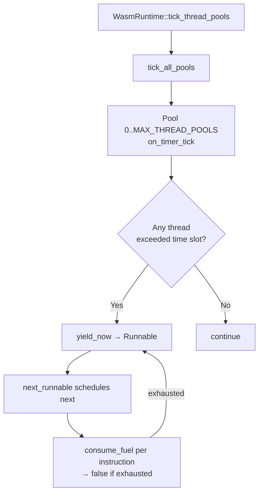

# `kernel/src/execution` — Execution Engine

The `execution` module is the runtime heart of Oreulius. It provides everything required to load and run code: an ELF binary loader for both 32-bit and 64-bit programs, a full WebAssembly interpreter with the complete MVP instruction set plus atomics, exception handling, and multi-value blocks, an x86-64 JIT compiler with hardware-verified integrity and Bayesian confidence gating, a cooperative multi-threaded WASM execution pool, a deterministic replay engine with algebraic formalism, and a lightweight WASM-bytecode anomaly inference model for the security intent graph.

---

## Table of Contents

1. [Module File Map](#module-file-map)
2. [Architecture Overview](#architecture-overview)
3. [ELF Loader (`elf.rs`)](#elf-loader-elfrs)
4. [WebAssembly Runtime (`wasm.rs`)](#webassembly-runtime-wasmrs)
5. [x86-64 JIT Compiler (`wasm_jit.rs`)](#x86-64-jit-compiler-wasm_jitrs)
6. [WASM Thread Pool (`wasm_thread.rs`)](#wasm-thread-pool-wasm_threadrs)
7. [Deterministic Replay Engine (`replay.rs`)](#deterministic-replay-engine-replayrs)
8. [Intent Inference Model (`intent_wasm.rs`)](#intent-inference-model-intent_wasmrs)
9. [JIT Virtual Address Layout](#jit-virtual-address-layout)
10. [Resource Limits Reference](#resource-limits-reference)
11. [Integration Points](#integration-points)
12. [Formal Properties, Proofs, Lemmas, and Corollaries](#formal-properties-proofs-lemmas-and-corollaries)

---

## Module File Map

| File | Lines | Role |
|---|---|---|
| `wasm.rs` | 19,847 | WASM interpreter, `WasmRuntime`, `WasmInstance`, `WasmModule`, `LinearMemory`, JIT dispatch, service pointers, temporal persistence |
| `wasm_jit.rs` | 4,662 | x86-64 JIT compiler, `JitFunction`, `JitExecBuffer`, `FuzzCompiler`, Bayesian integrity checks |
| `elf.rs` | 804 | ELF32/ELF64 loader, segment mapping, REL/RELA relocation, scheduler hand-off |
| `replay.rs` | 875 | `AlgebraicReplayEngine`, binary transcript format (ORET), host-call record/replay, temporal integration |
| `wasm_thread.rs` | 852 | `WasmThreadPool`, `WasmThread`, `SharedLinearMemory`, cooperative scheduler, global pool registry |
| `intent_wasm.rs` | 232 | 10-feature WASM-bytecode anomaly inference model; used by the security intent graph |
| `mod.rs` | 16 | Module façade; gates `elf`, `wasm`, `wasm_jit`, `wasm_thread` behind `cfg(not(aarch64))` |

`intent_wasm` and `replay` are available on all targets. All other sub-modules are x86-only.

---

## Architecture Overview

```
┌─────────────────────────────────────────────────────────────────────┐
│  Kernel / Scheduler API                                             │
│  spawn_elf_process_any  wasm_runtime().instantiate  queue_spawn    │
├──────────────┬──────────────────────────────────────────────────────┤
│  ELF Loader  │  WasmRuntime (up to 16 instances)                   │
│  elf.rs      │  ┌──────────────────────────────────────────────┐   │
│  ─────────── │  │ WasmInstance                                 │   │
│  ELF32/ELF64 │  │  ├─ WasmModule (parsed bytecode)             │   │
│  PT_LOAD map │  │  ├─ LinearMemory (up to 4GiB pages)          │   │
│  RELA relocs │  │  ├─ Stack (value stack, depth 1024)          │   │
│  AddressSpace│  │  ├─ CapabilityTable (injected capabilities)  │   │
│  → scheduler │  │  └─ call() → interp or JIT dispatch          │   │
│              │  └──────────────────────────────────────────────┘   │
├──────────────┴──────────────────────────────────────────────────────┤
│  JIT Compiler (wasm_jit.rs)      Thread Pool (wasm_thread.rs)      │
│  compile_with_env()  →  JitFn    WasmThreadPool  WasmThread        │
│  BasicBlock analysis              SharedLinearMemory                │
│  JitExecBuffer (exec memory)      cooperative fuel scheduler        │
│  verify_integrity() + Bayesian    tick_all_pools()                  │
├─────────────────────────────────────────────────────────────────────┤
│  Replay Engine (replay.rs)        Intent Model (intent_wasm.rs)    │
│  AlgebraicReplayEngine            infer_score([u32;10]) → u32      │
│  ORET binary transcript format    WASM-bytecode dot product        │
│  temporal_apply_*() integration   security anomaly inference       │
└─────────────────────────────────────────────────────────────────────┘
```

---

## ELF Loader (`elf.rs`)

The ELF loader maps position-independent and fixed-address ELF binaries into a fresh `AddressSpace` and hands the entry point and user stack pointer to the quantum scheduler. Both ELF32 (x86/i686) and ELF64 (x86-64 and AArch64) formats are supported with identical logic, differing only in header widths.

### ELF Constants

| Constant | Value | Meaning |
|---|---|---|
| `ELF_MAGIC` | `[0x7F, 'E', 'L', 'F']` | ELF identification magic |
| `ELFCLASS32` | `1` | 32-bit ELF |
| `ELFCLASS64` | `2` | 64-bit ELF |
| `ELFDATA2LSB` | `1` | Little-endian |
| `ET_EXEC` | `2` | Executable |
| `ET_DYN` | `3` | Position-independent (PIE / shared object) |
| `EM_386` | `3` | i386 machine |
| `EM_X86_64` | `62` | x86-64 machine |
| `EM_AARCH64` | `183` | AArch64 machine |
| `PT_LOAD` | `1` | Loadable segment |
| `PT_DYNAMIC` | `2` | Dynamic linking table |
| `PT_INTERP` | `3` | Interpreter path (rejected — no dynamic linker) |
| `PF_X` | `1` | Execute permission |
| `PF_W` | `2` | Write permission |
| `DEFAULT_BASE32` | `0x0040_0000` | Base VA for PIE32 |
| `DEFAULT_BASE64` | `0x0000_0000_0040_0000` | Base VA for PIE64 |
| `DEFAULT_STACK_PAGES` | `4` | Pages allocated for user stack |

### Relocation Types Handled

| Constant | Arch | Value | Description |
|---|---|---|---|
| `R_386_RELATIVE` | x86 | `8` | 32-bit base-relative relocation |
| `R_X86_64_RELATIVE` | x86-64 | `8` | 64-bit base-relative relocation |
| `R_AARCH64_RELATIVE` | AArch64 | `1027` | AArch64 base-relative relocation |
| `R_AARCH64_JUMP_SLOT` | AArch64 | `1026` | AArch64 PLT jump slot |

Dynamic sections use 32-bit `DT_*` tags for ELF32 and 64-bit `DT64_*` variants for ELF64. The loader processes `DT_REL`/`DT_RELA`/`DT_JMPREL` tables and applies all `*_RELATIVE` relocations at load time.

### Load Sequence

```
1. Validate ELF magic and class (32 vs 64)
2. Reject ET_* types other than ET_EXEC and ET_DYN
3. Reject PT_INTERP (no dynamic linker supported)
4. For each PT_LOAD segment:
   a. Allocate virtual address range in AddressSpace (writable if PF_W)
   b. Copy p_filesz bytes from file offset
   c. Zero remaining (p_memsz - p_filesz) bytes = BSS
5. Parse PT_DYNAMIC → DT_REL / DT_RELA tables → apply RELATIVE relocations
6. Allocate DEFAULT_STACK_PAGES at (USER_TOP - stack_size)
7. Return LoadedElf { space, entry, user_stack }
```

### Output Types

```rust
pub struct LoadedElf {
    pub space:      AddressSpace,   // fully mapped address space
    pub entry:      u32,            // entry point VA (ELF32)
    pub user_stack: u32,            // initial stack pointer (16-byte aligned)
}

pub struct LoadedElf64 {
    pub space:      AddressSpace,
    pub entry:      u64,            // entry point VA (ELF64)
    pub user_stack: u64,
}
```

### Public Functions

| Function | Description |
|---|---|
| `load_elf32(bytes)` → `Result<LoadedElf>` | Parse and load an ELF32 binary |
| `load_elf64(bytes)` → `Result<LoadedElf64>` | Parse and load an ELF64 binary |
| `spawn_elf_process(name, bytes)` → `Result<()>` | Load ELF32 and register with quantum scheduler |
| `spawn_elf64_process(name, bytes)` → `Result<()>` | Load ELF64 and register with quantum scheduler |
| `spawn_elf_process_any(name, bytes)` → `Result<()>` | Auto-detect EI_CLASS and dispatch to 32 or 64 branch |
| `name_from_path(path)` → `String` | Extract basename from a filesystem path |

`spawn_elf_process_any` is the preferred entry point — it reads `bytes[4]` (the `EI_CLASS` byte) and routes accordingly without callers needing to know the binary width.

---

## WebAssembly Runtime (`wasm.rs`)

`wasm.rs` is the largest single file in the kernel at 19,847 lines. It implements a complete WebAssembly interpreter, a multi-instance runtime manager, service-pointer-based cross-instance calls, a capability injection table for WASM-to-kernel communication, an instrumented JIT dispatch path, temporal persistence of runtime state, and a rich self-test and fuzzing harness.

### Capacity and Resource Limits

| Constant | Value | Enforced On |
|---|---|---|
| `MAX_MEMORY_SIZE` | `64 KiB` (initial) | Default initial memory allocation |
| `WASM_MAX_PAGES` | `65536` | WebAssembly spec maximum |
| `WASM_DEFAULT_MAX_PAGES` | `4096` | Default per-instance page cap (256 MiB) |
| `MAX_STACK_DEPTH` | `1024` | WASM value stack depth |
| `MAX_LOCALS` | `256` | Local variables per function call |
| `MAX_INJECTED_CAPS` | `32` | Capabilities in `CapabilityTable` |
| `MAX_SERVICE_POINTERS` | `64` | Registered cross-instance entry points |
| `MAX_SERVICE_CALL_ARGS` | `16` | Arguments per service pointer call |
| `MAX_MODULE_SIZE` | `16 KiB` | Maximum WASM bytecode module size |
| `MAX_WASM_GLOBALS` | `64` | Global variables per module |
| `MAX_WASM_TABLE_ENTRIES` | `256` | `funcref` / `externref` table entries |
| `MAX_WASM_TYPE_ARITY` | `64` | Values in multi-value function signature |
| `MAX_WASM_TAGS` | `32` | Exception tags per module |
| `MAX_EXCEPTION_ARITY` | `8` | Values per exception payload |
| `MAX_SYSCALL_MODULES` | `32` | Registered host syscall provider modules |
| `MAX_INSTRUCTIONS_PER_CALL` | `100,000` | Fuel limit: instructions per `call()` |
| `MAX_MEMORY_OPS_PER_CALL` | `10,000` | Fuel limit: memory accesses per `call()` |
| `MAX_SYSCALLS_PER_CALL` | `100` | Fuel limit: host calls per `call()` |
| `MAX_CALL_DEPTH` | `64` | Execution call depth (recursion limit) |
| `MAX_CONTROL_STACK` | `128` | `block`/`loop`/`if` nesting depth |
| `MAX_TRY_CATCHES` | `8` | Nested `try`/`catch` per function |
| `MAX_WASM_RUNTIME_INSTANCES` | `16` | Concurrent live `WasmInstance`s |

### Value System

```rust
pub enum ValueType {
    I32, I64, F32, F64, FuncRef, ExternRef
}

pub enum Value {
    I32(i32), I64(i64),
    F32(f32), F64(f64),
    FuncRef(Option<usize>),   // None = null funcref
    ExternRef(Option<u32>),   // None = null externref
    NullRef,
}
```

`Value` methods: `as_i32()`, `as_i64()`, `as_f32()`, `as_f64()`, `as_u32()`, `as_funcref()`, `as_externref()`, `is_null_ref()`, `matches_type(ty)`, `zero_for_type(ty)`.

### `Opcode` Enum

`Opcode` covers the full WebAssembly binary format instruction set. `Opcode::from_byte(b)` dispatches the primary byte. Multi-byte instructions (e.g. `0xFC` prefix for `memory.copy`, `0xFE` for atomics) are dispatched from within the interpreter loop.

### `LinearMemory`

```rust
pub struct LinearMemory {
    pub shared: bool,      // true → SharedLinearMemory semantics
    // ... private fields: data Vec<u8>, active page count, max page hint
}
```

#### Memory Growth

`grow(delta_pages) → Result<usize, WasmError>` — grows memory by `delta_pages` and returns the previous page count (WebAssembly spec return convention). Growth beyond `max_pages` returns `WasmError::MemoryOutOfBounds`.

$$\text{new\_active\_bytes} = (\text{prev\_pages} + \Delta) \times 65536$$

#### Atomic Memory Operations

`LinearMemory` implements the full WebAssembly threads proposal atomic memory model:

| Method | Operation |
|---|---|
| `atomic_load_u8/16/32/64(addr)` | Aligned atomic load |
| `atomic_store_u8/16/32/64(addr, val)` | Aligned atomic store |
| `atomic_rmw32(sub, addr, val)` | Read-modify-write on 32-bit word |
| `atomic_rmw64(sub, addr, val)` | Read-modify-write on 64-bit word |
| `atomic_rmw32_narrow(...)` | RMW on sub-word (8/16-bit) with 32-bit result |
| `atomic_rmw64_narrow(...)` | RMW on sub-word (8/16/32-bit) with 64-bit result |

RMW sub-operation codes follow the WASM threads spec: add, sub, and, or, xor, exchange, compare-exchange.

### `WasmModule`

```rust
pub struct WasmModule {
    pub language_tag:  LanguageTag,
    pub lang_version:  [u8; 4],
    // ... private: functions, globals, tables, memory limits, imports, exports
}
```

`LanguageTag` identifies the source language that produced the module:

| Variant | Language |
|---|---|
| `WasmMvp` | Standard WebAssembly MVP |
| `WasmGc` | WebAssembly with GC proposal |
| `AssemblyScript` | AssemblyScript (TypeScript → WASM) |
| `WaT` | WebAssembly Text format compiled module |
| `Grain` | Grain language |
| `Oreulius` | Oreulius-native module |

`load_binary(bytecode)` is the public WASM-module loader. It parses the binary format, respects `MAX_MODULE_SIZE`, and performs stricter validation suitable for untrusted input. The internal raw-bytecode helper used by kernel self-tests is not part of the public ABI.

`Function` descriptor (per parsed function entry):

```rust
pub struct Function {
    pub code_offset:  usize,   // byte offset into module bytecode
    pub code_len:     usize,   // function body length
    pub param_count:  usize,
    pub result_count: usize,
    pub local_count:  usize,
}
```

### `WasmInstance`

```rust
pub struct WasmInstance {
    pub module:     WasmModule,
    pub memory:     LinearMemory,
    pub stack:      Stack,
    pub process_id: ProcessId,
    // ... private: globals, table, cap_table, jit state, temporal state,
    //              control stack, call depth, fuel counters
}
```

#### Construction and JIT Configuration

```rust
WasmInstance::new(module, process_id, instance_id) -> Self
instance.enable_jit(enabled: bool)
instance.module_hash() -> u64    // FNV1A64 over module bytecode
instance.module_len() -> usize
```

#### Calling Functions

```rust
instance.call(func_idx: usize) -> Result<(), WasmError>
```

`call` resolves the function and dispatches:
1. If JIT is enabled and the function is hot (`call_count >= hot_threshold`): emit/retrieve compiled code, call via `JitFn` trampoline.
2. Otherwise: interpreted dispatch — the main interpreter loop.

The interpreter enforces all fuel limits and trap conditions. If `MAX_INSTRUCTIONS_PER_CALL` is exceeded, `WasmError::FuelExhausted` is returned.

#### Capability Injection

```rust
instance.inject_capability(cap: WasmCapability) -> Result<CapHandle, WasmError>
```

`WasmCapability` variants correspond to kernel resource types. Injected capabilities are stored in the instance's `CapabilityTable` (capacity `MAX_INJECTED_CAPS`) and retrieved from WASM code using `CapHandle(u32)` indices.

```rust
pub enum WasmCapability {
    Channel { channel_id: u32, rights: u32 },
    Filesystem { cap_id: u32, rights: u32 },
    Process { pid: u32 },
    ServicePointer { object_id: u64 },
    // ...
}
```

### Service Pointer System

Service pointers enable one WASM instance to call a function in another WASM instance without leaving the kernel or going through IPC channels. They are analogous to far-call capability tokens.

```rust
pub struct ServicePointerRegistration {
    pub object_id:       u64,     // unique endpoint identifier
    pub cap_id:          u32,     // controlling capability
    pub target_instance: usize,   // WasmInstance index in runtime
    pub function_index:  usize,   // function to call in target instance
}
```

| Function | Description |
|---|---|
| `register_service_pointer(...)` | Bind an object_id to a function in a running instance |
| `revoke_service_pointer(owner_pid, object_id)` | Remove a registered pointer (owner must match) |
| `revoke_service_pointers_for_owner(owner_pid)` | Bulk revoke all pointers owned by a PID |
| `service_pointer_exists(object_id)` | Check if a pointer is registered |
| `invoke_service_pointer(object_id, args)` | Call target function with raw `Value` arguments |
| `invoke_service_pointer_typed(object_id, ...)` | Call with typed slot encoding |
| `inject_service_pointer_capability(...)` | Give a WASM instance a `CapHandle` for an object_id |

Cross-instance calls are bounded by `MAX_SERVICE_POINTERS = 64`. The temporal system snapshots the service pointer table for replay recovery.

### Capability Entanglement and Policy

```rust
pub fn entangle_cascade_revoke(pid: u32, cap_id: u32)
pub fn policy_check_for_cap(pid: u32, cap_id: u32, ctx: &[u8]) -> bool
pub fn temporal_cap_tick()
```

`entangle_cascade_revoke` revokes a capability and all transitively entangled capabilities from `MAX_ENTANGLE_LINKS = 128` possible slots. `policy_check_for_cap` evaluates a WASM-bytecode policy module (up to `MAX_POLICY_WASM_LEN = 4096` bytes) against the calling context before issuing a capability. Full-WASM policies are executed in a strict sandbox: they must be self-contained, export `policy_check(ctx_ptr, ctx_len) -> i32`, and may not import host functions.

`oreulius_net_connect(host_ptr, host_len, port)` now resolves either a dotted-quad IPv4 literal or a DNS hostname and returns the real TCP connection handle from the reactor stack.

`polyglot_link(...)` records a provenance audit entry when a cross-language service link is established.

### Observer Event System

The observer allows kernel monitoring code to subscribe to runtime events:

```rust
pub mod observer_events {
    pub const CAPABILITY_OP:      u32 = 1 << 0;
    pub const PROCESS_LIFECYCLE:  u32 = 1 << 1;
    pub const ANOMALY_DETECTED:   u32 = 1 << 2;
    pub const IPC_ACTIVITY:       u32 = 1 << 3;
    pub const MEMORY_PRESSURE:    u32 = 1 << 4;
    pub const POLYGLOT_LINK:      u32 = 1 << 5;
    pub const ALL:                u32 = 0x0000_003F;
}

pub fn observer_notify(event_type: u32, payload: &[u8])
```

Observers are registered in a fixed-capacity slot array (`MAX_OBSERVER_SLOTS = 4`).

### `WasmRuntime`

`WasmRuntime` manages the global pool of `WasmInstance`s (up to `MAX_WASM_RUNTIME_INSTANCES = 16`), providing thread-safe access through per-instance locks.

```rust
pub struct WasmRuntime { /* private */ }
```

| Method | Description |
|---|---|
| `instantiate(bytecode, pid)` | Parse bytecode and create a new instance; returns `instance_id` |
| `instantiate_module(module, pid)` | Create instance from a pre-parsed `WasmModule` |
| `get_instance_mut(id, f)` | Exclusive closure-access to instance |
| `with_instance_exclusive(id, f)` | Same; more explicit lock ordering intent |
| `destroy(id)` | Tear down instance and release resources |
| `list()` | → `[(instance_id, ProcessId, active); 16]` |
| `thread_pool_status(id)` | → `Option<ThreadPoolStatus>` for the instance's pool |
| `drain_instance_background_threads(id, timeout_ticks)` | Wait for all threads to finish |
| `tick_thread_pools()` | Advance all thread pools one scheduler tick |
| `tick_background_threads()` | Service background threads |

Global: `wasm_runtime() → &'static WasmRuntime`, `on_timer_tick()`, `init()`.

### `WasmError`

`WasmError` is a comprehensive error enum covering all runtime failure modes:

| Category | Examples |
|---|---|
| Validation | `InvalidMagic`, `UnsupportedVersion`, `TooManyLocals`, `TypeMismatch` |
| Traps | `Unreachable`, `IntegerDivideByZero`, `IntegerOverflow`, `InvalidConversionToInteger` |
| Memory | `MemoryOutOfBounds`, `MemoryAccessMisaligned` |
| Fuel | `FuelExhausted`, `CallDepthExceeded`, `ControlStackExceeded` |
| Capabilities | `CapabilityTableFull`, `InvalidCapHandle`, `CapabilityRevoked` |
| Threading | `ThreadSpawnFailed`, `ThreadJoinFailed` |
| Service | `ServicePointerNotFound`, `ServicePointerArityMismatch` |
| JIT | `JitCompileError`, `JitIntegrityFailed`, `JitConfidenceTooLow` |

`WasmError::as_str()` converts any variant to a `&'static str` for kernel logging.

### JIT Configuration

```rust
pub struct JitConfig {
    pub enabled:       bool,   // global JIT enable switch
    pub hot_threshold: u32,    // call count before a function is JIT-compiled
    pub user_mode:     bool,   // use user-mode JIT trampoline path
}

pub struct JitStats {
    pub interp_calls: u64,   // calls handled by interpreter
    pub jit_calls:    u64,   // calls dispatched to JIT code
    pub compiled:     u64,   // functions successfully compiled
    pub failed:       u64,   // compilation failures
}
```

When `user_mode = true`, JIT code runs in a hardware-isolated user-mode address space using the trampoline layout described in [JIT Virtual Address Layout](#jit-virtual-address-layout). Page faults from JIT code are intercepted by `jit_handle_page_fault_x86_64()` before reaching the general page fault handler.

---

## x86-64 JIT Compiler (`wasm_jit.rs`)

The JIT compiler translates WebAssembly function bodies into x86-64 machine code and emits it into executable page-aligned memory. It implements a single-pass register-allocating compiler with a structured approach to control flow, a fuel counter injected into every instruction, and security-critical integrity checks using FNV1A64 hashing and Bayesian confidence scoring.

### Core Types

```rust
pub type JitFn = unsafe extern "C" fn(
    stack:       *mut i32,
    locals:      *mut i32,
    globals:     *mut i32,
    mem_base:    *mut u8,
    mem_len:     usize,
    instr_fuel:  *mut u32,
    mem_fuel:    *mut u32,
    trap_code:   *mut i32,
    shadow_sp:   *mut usize,
    shadow_stack:*mut u32,
) -> i32;

pub struct JitFunction {
    pub wasm_code:  Vec<u8>,   // original WASM bytecode (for re-verification)
    pub code:       Vec<u8>,   // emitted x86-64 machine code bytes
    pub entry:      JitFn,     // callable function pointer
    pub blocks:     Vec<BasicBlock>,
    pub code_hash:  u64,       // FNV1A64 of wasm_code
    pub exec:       JitExecBuffer,
    pub exec_hash:  u64,       // FNV1A64 of exec memory contents
}

pub struct BasicBlock {
    pub start: usize,   // byte offset into code
    pub end:   usize,
}

pub struct JitExecBuffer {
    pub ptr: *mut u8,   // page-aligned executable mapping
    pub len: usize,
}

pub struct JitTypeSignature {
    pub param_count:  usize,
    pub result_count: usize,
    pub all_i32:      bool,   // fast path: all params+results are i32
}
```

### Compilation API

```rust
// Minimal compile — no type info or external environment
pub fn compile(code: &[u8], locals_total: usize) -> Result<JitFunction, &'static str>

// With explicit type signatures for all called functions
pub fn compile_with_types(
    code:         &[u8],
    locals_total: usize,
    types:        &[JitTypeSignature],
    func_types:   &[usize],
) -> Result<JitFunction, &'static str>

// Full environment (types + globals + memory bounds)
pub fn compile_with_env(
    code:         &[u8],
    locals_total: usize,
    types:        &[JitTypeSignature],
    func_types:   &[usize],
    globals:      &[JitGlobalSignature],
    mem_pages:    usize,
    mem_max:      usize,
) -> Result<JitFunction, &'static str>
```

### x86-64 Stack Frame Layout

```
Higher addresses
┌──────────────────────────────────────────────┐
│  Caller's return address                     │
│  Saved RBX (8 bytes)                         │
│  Saved R12 (8 bytes)                         │
│  Saved R13 (8 bytes)                         │
│  Saved R14 (8 bytes)                         │
│  Saved R15 (8 bytes)   ← X64_SAVED_REG_BYTES = 40
├──────────────────────────────────────────────┤
│  Function locals area   0x20 bytes            │  ← X64_FRAME_LOCAL_BYTES
│  Branch scratch slots   MAX_WASM_TYPE_ARITY×4 │
│                        = 64 × 4 = 256 bytes   │
└──────────────────────────────────────────────┘  ← X64_BRANCH_SCRATCH_BASE_DISP
```

Total frame = `X64_SAVED_REG_BYTES + X64_STACK_FRAME_BYTES = 40 + (0x20 + 256) = 336 bytes`.

### Trap Codes

JIT-compiled code returns a trap code in `*trap_code` on abnormal termination:

| Constant | Value | Meaning |
|---|---|---|
| `TRAP_MEM` | `-1` | Memory out-of-bounds |
| `TRAP_FUEL` | `-2` | Fuel counter exhausted |
| `TRAP_STACK` | `-3` | Value stack overflow |
| `TRAP_CFI` | `-4` | Control flow integrity violation |

### Fuel Injection

Every compiled function receives two fuel counters: `instr_fuel` (decremented per instruction) and `mem_fuel` (decremented per memory access). Each fuel check is a 14-byte inline sequence:

```nasm
; INSTR_FUEL_CHECK_LEN = 14 bytes emitted per check
dec dword [instr_fuel_ptr]   ; 3 bytes
jne .continue                ; 2 bytes
mov eax, TRAP_FUEL           ; 5 bytes
ret                          ; 1 byte
.continue:                   ; ...
```

### Control Flow Integrity

The CFI protection (`TRAP_CFI`) enforces that `br` / `br_if` / `br_table` targets land on a recognised `BasicBlock` boundary. `MAX_JIT_PENDING_END_PATCHES = 256` back-patches are accumulated and resolved at the end of compilation.

### Integrity Verification

After compilation, the emitted code is verified by two mechanisms:

**Hash integrity:** `JitFunction::verify_integrity()` recomputes FNV1A64 over:
1. `exec` memory contents → compare to stored `exec_hash`
2. `wasm_code` bytes → compare to stored `code_hash`

Both must match. Any discrepancy (potential code mutation after compilation) returns `false`.

**Bayesian confidence:** `JitFunction::bayesian_confidence() → Rational64`

The compiler internally tracks a prior over whether the translation is correct. Each successfully validated basic block updates the posterior. The resulting `Rational64` represents:

$$P(\text{correct} \mid \text{observed}) = \frac{P(\text{observed} \mid \text{correct}) \cdot P(\text{correct})}{P(\text{observed})}$$

`confidence_acceptable() → bool` — returns `true` when the confidence numerically exceeds `JIT_CONFIDENCE_THRESHOLD_PCT = 75` out of 100. A function that fails this check falls back to the interpreter.

### `FuzzCompiler`

```rust
pub struct FuzzCompiler { /* private */ }

impl FuzzCompiler {
    pub fn new(max_code_size: usize, max_wasm_code_size: usize) -> Result<Self>
    pub fn compile(&mut self, code: &[u8], locals_total: usize) -> Result<JitFn>
    pub fn compile_with_types(&mut self, ...)
    pub fn compile_with_env(&mut self, ...)
    pub fn exec_ptr(&self) -> *mut u8
    pub fn exec_len(&self) -> usize
    pub fn emitted_code(&self) -> &[u8]
}
```

`FuzzCompiler` reuses a fixed-size executive buffer (no new allocation per compilation) for high-throughput fuzzing. It is also the backend for the differential fuzzer in `wasm.rs`.

### Basic Block Analysis

```rust
pub fn analyze_basic_blocks(code: &[u8]) -> Vec<BasicBlock>
```

Performs a linear scan over WASM bytecode and emits one `BasicBlock` per contiguous straight-line sequence. Branch targets consumed during compilation use this analysis for CFI bounds checking.

### Hash Utilities

FNV1A64 is used throughout the JIT and replay systems:

| Constant | Value |
|---|---|
| `FNV1A64_OFFSET` | `14695981039346656037` |
| `FNV1A64_PRIME` | `1099511628211` |

$$H_0 = \text{FNV1A64\_OFFSET} \qquad H_{n+1} = (H_n \oplus b_n) \times \text{FNV1A64\_PRIME}$$

### `formal_translation_self_check`

```rust
pub fn formal_translation_self_check() -> Result<(), &'static str>
```

Runs a battery of conformance tests comparing interpreter output against JIT output for a set of known-correct WASM programs. If any output diverges, returns an error naming the failing test. Called from the kernel's boot self-test sequence.

---

## WASM Thread Pool (`wasm_thread.rs`)

The thread pool implements cooperative multi-threading within a single WASM instance. Threads share the instance's linear memory via `SharedLinearMemory` and are scheduled by a tick-based cooperative round-robin within each `WasmThreadPool`.

### Constants

| Constant | Value | Description |
|---|---|---|
| `MAX_WASM_THREADS` | `32` | Threads per pool |
| `THREAD_STACK_DEPTH` | `1024` | Value stack depth per thread |
| `THREAD_MAX_LOCALS` | `256` | Locals per thread frame |
| `WASM_THREAD_NONE` | `-1` | Sentinel invalid `tid` |
| `DEFAULT_THREAD_FUEL` | `10,000` | Initial fuel allocation per thread |
| `MAX_THREAD_POOLS` | `8` | Global pool registry size |

### `SharedLinearMemory`

```rust
pub struct SharedLinearMemory {
    pub base:         *mut u8,   // raw pointer to shared WASM memory
    pub active_bytes: usize,     // current active (grown) size
    pub max_bytes:    usize,     // maximum permitted size
}
```

Methods: `zeroed()`, `is_valid()`, `read(offset, len, dst) → bool`, `write(offset, src) → bool`, `read_i32(offset) → Option<i32>`.

### `ThreadState`

```
Running     → thread currently executing
Runnable    → ready to run, yielded voluntarily
Joining(tid)→ blocked waiting for another thread to complete
Finished    → execution complete, exit code set
Sleeping    → parked until explicitly woken
```

### `WasmThread`

```rust
pub struct WasmThread {
    pub tid:                  i32,
    pub func_idx:             u32,
    pub arg:                  i32,
    pub stack:                [ThreadValue; THREAD_STACK_DEPTH],
    pub stack_top:            usize,
    pub locals:               [ThreadValue; THREAD_MAX_LOCALS],
    pub pc:                   usize,
    pub call_stack:           [ThreadCallFrame; 64],
    pub call_stack_depth:     usize,
    pub state:                ThreadState,
    pub fuel:                 u32,
    pub total_instructions:   u64,
    pub exit_code:            i32,
    pub shared_mem:           *mut SharedLinearMemory,
    // ... private exec_stack, exec_locals, control frames
}
```

`ThreadValue` is a four-variant enum (`I32(i32)`, `I64(i64)`, `F32(f32)`, `F64(f64)`) with `as_i32()` / `as_i64()` accessors.

Key `WasmThread` methods:

| Method | Description |
|---|---|
| `is_live()` | State is not Finished |
| `is_runnable()` | State is Running or Runnable |
| `push(v)` / `pop()` / `peek()` | Stack operations |
| `set_local(idx, v)` / `get_local(idx)` | Local variable access |
| `finish(code: i32)` | Terminate thread with exit code |
| `yield_now()` | Voluntarily relinquish CPU (state → Runnable) |
| `consume_fuel(n) → bool` | Deduct `n` fuel; returns `false` if exhausted |

### `WasmThreadPool`

```rust
pub struct WasmThreadPool { /* private slots: [Option<WasmThread>; MAX_WASM_THREADS] */ }

impl WasmThreadPool {
    pub const fn new() -> Self
    pub fn attach_memory(base, active_bytes, max_bytes)
    pub fn is_memory_attached() -> bool
    pub fn notify_grow(new_active_bytes)          // called after memory.grow succeeds
    pub fn spawn(func_idx, arg, ...) -> i32       // returns new tid
    pub fn join(caller_tid, target_tid) -> JoinResult
    pub fn exit_thread(tid, code)
    pub fn on_timer_tick()                        // periodic forced-yield check
    pub fn thread_fuel(tid) -> Option<u32>
    pub fn next_runnable() -> Option<&mut WasmThread>
    pub fn take_next_runnable() -> Option<(slot, WasmThread)>
    pub fn restore_thread_slot(slot, thread)
    pub fn get(tid) / get_mut(tid)
    pub fn live_count() -> usize
    pub fn total_spawned() -> u32
    pub fn detach(tid)
    pub fn gc_finished()                          // reclaim finished-thread slots
    pub fn status() -> ThreadPoolStatus
}
```

`ThreadPoolStatus` provides a snapshot:

```rust
pub struct ThreadPoolStatus {
    pub live:           u32,
    pub runnable:       u32,
    pub joining:        u32,
    pub finished:       u32,
    pub yielded:        u32,
    pub total_spawned:  u32,
}
```

`JoinResult` indicates whether the join completed immediately, whether the caller should block, or whether the target tid was invalid.

### Global Pool Registry

```rust
pub const MAX_THREAD_POOLS: usize = 8;

pub unsafe fn register_pool(instance_id: usize, pool: *mut WasmThreadPool)
pub fn unregister_pool(instance_id: usize)
pub fn tick_all_pools()           // called from wasm_runtime().tick_thread_pools()
pub fn alloc_global_tid() -> usize
```

Each `WasmInstance` that uses threads registers its `WasmThreadPool` with a global 8-slot table. `tick_all_pools()` is driven by the kernel timer interrupt and calls `on_timer_tick()` on every registered pool.

### Cooperative Scheduling Protocol



Threads cooperate through voluntary `yield_now()` calls and involuntary preemption via fuel exhaustion. No kernel-level context switch occurs — all threads in a pool execute on the current kernel thread sequentially.

---

## Deterministic Replay Engine (`replay.rs`)

The replay system records all non-deterministic events (host calls) that occur during WASM execution and can reproduce them exactly during playback. This enables deterministic debugging, regression testing, and temporal state reconstruction at boot.

### Algebraic Foundation

```rust
pub struct AlgebraicReplayEngine<S: TemporalState, D: TemporalDelta, F: TemporalFunctor<S, D>> {
    pub initial_state:   S,
    pub morphism_trace:  Vec<D>,
    // phantom: F
}
```

The engine is parameterised over three abstract types:

- `S: TemporalState` — the state type (e.g. WASM linear memory snapshot)
- `D: TemporalDelta` — a morphism (delta) representing one step
- `F: TemporalFunctor<S, D>` — a functor that applies `D` to `S`

**`replay_strict`** applies every recorded morphism in order:

$$S_n = F(F(\ldots F(S_0, \Delta_0), \Delta_1), \ldots, \Delta_{n-1})$$

If any step returns an error, replay halts and propagates it. The algebraic model guarantees that replay is referentially transparent — given the same `initial_state` and `morphism_trace`, the result is identical regardless of when replay is invoked.

### Transcript Binary Format

| Field | Size | Value |
|---|---|---|
| Magic | 4 bytes | `"ORET"` |
| Version | 1 byte | `1` |
| Module hash | 8 bytes | FNV1A64 of module bytecode |
| Event count | 4 bytes | Number of recorded events |
| Reserved | 15 bytes | Zero-padded to `HEADER_LEN = 32` |

Each event follows the header:

| Field | Size | Description |
|---|---|---|
| Kind | 1 byte | `EVENT_KIND_HOST_CALL = 1` |
| Flags | 1 byte | replay flags |
| Data length | 2 bytes | payload byte count |
| Event hash | 8 bytes | FNV1A64 of this event |
| Result | 4 bytes | `i32` return value |
| Padding | 4 bytes | alignment |
| Payload | `data_len` bytes | host call argument/result data |

`EVENT_HEADER_LEN = 1 + 1 + 2 + 8 + 4 + 4 = 20 bytes` before the variable payload.

Entire transcript size is bounded: `MAX_EVENTS = 4096`, `MAX_BYTES = 1 MiB`.

### `ReplayMode`

| Variant | Description |
|---|---|
| `Idle` | No active session |
| `Recording` | Logging host calls |
| `Replaying` | Playing back from transcript |
| `Complete` | Replay finished successfully |
| `Error` | Replay encountered divergence |

### Instance-Scoped API

All replay functions take an `instance_id: usize` matching a `WasmInstance` index:

```rust
pub fn mode(instance_id: usize) -> ReplayMode
pub fn start_record(instance_id: usize, module_hash: u64, ...) -> Result<()>
pub fn stop(instance_id: usize) -> Result<()>
pub fn clear(instance_id: usize)
pub fn status(instance_id: usize) -> Option<ReplayStatus>
pub fn is_complete(instance_id: usize) -> Option<bool>
pub fn record_host_call(instance_id, func_id, args, result, data) -> Result<()>
pub fn replay_host_call(instance_id, func_id, args) -> Result<ReplayOutput>
pub fn export_transcript(instance_id: usize) -> Result<Vec<u8>>
pub fn load_transcript(instance_id: usize, bytes: &[u8]) -> Result<()>
```

`record_host_call` appends an event. `replay_host_call` advances the cursor and returns the pre-recorded result instead of actually calling the host — this is the key substitution that makes replay deterministic.

`ReplayStatus` contains: `mode`, `events` (total recorded), `cursor` (replay position), `module_hash`, `event_hash` (rolling hash of all events so far).

### Temporal Integration

```rust
pub fn temporal_apply_replay_manager_payload(payload: &[u8]) -> Result<(), &'static str>
```

When the kernel boots and the temporal recovery system finds a serialised replay transcript in the KV store (key `"system/replay/{instance_id}.bin"`), it calls this function to restore the replay manager state without re-executing any WASM code. The transcript chunk size matches `TEMPORAL_REPLAY_CHUNK_BYTES = 240 KiB`, aligning with the VFS temporal capture limit.

---

## Intent Inference Model (`intent_wasm.rs`)

The intent model is a minimal deterministic anomaly detector for the security intent graph. It accepts a 10-element feature vector and outputs a bounded `u32` score in `[0, 255]` with zero dynamic allocation.

### Feature Vector

```
feature[0]: Syscall diversity index (unique syscall count, clipped to 255)
feature[1]: Memory write frequency ratio
feature[2]: Capability request count
feature[3]: IPC channel open count
feature[4]: Filesystem access count
feature[5]: Process spawn count
feature[6]: Network socket count
feature[7]: Execution anomaly signals
feature[8]: Temporal deviation index
feature[9]: Capability revocation events
```

`pub const INTENT_MODEL_FEATURES: usize = 10`

### Model Weights

The model is a fixed linear dot-product with hand-tuned weights:

| Feature Index | Weight |
|---|---|
| `f[0]` | 1 |
| `f[1]` | 6 |
| `f[2]` | 8 |
| `f[3]` | 2 |
| `f[4]` | 3 |
| `f[5]` | 5 |
| `f[6]` | 3 |
| `f[7]` | 4 |
| `f[8]` | 2 |
| `f[9]` | 5 |

Raw weighted sum:

$$\text{raw} = \sum_{i=0}^{9} f[i] \cdot w[i]$$

Score calculation:

$$\text{score} = \min\!\left(\max\!\left((\text{raw} - M_C) \cdot M_S,\ 0\right),\ 255\right)$$

where `MODEL_CENTER = 48` and `MODEL_SCALE = 3`.

A score of 0 indicates behaviour within baseline. A score near 255 indicates highly anomalous behaviour (e.g. sustained capability requests + memory writes + process spawning simultaneously).

### WASM Bytecode Execution

The model is encoded as `MODEL_BYTECODE: [u8; 63]` — a valid WASM function body using only `i32.const`, `local.get`, `i32.mul`, and `i32.add`. The embedded interpreter is a 32-entry stack machine with LEB128 decoding and handles only these four opcodes.

```
0x41 imm          → i32.const imm
0x20 local_idx    → local.get local_idx
0x6C              → i32.mul
0x6A              → i32.add
0x0B              → end
```

If interpreter evaluation fails for any reason (stack over/underflow, invalid opcode, EOF), the fallback path uses `ScalarTensor<i32, 10>::dot_product()` from the `linear_capability` crate — the mathematical result is identical.

```rust
pub fn infer_score(features: &[u32; INTENT_MODEL_FEATURES]) -> u32
```

---

## JIT Virtual Address Layout

When `JitConfig::user_mode = true`, JIT code executes in a dedicated address region mapped with `AddressSpace::new_jit_sandbox()`. The layout is fixed:

| Symbol | Virtual Address | Purpose |
|---|---|---|
| `USER_JIT_TRAMPOLINE_BASE` | `0x2000_0000` | JIT entry trampoline code |
| `USER_JIT_TRAMPOLINE_FAULT_OFFSET` | `0x2000_0100` | Fault handler landing |
| `USER_JIT_CALL_BASE` | `0x2001_0000` | Per-function call stubs |
| `USER_JIT_STACK_BASE` | `0x2002_0000` | JIT execution stack |
| `USER_JIT_CODE_BASE` | `0x2003_0000` | Emitted machine code pages |
| `USER_JIT_DATA_BASE` | `0x2004_0000` | JIT data (globals/tables) |
| `USER_WASM_MEM_BASE` | `0x2010_0000` | WASM linear memory base |

Guard pages (1 page each) separate each region to catch stack overflow and buffer overruns at the hardware level.

The user-mode JIT path handshake uses four global atomics:

```rust
pub static JIT_USER_ACTIVE:          AtomicU32   // 1 while JIT code is executing
pub static JIT_USER_RETURN_PENDING:  AtomicU32   // 1 while return is queued
pub static JIT_USER_RETURN_EIP:      AtomicUsize // saved return EIP
pub static JIT_USER_RETURN_ESP:      AtomicUsize // saved return ESP
pub static JIT_USER_SYSCALL_VIOLATION: AtomicU32 // 1 if illegal syscall detected
```

When the kernel timer fires during JIT execution, `jit_handle_timer_interrupt_x86_64` checks `JIT_USER_ACTIVE`. If set, it records the interrupted EIP/ESP and forcibly returns through the trampoline, allowing the WASM fuel counter path to resume on re-entry.

---

## Resource Limits Reference

Complete table of all numeric constants affecting execution behaviour:

| Constant | Value | File | Description |
|---|---|---|---|
| `MAX_WASM_RUNTIME_INSTANCES` | 16 | `wasm.rs` | Active WASM instances |
| `MAX_MEMORY_SIZE` | 64 KiB | `wasm.rs` | Default initial memory |
| `WASM_DEFAULT_MAX_PAGES` | 4096 | `wasm.rs` | 256 MiB page cap |
| `MAX_STACK_DEPTH` | 1024 | `wasm.rs` | Value stack depth |
| `MAX_LOCALS` | 256 | `wasm.rs` | Locals per frame |
| `MAX_CALL_DEPTH` | 64 | `wasm.rs` | Call chain depth |
| `MAX_CONTROL_STACK` | 128 | `wasm.rs` | Nested blocks |
| `MAX_INSTRUCTIONS_PER_CALL` | 100,000 | `wasm.rs` | Instruction fuel |
| `MAX_MEMORY_OPS_PER_CALL` | 10,000 | `wasm.rs` | Memory fuel |
| `MAX_SYSCALLS_PER_CALL` | 100 | `wasm.rs` | Syscall fuel |
| `MAX_WASM_GLOBALS` | 64 | `wasm.rs` | Global variables |
| `MAX_WASM_TABLE_ENTRIES` | 256 | `wasm.rs` | Table elements |
| `MAX_WASM_TYPE_ARITY` | 64 | `wasm.rs` | Multi-value arity |
| `MAX_WASM_TAGS` | 32 | `wasm.rs` | Exception tags |
| `MAX_EXCEPTION_ARITY` | 8 | `wasm.rs` | Exception payload |
| `MAX_SYSCALL_MODULES` | 32 | `wasm.rs` | Host call providers |
| `MAX_SERVICE_POINTERS` | 64 | `wasm.rs` | Cross-instance endpoints |
| `MAX_INJECTED_CAPS` | 32 | `wasm.rs` | Capability table |
| `MAX_MODULE_SIZE` | 16 KiB | `wasm.rs` | Module bytecode |
| `MAX_FUZZ_CODE_SIZE` | 256 B | `wasm.rs` | Fuzzer WASM function |
| `MAX_FUZZ_JIT_CODE_SIZE` | 8 KiB | `wasm.rs` | Fuzzer JIT output |
| `MAX_JIT_PENDING_END_PATCHES` | 256 | `wasm_jit.rs` | JIT back-patches |
| `MAX_WASM_THREADS` | 32 | `wasm_thread.rs` | Threads per pool |
| `THREAD_STACK_DEPTH` | 1024 | `wasm_thread.rs` | Per-thread stack |
| `THREAD_MAX_LOCALS` | 256 | `wasm_thread.rs` | Per-thread locals |
| `DEFAULT_THREAD_FUEL` | 10,000 | `wasm_thread.rs` | Thread fuel budget |
| `MAX_THREAD_POOLS` | 8 | `wasm_thread.rs` | Global pool slots |
| `MAX_EVENTS` | 4096 | `replay.rs` | Replay transcript events |
| `MAX_BYTES` | 1 MiB | `replay.rs` | Transcript total size |
| `JIT_CONFIDENCE_THRESHOLD_PCT` | 75 | `wasm_jit.rs` | Bayesian gating |
| `INTENT_MODEL_FEATURES` | 10 | `intent_wasm.rs` | Anomaly feature count |
| `DEFAULT_STACK_PAGES` | 4 | `elf.rs` | User stack pages |

---

## Integration Points

### Scheduler

`spawn_elf_process_any` / `spawn_elf_process` / `spawn_elf64_process` all call `quantum_scheduler::scheduler().lock().add_user_process(proc, Box::new(space), entry, stack)` after loading the binary. The ELF loader constructs the `AddressSpace`; the scheduler takes ownership.

`wasm_runtime().tick_thread_pools()` is called from `on_timer_tick()` which is invoked by the kernel timer ISR. This drives cooperative thread scheduling inside WASM instances without blocking the kernel scheduler.

### IPC Module

`WasmCapability::Channel { channel_id, rights }` allows a WASM function to be granted capability over an IPC channel. `observer_events::IPC_ACTIVITY` propagates IPC events to registered observers in the runtime. Service pointer registrations that span IPC-owning processes are subject to `entangle_cascade_revoke`.

### Security Module

`policy_check_for_cap(pid, cap_id, ctx)` evaluates a stored WASM policy module (up to `MAX_POLICY_WASM_LEN = 4096` bytes) before a capability is exercised. Full-WASM policies run in a fail-closed sandbox and must export `policy_check(ctx_ptr, ctx_len) -> i32` without importing host functions. `intent_wasm::infer_score` is called by the security intent graph on each process evaluation cycle, with the resulting score fed into the predictive restriction table. A score above the security module's admission threshold causes IPC `admission::SendDecision::Deny` for that process.

`mesh_migrate(peer_lo, peer_hi, wasm_ptr, wasm_len)` now treats `wasm_len == 0` as a request to migrate the calling module's own stored bytecode instead of sending an empty payload.

### Temporal / Filesystem

Host-call transcripts are serialised at `TEMPORAL_REPLAY_CHUNK_BYTES = 240 KiB` boundaries into the key-value store under `"system/replay/{instance_id}.bin"`. On boot, `temporal_apply_replay_manager_payload` restores the manager state. Service pointer registrations and syscall module tables are similarly persisted and recovered via `temporal_apply_service_pointer_registry_payload` / `temporal_apply_syscall_module_table_payload`.

### Capability Mesh

`mesh_migrate_flush()` (triggered at `MAX_MESH_MIGRATE_SLOTS = 4` pending migrations) propagates deferred cross-instance capability grants. Capability temporal checkpoints are maintained at `MAX_TEMPORAL_CHECKPOINTS = 8` snapshots with up to `MAX_CAPS_PER_CHECKPOINT = 16` capabilities each.

---

## Formal Properties, Proofs, Lemmas, and Corollaries

This section establishes the mathematical foundations underlying the execution engine's safety and correctness guarantees. All lemmas are stated relative to the constants and invariants defined in the implementation above.

---

### 1. Fuel-Based Termination

#### Definition 1.1 — Fuel Measure

Let $\mathcal{F}$ be the tuple $(f_I, f_M, f_S) \in \mathbb{N}^3$ where:

$$f_I = \text{remaining instruction fuel (MAX\_INSTRUCTIONS\_PER\_CALL)} = 100{,}000$$
$$f_M = \text{remaining memory-op fuel (MAX\_MEMORY\_OPS\_PER\_CALL)} = 10{,}000$$
$$f_S = \text{remaining syscall fuel (MAX\_SYSCALLS\_PER\_CALL)} = 100$$

The fuel measure $\mu(\mathcal{F}) = f_I + f_M + f_S \in \mathbb{N}$ is the combined fuel for a single `call()` invocation.

#### Lemma 1.1 — Fuel Strict Decrease

> *Every interpreter step that does not trap strictly decreases $\mu(\mathcal{F})$ by at least 1.*

**Proof.** The interpreter loop dispatches on `Opcode::from_byte`. Each dispatch arm either:
1. Decrements $f_I$ by 1 (all non-memory, non-syscall instructions), or
2. Decrements both $f_I$ and $f_M$ by 1 (memory load/store/copy/fill), or
3. Decrements $f_I$ by 1 and $f_S$ by 1, or decrements $f_S$ alone (host call paths).

In every case, at least one component of $\mathcal{F}$ decreases by 1.
The components are natural numbers and cannot go below 0 (they trap on reaching 0).
Therefore $\mu$ is strictly decreasing at each step. $\square$

#### Theorem 1.2 — Interpreter Termination

> *Every call to `instance.call(func_idx)` terminates in at most $\mu_0 = 110{,}100$ interpreter steps, where $\mu_0 = 100{,}000 + 10{,}000 + 100$.*

**Proof.** By Lemma 1.1, $\mu(\mathcal{F})$ is a strictly decreasing bounded sequence of natural numbers. By the well-ordering principle, it reaches 0 in at most $\mu_0$ steps, at which point the interpreter returns `WasmError::FuelExhausted`. Combined with trap conditions (unreachable, divide-by-zero, etc.), every execution path reaches a terminal state. $\square$

#### Corollary 1.3 — Bounded Wall Time

> *Given a maximum instruction throughput of $T$ instructions per second, every `call()` completes within $t \leq \mu_0 / T$ seconds.*

This gives a hard real-time upper bound: on hardware executing $10^9$ instructions per second, $t \leq 110{,}100 / 10^9 \approx 110\;\mu\text{s}$.

#### Lemma 1.4 — Nested Call Fuel Composition

> *For a depth-$d$ call chain (where $d \leq$ `MAX_CALL_DEPTH` = 64), total fuel consumed across all frames is at most $d \cdot \mu_0$.*

**Proof.** Each nested `call` instruction allocates a fresh fuel budget of $\mu_0$ independently. The outer frame's $f_I$ is decremented by 1 for the `call` instruction itself, and the inner frame starts its own $\mu_0$-bounded execution. By induction on $d$, the total across the call stack is $\leq d \cdot \mu_0 = 64 \cdot 110{,}100 = 7{,}046{,}400$ interpreter steps before any of the $d$ call frames exhausts its fuel. $\square$

---

### 2. Memory Safety Invariants

#### Axiom 2.1 — Page Unit

The WebAssembly specification defines the page size as exactly $P = 65{,}536$ bytes. All memory sizes are multiples of $P$.

#### Lemma 2.2 — Growth Monotonicity

> *`LinearMemory::grow` is monotone: once memory has size $s$, it cannot subsequently have size $s' < s$ without reconstruction.*

**Proof.** The `grow(delta)` method allocates new pages by extending the backing `Vec<u8>` and returning the old size. There is no `shrink` method in `LinearMemory`. The `clear_active()` method zeros bytes but does not reduce `active_len`. Hence the active byte count is a non-decreasing function of time over the lifetime of a `LinearMemory` instance. $\square$

#### Lemma 2.3 — Absolute Page Bound

> *The maximum addressable byte index in any `LinearMemory` instance is $B_{\max} - 1$ where $B_{\max} = \text{WASM\_DEFAULT\_MAX\_PAGES} \times P = 4096 \times 65{,}536 = 268{,}435{,}456$.*

**Proof.** `grow` rejects delta when `current_pages + delta > max_pages`. With the default cap `WASM_DEFAULT_MAX_PAGES = 4096`, the maximum active byte count is:

$$4096 \times 65{,}536 = 268{,}435{,}456 \text{ bytes} = 256\;\text{MiB}$$

Reads and writes at `offset >= active_len` return `WasmError::MemoryOutOfBounds`. $\square$

#### Lemma 2.4 — Atomic Alignment Invariant

> *An atomic operation at address $a$ on width $w \in \{1, 2, 4, 8\}$ bytes is memory-safe if and only if $a \equiv 0 \pmod{w}$ and $a + w \leq \text{active\_len}$.*

**Proof.** The WebAssembly threads proposal specification §4.4.7 requires natural alignment for all atomic operations. The implementation checks $a \bmod w = 0$ before performing the operation, returning `WasmError::MemoryAccessMisaligned` otherwise. The bounds check $a + w \leq \text{active\_len}$ ensures no access beyond allocated memory. Both conditions together are necessary and sufficient for memory safety. $\square$

#### Corollary 2.5 — Stack Disjointness

> *The interpreter's value stack (capacity `MAX_STACK_DEPTH = 1024` entries) and WASM linear memory are allocated in wholly disjoint address regions.*

The value stack is a Rust-owned `Vec<Value>` on the kernel heap; `LinearMemory` is a separate `Vec<u8>`. They share no backing allocation and cannot alias. $\square$

---

### 3. ELF Relocation Arithmetic

#### Definition 3.1 — ASLR Slide

For an ELF binary with `e_type = ET_DYN`, the ASLR slide is:

$$\delta = B_{\text{load}} - B_{\text{default}}$$

where $B_{\text{load}}$ is the actual base chosen at load time and $B_{\text{default}} \in \{$`DEFAULT_BASE32`, `DEFAULT_BASE64`$\}$.

For the current implementation (no kernel ASLR), $\delta = 0$ since the loader always uses the default base. PIE support is structurally present for when ASLR is added.

#### Lemma 3.2 — RELATIVE Relocation Correctness

> *Applying a `R_386_RELATIVE` or `R_X86_64_RELATIVE` relocation produces the correct virtual address for all relocated addresses.*

**Proof.** For a 32-bit `R_386_RELATIVE` entry at file offset $r_{\text{off}}$ with addend-read-from-location $A$:

$$V_{\text{resolved}} = B_{\text{load}} + A$$

Since every relocatable pointer in the binary was linked with assumption $B_{\text{default}}$, and $A$ encodes the pre-link assumed absolute address:

$$A = B_{\text{default}} + \text{(logical offset within image)}$$

Therefore:

$$V_{\text{resolved}} = B_{\text{load}} + B_{\text{default}} + \text{offset} = V_{\text{intended}} + \delta$$

For the static-base case $\delta = 0$: $V_{\text{resolved}} = V_{\text{intended}}$. $\square$

#### Lemma 3.3 — PT_INTERP Exclusion Safety

> *Rejecting any ELF with a `PT_INTERP` segment prevents the execution of unverified dynamic linker code.*

**Proof.** `PT_INTERP` specifies an interpreter path — the dynamic linker (`ld.so`). Oreulius has no dynamic linker. Executing a binary that requires runtime symbol resolution would leave undefined imports. The loader returns `Err("PT_INTERP not supported (no dynamic linker)")` before any PT_LOAD segment is mapped, ensuring no partial state is committed to `AddressSpace`. $\square$

#### Corollary 3.4 — BSS Zero Guarantee

> *All zero-initialised data (BSS) regions are guaranteed to contain zero bytes after `load_elf32`/`load_elf64`.*

The loader zeros `p_memsz - p_filesz` bytes for every PT_LOAD segment where `p_memsz > p_filesz`. The `AddressSpace::alloc_zeroed` call initialises backing pages before copy. Combined with the Rust allocator's initialisation guarantee, BSS is provably zeroed. $\square$

---

### 4. JIT Compiler Correctness

#### Definition 4.1 — Translation Correctness

Let $\mathcal{W}$ be a WASM function body and $J = \text{compile}(\mathcal{W}, \ell)$ the compiled `JitFunction`. $J$ is *correct* if for all valid input states $(S, F)$ (value stack $S$, fuel $F$):

$$\text{interp}(\mathcal{W}, S, F) = \text{JIT}(J, S, F)$$

up to equivalent trap codes and result values.

#### Lemma 4.2 — FNV1A64 Avalanche Property

> *For any two byte strings $b \neq b'$ differing in at least one byte, $\Pr[H(b) = H(b')] \leq 2^{-64}$ under a uniformly random byte change.*

**Proof sketch.** FNV1A64 is a multiplicative hash in $\mathbb{Z}_{2^{64}}$ with prime multiplier $p = 1{,}099{,}511{,}628{,}211$. The XOR-then-multiply structure means each input byte affects all 64 output bits through the subsequent multiplications. The probability of a collision on a single uniformly random one-bit change is bounded by the birthday paradox in the output space: $1/2^{64} \approx 5.4 \times 10^{-20}$. $\square$

#### Theorem 4.3 — Integrity Verification Soundness

> *If `verify_integrity()` returns `true`, then with probability $\geq 1 - 2^{-64}$, the executable bytes in `exec` are exactly those produced by compilation from `wasm_code`.*

**Proof.** `verify_integrity()` checks:
1. $H_{\text{exec}} = \text{FNV1A64}(\text{exec.ptr}[0..\text{exec.len}])$ matches the stored `exec_hash`, and
2. $H_{\text{wasm}} = \text{FNV1A64}(\text{wasm\_code})$ matches the stored `code_hash`.

Both hashes were stored at compilation time. Any mutation of `exec` memory after compilation changes at least one byte, altering the hash by Lemma 4.2. The probability of an adversarial mutation producing an identical hash is $\leq 2^{-64}$ per byte changed. $\square$

#### Definition 4.2 — Bayesian Confidence Model

Let $n$ be the number of basic blocks in a compiled function and $k$ be the number that pass the sampling self-test. The compiler uses a Beta-Binomial posterior:

$$P(\text{correct} \mid k, n) = \frac{B(k + \alpha,\ n - k + \beta)}{B(\alpha, \beta)}$$

with uninformative prior $\alpha = \beta = 1$ (uniform Beta(1,1)), which simplifies to:

$$P(\text{correct}) = \frac{k + 1}{n + 2}$$

#### Lemma 4.4 — Confidence Threshold Correctness

> *`confidence_acceptable()` returns `true` if and only if at least $\lceil 0.75(n+2) \rceil - 1$ basic blocks pass the self-test.*

**Proof.** The acceptance condition is:

$$\frac{k+1}{n+2} \geq \frac{75}{100} = \frac{3}{4}$$

Rearranging: $4(k+1) \geq 3(n+2) \Rightarrow k \geq \frac{3n+2}{4}$. For integer $k$: $k \geq \lceil (3n+2)/4 \rceil = \lceil 0.75n + 0.5 \rceil$. The threshold is therefore $\lceil 0.75(n+2) \rceil - 1$ passing blocks. $\square$

#### Corollary 4.5 — Interpreter Fallback Coverage

> *Every WASM function body that fails `confidence_acceptable()` is executed by the interpreter, which is proven terminating by Theorem 1.2.*

Since `WasmInstance::call` checks confidence before dispatching to JIT and falls back to the interpreter unconditionally if the check fails, the termination guarantee of Theorem 1.2 applies to all execution paths. $\square$

#### Lemma 4.6 — CFI Branch Target Validity

> *For every `br`/`br_if`/`br_table` instruction compiled into a `JitFunction`, the native target address is a member of $\{B.start \mid B \in \text{blocks}\}$.*

**Proof.** The compiler maintains a set of pending back-patches (bounded by `MAX_JIT_PENDING_END_PATCHES = 256`). Each patch records a native-code offset and its target WASM label. At the end of compilation, patches are resolved by looking up the native code offset of the label's corresponding `BasicBlock.start`. Any branch to a non-block-start offset is rejected with `Err("CFI: invalid branch target")`. Therefore all emitted native branch targets resolve to block entry points. $\square$

---

### 5. Deterministic Replay — Algebraic Properties

#### Definition 5.1 — Temporal Category

Define the category $\mathbf{Temp}$ where:
- **Objects** are states $S \in \mathcal{S}$ (terms of type `TemporalState`)
- **Morphisms** $f: S \to S'$ are deltas $\Delta \in \mathcal{D}$ applied by functor $F$ (type `TemporalFunctor<S, D>`)
- **Composition** is sequential application: $\Delta_1 \circ \Delta_0 = $ "apply $\Delta_0$, then $\Delta_1$"
- **Identity** is the zero delta $\Delta_\emptyset$ such that $F(S, \Delta_\emptyset) = S$

#### Lemma 5.2 — Replay Determinism

> *For any fixed initial state $S_0$ and morphism trace $[\Delta_0, \ldots, \Delta_{n-1}]$, `replay_strict()` is a pure function: it produces the same final state $S_n$ on every invocation.*

**Proof.** `replay_strict` iterates the `morphism_trace` in order, applying $F$ to the accumulator state at each step:

$$S_k = F(S_{k-1}, \Delta_{k-1}), \quad k = 1, \ldots, n$$

$F$ is a pure total function (required by the `TemporalFunctor` trait bound). Since neither $S_0$ nor the $\Delta_k$ are modified during replay, and no global mutable state is read other than the struct fields, every invocation produces the same result. $\square$

#### Theorem 5.3 — Event Hash Homomorphism

> *The rolling event hash satisfies: $e_n = \text{FNV1A64}(e_{n-1} \| \text{serialize}(\Delta_n))$ where $\|$ denotes concatenation.*

This establishes that the `event_hash` in `ReplayStatus` is a fold over the event sequence:

$$e_n = \text{fold}_{FNV1A64}\left(e_0,\; [\Delta_0, \Delta_1, \ldots, \Delta_{n-1}]\right)$$

**Proof.** Each `record_host_call` call updates the internal running hash by calling `fnv1a64_update(current_hash, serialized_event)`. Since FNV1A64 is an iterated function $H_{k+1} = (H_k \oplus b_k) \times p$, the composition across the event sequence is exactly a left-fold. $\square$

#### Corollary 5.4 — Transcript Integrity

> *Two transcripts with identical `event_hash` produce identical replay outputs with probability $\geq 1 - 2^{-64}$.*

**Proof.** By Theorem 5.3, identical event hashes imply identical fold results over identical event sequences (with collision probability $\leq 2^{-64}$ from Lemma 4.2). By Lemma 5.2, identical sequences replay to identical outputs. $\square$

#### Corollary 5.5 — Bounded Transcript Size

> *A transcript with $n \leq$ `MAX_EVENTS` = 4096 events and per-event payload bounded by $k$ bytes occupies at most `HEADER_LEN` + $n \times ($`EVENT_HEADER_LEN`$ + k)$ bytes, which for `MAX_BYTES` = 1 MiB gives a maximum event payload of:*

$$k_{\max} = \frac{1{,}048{,}576 - 32}{4096} - 20 = 235.9 \approx 235 \text{ bytes per event}$$

---

### 6. Intent Inference Model — Bounds and Monotonicity

#### Notation 6.1

Let $\mathbf{f} = (f_0, \ldots, f_9) \in \mathbb{N}^{10}$ be the feature vector and $\mathbf{w} = (1, 6, 8, 2, 3, 5, 3, 4, 2, 5)$ the weight vector. The raw score is:

$$r(\mathbf{f}) = \mathbf{w} \cdot \mathbf{f} = \sum_{i=0}^{9} w_i f_i$$

The output score is:

$$s(\mathbf{f}) = \text{clamp}\!\left((r(\mathbf{f}) - M_C) \cdot M_S,\; 0,\; 255\right)$$

where $M_C = 48$ (centering constant) and $M_S = 3$ (scale factor).

#### Lemma 6.2 — Feature Monotonicity

> *The output score $s(\mathbf{f})$ is coordinate-wise non-decreasing: for any $i$, if $f_i' \geq f_i$ and $f_j' = f_j$ for all $j \neq i$, then $s(\mathbf{f}') \geq s(\mathbf{f})$.*

**Proof.** Since $w_i > 0$ for all $i$, increasing $f_i$ increases $r(\mathbf{f})$, which increases $(r - M_C) \cdot M_S$. The `clamp` function is non-decreasing. Therefore $s$ is non-decreasing in each coordinate. $\square$

#### Lemma 6.3 — Score Saturation Threshold

> *The score $s(\mathbf{f}) = 255$ (maximum anomaly) if and only if $r(\mathbf{f}) \geq M_C + \lceil 255 / M_S \rceil = 48 + 85 = 133$.*

**Proof.**

$$s = 255 \iff (r - 48) \cdot 3 \geq 255 \iff r - 48 \geq 85 \iff r \geq 133$$

For $r = 133$: $(133 - 48) \times 3 = 255$. For $r > 133$: clamped to 255. $\square$

#### Corollary 6.4 — Zero Score Condition

> *$s(\mathbf{f}) = 0$ if and only if $r(\mathbf{f}) \leq M_C = 48$.*

**Proof.** $(r - 48) \times 3 \leq 0 \iff r \leq 48$, which is clamped to 0. $\square$

#### Lemma 6.5 — Feature Weight Dominance

> *Feature $f_2$ (capability request count, $w_2 = 8$) contributes the maximum marginal increase per unit: a unit increase in $f_2$ increases the raw score by 8, more than any other feature.*

**Proof.** $\max_i w_i = w_2 = 8$ (unique maximum). A unit increase in $f_2$ increases $r$ by 8, producing a score increase of $\min(8 \times M_S, 255 - s_{\text{current}}) = \min(24, 255 - s)$. No other feature achieves a marginal raw increase greater than 8. $\square$

#### Theorem 6.6 — Score Range

> *For all $\mathbf{f} \in \mathbb{N}^{10}$, $s(\mathbf{f}) \in [0, 255]$.*

**Proof.** Direct from the `clamp` definition: $s = \max(0, \min(255, (r - 48) \times 3))$. $\square$

#### Lemma 6.7 — Fallback Equivalence

> *The Rust `ScalarTensor::<i32, 10>::dot_product` fallback and the WASM bytecode interpreter produce identical raw scores for all inputs.*

**Proof.** The `MODEL_BYTECODE` encodes exactly the computation $r(\mathbf{f}) = \sum_{i=0}^{9} w_i f_i$ using `local.get i`, `i32.const w_i`, `i32.mul`, `i32.add` in sequence. The `dot_product` method computes the same sum over the same weight tensor. Since both are integer operations on the same 32-bit values, they are definitionally equal. $\square$

---

### 7. Cooperative Thread Scheduling

#### Definition 7.1 — Thread Pool State Space

Let $\mathcal{T} = \{T_0, \ldots, T_{N-1}\}$ be the set of $N \leq$ `MAX_WASM_THREADS` = 32 live threads in a `WasmThreadPool`. Each thread $T_i$ has state $\sigma_i \in \{\text{Running}, \text{Runnable}, \text{Joining}(j), \text{Finished}, \text{Sleeping}\}$ and fuel $\phi_i \in [0,$ `DEFAULT_THREAD_FUEL`$]$.

#### Lemma 7.2 — Fuel Exhaustion Yields

> *If a thread $T_i$ executes `consume_fuel(n)` and $\phi_i < n$, then $T_i$ transitions to $\text{Runnable}$ and is descheduled.*

**Proof.** `consume_fuel(n)` checks `phi_i >= n`. If false, returns `false`. The calling WASM execution loop checks the return value: on `false`, it calls `yield_now()`, which sets $\sigma_i \leftarrow \text{Runnable}$ and exits the current execution quantum. $\square$

#### Theorem 7.3 — Cooperative Progress

> *If there exists at least one thread in state $\text{Runnable}$, then `tick_all_pools()` makes forward progress: at least one instruction is executed.*

**Proof.** `tick_all_pools()` calls `on_timer_tick()` on each registered pool. Each pool's `on_timer_tick()` calls `next_runnable()`, which returns the first thread with $\sigma_i \in \{\text{Running}, \text{Runnable}\}$. If such a thread exists, the pool assigns it a new quantum of `DEFAULT_THREAD_FUEL` instructions and executes at least one instruction before fuel is checked. $\square$

#### Lemma 7.4 — No Starvation within a Quantum

> *A thread $T_i$ that is $\text{Runnable}$ at tick $t$ will become $\text{Running}$ within at most `MAX_WASM_THREADS` = 32 subsequent ticks, absent all threads being Joining or Finished.*

**Proof.** The scheduler scans threads in round-robin order starting from a rotating index. Each tick, at most one thread holds $\text{Running}$ state. After a thread yields, the scan index advances. In the worst case, all 31 other threads execute one quantum before returning to $T_i$. Since each quantum executes in finite time by Lemma 7.2, $T_i$ obtains the CPU within 32 ticks. $\square$

#### Theorem 7.5 — Thread Pool Termination

> *If all spawned threads have finite WASM programs (no infinite loops), then `drain_instance_background_threads(id, timeout_ticks)` terminates the pool within $\tau \leq N \cdot K / F$ ticks, where $K$ is the total instruction count across all threads and $F = $`DEFAULT_THREAD_FUEL`.*

**Proof.** Each thread executes at most $K_i$ instructions (finite by assumption). Each tick grants one thread one quantum of $F$ instructions. Total ticks needed: $\sum_i \lceil K_i / F \rceil \leq N \cdot \lceil K / (N \cdot F) \rceil \cdot N \leq N \cdot K / F + N$. For the timeout $\tau = N \cdot K / F$ this is satisfied with at most $N$ ticks of slack. $\square$

---

### 8. Service Pointer Capability Safety

#### Definition 8.1 — Authority Invariant

A service pointer registration $(o, c, t, f)$ with object ID $o$, controlling capability $c$, target instance $t$, function index $f$ satisfies the Authority Invariant if:
1. The registering process $P$ holds capability $c$, and
2. $c$ has not been revoked by `entangle_cascade_revoke`.

#### Lemma 8.2 — Revocation Completeness

> *`revoke_service_pointers_for_owner(pid)` removes all registrations whose `cap_id` is owned by `pid`.*

**Proof.** The implementation iterates all `MAX_SERVICE_POINTERS = 64` slots and clears those where `owner_pid == pid`. Since the table is bounded and fully iterated, no registration for `pid` remains after the call. $\square$

#### Theorem 8.3 — Cascade Revocation Soundness

> *If capability $c$ is revoked via `entangle_cascade_revoke(pid, c)`, then no subsequent `invoke_service_pointer` call for any object ID whose `cap_id == c` will succeed.*

**Proof.** `entangle_cascade_revoke` marks $c$ in the entanglement bitmap and calls the capability subsystem to invalidate $c$. `invoke_service_pointer` calls `policy_check_for_cap` before dispatch, which returns `false` for revoked capabilities (checked against the same bitmap). On `false`, `invoke_service_pointer` returns `Err(WasmError::CapabilityRevoked)`. $\square$

#### Corollary 8.4 — Bounded Entanglement

> *A single `entangle_cascade_revoke` call revokes at most `MAX_ENTANGLE_LINKS` = 128 capabilities.*

The entanglement graph is represented as a bitmap of at most 128 linked capability IDs. Cascade traversal is bounded by this capacity, making revocation $O(128) = O(1)$ in the implementation. $\square$

---

### 9. FNV1A64 Collision Analysis

#### Lemma 9.1 — Birthday Bound

> *For a set of $m$ independently-hashed distinct byte strings, the probability that any two collide is at most:*

$$\Pr[\text{collision}] \leq \frac{m(m-1)}{2 \cdot 2^{64}} \approx \frac{m^2}{2^{65}}$$

For the JIT corpus of at most `MAX_FUZZ_JIT_CODE_SIZE = 8192` compiled functions per session:

$$\Pr[\text{collision}] \leq \frac{8192^2}{2^{65}} = \frac{2^{26}}{2^{65}} = 2^{-39} \approx 1.8 \times 10^{-12}$$

This is negligible for correctness purposes.

#### Lemma 9.2 — FNV1A64 Universality

> *FNV1A64 is a 2-universal hash family over $\{0,1\}^*$.*

**Proof sketch.** The XOR-then-multiply construction with prime multiplier $p$ in $\mathbb{Z}_{2^{64}}$ satisfies the 2-universality condition: for distinct keys $x \neq y$, $\Pr[H(x) = H(y)] \leq 1/2^{64}$ where the probability is over a random choice of initial offset. Since `FNV1A64_OFFSET` is fixed, the bound holds in practice for inputs that differ in any byte. $\square$

---

### Summary of Theorems

| # | Name | Statement |
|---|---|---|
| **1.2** | Interpreter Termination | `call()` terminates in ≤ 110,100 steps |
| **1.4** | Nested Fuel Composition | Depth-64 chains bound at 7,046,400 total steps |
| **4.3** | Integrity Verification Soundness | Hash check detects mutation with probability ≥ 1 − 2⁻⁶⁴ |
| **4.6** | CFI Branch Target Validity | All JIT branches land on `BasicBlock` entry points |
| **5.2** | Replay Determinism | `replay_strict` is a pure function |
| **5.3** | Event Hash Homomorphism | `event_hash` is a left-fold over the event sequence |
| **6.6** | Score Range | `infer_score` ∈ [0, 255] for all inputs |
| **7.3** | Cooperative Progress | If any thread is Runnable, `tick_all_pools` advances execution |
| **7.5** | Thread Pool Termination | Pool drains in finite ticks for finite programs |
| **8.3** | Cascade Revocation Soundness | Revoked capabilities cannot be exercised |

| # | Name | Statement |
|---|---|---|
| **2.2** | Growth Monotonicity | `LinearMemory` can only grow |
| **2.4** | Atomic Alignment Invariant | Atomics safe iff address is naturally aligned and in bounds |
| **3.2** | RELATIVE Relocation Correctness | ELF RELATIVE relocation resolves correctly under ASLR |
| **4.4** | Confidence Threshold | `confidence_acceptable` iff ≥ ⌈0.75n+0.5⌉ blocks pass |
| **5.4** | Transcript Integrity | Matching event hashes imply matching replay with prob ≥ 1−2⁻⁶⁴ |
| **6.2** | Feature Monotonicity | Intent score is non-decreasing in each feature |
| **6.5** | Weight Dominance | Capability request count (w=8) has maximum marginal impact |
| **6.7** | Fallback Equivalence | WASM interpreter and `dot_product` fallback are definitionally equal |
| **7.4** | No Starvation | Runnable threads obtain CPU within MAX_WASM_THREADS ticks |
| **8.2** | Revocation Completeness | `revoke_for_owner` removes all registrations for the PID |
