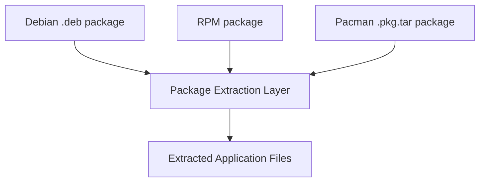
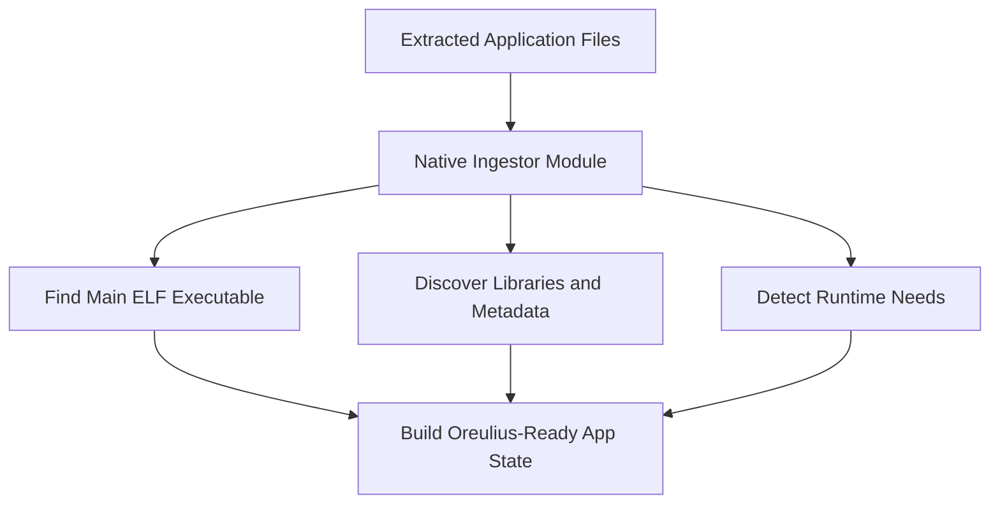
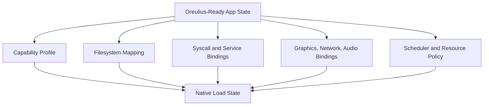
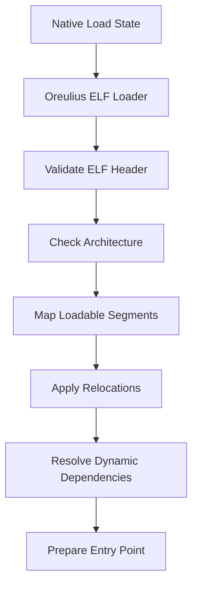
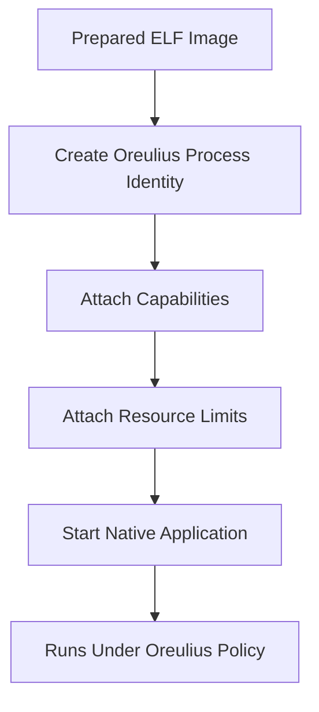
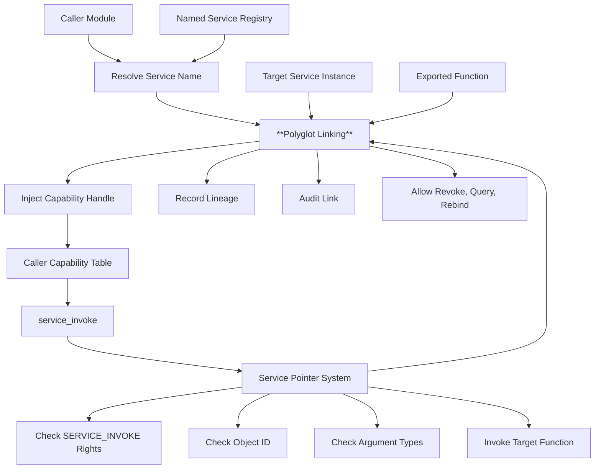
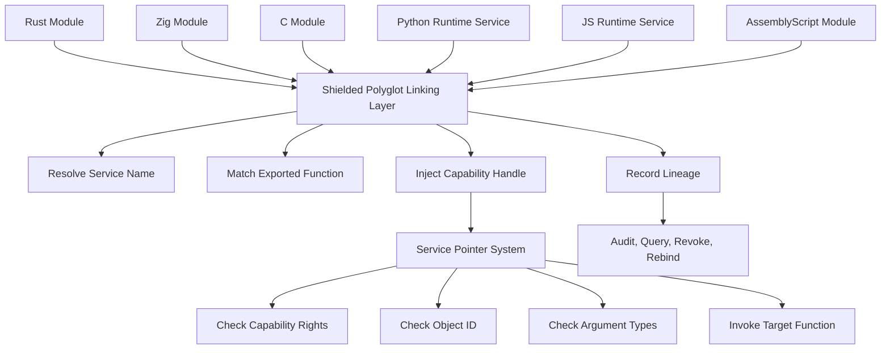
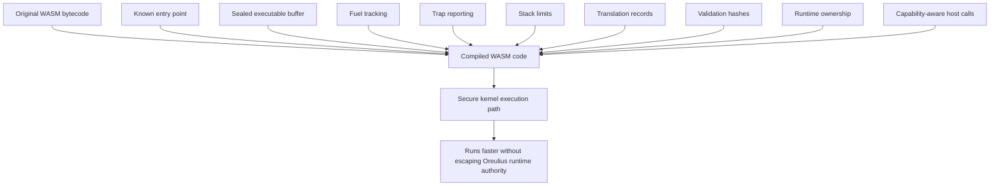

# The Oreulius Execution Engine

## What It Does
The Oreulius execution engine is responsible for running WebAssembly inside the kernel, as well as loading ELF binaries, which are compiled languages such as C or Rust Programs for unix and unix-like kernels, and prepares them into memory so they may be launched. This way it adds portability for applications from traditional unix-like kernels so they may be used in Oreulius overall execution architecture on top of just the standard WASM and rust workloads so the option is available.

## Why It Exists
It exists so that the code is in a format we can understand, and decided on whether a program should live in memory or not, and if so, what memory should it be allowed to touch. Then it decides on what services it can call.

If, it traps, fails, loops infinitely, or violates a security policy, it decides what should happen.

It decides if the scheduler can start it, and assesses if it can replay or inspect it later.

without the execution engine, the logic would be scattered everywhere. A shell might load a program one way, and the wasm might enforce rules another way. The scheduler might know too much about binary formats, and the security checks would become harder for the system to actualize.

The way it works with WASM and ELF varies:

For WASM, it runs modules throught the kernel runtime with limits capabilities, raply and optional JIT.

Whereas with ELF, it loads the program binaries into a user space and prepares them so the scheduler can launch them as processes.

---

## Architecture Overview

## ELF Loader
The ELF loader is the part that takes a ative program binary and turns it into something the Oreulius scheduler can actually start and launch. It is currently in the early stage, and is not fully supported, but will be in future dev cycles.

It works by taking ELF bytes, checking the ELF header, reading the program headers, then mapping the loadable segments into a new user address space.

Once the segments are into the new user address space, tit opys the code and data into the memory, where the zeros in the binary get de-initialized, so it can apply supported relocations.

Once that is complete, it creates the user stack and returns the entry points, the stack, and the address space.

After all of that is said and done, the scheduler launches the process.

The ELF loader does not simply run the program diretly, it preopares the program so the scheduler can run it.


### Proposed Native Ingestor Module

In order to make the ELF binaries run right away in an simple, automated, and straightforward sense, it is important to have something that takes the ELF binaries, and formats them to work within oreulius's capability structure, and operating environement natively and securely.

Especially in regards to ELF's designed to be packaged by the package managers for Debian, RPM and Pacman linux package managers. On their own, the ELF loader cannot simply just load native linux ELF's. Traditionally operating systems must have a Posix freindly layer or be posix aligned deep in the core for linux ELF's to load in such a manner.

This is why there needs to be a module in between the ELF loader, and the package extraction layer, to make Linux ELF binaries easy and prompt to port over to oreulius with minimal low cost effort.

The proposed Native Ingestor module, is to be a translation and binding layer that understands the extracted application as more than just some ELF files. It wil inspect the package, discover what the app needs, and then prepare a native launch plan before the ELF loader can run it.

The functionality for the module should flow the data and connect it within the operating system functionality as follows:

1. Read extracted package contents.

2. Find the main ELF executable.

3. Discover shared library dependencies.

4. Read package metadata.

5. Detect expected Linux/POSIX features.

6. Build an Oreulius capability profile.

7. Map filesystem paths into Oreulius storage.

8. Prepare network, graphics, audio, and IPC bindings.

9. Prepare scheduler and resource limits.

10. Hand the final launch plan to the ELF loader.


### Native Package to ELF Flow
To visualize from native ELF binary designed for any of these linux package managers, translated and ready for Oreulius launch, heres a 5 part chart series to show the full Linux Native ELF binary to Oreulius launch.

**Chart 1: Package Sources**


```mermaid
flowchart TD
    A[Debian .deb package] --> D[Package Extraction Layer]
    B[RPM package] --> D
    C[Pacman .pkg.tar package] --> D

    D --> E[Extracted Application Files]
```

*Figure 1: Debian, RPM, and Pacman packages are treated as containers that must be safely extracted before Oreulius can inspect the application.*

**Chart 2: Native Ingestor Module**


```mermaid
flowchart TD
    A[Extracted Application Files] --> B[Native Ingestor Module]

    B --> C[Find Main ELF Executable]
    B --> D[Discover Libraries and Metadata]
    B --> E[Detect Runtime Needs]

    C --> F[Build Oreulius-Ready App State]
    D --> F
    E --> F
```

*Figure 2: The proposed Native Ingestor Module reads extracted files, discovers the app shape, and builds a single Oreulius-ready app state.*

**Chart 3: Oreulius Binding**


```mermaid
flowchart TD
    A[Oreulius-Ready App State] --> B[Capability Profile]
    A --> C[Filesystem Mapping]
    A --> D[Syscall and Service Bindings]
    A --> E[Graphics, Network, Audio Bindings]
    A --> F[Scheduler and Resource Policy]

    B --> G[Native Load State]
    C --> G
    D --> G
    E --> G
    F --> G
```

*Figure 3: Oreulius binding turns app needs into capabilities, filesystem mappings, service bindings, device bindings, and resource policy.*

**Chart 4: ELF Loading**


```mermaid
flowchart TD
    A[Native Load State] --> B[Oreulius ELF Loader]

    B --> C[Validate ELF Header]
    C --> D[Check Architecture]
    D --> E[Map Loadable Segments]
    E --> F[Apply Relocations]
    F --> G[Resolve Dynamic Dependencies]
    G --> H[Prepare Entry Point]
```

*Figure 4: The ELF loader validates and maps the prepared native binary so the scheduler can start it safely.*

**Chart 5: Native Execution**


```mermaid
flowchart TD
    A[Prepared ELF Image] --> B[Create Oreulius Process Identity]
    B --> C[Attach Capabilities]
    C --> D[Attach Resource Limits]
    D --> E[Start Native Application]
    E --> F[Runs Under Oreulius Policy]
```

*Figure 5: The prepared ELF image becomes a native Oreulius process running under identity, capabilities, and resource limits.*


### ELF Constants
These are small nymeric values the loader uses to understand the binary format.

An ELF file in itself is not self-described with strings like "This is a 32 bit executable" or "this segment is loadable code, it simply just stores compact numeric tags.

These tags are compared against constants. These constants fall into two seperate groups.

The two major categories of these identity constants are ELF specification constants, and Oreulius Loader Policy constants.

#### ELF specification Constants

Under the ELF specification, there are various constants that help the kernel interpret what an ELF file is, understand what architecture it targets, where its loadable parts belong in memory, and what permissions or relocation rules apply. For starters, identity constants which are a type of Specification constant that identify whether the file is an ELF file at all, and what basic kind of ELF it is if it is one.

Here is a table to describe the various identity constants:

| Identity constant | What it identifies in the ELF |
|---|---|
| EI_NIDENT | The size of the ELF identity header. |
| ELF_MAGIC | The magic bytes that prove the file is an ELF file. |
| ELFCLASS32 | A 32-bit ELF binary. |
| ELFCLASS64 | A 64-bit ELF binary. |
| ELFDATA2LSB | A little-endian ELF binary. |

The next specification constants the kernel uses are file type constants, these constants will tell the loader what kind of ELF file it is dealing with.

There are currently two ELF constants available, we have ET_EXEC and ET_DYN, these together will tell the loader whether the ELF is a normal exeutable and if it is position independent.

Heres a table two ascribe the two:
| File Type ELF Constant | What it tells the loader |
|---|---|
| ET_EXEC | whether it is a normal executable |
| ET_DYN | if this ELF is position-independent |

The next type of specification ELF constants in the ELF loader is the Machine constants. These tell the loader what CPU architecture the ELF binary was built for. They come from the ELF header field called e_machine. A compiled binary can contain machine instructions, those instructions only make sense to the CPU architecture they were compiled for. Such as x86 machine code which cannot run directly on AArch64, 32-bit code that has different assumptions than if they were running on x86.

Machine constants help decide the CPU architecture of an ELF binary target. The constants defined so far are 32-bit x86, 64-bit x86, and AArch64, however, we do plan on porting in the future to RISC-V so oreulius plans on implementing Constants in the future during the porting process for RISC-V.

The types of elf constants for the machine arcitecture are explained through the following table:
| Machine constant | Target architecture |
|---|---|
| EM_386 | 32-bit x86 / i386 |
| EM_X86_64 | 64-bit x86 |
| EM_AARCH64 | 64-bit ARM / AArch64 |

Next, we have program header constants, the program header constants describe entries in the program header table. ELF header table is a list inside the ELF file that tells the kernel loader how to place the program into memory, so the ELF header constants tell Oreulius which of these matter in order not to put more than unnecessary in the memory.

| Program header constant | Meaning |
|---|---|
| PT_NULL | Unused program header entry. |
| PT_LOAD | Segment that should be loaded into the process address space. |
| PT_DYNAMIC | Dynamic metadata used for relocation and dynamic-linking information. |
| PT_INTERP | Requested interpreter or dynamic linker path. |

The program header constants in our ELF loader when bring ELF binaries into memory are designed to be portable while staying inside the Oreulius authority model, to make this secure there are some important hardening gaps required, these are described in the bottom of this readme, and are not currently addressed, which is expected during the ALPHA/Demo phase but is important to reiterate.

But aside from the hardening gaps required when talking about the kernel working binaries around the kernels memory while remaining a security-first, security focused, high stakes security kernel, it is designed to fit our authority model, because in Oreulius, an ELF is not treated as automatically trusted just because it is loaded. The loader places it into a user address space, not directly into the kernel memroy, it builds a process layout using VMA's, stack regions, heap base mmap region, and segement permsisions. Then the scheduler launches it as a user process.

The binary then becomes a scheduled user process bounded by its own address space. It runs under a kernel-controlled memory layout and Oreulius’s strict capability rules. This lets it use the memory assigned to it without being allowed to touch arbitrary kernel memory, system memory, or another process’s memory. It does not receive free authority just because it is native code.

Memory mapped into a process’s own user address space means the kernel gives that process its own view of memory. Only certain virtual address ranges in that view are valid for the process to use.

The process does not directly address raw physical RAM. It uses virtual addresses. Between those virtual addresses and physical RAM are page tables built by the kernel. The CPU’s MMU reads those page tables to translate process virtual addresses into real physical addresses and to enforce permissions such as user access, read, write, and execute.

So yes, the process ultimately uses RAM, but only through mappings the kernel created for it. If it tries to access memory outside those mappings, or memory without the right permissions, the CPU raises a page fault and the kernel decides what happens next.

When talking about memory that is mapped into its own user address space, this means that the kernel gives that process its own view of the memory, and only certain virtual address ranges in the view are valid for the process to use.

Think of this as it not touching the raw physical ram directly, only the virtual address of the ram.

Between the ram in the virtual memory address, there is the page tables layer that the kernel builds to tell the CPU and MMU how to translate a process virtual memory into the real physical memory. So yes in a way it does touch the ram, but never directly, and is techincally rebuilt by the kernel and disallowed completely to actually have any original aspects touch the ram.

Then, there is the segment permission constants, they are program header segment flag constants. They help load the p_flags field inside the program header. The ELF loader in Oreulius reads the program header table from a native binary. Then each program header describes one segment of the binary. For the loadable segetns, p_flags tells the loader what permissions that segment wants when it is places into the user memory.

the constants PF_X and PF_W are used to chek those permission bits, it uses them to translate each ELF segment permsiison into its own process layout permissioning.

For example, if the PF_W bit is present, the segement is treated as writable, and if the PF_X bit is present, the segment is treated as executable.

The kernel doesnt jsut dump the whole program into memory with full power, instead it breaks down each segment and gives only the kind of access it is supposed to have in order for it to align with the capability security model.

Heres a table to map what the segment permission constants are meant for, an
|segement permission constant | What it is for |
| Segment permission constant | What it is for  |                                                                                                               |---|---|
| PF_X                        | Marks memory as executable. It tells Oreulius this segment is meant to run as code. This keeps execution authority explicit.     |
| PF_W                        | Marks memory as writable. It tells Oreulius this segment is allowed to change while running. This keeps write authority limited. |
| PF_X without PF_W           | Usually code memory. It can run, but should not be rewritten. This helps protect program integrity.                              |
| PF_W without PF_X           | Usually data memory. It can change, but should not run as code. This keeps data and code separated.                              |
| PF_X and PF_W together      | Memory that can be changed and executed. This weakens code/data separation. Oreulius should treat this carefully.                |
| Neither PF_X nor PF_W       | Usually read-only memory. It can be read, but not changed or executed. This keeps authority narrow.                              |

The next type of specification constants are the dynamic tag constants. The help the oreulius find and size relocation tables. Basically, relocations are the fixups needed when a binary is placed into memory at a chosen base address. This keeps the ELF loading controlled instead of guessing where addresses need to be patched.

To clarify they are used when an ELF binary has a dynamic section. It tells it where the relocaiton table is, how big it is, how large each entry is, and where to stop reading it.

Oreulius will use the tags so it can safely find the relocation information instead of just guessing and potentially landing on something malicious if it is a malicious ELF file, so that if it tries to abuse the dyanmic tables to tell the loader where reloation data is and how much of it exists.
this is particualrly, powerful because of relocation writes. A malcious ELF might try to make the loader read and fake reloation entries or write relocation results into places it shouldnt.

So these constants are used to prevent that so that the kernel doesnt let the loader get turned into a confused memory editor. which can than read relocation entries from the wrong place, make the lodaer read past the real table, make the loader write a patched address somewhere it should not, make the bad addresses wrap around and look valid, or make the loader skip or mishandle important fixupsm, which could put the kernel into a broken state and fault immediately, make it change wrong parts of a program, and break applications, change pointers so the execution jump somewhere unintended, read fake metadata and make bad decisions, target memory outside of intended user processes.

Heres a table to go through all the dynamic tag constants and what they are used for in the kernel:
| Dynamic tag constant | What it is for                                                                                                                              |
|---|---|
| DT_NULL              | Ends the dynamic table. When the loader sees this, it knows there are no more dynamic entries to read.                                      |
| DT_REL               | Gives the address of a REL relocation table. REL entries do not store their own addend, so the loader reads the existing value from memory. |
| DT_RELSZ             | Gives the total byte size of the REL table. Oreulius uses this to know how far it is allowed to walk through the table.                     |
| DT_RELENT            | Gives the size of one REL entry. Oreulius checks this so it does not parse the table with the wrong structure size.                         |
| DT_RELA              | Gives the address of a RELA relocation table. RELA entries include their own addend, so the relocation value is more explicit.              |
| DT_RELASZ            | Gives the total byte size of the RELA table. This bounds how many relocation entries the loader should process.                             |
| DT_RELAENT           | Gives the size of one RELA entry. Oreulius checks this before reading entries so the table layout matches what the loader expects.          |
| DT_JMPREL            | Points to jump or PLT relocation data. This is mainly used by dynamically linked binaries, which Oreulius does not fully support yet.       |
| DT64_NULL            | The 64-bit version of DT_NULL. It marks the end of an ELF64 dynamic table.                                                                  |
| DT64_REL             | The 64-bit version of DT_REL. It points to a 64-bit REL relocation table.                                                                   |
| DT64_RELSZ           | The 64-bit version of DT_RELSZ. It gives the total byte size of the ELF64 REL table.                                                        |
| DT64_RELENT          | The 64-bit version of DT_RELENT. It gives the size of each ELF64 REL entry.                                                                 |
| DT64_RELA            | The 64-bit version of DT_RELA. Oreulius uses this to find ELF64 RELA relocations.                                                           |
| DT64_RELASZ          | The 64-bit version of DT_RELASZ. It gives the total byte size of the ELF64 RELA table.                                                      |
| DT64_RELAENT         | The 64-bit version of DT_RELAENT. It gives the size of each ELF64 RELA entry.                                                               |
| DT64_JMPREL          | The 64-bit version of DT_JMPREL. It points to jump or PLT relocations, but this belongs to fuller dynamic-linking support.                  |

after speaking about how the dynamic tags help the loader find the relocation tables in the memory, it is not to be confused with the relocation type constants.

The relocation type constants tell the loader what kind of address fixup each relocation entry wants. If the dynamic tags could say here is the relocation table if they could speak, the relocation type costants would reply with "this exact entry is this kind of relocation and either pass the relocation relocation on through further identified.

Heres a table of the relocation type constants and what they are for:
| Relocation type constant | What it is for                                                                                                              |
|---|---|
| R_386_RELATIVE           | Relative relocation for 32-bit x86 ELF files. It lets the loader adjust stored addresses based on where the ELF was loaded. |
| R_X86_64_RELATIVE        | Relative relocation for 64-bit x86 ELF files. It is defined, but your current ELF64 path does not fully handle it yet.      |
| R_AARCH64_RELATIVE       | Relative relocation for 64-bit ARM ELF files. Oreulius uses this for basic AArch64 ELF64 address fixups.                    |
| R_AARCH64_JUMP_SLOT      | AArch64 jump slot relocation. This is usually tied to PLT or dynamic linking, which Oreulius does not fully support yet.    |

The relocation type constants aid in security by keeping the loader atied to oreuliuses method of relocation, rather than drifting into generic ELF theory, this way it knows what kind of write it is being asked to perform. It ties into capability mediation in the kernel, y making the loader time memroy authority explicit by checking if the kind of fix ip is within the loader's authority, or if the ELF has authority over that memory region in the kernel. It checks if the loader can legally patch it befor elaunch, and if this would need authority oreulius wont grant in this context or at all.

#### Oreulius Loader Policy Constants
Under the Oreulius Loader Policy Constants, there are two types, and its just a different between if they are for 32 bit or 64 bit types.

These are not format constants, they are Oreulius design choices. This is not about what the ELF file says in premise, but what does oreulius choose to do with it.

These tell Oreulius how to lay out the process in memory after it understands the ELF. Now that oreulius understands the ELF file, oreulius needs to know, where it should plae it, how much stack it needs to be given, and where should future mappings begin.

The constants are as follows:
| Oreulius loader policy constant | What it tells Oreulius                                                            |
|---|---|
| DEFAULT_BASE32                  | Where to place a 32-bit position-independent ELF if it needs a default load base. |
| DEFAULT_BASE64                  | Where to place a 64-bit position-independent ELF if it needs a default load base. |
| DEFAULT_STACK_PAGES             | How many memory pages to reserve for the new process’s initial user stack.        |
| USER_MMAP_MIN_ADDR              | The lowest area where Oreulius should begin mmap-style user mappings.             |


DEFAULT_BASE32 and DEFAULT_BASE_64 answer where the program begins in user memory.

DEFAULT_STACK_PAGES answer how much starting stack the process gets.

USER_MMAP_MIN_ADDR answer where future mapped memory should start.

They help Oreulius keep the process layout highly predictable and bounded. The loaded ELF does not get to freely decide the entire memory shape. Oreulius firmly chooses the controlled defaults for the base addresss, the stack size, and the mapping regions so the process fits inside the kernels user-space authority model.


### Load Sequence
In the elf the order of works in this flow:

1. check header
2. parse program header
3. map segments
4. copy data
5. zero BSS
6. apply relocations
7. create stack
8. return layout

The sequence above desvribes how the ELF goes from raw bytes into a scheduled user process. It never runs a binary directly, it prepares the binary into a controlled memory layout, then hands that layout to the scheduler.

That flow must first prove the file is structurallu the kind of ELF the loader expects. The headers then must tell Oreulius which parts of the file are loadable, dynamic, ignored, or special. Then Oreulius systematically chooses the load base so that it can keep placement under strict policy instead of leting the ELF freely shape memory.

Once it creates the user address space, the program is seperated from the kernel memory and other processes. Then Oreulius maps the loadable segments, and creates the memory regions where the code data and BSS will livel.

After that the file-backed bytes are copied, and the programs code initializes its data into the process. Then we zero uninitialize the memory.


### Public Functions

### Safety Rules Oreulius strongly follows in regards to malicious ELF files.

| Oreulius rule                            | What it means for malicious ELF files                                                    |
|---|---|
| Native code is not automatically trusted | Loading an ELF does not make it kernel code.                                             |
| Authority must be explicit               | The ELF only gets the memory permissions the loader grants.                              |
| User memory stays separate               | The ELF must not map into kernel memory or other processes.                              |
| Relocations must be bounded              | Address fixups must not become arbitrary writes.                                         |
| Execution must start somewhere valid     | The entry point must land inside approved executable memory.                             |
| Unsupported features should fail closed  | If Oreulius does not support something, the loader should reject it instead of guessing. |


---

## WebAssembly Runtime

This is in basic simple terms the wasm execution engine that runs programs inside the oreulius kernel.

This makes sure the WASM program does not run directly on the CPU like a native ELF binary on a traditional Operating System. It runs sandboxed entirely within the runtime.

This runtime gives it:
1. Memory
2. a stack
3. functions
4. Limits
5. Host calls
6. Capability Checks
7. Traps when something goes wrong.

The runtime is responsible for turinng a WASM bytecode into a runnable system natively and securely in ring-0. allowing it to never touh arbitrary memory, and if it would like to do womehting outside the kernel, such as with a service, a access file, channel an IPC, or interact with the time/replay system, it must go through host functions. These host functions are mediated by the runtime and tied into the Oreulius capability model outlined in the capability folder for your reading pleasure.

Its not only how, but why, it does not only run, it decides. That is the best way to think of it.

What is is it allowed to do. How much memoery can it use, how many host calls can it make? what happens if it traps? can it be replayed or inspected, and what parts of it can be accelerated by the JIT compiler.

When i wrote this earlier on:

>This runtime gives it:
>1. Memory
>2. a stack
>3. functions
>4. Limits
>5. Host calls
>6. Capability Checks
>7. Traps when something goes wrong.

I think now is a great time to summarize the maturity levels of each of these aspects,

#### The stack, Functions, the Capability Checks, the limits
Firstly, the fully implemented aspects of these items are Stack, which is fuly implemented, and the functions that are fully implemented and fully and intricately mathematically bounded meticuously. the capability checks are also fully implemented, bounded and tied into centrality across the whole ecosystem.

#### The Traps
The traps are implemented, but they are not hardened and present some security issues due to this, such as trap behavior differing between the interpreter, JIT, host-call paths, thread paths, or architecture-specific exception handlers. These issues can cause incosistancy, state leakage, partial host call effects, and JIT trap mismatches down the road on uniue or odd instances, that would be easier to patch code side and mathematically rather than to fuzz and patch over time, but that is also important to do regardless, on top of following the  formal verification process.

Another thing the trap being not hardened presents in terms of risks is thread trap ambiguity, suc has when a WASM threads, a trap needs to clearly kill, pause, or mark the correct thread, if not, one trap thread could affect the pool incorrectly.

The recovery path on the trap is weak, if the trap does not reset instruction, or memory fuel, the stack pointers, or the active JIT state correctly, then execution can resume in a unnacceptable state that oreulius needs to command.

Also this lack of hardening causes poor auditability, so trap reasons are recorded consistantly, and debugging and replay become more trustworthy.

#### Host Calls
The host calls are implemented and broad, but they remain to be highly Oreulius-specific. The host-call table is large and real, including the services, temporal calls, WASI-style calls, compositor/input, TLS, process calls, mesh, observer, policy, and capability graph functions.

It reamins less so a generic WASI runtime as host calls are tied to Oreulius's own ABI and capability model. This isnt necessarily a bad thing on its own, it is a delerberate security trade-off. As the kernel wants every action to pass through capability checks and policy mediation. The cost of all of this, is that generic WASI module are going to need adpatation in some cases.

This cost can be reduced in further dev cycle passes over this, by adding a compatibility layer that safely maps standard WASI expectations into Oreulius's authority model.

#### Memory
This is what gives the WASM runtime programs each their own program read and write capability while it runs. Therefore it cannot be kernel memory. This is so that each WASM program does not each get a pointer into the kernel, and does not get to freely touch RAM. IT instead gives runtime a bounded memory region called linear memory. It is called Linear memory because the program sees it like on flat range of bytes.

A WASM module can only access memory through the runtime’s memory rules. If the module tries to read or write outside its linear memory, the runtime will trap instead of letting it tourch arbirtrary system memory.

It is limited by linear memory constants that prevent one module from gorwing memory forever, or hammering memory operation endlessly.

Here are these such constants:
| Constant | What it structures |
|---|---|
| WASM_MAX_PAGES | The absolute maximum number of WebAssembly memory pages an instance can address. |
| WASM_DEFAULT_MAX_PAGES | The normal default memory ceiling given to a WASM instance when no stricter limit is set. |
| MAX_MEMORY_OPS_PER_CALL | The per-call budget for memory reads and writes before execution should be stopped or trapped. |

The maturity level of this tool is pretty strong, the runtime has an actual memory model, limits, bound checks, and thread shared memory support. The full maturity still needs consistant enforcement across the interpreter, JIT, host calls and WASM threads.

To do this, we will need one shared memory policy used by every path. This memory policy needs to do these things:

1. Use one memory API for reads, writes, grows, copies, and shared-memory access.

2. Make every path use the same overflow-safe bounds check.

3. Make interpreter, JIT, host calls, and threads share the same memory fuel model.

4. Make JIT bounds checks match the interpreter exactly.

5. Give host calls checked memory slices instead of unchecked raw access.

6. Make shared WASM memory follow the same bounds, fuel, and trap rules.

7. Route all memory violations into the same trap and cleanup path.

8. Add parity tests for interpreter, JIT, host-call, and thread memory behavior.


### Capacity and Resource Limits

these are the rules that stop one executable workload from consuming too much of the kernel.

Its kind of akin to a budhet system where it does not allow usage of infinite memory, stack, instructions, host calls or services.

The exection model gives the program fixed limits. Even if a code is not malicious, it can still have bugs and cause damage, so blocking infinite usage is key to stopping that from happening.

These bugs are what it can stop:
1. infinite loops
2. runaway memory growth
3. too many function calls
4. too many locals
5. too many host calls
6. too many memory operations
7. too many loaded modules

Here are the constants used to keep these limits in place so infinite resources arent consumed either accidentally, or purposefully in a malicious sense.

| Constants | What it prevents |
|---|---|
| MAX_MODULE_SIZE | Prevents oversized WASM modules from consuming too much kernel memory during loading and validation. |
| MAX_STACK_DEPTH | Prevents the WASM value stack from growing without bound. |
| MAX_LOCALS | Prevents functions from allocating too many local variables. |
| WASM_MAX_PAGES | Prevents linear memory from growing beyond the WebAssembly maximum. |
| WASM_DEFAULT_MAX_PAGES | Prevents normal WASM instances from consuming excessive memory by default. |
| MAX_INSTRUCTIONS_PER_CALL | Prevents infinite loops or long-running functions from monopolizing execution time. |
| MAX_MEMORY_OPS_PER_CALL | Prevents a module from performing too many memory operations in one call. |
| MAX_SYSCALLS_PER_CALL | Prevents a module from flooding the kernel with too many host/syscall-style calls. |
| MAX_CALL_DEPTH | Prevents runaway recursion and deeply nested function calls. |
| MAX_WASM_GLOBALS | Prevents a module from defining too many global variables. |
| MAX_WASM_TABLE_ENTRIES | Prevents overly large function tables and indirect-call surfaces. |
| MAX_WASM_TYPE_ARITY | Prevents functions or block types from having too many parameters or results. |
| MAX_WASM_TAGS | Prevents too many exception tags from being registered in one module. |
| MAX_EXCEPTION_ARITY | Prevents exception payloads from becoming too large. |
| MAX_SYSCALL_MODULES | Prevents too many syscall-loaded WASM modules from being tracked at once. |
| MAX_CONTROL_STACK | Prevents excessive nested control-flow frames. |
| MAX_TRY_CATCHES | Prevents one try frame from carrying too many catch clauses. |
| MAX_INJECTED_CAPS | Prevents too many capabilities from being injected into one WASM instance. |
| MAX_SERVICE_POINTERS | Prevents the global service-pointer registry from growing without bound. |
| MAX_SERVICE_CALL_ARGS | Prevents service-pointer calls from carrying too many arguments. |

This part of the code keeps the kernel from turning bugs into denial of service opportunities.

While it is quite comprehensive, there are many rooms for improvement.

The capacity system is present, but full maturity requires consistent enforcement across interpreter, JIT, host calls, replay, and threads. It also needs clearer per-thread/per-instance accounting, policy-driven configuration, stronger cleanup after limit traps, and tests that prove the limits cannot be bypassed.

The things that are needed to e imlpemented are as follows:

1. Make the interpreter and JIT enforce the same limits.

2. Give each WASM thread its own resource budget.

3. Track per-instance and system-wide resource use separately.

4. Measure host-call cost, not just host-call count.

5. Track reserved, grown, and released WASM memory pages.

6. Clean runtime state when a limit trap happens.

7. Track injected, delegated, imported, and revoked capabilities.

8. Limit replay event count and transcript size.

9. Connect execution budgets to scheduler fairness.

10. Make limits configurable by workload policy.

11. Expose counters for memory, fuel, calls, traps, and capabilities.

12. Test that recursion, JIT, imports, memory growth, host calls, replay, and threads cannot bypass limits.

### Value System
The runtime has a way of storing WASM values on the stack, in locals, globals, and across function calls. This ability is put together under a structure called the value system.

As WASM is a typed stack machine, it means instructions push and pop these typed values. So in order to be compatible with that, the value system represnts those values internally.

The value system covers these basic WASM value types:
| Value type | Meaning |
|---|---|
| I32 | 32-bit integer |
| I64 | 64-bit integer |
| F32 | 32-bit floating-point value |
| F64 | 64-bit floating-point value |
| FuncRef | Reference to a function |
| ExternRef | Reference to an external object |

The value system uses these to keep execution typed and accurately predictable. It knows what kind of value is on the stack, what type a function will expect, and what type a function returns.

It knows whether a host call recieved valid arguments and whether a branch or a block result has the right shape. It also knows whether a global can be read or written safely into deeper parts.

It is pretty mature, the runtime has real value types and value structures. It has strong stack handling. Good globals, complex tables, and ensures there are host-call signature checks.

It however still needs interpreter values, JIT values, thread-local calues, host-call argumens and results, and function referneces with external resources.


### Opcode Enum
The enumeration of opcodes is how the runtime lists the WASM instructions it knows how to recognize. In Oreulius, an opcode is a single WASM instruction byte that tells the runtime what operation is being requested. WASM bytecode is a stream of small commands, and the opcode enum turns those raw command bytes into named operations the kernel can reason about.

For example, the raw byte 0x6A becomes I32Add. That lets the interpreter treat it as “add two 32-bit integers” instead of only seeing an anonymous byte value.

Oreulius uses opcode enumeration to parse WASM bytecode, decide what instruction is being executed, validate supported instructions, drive the interpreter, decide what the JIT can compile, and reject unknown or unsupported instructions.

The important limitation is that recognition is not the same as full support. The opcode enum shows what the runtime can identify. The interpreter, JIT, validator, and self-check paths still decide which opcodes they can safely execute, compile, or reject.

The limitations like this tend to follow the trend from previous elements of the execution system at the current stage. In that, there isnt full WASM support yet. There needs to be much larger WASM support across the kernel.

The enum recognizes more iocides than the execution path fully supports. While the interpretor handles many of them, the JIT compiler, supports only a small portion of them. An opcode can be known to oreulius, but is still not safely compatible.

The current security risks that arise from this are that the runtime treats known opcode as safe everywhere. The JIT cannot safely diverge behaviour to this yet.

Theres also no extended opcode prefix coverage.

It is going to need to have these prefixed unstruction spaces supported for safety reasons:
| Prefixed opcode space | Feature area | What it is for |
|---|---|---|
| 0xFC | Bulk memory, numeric extensions, and table operations | Adds multi-byte opcodes for memory copying/filling, data segment control, table copying/growing/filling, and extra numeric operations. |
| 0xFD | SIMD | Adds vector instructions for operating on multiple values at once, such as packed integer and floating-point lanes. |
| 0xFE | Atomics and thread instructions | Adds atomic memory operations, wait/notify behavior, and shared-memory synchronization needed for real WASM threading. |

The enum we have only maps single byte opcode directly. The parser can misread multi-byte instructions due to that because some WASM instructions begin with a prefixed byte that use an additional immediate opcode after that prefix to idenitfy real target instructions. If the Oreulius runtime consumes the following bytes incorrectly or treats that completed byte as a full instruction on its own without intervention, it canause the bytecode stream to become misaliged, once that happens, later bytes may be interpreted as the wrong instruction.

If that isnt addressed and fixed, it can cause invalid validation, incorrect execution, and unsafe rejection behaviour. These can amount to huge security concerns, that keep the kernel in alpha for research and agile development.


### LinearMemory
This is Oreulius's WASM memory container. More specifically, it is the bounded  byte region a WASM instance is allowed to read and write. Since the kernel doesnt touch arbitrary kernel memory, it allows the kernel to read the byte region through offsets inside the linear memory.

There are various parts that are tracked in linear memory.

Data: The raw pointer to the allocated memory buffer.

pages: This is the current active WASM page count. For reference, one WASM page is 64kb

max_pages: The Max Pages is represeted by the largest size a memory that is active is authorized to grow to the size of.

allocated_bytes: The amount of memory that has actually been allocated.

shared: This is tracking whether a memory can even participate in WASM threaded or shared memory behaviour

Every read and write has to fit inside the active memory range, and the code uses a checked addition to do so. Adress math cannot wrap around silently, it must be tracked through validity. If it is invalid, it returns a out of bounds notifcation through MemoryOutOfBounds.

It also calls tag_wasm_linear_memory to connect the memory region to the isolcation and security layer. This function does so by labeloing them as WASM linear memory so the kernel can decide what region to treat different from normal memory or code running through the JIT compiler.

WASM code interacts with it indirectly through WASM memory instructions like load, store, memory.size, and memory.grow. While the kernel runtime code interacts with it through different methodizations such as read, write, grow, read_i32, write_i32, active slice and atomic helpers.

In the kernel, it is a unique and one of a kind type of linear memory functionality within the kernel. It is WASM-owned, but kernel controlled. It is bounded by page limits entirely, while being trapped on invalid access. It totally supports growth, while being able to be accurately tagged for memory isolation.

It has early shared memory atomic support at the current stage, and it is used by host calls, check through the replay and the self, JIT bounds tests, and WASM threaded plumbing.

So to picture why this is unique, it is a controlled memory region of a wasm instance. A bounded, growable, security tagged byte space that lets WASM code store data without gaining access to kernel memory in unsafe ways.

### WasmModule
So the LinearMemory is the memory container, the next container in the WASM functionality in Oreulius is the loader and validator container, this is the WasmModule.

What it does is it chefks the module shape, it parses sections, it stores function metadata, it resolved host imports, it records exports when they happen, it validates the data, table and global structure if one is applicable. Then prepares everything needed to instantiate the module.

The public loading entering the container is the loading path, this loading path for the wasm container is called the load_binary path in the code.

The public loading path checks
1. the module size
2. WASM magic header
3. WASM version
4. section order
5. section sizes
6. type limits
7. function limits
8. table limits
9. memory limits
10. import validity
11. export validity
12. code body validity
13. data segment validity
14. start function validity

The WASM module is designed to refuse to treat the raw WASM bytes as trusted. That refusal is key, a module has to become a structured object first.

Before the code runs, it proves that its format, imports, functions, memory declarations, tables, globals, and data segments fit the runtimes rules.

These are resolved through the host ABI,This is important because the host imports are protected by the WASMModule, to not let a module import haphazard outside functions. They must resolve through resolve_host_import, and only accepts the oreulius host namespace and match signatures.

These are the various enforcments run in the WASM Module container.

1. the bounded size
2. the bounded functions
3. the bounded locals
4. the bounded globals,
5. the validated function bodies
6. checked start function rules

The user facing interaction is done through higher-levrel loading, spawn, and runtime API'. It is an automated process done for the user. You can manually test utm tge cide sinetunes akkiws helper paths like synthetic, raw bytecode loading, but all normal paths are load_binary, or should be atleast.

It is not just any generic WASM parser, it ties into the capability authority model by understanding what the host imports, what the capability mediated host calls are about, what custom language tags exist, what is bounded, what can start, and what can start restriction.

It has runtime-safe data initialization, and needs JIT interpreter metadata needs. So in essence, it is the validated blue print of a WASM program for the Oreulius kernel. it is structured module that oreulius can safely use, inspect, and link to host calls that have been approved. It eventually will execute inside the kernel runtime.


It is at a substantial implementation state, but it isnt fully mature, there still are limitations in the WASM module that need to be implemented in the next dev cycles before it can move to BETA. Those being listed in the final section.


### WasmInstance
This is the running form of a WasmModule. When expressed as a running form, a WASM Module that is a live state version, and executes the blue print of the "module definition WasmModule", ir the loaded module. It basically is the instance where any WASM module is live.

A wasm instance holds these elements in its execution state:


| Part of each and every instance | What it means |
|---|---|
| module | The parsed WASM module being executed. |
| memory | The instance’s linear memory. |
| stack | The WASM value stack. |
| locals | Local variables for the current function. |
| globals | Runtime global variables copied from module templates. |
| control_stack | Active block, loop, if, and try frames. |
| pc | Program counter inside the module bytecode. |
| capabilities | Per-instance capability table. |
| process_id | The kernel process identity attached to this instance. |
| instruction_count | Runtime instruction budget tracking. |
| memory_op_count | Memory operation budget tracking. |
| syscall_count | Host/syscall budget tracking. |
| jit_state | Per-instance state used by the JIT path. |
| thread_pool | Cooperative WASM thread pool for this instance. |
| wasi_ctx | WASI-style context for args, fd table, preopens, random, and exit state. |

This allows oreulius to be able to ask each instance, which process is running this WASM code, what capabilities does it have, how much budget has it used, and what host calls is it allowed to make.

The code also checks the execution permission before running normal functions through the security layer. Because of that, replay can record and replay selected calls in the kernel, JIT execution is validated against interpreter behaviour for each initial call.

The Framework is largely complete, for securing down a WASM instance, but it still requires full completion of this for each of these:

1. stronger cleanup on traps
2. clearer per-thread authority and budgets
3. stricter host-call side-effect accounting
4. deeper JIT/interpreter parity guarantees
5. full OS-level threading if desired
6. stronger lifecycle cleanup for JIT allocations and instance destruction
7. fuller replay coverage of memory, capabilities, traps, and threads


Wasm instances can be used furing the shell commands, External or higher level code should be forced to use runtime API'S, when loading a module, instantiating it, and calling a function.

The instance itself is its own runtimes private state machine.

This is unique because it no longer is a VM object, it is actually a sandboxed native exuction. Offering many features:
services, IPC, and other kernel features can be granted, checked, and revoked.

1. ***Portable WASM execution***
   *The instance can run WebAssembly code in a controlled runtime instead of tying every workload directly to one native CPU format.*

2. ***Capability authority***
   *The instance carries its own authority table, so access to files, services, IPC, and other kernel features can be granted, checked, and revoked.*

3. ***Process identity***
   *Each instance is tied to a kernel process ID, which lets Oreulius connect WASM execution to ownership, policy, auditing, and security decisions.*

4. ***Bounded resource accounting***
   *The instance tracks instruction count, memory operations, syscall-style calls, and call depth so execution cannot grow without limits.*

5. ***JIT validation***
   *The instance can use JIT acceleration while still comparing early JIT behavior against interpreter behavior to catch mismatches.*

6. ***Deterministic replay hooks***
   *The instance can participate in replay by recording or reusing host-call results, which makes debugging and auditing more reproducible.*

7. ***WASI compatibility state***
   *The instance carries WASI-style state such as args, file descriptors, preopens, random state, and exit status.*

8. ***Cooperative WASM threads***
   *The instance owns a WASM thread pool, letting multiple lightweight WASM execution contexts make progress under runtime control.*

9. ***Temporal/security host integrations***
   *The instance can call into Oreulius-specific temporal, policy, observer, mesh, and capability graph systems through mediated host functions.*

Because the pieces are spread across the runtime instead of being presented as one clean feature list, It was complex to figure out at first.

It looks like a WASM instance, but the instance is carrying a lot more than just normal live WASM state.

It still has the expected runtime pieces: memory, stack, locals, and globals. That is the regular WebAssembly side of it. But in Oreulius, the instance also carries process identity, capability tables, resource counters, JIT state, replay hooks, WASI context, and thread state.

So instead of being just “running WebAssembly,” the instance becomes more like a controlled kernel actor. It has code to run, memory to use, a process identity, a limited set of permissions, and a budget for how much work it is allowed to do.

That is what makes it interesting. The WASM instance is not only an execution container. It is the point where portable code, kernel policy, capability security, replay, JIT validation, and resource limits all come together.

An actor, that can think:

>Which process is running this WASM code, what capabilities does it have, how much budget has it used, and what host calls is it allowed to make?

An actor that is the live execution context of a WASM programit combines the module, memory, stack, globals, capabilities, process identity, limits, JIT state, WASI state, replay hooks, and thread pool into one kernel-controlled runtime object.


### Service Pointer System
This system lets a singular WASM instance expose one of its functions as a callable service, then gives other code a capability-backed handle to call it.

Each service that gets called is put in kernel-controlled table, where its tied to an owner process and checked through the capability system. It is limited by runtime policy.

The caller does not get direct access to any target instance, it only gets a service pointer capability.

When Pointer gets evoked, it gets checked whether it has service inoke rights. In the code it is logged under the SERVICE_INVOKE function. This must be proven through the argument types, obeys the rate limit rules, then calls the target WASM function through the runtime. This means a service can be granted, delegated, introspected, invoked, and revoked without exposing the whole process, or the whole WASM instance.

It is important to understand that the invoke path is not just something that calls a function. It is a control point between one piece of a code and another. Before the call happens, oreulius checks whether the caller has the right capability, whether the pointer still exists, whether the target still belongs to the right owner, and whether the arguments match  what the service said it accepts.

So when a invoke is closer to a security gate than a normal function call, the caller will not recieve a plain memory or function address, as if to jump to whatever code lives at this location, nor will it recieve direct access to the target instance.

Instead, it receives a capaility backed service object, and a runtime will then decide whether that object can be used. So a service call can than be granted, delegated, audited, replayed, rate-limited, revoked, and move through the IPC without turning into uncontrolled authority in the kernel.


The main maturity work is hardening edge cases, because it is really well implemented otherwise:
1. Cleanup on trapped instances.
2. Stronger lifecycle rules.
3. Better auditing.
4. Safe behavior across WASM threads.
5. Safe behavior during replay.
6. Safe behavior through JIT paths.

On top of hardening those aspects, other important security work over the next dev cycle of the execution folder is imperitive to make sure it will pass formal verification on security.

These things being:

1. Stack clearing is blunt.
The invoke path clears the target instance stack before and after the service call. That is simple, but it could be dangerous if the target instance is already in a complex execution state.

2. Target busy handling exists, but concurrency still needs scrutiny.
It uses exclusive instance access, which is good, but service calls across threads or nested service calls could still create edge cases.

3. Rate limiting is fixed and basic.
128 calls per window is useful, but it is not policy-rich yet. Different services may need different limits.

4. Trap cleanup needs hardening.
If the invoked function traps or partially mutates state, the code clears the stack, but broader authority, memory side effects, and service lifecycle cleanup need stronger guarantees.

5. Revocation timing needs careful testing.
Revocation removes registry entries and object capabilities, but races around invoke/revoke paths should be heavily tested.

6. Replay can hide real side effects if not handled carefully.
In replay mode, the host call result can be replayed instead of actually invoking the service. That is useful, but security-sensitive service behavior needs clear replay policy.

7. Legacy invoke only supports i32-style arguments/results.
The simple invoke path converts args to i32 values and expects at most one i32 result. That is safe by being limited, but it is also easy to misuse if callers expect richer typing.

So while the service invoke path capability-aware, and much safer than a raw function pointer, it still has some lifecycle, concurrency, trap cleanup, reaply sematnics and edge path work ahead of it.

### Polyglot Linking
This is how a service is dicovered, exported to functions, tracked via leneage, revokes, and calls of services can become cross languaged.

It is machined in the code through ***`polyglot_resolve`***, and
***`polyglot_link`***

So when the service pointer system wonders if it can safely call an exported function, the polyglot linking wonders if it can find a service by the name, connect to one of its exports, and keep track of that relationship over time.

The flow, is essentially that the runtime or module registers itself as a service, so that another module can ask for that service by name.

When Oreulius resolves the name to a target instance, the caller than asks to link a specific exported function. Then Oreulius finds the matchingn service pointer for that export.

After that, the call can now go through the service pointer system, and be recorded in lineage.

It intermediates the Service pointer system like so:

```mermaid
flowchart TD
    A[Caller Module] --> B[Resolve Service Name]
    C[Named Service Registry] --> B

    B --> D[**Polyglot Linking**]

    E[Target Service Instance] --> D
    F[Exported Function] --> D
    G[Service Pointer System] --> D

    D --> H[Inject Capability Handle]
    D --> I[Record Lineage]
    D --> J[Audit Link]
    D --> K[Allow Revoke, Query, Rebind]

    H --> L[Caller Capability Table]
    L --> M[service_invoke]

    M --> G
    G --> N[Check SERVICE_INVOKE Rights]
    G --> O[Check Object ID]
    G --> P[Check Argument Types]
    G --> Q[Invoke Target Function]

```
*Figure: Polyglot Linking is the middle layer that connects named services, exported functions, and the Service Pointer System. It creates the link, injects the capability handle, records lineage, and then future calls go through service pointer enforcement.

They key idea of the polyglot linking is that it is the relationship builder with the call, and the service pointer is the authority gate. The definition of polyglot in the service linking layer is where the modules from different languages and runtime identities can discover each other, link exported functions and call across that boundary through capability backed service pointers. In simple terms polyglot in the kernel means the service linking layer.

The Polyglot sits in the middle of discovery, export, mathching, lineage, and service pointer capability injection. It however does not do the final safe invocation alone, as it only builds the link and lets the service invocation happen safely with something more specialized to do so.

If for example a module carries a language identity, needs to be registered as a service, needs to link to a specific exported function, needs a link turned into a service pointer capability, needs a future place for calls to go through enforcement in the service pointer, or needs a relationship to be tracked, then the polyglot is where it needs to go.

It can be defined as the controlled cross language linking under the capability model. It is how Oreulius lets different language tagged runtimes talk to each other without bypassing authority checks.


```mermaid
flowchart TD
    A[Rust Module] --> S[Shielded Polyglot Linking Layer]
    B[Zig Module] --> S
    C[C Module] --> S
    D[Python Runtime Service] --> S
    E[JS Runtime Service] --> S
    F[AssemblyScript Module] --> S

    S --> G[Resolve Service Name]
    S --> H[Match Exported Function]
    S --> I[Inject Capability Handle]
    S --> J[Record Lineage]

    I --> K[Service Pointer System]
    K --> L[Check Capability Rights]
    K --> M[Check Object ID]
    K --> N[Check Argument Types]
    K --> O[Invoke Target Function]

    J --> P[Audit, Query, Revoke, Rebind]

```
*Figure: Polyglot Linking acts like a shielded meeting layer where different language-tagged modules can discover and connect to each other, while actual calls still pass through service pointer authority checks.

### Capability Entanglement and Policy
The capabilities become more than just static permission tokens through the capability entaglement and policy. WASM can be bind policy to a capability, entangle  capabilities together, and expose the capability delegation graph to WASM code.

The three systems work together, to turn what would be static permission tokens into capability entanglement and policy.

1. Policy contracts:
A WASM instance can bind a small policy contract to a specific capability ID, such that a policy is stored by process ID and capability ID. Then, the process is evaluated against a context buffer where the system will deny by default if the policy is missing, malformed, unsupported, or returns deny as a response.

2. Capability Entanglement:
Entanglement is where two or more capabilities are linked together so their lifecycles are connected, if one capability is revoked, than the linked capability can be revoked through a cascading effect aswell. This is where two authorities should not survive seperately, such as a service handle, and resource authority that makes it meaningful.

3. Capability Graph Verification:
The capability graph tracks delegation edges when authority moves between processes. It checks so that delegated rights can never exceed the delegators rights to prevent privilege escalation right from the core. As-well as reject cyclical delegation, and prune stale edges when capabilities are revoked.

The idea behind these three subsystems as they work together in a WASM process is that a capability is not merely "is something allowed" but rather, does this authority depend on other authority? or does this authority have a delegation chain behind it.

The WASM exposes these aspects of each process to the host calls to enforce these upon execution of a WASM process:
| Function | What it does |
|---|---|
| policy_bind | Attaches a policy contract to a capability. |
| policy_unbind | Removes a policy contract from a capability. |
| policy_eval | Evaluates the policy against context bytes. |
| policy_query | Returns policy metadata. |
| cap_entangle | Links two capabilities together. |
| cap_entangle_group | Links a group of capabilities together. |
| cap_disentangle | Removes entanglement links. |
| cap_entangle_query | Lists entangled capability peers. |
| cap_graph_query | Returns capability delegation edges. |
| cap_graph_verify | Checks whether a delegation would violate graph rules. |
| cap_graph_depth | Returns delegation chain depth. |

This is just a simple slice of the overall capability system Oreulius uses to maintain security and authority of all running elements. It is not the full kernel-wide authority layer, it applies just to the policy and relationship side of capabilities inside the execution runtime: binding rules to capabilities, entangling capability lifetimes, checking delegation paths, and exposing those relationships to WASM through controlled host calls.


### Observer Event System
This layer inside the WASM execution runtime lets a WASM module subscribe and publish to kernel and runtime events, then recieve those events through an IPC channel.

Each observer gets a private event channel, when something interesting happens, the kernel then sends a compact 32-byte event message into the channel.

Here are the various events that get sent through the channel:

The event types are mask bits:

| Event | What it means |
|---|---|
| CAPABILITY_OP | A capability was granted, revoked, or transferred. |
| PROCESS_LIFECYCLE | A process was spawned or exited. |
| ANOMALY_DETECTED | The security manager detected suspicious behavior. |
| IPC_ACTIVITY | An IPC send or receive completed. |
| MEMORY_PRESSURE | Memory allocation crossed a threshold. |
| POLYGLOT_LINK | A cross-language polyglot link was established. |
| ALL | Subscribe to all observer event types. |

Then the observer system has a control panel operated through host calls. The job of these host calls is to keep the observation mediated. The wasm module will not directly scan memory or inspect private state it only recieves a bounded event record that oreuliuses chooses to publish.

The host calls are:

| Host call | What it does |
|---|---|
| observer_subscribe | Registers the current WASM instance as an observer and returns an IPC channel ID. |
| observer_unsubscribe | Removes the current instance from the observer registry and closes its event channel. |
| observer_query | Drains pending observer events from the instance’s event channel into WASM memory. |

When deciding to publish oreulius calls events through a function in the code called observer_notify. observer_notify doesnt accept or deny in a security policy sense, instead, it acts a simple filter. it asks, does this even mask include an event type, and if yes, it sends the event to that specific observers IPC channel, if it doesnt, it skips that observer.

If for example, an observer is only subscribed to IPC_ACTIVITY. then a capability_OP event doesnt match so it wont send it down that channel, whereas anything to do with authority decisions happen earlier at subcsription time.

Right at the current moment, the Observer Event System doesnt have any commands, but it should act as a human facing administratiojn tool, to do so, it would not be for operation, these would be commands impplemented for debugging issues, and allowing for inspection of observer events, and other things running within the observer event system.

Future commands to implement in future dev-cycles will be as follows:

| Future Commands | Purpose |
|---|---|
| observer-list | Show active observer slots, instance IDs, masks, and channels. |
| observer-events | Print known event mask names and numeric values. |
| observer-peek | Inspect queued events for an observer channel. |
| observer-clear | Clear an observer queue or unregister stale observers. |
| observer-test | Emit a test event to verify delivery. |
| observer-stats | Show dropped events, delivered events, full queues, and failed sends. |

The important rule is that commands should not bypass the security model. They should inspect or test the observer system, while real observation should still happen through subscribed WASM instances and event masks.

Also, aside from these future commands, it is also not at a full maturity stage, there could be more implementation done for this aswell.

Things that need full implementation:

1. No strong per-event capability authorization at subscribe time.
2. ALL subscriptions are not deeply restricted.
3. Only 4 observer slots exist.
4. Event payloads are fixed at 28 bytes of data.
5. Delivery is best-effort, with no clear drop accounting.
6. No observer-specific rate limiting.
7. No durable event history.
8. No strong audit trail for subscribe, unsubscribe, query, and delivery failures.
9. No clear backpressure policy for observer channels.
10. No shell/admin commands for inspection and testing.

### WasmRuntime
This is the kernel-side supervisor that overwatches the WASM execution. It is not the bytecode or parser in itsef, nor is it the interpreter loop on its own.

It is the system that keeps WASM instances owned, bounded, callable and removable.

WASM code does not just float around as raw bytecode, it becomes a managed.

A managed instance with:
1. an ID
2. process owner
3. capability table
4. memory
5. counters
6. JIT state
7. replay state
8. WASI context
9. A thread pool.

Therefore, it fits the oreulius security infrastructure and design philosophy by encapsulating everything in a authority boundary.

The runetime, is responsible for the lifecycle side of WASM execution.

| What its responsible for in the runtime | How it works under the whole structure |
|---|---|
| Creating instances | Allocates a new runtime instance slot and prepares a live WASM execution context. |
| Instantiating parsed modules | Takes a loaded WasmModule and turns it into a runnable WasmInstance. |
| Tracking active instance slots | Keeps track of which WASM instances exist, which slots are free, and which instance ID belongs to each running module. |
| Calling functions inside an instance | Routes function calls into the correct WasmInstance so execution happens in the right memory, stack, and capability context. |
| Giving exclusive access to an instance when needed | Locks or isolates access to one instance so host calls, service calls, or runtime operations do not mutate the same instance at the same time. |
| Destroying instances | Removes a WASM instance from the runtime when it exits, fails, or is no longer needed. |
| Cleaning up related state | Revokes or clears linked state such as service pointers, polyglot registry entries, lineage records, and other runtime-owned references. |

So its not just something that keeps something in isolation either, it is a place where where multiple WASM instances can be managed, be assigned instance ID's, have calls routed into the right instance, and to clean up the instances once they are done. It is a security policy in the kernel, as much as it is something that runs, manages, and isolates instances.

to clarify where it sits in the module chain of WASM interactibiity, heres a way to think of it
```
WasmModule = loaded WASM program
WasmInstance = one running copy of that program
WasmRuntime = the manager that creates, tracks, calls, and destroys instances
```

The WASM runtime is at a substantial maturity level, it is highly implemented, and functioning as intended, but in order to be fully mature, it needs to have  stronger consistancy, trap hardening, cleanup guarentees, JIT/Interpreter parity, thread safety, replay coverage, and broader conformance testing to pass flawlessly.


### WasmError
To ensure that every part of the WASM runtime uses the same set of names, and have failures explained, so that the subsystem doesnt describe failure differently across different cases, there needs to be a error system that unifies it all. This is what is the WasmError system.

This error system acts as the shared runtime error language. it is not simply just something that enumerates how the error happened, it seperates failures into different catagorical camps.


| Category | Examples | What it means |
|---|---|---|
| Module errors | ModuleTooLarge, InvalidModule, TooManyFunctions, FunctionNotFound | The WASM module could not be loaded, validated, or resolved correctly. |
| Execution errors | StackOverflow, StackUnderflow, TypeMismatch, Trap, DivisionByZero | The module started running, but execution hit an invalid or unsafe state. |
| Bytecode errors | UnknownOpcode, UnimplementedOpcode, UnexpectedEndOfCode, Leb128Overflow | The runtime could not safely decode or support the instruction stream. |
| Memory errors | MemoryOutOfBounds, MemoryGrowFailed | The module tried to use memory incorrectly or grow memory beyond limits. |
| Atomic/thread errors | UnalignedAtomicAccess, AtomicWaitTimeout, AtomicWaitBadValue, SharedMemoryRequired | The module used atomic or thread-related behavior in a way the runtime could not accept. |
| Capability errors | InvalidCapability, TooManyCapabilities, PermissionDenied | The module tried to use authority it does not have, or exceeded capability limits. |
| Host/replay errors | UnknownHostFunction, SyscallFailed, DeterminismViolation, ReplayError | A host call, replay path, or deterministic execution check failed. |
| Runtime lifecycle errors | InstanceBusy, ThreadYielded, ThreadBlockedOnJoin, ThreadExited | The runtime could not proceed because the instance or thread is in a specific runtime state. |
| Control-flow errors | InvalidProgramCounter, ControlFlowViolation | Execution tried to move somewhere the runtime does not consider valid. |

This gives Oreulius a controled failure vocab, instead of making every part of the runtime failing in a different waym, with different parsing validation, memory, host calls, replay, threads, capabilities and traps.

This is also important for security because if memory goes out of bounds, it will always say that memory is out of bounds, if a capability is wrong, it will always say InvalidCapability or Permission denied, if a replay behaviour doesnt match, it will say DeterminismViolation, if a bytecode is malformed, it returns InvalidModule, or UnexpectedEndOfCode.

It also separates how error messages are displayed. When formatting is available, regular Display can produce a readable error message. When the runtime needs a lighter path, as_str returns a fixed static string that does not allocate memory or depend on heavier formatting machinery. This is useful in kernel and no_std-style environments, where error reporting needs to stay simple, predictable, and safe even when something has already gone wrong.

This is beneficial because error handling inside a kernel should be reliable even when the system is already in a bad state. A fixed static string is cheap, predictable, and does not need heap allocation, so Oreulius can still report clear failure reasons without making the error path more complicated or risky.

Currently as it stands, WASM error is mature as an error vocab system, but not fully mature yet as a error handling system across the whole kernel or runtime.

it gets most major failure areas, but falls behind in consistancy. Every interpreter path, JIT path, host call, replay path, thread path, trap path, and cleanup path needs to use the same error meanings in the same way.

For example, a memory fault in the JIT should map to the same kind of error as a memory fault in the interpreter, and a failed authority check should not sometimes become SyscallFailed and other times become PermissionDenied

### JIT Configuration
This is how the runtime decides when or when not Oreulius should use the WASM JIT instead of just using the interpreter. When it comes to the JIT, nothing is treated as automatically safe just because it is faster.

Oreulius keeps the confifuration around whetehr JIT is enabled, how hot a functionneeds to get before a compilation, and how many early calls should be validated against the interpreter. It also needs to know what runtime state needs to be recovered if a JIT path faults or behaves strangely.

So while the interpreter is the safe default path, the JIT is the faster path, but it is gated by configuration, validation and recovery.

Heres how the JIT uses configurations on decided whether it needs to be used:

| JIT configuration piece | What it controls |
|---|---|
| enabled | Whether JIT execution is allowed at all. |
| hot_threshold | How many times code should run before it becomes worth compiling. |
| JIT_VALIDATE_CALLS | How many early JIT calls should be compared against interpreter behavior. |
| JIT cache | Stores compiled functions so they can be reused. |
| JIT stats | Tracks compile/run behavior for debugging and maturity work. |
| JIT recovery | Resets transient JIT state after faults, fuzzing, or unsafe handoff states. |
| JIT fuzz flags | Enable diagnostic and fuzzing paths for interpreter/JIT comparison. |

Oreulius treats the JIT like a controled acceleration path, not like the main source of truth. The interpreter remains the reference model. JIT must earn trust by matching the interpreter behaviour, staying inside the memory bounds, using valid executable buffers and recovering cleanly when something goes wrong.

The JIT compilation process is architecture sensitive. Mainly it is oriented to x86, i686 and x86-64 architectures. Aarch64 only has stubs that return JIT is not avaiable at the moment and reroutes it to the plain interpretor path.

Therefore it is not yet at full maturity, on top of full portability to aarch 64, the other remaining work involved in achieving a mature JIT WASM compiler in ring-0 safely in the kernel is exemplified in this table:

| JIT maturity item | What needs to happen |
|---|---|
| Interpreter/JIT parity | The JIT must produce the same results, traps, memory effects, and errors as the interpreter. |
| Trap hardening | JIT traps need to cleanly stop execution and report the same trap meaning as the interpreter. |
| Opcode support | The JIT needs broader instruction coverage so supported WASM does not constantly fall back to the interpreter. |
| Memory permission enforcement | JIT code pages, user trampolines, memory reads, and memory writes need strict permission checks. |
| Fault cleanup | JIT faults must clear transient state so stale return addresses, trap pointers, or handoff flags cannot survive. |
| JIT_VALIDATE_CALLS | Early JIT executions should be compared against interpreter executions before the JIT path is trusted. |

On top of that it would be nice to add some commands for inspection and testing, none of the commands meanwhile should be for control of the system.

To fit these in with the oreulius security policy, it would be nice that the normal JIT path is automatic, A WASM instance for example, should not get to freely decide to compile this now, or to disable a validation, or bypass anything, or inattely trust something. The runtime should decide when JIT is allowed based strictly on policy, hotness, validation, architecture support, and safety state.

These are the missing commands that should be implemented:

| Missing command | Purpose |
|---|---|
| wasm-jit-status | Show whether JIT is enabled, architecture support, hot threshold, validation count, cache usage, and last fault state. |
| wasm-jit-cache | Show compiled function cache entries and ownership. |
| wasm-jit-recover | Reset stale transient JIT state after debugging or fuzzing. |
| wasm-jit-disable | Missing under this name; the current command is wasm-jit-off. |
| wasm-jit-enable | Missing under this name; the current command is wasm-jit-on. |


## x86-64 JIT Compiler 
This section looks at the x86-64 WASM JIT compiler, which is the part of Oreulius that tries to turn selected WASM bytecode into native machine code for faster execution. The important thing to review is not just that it can compile instructions, but how safely it does so inside the kernel: what it supports, what it refuses, how it traps, how it compares against the interpreter, and where it still needs hardening before it can be trusted as a mature execution path.

### Core Types
The small sets of structures that let oreulius turn WASM bytecode into native executable code and track what was compiled then prove that the generated code has the shape the runtime expected is called the core types.

Here are the various core types and waht they do within the x86-64 compiler:

| Core type | What it does |
|---|---|
| JitFn | The function-pointer type for compiled JIT code. It defines the exact calling convention between the runtime and generated machine code. |
| BasicBlock | Marks a span of WASM bytecode that behaves like one straight-line block of execution. |
| JitFunction | The final compiled function object, holding the original WASM bytes, generated machine code, entry pointer, block list, hashes, executable buffer, and translation validation state. |
| JitTypeSignature | Stores the parameter/result shape of a function so the JIT knows what call shape it is compiling. |
| JitGlobalSignature | Stores whether globals are mutable and whether they are simple i32-compatible globals. |
| TranslationRecord | Tracks one mapping between a WASM instruction range and the native x86 instruction range generated from it. |
| TranslationValidation | Holds the translation records, block hashes, and proof data used to validate that translation stayed coherent. |
| TranslationProof | Summarizes the translation with trace counts and a hash, giving the compiler a compact proof-like fingerprint of what it emitted. |
| JitExecBuffer | Owns the executable memory buffer where generated native code is written and sealed. |
| ControlKind | Describes what kind of structured control frame the compiler is inside, such as function, block, loop, or if. |
| JitBlockType | Describes the parameter/result shape of a block and whether that block type is supported by the JIT. |
| ControlFrame | Tracks structured control-flow state while compiling branches, loops, if blocks, else patches, and end patches. |
| FuzzCompiler | A reusable compiler wrapper used by fuzzing and self-test paths to repeatedly compile generated WASM snippets. |
| Emitter | The low-level native-code writer that emits x86 or x86-64 machine code bytes. |

This gives the ability to split the JIT into a few different jobs:

1. decoding the WASM input
2. understanding control flow
3. emitting native machine code
4. storing the compiled code in executable memory
5. validating that the translation stayed correct, and then handing the finished function back to the runtime for execution.

Its best to understand the core types in oreulius not just simple compiler structs, they are part of the trust boundary between WASM bytecode, generated native code, executable memory, runtime fuel, traps, and the interpreter reference model.

It was designed around the idea that compiled code must still look accountable to the runtime, such as a compiled function not being just a raw function pointer, it is to e wrapped in a JitFunction.

When wrapped, it keeps the original WASM code, the generated native code bytes, the executable entry pointer, the basic block information, the hashes of the code, the executable buffer, and the translation validation metadata all in tact. Ensuring that Oreulius never loses the relationship between what WASM asked for, and what native code was emitted.

This becomes powerful in the sense that it keeps native speed. and tracability as one package. Oreulius keeps the structure around the compiled result so it can inspect hash, validate, cache, and compare the compiled output.

So, the mindset is acceleration is allowed, and should be the case, but must remain observable and bounded.

JitExecBuffer is one of the most unique pieces. It allocates memory from the JIT arena, checks that the allocation is inside the JIT arena, writes generated code into it, then seals it by removing writability. Like a secure print shop for machine code. Oreulius first gives the JIT a blank approved sheet from the official JIT workspace, then the compiler prints the native instructions onto it. Once printing is done, the sheet is laminated so nobody can rewrite it, and only then is it allowed to be used as executable code. The page is then locked so it can never be casually modified afterward, but remains runnable.

This of the design idea like as all compiled WASM code becomes more than just compiled WASM code in Oreulius.

It becomes It is compiled WASM code with:

1. a known source
2. a known entry point
3. a sealed executable buffer
4. fuel tracking
5. trap reporting
6. stack limits
7. translation records
8. validation hashes
9. runtime ownership

So WASM code is never just loose native code that oreulius uses, it has a middle ground in ring-0 that is built from many controlled pieces, and then flows through the execution path with faster execution without letting the compiled code escape authority, memory limits and capability rules.

Here is a chart to illustrate how it flows:


```mermaid
flowchart TD
    C[Compiled WASM code]

    A[Original WASM bytecode] --> C
    B[Known entry point] --> C
    D[Sealed executable buffer] --> C
    E[Fuel tracking] --> C
    F[Trap reporting] --> C
    G[Stack limits] --> C
    H[Translation records] --> C
    I[Validation hashes] --> C
    J[Runtime ownership] --> C
    K[Capability-aware host calls] --> C

    C --> L[Secure kernel execution path]
    L --> M[Runs faster without escaping Oreulius runtime authority]
```


The maturity work left to do in the core types is mostly just making the boundaries stricter.

The first set of implementations important in this will be to create these commmands to look into and inspect the coretypes functioning across the WASM execution process:

| Command | Purpose |
|---|---|
| wasm-jit-types | List the JIT core types and what runtime role each one plays. |
| wasm-jit-function | Inspect a compiled JitFunction summary, such as WASM size, native size, block count, hashes, and entry state. |
| wasm-jit-blocks | Show BasicBlock ranges for a compiled function. |
| wasm-jit-buffer | Show JitExecBuffer state, such as length, sealed status, and whether it lives inside the JIT arena. |
| wasm-jit-proof | Show TranslationValidation and TranslationProof summaries for compiled functions. |

Aside from commands there are other important maturity elements that keep this in the alpha stage:

Aside from commands, the core types need this maturity work:
1. Split the types into smaller modules.
2. Make executable buffer ownership stricter.
3. Prove write-then-execute safety.
4. Strengthen translation validation.
5. Harden control-flow tracking.
6. Add cache lifecycle rules.
7. Improve architecture separation.
8. Make trap behavior uniform.
9. Expand parity testing.
10. Keep emitter internals sealed.


### Fuel Tracking
Every WASM execution is bounded through a process known as fuel tracking. Fuel tracking gives every execution path a budget, which it then spends as the module runs. If that budget is burned through, then the runtime stops it by returning the WasmError value ExecutionLimitExceeded instead of letting it loop forever, flood memory operations, or spam host calls.


Fuel is not a single counter, it is split into several kinds of budgets:


| Fuel / counter | What it controls | Where it appears |
|---|---|---|
| instruction_count | How many interpreter instructions a WASM call may execute. | wasm.rs around lines 8347, 9999 |
| memory_op_count | How many memory operations a WASM call may perform. | wasm.rs around lines 8348, 10008 |
| syscall_count | How many host calls/syscall-style calls a WASM call may make. | wasm.rs around lines 8349, 10017 |
| call_depth | How deeply functions can recursively call. | wasm.rs around lines 8350, 10030 |
| instr_fuel | JIT-side instruction budget passed into generated native code. | wasm.rs around lines 9692, 9715, 9866 |
| mem_fuel | JIT-side memory-operation budget passed into generated native code. | wasm.rs around lines 9693, 9716, 9868 |
| thread fuel | Per-WASM-thread instruction budget per scheduler slice. | wasm_thread.rs around lines 237, 371, 387 |

#### Trap Codes
Trap codes are small numeric signals the JIT uses to tell the runtime why compiled execution stopped. In this code, trap_code starts at 0, meaning no trap has happened yet. If something goes wrong, the JIT writes a negative value into trap_code, such as -1 for memory failure, -2 for fuel exhaustion, -3 for stack trap, and -4 for control-flow violation. After the JIT returns, the runtime reads trap_code and converts it back into the proper WasmError.

| Trap code	| Meaning |
|---|---|
| -1 | 	Memory trap |
| -2	| Fuel exhausted |
| -3	| Stack trap |
| -4	| Control-flow violation |


There are various different types of fuels used by these counters. Those types being Interpreter fuel, JIT fuel, memory fuel, and host-call fuel.

#### Interpreter Fuel
Since the interpreter path resets the limits at the start of a call, where the runtime calls a imit reset before executing the function. Each instruction must go through a step, at the top of the setp, the runtime checks the instruction limit, and incremenets the count and checks it against a function called MAX_INSTRUCTIONS_PER_CALL. When it exceeds that, the execution stops, this acts as a asic anti-infinite-loop mechanism.

The main limitation is that this is still mostly per-call accounting. Because the interpreter resets the counters at the start of a call, nested calls or repeated call chains can make the total cost harder to reason about. A more mature model would decide whether fuel belongs to the whole outer execution, each individual function call, or both, then enforce that rule consistently so no call path can accidentally get a fresh budget in a way that hides real runtime cost.

#### Memory fuel
The memory fuel is seperate from instruction fuel, in the sens ethat one instruction can be cheap, but memory heavy behaviour can still cause pressure at the run time. Each runtime must check the memory limit to incremenet the amoutnof memoory, and check against MAX_MEMORY_OPS_PER_CALL. Like the interpreter fuels MAX_INSTRUCTIONS_PER_CALL, if it exceeds MAX_MEMORY_OPS_PER_CALL, then the execution stops.

In the memory fuel, there is some maturing in the structure that needs to be done, such as universal enforcement across every memory access path. While it protects the main interpreter across memory instrucitons paths and part of the JIT path, th host call memory access, and threaded/shared memory access are not forced through one universal memory fuel gate.

The mature design should make all WASM memory access go through one accounting boundary:

1. Interpreter load/store spends memory fuel.
2. JIT load/store spends memory fuel.
3. Host calls reading or writing WASM memory spend memory fuel.
4. WASM thread/shared-memory operations spend memory fuel.
5. Raw slice or pointer access is only allowed inside helpers that also charge fuel.

The design rule to follow for dev cycles over this is a simple one,  if it touches WASM linear memory, it spends memory fuel.


#### Host-Call Fuel
Host calls use fuel to count the syscalls before dispatching a host function, and tracks it through the syscall limit function in the code called check_syscall_limit. This fuel budget is used to prevent a WASM module from using a tight loop to spam filesystem, IPC, services, WASI calls, observer calls, mesh calls, policy calls, and capability graph calls.

This also aids in ratelimiting interaction with the kernel services ecause host calls move from sandboxing the WASM to the actual kernel services.

The remaining maturity work is that host-call fuel is still too broad. It counts one host call as one host call, even though different calls can have very different costs. A tiny observer query, a filesystem read, a TLS operation, a mesh migration, and a temporal rollback are not equal in cost. The next version should support weighted host-call fuel, where expensive calls spend more budget than cheap calls.

It also needs stronger coupling with memory fuel. Many host calls read or write WASM linear memory, but that memory access is not always charged through the same memory-fuel path as interpreter load/store instructions. For full maturity, host calls should spend syscall fuel for entering the kernel service, and memory fuel for every WASM memory region they read or write.

The other major maturity step is policy-aware fuel. Some capabilities should carry their own host-call budgets. For example, a filesystem capability, service pointer, observer subscription, or mesh token could have its own per-window use limit. That would make fuel part of authority, not just runtime bookkeeping.

A mature model should also expose better audit data. The runtime should be able to show which instance spent host-call fuel, which host calls consumed it, which capability was used, what failed because the budget ran out, and whether the call had partial side effects before failing.

#### JIT fuel
Since the JIT does not run through the interpreter’s normal step function, it cannot use the interpreter’s normal counter checks directly. Instead, the runtime gives the compiled native code pointers to fuel fields that live in the JIT state.

Before JIT execution starts, the runtime prepares three important values:

1. instr_fuel = MAX_INSTRUCTIONS_PER_CALL
2. mem_fuel = MAX_MEMORY_OPS_PER_CALL
3. trap_code = 0

instr_fuel is the instruction budget for the compiled function. mem_fuel is the memory-operation budget. trap_code starts at zero, meaning no trap has happened yet.

When the compiled JIT function runs, it receives pointers to these fields. The generated native code checks the fuel value, makes sure it is not already zero, and then decrements it as execution continues. For memory instructions, it also spends mem_fuel. If the fuel reaches zero, the JIT does not keep running; it jumps into the trap path and records the failure through trap_code.

That is the important security point: the JIT gets native speed, but it does not get free execution. It still has to spend fuel from a runtime-owned budget.

After the JIT returns, the runtime reads how much fuel is left. Then it converts that back into normal runtime counters, such as instruction_count and memory_op_count. This lets the runtime keep one accounting story even though the interpreter and JIT execute code in very different ways.

Think about it this way, the JIT fuel instruction is how many compuled native instruction steps the JIT path can execute.


##### JIT Memory Fuel

JIT Fuel uses its own JIT memory fuel in order to power the engine, as it is a different compiler from the base interpreter with different needs running on the same pistons.

JIT memory fuel is the memory-operation budget used by compiled WASM code. Since JIT code does not execute through the interpreter’s normal memory instruction path, it cannot simply call the interpreter’s memory counter every time it loads or stores. Instead, the runtime places a mem_fuel field inside JitUserState and passes a pointer to that field into the compiled function.

Before the JIT starts running, mem_fuel is set to MAX_MEMORY_OPS_PER_CALL. When the JIT compiler emits native code for supported memory operations, it also emits a memory-fuel check. That check makes sure the budget is not already empty, then decrements it before the memory operation continues.

If mem_fuel reaches zero, the compiled code is supposed to jump to the fuel trap path instead of continuing. This keeps compiled code from using native speed to perform unlimited memory activity.

After the JIT returns, the runtime reads the remaining mem_fuel value and converts it back into memory_op_count. In simple terms, the JIT gets to run faster, but every compiled memory operation still has to pay from the same kind of budget the interpreter uses.

#### Thread fuel (Implemented as per-thread slice fuel, but not fully unified with the main fuel model)
Thread fuel is the budget used to keep WASM threads from running forever inside one scheduler slice. Each thread gets a small amount of fuel, runs for that budget, and then yields back to the runtime so other work can continue. In simple terms, it is the runtime saying: this thread can make progress, but it cannot own the CPU forever.

Right now, thread fuel is implemented as per-thread slice fuel. That means it works more like a scheduling budget than a fully unified runtime fuel system. It helps control how long a WASM thread runs before yielding, but it is not yet fully connected to the same accounting model used by interpreter instruction fuel, memory fuel, host-call fuel, and JIT fuel.

The maturity work is making thread fuel part of the same fuel story as everything else. A mature version should track per-thread instruction fuel, per-thread memory fuel, shared-memory fuel, host-call fuel from threaded execution, and thread-level trap causes. That way, Oreulius can see not only that a WASM instance spent fuel, but which thread spent it, what kind of fuel it spent, and whether it failed because of scheduling, memory pressure, host-call pressure, or normal execution limits.

##### for full maturity Fuel tracking will needs to have these implemented:
1. Build one central fuel accounting model.
2. Make every interpreter call tree share one budget.
3. Make JIT and interpreter fuel semantics identical.
4. Count fuel even when execution traps.
5. Force all WASM memory access through charged helpers.
6. Remove uncharged raw memory shortcuts.
7. Add weighted host-call fuel.
8. Add memory fuel to host calls.
9. Add per-capability fuel budgets.
10. Add per-thread memory fuel.
11. Make thread fuel update thread accounting.
12. Connect fuel to scheduler fairness.
13. Make replay fuel deterministic.
14. Add audit events for fuel exhaustion.
15. Add clear trap mapping.
16. Add tests for every fuel type.
17. Add parity tests between interpreter and JIT.
18. Add command visibility.
19. Make fuel policy configurable.
20. Add charge-before-effect rules.

There are also some commands that would be good for managing your WASM fuel state, for either research, inspection, testing, and information regarding any situation youd like to see being mindful not to allow insecure commands and untrustworthy abilities someone could have on your system.

Those commands being:

| Proposed fuel command | Purpose |
|---|---|
| wasm-fuel-status | Show the global fuel model, current fixed limits, and whether fuel policy is static or policy-driven. |
| wasm-fuel-instance | Show instruction_count, memory_op_count, syscall_count, and call_depth for one WASM instance. |
| wasm-fuel-thread | Show per-thread fuel, thread state, and whether thread accounting is being updated correctly. |
| wasm-fuel-host | Show host-call fuel usage by host-call category, such as filesystem, IPC, observer, mesh, policy, and capability graph. |
| wasm-fuel-memory | Show memory-fuel usage and flag memory paths that are not clearly charged. |
| wasm-fuel-jit | Show JIT instr_fuel, mem_fuel, trap_code, and remaining fuel after compiled execution. |
| wasm-fuel-traps | Show recent fuel exhaustion traps and whether they came from interpreter, JIT, host calls, or threads. |
| wasm-fuel-audit | Show which instance, process, function, thread, host call, or capability burned through fuel. |
| wasm-fuel-policy | Show the active fuel policy for process type, trust level, runtime mode, and capability class. |
| wasm-fuel-weights | Show host-call fuel weights so expensive calls cost more than cheap calls. |
| wasm-fuel-cap | Show per-capability fuel budgets for filesystem caps, service pointers, observers, mesh tokens, and policy handles. |
| wasm-fuel-replay | Compare replay fuel usage against original execution to detect cost drift. |
| wasm-fuel-parity | Compare interpreter and JIT fuel behavior for the same function. |
| wasm-fuel-chargemap | List every known memory access path and whether it charges memory fuel. |
| wasm-fuel-selftest | Run direct tests for instruction fuel, memory fuel, host-call fuel, JIT fuel, and thread fuel. |

These new types of fuels will be nice additions during the course of development cycles:
| Novel fuel command | Purpose |
|---|---|
| wasm-fuel-status | Show the global fuel model, current fixed limits, and whether fuel policy is static or policy-driven. |
| wasm-fuel-instance | Show instruction_count, memory_op_count, syscall_count, and call_depth for one WASM instance. |
| wasm-fuel-thread | Show per-thread fuel, thread state, and whether thread accounting is being updated correctly. |
| wasm-fuel-host | Show host-call fuel usage by host-call category, such as filesystem, IPC, observer, mesh, policy, and capability graph. |
| wasm-fuel-memory | Show memory-fuel usage and flag memory paths that are not clearly charged. |
| wasm-fuel-jit | Show JIT instr_fuel, mem_fuel, trap_code, and remaining fuel after compiled execution. |
| wasm-fuel-traps | Show recent fuel exhaustion traps and whether they came from interpreter, JIT, host calls, or threads. |
| wasm-fuel-audit | Show which instance, process, function, thread, host call, or capability burned through fuel. |
| wasm-fuel-policy | Show the active fuel policy for process type, trust level, runtime mode, and capability class. |
| wasm-fuel-weights | Show host-call fuel weights so expensive calls cost more than cheap calls. |
| wasm-fuel-cap | Show per-capability fuel budgets for filesystem caps, service pointers, observers, mesh tokens, and policy handles. |
| wasm-fuel-replay | Compare replay fuel usage against original execution to detect cost drift. |
| wasm-fuel-parity | Compare interpreter and JIT fuel behavior for the same function. |
| wasm-fuel-chargemap | List every known memory access path and whether it charges memory fuel. |
| wasm-fuel-selftest | Run direct tests for instruction fuel, memory fuel, host-call fuel, JIT fuel, and thread fuel. |

And upon completion of that, these support components must be developed:

| Fuel tracking component | What it does |
|---|---|
| Central fuel ledger | One shared place where interpreter, JIT, host calls, and threads report fuel usage. |
| Fuel policy resolver | Decides the allowed limits based on process, trust level, capability, runtime mode, and service type. |
| Charge points | The exact places in code where fuel is spent before instructions, memory access, host calls, or thread slices continue. |
| Charge-before-effect gate | Makes sure dangerous actions spend fuel before they mutate memory, kernel state, files, IPC, or services. |
| Per-capability budget store | Lets capabilities carry their own usage budgets instead of fuel being only instance-wide. |
| Fuel trap mapper | Converts every fuel failure into the same clean WasmError meaning across interpreter, JIT, host calls, and threads. |
| Fuel audit log | Records who spent fuel, where it was spent, what ran out, and what was stopped. |
| Fuel replay record | Stores fuel usage during replay so replay proves cost behavior, not just output behavior. |
| JIT fuel bridge | Converts instr_fuel and mem_fuel from the JIT path back into normal runtime counters. |
| Thread fuel synchronizer | Makes per-thread slice fuel update the same accounting story as the main runtime. |
| Memory charge wrapper | Forces every WASM memory read, write, slice, and pointer path through one charged helper. |
| Host-call weight table | Gives different host calls different costs instead of treating every host call as equal. |
| Fuel visibility commands | Lets admins inspect counters, traps, policies, charge maps, and per-instance usage. |
| Fuel self-tests | Proves each fuel path actually stops execution at the right time. |

The final functioning goal of Fuel Tracking is this:
policy decides the budget, charge points spend it, traps stop execution, audits explain what happened, and commands let humans inspect it without bypassing the security model.


### Register Allocation
Register allocation is the least developed of all these aspects, it is implemented just enough for a POC of the overall code functionality. Therefore it doesnt provide real compiler grade register allocation.

Right now, the register convention is mostly fixed, and oreulius just assigned specific jobs to specific registers and uses a wasm value stack as the main storage area.

It pops its values into scratch registers and performs the operation so it can push the results back.

I think its best to talk in depth about direction for this part, because its time to discuss bringing this to full maturity.

Heres the current implementation levels of various parts of the reguster allocation:
| Area | Maturity |
|---|---|
| Fixed register discipline | Implemented and useful. |
| Safe register conventions | Partly strong, especially on x86-64. |
| Real liveness analysis | Not mature. |
| Spill/reload strategy | Minimal / mostly absent. |
| Cross-instruction register reuse | Limited. |
| Backend-independent allocation | Not mature. |
| Optimizing compiler behavior | Early stage. |

The purpose of the Register allocation is to help the JIT decide where live values sit while compiled WASM code is running. More advanced compilers may track many temporary values, spill them, and reload them. Then tries to keep hot values in cpu registers for speed.

Right now, Oreulius is simpler and more controlled. The JIT in the current state mostly keeps WASM values on a virtual WASM stack, then uses a fixed set of CPU registers as temporary working space.

The important thing is that this is not a mature optimizing register allocator yet. It is more like a fixed register discipline. The code has a known convention for what each register is allowed to mean, and the emitter follows that convention when generating native x86-64 code.

| Register or storage area | What Oreulius uses it for |
|---|---|
| r12 | Base pointer to the WASM value stack. |
| r13 | Pointer to the current WASM stack depth. |
| r14 | Base pointer to WASM linear memory. |
| r15 | Length of WASM linear memory. |
| rbx | Base pointer to locals. |
| rax / eax | Main scratch register and return/result register. |
| ecx | Secondary scratch register, often used for second operands and shift counts. |
| r10 | Temporary register for reading and updating virtual stack depth. |
| r11 / r11d | Secondary scratch register and indirect-call target register. |
| r8 | Scratch register, especially useful for i64 operations and call setup. |
| rbp frame slots | Stores fuel pointers, trap pointer, globals pointer, function table length, and function table base. |

The most important design idea is that Oreulius does not try to keep every WASM value in real CPU registers. Instead, it keeps the WASM operand stack in memory, then pops values into registers only when an instruction needs them. For example, an i32 add will pop one value into eax, pop another into ecx, add them, and push the result back onto the WASM stack.

That makes the JIT easier to reason about. Every instruction has a small predictable pattern: spend fuel, pop values, operate in fixed registers, check traps if needed, then push the result. This is slower than a high-end optimizing JIT, but it is much safer and easier to validate inside a kernel.

The x86-64 prologue is where the register discipline is established. The JIT receives runtime pointers through the JitFn calling convention, then moves the long-lived runtime state into stable registers. The WASM stack goes into r12, the stack pointer goes into r13, memory goes into r14, memory length goes into r15, and locals go into rbx. Fuel, traps, globals, and function-table metadata are stored in fixed frame slots instead of floating around loosely.

That matters because generated native code is running in a very sensitive environment. If register meaning is stable, Oreulius can reason about what the generated code is allowed to touch. r14 should mean WASM memory. r15 should mean memory length. r12 and r13 should mean the WASM value stack. That gives the JIT a small internal authority map.

The i64 path is a good example of how this works. Since the virtual stack is still mostly 32-bit slots, i64 values are represented as two adjacent 32-bit values. The JIT pops the low and high halves, rebuilds a 64-bit value in rax or r8, performs the operation, then splits the result back into two 32-bit stack slots. This keeps i64 support possible without needing a full register allocator.

For call_indirect, the register story gets more complex. Oreulius has to pop the function-table index, check it against the table length, load the compiled function pointer, stage parameters into a scratch locals area, rebuild the JitFn calling convention, and then call through r11. That is not just performance plumbing; it is also control-flow safety, because bad table indexes or missing compiled entries trap instead of jumping anywhere random.

The limitation is that this approach does not yet optimize deeply. It does not do real liveness analysis, does not keep hot values in registers across multiple instructions, does not have a general spill system, and does not yet have a clean backend-independent register allocator. It is mature enough as a controlled early JIT lowering strategy, but not mature as a high-performance optimizing compiler backend.

The maturity work is to keep the fixed-register safety model while gradually adding smarter allocation. Oreulius needs better register-liveness tracking, clearer spill rules, stronger verification that reserved registers are never clobbered, backend separation for x86-64/i686/AArch64, and parity tests proving that register decisions never change interpreter-visible behavior.

Some useful commands for it would be:
| Proposed command | Purpose |
|---|---|
| wasm-jit-regs | Show the register contract for the active backend. |
| wasm-jit-regmap | Show which runtime values live in which registers for a compiled function. |
| wasm-jit-regliveness | Show how long values stay live and when each register can be safely reused. |
| wasm-jit-regpressure | Estimate register pressure for a function before or after compilation. |
| wasm-jit-stacktraffic | Show how many virtual stack pops and pushes the compiled code emits. |
| wasm-jit-spills | Show spill slots, reloads, and scratch frame usage once a real spill model exists. |
| wasm-jit-clobbers | Check whether generated code or specific opcodes clobber reserved runtime registers. |
| wasm-jit-regjoins | Inspect value locations when branches, loops, if/else blocks, and block exits merge. |
| wasm-jit-regclasses | Show typed register classes for integers, pointers, floats, SIMD, references, and capability handles. |
| wasm-jit-regverify | Verify that generated code follows the backend register contract. |
| wasm-jit-regtrace | Print a step-by-step register trace for a small compiled function. |
| wasm-jit-callregs | Inspect register setup, stack alignment, argument staging, and clobbers around call_indirect and compiled calls. |
| wasm-jit-trapregs | Show what register state is preserved or discarded when a trap path is taken. |
| wasm-jit-regmetrics | Show register reuse, spill count, stack traffic, clobber count, and fallback count. |
| wasm-jit-regfallbacks | Show functions that fell back to the interpreter because register allocation could not be proven safe. |
| wasm-jit-regfuzz | Run fuzz tests focused on register pressure, stack shapes, spills, joins, traps, and clobbers. |
| wasm-jit-regparity | Compare interpreter and JIT behavior on register-heavy functions. |
| wasm-jit-regreplay | Compare register-sensitive JIT behavior against replay expectations. |

> The big rule you will notice in trend with enhancements rather than implementation when commands get involved is these should be inspection, verification, and testing commands. They should not let a user manually assign tasks or calls to the kernel, because that would weaken the whole point of Oreulius.

### Control Flow
Control flow is how the JIT understands structured WASM movement: blocks, loops, if/else, branches, returns, and function endings. WASM control flow is not supposed to be arbitrary jumping like raw native assembly. It is structured, meaning the runtime should know which block you are inside, where a branch is allowed to go, what values are supposed to remain on the stack, and what happens when paths merge back together.

In the control stack, each active block, loop, if, or function frame become a ControlFrame. This frame will remember what kind of control structure it is. As-well as what WASM stack depth it was when it entered, and how many values it accepts. It also says how many values it returns and which native jump instructions need to be patched later on.

| Control-flow piece | What it does |
|---|---|
| ControlKind | Names the control structure: function, block, loop, or if. |
| ControlFrame | Tracks one active structured control region. |
| control_stack | Holds nested control frames while the JIT compiles. |
| stack_depth_at_entry | Remembers the WASM stack depth before entering the block. |
| param_arity | How many values the block consumes from the stack. |
| result_arity | How many values the block leaves behind. |
| label_arity | How many values a branch to this label must carry. |
| loop_target | The native code offset where a loop branch should jump back to. |
| else_patch | A placeholder jump that gets patched when the else body is found. |
| end_patches | A list of forward jumps that get fixed when the block end is known. |

The JIT does not just emit random jumps. It compiles WASM branches by resolving them against the current control stack. A branch depth like br 0 or br 1 does not mean “jump to any address.” It means “jump to a known enclosing structured label.” The code checks that the branch depth is valid, finds the target frame, rebuilds the expected stack shape, then emits or patches the native jump.

Blocks and loops are handled differently. A block branch usually jumps forward to the end of the block, so the JIT records a placeholder and patches it later when the end is reached. A loop branch usually jumps backward to the loop start, so the JIT can patch it immediately to the saved loop_target.

If/else is handled through patching too. When the JIT sees an if, it emits a conditional jump placeholder for the false path. When it later sees else, it patches that false-path jump to the beginning of the else body, then emits another jump to skip over the else body when the true path finishes. When end is reached, all remaining jumps are patched to the final end location.

The subtle security detail is stack shape. WASM branches can carry values, so Oreulius has to make sure the target block receives the right number of values. The function emit_rebuild_branch_values handles this by saving branch values into scratch slots, resetting the stack depth to the target block’s entry depth, then pushing the carried values back. That keeps branch behavior structured instead of letting old stack junk leak across control-flow edges.

Right now, this control-flow system is meaningful and real, especially on x86-64, but it is not fully mature. It supports important structured control flow, but it still rejects some shapes, has bounded pending patches, has limited multi-value support, and depends on careful manual patching of native jump offsets. The maturity work is proving every branch, loop, if/else, return, trap, and join point leaves the same stack and value state that the interpreter would have produced.

### Code Generation Helpers

### Code Generation Helpers

Code generation helpers are the small internal routines the JIT uses to turn WASM operations into native machine-code bytes. They are not the whole compiler by themselves. They are the building blocks the compiler calls after it has decoded an opcode and decided what needs to be emitted.

The reason these helpers matter is that the JIT is writing raw instruction bytes. That is powerful, but also dangerous if it becomes sloppy. So instead of every opcode manually writing the same byte sequences over and over, Oreulius uses helpers for common patterns: pushing values, popping values, checking fuel, checking memory bounds, emitting traps, patching jumps, reading immediates, and validating generated code.

| Helper area | What it does |
|---|---|
| Raw byte emission | Writes single bytes, u32 values, and i32 values into the generated native-code buffer. |
| Prologue and epilogue helpers | Set up and tear down the native stack frame for compiled WASM execution. |
| Stack helpers | Push, pop, discard, and inspect values on the WASM virtual stack. |
| Arithmetic helpers | Emit native instructions for i32 and i64 arithmetic. |
| Local/global helpers | Load from and store into WASM locals and globals. |
| Memory helpers | Emit bounds checks, loads, stores, memory.size, and memory.grow behavior. |
| Fuel helpers | Emit instruction-fuel and memory-fuel checks into compiled code. |
| Trap helpers | Emit jumps to memory, fuel, stack, and control-flow trap stubs. |
| Control-flow helpers | Emit placeholder jumps, conditional branches, branch scratch storage, and rel32 patching. |
| LEB128 helpers | Decode WASM immediates such as local indexes, offsets, and constants. |
| Validation helpers | Check stack depth, translation shape, generated branch targets, and translation hashes. |

The most important helper class is probably the stack helpers. WASM is a stack machine, so the JIT constantly needs to pop operands from the WASM value stack, place them into CPU registers, compute, and push results back. Helpers like emit_pop_to_eax and emit_push_eax make that repeatable and trap-aware instead of manually redoing it for every opcode.

The memory helpers are another security-heavy part. Before a compiled load or store touches WASM linear memory, the JIT emits a bounds check. That check handles offset addition, catches overflow, verifies the access size fits inside memory, and jumps to the memory trap if the address is unsafe. This is one of the places where the JIT remains tied to the WASM sandbox instead of becoming loose native code.

Fuel helpers are what keep compiled code accountable. The JIT emits instruction-fuel checks for normal instructions and memory-fuel checks for memory operations. These helpers load the runtime-owned fuel pointer, check whether the budget is already empty, decrement it, and jump to the fuel trap if execution should stop. That is how Oreulius lets native code run faster without giving it unlimited execution.

Trap helpers are the escape routes when generated code detects something unsafe. The JIT records trap jump placeholders while generating code, then later patches all of them to the final trap stubs. Those trap stubs write a trap code back into runtime state and return cleanly to the runtime so the error can become a WasmError.

Control-flow helpers are what make forward jumps possible. When the JIT does not yet know where a block or else body ends, it emits a placeholder jump and fills it in later with patch_rel32. That lets the compiler emit native control flow while still respecting WASM’s structured control model.

The validation helpers are the other half of the story. The JIT does not just emit bytes and trust itself. It tracks translation records, hashes byte ranges, checks stack depth, checks branch targets, and builds proof-like metadata around the compiled output. That is important because the helpers are low-level and byte-oriented, so the system needs validation around them.

The current maturity level is functional but still early. The helper layer is powerful because it centralizes common safety behavior, but it is also fragile because many helpers still hand-emit raw byte sequences. A mature version needs stronger machine-readable instruction descriptions, more backend separation, better validation for every emitted helper, no panic-based unsupported paths, deeper x86-64 trace validation, and stronger proof that every helper preserves the runtime register contract.


### Porting plan to bring the JIT to Aarch64 and RISC-V

The current JIT is mostly an x86-family JIT. The code supports i686 and x86-64 paths, while Aarch64 has stubs that return back to the interpreter path. RISC-V is even earlier: it does not currently appear to have a real JIT backend in this execution layer.

The right plan is not to copy the x86 emitter and change the instruction bytes. Aarch64 and RISC-V have different registers, calling conventions, branch encodings, trap behavior, cache rules, and executable-memory rules. The mature design is one shared WASM JIT front end with separate architecture backends underneath it.

1. Split the JIT into a shared front end and backend emitters.  
The shared front end should handle WASM decoding, opcode selection, type checks, control-flow structure, fuel rules, and validation records.

2. Move x86, Aarch64, and RISC-V behind a backend interface.  
Each backend should define how to emit prologues, epilogues, branches, memory checks, fuel checks, traps, calls, and returns.

3. Define a register contract per architecture.  
Aarch64 needs its own x-register rules, and RISC-V needs its own a, s, t, sp, fp, and ra register rules.

4. Replace x86-specific calling assumptions.  
The current JIT function shape is very x86-64 flavored, so Aarch64 and RISC-V need their own argument passing and stack-frame layout.

5. Make executable memory architecture-aware.  
Aarch64 and RISC-V need correct writable-to-executable transitions, instruction-cache flushing, and strict W^X behavior.

6. Build the Aarch64 backend first.  
Aarch64 already has kernel architecture support, so it is the more natural next port after x86-64.

7. Build the RISC-V backend after the architecture layer exists.  
RISC-V needs a clear kernel arch/MMU/runtime base before the JIT can safely emit native code for it.

8. Start with a tiny safe opcode subset.  
Begin with constants, simple integer math, locals, return, fuel checks, and traps before adding memory, branches, calls, and indirect calls.

9. Rebuild memory access helpers per backend.  
Every backend must emit bounds checks, memory-fuel spending, and trap paths before any compiled memory load or store.

10. Rebuild control-flow patching per backend.  
Aarch64 and RISC-V branches have different immediate ranges and patch rules than x86 rel32 jumps.

11. Add backend-specific validation.  
Each backend needs checks proving generated code respects register rules, stack rules, memory rules, fuel rules, and trap rules.

12. Keep interpreter fallback until parity is proven.  
Aarch64 and RISC-V JIT paths should only become trusted after interpreter/JIT parity tests pass for results, traps, memory effects, and fuel usage.

The end goal is to turn the JIT from an x86-shaped compiler into a real multi-backend compiler, where WASM logic stays shared but native code generation becomes architecture-specific.

## WASM Thread Pool 
this is the part of the execution layer that lets a WASM instance run more than one lightweight execution path under runtime control. Instead of giving WASM raw operating-system threads with unchecked authority, Oreulius keeps the threads inside its own scheduling, fuel, memory, trap, and capability rules. In simple terms, it is a controlled worker system for WASM code, where each thread can make progress, spend fuel, share state carefully, and still remain inside the same security model as the rest of the runtime.

### Worker State
Worker State is the saved identity and execution snapshot for one cooperative WASM worker. It is not an operating-system thread. It is a small runtime-owned execution context that Oreulius can pause, store, restore, and run again later.

A WASM worker has a thread ID, a function it starts from, an argument, its own stack/locals/control state, a program counter, fuel, and a lifecycle state. The thread pool picks one runnable worker, loads its saved state into the owning WASM instance, lets it execute for a small slice, then saves the state back.

Think of the worker state as something that works like a parked interpreter frame. It states whether this WASM worker was halfway through this function, with these locals, this stack, this control flow, this fuel, and this program counter; and decides whether to continue it later or if it is finished.

Here are the various Worker States:

| Worker state | Meaning |
|---|---|
| Empty | This thread slot is unused. |
| Runnable | The worker is ready to run. |
| Yielded | The worker voluntarily gave up its turn and can run again later. |
| Joining | The worker is blocked waiting for another thread to finish. |
| Finished | The worker has exited and stores an exit code until it is reaped. |

The worker does not escape into unmanaged native threading. It still runs through the same WASM interpreter, same instance memory, same host-call mediation, same process identity, and same capability model. The worker is lightweight, but it is still inside Oreulius authority.

The structure is functional, but some parts are still early. The code has a consume_fuel method that updates total_instructions, but the actual slice runner currently uses a local remaining counter instead, so thread fuel exists but is not fully unified with the main accounting path yet. Also, shared memory uses raw pointers guarded by runtime assumptions, so the safety model depends heavily on cooperative scheduling and pool ownership staying correct.

Therefore the maturity work is mainly on developing those things, here is the gap table to better showcase what isnt totally developed yet:
It leaves room for further development in two big areas: accounting and hardening. The thread model exists and can run cooperative workers, but the code still needs stronger proof that every worker spends fuel the same way, shares memory safely, cleans itself up correctly, and cannot keep stale authority after yielding, joining, trapping, or exiting.

| Maturity gap | What still needs development |
|---|---|
| Thread fuel is not unified | The slice runner should use the thread’s own fuel path instead of a separate local remaining counter. |
| total_instructions can undercount | The consume_fuel method updates total_instructions, but the main slice loop does not appear to use it. |
| Memory fuel is not clearly per-thread | Shared memory reads and writes should spend per-thread memory fuel. |
| Raw shared-memory pointer trust | shared_mem is a raw pointer, so lifetime and ownership rules need stronger enforcement. |
| Cooperative-only safety assumption | The model depends on serialized cooperative execution, so future parallelism would need stronger locking or atomics. |
| Trap cleanup needs hardening | A trapped worker should lose authority, release joiners correctly, and leave no stale execution state. |
| Join lifecycle is basic | Joining works, but needs stronger handling for dead joins, self-joins, cycles, and cancelled threads. |
| Detach is mostly a placeholder | detach currently does not add much behavior beyond future intent. |
| Finished slot cleanup is simple | Garbage collection works, but needs clearer audit, ownership, and cleanup rules. |
| Capability policy is not per-thread yet | Threads inherit instance authority, but thread-local capability limits are not mature. |
| Scheduling policy is basic | Round-robin selection exists, but there is no deeper fairness, priority, starvation, or abuse policy. |
| Auditing is limited | Thread spawn, yield, join, exit, trap, and memory access should produce useful audit events. |
| Commands are missing | There should be inspection commands for thread state, fuel, joins, shared memory, and stalled pools. |
| Replay integration is incomplete | Thread scheduling and fuel use should be reproducible during replay. |
| JIT integration is not complete | If JIT threads become supported, thread state, fuel, traps, and memory checks need JIT-safe handling. |

And the missing commands are as follows: 

| New thread command | Purpose |
|---|---|
| wasm-thread-list | Show all WASM thread pools, instance IDs, live counts, runnable counts, yielded counts, joining counts, and finished counts. |
| wasm-thread-workers | Show every worker in one instance, including tid, state, function index, pc, started flag, exit code, and call depth. |
| wasm-thread-state | Inspect one worker’s saved state without mutating it, including stack depth, local count, control depth, pc, and lifecycle state. |
| wasm-thread-joins | Show which workers are blocked on which target thread IDs. |
| wasm-thread-deadlocks | Detect self-joins, join cycles, or workers blocked on missing thread IDs. |
| wasm-thread-scheduler | Show round-robin cursor position, runnable order, and which worker would be selected next. |
| wasm-thread-snapshots | Show whether each worker has a saved interpreter stack, locals snapshot, and control-stack snapshot. |
| wasm-thread-sharedmem | Show whether shared memory is attached, active byte length, max byte length, and whether workers point at the same shared memory object. |
| wasm-thread-zombies | Show finished workers that have not been joined or garbage-collected yet. |
| wasm-thread-gc-preview | Show which finished workers would be reaped by the next cleanup pass, without actually reaping them. |
| wasm-thread-hostcalls | Show thread host-call usage: spawn, join, id, yield, and exit counts. |
| wasm-thread-traps | Show recent worker-level traps and whether they ended, yielded, blocked, or poisoned the worker. |
| wasm-thread-authority | Show what authority model applies to a worker: inherited instance capabilities, thread-local limits, or missing thread-local policy. |
| wasm-thread-replay | Compare worker scheduling order and lifecycle transitions against replay expectations. |
| wasm-thread-selftest | Run inspection-only tests for spawn, yield, join, exit, finished cleanup, and shared-memory attachment. |


### Shared Memory Rules

Shared Memory Rules are the rules that let multiple WASM workers look at the same linear memory without turning that memory into unsafe free-for-all kernel access. In Oreulius, the memory is still owned by the main WasmInstance, but the worker pool keeps a SharedLinearMemory view that points into that same memory region.

The important idea is that workers do not each get a private copy of memory. They share one memory space, so if one worker writes to shared memory, another worker can later read that change. This is what makes threaded WASM useful, but it is also what makes it risky, because shared memory needs stricter rules around bounds, ownership, growth, synchronization, and fuel.

| Shared memory part | What it means |
|---|---|
| base | The raw pointer to the WASM linear memory bytes. |
| active_bytes | The amount of memory currently usable by the instance. |
| max_bytes | The maximum memory size the instance is allowed to grow into. |
| read | Copies bytes out of shared memory after checking the active size. |
| write | Copies bytes into shared memory after checking the active size. |
| read_i32 | Reads a checked little-endian i32 from shared memory. |
| attach_memory | Connects the thread pool to the owning instance memory. |
| notify_grow | Updates the shared memory view after memory.grow changes the active size. |

This design aligns with Oreulius because the workers are not given independent memory authority. They borrow access to the owning instance memory, and that memory remains bounded by the WASM runtime. The pool also assumes cooperative execution, meaning only one worker is being advanced at a time through the runtime path, which makes the shared memory story simpler than full native multi-core threading.

The security-sensitive part is that SharedLinearMemory uses a raw pointer. The code protects that with runtime assumptions: the owning instance must outlive the workers, the pool serializes access, and memory.grow updates the shared view. That is workable for an early cooperative design, but full maturity needs stronger proof that the pointer is always valid, active_bytes never exceeds max_bytes, and every shared-memory operation is charged to the correct worker.

Shared memory is the common workspace between WASM workers. Oreulius lets workers share it, but the mature version needs to make every shared read, write, grow, and synchronization point fully bounded, fuel-aware, auditable, and tied to the same capability model as the rest of the runtime.

The model exists and has a clear shape: the pool can attach to instance memory, workers can share one memory view, bounds checks exist around basic read/write helpers, and memory.grow updates the active size through notify_grow. That means the concept is implemented enough to support cooperative WASM worker sharing.

It is not however, fully mature yet because the safety model still depends heavily on raw pointer discipline and runtime assumptions. SharedLinearMemory stores a raw base pointer, assumes the owning WasmInstance outlives every worker, and relies on cooperative pool serialization rather than a fully hardened shared-memory authority model.

The maturity level is early yet functional, but not hardened.

| Area | Maturity |
|---|---|
| Shared memory object | Implemented. |
| Memory attachment to thread pool | Implemented. |
| Basic bounds checks | Implemented for simple read/write helpers. |
| memory.grow update path | Implemented through notify_grow. |
| Raw pointer lifetime safety | Early, assumption-based. |
| Per-worker memory fuel | Not mature. |
| Per-worker shared-memory audit | Not mature. |
| Atomic wait/notify semantics | Not mature. |
| Full multi-core thread safety | Not mature. |
| Capability-aware shared-memory policy | Not mature. |
| Replay-safe shared-memory ordering | Not mature. |

It needs stronger pointer lifetime enforcement, per-worker accounting, thread-aware memory fuel, atomic synchronization semantics, audit trails, and replay-safe ordering. 

For Shared Memory Rules specifically, there needs to benew visibility that have been not quite covered: 
Yes. The earlier thread commands covered worker state, joins, scheduling, shared memory status, and selftests. For Shared Memory Rules specifically, these would add new visibility that is not quite covered yet:

| New shared-memory command | Purpose |
|---|---|
| wasm-thread-memmap | Show the shared memory base, active size, max size, and which workers are attached to it. |
| wasm-thread-memgrow | Show memory.grow history for a thread pool, including old size, new size, and affected workers. |
| wasm-thread-memrefs | Verify that every live worker points to the same SharedLinearMemory object. |
| wasm-thread-membounds | Test whether active_bytes, max_bytes, and worker memory views are internally consistent. |
| wasm-thread-memfuel | Show per-worker shared-memory fuel usage once memory fuel is implemented. |
| wasm-thread-memaudit | Show recent shared-memory reads, writes, grows, traps, and failed bounds checks. |
| wasm-thread-atomics | Show whether atomic wait/notify and shared-memory atomic operations are supported for the instance. |
| wasm-thread-races | Report suspicious shared-memory patterns, such as repeated writes without synchronization. |
| wasm-thread-memreplay | Compare shared-memory ordering and memory.grow behavior against replay logs. |
| wasm-thread-mempoison | Show whether shared memory has been marked unsafe after a trap, stale pointer, or failed bounds check. |

Here are the commands necessary to make the oreulius platform better in a dev freindly for WASM code. 
| Proposed scheduling command | Purpose |
|---|---|
| wasm-thread-sched-status | Show scheduling status for all WASM thread pools. |
| wasm-thread-sched-instance | Show scheduling state for one instance’s thread pool. |
| wasm-thread-sched-next | Show which worker would be selected next and why. |
| wasm-thread-sched-order | Show the current round-robin order of runnable workers. |
| wasm-thread-sched-blocked | Show workers blocked on join, wait, or policy. |
| wasm-thread-sched-stalled | Show pools with live workers but no runnable workers. |
| wasm-thread-sched-outcomes | Show why recent slices ended: yield, fuel exhaustion, join block, exit, trap, or normal return. |
| wasm-thread-sched-fairness | Show slice distribution across workers and instances. |
| wasm-thread-sched-starvation | Detect runnable workers that have not been scheduled recently. |
| wasm-thread-sched-quota | Show per-instance and per-process thread scheduling quotas. |
| wasm-thread-sched-policy | Show active scheduling policy for process identity, trust level, and capability class. |
| wasm-thread-sched-replay | Compare current scheduling order against replay logs. |
| wasm-thread-sched-metrics | Show slices run, skipped workers, blocked workers, yielded workers, traps, exits, and reaps. |
| wasm-thread-sched-selftest | Run tests for round-robin selection, yield reactivation, join wakeups, stalled pools, and replay ordering. |


### Scheduling Hooks

Scheduling Hooks are the points where the WASM thread system connects back into the wider Oreulius runtime scheduler. The thread pool does not run workers by itself forever. Instead, the runtime gives it small opportunities to make progress, usually one cooperative slice at a time.

The basic idea is that a worker should never own the CPU indefinitely. A worker runs until it yields, blocks on a join, exits, traps, finishes its function, or runs out of its slice budget. Then the runtime saves the worker state and lets other work continue.

The scheduling path has a few important pieces:

| Scheduling piece | What it does |
|---|---|
| on_timer_tick | Refreshes yielded workers and performs finished-worker cleanup. |
| tick_thread_pools | Advances timer state for all ready WASM thread pools. |
| tick_background_threads | Runs at most one cooperative thread slice per ready instance. |
| run_background_thread_slice | Removes one runnable worker, runs it through the interpreter, then saves it back. |
| take_next_runnable | Selects the next runnable worker from the pool. |
| restore_thread_slot | Puts the worker back into its original pool slot after execution. |
| rr_cursor | Tracks round-robin scheduling position inside the pool. |
| DEFAULT_THREAD_FUEL | Gives each worker a bounded slice budget. |

This fits Oreulius because scheduling stays under kernel runtime control. WASM workers do not create unmanaged operating-system threads, and they do not independently decide how long they get to run. The runtime chooses when a pool advances, which worker gets a turn, and when execution must yield back.

So, scheduling hooks are the handoff points between “this WASM worker wants to keep running” and “Oreulius decides when it is allowed to keep running.” That keeps threaded WASM compatible with the same bounded execution, fuel, trap, and capability model used by the rest of the runtime.

The current implementation is functional but still basic. It has round-robin selection, timer tick refresh, slice execution, and background thread draining. The maturity work is making scheduling more policy-aware, replay-safe, auditable, fair under load, and unified with the main fuel and capability systems.

| Scheduling area | Maturity |
|---|---|
| Cooperative scheduling model | Implemented. |
| Round-robin worker selection | Implemented, but basic. |
| Timer tick refresh | Implemented. |
| Yielded worker reactivation | Implemented. |
| Background thread slice execution | Implemented. |
| Worker state save and restore | Implemented, but needs stronger validation. |
| Finished-worker cleanup | Implemented, but simple. |
| Scheduler fairness policy | Early. |
| Priority handling | Not mature. |
| Starvation detection | Not mature. |
| Per-worker scheduling audit | Not mature. |
| Replay-safe scheduling order | Not mature. |
| Capability-aware scheduling policy | Not mature. |
| JIT-aware thread scheduling | Not mature. |
| Multi-core scheduling | Not mature. |


## Known current unresolved issues and Limitations

### ELF Issues

#### Issues within the elf.rs
#####  elf.rs uses unchecked arithmatic
The unchecked arithmatic is ase + ph.p_vaddr and vaddr + memsz, and it is used in several places. This same issue exists in ELF64. These segments address math are going to need to use checked_add before any mapping, copying, zeroing, and computing entry points.

The effected lines are in elf.rs at 487 and line 872.

#####  elf.rs does not validate ELF32 e_machine
the problem here is that ELF64 checks EM_AARCH64 and EM_X86_64, but ELF32 accepts any little-endian ELF32 with the right program-header-size. Since the ELF32 path is infact meant for the i386 and x86 ELF32, not any form of ELF32, it must reject non EM_386.

The impacted line is line 154

#####  elf.rs does not verify the entry points that lie inside the loaded executable segment
The scheduler rejects kernel space entry addresses later on in the chain, however it does not proe the entry points maped to the cad. This makes it so that a bad ELF could potentially produce unmapped entry and fault immediately or point into non-executable data if page permissions are loose from the user.

The effected line is 521 in elf.rs

##### elf.rs maps pages only as writable or non writable but does no pass executable/read flags into the MMU mapping
The VMA record READ/WRITE/EXEC later but the actual page allocation call only gets writable as a response. So if the MMU layer does not enforce NX seperately from the VMA map, the executable permissions may only function in an advisory way rather than be actually enforced.

The effected line is line 486 in elf.rs

##### elf.rs silently skips unknown relocation types
This is fine normally if the contract is a STATIC PIE with relative relocation only, however the silent skipping becomes dangerous or malicious if the binary lauches only half relcated programs. The fix needs to reject unsupported relocation types unless there is a deliberate compatibiliyt reason.

The impacted line is 344 in elf.rs

#####  elf.rs's spawn_elf_process only loads ELF32
There is infact a spawn_elf_process_any dispatcher at the elf.rs file at line 954, but the shell command uses spawn_elf_process only, making the elf-run to reject ELF64 even though ELF64 exists.

#####  More issues to note in the elf
The loader ignores PT_INTERP, this means it is not a dynamic linker, it means normally dynamicaly linked unix binaries will not work unless all needed relocations or dependencies are resolved or unnecessary. Until that is addressed, the loader is more or so just a static executable PIE loader.

Also, the relocation suport is very narrow, this is intentional. However, while the ELF32 supports the R_386_RELATIVE through both REL and RELA tables, the ELF64 applies only to R_AARCH64_relative, even though it it accepts both EM_X86_64 and EM_AARCH64. What this means is that the x86-64 ELF64 relative relocations are not actually handled even though the  R_X86_64_RELATIVE is defined.

It is limited in the sense that it is only a kernel native loader for a controlled subset of ELF, that meaning it supports these:
1. static/simple ELF32
2. some ELF64
3. ET_EXEC
4. basic ET_DYN
5. relative relocations
6. manual stack setup
7. scheduler launch

But currrently, doesnt fully support these:
1. dynamic linker / PT_INTERP
2. shared libraries
3. symbol relocations
4. argv/envp/auxv stack setup
5. full x86-64 relocation support
6. strong validation of malformed segments

#### Native Ingestor Module is not implemented yet

Oreulius can load a controlled subset of ELF binaries, but it does not yet have the proposed Native Ingestor Module that would turn Debian, RPM, or Pacman package contents into an Oreulius-ready app state in a simple quick or automated sense.

In order to create this, there needs to be these core elements in the module:
Package readers.
Support for reading Debian, RPM, and Pacman package formats.

1. File extraction.
A safe way to unpack package contents into controlled Oreulius storage.
2. Main executable detection.
Logic to find the actual ELF binary the app should launch.
3. Library discovery.
Scanning for shared libraries and dependency names.
4. Metadata parser.
Reading package metadata like app name, version, dependencies, services, and install paths.
5. Runtime needs detector.
Detecting whether the app needs filesystem access, networking, graphics, audio, IPC, threads, or timers.
6. Filesystem mapper.
Mapping Linux-style paths into Oreulius-controlled paths.
7. Capability profile builder.
Turning app needs into explicit Oreulius capabilities.
8. Syscall and service binder.
Mapping expected Linux-style behavior into Oreulius kernel services.
9. Resource policy builder.
Assigning memory, CPU, thread, file, and service-call limits.
10. Launch state format.
A structured object that stores the final Oreulius-ready app state.
11. ELF loader handoff.
A clean interface that passes the prepared app state into the ELF loader.
12. Auditing and replay hooks.
Logging what was discovered, granted, mapped, denied, and launched.
Security validation.
13. Rejecting packages or binaries that request unsafe, unsupported, or unclear behavior.

The next important elements for it to be able to fit the capability model, the native ingestor also needs to do more than jsut simple package parsing, as it needst o then turn every app into explicit, reviewable authority.
1. Least-authority generation.
   Grant only the capabilities the app actually needs.
2. Capability manifest.
   Produce a clear list of every capability the app will receive.
3. Deny-by-default behavior.
   If the ingestor cannot understand a requested power, it should not grant it.
4. Filesystem capabilities.
   Convert path needs into specific read, write, create, or execute rights.
5. Network capabilities.
   Separate DNS, outbound sockets, inbound listeners, TLS, and local-only access.
6. IPC capabilities.
   Only allow communication with approved services or channels.
7. Service pointer capabilities.
   Bind native app service access through revocable service pointers where possible.
8. Device capabilities.
   Treat graphics, audio, input, GPU, camera, and storage as separate authorities.
9. Temporal capabilities.
   Give time, replay, and history access only when needed.
10. Delegation rules.
   Decide whether the app can pass its capabilities to child processes or services.
11. Revocation support.
   Make every granted capability removable if the app exits, traps, updates, or violates policy.
12. Capability provenance.
   Track why each capability was granted and which package need caused it.
13. Audit logging.
   Record every capability grant, denial, delegation, and revoke event.
14. User or policy approval.
   Allow high-risk capabilities to require explicit approval or trusted policy.
15. Runtime revalidation.
   Re-check authority during execution, not only at install/load
   time.

The Native Ingestor Module needs to become one unified transformation layer. Its job is to take extracted Debian, RPM, or Pacman package contents and produce one Oreulius-ready native app state.

$$
N(A) \rightarrow O
$$

Where A is the extracted application package, N is the Native Ingestor Module, and O is the Oreulius-ready app state.

1. Build the package input model.
   The ingestor needs to treat the extracted package as one structured input.

$$
A = \{E, L, M, F, R\}
$$

E is the main executable, L is the library set, M is package metadata, F is filesystem expectations, and R is runtime needs.

2. Detect the main ELF executable.
   The ingestor needs a deterministic rule for choosing the launch target.

$$
E_{main} = \mathrm{best}(E)
$$

3. Discover shared library dependencies.
   The ingestor must build a dependency graph from the executable and bundled libraries.

$$
G_L = (V_L, E_L)
$$

4. Resolve dependency closure.
   Every required library should be resolved before the ELF loader receives the app state.

$$
L_{closed} = \mathrm{closure}(E_{main}, G_L)
$$

5. Parse package metadata.
   Metadata should become normalized app facts, not loose package text.

$$
M_n = \mathrm{normalize}(M)
$$

6. Detect runtime needs.
   The ingestor should infer filesystem, network, graphics, audio, IPC, threading, timer, and device needs.

$$
R_n = \mathrm{detect}(E_{main}, L_{closed}, M_n, F)
$$

7. Build the capability profile.
   Runtime needs must be converted into explicit Oreulius authority.

$$
C = \mathrm{map}(R_n) \rightarrow \mathrm{Capabilities}
$$

8. Enforce least authority.
   The granted authority should match the required authority as closely as possible.

$$
C_{granted} \subseteq C_{required}
$$

9. Build filesystem mappings.
   Linux-style paths need to map into Oreulius-controlled storage.

$$
P: \mathrm{path}_{\mathrm{linux}} \rightarrow \mathrm{path}_{\mathrm{oreulius}}
$$

10. Build syscall and service bindings.
   Expected native behavior must be connected to Oreulius services.

$$
B_s: \mathrm{syscall}_{\mathrm{native}} \rightarrow \mathrm{service}_{\mathrm{oreulius}}
$$

11. Assign resource policy.
   The app needs bounded memory, CPU time, threads, file handles, and service calls.

$$
R_{cost} = \mathrm{mem} + \mathrm{cpu} + \mathrm{threads} + \mathrm{files} + \mathrm{calls}
$$

12. Enforce resource limits.
   The app should only launch if its estimated cost fits policy.

$$
R_{cost} \leq R_{policy}
$$

13. Produce the Oreulius-ready app state.
   The ingestor should output one clean state object for the ELF loader.

$$
O = \{E_{main}, L_{closed}, C, P, B_s, R_{policy}\}
$$

14. Validate security before handoff.
   The final state should be rejected if authority, dependency, or resource rules fail.

$$
\mathrm{valid}(O) =
\mathrm{deps}(O) \land
\mathrm{caps}(O) \land
\mathrm{resources}(O) \land
\mathrm{paths}(O)
$$

15. Hand off to the ELF loader.
   The ELF loader should receive the prepared native load state, not raw package chaos.

$$
\mathrm{ELFLoader}(O) \rightarrow \mathrm{Process}
$$


The Native Ingestor Module should sit directly before the ELF loader in the execution flow. Its first job is to accept extracted package contents as a structured input instead of treating the package as a loose folder of files. From there, it identifies the main ELF executable, discovers bundled libraries, reads package metadata, and detects the runtime needs of the application.

Once the app shape is known, the ingestor should build an Oreulius-ready app state. This state should include the selected executable, resolved dependency set, filesystem mappings, syscall and service bindings, graphics/network/audio bindings, scheduler limits, and a capability profile. This keeps the complexity inside one module while giving the ELF loader a clean prepared input.

The ELF loader should stay focused on binary loading. It should validate the ELF header, map loadable segments, apply supported relocations, prepare the entry point, and hand execution to the scheduler. The ingestor should not replace that work; it should prepare the app so the ELF loader receives a trusted launch state instead of raw package contents.

The capability model is the most important part of the design. The ingestor should convert app needs into explicit Oreulius capabilities using least authority. Filesystem paths become filesystem capabilities, network needs become network capabilities, service access becomes service capabilities, and device access becomes separate graphics, audio, input, or GPU authority. If the ingestor cannot understand a requested power, it should deny it by default.

The launch state should also carry resource policy. Before the app starts, Oreulius should know how much memory, CPU time, thread count, file access, and service-call budget the app is allowed to use. This makes the native app fit the same bounded execution philosophy as the WASM runtime, even though it is loaded through ELF.

Finally, the module needs auditing and lifecycle hooks. Every selected executable, dependency, path mapping, capability grant, denial, and launch decision should be logged. When the app exits, fails, is revoked, or updates, the capabilities and mappings created by the ingestor should be cleaned up or regenerated. That is what makes the Native Ingestor feel like one simple portability layer from the outside, while still fitting Oreulius’s security model internally.


## WASM Issues

### Code-level issues inside wasm.rs

#### wasm.rs is doing too many jobs in one file

The file is 24,772 lines long, and it contains the parser, opcode enum, interpreter, instance model, host-call table, WASI bridge, capability hooks, service pointers, polyglot linking, observer calls, replay hooks, JIT state, JIT fuzzing, and self-tests.

This makes the runtime harder to audit, test, split, and mature safely. The fix is to separate the runtime into focused files, such as parser, memory, instance, runtime, host calls, WASI, capabilities, replay, threads, and JIT bridge code.

The affected file is wasm.rs as a whole.

#### wasm.rs exposes raw mutable LinearMemory access

LinearMemory exposes its raw mutable pointer through as_mut_ptr. That gives trusted internal code a way to bypass the normal read and write bounds checks if it is misused.

The fix is to make raw pointer access rare and isolated to narrow trusted paths, such as the JIT bridge or tightly checked host-memory helpers. Normal runtime code should move through bounded read and write methods.

The affected method is around wasm.rs line 4062.

#### wasm.rs uses large spin loops during instance creation

The runtime reserves an instance slot, drops the runtime lock, builds the instance, and then reacquires the lock. That structure is smart because it avoids holding the lock during heavy initialization.

The issue is that lock acquisition uses large spin loops, which can waste CPU time under contention. The fix is to use a clearer bounded wait policy, better runtime-busy errors, and scheduler-aware yielding where appropriate.

The affected logic starts around wasm.rs line 16758.

#### wasm.rs reuses some WasmError values imprecisely

The WasmError enum is broad and useful, but some runtime states reuse errors that do not exactly describe the failure. For example, an instance-table-full condition can surface as a capability-related error.

The fix is to add more precise runtime errors, such as TooManyInstances, InstanceTableFull, RuntimeBusy, HostAbiMismatch, and CleanupFailed. This makes debugging, audit logs, and policy responses much clearer.

The affected enum starts around wasm.rs line 16578, and the reused instance-slot error appears around wasm.rs line 16821.

#### wasm.rs depends heavily on global runtime state

wasm.rs uses global state for the runtime, pending spawns, syscall-loaded modules, JIT state, service pointers, polyglot registry, lineage, observer state, and other execution infrastructure.

Kernel code often needs global services, but hidden coupling is risky. The fix is to make ownership, cleanup, and lifecycle rules explicit for every global registry so stale state cannot survive across instance destruction, traps, replay, or process exit.

The affected globals are spread across wasm.rs, including the runtime around line 17310, pending spawns around line 17140, and syscall module storage around line 17346.

#### wasm.rs has a very small pending spawn queue

The pending spawn queue has only 8 slots and shifts entries manually on pop. That is fine for an early design, but it is not a mature process/runtime bridge.

The fix is to add stronger accounting, per-process limits, audit records, clear rejection reasons, and cleanup guarantees if the parent traps or exits before the child spawn is drained.

The affected pending-spawn queue starts around wasm.rs line 17140.

### Limitations to address in the linear memory functionality
1. raw pointer safety depends on every access path staying disciplined
2. old allocation cleanup on growth is not obvious from this section
3. host calls sometimes take mutable slices directly, so those paths need parity checks
4. atomic helpers are not a complete multi-core WASM threads story
5. JIT and interpreter memory traps must stay identical
6. shared memory needs stronger lifecycle and synchronization rules

### Limitations to address in the WASM Module
1. not a full WebAssembly spec implementation
2. only one memory is accepted
3. table support is bounded
4. imports are Oreulius-specific, not generic WASI namespace imports
5. unsupported section IDs are rejected
6. prefixed opcode spaces and newer WASM proposals need broader handling
7. JIT support covers only a subset of what the module may recognize
validation depth still needs parity testing against interpreter, JIT, host calls, and traps

### Limitations to address in the WASM instance
1. Interpreter and JIT parity.
   Both paths must behave the same.
2. Per-thread authority.
   Threads need their own capability view.
3. Trap cleanup.
   A trap should remove unsafe authority fast.
4. Consistent resource limits.
   Budgets must apply everywhere.
5. WASI compatibility.
   It exists, but is still Oreulius-shaped.
6. Replay depth.
   Replay is not full system time travel yet.
7. Shared memory and atomics.
   These need stronger thread safety.
8. Host-call auditing.
   Powerful host calls need clear checks.
9. Instance cleanup.
   Exit and failure paths need full cleanup.
10. More testing.
   Fuzzing and conformance tests need to grow.

### Limitations to address in the Service Pointer System:
1. Cleanup on trapped instances.
2. Stronger lifecycle rules.
3. Better auditing.
4. Safe behavior across WASM threads.
5. Safe behavior during replay.
6. Safe behavior through JIT paths.
7. Service invoke checks that the caller has SERVICE_INVOKE rights before the call is allowed.
8. It uses a service object ID instead of exposing a raw function address.
9. The service pointer must exist in the active registry before it can be invoked.
10. The call checks argument count so callers cannot pass unlimited inputs.
11. The typed invoke path checks that argument types match the registered function signature.
12. The runtime checks that the target instance still belongs to the service owner.
13. The function signature is re-checked before the target function runs.
14. Each service pointer has a basic rate limit to reduce call flooding.
15. The target stack is cleared before and after invocation to avoid leftover values.
16. Security intent and replay hooks record service-call behavior for auditing and debugging.
17. The weak spots are trap cleanup, lifecycle rules, revoke races, replay semantics, and threaded service calls.
18. Overall, service invoke is capability-aware and much safer than a raw function pointer.

### Limitations in the Polyglot Linker needing to be addressed.
1. Increase registry scale beyond the current fixed small limits.
2. Add stronger lifecycle rules for register, link, live, revoke, teardown, rebind, and restore states.
3. Make revoke behavior safe during active calls.
4. Make rebind behavior safe during active calls.
5. Add per-thread authority checks for polyglot-linked calls.
6. Ensure traps immediately clean or suspend linked authority.
7. Make replay behavior explicit for polyglot calls.
8. Verify JIT and interpreter paths handle linked calls the same way.
9. Add durable lineage persistence beyond runtime memory.
10. Add stronger audit records for every link, revoke, rebind, and failed lookup.
11. Add policy controls for which languages can link to which services.
12. Add stricter rules for Python and JS singleton runtime refresh.
13. Add support for richer cross-language ABI contracts.
14. Add versioning for exported service interfaces.
15. Add compatibility checks before linking to an export.
16. Add stronger validation of service names and export names.
17. Add protection against stale capability handles.
18. Add stress tests for registry exhaustion.
19. Add fuzz tests for malformed names, exports, buffers, and lineage queries.
20. Add real cross-runtime examples using Rust, C, Zig, Python, JS, and AssemblyScript.

### limitations in the Observer Event System needing to be addressed

The Observer Event System is implemented as an early runtime observability hook, but it is not fully mature yet. The current system can subscribe, unsubscribe, query events, filter by event masks, and deliver events through IPC channels, but it still needs stronger policy, scale, auditing, and operational tooling.

| Future command | Purpose |
|---|---|
| observer-list | Show active observer slots, instance IDs, masks, and channels. |
| observer-events | Print known event mask names and numeric values. |
| observer-peek | Inspect queued events for an observer channel. |
| observer-clear | Clear an observer queue or unregister stale observers. |
| observer-test | Emit a test event to verify delivery. |
| observer-stats | Show dropped events, delivered events, full queues, and failed sends. |

The important rule is that commands should not bypass the security model. They should only inspect or test the observer system, while real observation should still happen through subscribed WASM instances and event masks.

1. Add strong per-event capability authorization at subscribe time.
2. Restrict ALL subscriptions so only trusted observers can receive every event type.
3. Increase the observer slot limit beyond the current small fixed table.
4. Expand or version event payloads beyond the current fixed 28 bytes of event data.
5. Add drop accounting so failed or skipped deliveries are visible.
6. Add observer-specific rate limiting.
7. Add durable event history for important security and lifecycle events.
8. Add audit logs for subscribe, unsubscribe, query, delivery, and delivery failure paths.
9. Add a clear backpressure policy for observer IPC channels.
10. Add shell or admin commands for inspection, testing, clearing, and statistics.

### limitations needing to be addressed in the WASM runtime
1. Interpreter and JIT behavior need stronger parity.
2. Trap cleanup needs to be stricter.
3. Threaded WASM execution needs stronger lifecycle and authority rules.
4. Replay behavior needs deeper coverage.
5. WASI compatibility is still Oreulius-shaped.
6. Host-call side effects need stronger auditing.
7. Instance destruction needs more proof that every linked resource is cleaned.
8. Resource accounting needs to be consistent across interpreter, JIT, host calls, replay, and threads.


### limitations in WasmError needing to be addressed
The remaining maturity work is that every runtime path needs to use the same error meanings in the same way for consistancy.

1. Make interpreter and JIT errors map to the same WasmError values.
2. Make host-call failures distinguish permission denial from generic syscall failure.
3. Make trap reasons more specific where possible.
4. Make thread errors cleanly separate yield, block, exit, trap, and failure states.
5. Make replay errors clearly separate replay storage failure from determinism mismatch.
6. Make capability errors consistently use InvalidCapability or PermissionDenied.
7. Make memory faults consistently use MemoryOutOfBounds or MemoryGrowFailed.
8. Add stronger audit mapping from WasmError values to security events.
9. Add structured context for important errors without needing heap allocation.
10. Add tests proving each runtime subsystem reports the expected error class.

### limitations needing to be addressed in the WASM JIT compiler
1. Add full AArch64 JIT support.
   The current JIT is mainly oriented around x86, i686, and x86-64, while AArch64 currently falls back to the interpreter path.
2. Prove interpreter and JIT parity.
   The JIT must produce the same results, traps, memory effects, and errors as the interpreter.
3. Harden JIT trap behavior.
   JIT traps need to stop execution cleanly and report the same trap meaning as the interpreter.
4. Expand opcode support.
   The JIT needs broader WASM instruction coverage so supported modules do not constantly fall back to the interpreter.
5. Tighten memory permission enforcement.
   JIT code pages, user trampolines, memory reads, and memory writes need strict permission checks.
6. Clean up JIT fault state.
   JIT faults must clear stale return addresses, trap pointers, handoff flags, and transient runtime state.
7. Keep JIT_VALIDATE_CALLS strict.
   Early JIT executions should be compared against interpreter executions before the JIT path is trusted.
8. Strengthen fuzzing and regression tests.
   The JIT needs wider test coverage across memory bounds, traps, branches, calls, globals, and malformed bytecode.
9. Improve cache lifecycle rules.
   Compiled JIT functions need clear invalidation, cleanup, and ownership rules.
10. Keep the interpreter as the reference model.
   The JIT should remain an acceleration path, not the source of truth.
11. implement the missing inspection and debugging commands for the JIT compiler

## WASM JIT Issues
Here is the Markdown-ready section in the same style:

### Code-level issues inside wasm_jit.rs

#### wasm_jit.rs is doing too many jobs in one file

The file is 5,696 lines long and contains the JIT type model, executable buffer handling, opcode lowering, x86 emitters, validation logic, fuzz compiler, hash/proof logic, trap patching, and self-check hooks.

That makes the JIT harder to audit because unsafe memory handling, machine-code generation, validation, and fuzzing all live in one large file. The fix is to split it into focused files such as jit_types, jit_buffer, jit_emitter_x86, jit_emitter_x64, jit_validation, jit_fuzz, and jit_proof.

The affected file is wasm_jit.rs as a whole.

#### wasm_jit.rs exposes executable memory through public raw fields

JitExecBuffer exposes ptr and len publicly, and FuzzCompiler exposes exec_ptr as a mutable raw pointer. That gives other code a direct handle to executable memory instead of forcing access through safe JIT-owned methods.

The fix is to make executable memory fields private, expose only read-only inspection methods, and keep mutable executable pointers inside tightly controlled JIT internals.

The affected lines are wasm_jit.rs lines 187 to 190 and lines 2222 to 2224.

#### wasm_jit.rs uses unsafe Send and Sync around raw executable memory

JitFunction and JitExecBuffer are manually marked Send and Sync even though they contain executable memory and raw pointers. The comments explain the intent, but the type system does not enforce those ownership and locking rules.

The fix is to wrap executable memory in a stricter owner type, make the raw pointer private, and only implement Send or Sync if the ownership contract is enforced by the type itself.

The affected lines are wasm_jit.rs lines 156 to 163 and lines 194 to 200.

#### wasm_jit.rs converts raw memory into callable function pointers

The JIT turns executable memory into a JitFn using core::mem::transmute. That is expected in a JIT, but it is one of the most dangerous operations in the file because it turns bytes into ring-0 callable code.

The fix is to isolate this into one unsafe helper that proves the buffer is sealed, executable, non-null, inside the JIT arena, correctly aligned, and has passed validation before creating the function pointer.

The affected lines are wasm_jit.rs lines 2072 and 2218.

#### wasm_jit.rs reopens sealed executable buffers

write_and_seal marks a buffer as sealed, but the same method can later make the pages writable again. That is useful for fuzz reuse, but the state name makes the safety contract look stronger than it really is.

The fix is to use an explicit state model, such as writable, sealed, reusable_fuzz_buffer, and retired, so production JIT code cannot accidentally reuse a sealed buffer like a fuzz buffer.

The affected lines are wasm_jit.rs lines 251 to 283 and line 2213.

#### wasm_jit.rs patches jump offsets with unchecked narrowing

The rel32 patching code computes a native jump distance as isize and then casts it to i32. If the target is ever outside the rel32 range, the cast can silently truncate.

The fix is to use checked subtraction and i32::try_from before writing the patch bytes.

The affected lines are wasm_jit.rs lines 2462 to 2468, 3258 to 3264, 3536 to 3542, and 4638 to 4643.

#### wasm_jit.rs has panic-based unsupported emitter paths

Some non-x86-64 emitter methods use panic for unsupported instructions. In kernel JIT code, unsupported code generation should return a controlled error, not panic.

The fix is to make unsupported emitters return Result and fail compilation cleanly before executable code is produced.

The affected lines are wasm_jit.rs lines 2881 to 2912.

#### wasm_jit.rs leaves x86-64 instruction validation mostly disabled

validate_trace_shape returns Ok on x86-64, and verify_x86_subset also returns Ok on x86-64. That means the strongest backend path skips deeper byte-pattern validation.

The fix is to implement real x86-64 instruction validation or rename the functions so they do not imply protection they are not currently providing.

The affected lines are wasm_jit.rs lines 1758 to 1762 and lines 4802 to 4808.

#### wasm_jit.rs uses weak raw-pointer hashing for executable code

hash_exec_code rebuilds a slice from a raw pointer and length, then hashes it. That raw slice should only be created after proving the pointer still belongs to a live sealed JIT buffer.

The fix is to make hashing take a JitExecBuffer reference instead of a raw pointer, and validate arena ownership before reading executable bytes.

The affected lines are wasm_jit.rs lines 5690 to 5695, with callers around lines 2074 and 5624.

#### wasm_jit.rs assumes CPU features for some emitted instructions

The x86-64 emitter uses POPCNT, LZCNT, and TZCNT-style instructions based on comments saying they are present on modern targets. That should be checked through a real CPU feature gate before compiling those instructions.

The fix is to add CPUID-backed feature checks and fall back to safer instruction sequences or the interpreter when required features are missing.

The affected lines are wasm_jit.rs lines 4144 to 4228.

#### wasm_jit.rs has mapping-check helpers that return true on important paths

slice_is_kernel_mapped returns true on x86-64, and the Aarch64 branch also returns true. That makes the function look like a real memory-mapping check even when it is acting as a stub.

The fix is to either implement real mapping checks for those paths or rename the helper so callers do not mistake it for a real safety proof.

The affected lines are wasm_jit.rs lines 2008 to 2012 and lines 2029 to 2032.

#### wasm_jit.rs uses broad static string errors

Most JIT functions return static string errors. That is simple, but it makes structured auditing harder because the runtime cannot easily classify whether the failure was an opcode issue, memory issue, validation issue, trap issue, or backend issue.

The fix is to introduce a JitError enum with clear categories, opcode context, bytecode offset, backend name, and validation stage.

The affected compile and validation paths are spread across wasm_jit.rs, especially around lines 520 to 565 and lines 2036 to 2101.


### limitations needed to be addressed inside the Core Types
1. Split the types into smaller modules.
   The core JIT types should not all live inside one large wasm_jit.rs file.
2. Make executable buffer ownership stricter.
   JitExecBuffer needs clear rules for allocation, sealing, permissions, invalidation, and cleanup.
3. Prove write-then-execute safety.
   Generated code should never remain writable after it becomes executable.
4. Strengthen translation validation.
   TranslationRecord, TranslationValidation, and TranslationProof should prove that native code still matches the WASM input.
5. Harden control-flow tracking.
   ControlFrame and BasicBlock handling need stronger validation for branches, loops, if/else paths, and malformed control flow.
6. Add cache lifecycle rules.
   JitFunction objects need clear ownership, reuse, invalidation, and destruction behavior.
7. Improve architecture separation.
   x86-64, i686, and future AArch64 backends should be separated behind one clean JIT interface.
8. Make trap behavior uniform.
   JIT traps must map to the same meaning as interpreter traps.
9. Expand parity testing.
   Every compiled function should be tested against interpreter behavior for results, memory effects, traps, and errors.
10. Keep emitter internals sealed.
   The Emitter should remain internal and never become a general machine-code writing API.

Also in core types, we need to implement these commands in order to inspect it:
| Command | Purpose |
|---|---|
| wasm-jit-types | List the JIT core types and what runtime role each one plays. |
| wasm-jit-function | Inspect a compiled JitFunction summary, such as WASM size, native size, block count, hashes, and entry state. |
| wasm-jit-blocks | Show BasicBlock ranges for a compiled function. |
| wasm-jit-buffer | Show JitExecBuffer state, such as length, sealed status, and whether it lives inside the JIT arena. |
| wasm-jit-proof | Show TranslationValidation and TranslationProof summaries for compiled functions. |

### limitations in the Fuel Tracking system to be addressed:
1. Build one central fuel accounting model.
Right now the interpreter, JIT, host calls, and threads each have their own fuel shape. Full maturity needs one shared fuel model that all execution paths use, even if the implementation details differ internally.
2. Make every interpreter call tree share one budget.
The interpreter resets limits at the start of call. That is simple, but nested calls can make accounting harder because each call path can reset counters. A mature model should decide whether fuel belongs to the outer invocation, each function call, or both, then enforce that rule consistently.
3. Make JIT and interpreter fuel semantics identical.
The JIT uses instr_fuel and mem_fuel pointers, while the interpreter uses instruction_count and memory_op_count. That is fine, but both must produce the same trap timing, same errors, same remaining counters, and same behavior under recursion, branches, loops, calls, and traps.
4. mount fuel even when execution traps.
Some JIT paths return early when trap_code reports memory failure, fuel exhaustion, stack trap, or control-flow violation. Full maturity should preserve how much fuel was spent before the trap, so debugging, replay, auditing, and policy can see what actually happened.
5. Force all WASM memory access through charged helpers.
Host calls currently read and write WASM memory through memory.read, memory.write, as_mut_slice, as_slice, and as_mut_ptr. Not all of those paths clearly spend memory fuel. The mature rule should be simple: if it touches WASM linear memory, it spends memory fuel.
6. Remove uncharged raw memory shortcuts.
Raw pointer and slice access should only exist inside trusted helpers that charge memory fuel first. Host calls should not manually slice WASM memory unless that access is wrapped by accounting.
7. Add weighted host-call fuel.
Right now one host call costs one syscall_count. That is too broad. A tiny observer query should not cost the same as a temporal rollback, TLS operation, filesystem read, mesh migration, or service invoke. Mature host-call fuel needs weights.
8. Add memory fuel to host calls.
Host calls should spend syscall fuel for entering the kernel service and memory fuel for every WASM memory region they read or write. These should be separate budgets.
9. Add per-capability fuel budgets.
Filesystem capabilities, service pointers, observer subscriptions, mesh tokens, policy handles, and capability graph calls should be able to carry their own use budgets. This makes fuel part of authority, not just runtime bookkeeping.
10. Add per-thread memory fuel.
WASM threads currently have instruction-style slice fuel, but memory fuel is not clearly per-thread. Full maturity needs per-thread instruction fuel and per-thread memory fuel, plus shared-memory rules.
11. Make thread fuel actually update thread accounting.
The thread object has consume_fuel and total_instructions, but the instance slice runner uses its own local remaining counter. Full maturity should make thread fuel accounting flow through one path so total thread work is visible and auditable.
12. Connect fuel to scheduler fairness.
Thread fuel and interpreter fuel should connect to scheduler behavior. If a WASM instance burns its budget often, the scheduler and policy layer should be able to see that and respond.
13. Make replay fuel deterministic.
Replay should preserve not only host-call results, but also whether the same call spent the same fuel and trapped at the same point. Otherwise replay can reproduce outputs while hiding runtime cost drift.
14. Add audit events for fuel exhaustion.
When fuel runs out, the runtime should record which instance, process, function, host call, capability, thread, and fuel type caused the stop.
15. Add clear trap mapping.
Fuel exhaustion should always map to the same WasmError meaning across interpreter, JIT, host calls, and threads. A JIT fuel trap and interpreter fuel trap should not look like different classes of failure unless there is a deliberate reason.
16. Add tests for every fuel type.
There should be direct tests for instruction loops, memory-heavy loops, host-call spam, nested calls, JIT loops, JIT memory operations, WASM threads, shared memory, replay, and capability-mediated service calls.
17. Add parity tests between interpreter and JIT.
For the same WASM function, the interpreter and JIT should spend comparable fuel, trap for the same reason, and leave the same memory, stack, globals, and counters behind.
18. Add command visibility.
There should eventually be commands to inspect fuel counters, fuel exhaustion history, per-instance budgets, per-thread fuel, host-call fuel use, and JIT fuel traps. These commands should inspect only, not mutate runtime accounting.
19. Make fuel policy configurable.
MAX_INSTRUCTIONS_PER_CALL, MAX_MEMORY_OPS_PER_CALL, MAX_SYSCALLS_PER_CALL, and DEFAULT_THREAD_FUEL are currently fixed constants. Full maturity needs policy-driven limits by process, capability, trust level, service type, and runtime mode.
20. Add charge-before-effect rules.
For dangerous host calls and memory operations, fuel should be charged before the effect happens. That prevents a call from mutating kernel state and only then discovering it exceeded budget.
| Proposed fuel command | Purpose |
|---|---|
| wasm-fuel-status | Show the global fuel model, current fixed limits, and whether fuel policy is static or policy-driven. |
| wasm-fuel-instance | Show instruction_count, memory_op_count, syscall_count, and call_depth for one WASM instance. |
| wasm-fuel-thread | Show per-thread fuel, thread state, and whether thread accounting is being updated correctly. |
| wasm-fuel-host | Show host-call fuel usage by host-call category, such as filesystem, IPC, observer, mesh, policy, and capability graph. |
| wasm-fuel-memory | Show memory-fuel usage and flag memory paths that are not clearly charged. |
| wasm-fuel-jit | Show JIT instr_fuel, mem_fuel, trap_code, and remaining fuel after compiled execution. |
| wasm-fuel-traps | Show recent fuel exhaustion traps and whether they came from interpreter, JIT, host calls, or threads. |
| wasm-fuel-audit | Show which instance, process, function, thread, host call, or capability burned through fuel. |
| wasm-fuel-policy | Show the active fuel policy for process type, trust level, runtime mode, and capability class. |
| wasm-fuel-weights | Show host-call fuel weights so expensive calls cost more than cheap calls. |
| wasm-fuel-cap | Show per-capability fuel budgets for filesystem caps, service pointers, observers, mesh tokens, and policy handles. |
| wasm-fuel-replay | Compare replay fuel usage against original execution to detect cost drift. |
| wasm-fuel-parity | Compare interpreter and JIT fuel behavior for the same function. |
| wasm-fuel-chargemap | List every known memory access path and whether it charges memory fuel. |
| wasm-fuel-selftest | Run direct tests for instruction fuel, memory fuel, host-call fuel, JIT fuel, and thread fuel. |

These new types of fuels will be nice additions during the course of development cycles:
| proposed fuel command | Purpose |
|---|---|
| wasm-fuel-status | Show the global fuel model, current fixed limits, and whether fuel policy is static or policy-driven. |
| wasm-fuel-instance | Show instruction_count, memory_op_count, syscall_count, and call_depth for one WASM instance. |
| wasm-fuel-thread | Show per-thread fuel, thread state, and whether thread accounting is being updated correctly. |
| wasm-fuel-host | Show host-call fuel usage by host-call category, such as filesystem, IPC, observer, mesh, policy, and capability graph. |
| wasm-fuel-memory | Show memory-fuel usage and flag memory paths that are not clearly charged. |
| wasm-fuel-jit | Show JIT instr_fuel, mem_fuel, trap_code, and remaining fuel after compiled execution. |
| wasm-fuel-traps | Show recent fuel exhaustion traps and whether they came from interpreter, JIT, host calls, or threads. |
| wasm-fuel-audit | Show which instance, process, function, thread, host call, or capability burned through fuel. |
| wasm-fuel-policy | Show the active fuel policy for process type, trust level, runtime mode, and capability class. |
| wasm-fuel-weights | Show host-call fuel weights so expensive calls cost more than cheap calls. |
| wasm-fuel-cap | Show per-capability fuel budgets for filesystem caps, service pointers, observers, mesh tokens, and policy handles. |
| wasm-fuel-replay | Compare replay fuel usage against original execution to detect cost drift. |
| wasm-fuel-parity | Compare interpreter and JIT fuel behavior for the same function. |
| wasm-fuel-chargemap | List every known memory access path and whether it charges memory fuel. |
| wasm-fuel-selftest | Run direct tests for instruction fuel, memory fuel, host-call fuel, JIT fuel, and thread fuel. |

| Fuel tracking component needed | What it does |
|---|---|
| Central fuel ledger | One shared place where interpreter, JIT, host calls, and threads report fuel usage. |
| Fuel policy resolver | Decides the allowed limits based on process, trust level, capability, runtime mode, and service type. |
| Charge points | The exact places in code where fuel is spent before instructions, memory access, host calls, or thread slices continue. |
| Charge-before-effect gate | Makes sure dangerous actions spend fuel before they mutate memory, kernel state, files, IPC, or services. |
| Per-capability budget store | Lets capabilities carry their own usage budgets instead of fuel being only instance-wide. |
| Fuel trap mapper | Converts every fuel failure into the same clean WasmError meaning across interpreter, JIT, host calls, and threads. |
| Fuel audit log | Records who spent fuel, where it was spent, what ran out, and what was stopped. |
| Fuel replay record | Stores fuel usage during replay so replay proves cost behavior, not just output behavior. |
| JIT fuel bridge | Converts instr_fuel and mem_fuel from the JIT path back into normal runtime counters. |
| Thread fuel synchronizer | Makes per-thread slice fuel update the same accounting story as the main runtime. |
| Memory charge wrapper | Forces every WASM memory read, write, slice, and pointer path through one charged helper. |
| Host-call weight table | Gives different host calls different costs instead of treating every host call as equal. |
| Fuel visibility commands | Lets admins inspect counters, traps, policies, charge maps, and per-instance usage. |
| Fuel self-tests | Proves each fuel path actually stops execution at the right time. |

### limitations to be addressed in the Register Allocation
1. Add real liveness analysis.
The JIT needs to know how long each value is actually needed, instead of mostly popping values into fixed scratch registers one instruction at a time.
2. Add a real spill and reload model.
When there are not enough registers, the JIT needs a deliberate way to move values to safe stack slots and reload them later.
3. Reduce constant stack traffic.
Right now many operations pop from the WASM value stack, compute, and push back immediately, which is simple but expensive.
4. Reuse registers across instructions.
Hot values should be able to stay in registers across nearby operations when it is safe to do so.
5. Preserve reserved runtime registers more formally.
Registers like r12, r13, r14, r15, and rbx carry runtime authority, so the JIT needs stronger proof that generated code never clobbers them incorrectly.
6. Add backend-independent register rules.
The current strategy is very x86-64-shaped, so future i686 and AArch64 paths need a shared register-allocation model with backend-specific lowering.
7. Separate runtime registers from scratch registers.
The compiler should clearly distinguish registers that hold protected runtime state from registers that can be freely used for temporary values.
8. Add stronger register verification after code generation.
The verifier should check that emitted code respects the register contract, especially around calls, traps, memory access, and branch paths.
9. Improve call_indirect register handling.
Indirect calls rebuild the calling convention manually, so they need especially strong validation around argument staging, table targets, fuel pointers, and return values.
10. Support more complex value types.
A mature allocator needs better handling for i64, floating point, SIMD, reference values, and multi-value returns.
11. Add register-aware control-flow merging.
Branches, loops, if/else blocks, and block exits need a clear model for where values live when control paths join.
12. Add register-aware trap cleanup.
If a trap happens while values are in registers, the runtime should still know how to report, clean up, and restore state safely.
13. Add register pressure accounting.
The compiler should be able to estimate when a function is too register-heavy for the current backend and fall back to the interpreter.
14. Add tests for register clobbering.
There should be tests proving that arithmetic, memory operations, globals, locals, calls, traps, and branches do not corrupt reserved registers.
15. Add fuzzing focused on register allocation.
Fuzz tests should generate awkward stack shapes, deep expressions, nested branches, and mixed i32/i64 operations to stress register use.
16. Add interpreter/JIT parity tests for register-heavy code.
The same functions should run through the interpreter and JIT to prove register choices do not change visible behavior.
17. Add debug inspection commands.
Commands should show the register plan for a compiled function, including reserved registers, scratch registers, spills, and stack traffic.
18. Add a clear register contract document.
The JIT should document exactly which registers mean what, which are preserved, which are scratch, and what each backend is allowed to do.
19. Add performance counters for stack traffic.
The runtime should track how often compiled code pushes and pops the virtual stack, because that shows where better allocation would help.
20. Keep safety above optimization.
The allocator should become smarter, but not at the cost of making generated ring-0 code harder to validate or audit.
21. Add register-state snapshots for traps.
When a trap happens, the runtime should be able to record the important register state without exposing unsafe raw execution state.
22. Add register-safe host-call boundaries.
If compiled code ever calls into host-call shims, the JIT needs strict rules for which registers survive that boundary.
23. Add architecture-specific clobber lists.
Each backend should define exactly which registers an emitted instruction may modify.
24. Add validation for handwritten machine-code sequences.
Because the emitter writes raw instruction bytes, each sequence should be checked against the register contract.
25. Add register allocation failure fallback.
If the allocator cannot safely place values, it should reject JIT compilation and fall back to the interpreter.
26. Add typed register classes.
Integer, pointer, floating-point, SIMD, capability handle, and reference values should not be treated as interchangeable register contents.
27. Add aliasing rules for partial registers.
The JIT needs clear handling for eax, ax, al, rax-style aliasing so small writes do not accidentally corrupt larger values.
28. Add stack-alignment checks around calls.
Generated code should prove the native stack is aligned correctly before indirect calls or runtime helper calls.
29. Add register-aware deoptimization.
If the JIT has to stop and return to the interpreter, it needs a clean way to rebuild interpreter-visible state from registers and stack slots.
30. Add formal backend register tests.
Each backend should have direct tests proving its register contract, clobber behavior, trap behavior, and call setup rules.
31. Add per-opcode register contracts.
Each opcode should declare which registers it reads, writes, preserves, and clobbers.
32. Add register lifetime comments in emitted helpers.
Complex emitters should explain when a register becomes live and when it is safe to reuse.
33. Add a machine-readable register model.
The verifier should read a structured register model instead of relying only on comments and convention.
34. Add callee-saved restoration checks.
The JIT should prove that every callee-saved register pushed in the prologue is restored on every return and trap path.
35. Add trap-path register consistency checks.
All trap stubs should preserve enough state to report the right failure without leaking or corrupting runtime state.
36. Add register handling for future helper calls.
If the JIT grows runtime helper calls, it needs a safe ABI for register arguments, return values, and clobbers.
37. Add register-sensitive replay checks.
Replay should detect if a JIT path produces the same output while using a different unsafe register path.
38. Add register allocation metrics.
The JIT should track how many values stayed in registers, how many spilled, and how many were forced back to the virtual stack.
39. Add reserved-register poisoning tests.
Tests should intentionally stress code paths that might accidentally write to r12, r13, r14, r15, or rbx.
40. Add branch-join value location validation.
When control flow merges, the JIT should prove each expected value is in the correct register or stack slot.

| Proposed command | Purpose |
|---|---|
| wasm-jit-regs | Show the register contract for the active backend. |
| wasm-jit-regmap | Show which runtime values live in which registers for a compiled function. |
| wasm-jit-regliveness | Show how long values stay live and when each register can be safely reused. |
| wasm-jit-regpressure | Estimate register pressure for a function before or after compilation. |
| wasm-jit-stacktraffic | Show how many virtual stack pops and pushes the compiled code emits. |
| wasm-jit-spills | Show spill slots, reloads, and scratch frame usage once a real spill model exists. |
| wasm-jit-clobbers | Check whether generated code or specific opcodes clobber reserved runtime registers. |
| wasm-jit-regjoins | Inspect value locations when branches, loops, if/else blocks, and block exits merge. |
| wasm-jit-regclasses | Show typed register classes for integers, pointers, floats, SIMD, references, and capability handles. |
| wasm-jit-regverify | Verify that generated code follows the backend register contract. |
| wasm-jit-regtrace | Print a step-by-step register trace for a small compiled function. |
| wasm-jit-callregs | Inspect register setup, stack alignment, argument staging, and clobbers around call_indirect and compiled calls. |
| wasm-jit-trapregs | Show what register state is preserved or discarded when a trap path is taken. |
| wasm-jit-regmetrics | Show register reuse, spill count, stack traffic, clobber count, and fallback count. |
| wasm-jit-regfallbacks | Show functions that fell back to the interpreter because register allocation could not be proven safe. |
| wasm-jit-regfuzz | Run fuzz tests focused on register pressure, stack shapes, spills, joins, traps, and clobbers. |
| wasm-jit-regparity | Compare interpreter and JIT behavior on register-heavy functions. |
| wasm-jit-regreplay | Compare register-sensitive JIT behavior against replay expectations. |

### Limitations to be addressed in the control flow
1. Expand control flow beyond x86-64.
Right now the stronger block, loop, if, else, br, and br_if JIT path is mainly x86-64, while non-x86-64 paths reject control flow or fall back.
2. Add AArch64 control-flow lowering.
AArch64 has no mature native emitter yet, so structured WASM control flow still needs a backend there.
3. Add direct call support.
The JIT supports call_indirect in the x86-64 path, but direct Call is still not part of the supported JIT control-flow set.
4. Add br_table support.
WASM branch tables are important for switch-style control flow, but this JIT does not yet support them.
5. Add exception control flow.
Try, catch, catch_all, throw, and rethrow exist in the broader WASM model, but they are not mature in the JIT control-flow compiler.
6. Expand block type support.
The JIT accepts simple empty blocks, i32 result blocks, and some all-i32 type signatures, but richer block types are still unsupported.
7. Support non-i32 branch values.
Branches that carry i64, f32, f64, reference values, or mixed values need a stronger value-location model.
8. Strengthen multi-value branch handling.
The JIT rebuilds branch-carried values through scratch slots, but this needs more testing and stronger validation for complex multi-value flows.
9. Remove or justify fixed patch limits.
Each ControlFrame has a fixed pending end patch limit, so very branch-heavy blocks can hit an artificial ceiling.
10. Align JIT and interpreter control-stack limits.
The interpreter and JIT should agree on control-stack depth limits, or the difference should be deliberate and documented.
11. Make basic-block analysis a real validator.
The current basic-block analyzer is useful for metadata, but it is not a full structural validator for malformed control flow.
12. Strengthen x86-64 trace-shape validation.
The x86-64 validate_trace_shape path currently skips deeper byte-pattern validation, so control-flow proof is not as strong as it should be.
13. Prove branch targets semantically.
Native jump targets should be proven to correspond to valid WASM structured labels, not only valid native offsets.
14. Add stronger if/else join validation.
The JIT needs to prove that true and false paths leave the same expected stack shape and value types.
15. Add stronger loop back-edge validation.
Loop branches need proof that the carried values match the loop label arity and expected stack state.
16. Add unreachable-state handling.
After unreachable, return, or unconditional branch, the compiler needs a clean model for unreachable stack state instead of only relying on later structure.
17. Improve typed if handling.
Typed if without else is currently rejected in some shapes, so the JIT needs fuller support or clearer fallback rules.
18. Add control-flow aware register allocation.
When branches merge, the JIT needs to know whether values live in registers, stack slots, or scratch slots.
19. Add trap-safe control-flow cleanup.
If a trap happens inside a block, loop, branch, or call_indirect path, the runtime should cleanly report the exact control-flow failure.
20. Add control-flow parity tests.
Every block, loop, if/else, br, br_if, return, and nested-control case should be compared against interpreter behavior.
21. Add malformed-control fuzzing.
Fuzzing should target bad branch depths, broken block endings, invalid block types, strange nesting, and branch-carried values.
22. Add call_indirect control-flow stress tests.
Indirect calls need extra testing because they combine table lookup, target validation, argument staging, shared fuel, and native call setup.
23. Add clearer fallback behavior.
When control flow is too complex for the JIT, the runtime should reliably reject compilation and use the interpreter instead.
24. Add control-flow debugging commands.
Commands should inspect control frames, branch patches, loop targets, if/else patches, and compiled jump targets.
25. Keep structured WASM as the authority model.
The JIT should never become a general native jump machine; every native jump should remain tied back to a valid WASM control-flow rule.


### Maturity work for Code Generation Helpers
1. Replace panic stubs with safe unsupported errors.
Unsupported helper paths should reject JIT compilation cleanly instead of panicking.
2. Add machine-readable helper contracts.
Each helper should declare which registers it reads, writes, clobbers, preserves, and traps through.
3. Add per-helper validation tests.
Every helper should have direct tests proving it emits the expected safe instruction shape.
4. Add helper-level interpreter parity tests.
For each emitted opcode helper, compare compiled behavior against interpreter behavior.
5. Add helper-level fuzzing.
Fuzz tests should stress immediates, offsets, stack depths, memory bounds, branch patches, and weird value shapes.
6. Strengthen x86-64 byte-pattern validation.
The verifier should inspect x86-64 helper output more deeply, not only rely on translation hashes.
7. Add backend-independent helper interfaces.
The JIT should expose a shared helper trait or interface, with x86-64, i686, and AArch64 implementations behind it.
8. Add AArch64 code generation helpers.
AArch64 needs real helpers for stack access, arithmetic, memory bounds, fuel, traps, calls, and control flow.
9. Add helper documentation near the code.
Each helper should explain its input stack shape, output stack shape, clobbers, and trap behavior.
10. Add typed helper variants.
Helpers should distinguish i32, i64, f32, f64, SIMD, reference, and capability-handle values.
11. Add register-contract checks for helpers.
The verifier should prove helpers do not corrupt reserved runtime registers.
12. Add charge-before-effect enforcement.
Memory and host-facing helpers should spend fuel and check authority before mutating state.
13. Add stronger bounds-check proofs.
Memory helpers should prove offset addition, access size, and memory length checks are always emitted before access.
14. Add helper-level trap consistency.
The same failure should map to the same trap code and WasmError across helper paths.
15. Add patch range overflow checks everywhere.
All jump patch helpers should prove rel32 targets fit and cannot silently truncate.
16. Add native stack alignment checks.
Helpers that emit calls should prove the native stack is correctly aligned before calling.
17. Add call helper hardening.
call_indirect and future direct-call helpers need stronger argument staging, result handling, table validation, and clobber checks.
18. Add helper coverage reporting.
The runtime should be able to show which WASM opcodes have helper support and which still fall back.
19. Add helper audit metadata.
Compiled functions should record which helpers were used, how many traps they emitted, and which safety checks were included.
20. Add generated-code disassembly support.
Debug tooling should be able to show helper-generated native code in a readable form.
21. Add proof that every memory helper emits memory fuel.
The verifier should reject memory helpers that emit load/store behavior without memory-fuel checks.
22. Add proof that every opcode helper emits instruction fuel.
The verifier should reject executable opcode bodies that do not start with instruction-fuel accounting.
23. Add stricter branch scratch validation.
Branch scratch slots should be bounds-checked and type-checked for multi-value branch handling.
24. Add helper-level replay checks.
Replay should detect if helper behavior changes fuel usage, trap timing, or memory effects.
25. Add generated-code size limits per helper.
Each helper should have expected size bounds so strange emission growth becomes visible.
26. Add fallback safety rules.
If a helper cannot prove safe code generation, compilation should fail and execution should stay in the interpreter.
27. Add helper metrics.
Track emitted bytes, helper usage count, trap count, stack traffic, memory checks, and fuel checks.
28. Add helper-specific debug commands.
Commands should inspect helper coverage, helper contracts, emitted bytes, validation status, and fallback causes.
29. Add formal helper invariants.
The JIT should define invariants like “no memory access without bounds check” and “no opcode body without fuel check.”
30. Keep helpers internal.
Code generation helpers should not become a general kernel machine-code writing API; they should stay scoped to verified WASM JIT output.

### Deeper break down on porting work for the JIT compiler from x86 to Aarch and Risc-V 
1. Split the JIT into a shared front end and backend emitters.  
The shared front end should handle WASM decoding, opcode selection, type checks, control-flow structure, fuel rules, and validation records.

a. Move WASM bytecode parsing into a shared front-end module.  
b. Move opcode support decisions into one shared table.  
c. Keep type checking and stack-depth validation out of backend emitters.  
d. Keep fuel rules in the shared layer so every backend follows the same accounting model.  
e. Store translation records in a backend-neutral format.  
f. Make backend emitters only responsible for native machine-code output.  

2. Move x86, Aarch64, and RISC-V behind a backend interface.  
Each backend should define how to emit prologues, epilogues, branches, memory checks, fuel checks, traps, calls, and returns.

a. Create one JIT backend trait or interface.  
b. Move the current x86 and x86-64 emitters behind that interface.  
c. Add an Aarch64 backend stub that implements the interface cleanly.  
d. Add a RISC-V backend stub once the architecture layer exists.  
e. Make compile selection choose the backend by target architecture.  
f. Make unsupported backend features return clean errors.  

3. Define a register contract per architecture.  
Aarch64 needs its own x-register rules, and RISC-V needs its own a, s, t, sp, fp, and ra register rules.

a. List reserved runtime registers for each architecture.  
b. List scratch registers for each architecture.  
c. List callee-saved registers that generated code must preserve.  
d. Define where the WASM stack pointer, memory pointer, locals pointer, and fuel pointers live.  
e. Add verifier checks for reserved register clobbering.  
f. Document the contract beside each backend.  

4. Replace x86-specific calling assumptions.  
The current JIT function shape is very x86-64 flavored, so Aarch64 and RISC-V need their own argument passing and stack-frame layout.

a. Define an architecture-neutral JIT call ABI.  
b. Map that ABI onto x86-64 registers and stack slots.  
c. Map that ABI onto Aarch64 x0 through x7 and stack spill rules.  
d. Map that ABI onto RISC-V a0 through a7 and stack spill rules.  
e. Update call_indirect to use backend-specific call setup.  
f. Add tests proving arguments and return values survive calls correctly.  

5. Make executable memory architecture-aware.  
Aarch64 and RISC-V need correct writable-to-executable transitions, instruction-cache flushing, and strict W^X behavior.

a. Add an architecture-specific executable memory API.  
b. Keep generated code writable only during emission.  
c. Seal pages before execution.  
d. Flush or invalidate the instruction cache after writing code.  
e. Prove the final executable buffer is inside the JIT arena.  
f. Prevent sealed production buffers from being reopened casually.  

6. Build the Aarch64 backend first.  
Aarch64 already has kernel architecture support, so it is the more natural next port after x86-64.

a. Replace the current Aarch64 “JIT not available” stub with a real backend shell.  
b. Implement Aarch64 prologue and epilogue emission.  
c. Implement Aarch64 stack, local, and global access helpers.  
d. Implement Aarch64 fuel checks and trap stubs.  
e. Implement Aarch64 memory bounds checks.  
f. Add Aarch64 interpreter/JIT parity tests.  

7. Build the RISC-V backend after the architecture layer exists.  
RISC-V needs a clear kernel arch/MMU/runtime base before the JIT can safely emit native code for it.

a. Add the missing RISC-V architecture support layer.  
b. Add RISC-V MMU and JIT arena support.  
c. Define the RISC-V JIT calling convention.  
d. Implement RISC-V prologue and epilogue emission.  
e. Implement RISC-V fuel, memory, trap, and branch helpers.  
f. Add RISC-V backend validation and parity tests.  

8. Start with a tiny safe opcode subset.  
Begin with constants, simple integer math, locals, return, fuel checks, and traps before adding memory, branches, calls, and indirect calls.

a. Start with i32.const.  
b. Add simple i32 math.  
c. Add local.get, local.set, and local.tee.  
d. Add return and end.  
e. Add instruction-fuel checks.  
f. Add trap paths before memory or calls.  
g. Expand only after parity tests pass.  

9. Rebuild memory access helpers per backend.  
Every backend must emit bounds checks, memory-fuel spending, and trap paths before any compiled memory load or store.

a. Emit memory-fuel checks before memory access.  
b. Emit offset overflow checks.  
c. Emit access-size bounds checks.  
d. Emit load and store instructions only after checks pass.  
e. Route failed checks into the same trap model.  
f. Add tests for every memory access size.  
g. Verify memory helpers cannot skip fuel.  

10. Rebuild control-flow patching per backend.  
Aarch64 and RISC-V branches have different immediate ranges and patch rules than x86 rel32 jumps.

a. Define branch placeholder types per backend.  
b. Check branch target ranges before patching.  
c. Reject branch offsets that cannot fit.  
d. Support conditional and unconditional branch patching.  
e. Track block, loop, if, else, and return patch points.  
f. Add tests for forward branches, backward branches, and trap jumps.  

11. Add backend-specific validation.  
Each backend needs checks proving generated code respects register rules, stack rules, memory rules, fuel rules, and trap rules.

a. Validate reserved register preservation.  
b. Validate stack pointer balance.  
c. Validate instruction-fuel emission.  
d. Validate memory-fuel emission.  
e. Validate memory bounds checks before loads and stores.  
f. Validate trap target correctness.  
g. Validate generated code against backend-specific instruction rules.  

12. Keep interpreter fallback until parity is proven.  
Aarch64 and RISC-V JIT paths should only become trusted after interpreter/JIT parity tests pass for results, traps, memory effects, and fuel usage.

a. Keep unsupported functions on the interpreter path.  
b. Run early compiled functions against interpreter comparison.  
c. Compare return values.  
d. Compare memory effects.  
e. Compare trap reasons.  
f. Compare fuel usage.  
g. Only enable the backend by policy after parity passes.

## Wasm Thread Issues 

### Code-level issues inside wasm_thread.rs

#### wasm_thread.rs suppresses dead code warnings globally

The file starts with allow dead_code, which makes it easier for unused helpers, stale APIs, and half-wired thread paths to stay in the code without being noticed.

The fix is to remove the file-wide suppression and apply narrow allow attributes only to specific intentionally staged APIs.

The affected line is wasm_thread.rs line 56.

#### SharedLinearMemory exposes raw mutable memory fields publicly

SharedLinearMemory exposes base, active_bytes, and max_bytes as public fields. That means other code can mutate the raw memory pointer or size fields without going through validation.

The fix is to make those fields private and expose controlled methods for attach, grow, read, write, and inspect.

The affected lines are wasm_thread.rs lines 94 to 100.

#### SharedLinearMemory read and write do not check base validity

read and write check size bounds, but they do not directly check that base is non-null before using base.add and copy_nonoverlapping.

The fix is to reject reads and writes unless the shared memory object is valid, especially before any raw pointer arithmetic.

The affected lines are wasm_thread.rs lines 121 to 139.

#### SharedLinearMemory uses saturating_add for bounds checks

The bounds checks use saturating_add, which avoids overflow but can hide the fact that an overflow attempt happened. For security-sensitive memory code, checked_add is clearer because overflow becomes an explicit failure.

The fix is to use checked_add for offset plus length and reject the operation if overflow occurs.

The affected lines are wasm_thread.rs lines 123, 134, and 145.

#### Unsafe Send and Sync are broader than the type system proves

SharedLinearMemory, WasmThread, WasmThreadPool, and PoolEntry manually implement Send or Sync even though they contain raw pointers or runtime-owned state. The comments say access is serialized by a pool mutex, but the types themselves do not enforce that they are only used under that mutex.

The fix is to hide raw pointers behind stricter owner types and keep Send or Sync implementations as narrow as possible.

The affected lines are wasm_thread.rs lines 103 to 105, line 271, lines 417 to 419, and line 801.

#### WasmThread exposes too much mutable execution state

WasmThread has many public fields, including tid, func_idx, stack, locals, pc, call_stack, state, fuel, total_instructions, exit_code, and shared_mem. That makes it easier for external code to mutate worker state without using lifecycle methods.

The fix is to make most fields private or pub(crate), then expose focused methods for state transitions, inspection, fuel charging, and snapshot restore.

The affected lines are wasm_thread.rs lines 216 to 256.

#### WasmThread stores two parallel stack/local models

The thread has stack, locals, and call_stack, but it also has exec_stack, exec_locals, and exec_control_stack. The actual execution path mostly uses the exec snapshots, so the older direct fields can drift or confuse future code.

The fix is to remove unused duplicated state or clearly mark one model as authoritative.

The affected lines are wasm_thread.rs lines 225 to 234 and lines 243 to 250.

#### ensure_threads panics on lazy allocation failure

ensure_threads uses expect after lazy allocation. In kernel execution code, allocation failure should be returned as a controlled error instead of causing a panic path.

The fix is to make ensure_threads return Result and propagate allocation failure through spawn.

The affected lines are wasm_thread.rs lines 434 to 442.

#### attach_memory accepts unchecked raw memory state

attach_memory stores the raw base pointer, active byte count, and max byte count without validating that base is non-null or active_bytes is less than or equal to max_bytes.

The fix is to return Result and reject invalid memory views before marking the pool initialized.

The affected lines are wasm_thread.rs lines 455 to 459.

#### notify_grow can set active memory beyond the max limit

notify_grow updates active_bytes directly and does not check whether the new size exceeds max_bytes.

The fix is to validate new_active_bytes against max_bytes and return an error if the grow state is invalid.

The affected lines are wasm_thread.rs lines 469 to 480.

#### thread ID allocation can wrap into invalid signed values

spawn casts next_tid from u32 to i32, then uses wrapping_add. Large values can wrap into negative i32 thread IDs, which conflicts with sentinel-style IDs.

The fix is to use a checked thread ID allocator, reject exhaustion, and preferably include generation numbers for reused slots.

The affected lines are wasm_thread.rs lines 498 to 502.

#### join does not reject self-join at the code level

join can mark the caller as joining its own target if caller_tid equals target_tid. That can create a worker that waits on itself.

The fix is to reject self-join before looking up the target slot.

The affected lines are wasm_thread.rs lines 531 to 552.

#### restore_thread_slot can overwrite a slot without validating identity

restore_thread_slot writes the worker back into the requested slot, but it does not prove the slot is still the expected placeholder or that the tid matches the worker that was removed.

The fix is to add slot identity checks or a temporary Taken state so restore cannot overwrite unrelated state.

The affected lines are wasm_thread.rs lines 654 to 667.

#### detach is a no-op but looks like a real lifecycle operation

detach accepts a tid but does not change worker state. That is risky because callers may assume the thread is actually detached.

The fix is to either implement detach semantics or remove the method until it has real behavior.

The affected lines are wasm_thread.rs lines 690 to 699.

#### gc_finished only clears state, not the full worker slot

gc_finished marks finished workers as Empty, but it does not reset the whole WasmThread to WasmThread::empty. That can leave old pc, stack, locals, snapshots, exit code, or shared memory pointer data sitting in the slot.

The fix is to replace the full worker slot with WasmThread::empty when reaping.

The affected lines are wasm_thread.rs lines 701 to 729.

#### register_pool silently fails

register_pool uses try_lock and silently returns if the registry is locked or full. For a registry that protects raw pool pointers, silent failure makes debugging and safety auditing harder.

The fix is to return Result and report lock failure, duplicate registration, or registry full.

The affected lines are wasm_thread.rs lines 817 to 827.

#### register_pool allows duplicate instance entries

register_pool inserts into the first empty slot, but it does not first check whether the same instance_id is already registered. That can leave duplicate pool entries.

The fix is to replace an existing entry for the same instance or reject duplicate registration.

The affected lines are wasm_thread.rs lines 817 to 827.

#### unregister_pool silently fails

unregister_pool also uses try_lock and silently does nothing if the lock is unavailable or the instance is not found. That matters because stale pool pointers are dangerous.

The fix is to return Result and make teardown code prove unregister succeeded.

The affected lines are wasm_thread.rs lines 830 to 840.

#### tick_all_pools dereferences raw pool pointers from a global registry

tick_all_pools turns stored raw pointers back into mutable references. If unregister_pool fails, or an instance moves or is destroyed, this can become a stale pointer dereference.

The fix is to avoid raw global pool pointers, or add generation/validity tokens and mandatory unregister guarantees.

The affected lines are wasm_thread.rs lines 842 to 855.

#### alloc_global_tid uses relaxed ordering without a documented reason

alloc_global_tid uses Ordering::Relaxed. That may be fine for a simple unique counter, but it should be documented because this is part of thread identity infrastructure.

The fix is to either document why Relaxed is sufficient or use a stronger ordering if identity publication depends on ordering.

The affected lines are wasm_thread.rs lines 862 to 866.

### Limitations to be addressed on Worker states
1. Unify thread fuel accounting.  
The worker has fuel and total_instructions, but the slice runner still uses a local remaining counter.
2. Add per-thread memory fuel.  
Shared-memory reads and writes should spend fuel from the worker that caused them.
3. Harden raw shared-memory ownership.  
The shared memory pointer needs stronger lifetime and ownership guarantees.
4. Add thread-local capability policy.  
Workers currently inherit instance authority, but mature workers should support thread-specific authority limits.
5. Harden trap cleanup.  
A trapped worker should cleanly lose authority, preserve audit context, and leave no stale execution state.
6. Improve join safety.  
The runtime should detect self-joins, join cycles, joins on missing threads, and dead blocked workers.
7. Make detach meaningful.  
detach is currently mostly a placeholder and should define real cleanup behavior.
8. Strengthen finished-worker cleanup.  
Finished workers should be reaped with clearer ownership, audit, and lifecycle rules.
9. Add stronger scheduling fairness.  
Round-robin scheduling exists, but starvation, abuse, and priority policy are not mature yet.
10. Add worker audit events.  
Spawn, yield, join, exit, trap, cleanup, and shared-memory access should be visible to audit systems.
11. Add replay-aware scheduling.  
Replay should reproduce worker order, lifecycle transitions, traps, and fuel usage.
12. Add JIT-safe worker rules.  
If compiled WASM threads run through the JIT, worker state, fuel, traps, and memory checks need JIT-safe handling.
13. Add worker inspection commands.  
Commands should inspect workers, joins, scheduling, snapshots, shared memory, traps, and cleanup state without mutating execution.
14. Add stale-state detection.  
Workers should be checked for stale pc, stale stack snapshots, invalid control depth, and invalid shared-memory pointers.
15. Add stronger tests for lifecycle edges.  
Tests should cover spawn, yield, join, exit, trap, cleanup, memory growth, blocked threads, and thread-pool exhaustion.
16. Add stronger shared-memory growth rules.  
When memory grows, every live worker needs a clearly validated view of the new active memory size.
17. Track worker start state more explicitly.  
The started flag works, but a clearer NotStarted state would make lifecycle transitions easier to audit.
18. Separate scheduler state from execution state.  
Runnable, Yielded, and Joining are scheduling states, while pc, stack, locals, and control frames are execution state.
19. Add worker poisoning after serious traps.  
Some traps should permanently mark a worker as failed instead of allowing accidental reuse.
20. Add clearer exit-code semantics.  
Finished stores an exit code, but the meaning of normal exit, trap exit, cancelled exit, and host-forced exit should be distinct.
21. Add blocked-time tracking.  
Joining workers should track how long they have been blocked.
22. Add yield-count tracking.  
Workers should track how often they yield, which helps detect unfair scheduling or abuse.
23. Add spawn-parent tracking.  
Each worker should know which worker or main instance spawned it.
24. Add per-worker host-call accounting.  
Thread host calls should be counted by worker, not only by the owning instance.
25. Add per-worker capability audit context.  
When a worker uses inherited authority, the audit log should identify which worker caused the action.
26. Add stronger live-count consistency checks.  
live_count should be verifiable against the actual number of non-empty worker slots.
27. Add stale finished-slot detection.  
Finished workers that are never joined or garbage-collected should be detectable.
28. Add thread-pool exhaustion diagnostics.  
When spawn fails because all slots are full, the runtime should show which states are occupying the pool.
29. Add clearer main-thread behavior.  
The main instance uses thread ID 0, while spawned workers use real IDs, and that distinction should be explicit everywhere.
30. Add worker snapshot validation.  
Saved stack, locals, control stack, pc, and call depth should be validated before restoring execution.
31. Add stronger restore failure handling.  
If restoring a worker slot fails, the runtime should not silently continue with lost worker state.
32. Add safer global pool registry cleanup.  
Registered pool pointers need strong unregister guarantees when instances are destroyed.
33. Add stale registry pointer detection.  
The global pool registry should detect and reject pointers to destroyed or moved pools.
34. Add tests for memory.grow with live workers.  
Workers sharing memory should be tested across memory growth and continued execution.
35. Add tests for blocked worker cleanup.  
Joining workers should behave correctly when the target exits, traps, is reaped, or never existed.
36. Remove duplicate worker stack paths.  
WasmThread has stack and locals fields, but the real slice runner mostly uses exec_stack and exec_locals snapshots.
37. Clarify which worker storage is authoritative.  
The code should clearly say whether stack/locals or exec_stack/exec_locals are the true execution state.
38. Remove or wire up unused thread helpers.  
PoolStepResult, next_runnable, thread_fuel, detach, register_pool, unregister_pool, tick_all_pools, and alloc_global_tid appear lightly used or unused in the current flow.
39. Replace lazy allocation expect with safe failure.  
ensure_threads uses expect, but kernel runtime allocation failure should return a controlled error instead of panicking.
40. Add stronger thread ID overflow handling.  
next_tid wraps and is cast into i32, so long-running systems need a safer ID reuse and exhaustion policy.
41. Add generation numbers to thread handles.  
A reused thread slot should not make an old tid accidentally refer to a newer worker.
42. Add explicit worker cancellation.  
There is finish and exit, but no clear cancelled state for policy shutdown, instance teardown, or forced cleanup.
43. Add a Failed worker state.  
Finished does not distinguish clean exit from trap failure, runtime failure, or policy kill.
44. Add a Poisoned worker state.  
A worker that hits a serious memory, trap, or authority failure should not be reusable without explicit cleanup.
45. Track why a worker yielded.  
Yielded currently means voluntarily yielded or ran out of its slice, but those are different events.
46. Track why a worker finished.  
Finished should record whether it returned normally, called thread_exit, trapped, was cancelled, or was cleaned up.
47. Add better blocked-state detail.  
Joining only stores the target tid, but it should also track when it blocked and why.
48. Add timeout policy for Joining workers.  
A worker should not be able to stay blocked forever without policy visibility.
49. Add stronger self-join rejection.  
A worker joining itself should be rejected immediately.
50. Add join-cycle detection.  
Thread A waiting on B while B waits on A should be detected as a deadlock.
51. Add missing-target cleanup for joins.  
If a worker waits on a target that disappears, the waiting worker should be woken or failed deterministically.
52. Make main-thread join behavior explicit.  
The main instance gets -1 for a blocked join, while workers become blocked; that difference should be documented and enforced.
53. Expand the thread spawn ABI.  
Current spawn supports one i32 argument, so richer worker entry signatures need a structured argument-passing model.
54. Add return-value handling for worker functions.  
Finished stores an exit code, but normal WASM function return values are not deeply modeled as thread results.
55. Add worker result storage.  
A joined worker should eventually be able to return typed result data, not only an i32 exit code.
56. Validate thread entry functions more deeply.  
The runtime checks basic parameter shape, but worker entry compatibility should be a formal contract.
57. Add per-worker call-depth limits.  
The worker stores call_depth, but mature threads need strict per-worker call-depth enforcement and audit.
58. Add per-worker stack-depth validation before restore.  
A saved stack snapshot should be checked before being loaded back into the instance.
59. Add per-worker control-stack validation before restore.  
Saved control frames should be verified so malformed worker state cannot resume.
60. Add pc range validation before restore.  
A worker’s saved pc should be proven to sit inside the current function body before execution continues.
61. Add current_func_end validation.  
The end bound should be tied to the same function as the worker’s pc and func_idx.
62. Add stronger restore failure behavior.  
restore_thread_slot returns an error, but the slice runner currently discards it.
63. Add cleanup when restore fails.  
If a worker cannot be restored, the pool should not silently lose or corrupt that worker.
64. Add worker ownership tracking.  
Each worker should know its owning instance and process identity for audit and cleanup.
65. Add parent-worker tracking.  
The worker should know whether it was spawned by the main instance or another worker.
66. Add worker-local telemetry.  
Each worker should track spawn time, last run time, yield count, join count, trap count, and host-call count.
67. Add clearer pool initialization states.  
initialized only means memory was attached, but the pool also needs lifecycle states like new, active, draining, destroyed.
68. Add pool teardown rules.  
Destroying an instance should explicitly cancel, finish, or reap every worker in its pool.
69. Add pool registry integration or remove it.  
The global pool registry exists, but the current runtime mostly ticks pools through ready instances instead.
70. Add stronger registry failure reporting.  
register_pool silently fails if the registry lock is unavailable or full.
71. Add stronger registry unregister guarantees.  
A stale pool pointer in the registry would be dangerous, so teardown needs proof that unregister happened.
72. Add shared-memory null checks on use.  
Shared memory has is_valid, but every read and write path should prove the pointer is valid before touching it.
73. Add shared-memory max bound validation.  
active_bytes should never exceed max_bytes after attach or memory.grow.
74. Add typed shared-memory access helpers.  
The current shared memory wrapper has byte read/write and read_i32, but mature thread memory needs typed checked helpers.
75. Add atomic wait and notify integration.  
The thread pool models workers, but full WASM thread semantics need wait/notify behavior tied to shared memory.
76. Add thread-aware host-call policy.  
Thread host calls are listed as standard host calls, but they should eventually have their own policy class.
77. Add thread-aware replay ordering.  
Replay should record which worker ran each slice and which host call caused yield, join, or exit.
78. Add thread-aware observer events.  
Spawn, yield, join, exit, trap, and cleanup should be observable by the observer system.
79. Add thread-pool exhaustion status.  
When the pool hits 32 workers, diagnostics should show which states are consuming the slots.
80. Add direct tests for unused worker fields.  
If stack, locals, and call_stack are meant to stay, tests should prove they are synchronized with exec_stack and exec_locals.

### Limitations needing to be addressed on the Shared Memory Rules 
1. Harden raw pointer lifetime rules.  
Shared memory must prove the owning WasmInstance outlives every worker that points into it.
2. Make shared memory ownership explicit.  
The runtime should record which instance owns the shared memory and which workers are allowed to borrow it.
3. Validate shared memory on every access.  
Every read, write, atomic operation, and grow update should check that the memory pointer is valid.
4. Enforce active_bytes against max_bytes.  
The active memory size should never exceed the maximum memory size.
5. Use checked arithmetic for shared-memory bounds.  
All offset plus length checks should use overflow-safe arithmetic.
6. Route all shared-memory access through one helper layer.  
Workers, host calls, interpreter paths, JIT paths, and future thread paths should not bypass the same checked access API.
7. Add per-worker memory fuel.  
Every shared-memory access should spend memory fuel from the worker that caused it.
8. Add shared-memory fuel to host calls.  
Host calls made by workers should charge memory fuel when they read or write shared memory.
9. Add shared-memory fuel to JIT paths.  
Compiled memory operations should spend the same memory fuel as interpreter memory operations.
10. Add shared-memory audit events.  
Reads, writes, grows, atomics, failed bounds checks, and traps should be visible to the audit system.
11. Add per-worker shared-memory attribution.  
Audit records should identify which worker touched shared memory.
12. Add capability checks for shared-memory access.  
Shared memory should be tied to explicit instance and worker authority.
13. Add thread-local memory authority.  
A worker should be able to have less memory authority than the parent instance.
14. Add revocation handling for shared memory.  
If memory authority is revoked, affected workers should stop using the shared memory immediately.
15. Add trap cleanup for shared-memory faults.  
A shared-memory trap should cleanly mark the worker, preserve audit context, and prevent stale memory access.
16. Add poisoned-memory state.  
The runtime should be able to mark shared memory unsafe after serious corruption or stale-pointer detection.
17. Add memory.grow synchronization rules.  
When memory grows, every live worker should receive a validated updated active size.
18. Add memory.grow replay records.  
Replay should know when shared memory grew and which worker caused it.
19. Add memory.grow audit records.  
Growth should record old size, new size, worker ID, instance ID, and policy decision.
20. Add atomic load and store rules.  
Shared atomic memory operations should use one consistent checked and fuel-charged path.
21. Add atomic wait and notify support.  
Full WASM thread behavior needs wait and notify tied to shared memory.
22. Add wait queue ownership rules.  
Atomic wait queues should be owned by the instance and bounded by policy.
23. Add wait timeout handling.  
Waiting workers should wake deterministically on timeout.
24. Add notify result accounting.  
notify should report how many workers were woken and audit that event.
25. Add scheduler integration for waiting workers.  
Workers waiting on shared memory should not be treated as runnable until notified or timed out.
26. Add replay-safe wait and notify ordering.  
Replay should reproduce the same wait, notify, timeout, and wake order.
27. Add multi-core readiness rules.  
If workers ever run on true parallel kernel threads, shared memory must use stronger synchronization.
28. Add lock or atomic discipline for multi-core execution.  
The runtime should define which shared-memory operations require locks, atomics, fences, or exclusive access.
29. Add memory fence rules.  
Shared-memory operations should define when ordering fences are required.
30. Add JIT/interpreter parity tests for shared memory.  
The interpreter and JIT should produce the same memory effects, traps, and fuel usage.
31. Add host-call shared-memory tests.  
Host calls should be tested for correct shared-memory bounds, fuel, and authority behavior.
32. Add worker shared-memory tests.  
Workers should be tested across reads, writes, grows, traps, yields, joins, and exits.
33. Add atomic operation tests.  
Atomic access should be tested for alignment, bounds, traps, wait, notify, and timeout behavior.
34. Add replay tests for shared memory.  
Replay should reproduce memory writes, growth, atomic events, traps, and worker ordering.
35. Add stale-pointer detection.  
Workers should detect when their shared-memory pointer is stale or invalid.
36. Add shared-memory handle generation numbers.  
A worker should not keep using an old shared-memory view after the memory object changes.
37. Add shared-memory diagnostics commands.  
Commands should inspect shared memory health without mutating memory.
38. Add shared-memory policy commands.  
Commands should show active policy, authority, revocation state, and memory-fuel rules.
39. Add shared-memory failure statistics.  
The runtime should count bounds failures, stale-pointer failures, trap exits, revoked accesses, and failed grows.
40. Keep shared memory inside the capability model.  
Shared memory should never become a raw convenience path around Oreulius authority.

### Limitations in the Scheduling Hooks needing to be matured 
1. Unify scheduling with thread fuel.  
The scheduler should spend the worker’s actual fuel instead of relying on a separate local slice counter.
2. Add per-worker scheduling accounting.  
Each worker should track how many slices it has received, how long it ran, and why it yielded.
3. Add scheduler audit events.  
Spawn, selected, yielded, blocked, finished, trapped, skipped, and reaped events should be auditable.
4. Add starvation detection.  
A runnable worker should not sit forever without being selected.
5. Add blocked-worker visibility.  
Joining workers should show which target they are waiting on and how long they have been blocked.
6. Add priority policy.  
The scheduler should support policy-driven priority without allowing WASM to assign itself authority.
7. Add fairness limits.  
One instance should not be able to dominate background thread scheduling.
8. Add per-instance thread quotas.  
Scheduling should respect a maximum number of runnable workers per instance.
9. Add per-process scheduling policy.  
Process identity should influence scheduling budget and priority.
10. Add capability-aware scheduling.  
A worker’s authority level should influence what work it is allowed to schedule or continue.
11. Add trap-aware scheduling cleanup.  
A trapped worker should not be rescheduled accidentally.
12. Add poison-state handling.  
Workers marked unsafe should be skipped or cleaned up by policy.
13. Add replay-safe scheduling records.  
Replay should record the order of selected workers and why each slice ended.
14. Add deterministic replay mode.  
In replay mode, workers should run in the same order as the original execution.
15. Add scheduler outcome records.  
Each slice should record whether it ended by yield, fuel exhaustion, join block, exit, trap, or normal return.
16. Add JIT-aware scheduling.  
If a worker runs compiled code, the scheduler should still enforce fuel, traps, and state save/restore.
17. Add host-call-aware scheduling.  
A host call from a worker should be able to yield, block, or consume scheduling budget safely.
18. Add memory.grow scheduling rules.  
Workers should not resume with stale memory size after another worker grows memory.
19. Add wait/notify scheduling rules.  
Atomic wait should block workers, and notify should make workers runnable again.
20. Add scheduler lock discipline.  
The scheduler should avoid unsafe aliasing between the pool, instance, and worker state.
21. Add restore failure handling.  
If a worker cannot be restored to its slot, the scheduler should fail safely.
22. Add drain policy.  
Background thread draining should have clear policy for max quanta, timeout, stall, and cleanup.
23. Add stalled-pool detection.  
A pool with live workers but no runnable workers should be reported clearly.
24. Add runnable-order inspection.  
Commands should show which worker will run next and why.
25. Add scheduling metrics.  
Track slices run, skipped workers, blocked workers, yielded workers, traps, exits, and reaps.
26. Add tests for round-robin behavior.  
Tests should prove workers are selected in predictable order.
27. Add tests for yielded workers.  
Yielded workers should become runnable again at the correct time.
28. Add tests for joining workers.  
Blocked workers should wake when their target exits.
29. Add tests for trapped workers.  
Trapped workers should not be rescheduled incorrectly.
30. Add tests for replay scheduling.  
Replay should reproduce scheduling order and slice outcomes.

Proposed commands for the scheduling hooks:
| Proposed scheduling command | Purpose |
|---|---|
| wasm-thread-sched-status | Show scheduling status for all WASM thread pools. |
| wasm-thread-sched-instance | Show scheduling state for one instance’s thread pool. |
| wasm-thread-sched-next | Show which worker would be selected next and why. |
| wasm-thread-sched-order | Show the current round-robin order of runnable workers. |
| wasm-thread-sched-blocked | Show workers blocked on join, wait, or policy. |
| wasm-thread-sched-stalled | Show pools with live workers but no runnable workers. |
| wasm-thread-sched-outcomes | Show why recent slices ended: yield, fuel exhaustion, join block, exit, trap, or normal return. |
| wasm-thread-sched-fairness | Show slice distribution across workers and instances. |
| wasm-thread-sched-starvation | Detect runnable workers that have not been scheduled recently. |
| wasm-thread-sched-quota | Show per-instance and per-process thread scheduling quotas. |
| wasm-thread-sched-policy | Show active scheduling policy for process identity, trust level, and capability class. |
| wasm-thread-sched-replay | Compare current scheduling order against replay logs. |
| wasm-thread-sched-metrics | Show slices run, skipped workers, blocked workers, yielded workers, traps, exits, and reaps. |
| wasm-thread-sched-selftest | Run tests for round-robin selection, yield reactivation, join wakeups, stalled pools, and replay ordering. |