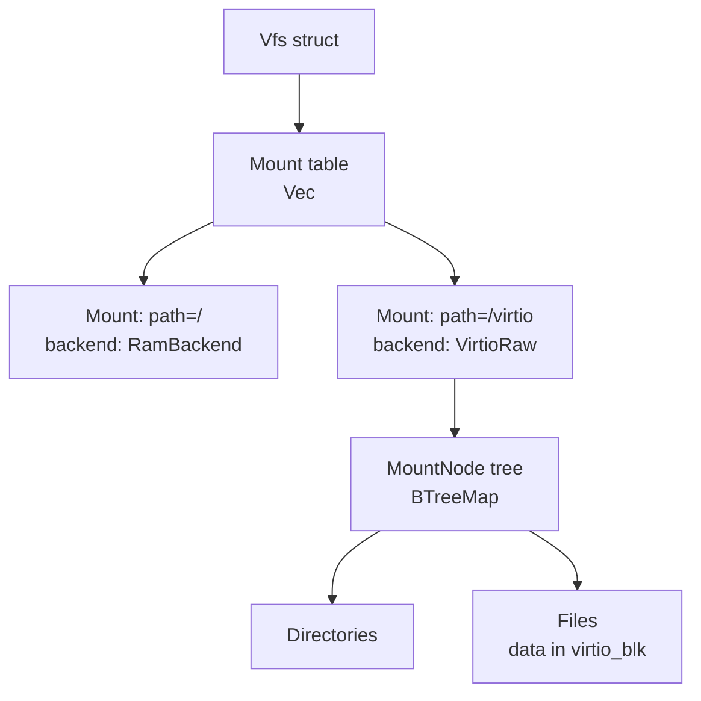

# `kernel/src/fs` — Filesystem and Storage Stack

The `fs` module is the full vertical storage stack for Oreulius. It contains everything from raw block I/O against physical and virtual hardware up through a capability-gated virtual filesystem with POSIX-like directory semantics, inode persistence, filesystem watching with IPC notification channels, and a high-level RAM-backed key-value store with thermal profiling. Sitting alongside the storage path is the x86 32-bit virtual memory management system, which is housed here because address-space management and block I/O are tightly coupled at the paging and mmap layers.

---

## Table of Contents

1. [Module File Map](#module-file-map)
2. [Layered Architecture](#layered-architecture)
3. [Block Device Drivers](#block-device-drivers)
   - [ATA / IDE (`ata.rs`, `disk.rs`)](#ata--ide-atars-diskrs)
   - [NVMe (`nvme.rs`)](#nvme-nvmers)
   - [VirtIO-blk (`virtio_blk.rs`)](#virtio-blk-virtio_blkrs)
4. [RAM-Backed Key-Value Filesystem (`mod.rs`)](#ram-backed-key-value-filesystem-modrs)
5. [Virtual Filesystem — VFS (`vfs.rs`)](#virtual-filesystem--vfs-vfsrs)
6. [Paging and Virtual Memory (`paging.rs`)](#paging-and-virtual-memory-pagingrs)
7. [VFS Platform Abstraction (`vfs_platform.rs`)](#vfs-platform-abstraction-vfs_platformrs)
8. [Capability and Rights Model](#capability-and-rights-model)
9. [Filesystem Watching and IPC Notification](#filesystem-watching-and-ipc-notification)
10. [Temporal Persistence](#temporal-persistence)
11. [Diagnostics and Health](#diagnostics-and-health)

---

## Module File Map

| File | Lines | Role |
|---|---|---|
| `mod.rs` | 1659 | RAM-backed key-value store, `FilesystemService`, capability types, public shims |
| `vfs.rs` | 5519 | Virtual filesystem: inodes, directories, mounts, watches, FD table, POSIX ops |
| `paging.rs` | 1515 | x86 32-bit page tables, `AddressSpace`, CoW fork, page fault dispatch |
| `virtio_blk.rs` | 823 | VirtIO-blk PCI/MMIO driver, virtqueue ring, MBR/GPT partition table |
| `ata.rs` | 881 | ATA/IDE PIO driver, LBA28/LBA48, IDENTIFY, dual-channel controller |
| `nvme.rs` | 759 | NVMe PCIe driver, admin queues, IO queues, PRP transfer lists |
| `vfs_platform.rs` | 124 | Platform abstraction: PID/FD management, tick source, temporal record |
| `disk.rs` | 41 | IRQ 14/15 shims delegating to `ata::on_primary_irq` / `on_secondary_irq` |

---

## Layered Architecture

```
┌──────────────────────────────────────────────────────────────┐
│  User / Kernel Process API                                   │
│  vfs::open_for_pid  vfs::read_fd  vfs::mkdir  vfs::watch    │
├──────────────────────────────────────────────────────────────┤
│  Virtual Filesystem (vfs.rs)                                 │
│  inodes · directories · symlinks · mounts · FD table        │
│  capability-gated access · inode journal · fsck              │
├────────────────┬─────────────────────────────────────────────┤
│  RAM-KV Store  │  VirtIO mount backend (virtio_blk ↔ FAT)   │
│  (mod.rs)      │  MountState::VirtioRaw                      │
├────────────────┴─────────────────────────────────────────────┤
│  Block Device Drivers                                        │
│  virtio_blk.rs │ nvme.rs │ ata.rs                           │
├──────────────────────────────────────────────────────────────┤
│  Virtual Memory — paging.rs                                  │
│  PageDirectory · AddressSpace · CoW · page fault handler     │
└──────────────────────────────────────────────────────────────┘
```

---

## Block Device Drivers

### ATA / IDE (`ata.rs`, `disk.rs`)

The ATA driver implements the classic IDE PIO protocol against the two legacy x86 IDE channels (0x1F0 primary, 0x170 secondary), each with a master and slave position. This driver is the lowest-level block I/O path for physical machines and QEMU `-hda` style disks.

#### Port Map

| Register | Offset from IO Base | Description |
|---|---|---|
| `REG_DATA` | 0x00 | 16-bit data register |
| `REG_ERROR` | 0x01 | Error register (read) |
| `REG_SECTOR_COUNT` | 0x02 | Sector count |
| `REG_LBA_LO` | 0x03 | LBA bits [7:0] |
| `REG_LBA_MID` | 0x04 | LBA bits [15:8] |
| `REG_LBA_HI` | 0x05 | LBA bits [23:16] |
| `REG_DRIVE_HEAD` | 0x06 | Drive/head register |
| `REG_COMMAND` | 0x07 | Command (write) / Status (read) |
| `REG_ALT_STATUS` | ctrl+0x00 | Alternate status (no interrupt clear) |
| `REG_DEV_CONTROL` | ctrl+0x00 | Device control (SRST bit) |

Channel addresses:

| Channel | IO Base | Ctrl Base | IRQ |
|---|---|---|---|
| Primary | `0x1F0` | `0x3F6` | 14 |
| Secondary | `0x170` | `0x376` | 15 |

#### IDENTIFY Flow

```
select drive (master/slave) → 400 ns delay (read alt_status ×4)
→ clear sector_count/LBA registers
→ write CMD_IDENTIFY (0xEC)
→ check status ≠ 0 (drive present test)
→ wait BSY clear
→ detect ATAPI signature (LBA_MID=0x14, LBA_HI=0xEB)
→ if ATAPI: CMD_IDENTIFY_PACKET (0xA1)
→ wait DRQ
→ read 256 × 16-bit words from data port
→ parse:
    words 27–46: model string (byte-swapped per ATA spec)
    word  49:    LBA support (bit 9), DMA support (bit 8)
    words 60–61: LBA28 sector count
    word  83:    LBA48 support (bit 10)
    words 100–103: LBA48 sector count
    words 106/117–118: logical sector size (if bit 12 of w106 set)
```

#### LBA28 vs LBA48 Dispatch

```
read_sectors(lba, count, buf):
    if lba48_sectors > 0 AND lba >= 2^28:
        → read_lba48  (max 65536 sectors/command, 48-bit LBA)
    else:
        → read_lba28  (max 256 sectors/command, 28-bit LBA + head nibble)
```

**LBA28 capacity ceiling:**

$$C_{28} = 2^{28} \times 512 \text{ B} = 128 \text{ GiB}$$

**LBA48 capacity ceiling:**

$$C_{48} = 2^{48} \times 512 \text{ B} = 128 \text{ PiB}$$

#### `AtaIdentity`

| Field | Type | Description |
|---|---|---|
| `is_atapi` | `bool` | CD/DVD ATAPI device |
| `model` | `[u8; 40]` | Model string, byte-swapped, null-padded |
| `lba28_sectors` | `u32` | Total LBA28 sectors |
| `lba48_sectors` | `u64` | Total LBA48 sectors (0 if not supported) |
| `lba_supported` | `bool` | LBA addressing available |
| `dma_supported` | `bool` | DMA mode available |
| `logical_sector_size` | `u32` | Usually 512; can be 4096 for 4Kn drives |

`total_sectors()` prefers LBA48 if non-zero. `capacity_bytes()` returns `total_sectors() * logical_sector_size`.

#### `AtaError` Variants

| Variant | Cause |
|---|---|
| `NoDrive` | `present == false` |
| `NoLbaSupport` | LBA not supported by drive |
| `BufferTooSmall` | `buf.len() < count * SECTOR_SIZE` |
| `OutOfRange` | `lba + count > total_sectors()` |
| `DeviceError(u8)` | Drive-reported error; byte is the error register |
| `NotInitialised` | Channel `init()` not yet called |

#### Global Singletons and Health

```rust
static PRIMARY:   Mutex<AtaController>  // 0x1F0 channel
static SECONDARY: Mutex<AtaController>  // 0x170 channel

pub fn init()               // soft-reset + IDENTIFY both channels
pub fn primary()            // → MutexGuard<AtaController>
pub fn secondary()          // → MutexGuard<AtaController>
pub fn health() -> AtaHealth
```

`AtaHealth` snapshot: `primary_irqs`, `secondary_irqs`, master/slave present flags for both channels.

#### IRQ Shim (`disk.rs`)

`disk::handle_primary_irq()` and `disk::handle_secondary_irq()` delegate to `ata::on_primary_irq()` / `ata::on_secondary_irq()`, which increment `ATA_PRIMARY_IRQS` / `ATA_SECONDARY_IRQS` atomics with `Relaxed` ordering.

#### PCI Storage Enumeration

`ata::detect_storage_devices(pci_devices)` scans a PCI device slice and categorises all `CLASS_STORAGE = 0x01` devices:

| Subclass | `StorageKind` | Description |
|---|---|---|
| `0x01` | `Ide` | IDE controller |
| `0x05` | `Ata` | ATA controller |
| `0x06` | `Sata` | SATA / AHCI controller |
| `0x07` | `Sas` | Serial Attached SCSI |
| `0x08` | `Nvme` | NVM Express |

---

### NVMe (`nvme.rs`)

The NVMe driver implements the NVM Express specification against a PCIe MMIO BAR. It allocates one Admin queue pair and one IO queue pair, uses Physical Region Page (PRP) lists for transfers above one page, and supports the full set of IO commands plus the IDENTIFY admin command.

#### Queue Configuration

| Parameter | Value | Description |
|---|---|---|
| `NVME_ADMIN_QUEUE_DEPTH` | 64 | Admin SQ/CQ entries |
| `NVME_IO_QUEUE_DEPTH` | 256 | IO SQ/CQ entries |
| `NVME_SQE_SIZE` | 64 bytes | Submission Queue Entry |
| `NVME_CQE_SIZE` | 16 bytes | Completion Queue Entry |
| `NVME_MAX_TRANSFER` | 128 KiB | Maximum single transfer |
| `NVME_PAGE_SIZE` | 4096 bytes | Memory page size |
| `NVME_MAX_PRP_ENTRIES` | 32 | PRP list entries (128 KiB / 4096) |

#### Controller Configuration Register (CC)

| Field | Setting | Meaning |
|---|---|---|
| `CC_CSS` | `0 << 4` | NVM Command Set |
| `CC_MPS` | `0 << 7` | Memory Page Size = 4096 (MPS field = 0 → $2^{12+0}$) |
| `CC_AMS` | `0 << 11` | Round-Robin arbitration |
| `CC_IOSQES` | `6 << 16` | IO SQ Entry Size = $2^6 = 64$ bytes |
| `CC_IOCQES` | `4 << 20` | IO CQ Entry Size = $2^4 = 16$ bytes |

#### `NvmeSqe` — 64-byte Submission Queue Entry

| Field | Bytes | Description |
|---|---|---|
| `cdw0` | 4 | `[3:0]` OPC, `[15:14]` FUSE, `[31:16]` CID |
| `nsid` | 4 | Namespace ID |
| `cdw2`, `cdw3` | 4+4 | Reserved / command-specific |
| `mptr` | 8 | Metadata pointer |
| `prp1` | 8 | First data buffer page (physical address) |
| `prp2` | 8 | Second page if transfer ≤ 2 pages; PRP list pointer if larger |
| `cdw10`–`cdw15` | 6×4 | Command-specific dwords |

#### `NvmeCqe` — 16-byte Completion Queue Entry

| Field | Bits | Description |
|---|---|---|
| `dw0` | 32 | Command-specific result |
| `dw1` | 32 | Reserved |
| `sq_hd` | 16 | SQ head pointer (advance sender's knowledge of consumed entries) |
| `sq_id` | 16 | SQ identifier |
| `cid` | 16 | Command identifier (matches SQE `cdw0[31:16]`) |
| `phase_status` | 16 | bit 0 = Phase Tag; bits 15:1 = Status Field |

The Phase Tag is the mechanism by which the driver knows a CQE is newly posted without clearing the entry. On queue wrap, the expected phase bit flips.

#### Admin Opcode Table

| Opcode | Constant | Function |
|---|---|---|
| `0x00` | `NVME_ADMIN_DELETE_IO_SQ` | Delete IO Submission Queue |
| `0x01` | `NVME_ADMIN_CREATE_IO_SQ` | Create IO Submission Queue |
| `0x04` | `NVME_ADMIN_DELETE_IO_CQ` | Delete IO Completion Queue |
| `0x05` | `NVME_ADMIN_CREATE_IO_CQ` | Create IO Completion Queue |
| `0x06` | `NVME_ADMIN_IDENTIFY` | Identify (controller or namespace) |
| `0x08` | `NVME_ADMIN_ABORT` | Abort command |
| `0x09` | `NVME_ADMIN_SET_FEATURES` | Set Features |
| `0x0A` | `NVME_ADMIN_GET_FEATURES` | Get Features |

#### IO Opcode Table

| Opcode | Constant | Function |
|---|---|---|
| `0x00` | `NVME_CMD_FLUSH` | Flush (write-back cache to persistent media) |
| `0x01` | `NVME_CMD_WRITE` | Write sectors |
| `0x02` | `NVME_CMD_READ` | Read sectors |

#### Initialisation Sequence

```
1. Locate NVMe device in PCI scan (class=0x01, subclass=0x08, vendor=any)
2. Read BAR0 → mmio_base (MMIO register space)
3. Disable controller (CC.EN=0), wait CSTS.RDY=0 (up to 100K polls, yield)
4. Allocate static Admin SQ (64 × 64 B) and Admin CQ (64 × 16 B)
5. Write AQA, ASQ, ACQ registers
6. Set CC: CSS=NVM, MPS=4K, AMS=RR, IOSQES=6, IOCQES=4; EN=1
7. Wait CSTS.RDY=1
8. Admin command: IDENTIFY (CNS=1) → controller info
9. Admin command: IDENTIFY (CNS=0, NSID=1) → namespace block count + block size
10. Admin command: CREATE_IO_CQ for IO queue
11. Admin command: CREATE_IO_SQ for IO queue
12. Doorbell calibration: read CAP.DSTRD (doorbell stride)
```

#### `NvmeController` Public API

| Method | Description |
|---|---|
| `new(mmio_base, pci)` | Construct uninitialised controller |
| `init()` | Run full init sequence; returns `bool` (success) |
| `read_sectors(lba, count, buf)` | PRP-based read; returns `bool` |
| `write_sectors(lba, count, buf)` | PRP-based write; returns `bool` |
| `flush()` | Issue FLUSH command; returns `bool` |
| `block_size()` | → `u64` (from IDENTIFY namespace) |
| `num_blocks()` | → `u64` (from IDENTIFY namespace) |

Global access: `NVME: Mutex<Option<NvmeController>>`, `nvme::init(pci_devices)`, `nvme::read_sectors`, `nvme::write_sectors`.

---

### VirtIO-blk (`virtio_blk.rs`)

The VirtIO block driver implements the VirtIO 1.0 legacy PCI protocol against QEMU's `-drive if=virtio` device (`vendor=0x1AF4`, `device_id=0x1001` legacy / `0x1042` modern). It uses a split virtqueue with descriptor ring, available ring, and used ring, plus a write-through block cache.

#### Virtqueue Ring Structures

```
VirtqDesc[N]:   addr(u64), len(u32), flags(u16: NEXT=1, WRITE=2), next(u16)
VirtqAvail:     flags(u16), idx(u16), ring[N](u16), used_event(u16)
VirtqUsed:      flags(u16), idx(u16), ring[N] { id(u32), len(u32) }, avail_event(u16)
```

Each IO transaction chains three descriptors:
1. `VirtioBlkReq` header (type=IN/OUT, sector=lba) → NEXT
2. Data buffer → NEXT (+ WRITE flag for reads)
3. 1-byte status → WRITE

The driver posts the head descriptor index into `VirtqAvail.ring[]`, increments `avail.idx`, then notifies the device via `VIRTIO_PCI_QUEUE_NOTIFY`. It polls `VirtqUsed.idx` until the device increments it (synchronous PIO-equivalent).

#### VirtIO PCI Configuration Registers (I/O port)

| Register | Offset | Description |
|---|---|---|
| `VIRTIO_PCI_HOST_FEATURES` | `0x00` | Device feature bits |
| `VIRTIO_PCI_GUEST_FEATURES` | `0x04` | Driver-selected features |
| `VIRTIO_PCI_QUEUE_PFN` | `0x08` | Virtqueue physical page frame |
| `VIRTIO_PCI_QUEUE_SIZE` | `0x0C` | Queue size |
| `VIRTIO_PCI_QUEUE_SELECT` | `0x0E` | Select queue index |
| `VIRTIO_PCI_QUEUE_NOTIFY` | `0x10` | Doorbell |
| `VIRTIO_PCI_STATUS` | `0x12` | Device status byte |
| `VIRTIO_PCI_ISR` | `0x13` | ISR status |
| `VIRTIO_PCI_CONFIG` | `0x14` | Device-specific config |

Status byte bits: `ACKNOWLEDGE=1`, `DRIVER=2`, `DRIVER_OK=4`, `FAILED=0x80`.

#### Block Cache

`BlockCache` is a fixed-capacity write-through LRU cache of `BlockCacheEntry` items. On each `read_sector`, the cache is checked first. On `write_sector`, the write is passed through to the device immediately, then the cache is updated.

#### Partition Table Parsing

`virtio_blk::read_partitions(start, out_mbr, out_gpt)` reads sector 0 to check for MBR (`0x55AA` signature) and sector 1–33 for GPT (`"EFI PART"` signature at offset 0).

`MbrPartition`: `bootable`, `part_type`, `lba_start`, `sectors`.
`GptPartition`: `first_lba`, `last_lba`, `name: [u8; 36]` (UTF-16LE in spec; stored as raw bytes here).

#### MMIO Variant

The MMIO path (`init_mmio_active`, `read_sector`, `write_sector`, `read_sectors`, `write_sectors`) is used for the AArch64 virt machine profile where the virtio-blk device is mapped at a fixed MMIO address.

---

## RAM-Backed Key-Value Filesystem (`mod.rs`)

The `mod.rs` layer provides a flat, RAM-backed key-value store with capability-gated access, thermal file profiling, quota enforcement, and structured event logging. It is the persistent object store used by the kernel's internal services (telemetry, temporal log, VFS snapshot), independently of the POSIX-like VFS layer.

### `FileKey`

A `FileKey` is a UTF-8 path-like string of up to `FILE_KEY_MAX_LEN` bytes, with a packed 16-byte prefix representation for IPC capability matching.

```rust
pub struct FileKey { inner: String }

pub const IPC_KEY_PREFIX_BYTES: usize = 16;
pub const IPC_KEY_PREFIX_WORDS: usize = 4;  // 16 / size_of::<u32>()
```

`pack_prefix()` → `[u32; 4]` — encodes the first 16 bytes of the key path into four u32 words for embedding in IPC capability `extra[]` fields.
`unpack_prefix([u32; 4], len)` → `FileKey` — reconstructs the prefix from an IPC capability.

### `AccessTemperature` — Thermal File Profiling

| Variant | Meaning |
|---|---|
| `Hot` | `hot_score >= average_hot_score` |
| `Warm` | `hot_score > 0 AND hot_score < average_hot_score` |
| `Cold` | `hot_score == 0` (unaccessed) |

`hot_score` is incremented on every read and write. The storage thermal profile tracks aggregate hot/warm/cold distribution for capacity and caching decisions.

### `File` and `FileMetadata`

```rust
pub struct File {
    pub key:      FileKey,
    pub data:     Vec<u8>,
    pub metadata: FileMetadata,
}
pub struct FileMetadata {
    pub size:        usize,
    pub created:     u64,   // tick of creation
    pub modified:    u64,   // tick of last write
    pub accessed:    u64,   // tick of last read
    pub read_count:  u64,
    pub write_count: u64,
    pub hot_score:   u64,   // accumulated access weight
}
```

`File::write(data, tick)` replaces content and updates `size`, `modified`, `write_count`, `hot_score`.
`File::read(tick)` returns `&[u8]` and updates `accessed`, `read_count`, `hot_score`.

### `FilesystemRights`

Bitmask capability rights for the key-value layer:

| Constant | Bit | Meaning |
|---|---|---|
| `NONE` | `0` | No access |
| `READ` | `1 << 0` | Read file content |
| `WRITE` | `1 << 1` | Write file content |
| `DELETE` | `1 << 2` | Delete files |
| `LIST` | `1 << 3` | Enumerate keys under prefix |
| `ALL` | `0b1111` | Full access |

`attenuate(rights)` → produces a new `FilesystemRights` that is the bitwise AND of `self` and `rights` — rights can only be reduced, never amplified.

### `FilesystemCapability`

```rust
pub struct FilesystemCapability {
    pub cap_id:     u32,
    pub rights:     FilesystemRights,
    pub key_prefix: Option<FileKey>,
    pub quota:      Option<FilesystemQuota>,
}
```

`can_access(key)` — returns true if `key_prefix` is `None` (global) or if `key` starts with the prefix.
`attenuate(rights)` — reduces rights on a child capability.
`to_ipc_capability()` — serialises into a `crate::ipc::Capability` by packing `cap_id` in `cap_id`, `rights.bits` in `rights`, and `key_prefix` as packed prefix words in `extra[0..4]` with `object_id` = prefix byte length.
`from_ipc_capability(cap)` — deserialises, verifying MAC via `cap.verify()`.

### `FilesystemQuota`

```rust
pub struct FilesystemQuota {
    pub max_total_bytes:       Option<usize>,
    pub max_file_count:        Option<usize>,
    pub max_single_file_bytes: Option<usize>,
}
```

`unlimited()` — all fields `None`. `bounded(total, count, single)` — fully specified.

### `FilesystemService`

`FilesystemService` is a `Mutex`-protected singleton wrapping a `RamStorage` backend. It implements the full request handler loop with capability checking, quota enforcement, and event log.

#### Public Methods

| Method | Description |
|---|---|
| `new()` | Construct with default retention policy |
| `handle_read(&key, &cap)` → `Response` | Capability-checked read |
| `handle_write(&key, &cap, data)` → `Response` | Cap-checked write; quota enforcement |
| `handle_delete(&key, &cap)` → `Response` | Cap-checked delete |
| `handle_list(&cap)` → `Response` | List keys under capability's prefix |
| `handle_request(request)` → `Response` | Dispatch by `RequestType` |
| `create_capability(cap_id, rights)` → `FilesystemCapability` | New global-scope capability |
| `create_capability_with_quota(...)` → `FilesystemCapability` | With quota limits |
| `root_capability()` → `FilesystemCapability` | Full-access capability (`cap_id=0`) |
| `stats()` → `(file_count, total_bytes)` | Aggregate size |
| `metrics()` → `FilesystemMetrics` | Full operational counters |
| `health()` → `FilesystemHealth` | Thermal distribution + metrics |
| `recent_events(limit)` → `Vec<FilesystemEvent>` | Event log tail |
| `scrub_and_repair()` → `FilesystemScrubReport` | Integrity check and repair |
| `retention_policy()`, `set_retention_policy(policy)` | Event log retention control |

`filesystem()` → `&'static FilesystemService` — global singleton accessor.

#### Module-Level Shims

```rust
pub fn init()
pub fn open(path: &str)                  -> Result<usize, &'static str>
pub fn read(fd: usize, buf: &mut [u8])  -> Result<usize, &'static str>
pub fn write(fd: usize, data: &[u8])    -> Result<usize, &'static str>
pub fn close(fd: usize)                 -> Result<(), &'static str>
pub fn delete(path: &str)               -> Result<(), &'static str>
pub fn list_dir(path: &str, buf: &mut [u8]) -> Result<usize, &'static str>
```

Kernel internal helpers (bypass capability checks):
```rust
pub fn kernel_read_bytes(key: &FileKey)             -> Option<Vec<u8>>
pub fn kernel_write_bytes(key: &FileKey, data: &[u8])
pub fn kernel_delete(key: &FileKey)
pub fn kernel_read_static(key: &FileKey)            -> &'static [u8]
```

---

## Virtual Filesystem — VFS (`vfs.rs`)

The VFS is a full POSIX-patterned inode-based virtual filesystem with directory trees, hard links, symbolic links, multiple mount backends, an open file descriptor table, inode journalling with `fsck`, and a capability-gated namespace model.

### Inode Model

```rust
pub type InodeId = u64;
pub const MAX_NAME_LEN: usize = 64;
```

#### `InodeMetadata`

| Field | Type | POSIX Analogue |
|---|---|---|
| `size` | `u64` | `st_size` |
| `mode` | `u16` | `st_mode` |
| `uid` | `u32` | `st_uid` |
| `gid` | `u32` | `st_gid` |
| `atime` | `u64` | `st_atime` |
| `mtime` | `u64` | `st_mtime` |
| `ctime` | `u64` | `st_ctime` |
| `nlink` | `u32` | `st_nlink` |
| `direct_blocks` | `[u32; 12]` | Direct block pointers |
| `indirect_block` | `u32` | Single-indirect pointer |
| `double_indirect_block` | `u32` | Double-indirect pointer |
| `triple_indirect_block` | `u32` | Triple-indirect pointer |

The block pointer model mirrors the classic Unix FFS layout. For purely in-memory files the block pointers are unused — the inode stores data in a `Vec<u8>` in the `RamStorage` backend. Block pointers become relevant when the VirtIO mount backend is active.

#### `InodeKind`

| Variant | Meaning |
|---|---|
| `File` | Regular file |
| `Directory` | Directory node |
| `Symlink` | Symbolic link target string |

### Mount System



The VFS maintains a list of `Mount` objects, each bound to a path prefix and implementing the `MountedBackendContract` trait:

| Method | Description |
|---|---|
| `open_kind(subpath)` | Determine if path is file/directory |
| `read(subpath, offset, out)` | Read bytes from subpath |
| `write(subpath, offset, data)` | Write bytes |
| `write_at(subpath, offset, data)` | Write at specific offset |
| `mkdir(subpath)` | Create directory |
| `create_file(subpath)` | Create file |
| `unlink(subpath)` | Delete file |
| `rmdir(subpath)` | Remove directory |
| `rename(old, new)` | Rename |
| `link(existing, new)` | Hard link |
| `symlink(target, link_path)` | Create symlink |
| `readlink(subpath)` | Read symlink target |
| `list(subpath, out)` | List directory entries |
| `path_size(subpath)` | Get file size |

**Mount backend variants:**
- `MountBackend::Ram` — in-process `VecDeque`-backed in-memory tree (persisted via VFS snapshot)
- `MountBackend::VirtioRaw` — reads/writes delegated to `virtio_blk::read_sectors` / `write_sectors`

### Persistence

```rust
const VFS_PERSIST_MAGIC:   u32 = 0x4F_56_46_53; // "OVFS"
const VFS_PERSIST_VERSION: u16 = 3;
const VFS_SNAPSHOT_KEY:    &str = "system/vfs/snapshot.bin";
const VFS_JOURNAL_KEY:     &str = "system/vfs/journal.log";
```

On every mutating operation (`mkdir`, `create_file`, `write_path`, `unlink`, `rename`, `link`, `symlink`), the VFS appends a journal entry to `VFS_JOURNAL_KEY` in the RAM-KV store. On `recover_from_persistence()`, the snapshot is loaded and the journal is replayed. The `fsck_and_repair()` function performs a full forward pass over the inode table, repairing dangling directory entries, relinking orphaned inodes, correcting `nlink` counters, and creating `/lost+found` if any orphans were found.

### `VfsPolicy`

```rust
pub struct VfsPolicy {
    pub max_mem_file_size: Option<usize>,
}

impl VfsPolicy {
    pub const fn unbounded() -> Self          // max_mem_file_size: None
    pub const fn bounded(max: usize) -> Self  // max_mem_file_size: Some(max)
    pub fn runtime_default() -> Self          // set from platform config
}
```

### `OpenFlags` Bitflags

```rust
pub struct OpenFlags: u32 {
    const READ     = 1 << 0;
    const WRITE    = 1 << 1;
    const CREATE   = 1 << 2;
    const TRUNCATE = 1 << 3;
    const APPEND   = 1 << 4;
    // ...
}
```

### File Descriptor API

```rust
pub fn open_for_pid(pid: Pid, path: &str, flags: OpenFlags) -> Result<usize, &'static str>
pub fn read_fd(pid: Pid, fd: usize, out: &mut [u8])         -> Result<usize, &'static str>
pub fn write_fd(pid: Pid, fd: usize, data: &[u8])           -> Result<usize, &'static str>
pub fn close_fd(pid: Pid, fd: usize)                        -> Result<(), &'static str>
```

Each FD is a `Handle` tuple `(inode_id, position, flags)`. The per-process FD table is managed by `vfs_platform::alloc_fd` / `get_fd_handle` / `close_fd`.

### Full POSIX-like Path API

| Function | Signature | Description |
|---|---|---|
| `mkdir` | `(path) → Ok / Err` | Create directory (mkdir -p style for missing parents) |
| `create_file` | `(path) → Ok(InodeId) / Err` | Create regular file |
| `write_path` | `(path, data) → Ok(usize) / Err` | Write to file (creates if absent); tracked |
| `write_path_untracked` | `(path, data) → Ok(usize) / Err` | Write without journal entry |
| `read_path` | `(path, out) → Ok(usize) / Err` | Read file into buffer |
| `list_dir` | `(path, out) → Ok(usize) / Err` | Serialise directory entries |
| `path_size` | `(path) → Ok(usize) / Err` | File size in bytes |
| `unlink` | `(path) → Ok / Err` | Delete file (decrements `nlink`) |
| `rmdir` | `(path) → Ok / Err` | Remove empty directory |
| `rename` | `(old, new) → Ok / Err` | Rename or move |
| `link` | `(existing, new) → Ok / Err` | Hard link (increments `nlink`) |
| `symlink` | `(target, link_path) → Ok / Err` | Symbolic link |
| `readlink` | `(path) → Ok(String) / Err` | Resolve symlink target |
| `mount_virtio` | `(path) → Ok / Err` | Mount VirtIO-blk at path |

### `VfsFsckReport`

| Field | Description |
|---|---|
| `inodes_scanned` | Total inodes inspected |
| `dangling_entries_removed` | Directory entries pointing to absent inodes |
| `orphaned_inodes_relinked` | Inodes with no parent — moved to `/lost+found` |
| `nlink_repairs` | `nlink` counter corrections |
| `size_repairs` | `size` field corrections |
| `lost_found_created` | Whether `/lost+found` was created during repair |

### `VfsHealth`

| Field | Description |
|---|---|
| `total_inode_slots` | Inode table capacity |
| `live_inodes` | Allocated inodes |
| `file_count`, `directory_count`, `symlink_count` | By type |
| `total_bytes` | Sum of all file sizes |
| `open_handles` | Currently open FDs across all processes |
| `mount_count` | Registered mounts |
| `orphaned_inodes` | Inodes with `nlink == 0` (not yet reaped) |
| `max_mem_file_size` | Policy limit |
| `mount_health` | Per-mount `MountHealth` slice |

---

## Paging and Virtual Memory (`paging.rs`)

The paging module implements x86 32-bit (i686 compat) two-level page table management. The kernel lives in the upper 1 GiB (`KERNEL_BASE = 0xC000_0000`), and user space occupies the lower 3 GiB.

### Constants

| Constant | Value | Description |
|---|---|---|
| `PAGE_SIZE` | `4096` | Page size in bytes |
| `KERNEL_BASE` | `0xC000_0000` | Kernel base virtual address |
| `USER_TOP` | `0xC000_0000` | Top of user address space |
| `PAGE_ENTRIES` | `1024` | Entries per page directory / page table |

### `PageFlags` Bitflags

| Bit | Name | Meaning |
|---|---|---|
| 0 | `PRESENT` | Page is present |
| 1 | `WRITABLE` | Page is writable |
| 2 | `USER_ACCESSIBLE` | Ring 3 access allowed |
| 3 | `WRITE_THROUGH` | Write-through caching |
| 4 | `CACHE_DISABLE` | Caching disabled |
| 5 | `ACCESSED` | CPU sets on access |
| 6 | `DIRTY` | CPU sets on write |
| 9 | `COPY_ON_WRITE` | Oreulius-defined software CoW bit (bit 9 = OS-available) |

### `PageDirEntry` and `PageTableEntry`

Both are `u32` newtype wrappers over physical addresses plus flag bits:

```
PageDirEntry(u32):
  bits[31:12] = physical address of PageTable (4K-aligned)
  bits[11:0]  = flags (PRESENT, WRITABLE, USER_ACCESSIBLE, ...)

PageTableEntry(u32):
  bits[31:12] = physical frame address (4K-aligned)
  bits[11:0]  = flags (PRESENT, WRITABLE, USER_ACCESSIBLE, DIRTY, ACCESSED, COW, ...)
```

### `AddressSpace`

`AddressSpace` owns exactly one `PageDirectory` (1024 × `PageDirEntry`) allocated at a 4K-aligned physical address.

#### Construction Variants

| Constructor | Description |
|---|---|
| `new()` | Full kernel-mapped space: identity maps all physical RAM; maps kernel `.text`/`.rodata` as R/X, `.data`/`.bss` as R/W |
| `new_user_minimal()` | Minimal user space with only kernel mapping inherited; user pages to be added via `map_page` |
| `new_jit_sandbox()` | JIT-specific space: user + kernel, with a mapped executable region for JIT output |

#### `clone_cow()` — Copy-on-Write Fork

```rust
pub fn clone_cow(&mut self) -> Result<AddressSpace, &'static str>
```

Clones the address space for process forking:
1. Allocates a new `AddressSpace`.
2. For every present user-space `PageTableEntry`, marks the page `COPY_ON_WRITE` in both the parent and the child — the page becomes read-only.
3. On the next write to a CoW page, `handle_cow_fault` allocates a fresh page, copies the contents, and makes the new page writable in the faulting process's address space.

**Invariant:** After `clone_cow`, the parent and child share physical pages for all user mappings. Neither can write without triggering a fault. The first writer gets an exclusive copy; the other retains the original.

#### Key Methods

| Method | Description |
|---|---|
| `map_page(virt, phys, flags)` | Install a single PTE; allocates PageTable if absent |
| `unmap_page(virt)` | Clear PTE, flush TLB entry |
| `mark_copy_on_write(virt)` | Set `COW` bit, clear `WRITABLE` |
| `handle_cow_fault(virt)` | Allocate fresh page, `copy_physical_page`, remap writable |
| `map_mmio_range(phys, size)` | Map MMIO range with `CACHE_DISABLE` set |
| `map_user_range_phys(virt, phys, size, flags)` | Bulk user-space mapping |
| `virt_to_phys(virt)` | Walk page tables → physical address |
| `is_mapped(virt)` | Test if a virtual address has a present PTE |
| `activate()` | Write `phys_addr()` to `CR3` (flush TLB) |
| `flush_tlb_all()` | Write/read `CR3` to flush all TLB entries |

#### `PageFaultError`

| Field | Source | Meaning |
|---|---|---|
| `present` | Error code bit 0 | 0 = not present, 1 = protection violation |
| `write` | bit 1 | 0 = read fault, 1 = write fault |
| `user` | bit 2 | 0 = kernel-mode fault, 1 = user-mode fault |
| `reserved` | bit 3 | Reserved PTE bit was set |
| `instruction` | bit 4 | Instruction fetch fault (NX) |

#### Page Fault Dispatch

```rust
pub extern "C" fn rust_page_fault_handler(error_code: u32, fault_addr: usize)
pub extern "C" fn rust_page_fault_handler_ex(error_code: u32, fault_addr: usize, ...)
```

The fault handler:
1. Parses `error_code` via `PageFaultError::from_code`.
2. If `write && !present` at a CoW page → `handle_cow_fault` → resume.
3. If `present && write` at a CoW page → `handle_cow_fault` → resume.
4. Otherwise → kernel panic with full fault details.

`PagingStats`: `page_faults` (total), `cow_faults` (CoW resolved), `page_copies` (physical page copy operations).

#### Global Kernel Address Space

```rust
pub static KERNEL_ADDRESS_SPACE: Mutex<Option<AddressSpace>> = Mutex::new(None);

pub fn init() -> Result<(), &'static str>     // init KERNEL_ADDRESS_SPACE
pub fn kernel_space() -> &'static Mutex<Option<AddressSpace>>
pub fn kernel_page_directory_addr() -> Option<u32>
pub fn get_paging_stats() -> PagingStats
```

---

## VFS Platform Abstraction (`vfs_platform.rs`)

This thin module decouples `vfs.rs` from kernel internals, enabling the VFS (a 5500-line module) to compile without direct dependencies on the process manager or scheduler.

| Function | Description |
|---|---|
| `current_pid() -> Option<Pid>` | Get the PID of the currently running process |
| `pid_from_raw(u32) -> Pid` | Convert a raw u32 to a PID |
| `pid_to_raw(Pid) -> u32` | Convert PID to raw u32 |
| `alloc_fd(pid, handle_id) -> Result<usize, ...>` | Allocate next available FD for `pid`, mapping to `handle_id` |
| `get_fd_handle(pid, fd) -> Result<u64, ...>` | Retrieve handle ID for an open FD |
| `close_fd(pid, fd) -> Result<...>` | Close and deallocate an FD |
| `spawn_process(parent_pid) -> Result<Pid, ...>` | Create a new process (for VFS-side privilege spawning) |
| `destroy_process(pid) -> Result<...>` | Tear down a process (called during `purge_channels_for_process`) |
| `process_fd_stats() -> (open_fds, max_fds, current_pid)` | Telemetry |
| `ticks_now() -> u64` | Monotonic tick counter (varies by platform target) |
| `temporal_record_write(path, payload) -> Result<u64, ...>` | Append temporal log entry |
| `temporal_record_object_write(path, payload) -> Result<u64, ...>` | Append typed temporal object entry |

---

## Capability and Rights Model

The `fs` module implements a two-level capability model that mirrors the IPC capability system.

### RAM-KV Layer (`FilesystemCapability`)

Every operation on `FilesystemService` requires a `FilesystemCapability`:

```
FilesystemCapability
  ├── cap_id: u32                    unique identifier
  ├── rights: FilesystemRights       bitmask: READ, WRITE, DELETE, LIST
  ├── key_prefix: Option<FileKey>    namespace scope (None = global)
  └── quota: Option<FilesystemQuota> per-capability resource limit
```

Capabilities are attenuated (never amplified):

```rust
cap.attenuate(FilesystemRights::read_only())
// → new cap with rights = cap.rights & READ; same prefix and quota
```

Capabilities are serialisable to/from `ipc::Capability` via `to_ipc_capability()` / `from_ipc_capability()`, allowing filesystem capabilities to be passed over IPC channels with MAC protection.

### VFS Layer (`FilesystemCapability` for VFS)

The VFS capability model operates on paths:

```
set_directory_capability(path, cap)   // grant cap to all files under path
clear_directory_capability(path)      // revoke
set_process_capability(pid, cap)      // grant cap to a process
clear_process_capability(pid)         // revoke
inherit_process_capability(child, parent, attenuated_rights)
effective_capability_for_pid(pid, path) // compute effective rights
```

`effective_capability_for_pid` merges directory-scoped and process-scoped capabilities, applying the tightest quota and the intersection of rights — it is the VFS equivalent of the IPC admission pipeline.

---

## Filesystem Watching and IPC Notification

The VFS provides a filesystem event watch system with two delivery mechanisms: polling and IPC channel push.

### Watch API

```rust
pub fn watch(path: &str, recursive: bool) -> Result<u64, &'static str>
// Returns watch_id

pub fn unwatch(id: u64) -> bool

pub fn watches() -> Vec<VfsWatchInfo>
// VfsWatchInfo: { id: u64, path: String, recursive: bool }

pub fn notify(limit: usize) -> Vec<VfsWatchEvent>
// Poll for pending events (up to limit)
```

### `VfsWatchKind`

| Variant | Trigger |
|---|---|
| `Created` | File or directory created |
| `Deleted` | File or directory deleted |
| `Modified` | File content written |
| `Renamed` | File or directory renamed |
| `Mounted` | Filesystem mounted at path |
| `Unmounted` | Filesystem unmounted |
| `PermissionDenied` | Access denied by capability check |

### `VfsWatchEvent`

```rust
pub struct VfsWatchEvent {
    pub sequence:  u64,            // monotonic event sequence number
    pub watch_id:  u64,            // which watch triggered
    pub kind:      VfsWatchKind,   // what happened
    pub path:      String,         // which path
    pub detail:    Option<String>, // rename target, mount path, etc.
}
```

### IPC Push Notifications

Processes can subscribe an IPC channel to receive filesystem events:

```rust
pub fn subscribe_notify_channel(channel_id: ChannelId) -> Result<(), &'static str>
pub fn unsubscribe_notify_channel(channel_id: ChannelId) -> bool
pub fn notify_channels() -> Vec<ChannelId>
pub fn notify_subscribers() -> Vec<VfsWatchSubscriberInfo>
pub fn notify_channel_stats(channel_id: ChannelId) -> Option<VfsWatchSubscriberInfo>
pub fn ack_notify_channel(channel_id: ChannelId, up_to_sequence: u64) -> bool
```

`VfsWatchSubscriberInfo` tracks per-channel delivery state:

| Field | Description |
|---|---|
| `channel_id` | IPC channel receiving events |
| `pending_events` | Events queued for delivery |
| `in_flight` | Sequence number of the event currently in the IPC ring |
| `last_acked_sequence` | Last sequence number acked by subscriber |
| `dropped_count` | Events dropped due to backpressure (channel full) |

The kernel delivers events asynchronously: it calls `ack_notify_channel` when the subscriber confirms receipt, allowing the next batch to be delivered. This back-pressure model integrates directly with the IPC module's `BackpressureLevel` tracking.

---

## Temporal Persistence

The VFS and block layer both participate in the kernel's temporal persistence system. This enables replay of storage operations across reboots.

### VFS Temporal Backend Writes

On every VFS write to a VirtIO mount backend, `capture_temporal_backend_write(path, offset, data, written)` records a temporal payload:

| Constant | Value | Description |
|---|---|---|
| `TEMPORAL_DEVICE_ENCODING_V1` | `1` | First encoding version |
| `TEMPORAL_DEVICE_ENCODING_V2` | `2` | Extended encoding |
| `TEMPORAL_DEVICE_OBJECT_VIRTIO_RAW` | `1` | VirtIO raw block object |
| `TEMPORAL_DEVICE_EVENT_WRITE` | `1` | Write event |
| `TEMPORAL_DEVICE_FLAG_PARTIAL_CAPTURE` | `1 << 0` | Data was truncated |
| `TEMPORAL_DEVICE_CAPTURE_MAX_BYTES` | `240 × 1024` | Max captured bytes per event |

`temporal_try_apply_backend_payload(path, payload)` — on boot, replays a temporal write event back into the VFS backend.

### VFS Snapshot and Journal

```
system/vfs/snapshot.bin   — full point-in-time VFS serialisation
system/vfs/journal.log    — delta log of mutations since last snapshot
```

`recover_from_persistence()` loads the snapshot, replays the journal, and returns. The journal grows at most `VFS_JOURNAL_MAX_BYTES_MULTIPLIER × snapshot_size` bytes before a new snapshot is taken.

---

## Diagnostics and Health

### `FilesystemHealth` (RAM-KV layer)

```rust
pub struct FilesystemHealth {
    pub file_count:         usize,
    pub total_bytes:        usize,
    pub average_file_size:  usize,
    pub hottest_key:        Option<FileKey>,
    pub hottest_score:      u64,
    pub hot_files:          usize,
    pub warm_files:         usize,
    pub cold_files:         usize,
    pub hot_bytes:          usize,
    pub warm_bytes:         usize,
    pub cold_bytes:         usize,
    pub average_hot_score:  u64,
    pub total_operations:   u64,
    pub permission_denials: u64,
    pub quota_denials:      u64,
    pub not_found:          u64,
    pub event_log_len:      usize,
    pub event_log_capacity: Option<usize>,
    pub last_event:         Option<FilesystemEvent>,
    pub last_error:         Option<FilesystemEvent>,
}
```

### `FilesystemMetrics`

| Field | Type | Description |
|---|---|---|
| `quota_denials` | `u64` | Writes rejected by quota |
| `not_found` | `u64` | Reads/deletes of absent keys |
| `repairs` | `u64` | Self-heal corrections applied |
| `bytes_read` | `u64` | Total bytes read |
| `bytes_written` | `u64` | Total bytes written |
| `net_bytes_added` | `i64` | Live storage delta (can be negative) |
| `bytes_deleted` | `u64` | Bytes freed by deletes |
| `last_tick` | `u64` | Tick of last operation |

### `FilesystemScrubReport`

```rust
pub struct FilesystemScrubReport {
    pub files_scanned:    usize,
    pub issues_found:     usize,
    pub repaired_files:   usize,
    pub bytes_recounted:  usize,
}
```

`scrub_and_repair()` verifies that every `File.metadata.size` matches `File.data.len()` and resets mismatches. Repaired file count is reported.

### `MountHealth` (VFS layer)

| Field | Type | Description |
|---|---|---|
| `path` | `String` | Mount point path |
| `backend` | `&'static str` | Backend type name |
| `reads` | `u64` | Read operations |
| `writes` | `u64` | Write operations |
| `mutations` | `u64` | Directory-mutating operations |
| `errors` | `u64` | Failed operations |
| `last_error` | `Option<String>` | Most recent error message |

### `PagingStats`

```rust
pub struct PagingStats {
    pub page_faults: u32,   // total page faults handled
    pub cow_faults:  u32,   // CoW faults resolved without panic
    pub page_copies: u32,   // physical page copy-on-write operations
}
```
