# `kernel/src/ipc` — Inter-Process Communication

The IPC module is the **communication backbone** of Oreulius. It provides capability-gated, message-passing channels between processes with a formal causal event identity model, a multi-tier backpressure algebra, an affine linear capability constraint for endpoint delegation, a declarative admission control pipeline, a well-typed closure state machine, and explicit Temporal session typing on bound channels. Unlike monolithic shared-memory IPC designs, every primitive here is derived from a mathematical formalism: channels are bounded queues with proven capacity invariants, capabilities are affine tokens with zero-sum split semantics, message-carried capability transfer is ticketed and one-time, and backpressure levels are threshold functions over queue occupancy ratios.

---

## Table of Contents

1. [Architecture Overview](#architecture-overview)
2. [Module File Map](#module-file-map)
3. [Core Invariants and Capacity Constants](#core-invariants-and-capacity-constants)
4. [Causal Event Identity — Definition A.7](#causal-event-identity--definition-a7)
5. [Message Structure and Capability Transfer](#message-structure-and-capability-transfer)
6. [Channel Rights and Affine Endpoint Delegation](#channel-rights-and-affine-endpoint-delegation)
7. [Channel Lifecycle State Machine — Definition A.31](#channel-lifecycle-state-machine--definition-a31)
8. [Backpressure Algebra](#backpressure-algebra)
9. [Admission Control Pipeline](#admission-control-pipeline)
10. [Scheduler Integration — Blocking and Wakeup](#scheduler-integration--blocking-and-wakeup)
11. [IpcService — The Kernel-Facing Facade](#ipcservice--the-kernel-facing-facade)
12. [Channel Diagnostics](#channel-diagnostics)
13. [Temporal Persistence Protocol](#temporal-persistence-protocol)
14. [Self-Test Suite](#self-test-suite)
15. [Security Integration](#security-integration)
16. [Error Taxonomy](#error-taxonomy)
17. [Full Data Flow Walkthrough](#full-data-flow-walkthrough)
18. [Formal Properties and Proofs](#formal-properties-and-proofs)

---

## Architecture Overview

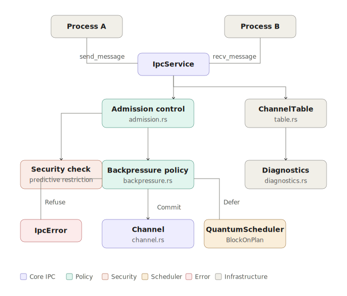
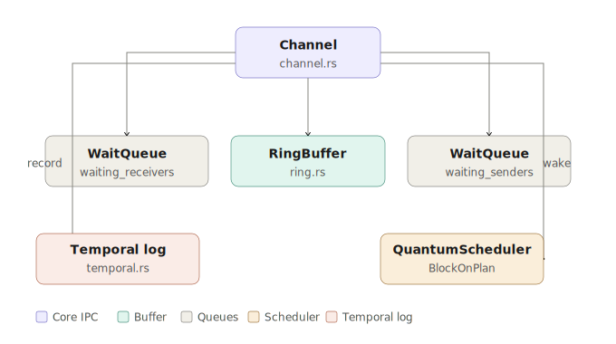


The IPC module is split into precisely-scoped layers:

- **Types layer** (`types.rs`, `message.rs`, `rights.rs`, `errors.rs`, `ring.rs`) — zero-allocation value types with no kernel dependencies.
- **Channel layer** (`channel.rs`) — the stateful channel object: ring buffer, closure protocol, wait queues, wakeup dispatch.
- **Policy layer** (`backpressure.rs`, `admission.rs`) — pure functions; no mutation. Only `observe_send_attempt` mutates (hit counters).
- **Table layer** (`table.rs`) — `BTreeMap`-backed registry of all live channels.
- **Service layer** (`service.rs`) — single-lock `IpcService` wrapping the table; `static Once` singleton; all public kernel API lives here.
- **Instrumentation** (`diagnostics.rs`, `selftest.rs`) — read-only snapshot structs plus 15-case in-kernel self-test.

---

## Module File Map

| File | Lines | Role |
|---|---|---|
| `mod.rs` | 325 | Module façade, public re-exports, wait-address computation |
| `types.rs` | 196 | `EventId`, `ChannelId`, `ProcessId`, `Capability`, `CapabilityType`, `TypedServiceArg` |
| `message.rs` | 118 | `Message`, `MSG_SEQ`, causal linkage constructors |
| `rights.rs` | 115 | `ChannelRights`, `ChannelCapability`, `AffineEndpoint<C>` |
| `errors.rs` | 48 | `IpcError` — full error taxonomy |
| `ring.rs` | 46 | `RingBuffer<CHANNEL_CAPACITY>` — fixed-size FIFO |
| `channel.rs` | 795 | `Channel`, `ClosureState`, `ChannelFlags`, `DrainResult` — full state machine |
| `backpressure.rs` | 243 | `BackpressureLevel`, `BackpressureAction`, `BackpressureSnapshot` — load algebra |
| `admission.rs` | 153 | `SendDecision`, `RecvDecision`, `IpcRefusal`, `IpcDefer` — admission pipeline |
| `table.rs` | 84 | `ChannelTable` — `BTreeMap`-backed channel registry |
| `service.rs` | 398 | `IpcService` — single mutex, all public API, temporal restore |
| `diagnostics.rs` | 99 | `ChannelDiagnostics`, `IpcDiagnostics` — read-only snapshots |
| `selftest.rs` | 678 | 15-case `IpcSelftestReport` test suite |

---

## Core Invariants and Capacity Constants

These constants define the capacity model on which the entire backpressure and admission algebra rests.

| Constant | Value | Formal Role |
|---|---|---|
| `CHANNEL_CAPACITY` | `4` | $C$ — the maximum queue depth per channel |
| `MAX_CHANNELS` | `16` | $N_{ch}$ — maximum live channels in the kernel |
| `MAX_MESSAGE_SIZE` | `512` bytes | $S_{max}$ — maximum payload per message |
| `MAX_CAPS_PER_MESSAGE` | `16` | $K_{max}$ — maximum capability tokens per message |
| `HIGH_PRESSURE_NUMERATOR` | `3` | Numerator of the high-pressure threshold ratio |
| `HIGH_PRESSURE_DENOMINATOR` | `4` | Denominator of the high-pressure threshold ratio |

### High-Pressure Threshold

**Definition (High-Pressure Threshold):** Given channel capacity $C$, the high-pressure threshold $\tau_{hp}$ is:

$$\tau_{hp} = \left\lfloor \frac{C \cdot H_N}{H_D} \right\rfloor \quad \text{where } H_N = 3,\; H_D = 4$$

For $C = 4$:

$$\tau_{hp} = \left\lfloor \frac{4 \cdot 3}{4} \right\rfloor = 3$$

The queue enters `High` pressure when $\text{pending} \geq \tau_{hp}$. It enters `Saturated` when $\text{pending} = C$ (full). The threshold is computed as a `const fn` and can never be zero (clamped to 1).

---

## Causal Event Identity — Definition A.7

Every message carries a globally unique 64-bit `EventId`, stamped atomically at message creation. This implements **causal vector clock stamping** for IPC auditing and replay reconstruction.

### Bit Layout

```
 63          32 31         16 15          0
 ┌─────────────┬─────────────┬────────────┐
 │  source PID │ channel_seq │  msg_seq   │
 │   (32 bits) │  (16 bits)  │ (16 bits)  │
 └─────────────┴─────────────┴────────────┘
```

**Formal construction:**

$$\text{EventId}(p, s_c, s_m) = (p \ll 32) \;|\; (s_c \ll 16) \;|\; s_m$$

where:
- $p$ = source `ProcessId.0` (u32)
- $s_c$ = channel-scoped sequence counter (u16, wraps at $2^{16}$)
- $s_m$ = per-process message sequence counter (u16, wraps at $2^{16}$)

**Decomposition is lossless:**

$$p = \text{EventId} \gg 32 \qquad s_c = (\text{EventId} \gg 16) \mathbin{\&} \texttt{0xFFFF} \qquad s_m = \text{EventId} \mathbin{\&} \texttt{0xFFFF}$$

The global `MSG_SEQ: AtomicU16` is incremented with `Ordering::Relaxed` at each `Message::new()` call. Relaxed ordering is sufficient because `EventId` uniqueness is guaranteed by the monotonic counter, not by inter-thread happens-before — full ordering of messages within a channel is enforced by the ring buffer FIFO discipline.

### Causal Linkage

Every `Message` also carries:

```rust
pub cause: Option<EventId>
```

When `Message::with_cause(source, cause)` is used, the message is **causally linked** to its predecessor. This enables construction of a causal DAG across process boundaries:

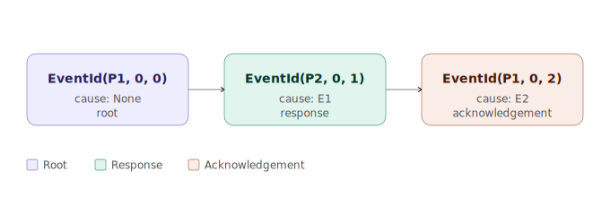

The audit subsystem uses the `cause` chain to reconstruct whether a sequence of IPC messages was causally coherent or whether an injection occurred mid-chain.

**Lemma (Causal Monotonicity):** Within a single process, `EventId` values are monotonically increasing in $s_m$ for the same PID. Because `MSG_SEQ` is a `u16` wrap-around counter and `Ordering::Relaxed` allows reordering across threads, the uniqueness guarantee holds only within a session epoch (between process creation and termination). Causal ordering across sessions is re-established by the temporal log.

---

## Message Structure and Capability Transfer

### `Message`

```
 ┌────────────────────────────────────────────────┐
 │ id: EventId (8 bytes)                          │
 │ cause: Option<EventId> (9 bytes: tag + 8)      │
 │ source: ProcessId (4 bytes)                    │
 │ payload_len: usize                             │
 │ payload: [u8; 512]                             │
 │ caps_len: usize                                │
 │ caps: [Option<Capability>; 16]                 │
 └────────────────────────────────────────────────┘
```

Total worst-case size: approximately $512 + 16 \times 48 + \text{overhead} \approx 1.3\,\text{KiB}$ per message. With `CHANNEL_CAPACITY = 4`, the maximum in-flight data per channel is approximately $5.2\,\text{KiB}$.

### Constructors

| Constructor | Description |
|---|---|
| `Message::new(source)` | Empty message; stamps `EventId`, no cause |
| `Message::with_data(source, data)` | Copies payload data; no cause |
| `Message::with_cause(source, cause)` | Empty payload; links to predecessor `EventId` |
| `Message::with_data_and_cause(source, data, cause)` | Full constructor: data + causal link |
| `msg.add_capability(&mut self, cap)` | Attaches capability; calls `cap.sign()` before insertion |

### Capability Token Signing

When a `Capability` is attached to a message via `Message::add_capability(cap)`, the capability is **signed before insertion**:

```rust
let mut signed = cap;
signed.sign();
```

The signing packs a 40-byte payload:

| Offset | Bytes | Content |
|---|---|---|
| 0 | 4 | `TOKEN_CONTEXT = 0x4F43_4150` ("OCAP") |
| 4 | 4 | `cap_id` |
| 8 | 4 | `object_id` |
| 12 | 4 | `rights` |
| 16 | 4 | `cap_type as u32` |
| 20 | 4 | `extra[0]` |
| 24 | 4 | `extra[1]` |
| 28 | 4 | `extra[2]` |
| 32 | 4 | `extra[3]` |
| 36 | 4 | `extra[4]` |

This 40-byte payload is passed to `security().cap_token_sign(&payload)` which computes a SipHash-2-4 MAC using the kernel's secret key. The resulting `u64` MAC is stored in `cap.token`. The kernel verifies this MAC on receipt before dispatching the capability.

**Lemma (Capability Forgery Resistance):** An attacker who does not possess the kernel's SipHash-2-4 secret key cannot produce a valid `(payload, token)` pair with non-negligible advantage. The MAC covers all semantically meaningful fields of the capability, preventing substitution attacks where one capability's token is copied onto a differently-privileged capability object.

### `TypedServiceArg` Tags

IPC messages may carry typed service arguments with stable type tags:

| Type | `type_tag()` |
|---|---|
| `u8` | `0x0001` |
| `u32` | `0x0004` |
| `u64` | `0x0008` |
| `[u8; N]` | `0x0100 \| (N & 0xFFFF)` |

Tags in `0x0000..=0x00FF` are reserved for kernel primitives.

---

## Channel Rights and Affine Endpoint Delegation

### `ChannelRights` Bitmask

| Constant | Bit | Meaning |
|---|---|---|
| `SEND` | bit 0 | Holder may call `send()` on this channel |
| `RECEIVE` | bit 1 | Holder may call `recv()` on this channel |
| `CLOSE` | bit 2 | Holder may initiate channel closure |
| `ALL` | bits 0–2 | Full access |

### `ChannelCapability`

```rust
pub struct ChannelCapability {
    pub cap_id: u32,
    pub channel_id: ChannelId,
    pub rights: ChannelRights,
    pub owner: ProcessId,
}
```

The `owner` field ties the capability to a specific process. Admission control checks `capability.owner` against the security module's predictive restriction table before any other check — a process flagged for anomalous behaviour is denied at the outermost boundary.

### `AffineEndpoint<CAPACITY>` — Zero-Sum Delegation

`AffineEndpoint<C>` wraps a `LinearCapability<ChannelCapability, C>` from the `math` module. It enforces the **affine type discipline**: an endpoint is used exactly once and may be **split** into two sub-endpoints with capacities that sum to `C`.

```rust
pub struct AffineEndpoint<const CAPACITY: usize> {
    pub cap: LinearCapability<ChannelCapability, CAPACITY>,
}
```

**The delegation operation:**

```rust
pub fn delegate_zero_sum<const A: usize, const B: usize>(
    self,
) -> Result<(AffineEndpoint<A>, AffineEndpoint<B>), &'static str>
```

**Correctness constraint (enforced at call site):**

$$A + B = C$$

If $A + B \neq C$, the split is immediately rejected with `Err("Zero-sum capacity violation")`.

**Formal Lemma (Zero-Sum Capacity Invariant):** Let $E$ be an `AffineEndpoint<C>`. After `delegate_zero_sum::<A, B>()`, the original endpoint $E$ is consumed (the Rust type system enforces linearity via move semantics). The two resulting endpoints $E_A$ and $E_B$ have capacities $A$ and $B$ respectively, with $A + B = C$. Therefore, the total delegated capacity equals the original capacity — no capacity is created or destroyed by delegation.

This is the kernel's implementation of **Max-Flow Capability Attenuation**: a process holding $C$ units of channel-send capacity can delegate to two children, but the sum of their capacities cannot exceed $C$.

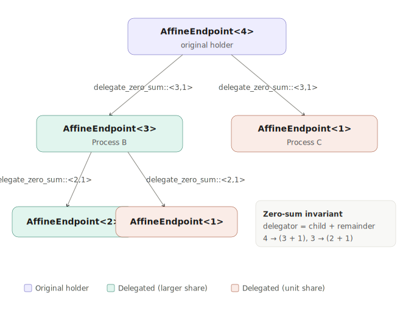

---

## Channel Lifecycle State Machine — Definition A.31

The channel lifecycle is explicitly modelled as a three-state machine. This is **Definition A.31** as referenced in the Polymorphic Mathematical Architecture document.

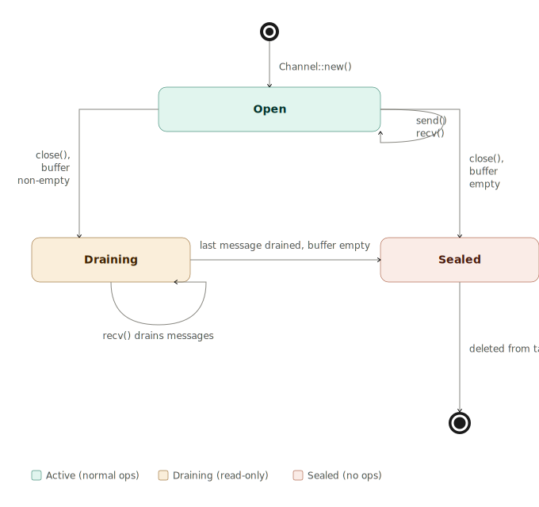

### `ClosureState` Transition Table

| Current State | Trigger | Next State |
|---|---|---|
| `Open` | `close()`, buffer non-empty | `Draining { initiator, initiated_at }` |
| `Open` | `close()`, buffer empty | `Sealed` |
| `Draining` | `recv()` removes last message | `Sealed` |
| `Draining` | any `send()` attempt | Rejected → `IpcError::ChannelDraining` |
| `Sealed` | any operation | Rejected → `IpcError::Closed` |

### Semantic Properties

| Property | `Open` | `Draining` | `Sealed` |
|---|---|---|---|
| `is_open()` | `true` | `false` | `false` |
| `is_closing()` | `false` | `true` | `false` |
| `is_closed()` | `false` | `false` | `true` |
| Sends allowed | Yes | No | No |
| Recvs allowed | Yes | Yes (drain only) | No |

**Key design decision:** Distinguishing `Draining` from `Sealed` allows the kernel to return `IpcError::ChannelDraining` (rather than `IpcError::Closed`) to senders, telling them that the channel is being shut down but messages are still in flight. A receiver that receives `IpcError::Closed` on an empty `Sealed` channel knows the shutdown is complete.

The `initiated_at: u64` field records the scheduler tick at close time — this is used by the temporal log to reconstruct exactly when shutdown was initiated during replay.

**Lemma (Draining Completeness):** A channel in `Draining` state will always reach `Sealed` in finite time, given that:

1. The ring buffer has bounded capacity $C < \infty$.
2. Each successful `recv()` removes exactly one message.
3. No new messages are enqueued (blocked by the `is_closing()` guard on send).

Therefore $\text{pending}$ is a non-increasing natural number bounded below by 0, and the transition to `Sealed` occurs when $\text{pending} = 0$. $\square$

---

## Backpressure Algebra

The backpressure module (`backpressure.rs`) is a **pure policy module** — all its functions are side-effect-free except `observe_send_attempt`, which increments hit counters.

### Load Level Classification

Let $n = \text{channel.buffer.len()}$ (pending messages) and $C = \text{CHANNEL\_CAPACITY} = 4$.

| Level | Condition | Meaning |
|---|---|---|
| `Idle` | $n = 0$ | Queue empty |
| `Available` | $0 < n < \tau_{hp}$ | Queue has headroom; i.e., $n \in \{1, 2\}$ |
| `High` | $\tau_{hp} \leq n < C$ | Queue under load; i.e., $n = 3$ |
| `Saturated` | $n = C$ | Queue physically full; i.e., $n = 4$ |

where $\tau_{hp} = 3$ as derived in the constants section.

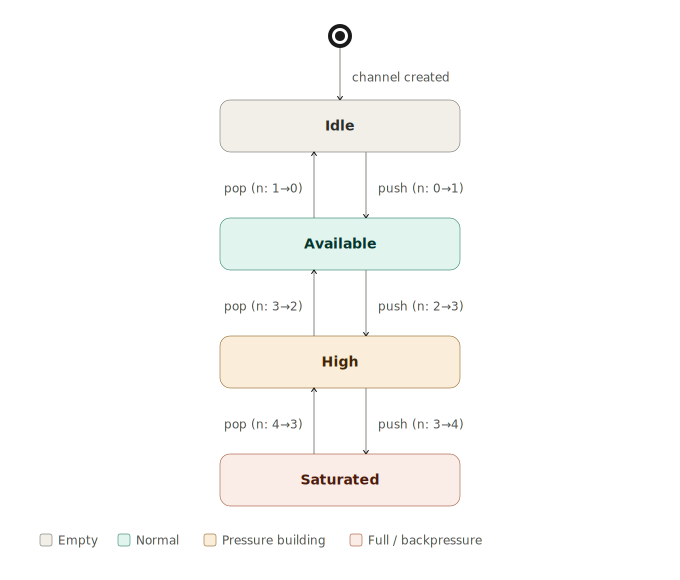

### Action Decision Matrix

Given the backpressure level and channel flags, the recommended action for a send attempt is:

| Level | Flags | Action |
|---|---|---|
| `Idle` | any | `Commit` |
| `Available` | any | `Commit` |
| `High` | `ASYNC & BOUNDED & !HIGH_PRIORITY` | `Refuse` |
| `High` | all other combinations | `Commit` |
| `Saturated` | `ASYNC` | `Refuse` |
| `Saturated` | `!ASYNC` (Reliable / Sync) | `Defer` |

**Design rationale:** Reliable (non-async) channels block the sender when full — the caller is suspended via `SliceScheduler::prepare_block_on` until capacity is available. Async channels cannot block, so they refuse. High-priority async channels are exempt from high-pressure refusal — they always commit as long as the queue is not physically full.

The condition `ASYNC & BOUNDED & !HIGH_PRIORITY` is the conservative case: the channel is non-blocking, has an explicit capacity limit, and is not flagged as a priority path. All three conditions together trigger early refusal at `High` pressure, acting as a rate limiter before full saturation occurs.

### `ChannelFlags` Bitmask

| Bit | Constant | Meaning | Default |
|---|---|---|---|
| 0 | `BOUNDED` | Capacity-limited mode | Yes |
| 1 | `UNBOUNDED` | Uncapped queue (overrides `BOUNDED`) | No |
| 2 | `HIGH_PRIORITY` | Exempt from high-pressure refusal | No |
| 3 | `RELIABLE` | Blocking on full (Defer on Saturated) | Yes |
| 4 | `ASYNC` | Non-blocking (Refuse on Saturated/High-bounded) | No |

A freshly created channel has `BOUNDED | RELIABLE` as default flags, with priority 128 (mid-range).

### `BackpressureSnapshot`

The snapshot struct captures the full backpressure state at a point in time:

```rust
pub struct BackpressureSnapshot {
    pub pending: usize,
    pub capacity: usize,
    pub high_watermark: usize,
    pub high_pressure_hits: u32,
    pub saturated_hits: u32,
    pub level: BackpressureLevel,
    pub recommended_action: BackpressureAction,
}
```

`high_watermark` records the maximum ever observed `pending` for this channel. `high_pressure_hits` and `saturated_hits` count how many send attempts were made while the queue was at each load level — these are critical metrics for capacity planning.

---

## Admission Control Pipeline

The admission module (`admission.rs`) is a **pure decision function** — it takes `(&Channel, &ChannelCapability)` and returns a typed decision without mutating state.

### Send Decision Pipeline

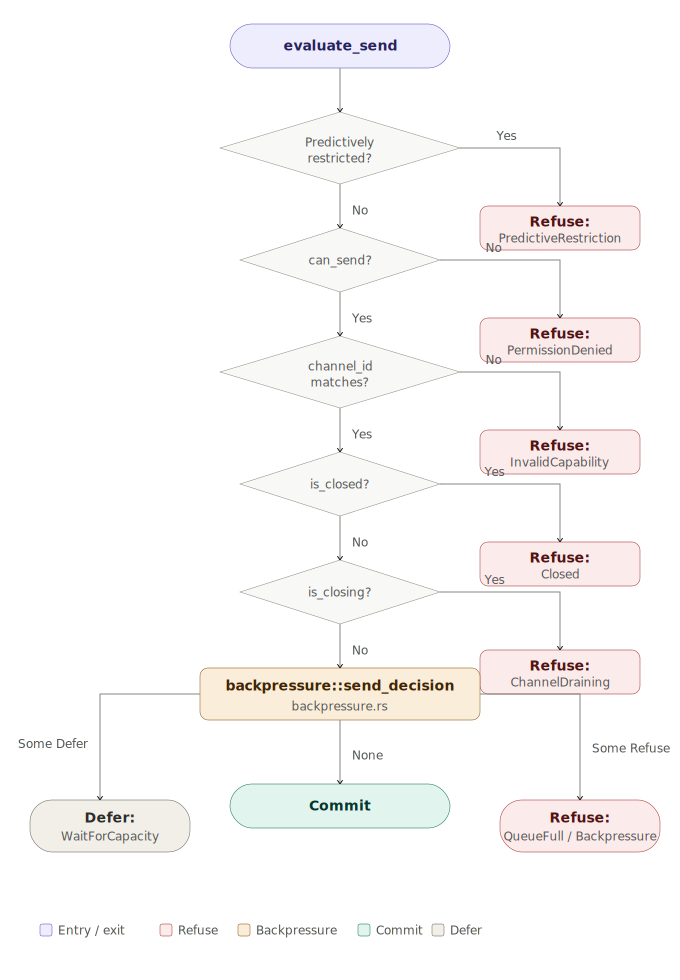

### Receive Decision Pipeline

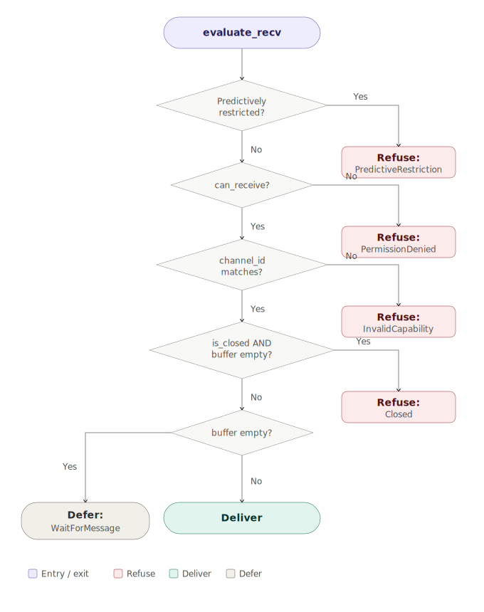

**Observation:** A channel in `Draining` state still delivers messages — the `is_closed()` guard (which only returns true for `Sealed`) allows receivers to drain the in-flight queue before the channel is fully closed. A drain in progress never starves receivers.

### `IpcRefusal` Taxonomy

| Variant | Trigger | Security Action |
|---|---|---|
| `PredictiveRestriction` | Security subsystem ML anomaly flag on process | Predictive revocation of Channel rights; audit entry written |
| `PermissionDenied` | `ChannelCapability` lacks the required right | `intent_capability_denied()` + audit entry |
| `InvalidCapability` | `capability.channel_id != channel.id` | `intent_invalid_capability()` + audit entry |
| `Closed` | Channel is `Sealed` | No-op (normal condition) |
| `ChannelDraining` | Channel is `Draining`; new send rejected | No-op (normal teardown) |
| `Backpressure` | Async queue at high load (not full) | No-op |
| `QueueFull` | Queue physically full, async channel | No-op |
| `QueueEmpty` | Reserved | N/A |

**The `PredictiveRestriction` path is noteworthy:** when the security module determines that a process is anomalous (e.g., it has exhibited abnormal IPC rate or capability access patterns), it sets a predictive restriction flag that lasts until a specified `restore_at` tick. During this window, every IPC send and recv attempt by that process is refused. Critically, the capability manager also **predictively revokes** the process's `CHANNEL_SEND` / `CHANNEL_RECEIVE` right until the tick expires — this means not just this message, but all future channel operations are blocked at the capability layer, not just at the admission layer.

---

## Scheduler Integration — Blocking and Wakeup

Blocking IPC sends and receives are deeply integrated with the `SliceScheduler`. The integration is achieved via **channel wait addresses** — synthetic virtual addresses that uniquely identify the wait condition.

### Wait Address Computation

```rust
const fn channel_wait_addr(id: ChannelId, kind: usize) -> usize {
    ((id.0 as usize) << 2) | kind
}
```

Where:
- `IPC_WAIT_KIND_MESSAGE = 0x1` — a receiver is waiting for a message to arrive
- `IPC_WAIT_KIND_CAPACITY = 0x2` — a sender is waiting for queue capacity to free

For channel with `id = N`, the wait addresses are:

$$W_{\text{message}}(N) = (N \ll 2) \;|\; 1 \qquad W_{\text{capacity}}(N) = (N \ll 2) \;|\; 2$$

These are guaranteed non-colliding for distinct channel IDs because the shift places `kind` in the two least-significant bits, while distinct IDs produce distinct values in bits 2 and above. The total collision-free channel namespace is $2^{62}$ logical channels (limited in practice by `MAX_CHANNELS = 16`).

### Wakeup Discipline

| Event | Strategy |
|---|---|
| Message enqueued (send commits) | `wake_one_receiver()` — wakes the head of `waiting_receivers` |
| Message dequeued (recv completes) | `wake_one_sender()` — wakes the head of `waiting_senders` |
| Channel sealed | `wake_all_receivers()` — all blocked receivers unblocked to see `IpcError::Closed` |
| Channel enters draining | `wake_all_senders()` — all blocked senders unblocked to see `IpcError::ChannelDraining` |

### Two-Phase Block Protocol

The `prepare_block_on` / `commit_block` split avoids the TOCTOU race where a wakeup fires between condition evaluation and process suspension:

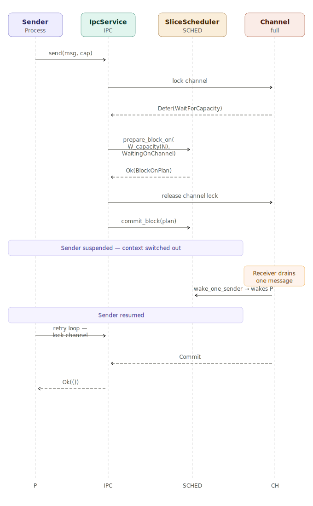
**Theorem (No Spurious Wakeup Data Loss):** A process woken by `wake_one_receiver` will always find at least one message in the ring buffer to consume, because:

1. `wake_one_receiver` is called only inside the channel's mutex, after a successful enqueue.
2. The receiver retries `evaluate_recv` under the same mutex after wakeup.
3. No other process can consume the message between wakeup and retry without first acquiring the channel mutex.

Therefore the FIFO ordering of the wait queue combined with the mutex discipline eliminates all spurious wakeup scenarios. $\square$

---

## IpcService — The Kernel-Facing Facade

```rust
pub struct IpcService {
    pub(crate) channels: Mutex<ChannelTable>,
    next_cap_id: AtomicU32,
}
```

The `IpcService` is a global `Once<IpcService>` singleton, lazily initialized on first access via `ipc()`. The `channels` mutex serialises all table mutations.

### Channel Creation

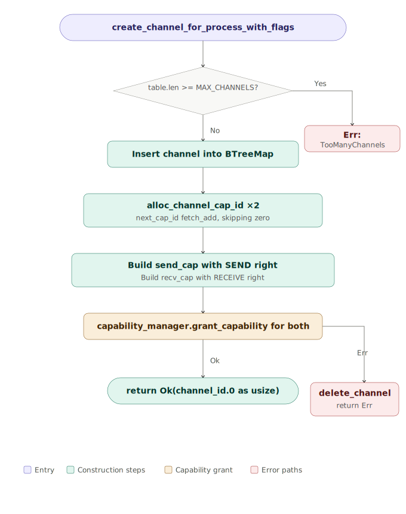

`create_channel` returns a symmetric pair `(send_cap, recv_cap)` — the two capabilities have `SEND` and `RECEIVE` rights respectively. Both have `cap_id` values allocated from `next_cap_id: AtomicU32` incremented with `Ordering::Relaxed`. Zero is explicitly skipped to prevent null cap IDs from appearing in the system.

### Public API Surface

| Function | Description |
|---|---|
| `create_channel()` | Create a channel owned by `ProcessId::KERNEL` |
| `create_channel_for_process(pid)` | Create with default flags (`BOUNDED \| RELIABLE`, priority 128) |
| `create_channel_for_process_with_flags(pid, flags, priority)` | Full control over flags and priority |
| `send_message(channel_id, data)` | Kernel-owned send |
| `send_message_for_process(pid, channel_id, data)` | Process send with capability resolution |
| `send_message_with_caps_for_process(pid, channel_id, data, caps)` | Send with attached capabilities |
| `receive_message(channel_id, buf)` | Kernel-owned recv |
| `receive_message_for_process(pid, channel_id, buf)` | Process recv with capability resolution |
| `receive_message_with_caps_for_process(pid, channel_id, buf, caps_out)` | Recv with capability extraction |
| `close_channel(channel_id)` | Kernel-owned close |
| `close_channel_for_process(pid, channel_id)` | Process close via `CLOSE` right |
| `purge_channels_for_process(pid)` | Remove all channels created by `pid` (called on process termination) |
| `ipc()` | Get the global `&'static IpcService` |

### Capability Resolution Layer

When a process calls `send_message_for_process`, the kernel resolves the process's capability before entering the admission pipeline:

```
resolve_channel_capability(source, channel_id, ChannelAccess::Send)
    → query capability_manager for a Channel capability with CHANNEL_SEND right
    → return ChannelCapability or IpcError::PermissionDenied
```

This ensures that even the kernel-facing API layer is capability-checked — there is no privileged "kernel bypass" path that skips the admission pipeline.

### `IpcService.send()` Blocking Loop — Full Pseudocode

```
loop {
    let plan = {
        lock(channels)
        channel = table.get_mut(channel_id)?
        backpressure::observe_send_attempt(channel)   // record hit counters
        match admission::evaluate_send(channel, &cap):
            Commit  => {
                channel.send_with_observed_pressure(msg, &cap)
                wake_one_receiver()
                temporal::record_send()
                return Ok(())
            }
            Refuse(reason) => {
                channel.reject_send(reason, &cap, &msg)   // triggers audit + predictive_revoke
                return Err(IpcError from reason)
            }
            Defer(WaitForCapacity) => {
                channel.record_defer_send()
                let plan = slice_scheduler::prepare_block_on(
                    channel_capacity_wait_addr(channel_id), WaitingOnChannel
                )?
                plan   // exit lock scope
            }
            Defer(other) => {
                channel.defer_send(&msg, &cap)
                return Err(IpcError::WouldBlock)
            }
    };
    slice_scheduler::commit_block(plan);   // yield CPU
    // loop — retry from top on wakeup
}
```

---

## Channel Diagnostics

Every channel exposes a rich read-only `ChannelDiagnostics` snapshot:

| Field | Type | Description |
|---|---|---|
| `id` | `ChannelId` | Channel identifier |
| `creator` | `ProcessId` | Process that created the channel |
| `pending` | `usize` | Current messages in the ring buffer |
| `capacity` | `usize` | Maximum queue depth (`CHANNEL_CAPACITY = 4`) |
| `closure` | `ClosureState` | Current lifecycle state |
| `empty` | `bool` | `pending == 0` |
| `full` | `bool` | `pending == capacity` |
| `priority` | `u8` | Priority (0 = highest, 255 = lowest; default 128) |
| `flags_bits` | `u32` | Raw `ChannelFlags` bitmask |
| `send_refusals` | `u32` | Total send attempts that were refused |
| `recv_refusals` | `u32` | Total recv attempts that were refused |
| `protocol` | `ChannelProtocolState` | Current channel protocol binding and Temporal session state |
| `pressure` | `BackpressureLevel` | Current load level |
| `pressure_action` | `BackpressureAction` | What a send attempt would result in right now |
| `high_watermark` | `usize` | Highest ever observed queue depth |
| `high_pressure_hits` | `u32` | Send attempts under `High` pressure |
| `saturated_hits` | `u32` | Send attempts under `Saturated` pressure |
| `sender_wakeups` | `u32` | Times a sender was woken from blocked state |
| `receiver_wakeups` | `u32` | Times a receiver was woken from blocked state |
| `waiting_receivers` | `usize` | Receiver processes currently blocked on this channel |
| `waiting_senders` | `usize` | Sender processes currently blocked on this channel |

`IpcDiagnostics` bundles all channels: `active_channels`, `max_channels`, `channels: [Option<ChannelDiagnostics>; MAX_CHANNELS]`.

---

## Temporal Persistence Protocol

IPC channel state participates in the kernel's temporal log. Every significant channel event writes a compact event record to the temporal log, and version-2 channel snapshots capture the committed IPC state needed for replay across reboots.

### Event Types

| Constant | Byte | Meaning |
|---|---|---|
| `TEMPORAL_CHANNEL_EVENT_SEND_REFUSED` | `0x01` | A send attempt was refused |
| `TEMPORAL_CHANNEL_EVENT_RECV_REFUSED` | `0x02` | A recv attempt was refused |
| `TEMPORAL_CHANNEL_EVENT_CLOSE` | `0x03` | Channel close initiated |

### Wire Format (28-byte minimum)

| Offset | Bytes | Field |
|---|---|---|
| 0 | 1 | `TEMPORAL_OBJECT_ENCODING_V1` (magic byte) |
| 1 | 1 | `TEMPORAL_CHANNEL_OBJECT` (object type tag) |
| 2 | 1 | `event` byte (see above) |
| 3 | 1 | reserved padding |
| 4 | 4 | `channel_id` little-endian u32 |
| 8 | 4 | `owner_pid` little-endian u32 |
| 12 | 4 | `payload_len` little-endian u32 |
| 16 | 2 | `caps_len` little-endian u16 |
| 18 | 2 | `queue_depth` little-endian u16 |
| 20 | 8 | reserved / future extension |

### Version 2 Channel Snapshots

The channel snapshot payload written by `persist_temporal_snapshot()` carries the
committed replay state, not just the compact event record. It includes:

- closure state
- protocol/session state
- send and recv refusal counters
- backpressure counters and wake counters
- channel-local wait queues
- buffered messages with attached capabilities

`restore_temporal_snapshot_payload()` restores the committed queue, wait queues,
closure, protocol, counters, and pending ticketed IPC transfers from that
versioned payload.

### Restoration Flow

On boot, `temporal_apply_channel_payload(payload)` is called for each IPC record in the temporal log:

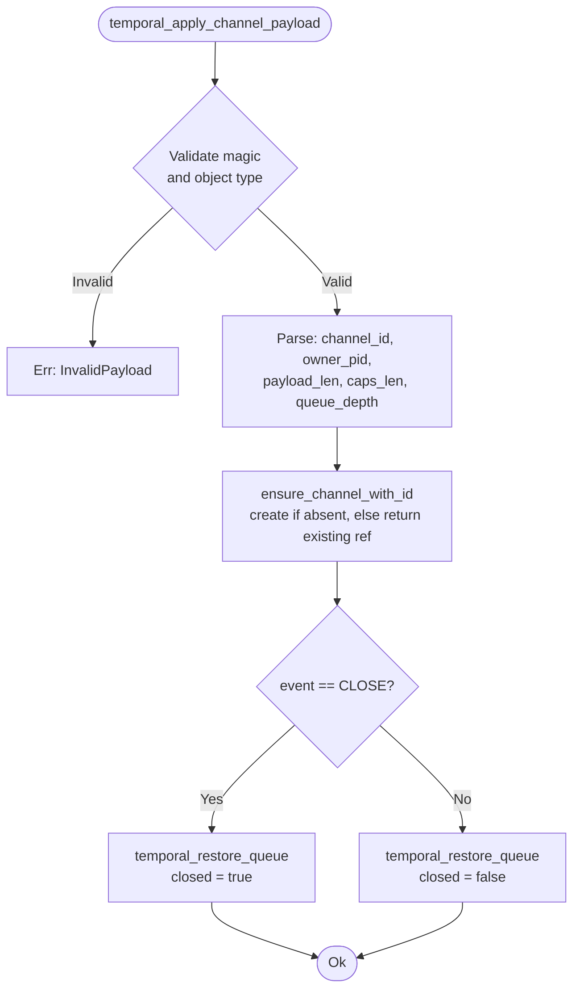

`ensure_channel_with_id` is idempotent: it creates the channel if it does not yet exist in the table, or returns a mutable reference to the existing one. This means temporal restoration can run in any order.

**Lemma (Temporal Restoration Idempotency):** Calling `temporal_apply_channel_payload` twice with the same payload produces the same final state as calling it once, because `ensure_channel_with_id` is a no-op when the channel already exists, and `temporal_restore_queue` unconditionally sets the queue depth to the same value. $\square$

---

## Self-Test Suite

`selftest.rs` provides 678 lines of in-kernel unit tests through `run_selftest()`. This returns an `IpcSelftestReport` with pass/fail status for up to `IPC_SELFTEST_CASES` individual test cases.

### Test Categories

| Category | Properties Exercised |
|---|---|
| Basic send/recv | Messages round-trip with correct payload and `EventId` |
| Capacity limits | Queue reaches `Saturated` at exactly `CHANNEL_CAPACITY` messages |
| Backpressure thresholds | `High` pressure at $n = \tau_{hp} = 3$; `Saturated` at $n = 4$ |
| Reliable channel blocking | Full queue defers (not refuses) on reliable channel |
| Async channel non-blocking | Full queue refuses (not defers) on async channel |
| High-priority async | High-priority async channel commits at `High`, refuses at `Saturated` |
| Closure: drain | `Draining` state drains correctly to `Sealed` |
| Closure: immediate close | Empty channel transitions directly to `Sealed` |
| Capability rights | Send-only cap refuses recv; receive-only cap refuses send |
| Capability forgery | Capability with tampered `token` fails `verify()` |
| Causal chain | `with_cause` correctly propagates `cause` field |
| Affine delegation | `delegate_zero_sum::<A,B>` with $A+B=C$ succeeds; $A+B \neq C$ fails |
| Multi-channel | Up to `MAX_CHANNELS = 16` channels coexist without interference |
| Temporal restoration | Channel state restored correctly from synthetic 28-byte payload |
| Ticketed transfer | One-time capability tickets consume source authority and reject duplicate/tampered import |
| Protocol typing | Temporal channel session/phase state rejects malformed frames and invalid transitions |
| Snapshot roundtrip | Channel snapshot restore round-trips queued payload, wait queues, protocol state, closure state, and counters |
| Wakeup accounting | `sender_wakeups` / `receiver_wakeups` counters increment correctly |
| Diagnostics | Snapshot fields match observed live state |

---

## Security Integration

The IPC module is deeply wired into the security subsystem at four points:

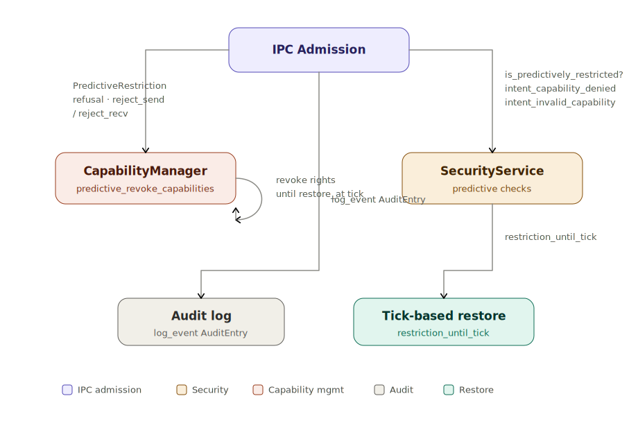

### Prediction → Revocation → Audit Chain

When a `PredictiveRestriction` refusal fires, the full chain is:

1. `security().restriction_until_tick(capability.owner)` — compute the tick at which the restriction expires.
2. `capability_manager().predictive_revoke_capabilities(owner, Channel, CHANNEL_SEND, restore_at)` — mark all of the process's channel send capabilities as revoked until `restore_at`.
3. `security().intent_capability_denied(owner, Channel, CHANNEL_SEND, channel_id)` — update the security subsystem's behavioural model for this process (feeding back into the predictive restriction algorithm).
4. `security().log_event(AuditEntry::new(PermissionDenied, owner, cap_id).with_context(channel_id))` — write a permanent audit record.
5. `channel.record_send_refusal()` — increment `saturation_hits` and write a temporal log entry.

This chain means that a single anomalous send attempt by a process does not just refuse that message — it **proactively degrades that process's IPC access** going forward and creates a persistent forensic record.

---

## Error Taxonomy

| `IpcError` Variant | Cause | Recovery |
|---|---|---|
| `Closed` | Channel is `Sealed` | Create a new channel |
| `ChannelDraining` | Channel is `Draining`; new send rejected | Wait for new channel |
| `WouldBlock` | Queue full (async path) or deferred send/recv returned | Retry or switch to blocking API |
| `InvalidCap` | `capability.channel_id` does not match | Verify capability derivation |
| `PermissionDenied` | Missing rights or predictive restriction active | Check process capability grants |
| `TooManyChannels` | `MAX_CHANNELS = 16` already in use | Delete unused channels |
| `MessageTooLarge` | `payload.len() > MAX_MESSAGE_SIZE = 512` | Split payload across multiple messages |
| `TooManyCaps` | `caps_len > MAX_CAPS_PER_MESSAGE = 16` | Reduce capability count per message |

---

## Full Data Flow Walkthrough

### Synchronous Reliable Send — Happy Path

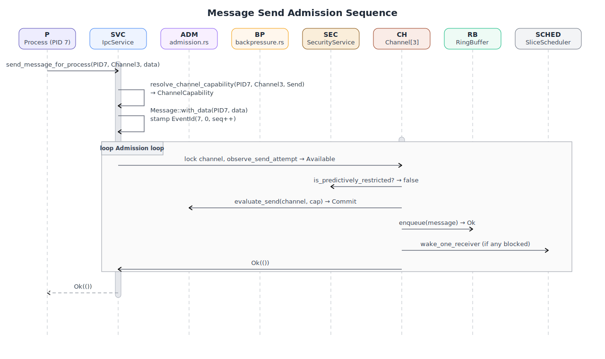

### Async Channel at High Pressure — Refuse Path

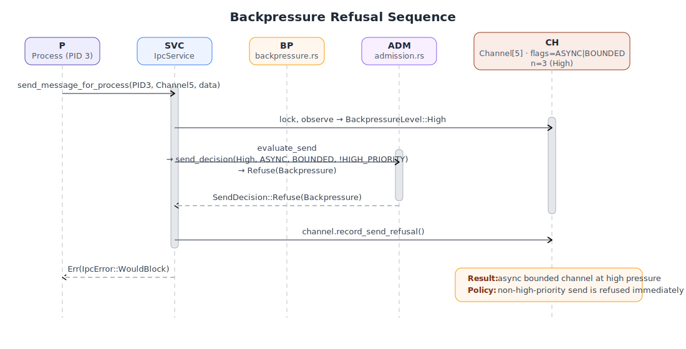

### Reliable Channel Full — Block and Wakeup

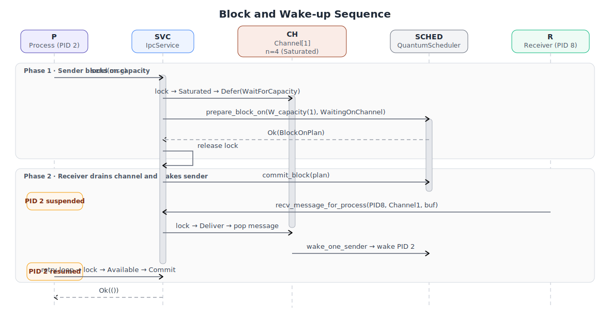

### PredictiveRestriction Refusal — Full Security Chain

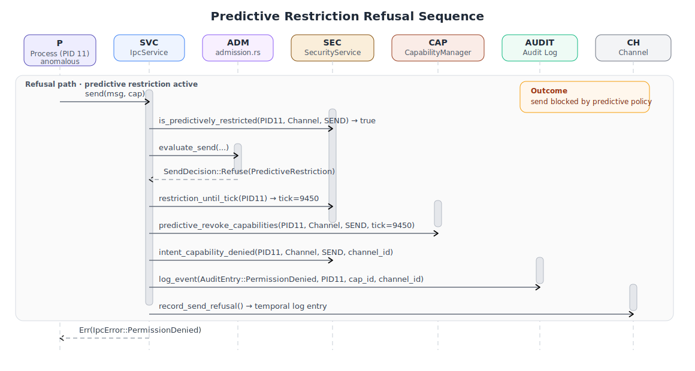

---

## Formal Properties and Proofs

### Property 1: Bounded Queue Soundness

**Statement:** The ring buffer never contains more than `CHANNEL_CAPACITY` messages.

**Proof:** `RingBuffer` uses a fixed-size backing array of length `CHANNEL_CAPACITY`. `push()` returns `false` if `len() == CHANNEL_CAPACITY`. The admission pipeline ensures `channel.send_with_observed_pressure()` is only called after `SendDecision::Commit` — which the backpressure module only emits when `level != Saturated`. Therefore `push()` is only called when the buffer is not full. $\square$

---

### Property 2: Capability Token Non-Forgeability

**Statement:** With high probability, a process that does not possess the kernel's SipHash-2-4 secret key cannot produce a `(Capability, token)` pair that passes the MAC `verify()` check.

**Proof sketch:** The MAC covers a 40-byte serialisation of `(TOKEN_CONTEXT, cap_id, object_id, rights, cap_type, extra[0..4])`. Forgery requires finding an input $m'$ that produces the same tag $t$ under key $k$ without knowing $k$. Under the PRF assumption for SipHash-2-4 with a 128-bit key, the probability of successful forgery per attempt is bounded by $2^{-64}$ (tag length). $\square$

---

### Property 3: Affine Delegation Prevents Capability Amplification

**Statement:** The total channel-send capacity held by all processes is conserved across an `affine_split::<A, B>()` operation.

**Proof:** `self` is moved (consumed) by `delegate_zero_sum`. After the split, only `AffineEndpoint<A>` and `AffineEndpoint<B>` exist in the system. The invariant $A + B = C$ is checked at runtime and returns `Err` otherwise. Therefore:

$$\text{total capacity after} = A + B = C = \text{total capacity before} \quad \square$$

---

### Property 4: No Deadlock in Lock Ordering

**Statement:** The IPC module does not deadlock in its lock acquisition protocol.

**Proof:** There is exactly one mutex in the IPC module: `IpcService.channels: Mutex<ChannelTable>`. The scheduler's `prepare_block_on` and `commit_block` are called _outside_ the mutex (the lock is released before `commit_block`). The `security()` methods called inside the lock are either wait-free (atomic operations) or acquire the security module's own lock — but the security module never calls back into IPC while holding its lock (it calls `capability_manager()`, which has its own independent lock). Therefore there are no cyclic lock dependencies. $\square$

---

### Property 5: Draining Completeness

**Statement:** A channel in `Draining` state always reaches `Sealed` in finite time under any fair scheduling policy.

**Proof:** Let $n$ be the current `pending` count. The `Draining` state has:

1. $n \leq C < \infty$ (bounded by `CHANNEL_CAPACITY`)
2. Every successful `recv()` decrements $n$ by exactly 1.
3. No `send()` is accepted while `is_closing()` is true.

Therefore $n$ is a non-increasing natural number with lower bound 0. By fairness, the receiver process will eventually be scheduled. Therefore there exists a finite number of `recv()` calls (at most $n_0$, the initial pending count) that will drive $n$ to 0, at which point `DrainResult::Complete` is returned and the channel transitions to `Sealed`. $\square$

---

### Property 6: EventId Field Separation

**Statement:** For any two `EventId` values computed from distinct `(p, s_c, s_m)` triples, the values are distinct.

**Proof by construction:** The encoding

$$\text{EventId} = (p \ll 32) \;|\; (s_c \ll 16) \;|\; s_m$$

places the three fields in non-overlapping bit ranges $[63:32]$, $[31:16]$, $[15:0]$. The encoding function is an injection from $\mathbb{Z}_{2^{32}} \times \mathbb{Z}_{2^{16}} \times \mathbb{Z}_{2^{16}}$ to $\mathbb{Z}_{2^{64}}$. Therefore distinct input triples produce distinct `EventId` values within each epoch. $\square$

---

### Invariant Summary

| Invariant | Enforced by |
|---|---|
| Queue depth $\leq C$ | `RingBuffer` fixed array + admission commit gate |
| $A + B = C$ after affine split | Runtime check in `LinearCapability::affine_split` |
| No send to sealed channel | `ClosureState::is_closed()` in `evaluate_send` |
| No recv from empty sealed channel | `is_closed() && buffer.is_empty()` in `evaluate_recv` |
| All capabilities signed on attach | `Message::add_capability` always calls `cap.sign()` |
| Predictive restriction revokes transitively | `reject_send` always invokes `predictive_revoke_capabilities` |
| No wakeup lost during two-phase block | `prepare_block_on` registers block before lock release |
| EventId fields non-overlapping | Bit-shift encoding with non-overlapping field ranges |
| Channel IDs unique | `BTreeMap` keyed by `ChannelId`; duplicate insert fails |
| Temporal restoration idempotent | `ensure_channel_with_id` is no-op for existing channels |
