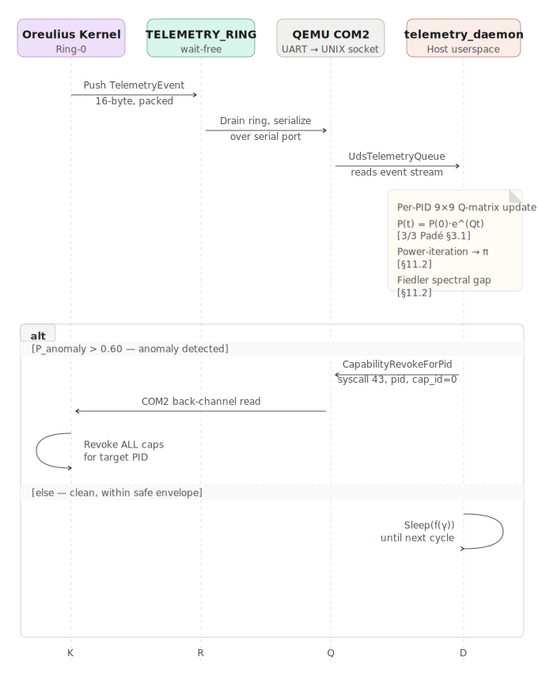

# Oreulia Userspace & Out-of-Band Services

This directory (`/services`) contains the suite of daemon processes, userspace bridges, and out-of-band mathematical agents designed to interact with the Oreulia kernel. Unlike the core OS binary residing in `/kernel` — which is rigidly constrained to a `#[no_std]` environment and the strict rules of the `LockedBumpAllocator` — the utilities housed here function autonomously on top of standard library (`std`) APIs and leverage OS-level threads, sockets, and complex math routines.

---

## Why This Directory Exists

The Oreulia architecture enforces extreme constraints on in-kernel workloads. The kernel relies on strict thermodynamic behavioral models (PMA §3 and §6) and continuous capability verification to assert secure bounds. However, these complex mathematical pipelines — such as Continuous-Time Markov Chain (CTMC) computations and Padé Approximants — are:

1. **Computationally Expensive**: Performing real-time matrix exponentiation natively in Ring-0 could introduce unmanageable micro-stutters, delaying context switches and interrupting real-time scheduling.
2. **Floating-Point Reliant**: Running `nalgebra`-based matrix mutations inside the kernel risks hardware / SIMD register corruption and bloats the kernel binary beyond acceptable limits.
3. **Architecturally Isolated by Design**: Under Oreulia's distributed trust model, the kernel focuses entirely on enforcing capability revocation *policy*. It delegates the *inference* of intent anomalies to separated **Observational Daemons** that are free to use `std` and consume CPU time without impacting Ring-0 latency.

Telemetry data generated inside the kernel via the lock-free `TELEMETRY_RING` is forwarded outward over the QEMU serial back-channel (COM2 → UNIX socket) to these host-side services.

---

## Service Registry

| Service Name | Language | Mode | Core Purpose | Interaction Medium |
|---|---|---|---|---|
| `telemetry_daemon` | Rust 2021 | Host / Out-of-Band | Runs CTMC analysis against live telemetry event streams; revokes kernel capabilities when anomaly probability exceeds threshold. | UNIX socket over QEMU `COM2` |
| *(planned)* `compositor` | Rust 2021 | Userspace ELF | Routes VGA / LFB draw calls through Oreulia IPC channels, removing framebuffer I/O from Ring-0. | Oreulia IPC channels |
| *(planned)* `vfs_manager` | Rust / WASM | Userspace ELF | Isolates filesystem index management outside of kernel memory. | Oreulia IPC / `Filesystem` Cap |

---

## Architectural Data Flow

How kernel runtime observations travel out-of-band to the Math Daemon and how revocation commands travel back:



---

## In-Depth: `telemetry_daemon`

### What It Is

A standalone Rust binary (`std`, no kernel constraints) that acts as a mathematical security co-processor alongside the running Oreulia OS. It monitors the runtime behavior of every kernel process using CTMC thermodynamics and autonomously strips capabilities from processes whose behavior diverges from safe statistical envelopes.

### Source Layout

| File | Purpose |
|---|---|
| `src/main.rs` | Entry point. Owns the Q-matrix map, detection loop, and syscall back-channel writer. |
| `src/uds_queue.rs` | `UdsTelemetryQueue` — reads 16-byte `TelemetryEvent` frames from the UNIX socket with magic-byte sync (`0xEF 0xBE 0xAD 0xDE`). |
| `Cargo.toml` | Declares `nalgebra = "0.32"` and `libc = "0.2"`. Targets native host (not `no_std`). |

### Key Constants (must stay in sync with kernel)

| Constant | Value | Kernel Mirror |
|---|---|---|
| `STATE_DIM` | `9` | `INTENT_NODE_COUNT` in `intent_graph.rs` |
| `MATH_DAEMON_PID` | `2` | Privileged PID hardcoded in syscall gate |
| `WARMUP_THRESHOLD` | `200` events | Minimum observations before anomaly fires |
| `ANOMALY_PROB_THRESHOLD` | `0.60` | Transition probability ceiling |
| `STATIONARY_THRESHOLD` | `0.50` | Eigenvector concentration on state 0 |
| `EPSILON_SAFE` | `0.05` | Minimum spectral gap; mirrors `build.rs` |
| `TELEMETRY_CAP_TYPE_VFS_WATCH` | `0xFE` | Compact VFS watch event tag |

### Detection Pipeline — Step by Step

1. **Event Ingestion**: `UdsTelemetryQueue` blocks on the UNIX socket stream. It re-syncs automatically using the 4-byte magic header on every frame, tolerating partial reads and ring overflows without crashing.
2. **Q-Matrix Update**: Each `TelemetryEvent` encodes `(pid, node_from, node_to, tick)`. The daemon increments the empirical transition count matrix for the offending PID and re-normalizes it into the infinitesimal generator **Q** (9×9 real-valued).
3. **Matrix Exponentiation**: P(t) = P(0) * e^(Qt) is evaluated using a **[3/3] Padé Approximant** — a rational polynomial approximation that is stable, efficient, and requires no eigendecomposition (PMA §3.1).
4. **Stationary Distribution**: Warm-started **power iteration** resolves the long-run eigenvector pi such that pi*Q = 0. The Fiedler spectral gap gamma = lambda_2(T) is also extracted to derive a safe polling interval (PMA §11.2).
5. **Anomaly Decision**: If probability mass on anomalous CTMC states exceeds `ANOMALY_PROB_THRESHOLD` (0.60), or eigenvector concentration on state 0 drops below `STATIONARY_THRESHOLD` (0.50), the PID is flagged.
6. **Capability Revocation**: The daemon writes a raw binary revoke command (PID + `cap_id = 0` = revoke all) back through the COM2 socket. The kernel reads this on its serial interrupt handler and invokes `CapabilityRevokeForPid` (Syscall 43) under the authority of `MATH_DAEMON_PID = 2`.

---

## Compilation — How It Fits Into the Finished OS

**These services do not compile into the kernel binary.** They are intentionally separate executables that run alongside the QEMU VM session on the host machine, or will eventually be packed into an `initrd` ramdisk for native execution in Oreulia userspace.

### Build the Daemon (Host)

```sh
cd services/telemetry_daemon
cargo build --release
# Output: target/release/telemetry_daemon
```

### Run the Full Stack

Open two terminals:

```sh
# Terminal 1 — boot Oreulia with COM2 wired to a UNIX socket
cd kernel
QEMU_EXTRA_ARGS="-serial unix:/tmp/oreulia-telemetry.sock,server,nowait" \
  ./run-x86_64-mb2-grub.sh
```

```sh
# Terminal 2 — start the math daemon
cd services/telemetry_daemon
cargo run --release
# Connects to /tmp/oreulia-telemetry.sock and begins consuming events
```

The kernel streams telemetry over COM2. QEMU maps that port to the UNIX socket. The daemon consumes it, runs CTMC analysis, and if needed writes revocations back through the same socket in the opposite direction. The two processes share no memory and require no kernel modification — the entire interface is the serial stream.