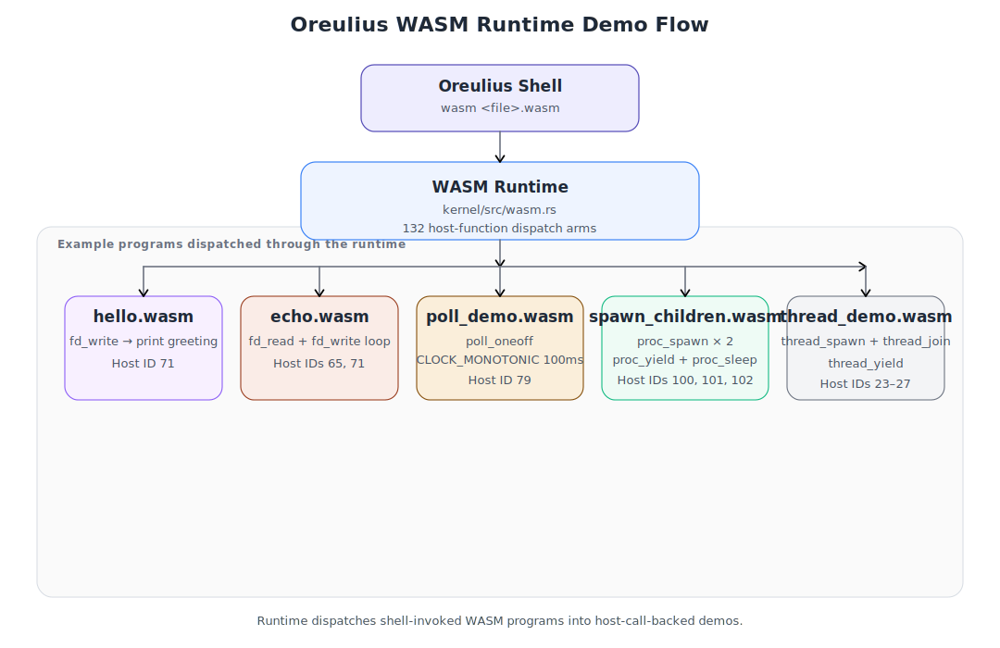
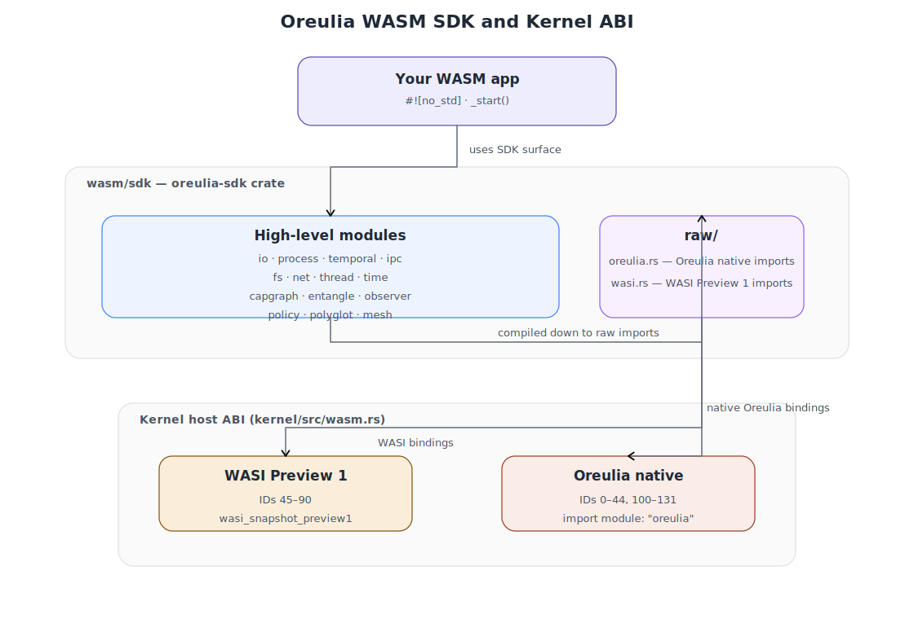
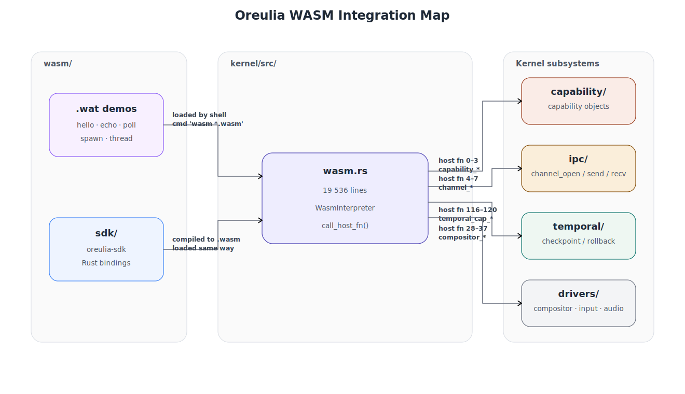

# `wasm/` — WASM Workload Layer

Oreulius is a **WASM-first unikernel**.  This folder is the external surface of
that claim: it contains the hand-written WebAssembly Text (WAT) test modules
that prove and exercise the host ABI, and the `sdk/` Rust crate that gives
application authors a typed, safe way to write Oreulius workloads in Rust
without touching raw imports.

Neither the WAT files nor the SDK are compiled into the kernel itself.
They are guest-side artifacts — code that **runs inside** the Oreulius WASM
runtime, not code that implements it.  The relationship is the same as the
difference between a Linux kernel and a userspace program: same repository,
completely separate compilation paths, separate binaries, separate address
spaces.

---

## What This Folder Is

```
wasm/
├── build.sh            build script: wat2wasm each .wat → .wasm
├── echo.wat            WASI fd_read→fd_write loop
├── hello.wat           "Hello from Oreulius!" via WASI fd_write
├── poll_demo.wat       WASI poll_oneoff clock-timeout demo
├── polyglot_provider.wat polyglot service provider demo with exact exported services
├── polyglot_consumer.wat polyglot consumer demo exercising exact-export link and negative path
├── polyglot_lineage_audit.wat polyglot lineage lookup demo for live/rebound audit semantics
├── polyglot_revocation_audit.wat polyglot lineage revoke demo for terminal audit semantics
├── polyglot_status_audit.wat polyglot lineage status demo for compact lifecycle summaries
├── polyglot_audit_stream.wat polyglot transition stream demo for rebind events
├── polyglot_page_audit.wat polyglot cursor pagination demo for lineage scans
├── wasi_admin_demo.wat WASI fd-metadata / sync / resize / renumber demo
├── spawn_children.wat  Oreulius proc_spawn demo (two child processes)
├── thread_demo.wat     Oreulius cooperative thread ABI demo
└── sdk/                typed Rust bindings for the Oreulius host ABI
    ├── Cargo.toml
    ├── rust-toolchain
    ├── oreulius.ld
    └── src/
        ├── lib.rs
        ├── io.rs        fd_read / fd_write helpers
        ├── process.rs   proc_spawn / proc_yield / proc_sleep
        ├── temporal.rs  time-bound capability grants + checkpoints
        ├── ipc.rs       handle-based channel send / recv helpers
        ├── fs.rs        typed WASI filesystem and metadata wrappers
        ├── net.rs       TCP/UDP socket helpers
        ├── thread.rs    thread_spawn / thread_join / thread_yield
        ├── time.rs      WASI clock_time_get, poll_oneoff timer
        ├── capgraph.rs  delegation-graph queries (IDs 129–131)
        ├── entangle.rs  capability entanglement (IDs 125–128)
        ├── observer.rs  capability event subscriptions (IDs 106–108)
        ├── policy.rs    runtime policy contracts (IDs 121–124)
        ├── polyglot.rs  cross-language type resolution (IDs 103–105)
        ├── mesh.rs      kernel-mesh capability routing (IDs 109–115)
        └── raw/
            ├── mod.rs
            ├── oreulius.rs   raw `extern "C"` Oreulius-native imports
            └── wasi.rs      raw `extern "C"` WASI Preview 1 imports
```

---

## Why It Is Separate from the Rest of the Rust Code

### Two Completely Different Compilation Targets

The kernel is compiled for **bare-metal x86/x86_64 or AArch64**:

```
rustc --target i686-oreulius (custom JSON)
rustc --target x86_64-unknown-none
rustc --target aarch64-unknown-none
```

The SDK is compiled for **WebAssembly**:

```
rustc --target wasm32-wasi
```

These are fundamentally incompatible instruction sets.  `i686-oreulius` and
`wasm32-wasi` produce entirely different object file formats — ELF vs. WASM
binary — with different calling conventions, different memory models (linear
32-bit WASM addressing vs. segmented/paged physical memory), and no shared
binary interface whatsoever.  Putting them in the same Cargo workspace would
require the same `rustc` invocation to target both architectures at once,
which is not how Cargo or rustc work.

### Different `no_std` Contracts

The kernel crate (`kernel/Cargo.toml`) uses `#![no_std]` with the kernel's
own allocator, interrupt handlers, and panic handler wired to VGA and serial
output.  If the SDK were in the same crate, Cargo would try to link both sets
of panic handlers into the same binary — an immediate linker collision.

The SDK also uses `#![no_std]` but with a different contract: `panic = "abort"`,
no allocator (unless the `alloc` feature is opted into), and `extern "C"` FFI
that resolves against **WASM host imports** rather than kernel symbols.

### Separate Cargo Manifests for Separate `rust-toolchain` Pins

The kernel (`kernel/rust-toolchain`) pins a specific nightly that includes the
freestanding `x86_64` and AArch64 targets and the assembly-level features the
kernel needs.  The SDK (`wasm/sdk/rust-toolchain`) pins a toolchain that has
`wasm32-wasi` support validated against the exact set of host ABI IDs exposed
by the kernel.  These can and do diverge independently.

### The Boundary Is the ABI Table

The only coupling between the two sides is the **host ABI dispatch table**
in `kernel/src/execution/wasm.rs` — 139 frozen host-function specs.  The WAT files and
the SDK's `raw/oreulius.rs` / `raw/wasi.rs` are the guest-side mirror of that
table.  As long as the IDs, signatures, and memory-layout conventions on both
sides match, the two halves can be compiled, modified, and versioned
completely independently.

---

## How It All Compiles into a Running System

```
┌────────────────────────────────────────────────────────┐
│  Developer machine (host)                              │
│                                                        │
│  cargo build --manifest-path kernel/Cargo.toml         │
│    target: i686-oreulius / x86_64 / aarch64             │
│    output: kernel.elf / kernel.bin                     │
│                                                        │
│  cargo build --manifest-path wasm/sdk/Cargo.toml       │
│    target: wasm32-wasi                                 │
│    output: oreulius_sdk.wasm  (library, not loaded)     │
│                                                        │
│  wat2wasm wasm/hello.wat -o wasm/hello.wasm            │
│    output: hello.wasm  (72 bytes)                      │
└───────────────┬────────────────────┬───────────────────┘
                │                    │
                ▼                    ▼
┌───────────────────┐   ┌────────────────────────────────┐
│  Oreulius kernel   │   │  WASM binary (guest program)   │
│  (ELF / raw bin)  │   │  e.g. hello.wasm               │
│  boots under QEMU │   │  submitted via shell command:  │
│                   │   │    wasm hello.wasm              │
│  WASM interpreter │◄──│  ← bytecode loaded into kernel │
│  + JIT engine     │   │    linear memory sandbox       │
│  (kernel/src/     │   │                                │
│   execution/      │   │  host ABI calls resolved by    │
│   wasm.rs)        │   │
│                   │──►│  call_host_fn() match table    │
└───────────────────┘   └────────────────────────────────┘
```

1. **Kernel build** — `kernel/build.sh` (or CI) compiles `kernel/src/` into a
   bare-metal binary.  The WASM runtime (`kernel/src/execution/wasm.rs`) is compiled
   into that binary.  It contains the 132-arm dispatch table and both the
   interpreter and optional JIT paths.

2. **WAT compilation** — `wasm/build.sh` calls `wat2wasm` on each `.wat`
   source file.  The output is a self-contained `.wasm` binary — a few dozen
   to a few hundred bytes of WASM bytecode.

3. **SDK compilation** — `cd wasm/sdk && cargo build --target wasm32-wasi
   --release` produces `oreulius_sdk.wasm` for use as a dependency when
   building Rust application WASM modules.

4. **Execution** — when the kernel shell receives `wasm hello.wasm`, it:
   - reads the `.wasm` bytes into the kernel heap
   - validates the binary (magic `\0asm`, version 1, section structure)
   - matches every `(import ...)` declaration against the host ABI table by
     **name** (`"fd_write"`, `"proc_spawn"`, etc.)
   - instantiates a linear memory sandbox (1–16 pages of kernel-managed memory)
   - begins execution at the exported `_start` function
   - every `call` to an imported function is dispatched through `call_host_fn`
     where the ID resolves to a kernel service (IPC, capability ops, WASI I/O,
     etc.)

The kernel binary and the `.wasm` file are **never linked together**.  There
is no ELF-level symbol binding.  The connection is runtime function-name
resolution inside the interpreter.

---

## How the WAT Test Modules Exercise the Kernel

Each `.wat` file is a focused integration test for one slice of the host ABI:



| File | Host ABI exercised | What it proves |
|---|---|---|
| `hello.wat` | `fd_write` (ID 71), `proc_exit` (ID 83) | Baseline: write path and clean exit work |
| `echo.wat` | `fd_read` (ID 65), `fd_write` (ID 71) | Dual-direction WASI I/O; iovec memory layout |
| `poll_demo.wat` | `poll_oneoff` (ID 82) | Timer/clock subscription path; event struct layout |
| `polyglot_provider.wat` | `service_register` (ID 9) | Exported service registration for the polyglot registry/link path |
| `polyglot_consumer.wat` | `polyglot_link` (105), `service_invoke` (8) | Exact-export polyglot linking plus missing-export negative path |
| `polyglot_lineage_audit.wat` | `polyglot_link` (105), `polyglot_lineage_lookup` (135) | Handle-based lineage lookup proving explicit live/rebound audit semantics |
| `polyglot_revocation_audit.wat` | `polyglot_link` (105), `polyglot_lineage_lookup` (135), `polyglot_lineage_revoke` (137), `polyglot_lineage_lookup_object` (136) | Explicit revoke path with durable terminal audit |
| `polyglot_status_audit.wat` | `polyglot_link` (105), `polyglot_lineage_status` (139), `polyglot_lineage_revoke` (137) | Compact lifecycle status query for live handles |
| `polyglot_audit_stream.wat` | `polyglot_link` (105), `polyglot_lineage_rebind` (138), `polyglot_lineage_event_query` (142) | Transition event feed for rebind/revocation monitoring |
| `polyglot_page_audit.wat` | `polyglot_link` (105), `polyglot_lineage_query_page` (141) | Cursor-based pagination of lineage records |
| `wasi_admin_demo.wat` | `path_open`, `fd_allocate`, `fd_write`, `fd_tell`, `fd_filestat_set_size`, `fd_filestat_set_times`, `fd_renumber`, `fd_sync`, `proc_exit` | Guest-side regression artifact for the completed WASI admin surface |
| `spawn_children.wat` | `proc_spawn` (100), `proc_yield` (101), `proc_sleep` (102) | Multi-process model; process scheduler interaction |
| `thread_demo.wat` | `thread_spawn` (23), `thread_join` (24), `thread_id` (25), `thread_yield` (26), `thread_exit` (27) | Cooperative threading; join/exit handshake |

---

## SDK Architecture

The SDK is structured as a thin layered library:



### `raw/` — The FFI Floor

`raw/wasi.rs` and `raw/oreulius.rs` contain only `#[link(wasm_import_module =
"...")]` `extern "C"` blocks.  Every function is `unsafe`, every integer type
is exactly what the kernel dispatch table expects (`i32`, `u32`, `i64`, `u64`).
No allocation, no abstraction.

### High-Level Modules

Each module in `src/` wraps the raw layer with:
- Rust types instead of raw integers (`&[u8]` slices, `Result<_, i32>`,
  `Option<u32>`, etc.)
- Bounds checking and null-sentinel translation (`u32::MAX` → `None`)
- Documented safety contracts for the few places where `unsafe` is still
  required (linear memory pointer arithmetic)

### `temporal.rs` — Why It Matters

The `temporal` module deserves special note because it exposes what is unique
about Oreulius: capabilities are not static grants.  They are **time-bound
objects** that auto-revoke, and they are **checkpoint-able** — the entire
capability set of a process can be snapshotted before a risky operation and
rolled back atomically if something goes wrong:

```rust
// Grant FS-read access for 10 seconds (1000 × 100 Hz ticks)
let cap = temporal::cap_grant(CapType::FsRead, Rights::READ, 1000)?;

// Snapshot capability state before a multi-step operation
let checkpoint = temporal::checkpoint_create()?;

// … perform operations that modify capability state …

// Roll back the entire capability set if anything went wrong
temporal::checkpoint_rollback(checkpoint)?;
```

This is the WASM guest-side of the same temporal machinery that governs kernel
object history in `kernel/src/temporal/`.

---

## Build Reference

### WAT → WASM (requires WABT)

```bash
# Install WABT
brew install wabt          # macOS
apt install wabt           # Debian/Ubuntu

# Compile all .wat files in this directory
./wasm/build.sh

# Compile a specific file
./wasm/build.sh hello.wat
```

Each `.wat` file compiles to a `.wasm` binary of the same name alongside it.
Sizes are typically 70–400 bytes.

### SDK (requires Rust + wasm32-wasi target)

```bash
rustup target add wasm32-wasi

cd wasm/sdk
cargo build --target wasm32-wasi --release
# → target/wasm32-wasi/release/oreulius_sdk.wasm
```

### Running Inside the Kernel

```bash
# Boot the kernel
./kernel/run.sh                   # i686
./kernel/run-x86_64-mb2-grub.sh   # x86_64

# Inside the Oreulius shell:
wasm hello.wasm
wasm echo.wasm
wasm poll_demo.wasm
wasm spawn_children.wasm
wasm thread_demo.wasm
```

---

## How This Folder Relates to the Rest of the Codebase



Every module in `kernel/src/` that registers host functions (capability,
IPC, temporal, drivers, net, scheduler) is reachable from a `.wasm` guest
via the `call_host_fn` dispatch table.  This folder is the **test harness and
developer toolkit** for all of that.  When a new host function ID is added to
the kernel, a new entry in `raw/oreulius.rs` and a new wrapper in the
appropriate high-level module document it and make it testable from Rust WASM
code without hand-writing WAT.
